# 📰 想玩Loop Engineering，可以先从这6个Hook玩法开始。

最近Loop Engineering越来越火了，也有好几个朋友问我，这个东西怎么入手，我们到底应该开始从哪设计一个loop。

这其实是一个非常有意思的问题，如果让我真说一个东西的话，我觉得是我之前文章中反复提到的一个东西。

Hook。

每一个Agent里，几乎都会有Hook这个东西，Claude Code和Codex的自动化里面，背后也都有。

loop的意思是循环，那我们任何循环，其实都有一个最基础最初始的东西，就是触发器，也就是如果你触发了某某动作，就会去执行某某命令。

其实非常像现在我们家里的一些智能家居，比如到了10点，窗帘就拉开，比如识别到我出门了，就关闭家里的所有的灯，等等等等。

这个触发的条件，就是一个Hook。

生活中也到处都是Hook，比如到公司，手机自动切换工作模式，早上闹钟到点了自己响，这些全是Hook。

Agent里面也是如此，你可以通过给Hook设置特定的规则，自动化做很多事。

比如让AI在编辑修改文件前，先检查命令有没有风险。

代码修改完毕后，自动跑lint检查质量。

以及跑长任务的时候，你切到别的页面干别的事，它干完了发推送告诉你。

当然，Hook的用途远远不止这些。

在Claude Code里也一样，把Hook挂在那些你关心的时刻上，提前设好什么时候做什么。

事情一来，它自己跑。你不在屏幕前也没关系。

打开Claude Code，在底部输入/hooks，会看到这个界面。

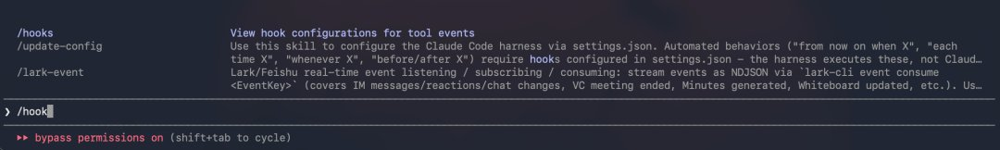

按下回车后，他会列出所有可用的Hook事件。

我记得年初看的时候只有13个，现在有将近30个了，翻了一倍多。

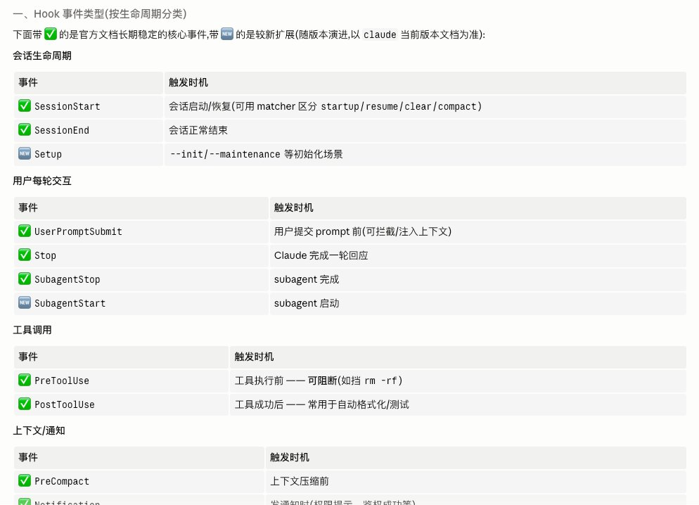

不过别被30这个数字吓到，我们日常真正会用到的，可能也就常用的那几个。

这里，我也整理了6个我觉得比较好玩的Hook玩法，希望抛砖引玉，能够给大家一些思路。

一、权限弹窗提醒

可能很多朋友都遇到过这种情况，不敢给Claude Code下了指令，切到别的页面干别的事。

过了十分钟回来一看，还没开始执行，卡在了请求权限那一步。

其实只需要跟Claude Code说一句：

帮我配置一个通知的Hook，每当需要我授权的时候，调用系统自带的工具给我来一个弹窗提醒。

发送给AI，它就会帮你配好了。

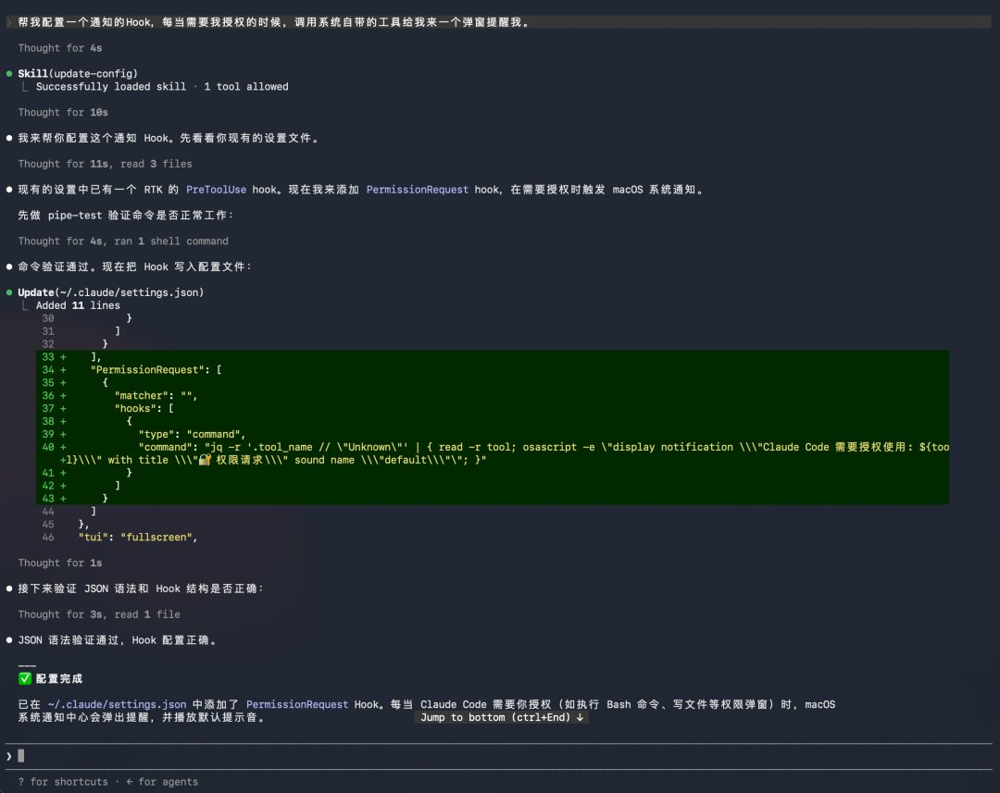

配完之后可以让Claude Code测试一下。当需要授权时，右上角会弹出提醒。再也不怕切走窗口时，AI卡住不动，白白浪费时间了。

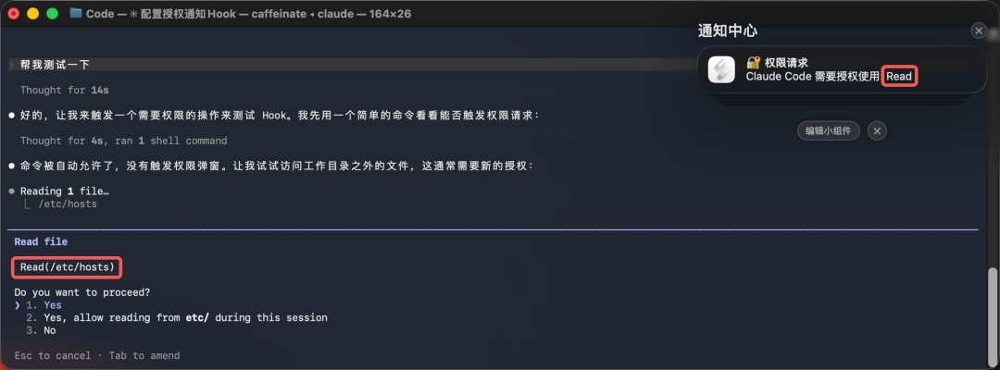

这时候肯定会有人问了，那每次授予权限的时候都会弹窗提醒，那岂不是很浪费Token。

绝大多数的Hook，其实本质上就是个代码，是个写死的规则脚本，所以在运行的时候，跟AI几乎没有啥关系，所以是也不会耗啥Token。

当然，Hook能做的远不止弹个窗，还有其他我觉得更好玩、更有意思的。

二、开机日程播报

我们有时候打开Claude Code，看到的就是一个冰冷冷的界面，不好玩。

那你就可以在对话框输入：

帮我创建一个会话开始的Hook，每当我打开或恢复Claude Code的时候，输出一段元气满满的问候。告诉我北京朝阳区今天的天气，会不会下雨、要不要带伞，调用飞书CLI拉出当天的日程安排，内容要有趣一些。

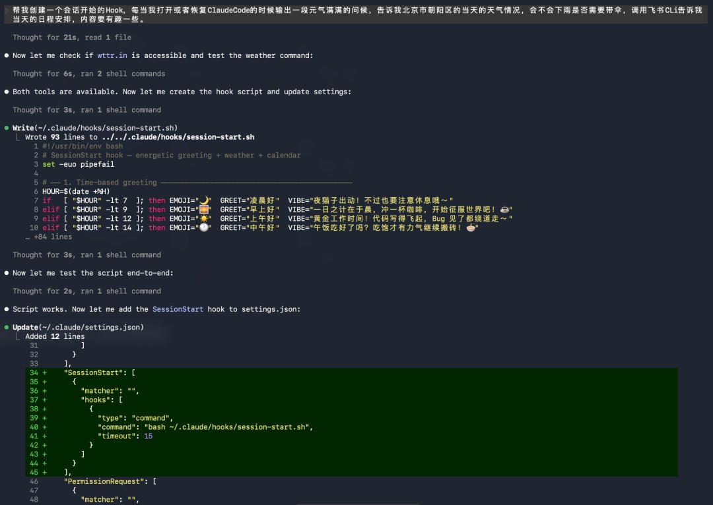

重新打开Claude Code后，就自动弹出这个提醒，让原本枯燥的终端，多了点温度。

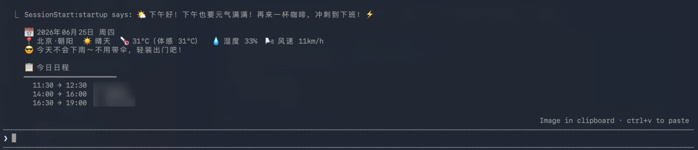

当然这只是一个前菜。

接下来这个，是我觉得最实用的一个。

三、摘要卡片

有天晚上，我想找Claude Code上周帮我改的一个方案，翻了半小时聊天记录，没找到。。。

我坐在那想了很久，我那天到底让它帮我干了什么，想了好久也没想起来。

因为每天我的Agent用的太碎了，我手上起码现在有4～5个是我长期在迭代的项目，有的时候经常会并行跑，甚至AIHOT这样的大型一点的项目，有时候是开着分支就并行着三个。

所以我经常就是确认完你的确认你的，来来回回，化身Agent鸡排哥，一天下来，你自己甚至都不一定记得今天到底发生了什么。。。

而且很多真正有价值的结论，都藏在那些长对话里，一旦上下文被压缩了，或者我一个/claer命令，后面再想找，就非常痛苦。

所以我做了个Hook，直接把这段话发给他：

帮我编写一个Hook，当上下文处于预压缩时，生成一张摘要卡片，记录当前上下文的概要内容，方便我后续查看，将文件保存到一个跨项目也可以查看的地方，总结完毕后打印到Claude Code中，方便我查看。

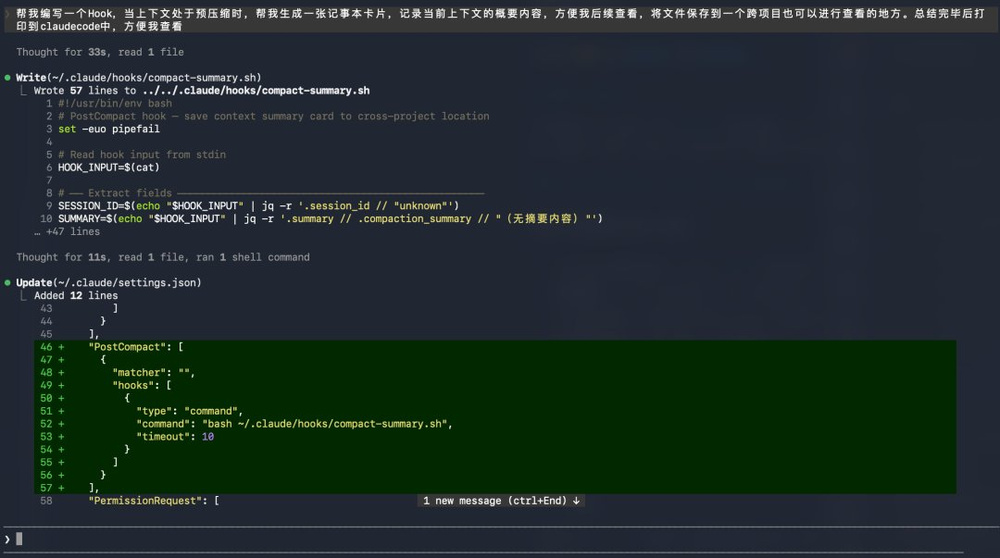

之后，在上下文快被压缩、还没丢掉的时候，他就会赶紧生成一张摘要卡片。

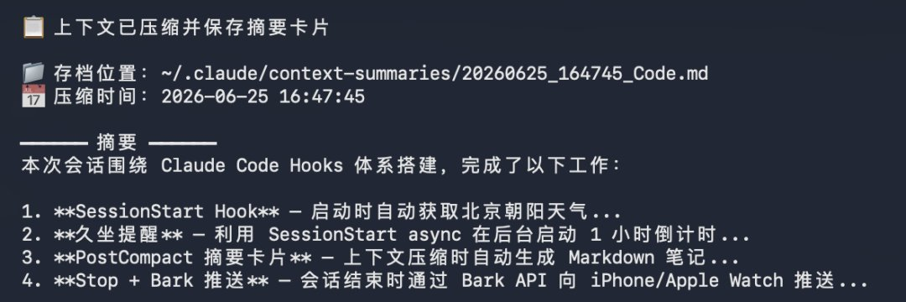

这玩意的意义还是很大的，聊天记录太长，回看成本极高，你根本不想翻。

但这不一样，它其实是一张AI替你写的工作日记。

以后你想找某天做过什么，不用翻几万字对话，翻这些看就行，一两分钟就能看完一天到底干了些啥。

能大大释放你的脑容量空间，非常好用，甚至还可以再加一个定时Hook，比如，每周五的时候，再把这些摘要日记，自动写成一个周报。

这个价值，你懂的。

四、文件自动整理

还有一个Hook的玩法我自己特别喜欢。

就是前段时间的时候，我整理电脑里面的下载文件夹，那玩意贼乱，截图、文档、PDF全混在一起，每次找东西都得翻半天。

然后我突然想到，为啥不让Claude Code帮我干这事呢，我自己每次手动整理，也太蠢了。

所以，我就做了一个Hook，逻辑特别简单，指定一个文件夹，每次有新文件丢进来，它自己看一下这是什么、内容是什么，然后自动重命名，再挪到该去的地方。

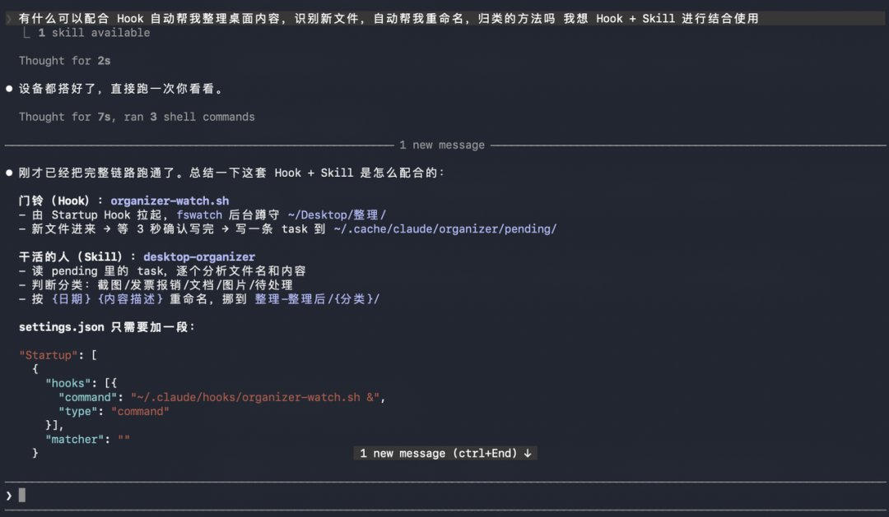

不过文件整理这件事，光靠简单代码搞不定，所以这里用了一个组合技，Hook+Skill。

Claude自己有个比喻我觉得特别准，Hook是门铃，Skill是开门以后真正干活的人。

门铃响了，说明有新东西来了。但来了以后怎么处理，还是需要模型的能力的，比如识别文件内容、判断归哪一类、按规则重命名、挪到对应文件夹等等等等，这些，靠的还是Skill最方便。

Skill也非常简单，你直接用嘴让Claude Code给你写就行了，因为每个人的需求不一样，所以还是写一个自己的是最好的。

这个Hook设置好以后，你只需要不关Claude Code，然后呢，它就会在后台帮你悄悄盯着那个文件夹。

但凡有一个新文件进来，等几秒确认传完了，它就开始干活，然后帮你自动处理完。

不管是PDF还是图片，它都能自己识别内容，会议纪要归到会议那栏，发票归到报销那栏，截图还会按内容起个看得懂的名字，然后帮你挪到对应文件夹。

整个过程你什么都不需要做，你只需要把文件丢进去了，然后它自己就整理好了。

这种感觉太爽了。

你想想看，这个模式不只我这种乱七八糟的下载文件夹整理能用。

盯着比如工作项目文件夹也行，新文件按客户名和日期自动重命名等等，有很多种自动化的变体玩法，很有意思。

五、久坐提醒

AI替你干活的感觉很爽，但他有一个副作用，就是太爽了，一坐就是十几个小时。

上周有一天，我早上九点打开Claude Code，想修一个小功能。

等我再抬头，下午四点了。

我那一刻，真的感觉回到了我十年前在学校打《文明6》的感觉。

然后我发现，这事不是我一个人，很多用AI写代码的人都这样。

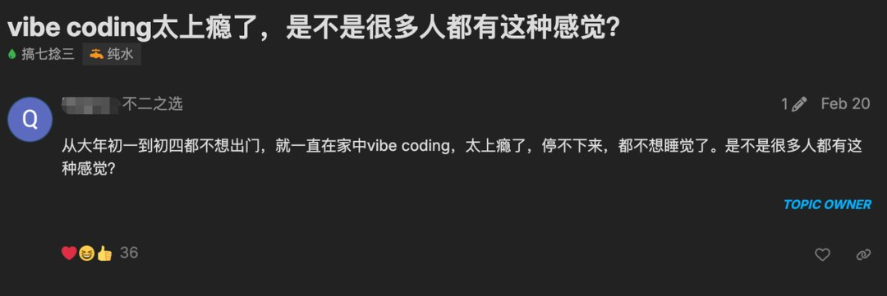

以前沉迷打游戏，现在沉迷Vibe Coding。

所以，我当时就想，做一个久坐提醒的小东西，虽然Apple Watch也有久坐提醒，每隔一小时提醒一次，但在Vibe Coding上头的时候，有的时候不太感受的到。

所以，既然长期坐在电脑前，直接在电脑上推送不就行了。

于是简单描述了一下需求，只要我启动了Claude Code之后，只要过了一个小时，Claude Code就会给我发通知提醒我休息了。

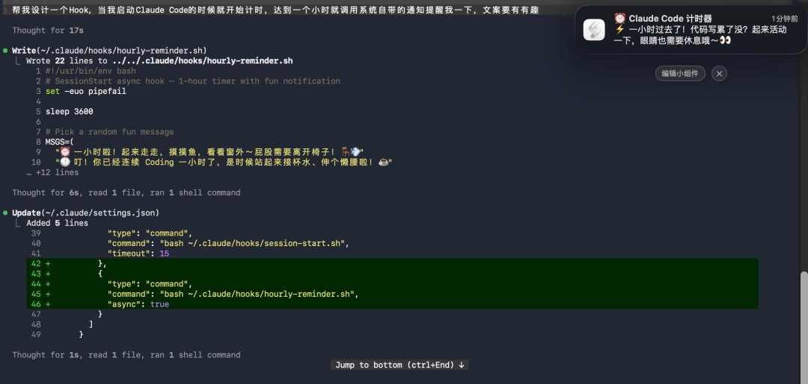

健康还是很重要的，身体才是革命的本钱，Vibe Coding上头的时候，你根本想不起来需要站起来活动，有这么一个小提醒，还是很管用的。

这里也提醒大家，让AI帮你提高效率的同时，也要多多保重身体，坐久了就起来活动一下。

后面我其实还想做一个硬件，就是更加强制性的那种。。。

比如，直接给我把键盘关了之类的，强制站起来= =

六、长任务完成推送

然后还有一个我自己的刚需。

昨天去录了一趟严敏老师的综艺，在开始之前，我让Claude Code帮我做一个比较大的功能，场上要用的，而且还有点急的那种。

我坐在电脑前，看着它一行一行地出结果，看起来一切正常，就忙别的事去了，十几分钟后突然想起来，不知道有没有开发完，然后就回到电脑前一看，还在跑。

来来回回折腾好几轮。

我就想，得让它干完活了直接叫我。

于是让Claude Code帮我研究了一下，看看有没有什么办法能让它干完活了通知我一下，最好是可以和常用软件提示音区分开的。

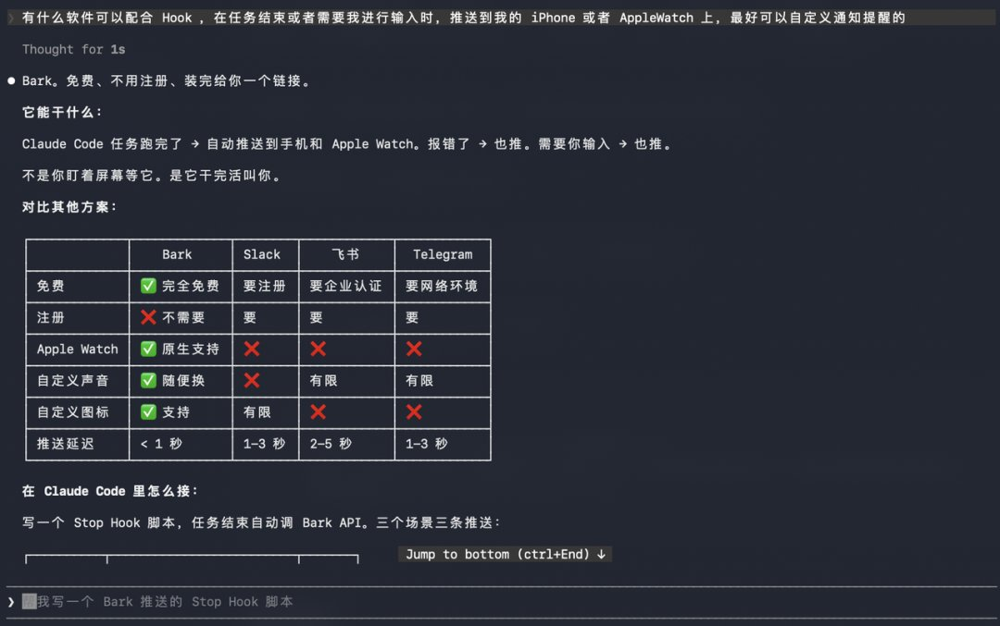

然后它就跟我说了Bark。

这是AppStore直接下载就能用的推送工具。

免费，也不需要注册，装完给你一个推送用的链接，让AI帮你配置进去就行了。

于是我顺手让Claude Code帮我写了个调用Bark的Hook。

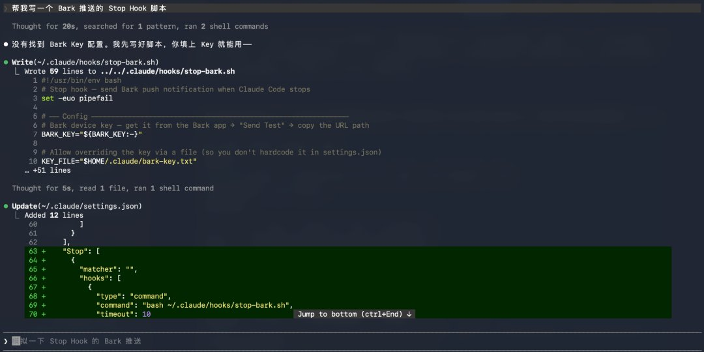

这下就舒服了。

手机和手表同时收到消息，还可以自定义推送声音，跟微信、飞书、短信这些区分开，一听声音就知道AI干完活了，可以切回去查看成果了，而且还是中文。

这个体验真的很爽。

有了这个，你就可以放心离开电脑去干别的事，根本不用惦记着切回来瞄一眼。

这个玩法也特别容易扩展，比如任务成功了发个轻松的提示音，任务失败了发个明显的提示音，让你知道要回去看看。

需要输入的时候，推送里直接写清楚它在等什么。

写在最后

未来越来越多的AI工作流，我觉得一定是事件驱动的。

新的一天开始了，它帮你启动，文件出现了，它去处理，上下文快满了，它先归档，任务完成了，它来通知，一天结束了，它自动总结。

包括现在Github上，很多项目是用Agent监控问题，别人提出了问题，它就调用Agent自动去修，修完了自动推送，推送完自动回复。。。

这件事一点都不玄乎，就是让AI从一个被动聊天框，慢慢变成你工作生活的一部分。

当然，我也不建议大家一上来就搞得太复杂。

Hook一旦开始接入真实工作流，就一定要注意稳定性和边界，尤其是涉及文件移动、删除、重命名、填表这种动作，别一上来就让它在你的重要文件夹里横冲直撞。

但只要你把边界设计好，它真的会非常好用。

Prompt解决的，是一次对话。

Skill解决的，是一类能力。

Hook解决的，是一个时刻。

从对话，到能力，到时刻，再到循环。

AI越来越成为一个替你运转的系统。

让你有时间，去做更有趣的事情。

### 🖼️ Attached Media

## 💬 Replies

### 1 @li9292 (李韭二)

*Fri Jun 26 16:34:40 +0000 2026*

@Khazix0918 [x.com/li9292/status/…](https://x.com/li9292/status/2070429871587893715?s=46)

### 2 @vibemak (Vibemak)

*Fri Jun 26 20:57:21 +0000 2026*

@Khazix0918 有没有可以看到 cc 所有行动的日志 就是 hooks 之类的操作的日志 其他行动的日志

### 3 @Mk_Flow (MK@Phoenix)

*Fri Jun 26 07:11:56 +0000 2026*

@Khazix0918 同感！我试着把Hook跟本地文件变动绑定

写个自动备份脚本，真的省心很多

你那个摘要卡片玩法学到了，解决我翻聊天记录的痛点。

### 4 @keyelifeai (Keye | 科爷的数字生命)

*Sat Jun 27 02:03:07 +0000 2026*

@Khazix0918 这个挺好，用上了，谢谢。 

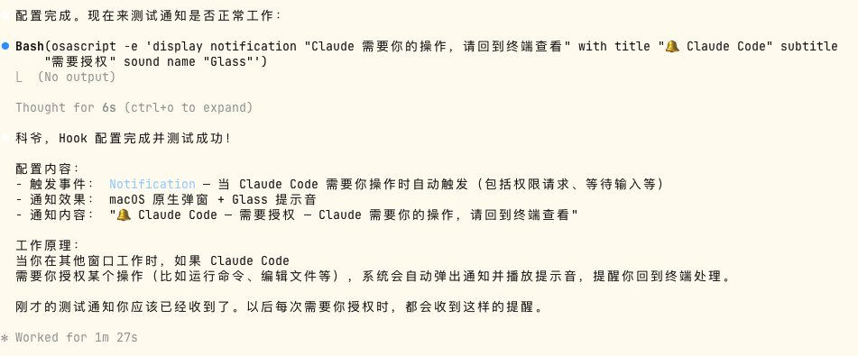

### 5 @AgentWangCN (智能体老王)

*Fri Jun 26 07:46:52 +0000 2026*

@Khazix0918 很实用的原则，就是从自己日常重复频繁的地方开始搭建Loop Engineering

### 6 @Zhongjiafe74922 (ZedSharp · 随写)

*Fri Jun 26 07:35:45 +0000 2026*

@Khazix0918 Hook - 上下文压缩生成摘要卡片真刚需，学到了。

从对话Prompt，到能力Skill，到时刻Hook，再到循环Loop，总结地太好了

### 7 @merlinh221133 (Merlin H)

*Sat Jun 27 04:09:20 +0000 2026*

@Khazix0918 建议将loop engineering和truthmark项目结合使用。loop engine会不停修改和添加代码，让项目功能出现微妙变化。而 truthmark 则为项目提供了一个“事实层”，确保你能迅速观测到不想出现的修改并指导AI进行调整
[github.com/merlinhu1/trut…](https://github.com/merlinhu1/truthmark)

### 8 @MadhuKu50935576 (Joseph)

*Wed Jul 01 11:36:23 +0000 2026*

@Khazix0918 卡兹克老师的文章真的是“太棒了”

