# 📰 装了这个AI热点Skill之后，你再也不需要自己去刷AI新闻了。

昨天，我把我的AIHOT，也就是AI热点监控网站向大家免费开放了。

得到了很多很多朋友的喜欢。

也万万没想到，第一天的访问用户就突破了10万UV，浏览的PV量更是超过了60万，而且没啥差评，也没出现啥BUG，大家反馈都还挺喜欢，我终于长长的松了一口气。

然后昨天，我收到的最多的两个需求，第一个就是深色看的太难受了，能不能增加浅色模式，这个确实是我自己的疏忽，昨天早上花了一个多小时紧急做完了，昨天中午已经上线了。

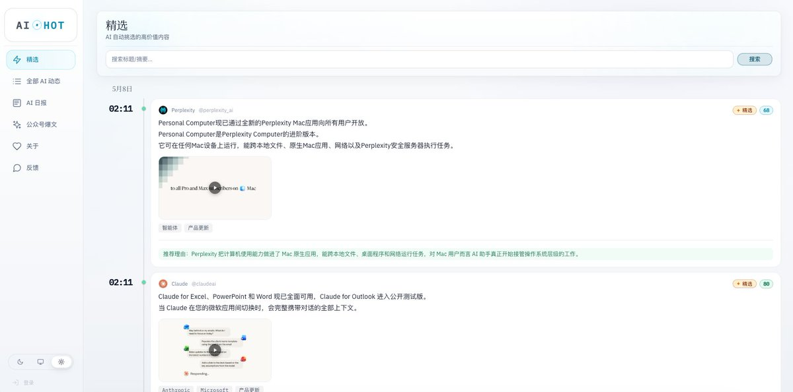

然后另一个需求，就是能不能增加skill/API/RSS。

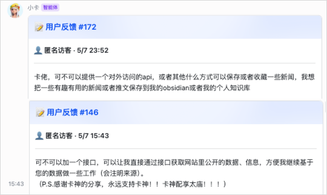

也收到了阮总的督促，那必须得干了。

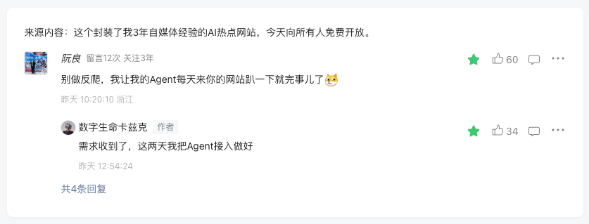

这毕竟是个AI时代，只有网站这一种形式，确实还是太笨拙了，所以晚上下班回家，决定继续打开AI开始Coding，把大家提的需求都补上。

于是，在一个通宵之后，我终于全部开发完了。

今天，我觉得也可以给所有的Agent用户，开放我的AIHOT了。

而且同样老规矩，所有人都免费使用。

网址在此：https://aihot.virxact.com

你进入AIHOT主站，点击左边的Agent接入，就可以看到了。

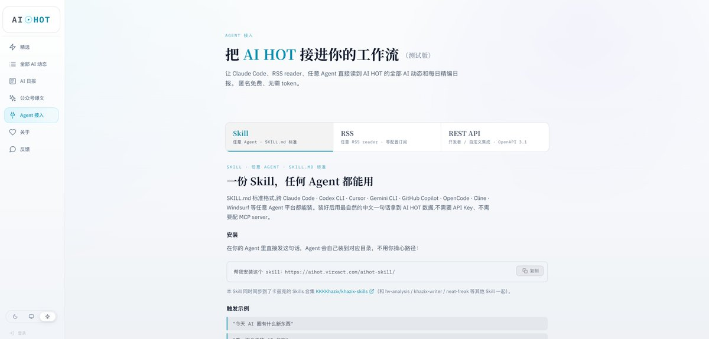

目前开放了3种接入方式：

Skill、RSS、API，分别对应三种不同的需求。

目前把我觉得能对外开放的数据，也做了最大程度的开放。

重点说说AIHOT Skill，这应该是呼声最高的，也是AI时代最重要的东西。

Skills我就不详细再去过多解释了，这玩意就是给Agent使用的技能包，如果有不懂的，可以去我的公众号搜索Skills，我写过非常多了。

你可以用任意的Agent，比如Claude Code、Codex、OpenCode、OpenClaw、Hermers等等支持Skill协议的来进行安装。

而这个AIHOT.skill的作用呢，也特别简单，让你的Agent可以直接读我的AIHOT网站的部分数据，从而来实现嵌入到你的工作流中。

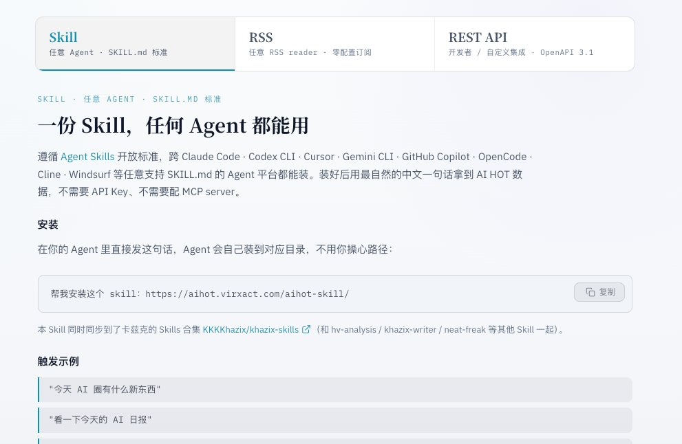

安装也特别简单，一句话就可以，我直接放在了我的服务器上，所以也无需魔法：

帮我安装这个 skill：https://aihot.virxact.com/aihot-skill/

当然，这个skill我也按老规矩，传到了我自己Skills集合的Github上，想用github源的可以：

https://github.com/KKKKhazix/khazix-skills

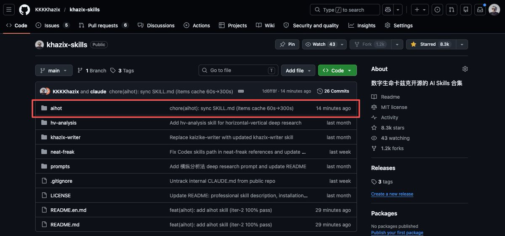

AIHOT Skill装上之后，你就不用再打开浏览器，不用再去刷网站，甚至不用再去想今天AI圈到底发生了什么。

你就跟你的Agent说一句话就行了。

我再花点篇幅，说说它到底能干什么。

第一个，AI日报。

AIHOT每天北京时间早上八点，会自动生成一份当天的AI日报。这个日报是我的系统从几百个信源里抓取、筛选、去重、打分、分类之后，最后精选出来的。

比如你早上起来，打开Claude Code或者OpenClaw，跟它说一句“给我一份今天的AI日报”，它就会自动触发AIHOT Skill，把当天的AI日报拉下来，整理成一份中文简报，直接摆在你面前。

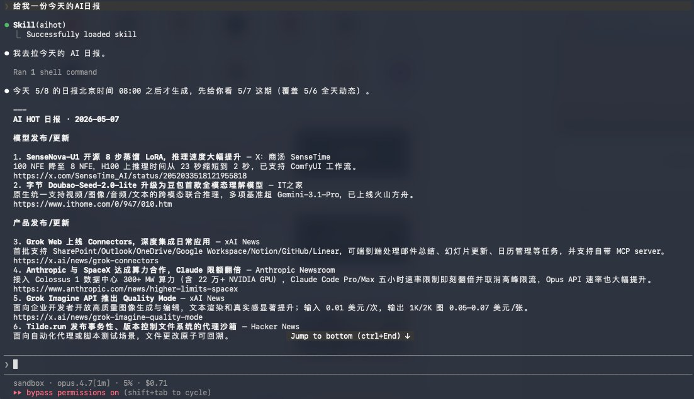

日报分五个版块，模型发布/更新、产品发布/更新、行业动态、论文研究、技巧与观点。每条都有中文标题、一句话摘要、信息来源、还有原文链接，你感兴趣的点进去就能看原文。

30秒，你就知道昨天整个AI行业发生了什么。

而且你不光能看今天的日报，你还可以看前几天的。

比如你可以跟Agent说看一下5月6号的AI日报，它就直接给你拉那天的，这个其实我自己很喜欢的场景，我觉得非常适用于周末的。

就是周末我相信很多人肯定不咋看AI新闻或者消息，都是周日晚上或者周一早上再统一看下，这时候，你就可以周一早上说一句“给我总结一下最近三天的AI日报”，他就刷刷刷全出来了，还挺快的。

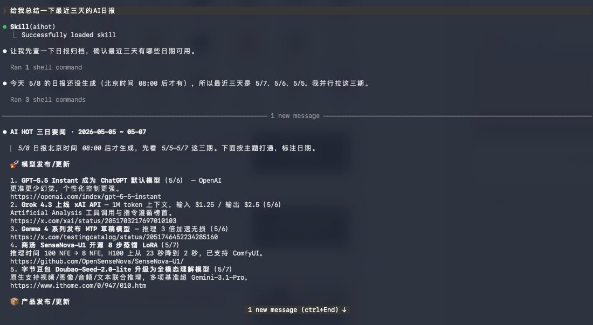

第二个能力是精选模式。

精选和日报的区别是，日报是按版块打包好的成品，像一份报纸，并且有自己的最大条数限制，精选是AI从所有的信息中挑出来的值得关注的信息，同时以原始的时间流呈现，像一个Feed。

精选模式，也是整个AIHOT最核心的模式，当你不明确的说压迫日报或者全部之类的话的时候，都会默认以精选的数据源来进行回答。

这块其实就看你自己的需求，如果只是每天早上快速扫一眼大事就看日报，想要不漏掉任何高质量条目就看精选就行了。

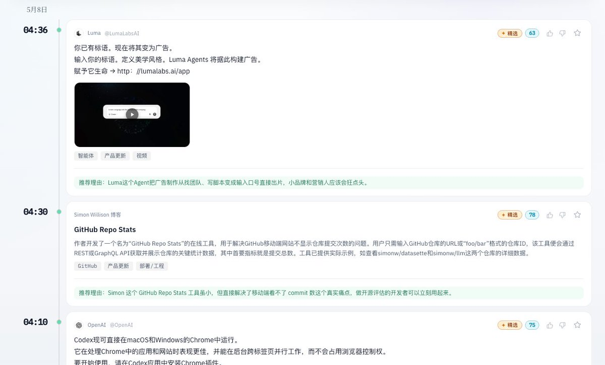

第三个能力，按时间窗口或分类查。

有时候你觉得日报或者精选的信息量还不够，就想看某一个方向的全部的动态。

那再往上，其实还有全量的AI相关的所有信息，这些只不过为了保护注意力，他们可能没有被精选选中而已，但是不代表他们没有价值。

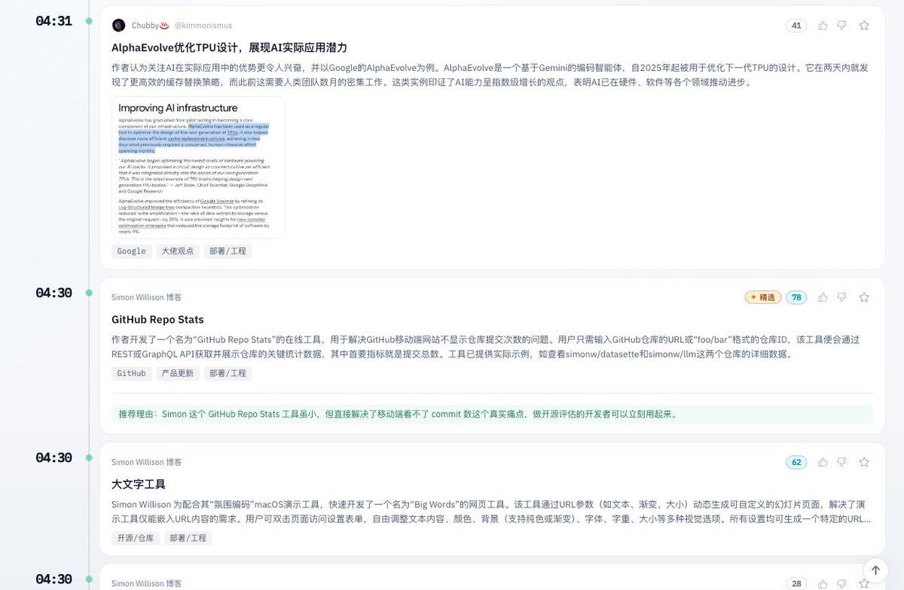

这时候，你可以Agent说，比如"看看全部消息，列出所有的新模型发布"，它就给你拉AI模型所有的相关条目了，你说"看看最近3天所有的AI产品发布"，它就给你筛所有产品方向的。

类别跟日报一样，支持这五个分类，模型发布、产品发布、行业动态、论文研究、技巧与观点。

当然，你也可以指定时间范围，比如你也可以说，过去24小时AI行业有啥大新闻。

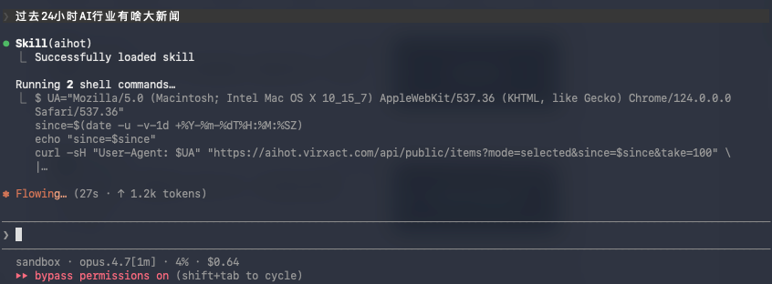

1分钟左右，你就可以得到非常详细且准确的信息了。

当然，默认也会使用精选的信息进行回答，保护你我的注意力。

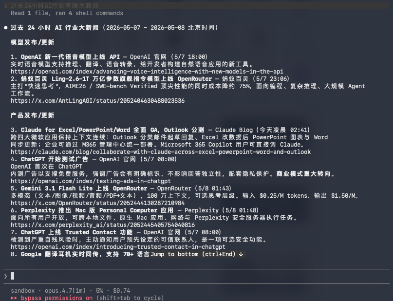

时间窗口最长支持7天，因为再往前的数据量就太大了，同时我也是为了保护一下我这个脆弱的土豆服务器，真的怕量一大，直接给我干崩了。。。

第四个能力，按关键词查。

这块我把搜索也做了进去，可以支持一些基本的搜索，比如最近XXX产品更新了哪些新功能、OpenAI发布了哪些新模型之类的。

这块正好也可以给大家看一下有skill和没skill在信息时效性上的对比。

比如我问，OpenAI 最近发了什么。

装了skill的情况下，会非常的详细且全面，凌晨刚刚发布的语音模型也抓进去了。

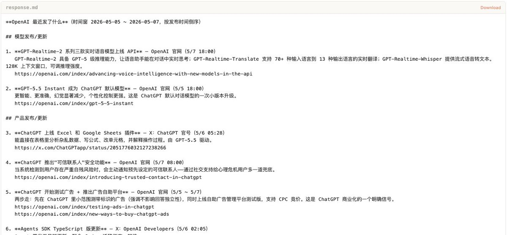

并且都有源地址，你可以随意进行跳转。

如果没装，就是这样的。

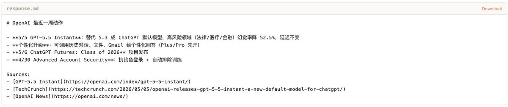

还是有一点奇怪和信息缺失的。

大概就是这样。

然后在输出格式上，我只做了最基础的md，因为我觉得我就直接提供一个数据源得了，反正skills大家能随便改的，你们想输出成啥样的，或者嵌入到什么工作流中，就交给大家自己后续优化吧～

希望AIHOT这个skill，能让你的Agent多了一双眼睛，帮你盯着整个AI行业的新闻。

然后说说RSS。

这个其实是给那些不用Agent、但是日常用RSS阅读器的朋友准备的。很多技术圈的老哥习惯用Feedly、Inoreader、NetNewsWire这些工具来管理信息流，RSS对他们来说是最自然的接入方式。

我开放了三个Feed，精选动态、全部AI动态、AI日报，你挑你需要的订阅就行，Feed地址在Agent接入页面都能看到，一键复制。

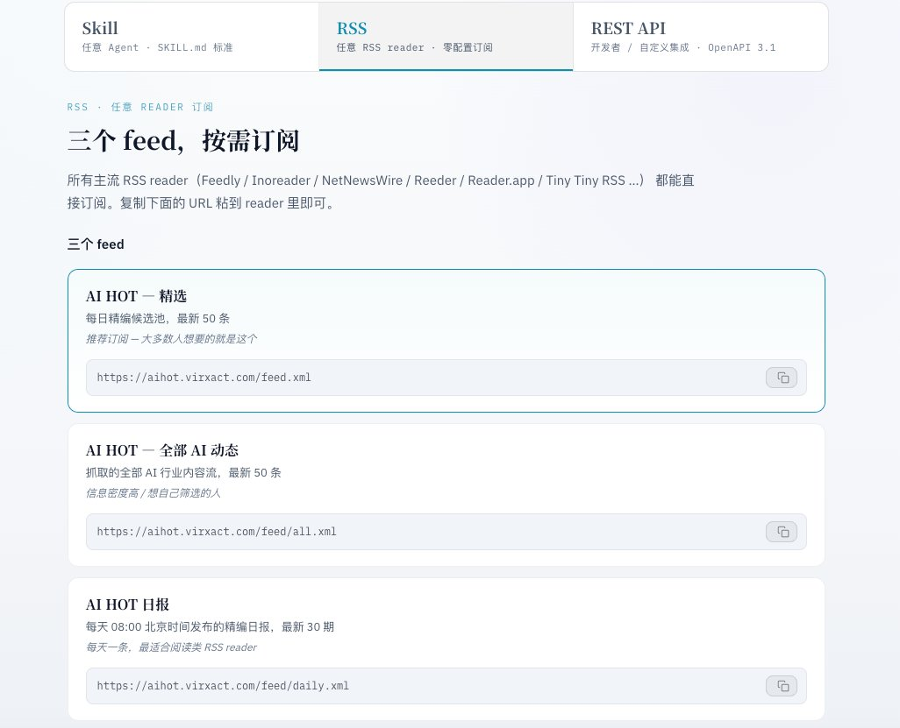

完整的OpenAPI规范文档我也尽可能让AI写的详细了，但是这块我提前说一个风险，因为我确实没有自己开放过API，也确实看不太懂，这块完全是完全我说了自己需求和一些风控问题之后，Agent自己处理的，所以API这块我心理真的没啥底。

如果大家接入过程有BUG，在查了文档之后，是非常规情况下的报错，可以再提交反馈页面报一下，我让Agent来去修= =

三种接入方式，覆盖三种不同的人群。

总之，我希望的就是这玩意，能对大家有用，也希望不管你用什么姿势获取信息，AIHOT都能对你真的有一点点帮助。

也希望，我能给这个互联网。

留下一点点，自己的印记。

### 🖼️ Attached Media

## 💬 Replies

### 1 @TradingAigogogo (柱子哥TzFilm)

*Fri May 08 05:22:46 +0000 2026*

@Khazix0918 真的牛逼，卡老师我准备发一期视频介绍一下这个，应该会爆到时候抖音艾特你

### 2 @Khazix0918 (数字生命卡兹克) (Author)

*Fri May 08 08:37:44 +0000 2026*

@TradingAigogogo 谢谢你！

### 3 @qtwaiter (qtwaiter)

*Fri May 08 05:19:44 +0000 2026*

@Khazix0918 这样就可以让我的虚拟女友与现实社会进行方便链接了 

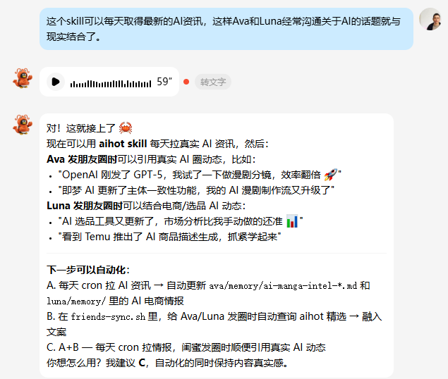

### 4 @sky_circle1216 (和稀泥)

*Sat May 09 03:53:45 +0000 2026*

@Khazix0918 感谢卡老师，我把你这个skill，结合刘小排排哥的bp日报，共同结合搓了个AI大全日报：[oncelab.cn/daily/](https://oncelab.cn/daily/)

### 5 @samxqu8 (sam)

*Fri May 08 16:59:16 +0000 2026*

@Khazix0918 请问日报是图文混排的吗

### 6 @Ni_Agent (逆耳)

*Fri May 08 06:35:09 +0000 2026*

@Khazix0918 这下Agent都有早八AI日报了，人还没醒，AI圈先被它扫一遍，谁还敢摸鱼啊？

### 7 @yungui_ml (云归)

*Fri May 08 05:19:53 +0000 2026*

@Khazix0918 @lijigang 真不错，高质量资讯源

### 8 @cnzhihao (智昊 - OPC版)

*Fri May 08 04:55:14 +0000 2026*

@Khazix0918 玩了一下，猛的一批，内容工厂现在开始全自动生产初稿了。可惜我不是做AI资讯的，我是做OPC的

### 9 @0xSwz (山乌珠💰)

*Fri May 08 17:22:47 +0000 2026*

@Khazix0918 感谢老师，刚想着要不要搞个爬虫呢，老师就给我们用了。

### 10 @KyrieCheungYep (Kyrie)

*Fri May 08 05:03:47 +0000 2026*

@Khazix0918 太有用了！谢谢老师分享😭

### 11 @xiaomag17348422 (Marvin的数字工坊)

*Fri May 08 08:05:48 +0000 2026*

@Khazix0918 第一时间跟进，部署到赛博菩萨cloudflare上，摸鱼的时候直接飞书群里瞟一眼 

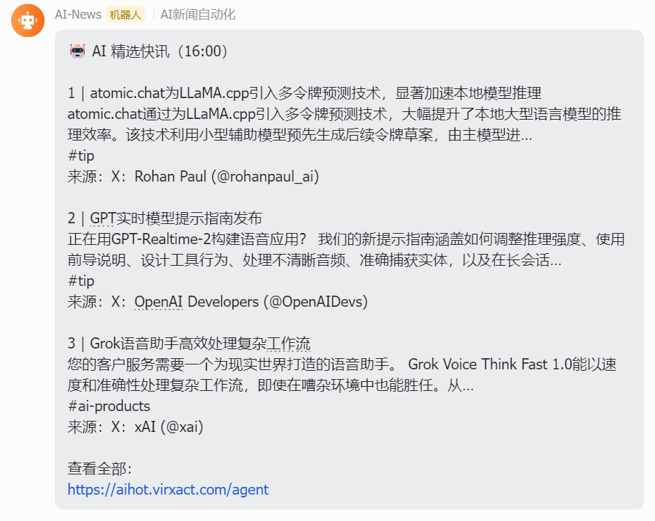

### 12 @0x_qeesung (qeesung)

*Sat May 09 04:00:58 +0000 2026*

@Khazix0918 以后摸鱼刷 AI 新闻都得改名叫数据采集了

### 13 @LouwlouAiDev (Indie Louwlou)

*Fri May 08 04:56:17 +0000 2026*

@Khazix0918 这个接入方式挺实用的，尤其是 Skill，直接把信息流塞进工作流里了，省得我天天手动刷新闻。

### 14 @aiagentcoder (aiagentcoder)

*Sat May 09 03:40:24 +0000 2026*

@Khazix0918 昨天睡觉时刚有一个idea让ai每天推送热点新闻给我，今天就看到这个了！ai时代每天都有让人眼前一亮的东西！

### 15 @guoxiaoyang0925 (mumunanmu)

*Sat May 09 01:57:12 +0000 2026*

@Khazix0918 @readwise save

### 16 @JunEr_Lab (JunEr)

*Fri May 08 10:33:39 +0000 2026*

@Khazix0918 这个转发到抖音b站肯定爆

### 17 @bltyyds (摸鱼者)

*Fri May 08 05:51:38 +0000 2026*

@Khazix0918 我认为ai日报有点太局限了  能不能做热点日报 感觉这个需求会更大

### 18 @alexbu512 (AlexBu)

*Fri May 08 04:58:41 +0000 2026*

@Khazix0918 感谢分享，已经装入hermes了

### 19 @yangzhujun (yangzhujun)

*Sat May 09 02:15:54 +0000 2026*

@Khazix0918 已推荐

### 20 @everything63997 (everythingisaboutchina)

*Fri May 08 06:52:22 +0000 2026*

@Khazix0918 感谢大佬分享😻

### 21 @haochenshowlife (无名之名W)

*Sat May 09 01:18:09 +0000 2026*

@Khazix0918 感恩有这么好的信息源，已经用上了。

### 22 @iinlanjian (风满楼)

*Fri May 08 06:14:25 +0000 2026*

@Khazix0918 感谢分享

### 23 @amyw222222 (Amy Wang)

*Fri May 08 05:10:51 +0000 2026*

@Khazix0918 感谢，信息真的很好。风格也好看

