# ODS、DWD、DWS、ADS已经不够用了？AI时代的数仓该怎么分层

过去十几年，企业数仓基本沿用同一套分层：

* ODS接入原始数据，

* DWD统一业务明细，

* DWS沉淀主题模型，

* ADS服务报表与应用。  

这套架构并没有过时，但到了AI时代，仅仅做到数据可查询、可展示已经不够。

大模型即使能生成SQL，也未必知道“收入”应该按下单、开票还是确认收入统计，更不知道退款如何处理、有效客户如何定义，以及一个经营问题应该调用哪些指标和分析路径。

* 传统数仓解决的是数据如何接入、加工、汇总和交付；  

* AI应用还要求数据能够被理解、组合、解释，并在权限范围内安全调用。

所以，AI时代真正需要讨论的，不是要不要推翻ODS、DWD、DWS、ADS，而是：

**在经典数仓分层之上，还要补上哪些面向AI的新能力？**

在正式展开之前，我整理了一份《数据仓库建设解决方案》，里面梳理了企业从多源数据接入、数据集成、数仓分层，到主题建模和数据应用的完整建设思路。

对于正在搭建数仓，或者准备在现有数仓基础上进一步接入BI、智能问数和Data Agent的企业，这份资料可以直接作为架构规划和项目落地的参考。

需要自取：<https://s.fanruan.com/ahhl0>  

---

## 一、先说结论：经典四层仍然是地基，但终点不能再只是ADS

ODS、DWD、DWS、ADS解决的是企业数据从分散走向统一的过程。

AI不会替企业自动完成数据同步、数据清洗、主数据映射和指标统一。

恰恰相反，AI越深入经营、财务和供应链场景，对底层数据质量的要求越高。

如果ERP中的客户编码与CRM不一致，MES中的产品编码与库存系统无法对应，财务收入又无法追溯到具体订单，那么大模型能力再强，也很难输出可靠结论。

因此，AI时代的数仓并不是少做数据集成，而是要把底层数据链路做得更加稳定。

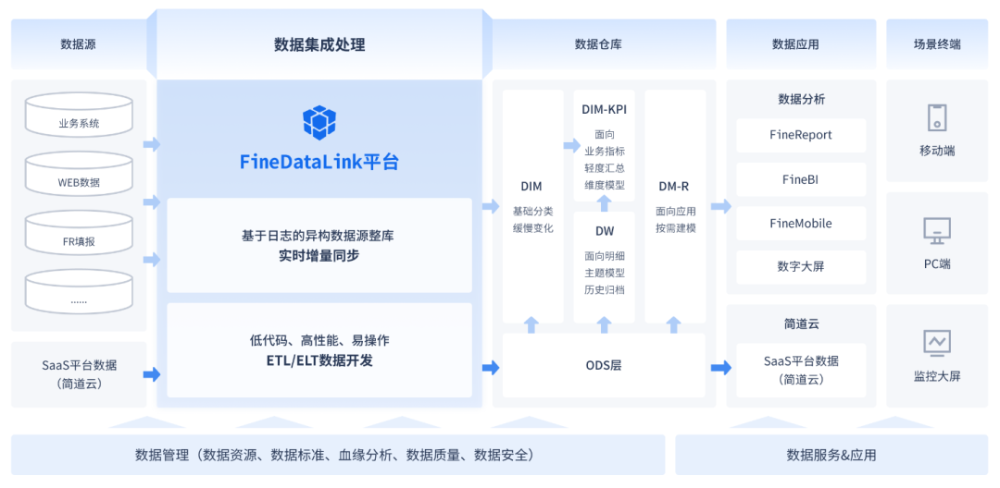

例如，企业可以通过**FineDataLink**连接ERP、CRM、MES、WMS、财务系统以及各类数据库和文件数据，完成异构数据的批量或实时同步、清洗转换、任务调度和链路监控。

FineDataLink解决的是数据从业务系统进入数据平台的过程：

* 数据能不能稳定同步过来；

* 不同系统的数据能不能统一起来；

* 数据加工任务能不能按时运行；

* 同步出现异常后能不能及时发现。

只有底层数据链路稳定，后面的数仓分层、指标建设、BI分析和AI应用才有可靠基础。

但问题在于，传统数仓通常默认数据最终由人通过SQL、报表或者看板使用。

当使用者从人变成AI Agent时，ADS就不再是数据架构的唯一终点。

AI时代的数仓需要同时支持：

* BI Serving、

* Semantic Serving、

* Knowledge Serving、

* AI Serving。

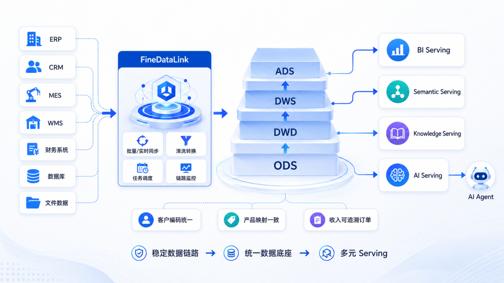

## 二、经典四层数仓，分别解决了什么问题？

## 1.ODS：让分散的数据稳定进入数仓

ODS负责承接ERP、CRM、财务、电商、物联网、日志及外部接口等原始数据。

它的难点不只是建表，而是保证不同系统的数据能够完整、及时、稳定地进入数仓，并在同步失败时支持监控、告警和追溯。

在这个环节，**FineDataLink**可以承担底层数据集成和同步工作，将不同业务系统的数据统一接入ODS，并通过调度、监控和异常告警保证数据链路稳定运行。

ODS主要回答：

数据从哪里来、何时进入、是否完整、出现异常能否追溯？  

没有稳定的数据接入，后面的数仓分层再完整，也只能停留在架构图上。

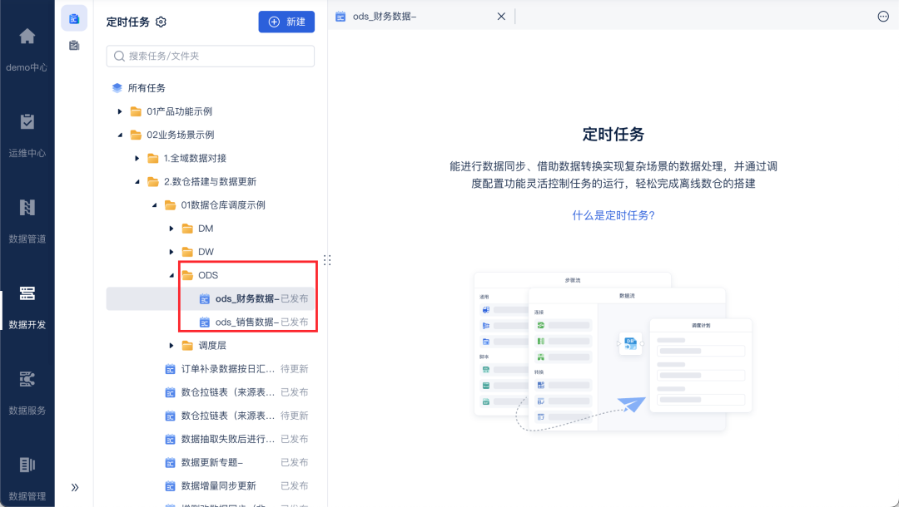

---

## 2.DWD：把原始记录变成统一业务事实

不同系统对客户、商品、订单等业务对象的编码和定义往往不一致。DWD需要通过去重、标准化、主数据映射、状态统一和历史保留，将原始数据整理成统一的业务明细。

**FineDataLink**除了完成数据同步，还可以在数据进入数仓的过程中进行必要的清洗、转换和关联处理，将不同系统中的原始字段转化为统一的数据结构。

不过需要注意：

工具可以完成数据加工，但不能替企业决定业务规则。  

取消订单是否计入销量、跨月退款如何调整收入等口径，仍需要业务、财务和数据团队共同定义。

DWD回答的是：

企业内部同一件业务事实，应该如何统一记录？  

---

## 3.DWS：将重复分析逻辑沉淀成公共能力

如果每张报表都从明细层重新关联和计算，很容易产生大量重复SQL和多套指标口径。

DWS围绕客户、商品、订单、财务、库存、项目和设备等主题，将常用分析逻辑沉淀为可复用的数据模型。

在实际建设中，可以通过FineDataLink将ODS和DWD中的数据按照业务主题进行加工、汇总，并设置定时或实时任务，使公共数据模型持续更新。

DWS主要解决：

企业反复使用的分析逻辑，如何只建设一次、长期复用？  

否则，BI报表、经营看板和AI Agent可能会重复计算同一指标，最终形成口径冲突。

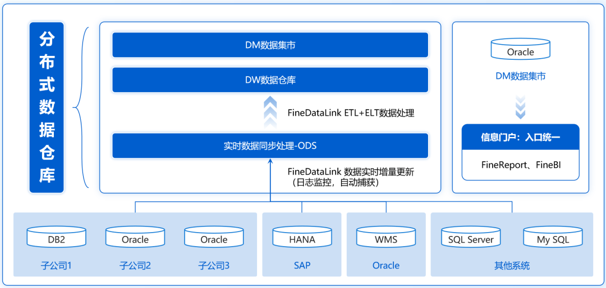

---

## 4.ADS：为确定性应用准备数据

ADS面向总经理驾驶舱、销售看板、利润分析、库存预警、生产运营和监管报送等固定场景，提前准备应用所需的数据集，提高查询效率和结果稳定性。

FineDataLink可以把DWS中的主题数据进一步加工成面向特定应用的数据集，再交付给BI、报表或者其他业务应用使用。

ADS回答的是：

为了支撑一个确定性应用，需要提前准备哪些数据？  

但AI提出的问题往往具有动态性和连续性，例如从“利润为什么下降”继续追问到客户、价格、成本和改善动作。这类问题很难全部提前加工成ADS表。

因此，ADS依然需要保留，但不能承担所有AI分析任务。

---

## 三、为什么AI时代仅靠经典四层不够？

## 1.有字段，不等于有业务语义

传统数仓能够描述表名、字段、类型、来源和关联关系，但AI还需要理解指标定义、计算口径、时间范围、适用场景和分析维度。

例如，“收入”可能指销售额、开票金额、确认收入或净收入。缺少统一语义时，AI很容易选错字段，生成**逻辑通顺、口径错误**的答案。

**数据库描述数据结构，语义层解释业务含义。**

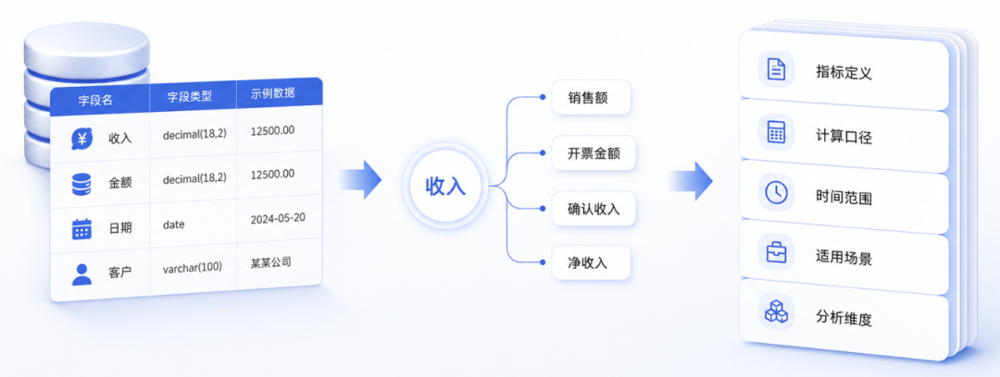

---

## 2. 有数据，不等于有分析路径

传统数仓擅长回答“本月收入是多少”“哪个区域销量最高”等确定性问题。

但AI面对的往往是：

为什么利润下降？ 哪些项目可能延期？ 哪些库存应该优先处理？  

这类问题需要完成任务拆解、指标选择、维度分析和原因归因。

因此，AI需要的不只是一张宽表，还需要**指标关系、分析方法和业务上下文。**

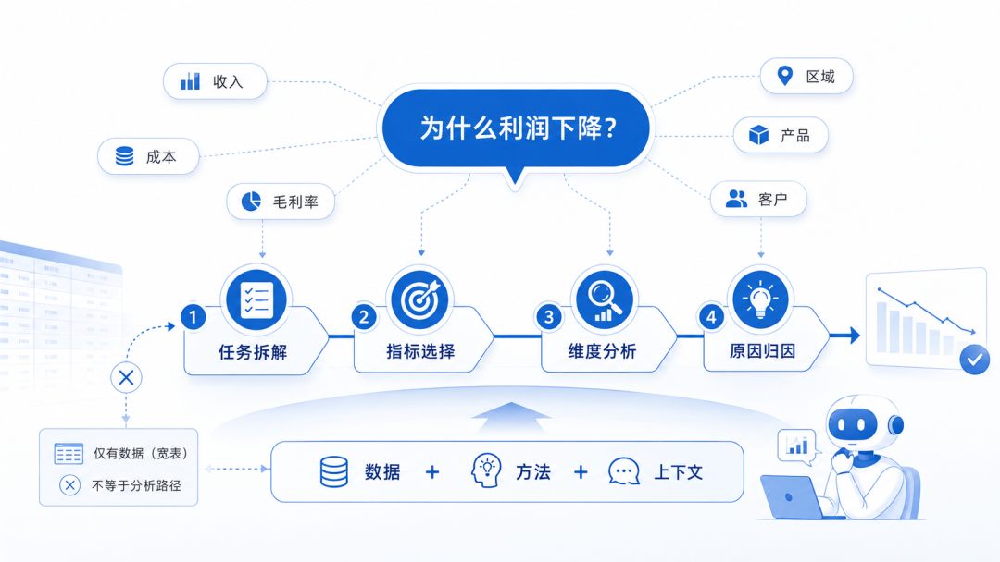

---

## 3. 有数据权限，不等于有AI调用边界

传统权限主要控制表、字段、数据行和报表页面。

但AI Agent不仅能查数，还可能组合信息、调用工具、生成文件，甚至触发业务动作。

因此，企业还要明确：

* AI能查什么；  

* 能看到多细；  

* 哪些数据需要脱敏；  

* 能调用哪些工具；  

* 哪些操作必须人工确认。

**AI权限既要控制“能看什么”，也要控制“能做什么”。**

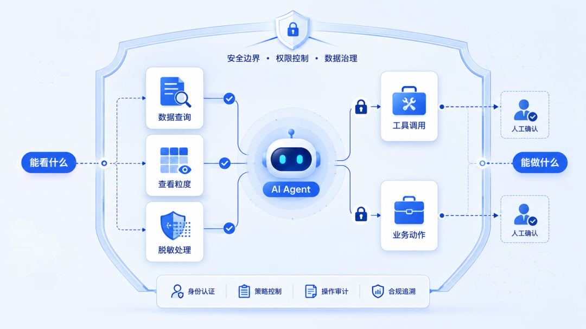

---

## 4. 有ADS，不等于能支持动态分析

ADS通常围绕固定报表和确定场景设计，而AI分析具有连续追问和动态组合的特点。

用户可能先问“华东收入为什么下降”，再继续追问产品、价格、客户和改善建议。

传统ADS并不负责保存上下文，也不会自动规划分析路径。

因此，AI时代需要在ADS之上补充**语义、上下文和AI Serving能力。**

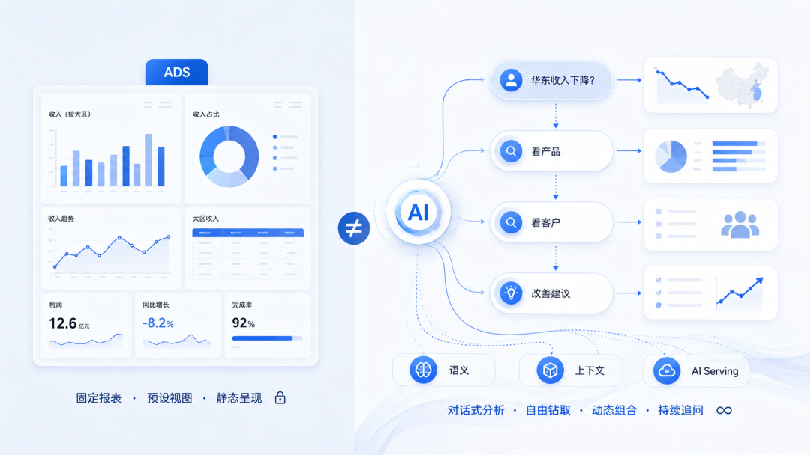

---

## 四、AI时代，数仓还要补上哪些能力？

更务实的做法，不是推翻ODS、DWD、DWS、ADS，而是在经典四层之上补充面向AI的能力：

ODS → DWD → DWS → ADS

↓

语义层 → 知识层 → 上下文层 → AI Serving层

↓

BI看板、智能问数、Data Agent与业务工作流  

这些能力不一定需要建设四套独立平台，关键是明确各自解决什么问题。

## 1.语义层：让AI听懂企业语言

语义层负责把表名、字段和技术模型，转化成AI能够理解的业务语言，主要包括：

* 客户、订单、产品、项目等业务实体及其关系；  

* 指标含义、计算公式、时间口径和适用范围；  

* 集团—区域—公司、品类—品牌—SKU等维度层级；  

* 取消订单不计销量、库龄超过180天定义为呆滞等业务规则。

它解决的是：

同一个指标到底是什么意思，应该在什么场景下使用。  

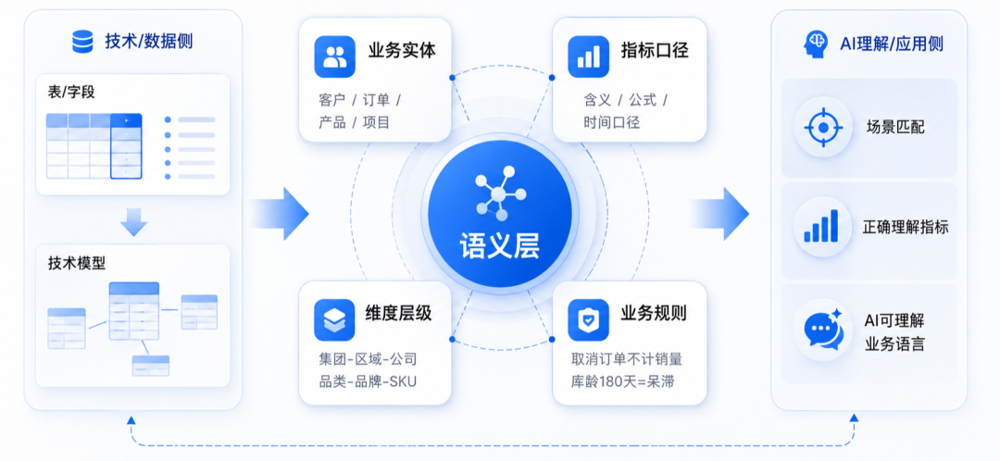

---

## 2.知识层：补齐数据之外的规则与经验

数仓主要保存结构化数据，但企业还有大量制度、合同、产品手册、历史报告、会议纪要和专家经验。

结构化数据可以告诉AI“库存周转变慢了”，知识层则进一步说明：

* 什么情况下需要预警；  

* 哪类产品允许长期备货；  

* 历史上类似问题如何处理。

知识层的重点不是简单建设向量库，而是保证知识准确、及时、可追溯，并能与客户、产品、指标等数据实体关联。

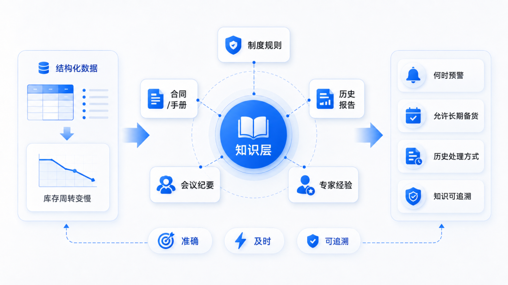

---

## 3.上下文层：为每个问题准备正确的信息

上下文层负责根据当前任务，动态组装AI真正需要的信息。

例如用户询问“华南区域本月利润为什么下降”，系统需要同时提供：

* 用户身份和数据权限；  

* 华南区域与本月的具体范围；  

* 企业统一的利润口径；  

* 收入、成本、费用等相关指标；  

* 可用分析维度、数据更新时间和已知异常；  

* 可调用的工具及输出要求。

它不是把整个数仓都交给大模型，而是选择最相关、最可信、最符合权限要求的上下文。

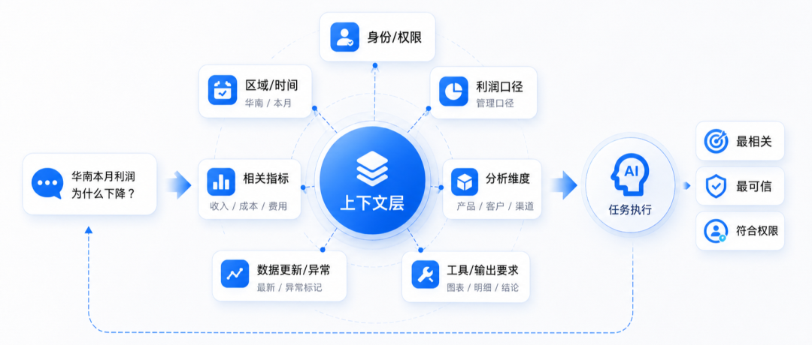

---

## 4.AI Serving层：把数据能力封装成受控服务

AI Serving层连接数仓与智能问数、Data Agent，但不应让大模型自由连接数据库，而应把经过治理的能力封装成工具，例如：

* 指标查询：查询收入、毛利率、库存周转和预算差异；  

* 维度分析：按区域、产品、客户、渠道和项目切分；  

* 异常检测：识别同比、环比、趋势和预算异常；  

* 归因分析：将利润变化拆成价格、销量、结构、成本和费用影响；  

* 权限审计：记录谁查询了什么数据、调用了哪些工具、生成了什么结果。

这样，AI负责理解问题和组织分析，服务层负责保证口径正确、权限可控、过程可追溯。

归根结底，四层能力分别解决四个问题：

语义层让AI看懂数据，知识层帮助AI理解规则，上下文层决定本次任务需要什么，AI Serving层保证AI安全、可靠地调用数据。  

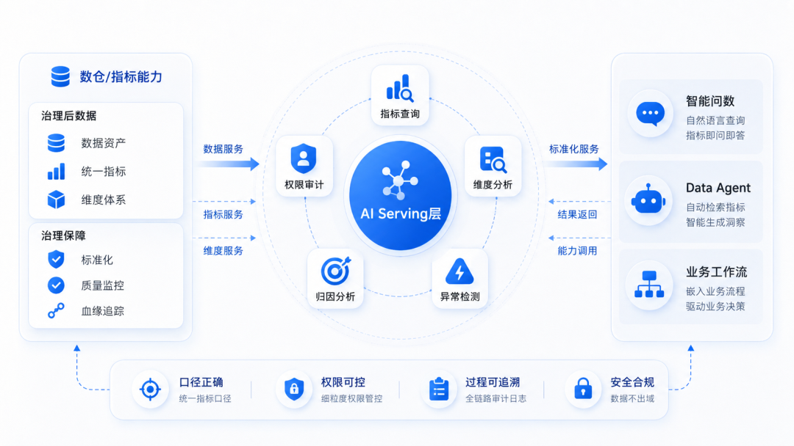

## 五、FineDataLink在这套架构里处于什么位置？

FineDataLink不是AI Serving层，也不是语义层。

它更适合承担底层数据集成、数据同步和数据加工链路，主要覆盖：

数据源层 → ODS → DWD → DWS → ADS  

具体来说，可以发挥四类作用。

## 1.打通异构数据源

将ERP、CRM、MES、WMS、财务系统以及数据库、接口和文件数据统一接入数据平台。

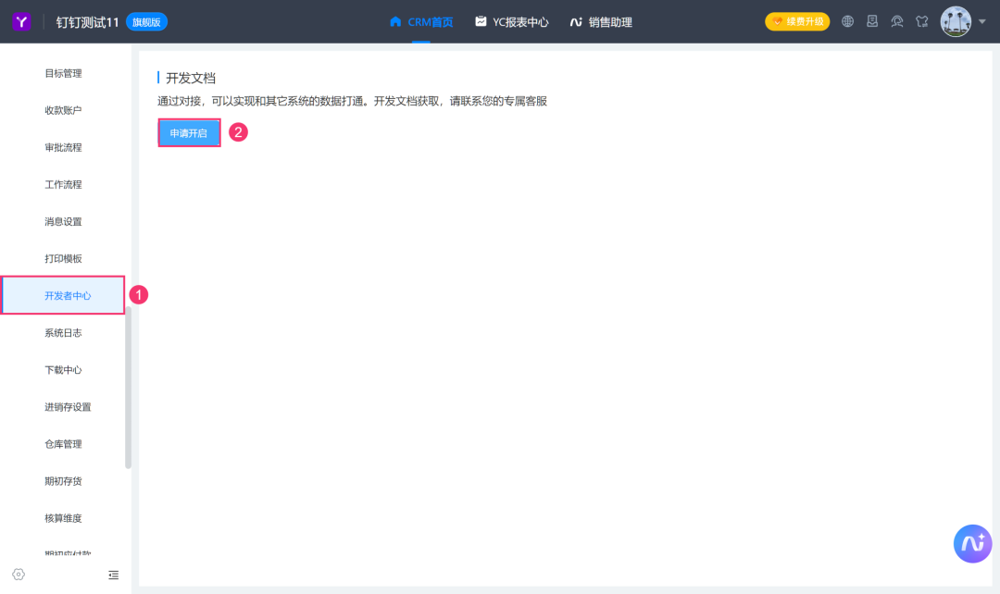

---

## 2.支撑批量和实时同步

根据业务场景选择定时同步或实时同步。

例如：

* 财务结算数据可以按日处理；  

* 订单、库存和设备数据可以提高同步频率；  

* 经营预警场景可以使用更及时的数据链路。

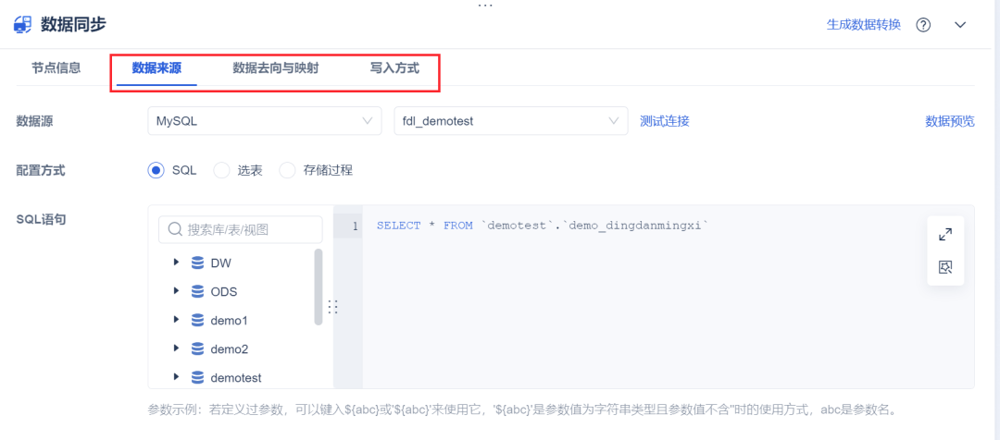

---

## 3.完成清洗、转换和主题加工

将原始字段进行标准化、关联和汇总，逐步形成DWD明细层、DWS主题层和ADS应用层。

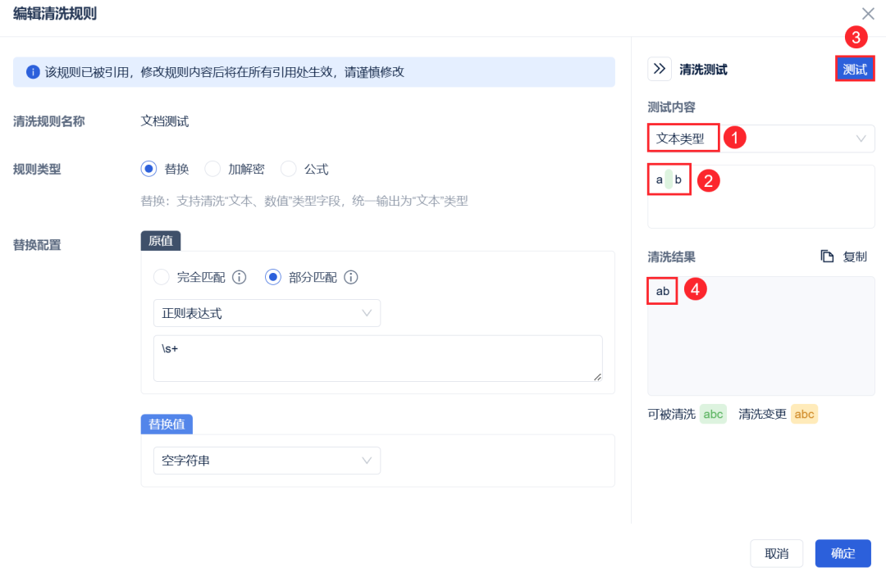

---

## 4.保障数据任务稳定运行

通过任务调度、运行监控和异常处理，保证AI与BI使用的是持续更新的数据，而不是临时导出的Excel。

因此，FineDataLink的价值不是直接让AI回答问题，而是确保：

AI调用的数据能够及时进来、正确加工、稳定更新，并可以追溯。  

语义层和AI Serving层决定AI是否理解和正确使用数据。

FineDataLink决定AI拿到的数据是否完整、及时、可靠。

二者解决的是不同问题，却缺一不可。

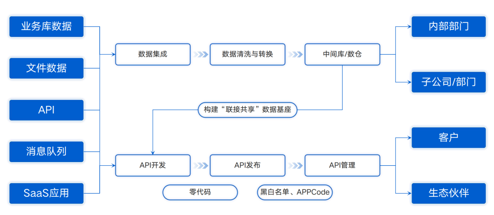

---

## 六、AI时代要不要取消ADS？

不需要。

ADS仍然具有不可替代的价值。

---

## 1.固定场景需要稳定性能

经营驾驶舱、监管报表、日常业务看板的结构相对固定，使用ADS可以获得更稳定的查询效率。

---

## 2.核心指标需要提前验证

收入、利润、成本和库存等关键指标，不能每次让AI临时计算。

---

## 3.高频分析应该沉淀复用

如果一个问题每天都被提问，就应该把它沉淀成指标、数据集或看板，而不是让AI每次从头分析。

所以，更合理的关系是：

ADS负责稳定交付，AI Serving负责动态组合。  

FineDataLink持续加工和更新ADS数据集，BI负责固定分析和经营看板，AI负责动态提问、问题拆解和结果解释。

AI发现的高频分析逻辑，还可以重新沉淀成ADS或者固定看板。

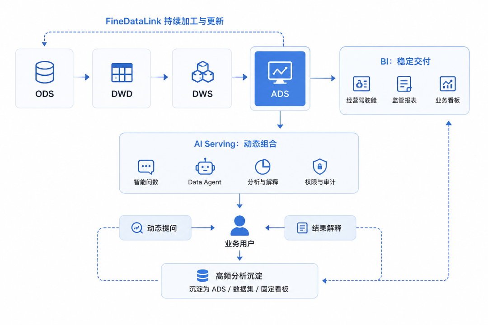

---

## 七、企业应该如何升级现有数仓？

不建议一上来就重新设计一套复杂的八层或十层架构。

更务实的方式，是从一个具体AI场景开始。

---

### 第一步：选择高价值场景

----------

例如：

* 自动经营分析；  

* 利润归因；  

* 库存预警；  

* 项目风险；  

* 客户流失分析；  

* 供应链异常识别。

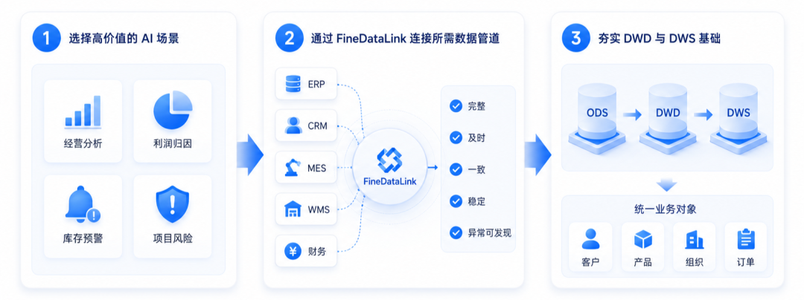

---

### 第二步：打通所需数据链路

----------

通过FineDataLink连接相关业务系统，确认数据能否完整、及时地进入数仓。

重点检查：

* 数据是否缺失；  

* 更新是否及时；  

* 主数据是否一致；  

* 同步任务是否稳定；  

* 数据异常能否被及时发现。

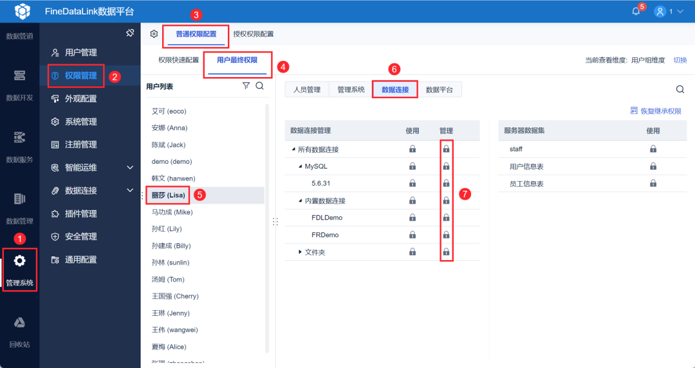

---

### 第三步：补齐DWD和DWS

----------

如果客户、产品、组织和订单口径还没有统一，应先补齐基础数仓，而不是直接让大模型查询原始系统。

---

### 第四步：建设最小语义资产

----------

围绕一个场景先整理：

* 核心业务实体；  

* 关键指标；  

* 分析维度；  

* 业务规则；  

* 权限要求。

不需要一开始就描述整个企业。

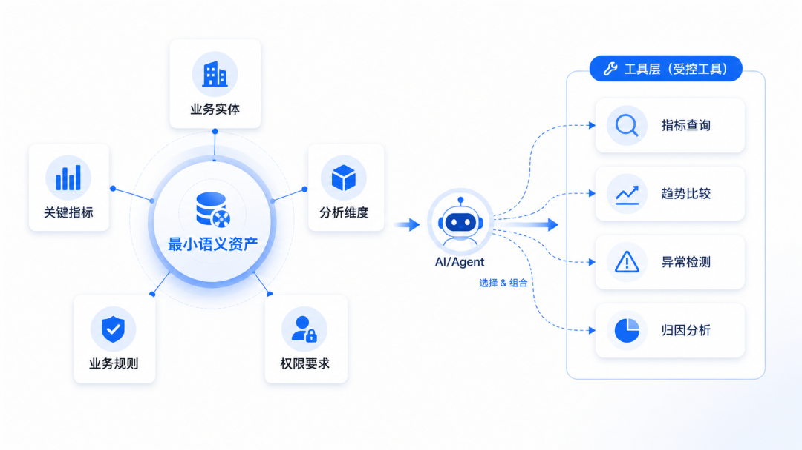

---

### 第五步：将复杂分析封装成工具

----------

把指标查询、趋势比较、异常检测和归因分析封装成受控工具，由AI负责选择和组合。

---

### 第六步：把有效分析重新沉淀

----------

经过验证的AI分析结果，可以沉淀成：

* 指标；  

* ADS数据集；  

* 分析模板；  

* 经营看板；  

* 预警规则；  

* 标准工作流。

这样，AI才能从一次性问答，逐步转化为企业可复用的数据能力。

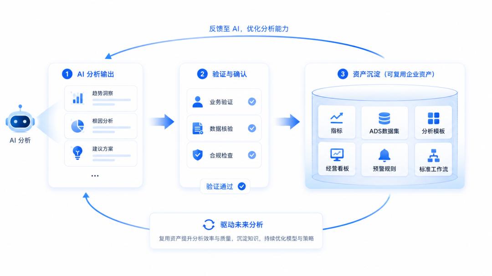

---

写在最后  

ODS、DWD、DWS、ADS并没有过时。

它们仍然负责把分散、混乱的业务数据，变成统一、可靠、可复用的数据基础。

FineDataLink则承担其中最基础、也最容易被忽略的一环：

把各业务系统的数据稳定接进来，按照统一规则加工，并持续输送给数仓、BI和AI应用。  

但到了AI时代，数据做到可同步、可查询、可展示还不够。

企业还需要让数据做到：

可理解、可组合、可控制、可解释、可执行。  

因此，下一代数仓需要完成三次升级：

* 从数据接入升级为稳定的数据供应链；  

* 从数据表升级为可理解的业务语义；  

* 从固定报表升级为AI可以安全调用的分析服务。

传统数仓负责准备数据，FineDataLink负责保障数据流动，语义层负责解释数据，AI Serving层负责把数据转化为分析与行动。

真正的问题从来不是：

ODS、DWD、DWS、ADS还要不要？  

而是：

这套为报表时代设计的数据架构，能不能继续支撑一个由人和AI共同分析、决策和执行的企业。  

### 点击【阅读原文】，体验文中同款资料包

