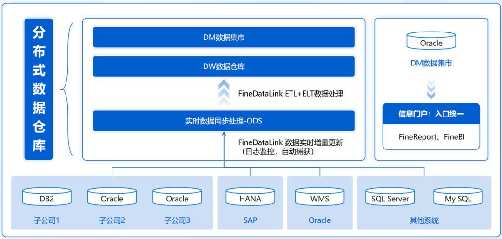
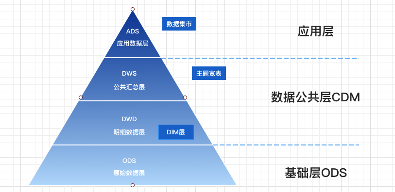
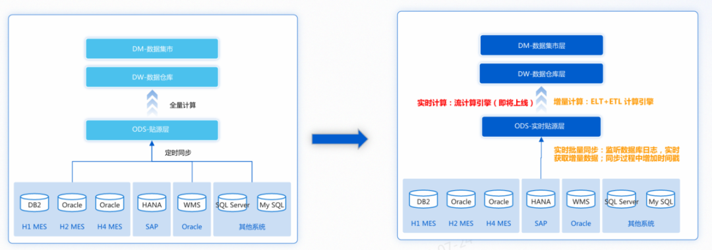
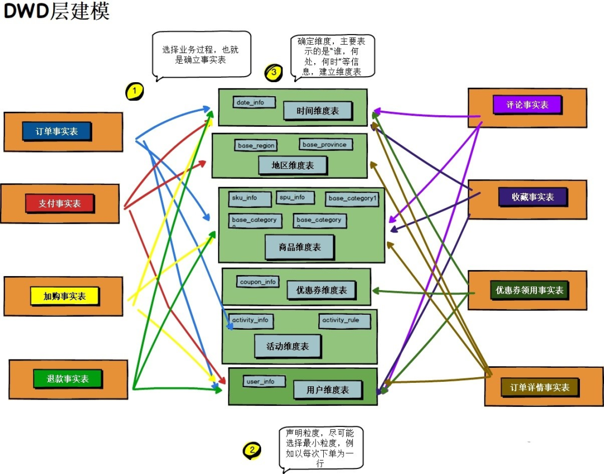
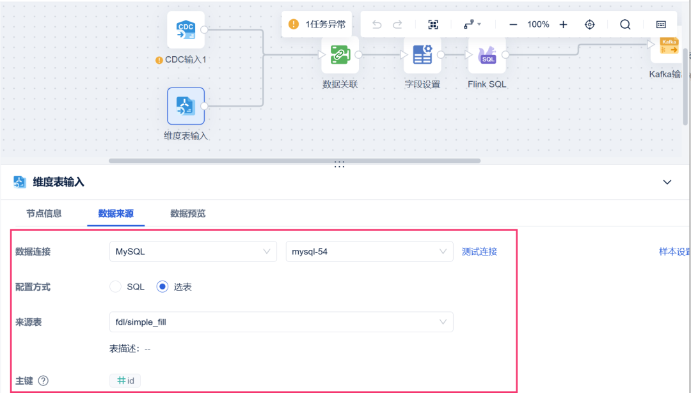
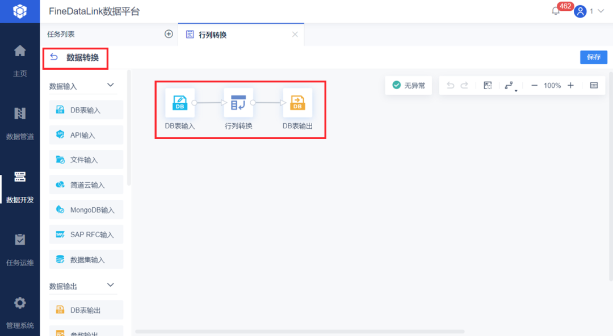
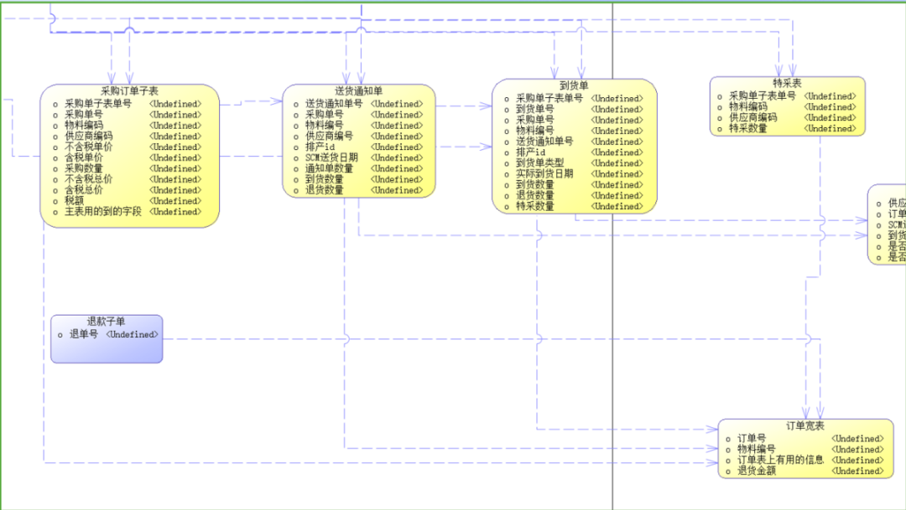
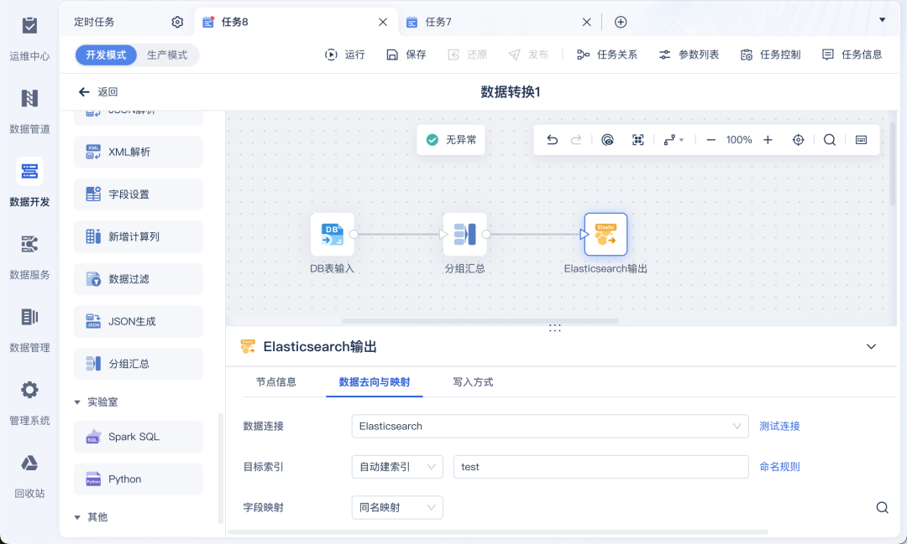
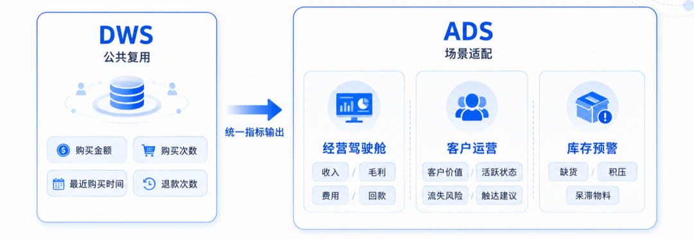

# ODS、DWD、DWS、ADS：数据仓库四层架构一次讲清

很多企业的数据仓库，看起来表很多、任务很多、报表也很多，但真正用起来，仍然会出现一堆问题：

* 销售、财务和运营统计出来的收入不一致；  

* 报表数字异常，却不知道应该从哪里排查；  

* 同一个客户、同一件商品，在不同系统中存在多个编码；  

* 同样的清洗和计算逻辑，被不同项目反复开发。

这些问题的根源，往往不是企业缺少数据，而是**数据从业务系统进入分析应用的过程中，没有形成清晰、稳定、可追溯的加工链路。**

ODS、DWD、DWS、ADS，就是数据仓库中最常见的四层架构：

* ODS负责承接原始数据，  

* DWD负责统一业务事实，  

* DWS负责沉淀公共主题数据，  

* ADS负责服务具体应用。

为了方便大家进一步理解数仓建设，我整理了一份《数据仓库建设解决方案》，里面包含数仓分层、数据加工、任务调度和应用建设等内容。

需要可以自取：<https://s.fanruan.com/ahhl0>  

## 一、为什么数据仓库需要分层？

企业刚开始做数据分析时，通常采用最直接的方式：报表需要什么数据，就直接从ERP、CRM、财务系统或业务数据库中查询。

数据量不大时，这种方式确实很快。但随着系统和分析场景增加，问题会逐渐暴露。

### 第一，重复加工越来越严重

----------

订单状态、客户编码、商品分类等规则，会被写进不同SQL和报表中。一旦口径调整，就要逐个修改。

### 第二，指标口径越来越难统一

----------

销售部门按下单时间统计销售额，运营部门按支付时间统计，财务部门按收入确认时间统计。名称相同，业务含义却不同。

### 第三，数据异常越来越难定位

----------

当收入突然下降时，需要逐层判断：源系统是否有数据、同步是否成功、清洗规则是否变化、汇总任务是否完整、报表公式是否引用错误。

所以，数据仓库分层的意义，不是增加技术概念，而是把复杂链路拆开：

* 原始数据在哪里保留，  

* 业务规则在哪里统一，  

* 公共指标在哪里形成，  

* 最终应用在哪里交付。

## 二、ODS层：完整承接业务系统的原始数据

ODS是Operational Data Store，通常称为操作数据存储层或贴源层。

这一层最重要的任务，是把ERP、CRM、MES、财务系统、电商平台等数据稳定接入数据仓库。

ODS通常尽量保留源系统原有的表结构、字段和粒度，同时增加数据来源、同步时间、批次号和分区日期等管理字段。

这里有一个重要原则：

**ODS可以保留不规范的数据，但不能随意改变原始业务事实。**

例如，客户名称有空格、手机号格式不一致、订单状态使用不同编码，这些问题可以留到后续层处理。否则，一旦数据异常，就无法判断问题来自源系统，还是来自加工逻辑。

ODS建设至少要考虑四个问题。

* 第一，全量还是增量。第一次接入通常做全量同步，后续可以按更新时间、自增主键或CDC捕获变化。  

* 第二，删除如何识别。如果源系统直接删除记录，而ODS只同步新增和修改，就会长期保留失效数据。  

* 第三，任务是否幂等。同一批次重复执行，不应该造成数据重复、金额翻倍或状态错乱。  

* 第四，数据时效如何确定。订单可能需要分钟级更新，财务数据可能每天更新一次，组织架构则不一定需要高频同步。

ODS真正困难的，不是建表，而是多源连接、增量识别、失败恢复和运行监控。借助 **FineDataLink**，可以统一接入**数据库、接口和文件数据**，并按场景设置全量、增量或实时同步任务。

这样不仅减少了零散脚本，也让同步规则、运行状态和异常记录能够集中管理。

## 三、DWD层：把原始记录转化为统一业务事实

DWD是Data Warehouse Detail，通常称为明细数据层。

如果说ODS记录的是“源系统怎么存”，那么DWD要解决的是：

### 企业应该按照什么标准理解这笔业务

例如，同一个客户在CRM中叫C001，在ERP中叫10086，在售后系统中又用手机号识别。如果不统一映射，企业可能把一个客户统计成三个人。

DWD通常需要完成**字段统一、异常处理、主数据映射、状态码转换、公共维度关联和事实表建设**。

但DWD最核心的问题，不是清洗，而是**业务粒度**。

粒度就是一行数据究竟代表什么：一张订单、一个商品、一次支付，还是一次退款。

假设一张1000元订单包含3件商品。订单主表与订单明细表关联后会出现3行，如果直接汇总订单金额，1000元就可能被算成3000元。

因此，每张DWD表至少要明确：

* 一行代表什么业务事件；  

* 唯一主键由哪些字段组成；  

* 哪些是维度字段；  

* 哪些是金额、数量和时长等度量字段。

DWD还需要区分**事实表与维度表。**

事实表记录下单、支付、发货、退款等业务过程；维度表描述客户、商品、组织、渠道和时间。

* 事实表回答“发生了什么”，  

* 维度表回答“发生在谁、什么商品、哪个组织和哪个时间上”。

另一个常被忽略的问题，是历史维度。

客户去年属于华东区，今年调整到华南区。分析去年的收入时，是按历史归属统计，还是按当前归属统计？如果业务需要还原历史，就不能简单覆盖原值，而要保留版本和生效时间。

DWD规则增多后，任务顺序也必须受控。客户主数据没有更新完成，订单明细就不能先运行；商品编码映射失败，也不应继续生成下游数据。

此时，**FineDataLink可以把清洗、转换、关联和校验组织成完整任务链**。上游失败时，下游停止执行，出现问题后也能沿链路定位到具体环节。

## 四、DWS层：沉淀可以重复使用的主题数据

DWS是Data Warehouse Summary，通常称为汇总数据层或主题服务层。

DWD已经形成统一明细，但如果所有分析都直接扫描明细表，查询会越来越慢，不同报表也可能重复计算同一指标。

DWS的核心任务，是围绕客户、商品、订单、库存、财务等主题，把高频使用的数据提前汇总，形成可以被多个场景复用的公共数据。

例如，可以建设客户日度行为汇总、商品月度销售汇总、门店经营汇总、区域收入与毛利汇总、项目收入成本回款汇总。

假设管理层经常分析各月份、各区域和各商品品类的销售情况，就可以建设一张“月份—区域—商品品类”粒度的汇总表，供经营驾驶舱、区域分析和商品分析共同使用。

### DWS最重要的价值不是汇总，而是复用

建设DWS时，还要判断指标能否直接汇总。

* 销售额、成本、销量属于可加指标，可以按时间、区域和商品相加。  

* 库存余额、账户余额属于半可加指标，可以按商品或门店相加，但不能把每天余额直接累加成月度余额。  

* 毛利率、转化率、客单价属于不可加指标，不能简单求和或平均，而要根据分子和分母重新计算。

例如，两个门店的毛利率分别为10%和50%，不能直接认为整体毛利率是30%，还要结合两个门店的收入和毛利额重新计算。

**如果不区分指标的可加性，汇总层的数据看似完整，结果却可能是错的。**

DWS也不是宽表越宽越好。字段过多、粒度混乱，会带来冗余、更新缓慢和口径重复。建设前要明确服务主题、业务粒度、高频维度、公共指标和更新频率。

随着DWS任务增多，数仓管理的重点会从“能不能算出来”转向“能不能稳定、准时、完整地算出来”。

**FineDataLink**在这一阶段更像数仓任务的运行控制中心，可以按照**ODS、DWD、DWS**之间的依赖关系编排任务，同时监测失败、延迟和同步数量异常。

**把问题拦在加工链路中，比等到管理层看到异常报表后再倒查，更能保障数据质量。**

## 五、ADS层：按照具体应用组织最终数据

ADS是Application Data Service，通常称为应用数据服务层。

这一层直接面向经营驾驶舱、财务报表、业务系统、预警模型和数据接口，解决的是：

**数据怎样组织，才能直接满足某个具体场景的使用要求。**

例如：

* 经营驾驶舱需要收入、毛利、费用和回款；  

* 客户运营系统需要高价值客户、沉默客户和流失风险名单；  

* 库存预警看板需要缺货、积压和呆滞物料。

DWS与ADS都可能包含汇总数据，但目标不同。

* DWS追求公共复用，  

* ADS追求场景适配。

DWS可以提供客户购买金额、购买次数、最近购买时间和退款次数；ADS则可以进一步生成客户价值等级、活跃状态、流失风险和建议触达方式。

但ADS有一条重要边界：

**可以重新组织指标，不能随意重新定义指标。**

销售额、毛利额、客户数等公共指标，应尽量直接引用DWS中的统一结果。如果每张看板都在ADS层重新计算，最终仍然会形成多个版本。

此外，临时分析可以先放在ADS验证，但长期使用、影响核心决策的逻辑，应该逐步回沉到DWD或DWS，形成统一标准。

## 结语

ODS、DWD、DWS、ADS不是四个需要机械记忆的缩写，而是一条从原始数据到业务应用的完整加工链路。

* ODS回答：数据原来是什么样。  

* DWD回答：企业应该怎样统一理解这笔业务。  

* DWS回答：哪些数据和指标值得沉淀复用。  

* ADS回答：数据最终怎样服务具体场景。

判断一张表应该放在哪一层，不要只看它是明细表还是汇总表，而要看它承担什么职责、服务什么范围、是否需要复用。

**真正成熟的数据仓库，不是表建得越多、层级分得越复杂，而是原始数据可以追溯、业务事实可以统一、公共指标可以复用、应用结果可以稳定交付。**

### 点击【阅读原文】，体验文中同款资料包

