# 📰 终于有人把数据挖掘讲透了：原理、流程、方法一次看懂

很多企业并不缺数据。

销售系统里有客户和订单，财务系统里有收入和回款，生产系统里有设备和质量数据，电商平台里有浏览、点击和转化记录。

真正的问题是：**数据虽然越来越多，企业对业务的理解却没有同步加深。**

销售下降了，只能看到下降了多少，却不知道问题来自客户流失、价格变化还是产品结构；库存增加了，只能看到库存金额，却无法判断哪些物料即将积压；设备发生故障，也很难提前识别温度、振动和运行时长之间的异常规律。

普通报表回答的是“发生了什么”，数据挖掘则试图继续回答：

* 为什么会发生？

* 哪些因素最重要？  

* 接下来可能发生什么？  

* 企业应该提前采取什么行动？

我整理了一份 《数据仓库建设解决方案》，内容涵盖数据挖掘流程、数据治理、数据集成、分析方法和企业应用案例，适合想系统理解数据挖掘、推进数据项目落地的读者参考。

需要自取：<https://s.fanruan.com/ahhl0>  

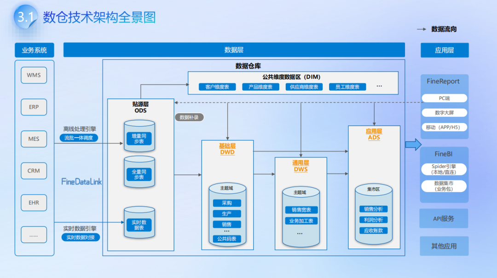

## 一、数据挖掘到底是什么？

数据挖掘，是从大量数据中识别规律、关系、结构和异常，并将这些发现转化为业务判断的过程。

它不等于简单查数，也不等于训练一个复杂算法。

比如，报表可以告诉企业：“本月有800名客户没有继续购买。”

数据挖掘则会进一步分析：

* 哪些客户更容易停止购买？  

* 客户流失前出现过哪些共同变化？  

* 最近购买时间、投诉次数和折扣敏感度，哪个因素影响更大？

* 能否提前识别高风险客户？  

* 识别出来之后，应该由谁采取什么措施？

因此，数据分析可以大致分成四个层次：

* 描述分析回答发生了什么；  

* 诊断分析回答为什么发生；  

* 预测分析判断未来可能发生什么；  

* 决策分析进一步回答应该采取什么行动。

**数据挖掘真正的价值，不是找出一个看起来很新奇的规律，而是把隐藏在数据中的模式，转化为可以验证、可以解释、可以执行的业务结论。**

不过，企业数据通常分散在CRM、ERP、MES、数据库、Excel和业务接口中。客户信息在一个系统，交易记录在另一个系统，投诉和服务数据又存放在其他平台。如果这些数据无法关联，再好的分析思路也很难落地。

这类场景可以先通过 **FineDataLink** 接入不同来源的数据，统一客户、订单、商品和业务编码，再形成可供后续分析和建模使用的数据集。

**数据挖掘不是从选择算法开始，而是从建立完整、可信的数据基础开始。**

## 二、数据挖掘背后的三个核心原理

## 1.从大量数据中寻找稳定模式

数据挖掘会观察不同变量之间是否存在相对稳定的关系。

例如：

* 客户购买频率下降后，流失概率是否增加；  

* 设备温度持续升高后，故障概率是否上升；  

* 促销折扣增加后，销量和利润分别如何变化；  

* 应收账款账龄变长后，坏账风险是否提高。

但必须注意：**相关关系不等于因果关系。**

两个指标同时变化，可能是一个影响另一个，也可能是受到第三个因素共同影响。

例如，冰淇淋销量和空调销量在夏天都会增加，但并不是购买冰淇淋导致消费者购买空调，真正影响两者的是气温。

因此，数据挖掘可以帮助企业发现“值得调查的关系”，却不能仅凭相关性直接得出因果结论。

一个规律是否可信，还要结合业务机制、时间顺序和对照分析继续验证。

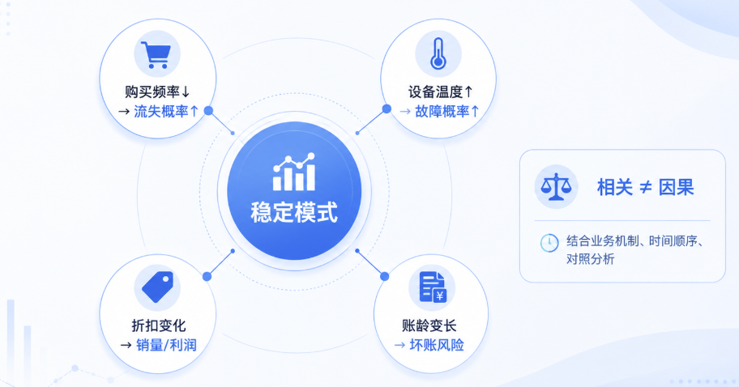

## 2.从历史样本中学习，再推断未知对象

分类、回归和预测模型，本质上都是从历史数据中学习规律，再把规律应用到新的客户、订单或设备上。

这里最大的风险是：**模型可能没有学到真正的业务规律，只是记住了历史数据中的偶然现象。**

例如，一个客户流失模型在历史样本上的准确率达到98%，但换到下个月的新客户后效果明显下降，说明模型可能出现了过拟合。

判断模型好不好，不能只看它对过去解释得多好，还要看它在没有参与训练的新数据上是否仍然有效。

**真正有价值的模型，不是对历史数据记得最牢，而是面对新数据时仍然能够做出稳定判断。**

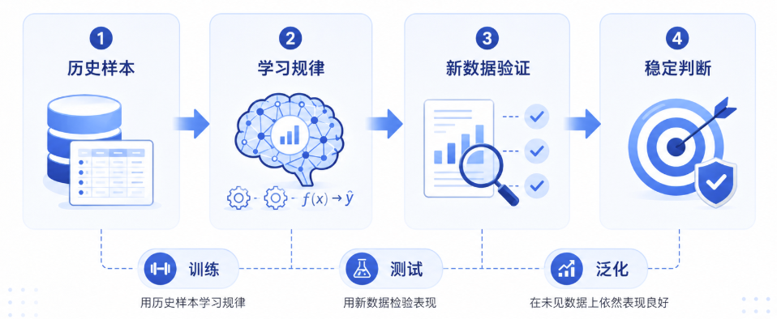

## 3.从噪声中提取真正有用的信号

企业原始数据并不是天然适合分析的。

其中可能存在缺失值、重复记录、异常数据、错误编码、口径冲突和时间错位。

比如，同一个客户可能被录入为“华东公司”“华东有限公司”和“华东集团”；销售金额可能同时存在含税、不含税、下单金额和确认收入等多个版本；订单显示已经完成，但对应的退货数据尚未同步。

如果底层数据不准确，算法不会自动修复业务逻辑，只会更加高效地放大错误。

**决定数据挖掘上限的是算法，决定数据挖掘下限的却是数据质量。**

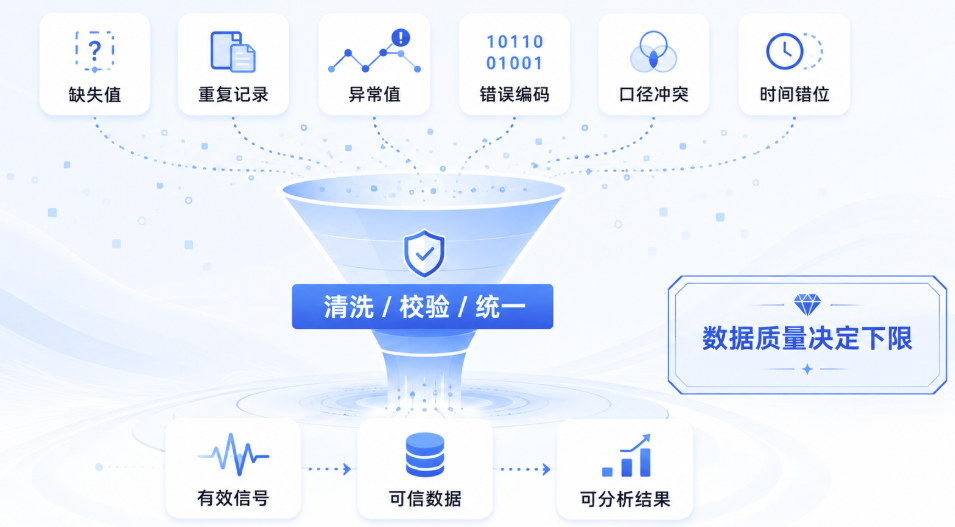

## 三、一套完整的数据挖掘流程

一套成熟的数据挖掘项目，通常要经历业务理解、数据理解、数据准备、模型建立、结果评价和部署迭代等环节。

**它不是一条只能向前推进的直线，而是一个不断返回、修正和验证的循环。**

### 第一步：把业务问题定义清楚

----------

数据挖掘最常见的错误，是一开始就讨论使用决策树、神经网络还是聚类算法，却没有说清楚究竟要解决什么问题。

“分析客户数据”不是一个完整的问题。

“识别未来30天内可能停止购买的高价值客户，并交给客户经理提前干预”，才是一个可以执行的数据挖掘问题。

一个完整的问题至少要明确五件事：

**分析对象是谁、预测什么结果、观察多长时间、结果由谁使用、采取什么行动。**

例如，预测客户流失时，还要先确定“流失”的定义：

* 30天没有购买算流失，还是90天没有购买算流失？  

* 所有客户使用同一标准，还是不同产品采用不同周期？  

* 已经注销的客户是否纳入样本？  

* 客户重新购买后，流失标签是否需要调整？

**标签定义不清楚，模型学到的就不是同一个问题。**

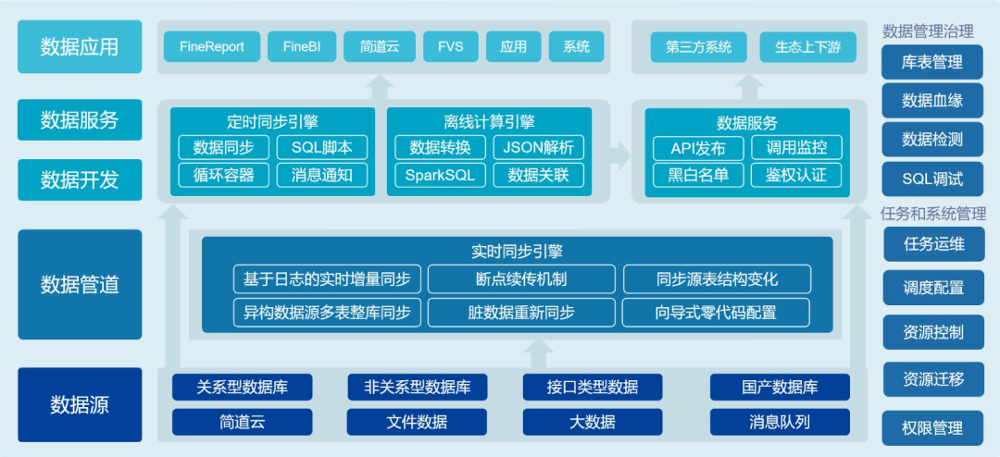

### 第二步：理解数据是怎样产生的

----------

拿到数据后，不能只看字段名称，还要理解每个字段背后的业务过程。

例如，“订单金额”可能是客户提交订单时的金额，也可能是扣除退款后的实际金额；“客户等级”可能由系统自动计算，也可能由销售人员手工维护。

还要重点确认三个问题。

第一，**数据粒度是否一致。**

客户表是一名客户一行，订单表是一笔订单一行，订单明细表则是一件商品一行。如果直接关联，很容易出现销售额被重复计算。

第二，**时间是否对齐。**

预测客户在未来30天是否流失，只能使用预测时点之前已经产生的数据，不能把未来信息放进模型。

第三，**样本是否具有代表性。**

如果训练数据只来自某个地区、某类客户或促销期间，模型未必适用于全部业务。

很多模型上线后效果下降，不一定是算法出了问题，也可能是训练样本与真实业务环境并不一致。

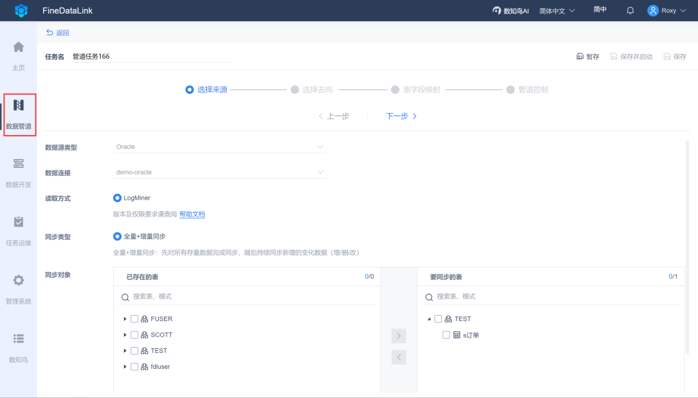

### 第三步：清洗数据并构造有效特征

----------

数据准备并不只是删除空值，而是把原始业务记录加工成能够反映行为规律的变量。

例如，原始数据中可能只有订单日期、订单金额和商品数量，但经过加工后可以得到：

* 距离最近一次购买的天数；  

* 最近三个月的购买次数；  

* 客单价变化率；  

* 退款和投诉次数；  

* 消费金额增长趋势；  

* 不同商品类别的购买占比。

这些加工后的变量，就是特征。

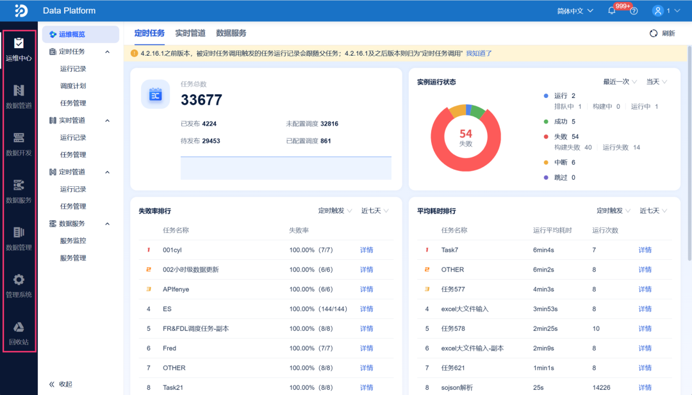

**好的特征不是越多越好，而是能够准确表达业务机制。**

比如分析客户流失，与其放入几十个意义不明的系统字段，不如重点关注最近购买时间、购买频率、消费金额变化、投诉情况和服务触达等真正反映客户关系的变量。

当数据来源较多时，可以利用 **FineDataLink** 建立数据同步和转换任务，对字段进行**清洗、映射、关联、过滤和汇总**，并按照日、小时或业务需要持续更新结果。

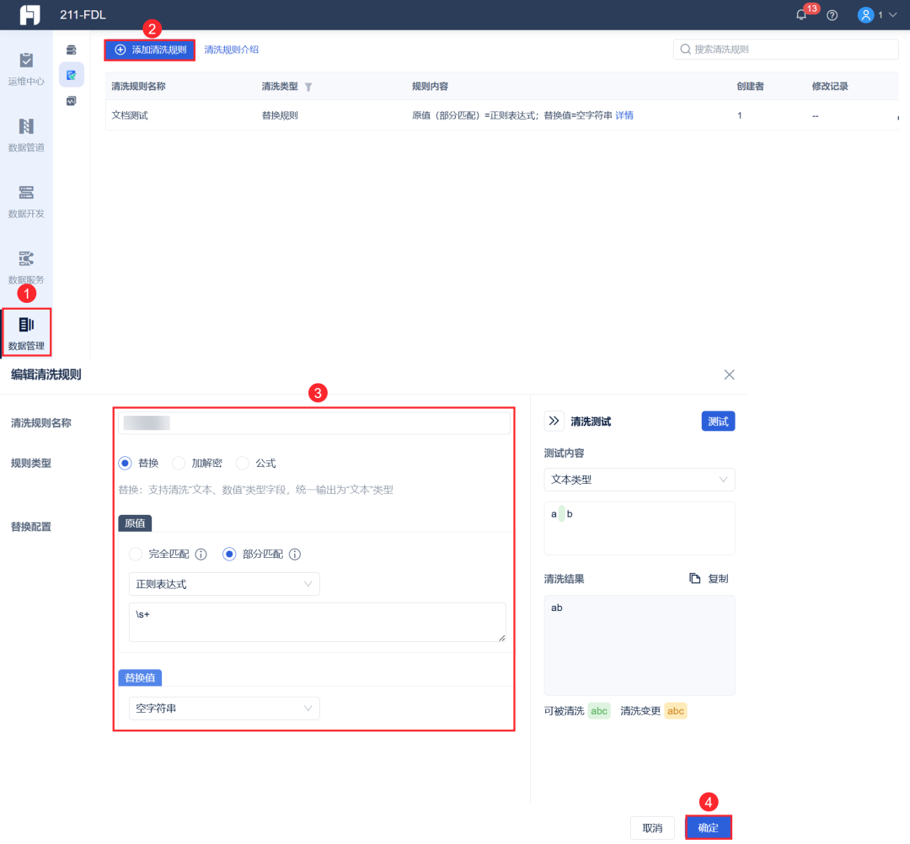

这样，特征数据不再依赖分析人员每次手工拼表，而是能够沉淀为一套可重复运行的数据处理流程。

**真正成熟的数据挖掘项目，不是每次重新整理一份数据，而是建立一条稳定、可追踪的数据加工链路。**

**第四步：先建立基准模型，再逐步增加复杂度**  

----------

模型并不是越复杂越好。

实际项目中，可以先用简单规则、均值预测或逻辑回归建立基准结果，再判断复杂模型是否真正带来了明显提升。

如果一个复杂模型的准确率只提高了1%，但解释难度、维护成本和运行资源增加了数倍，那么它未必是更好的选择。

模型选择至少要平衡四个方面：

**预测效果、可解释性、运行效率和维护成本。**

金融风控、质量判断等场景往往更重视解释性；广告推荐、需求预测等高频场景，则可能更加重视预测效果和计算效率。

**企业真正需要的不是技术上最先进的模型，而是在当前业务条件下最合适的模型。**

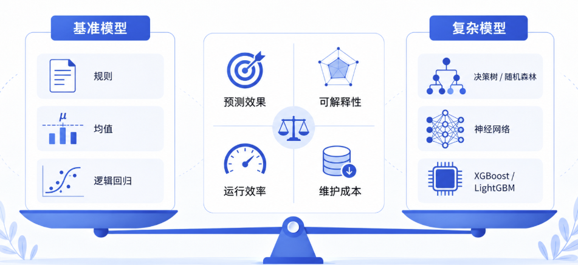

### 第五步：用业务损失评价模型

----------

技术指标不能脱离业务场景。

假设1000名客户中只有10名会流失，一个模型把所有客户都判断为“不流失”，准确率仍然可以达到99%，但它没有识别出任何真正需要干预的客户。

因此，类别不平衡时，不能只看准确率，还要看精确率、召回率、F1值以及不同阈值下的结果变化。

更重要的是，要把模型错误转化为业务成本：

* 漏掉一名高风险客户会损失多少收入？  

* 错误提醒一名普通客户需要多少干预成本？  

* 客户经理每天最多能处理多少名单？  

* 模型带来的收益能否覆盖建设和维护成本？

例如，一个模型识别出5000名高风险客户，但运营团队每天只能跟进200人，那么模型即使召回率很高，也无法直接落地。

企业还要根据客户价值、风险概率和处理能力进行排序，优先处理高价值、高风险且可挽回的对象。

**最优模型不一定是准确率最高的模型，而是能够在有限资源下创造最大业务收益的模型。**

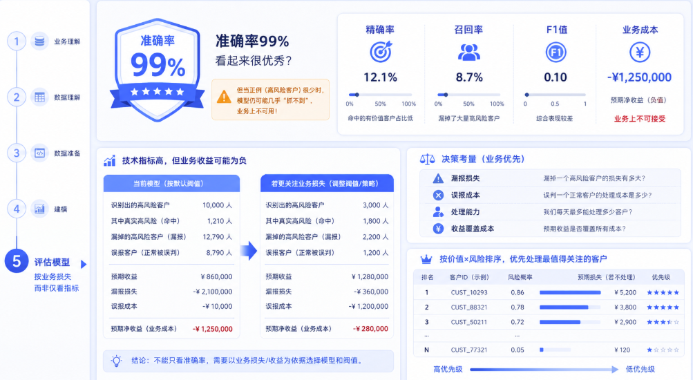

### 第六步：让结果进入真实业务流程

----------

模型输出一个风险概率，只是分析过程的中间结果。

如果高风险客户名单没有同步给客户经理，设备故障预警没有进入维修流程，库存预测没有影响采购计划，模型就只能停留在报告中。

真正的落地需要形成完整闭环：

**模型识别对象—业务人员处理—记录处理结果—评估实际效果—更新数据和模型。**

例如，模型判断某客户流失概率为85%，还需要进一步明确：

* 由哪个客户经理跟进？  

* 采用电话、优惠券还是售后回访？  

* 多长时间内必须处理？  

* 客户是否重新购买？  

* 干预成本和挽回收入分别是多少？

模型产生的客户标签、异常记录和预测结果，可以通过 **FineDataLink** 写回**数据库、业务系统或数据仓库**，也可以通过接口提供给其他应用调用。

这样，数据挖掘结果不再依赖人工复制，而是能够真正进入运营、风控、采购和设备管理流程，并持续沉淀新的反馈数据。

**只有当模型结果改变了业务动作，数据挖掘才算真正完成。**

## 四、六种常见的数据挖掘方法，分别解决什么问题？

## 1. 分类：判断某件事会不会发生

分类用于预测离散结果，例如客户会不会流失、贷款是否违约、产品是否合格、交易是否存在风险。

分类模型通常不会只给出“是”或“否”，而是给出一个概率。

例如，客户A的流失概率为85%，客户B为52%。企业可以根据客户价值、处理成本和团队能力，决定从哪个概率开始预警。

这里的关键是：**分类阈值不是固定的，而要由业务损失决定。**

* 如果漏掉一个高风险客户的损失很大，可以适当降低阈值，提高召回率；  

* 如果人工审核成本很高，则可以提高阈值，只处理风险最高的对象。

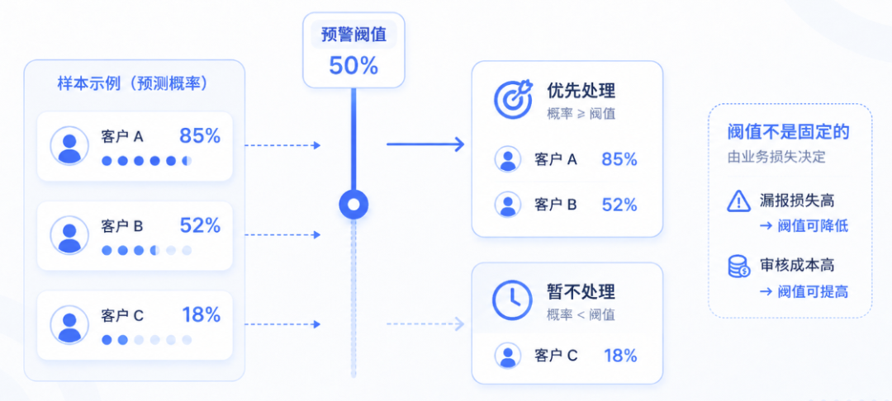

## 2. 回归：预测具体数值

回归用于预测销售额、成本、交付时间、客户终身价值和设备剩余寿命等连续结果。

回归分析不能只看预测值，还要看误差范围。

如果模型预测下月销量为10万件，但可能误差3万件，那么采购部门不能直接按照10万件备货，还要结合安全库存、供应周期和缺货成本制定方案。

**预测不是给出一个绝对准确的数字，而是缩小未来的不确定范围。**

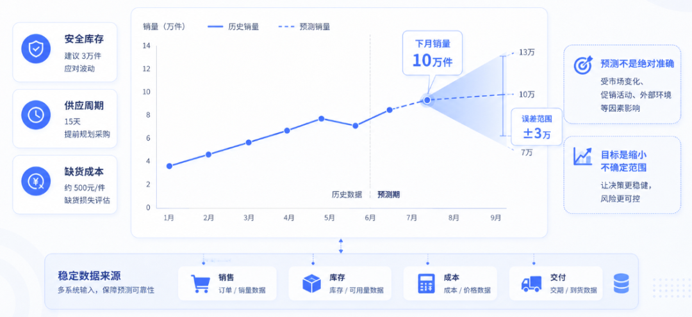

真正落地时，预测结果的稳定性，很大程度上取决于底层数据是否持续、准确地更新。**FineDataLink** 能够统一汇集ERP、CRM、MES等系统中的**销售、库存、成本和交付数据**，并完成**清洗、转换和汇总**，为销量预测、成本估算和交付周期分析提供稳定的数据来源，也减少了反复导表、手工拼接带来的误差。

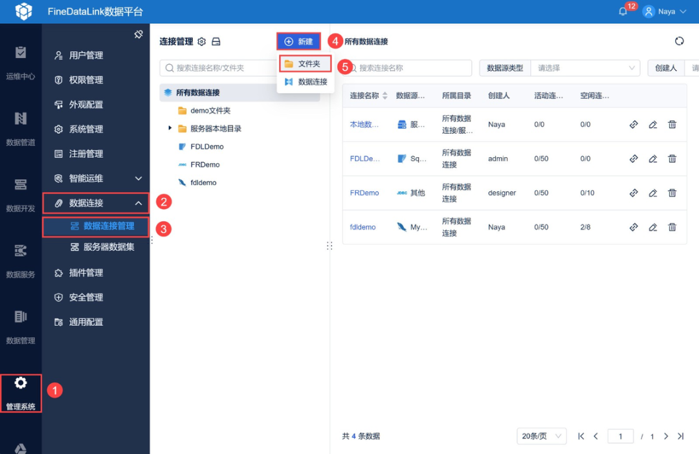

## 3. 聚类：在没有标签时自动分组

聚类适用于企业不知道应该怎样分类，但希望从数据中发现自然群体的场景。

例如，可以根据消费金额、购买频率、价格敏感度和投诉情况，把客户分成高价值稳定型、促销敏感型、低频潜力型和流失风险型。

但聚类结果必须满足两个条件：

* 一是不同群体之间确实存在明显差异；  

* 二是每个群体都能对应具体运营策略。

如果聚类后只能得到“第一类客户、第二类客户、第三类客户”，却说不清它们有什么区别、应该采取什么行动，这种分类就没有实际意义。

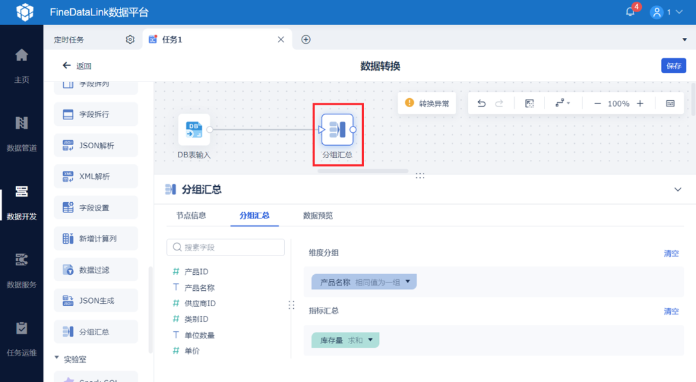

## 4. 关联规则：发现哪些行为经常一起出现

关联规则常用于购物篮分析、交叉销售、故障组合和业务流程分析。

例如，购买打印机的客户是否经常同时购买耗材；发生某类设备报警后，是否经常出现另一类故障。

判断一条关联规则是否有价值，不能只看两个行为共同出现了多少次。

面包和牛奶经常一起购买，可能只是因为两者本身销量都很高。只有当“购买面包的人购买牛奶的概率”，明显高于普通顾客购买牛奶的概率时，这条规则才更有意义。

因此，关联规则通常要结合**支持度、置信度和提升度**共同判断：

* 支持度看组合出现得够不够多  

* 置信度看前一个行为发生后，后一个行为出现的概率；  

* 提升度则判断这种关系是否明显高于随机水平。

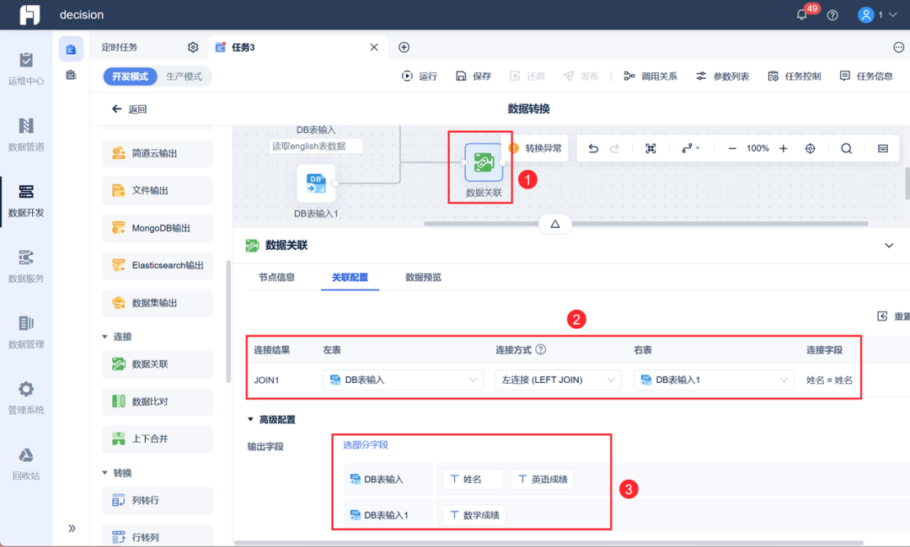

## 5. 异常检测：识别偏离正常规律的对象

异常检测适合发现异常交易、设备故障、费用异动、库存突变和数据质量问题。

它与分类最大的区别是，分类通常需要提前拥有“正常”和“异常”的历史标签，而异常检测可以先建立正常规律，再识别明显偏离规律的对象。

例如，一笔10万元的交易不一定异常。对于大型企业客户可能很正常，但对于长期只购买几百元商品的个人客户，就可能值得关注。

因此，**异常必须放在具体对象和业务背景中判断，不能只设置一个统一数值。**

而且异常不一定代表错误。某家门店销量突然增长，可能是数据录入问题，也可能是附近举办活动、竞争对手停业或商品突然走红。

数据挖掘负责发现异常，业务人员负责解释异常。

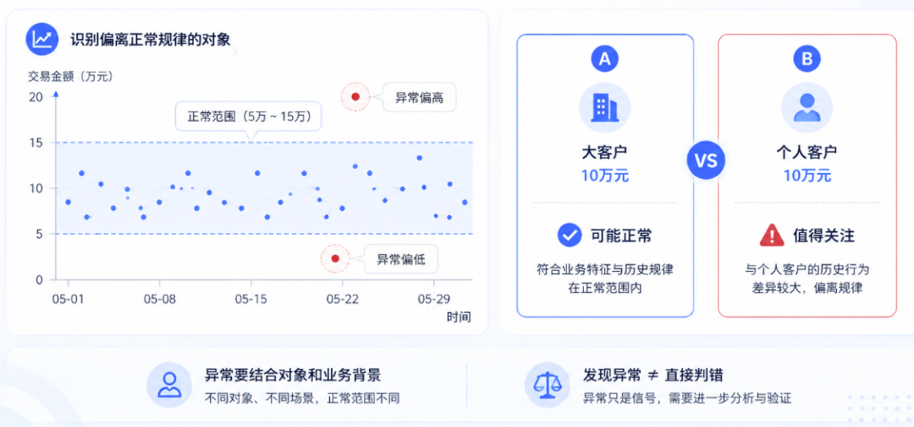

## 6. 时间序列：利用时间规律预测未来

时间序列主要分析趋势、季节性、周期和突发变化。

例如，餐饮销量可能存在周末效应，零售销售存在节假日高峰，制造企业的设备故障也可能随着运行时间增加而上升。

时间序列预测不能只是把历史平均值向后延伸，还要考虑促销、价格变化、节假日、市场环境和供应能力。

更重要的是，预测必须具有足够的提前量。

如果模型能够提前两个月预测原材料需求，采购部门就有时间调整订单；如果只能提前一天发现缺货，即使结果非常准确，也很难采取行动。

**好的预测不仅要准确，还要给业务留下足够的反应时间。**

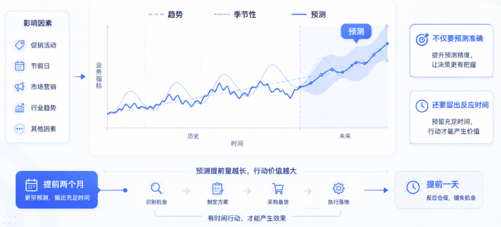

## 结语

数据挖掘并不是把数据交给算法，然后等待系统自动给出答案。

它真正的逻辑是：

从业务问题出发，理解数据如何产生，建立统一可靠的数据基础，把业务经验加工成有效特征，选择合适的方法验证规律，最后让结果进入真实业务流程。

**算法决定企业能不能发现规律，数据质量决定规律是否可信，业务机制决定这些规律能不能产生价值。**

真正高水平的数据挖掘，不是做出最复杂的模型，也不是追求一张最漂亮的技术评分表。

**而是找到一个过去看不清、现在能解释、未来可行动的问题。**

### 点击【阅读原文】，体验文中同款资料包

