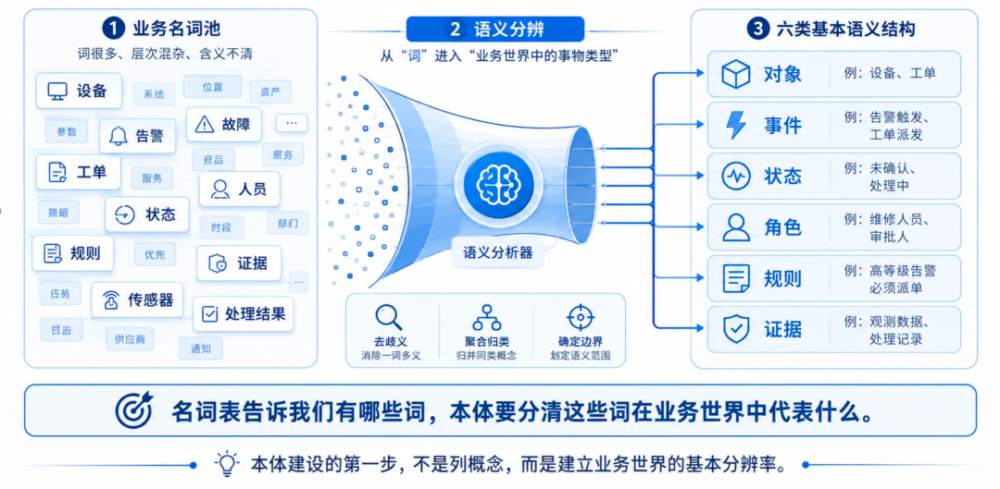
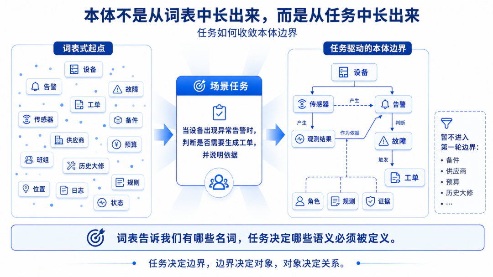
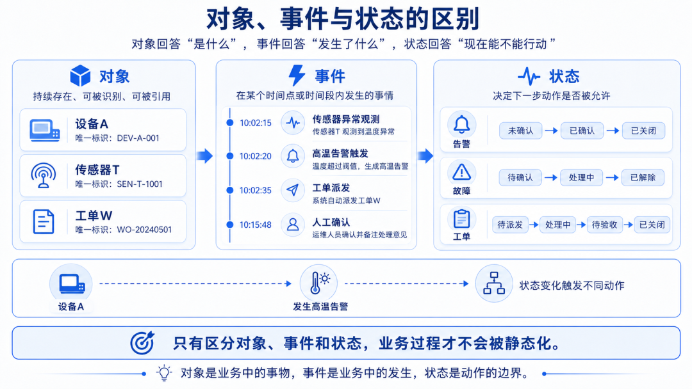
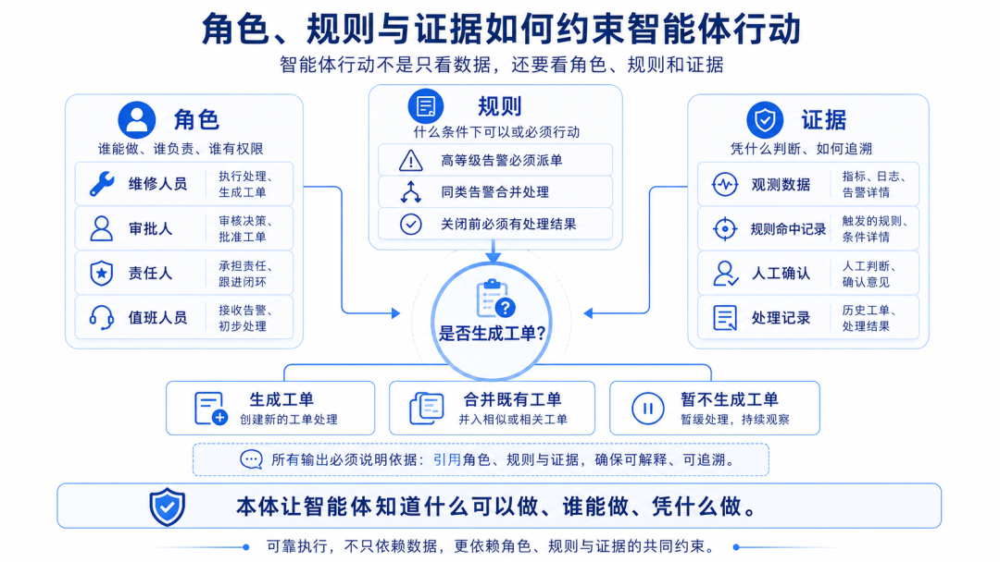
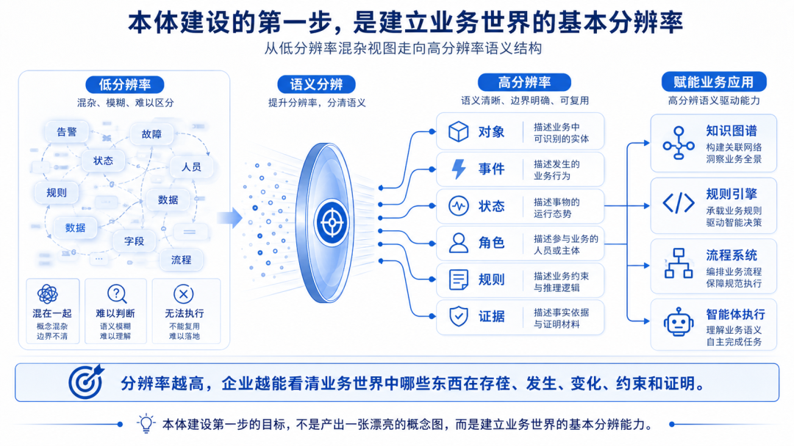

# 📰 本体建设第一步：如何识别业务对象、关系和状态？

|本体建设的第一步，不是列概念，而是建立企业理解业务世界的基本分辨率。|
|----------------------------------|

在前一篇文章中，我们已经把本体的构建路径收束为一条基本线索：

全局蓝图不让方向跑偏，场景闭环让价值落地，语义模块让能力复用。

这条路径解决的是“企业应该怎样开始”的问题。它提醒我们，本体建设既不能一开始陷入全域概念图的宏大冲动，也不能只满足于某个局部场景的临时闭环。更合理的做法，是在全局语义蓝图的牵引下，从一个能够暴露语义问题的业务场景进入，在真实任务中逐步识别对象、关系、状态、规则和证据，再把其中稳定的结构沉淀为企业级语义模块。

但这条路径一旦进入实际建设，很快会遇到第一个具体问题：

场景已经选好了，本体到底从哪里开始建？

很多项目会自然地从“列概念”开始。业务部门给出术语，数据部门提供字段，系统厂商导出数据字典，项目组再把这些名词整理成概念表。看起来这是一种很稳妥的做法，因为本体毕竟要描述业务世界，而业务世界首先是由概念构成的。

可是，真正的问题也正从这里开始。

本体建设的第一步，并不是把业务名词收集得越多越好，而是要先分清这些名词在业务世界中究竟代表什么。它们是持续存在的对象，还是一次发生的事件？是一个业务过程，还是过程中的某个状态？是一个具体的人，还是某种角色？是系统字段，还是业务证据？是规则本身，还是规则作用的对象？

如果这一步没有分清，后面所有建模都会变得不稳定。知识图谱会变成松散的关联图，规则会变成写死在系统里的条件判断，智能体会看到很多信息，却不知道哪些信息可以作为行动依据。

所以，本体建设真正的第一步，不是画图，而是理解业务世界里真正发生了什么。

图1 本体建设的第一步：从名词收集走向语义分辨

名词很多，不等于业务世界被理解了

企业做本体时，最容易得到的是名词。

以设备告警处理为例，业务人员很快就能列出一批词：设备、传感器、点位、监测值、阈值、告警、故障、工单、维修人员、责任部门、处理结果、规则、状态、记录、证据。

这些词都重要，也都可能进入本体。但如果项目只是把它们逐个录入概念表，再为每个词补上定义、属性和关系，这还不能算真正完成了本体建模。

因为这些词并不处在同一个层面。

设备通常是一个持续存在的物理对象。传感器可能是设备的一部分，也可能是独立的监测装置。监测值是某次采集形成的数据事实。告警是由异常观测触发的事件或通知。故障是对设备异常状态的业务确认。工单是围绕处置活动形成的任务对象。维修人员在现实中是一个人，但在业务场景中更重要的是他承担了什么角色。处理结果不是普通文本，而可能是工单关闭的必要证据。

这些差异如果不被识别，名词越多，混乱越大。

把告警当成故障，智能体可能在没有确认的情况下给出维修结论。把维修人员当成设备的固定属性，系统就会忽略不同区域、班组、时间段下责任关系的变化。把处理结果当成普通备注，流程就可能在缺少证据的情况下允许关闭工单。把状态当成标签，规则就无法判断某个动作现在是否被允许。

因此，本体不是名词表的升级版。

名词表告诉我们企业里有哪些词，本体要说明这些词所代表的事物在业务世界中如何存在、如何变化、如何发生关系，并且如何影响判断和行动。

先从业务任务反推本体边界

识别业务对象之前，必须先明确业务任务。

如果没有任务，本体很容易向四面八方扩展。设备要不要建？传感器要不要建？空间位置要不要建？维修记录要不要建？备件要不要建？人员排班要不要建？供应商要不要建？从概念上看，它们都相关；但从当前任务看，它们未必都需要进入第一轮本体边界。

所以，本体建设不能从“这个领域有哪些概念”开始，而要从“这个场景要完成什么任务”开始。

在设备告警处理场景中，一个清晰的任务可以这样表述：

当设备出现异常告警时，系统或智能体能否判断是否需要生成工单，并说明判断依据。

这个任务一旦确定，本体边界就开始收敛。项目不需要一开始描述所有设备管理知识，而是要优先识别那些参与判断的关键对象。告警来自哪里？它和设备是什么关系？告警是否已经恢复？它是否指向已确认故障？当前是否已有同类未关闭工单？什么规则决定必须派单？谁有权限执行派单？最终判断依据如何追溯？

这些问题会把本体从“概念整理”拉回“业务判断”。

也正是在这个意义上，本体不是从词表中长出来的，而是从任务中长出来的。任务决定边界，边界决定对象，对象决定关系，关系和状态共同决定规则是否能够执行。

图2 本体不是从词表中长出来，而是从任务中长出来

识别对象：先找到业务判断中真正被处理的东西

所谓业务对象，不是所有出现在业务语言中的名词，而是在场景中具有相对稳定身份，并且会被识别、引用、判断或处理的东西。

设备是对象，因为它持续存在，有编号、类型、位置、状态和生命周期。传感器也是对象，因为它可以被安装、维护、替换，也会产生观测数据。工单是对象，因为它有创建、派发、处理、验收、关闭等生命周期。故障也可以被建成对象，因为它一旦被确认，就会成为后续处置、统计、追溯和分析的中心。

但不是所有名词都应该直接作为对象。

“高温”可能不是对象，而是某类观测异常。“超阈值”可能不是对象，而是判断条件。“处理中”不是对象，而是工单的状态。“必须派单”不是对象，而是规则约束。“维修负责人”表面上像一个人，实际上在业务判断中可能首先是一个角色。

这就是本体建模和普通数据建模的重要差异。

数据建模常常关心一张表里有哪些字段，而本体建模首先关心这个字段背后代表的业务事物是什么。如果“负责人”只是一个字段，那么它可以填某个人名；但如果“负责人”是一个角色关系，那么它还要回答这个人为什么负责、在哪个区域负责、在什么时间负责、是否具备当前动作的权限。

当对象识别准确之后，后续关系、状态、规则才有稳定落点。否则，规则不知道作用于谁，状态不知道属于谁，证据也不知道在证明什么。

区分事件：不是所有发生过的事都应该当成对象

企业场景中还有一类非常容易被误判的东西，就是事件。

事件不是持续存在的对象，而是在某个时间点或时间段内发生的事情。一次告警触发、一次状态变更、一次工单派发、一次人工确认、一次系统回写，都可以被理解为事件。

事件的价值在于，它把业务世界从静态描述拉向动态过程。

设备是持续存在的，但“设备发生高等级温度告警”是事件。工单是持续存在的任务对象，但“工单被派发给某个维修人员”是事件。故障可以作为被确认后的业务对象，但“故障被确认”本身是事件。

为什么要区分对象和事件？

因为它们承担的语义作用不同。对象回答“是什么”，事件回答“发生了什么”。对象可以有状态，事件通常带有时间、参与者、触发原因和结果。对象可以被长期引用，事件则构成过程追溯的关键节点。

如果把事件建模成普通对象，业务过程会被静态化。系统可能知道有一个“告警”，却说不清它什么时候触发、由什么观测触发、触发后导致了什么动作。如果把事件忽略掉，证据链就会断裂。智能体可以给出结论，却无法说明这个结论是经过哪些业务变化一步步形成的。

因此，本体建设不能只识别“有哪些对象”，还要识别“哪些事情正在发生”。只有事件被识别出来，业务过程才有可能被追溯。

状态不是标签，而是动作边界

在企业本体中，状态经常被低估。

很多系统把状态当成一个字段。告警状态、工单状态、设备状态、故障状态，看起来只是枚举值。但在本体视角下，状态不是普通标签，而是业务动作的边界。

同一对象处于不同状态时，允许执行的动作完全不同。

一个告警如果处于“未确认”状态，智能体也许只能建议核查，不能直接生成维修结论。一个告警如果已经恢复，是否仍然派单，就要看规则是否要求事后处置。一个工单如果处于“处理中”，可能不能再次派发；如果处于“待验收”，则需要处理结果和验收记录；如果处于“已关闭”，通常不允许再被普通流程修改。

状态决定了对象当前处在业务生命周期的哪个位置，也决定了下一步动作是否被允许。

这就是为什么本体建设不能只定义对象，还必须定义状态。对象回答“这是什么”，状态回答“它现在处在什么业务位置”。而规则往往正是根据状态来判断动作是否可以发生。

如果状态没有被本体化，智能体就很难可靠行动。它可能知道有一条告警，也知道这条告警来自某台设备，但如果不知道告警当前是否已确认、是否已恢复、是否已关闭，就无法判断是否应该派单、合并、忽略或升级。

因此，状态建模不是流程系统的附属工作，而是企业本体能否进入执行链路的关键环节。

图3 对象、事件与状态的区别

角色不是人，角色是人在场景中的责任位置

在企业业务中，“人”也经常被错误建模。

系统里可能有人员表，记录姓名、工号、部门、联系方式。于是项目组很容易把“维修人员”“审批人员”“责任人”“管理员”都理解为人员属性。但从本体角度看，角色和人不是一回事。

人是现实中的主体，角色是人在某个业务场景中承担的责任位置。

同一个人可以在一个场景中是维修人员，在另一个场景中是审批人；在白班是责任人，在夜班不是；在某个区域有处置权限，在另一个区域没有。角色不是人的静态属性，而是由组织、权限、场景、时间和对象共同确定的关系。

这一点对智能体尤其重要。

当智能体准备创建工单、派发任务或修改状态时，它不能只知道“张三是员工”。它必须知道张三是否是当前设备所在区域的责任人，是否在当前班次，是否具备处置该类告警的权限，是否可以执行关闭工单这样的动作。

如果把角色误建成固定人员属性，权限判断就会变得非常脆弱。系统可能在某些场景中看起来能运行，但一旦组织结构、值班安排、区域划分发生变化，规则就会失效。

因此，本体建设要把“人”和“角色”区分开来。人在组织中存在，角色在场景中生效，权限则依附于角色与动作之间的关系。

规则不是一句制度文本，而是作用于语义对象的约束

企业有大量规则。制度文件里有规则，流程系统里有规则，审批条件里有规则，业务人员的经验里也有规则。

但规则要进入本体和智能体执行链路，不能停留在自然语言文本中。它必须能够作用于明确的语义对象、状态和关系。

例如，“高等级告警必须生成工单”这句话看起来很简单，但真正执行时需要回答很多问题。什么是高等级告警？等级来自告警对象的属性，还是由观测结果和设备重要性共同计算？生成工单之前是否要检查同类未关闭工单？生成的工单属于哪类工单？派给谁？是否需要人工确认？如果告警已经恢复，这条规则还是否适用？

这些问题说明，规则并不是孤立存在的。

规则依赖本体定义的对象，依赖状态判断，依赖关系识别，也依赖证据链。没有本体，规则只能被写死在系统代码或流程配置里；有了本体，规则才有机会建立在稳定的业务语义之上。

本体并不一定要替代规则引擎，也不一定要把所有制度文本都形式化。但本体必须为规则提供语义地基。它要让规则知道自己作用于什么对象，判断什么条件，约束什么动作，生成什么结果，以及需要哪些证据支撑。

这也是本体从“描述业务”走向“约束业务”的关键一步。

证据不是附件，而是判断可信度的一部分

企业智能体和普通问答系统最大的不同，在于它不仅要给出回答，还可能要触发动作。

一旦智能体开始生成工单、修改状态、调用系统、回写结果，企业就不能只问“它答得对不对”，还要问“它为什么这样判断”。

这时，证据就变得非常重要。

在设备告警处理中，证据可能包括原始观测数据、告警触发记录、阈值配置、设备信息、历史工单、规则命中记录、人工确认意见、处理结果、系统回写日志。它们不是附属材料，而是判断链条的一部分。

一个可靠的智能体不能只说“建议生成工单”。它需要能够说明：这条告警由哪个传感器的异常观测触发，为什么被判定为高等级，是否存在同类未关闭工单，命中了哪条派单规则，当前操作者是否具有权限，最终工单创建动作是否已经记录。

如果没有证据语义，本体可能支撑“看起来合理”的结论，但很难支撑可审计的执行。

所以，本体建设在识别对象、事件、状态、角色和规则的同时，也要识别证据。证据回答的是“这个判断凭什么成立”。对于企业智能体而言，这不是锦上添花，而是可信执行的前提。

图4 角色、规则与证据如何约束智能体行动

本体建设的第一步，是建立业务世界的基本分辨率

对象、事件、状态、角色、规则、证据，这些并不是本体建设的全部，但它们构成了第一层分辨率。

所谓分辨率，是指企业能否看清业务世界中的差异。

如果分辨率太低，所有东西都会被混在一起。告警和故障分不清，人员和角色分不清，状态和标签分不清，规则和经验分不清，数据和证据分不清。这样的本体即使画得很大，也很难支撑复杂业务判断。

如果分辨率足够高，企业就能开始看清业务世界的结构。哪些东西持续存在，哪些事情正在发生，哪些状态影响动作，哪些角色承担责任，哪些规则约束流程，哪些证据支撑结论。

这种分辨率一旦建立起来，后续工作才有基础。

知识图谱可以基于它连接事实，规则引擎可以基于它判断条件，数据治理可以基于它统一口径，流程系统可以基于它控制状态变化，智能体可以基于它理解自己能做什么、不能做什么、为什么这样做。

因此，本体建设第一步的真正目标，不是产出一张漂亮的概念图，而是帮助企业建立对业务世界的基本分辨能力。

图5 本体建设的第一步，是建立业务世界的基本分辨率

## 结语：先分清事物，再讨论建模

企业建设本体，最怕一开始就急着画图。

图画得越快，越容易把没有分清的东西固定下来。告警、故障、工单、人员、角色、状态、规则、证据一旦被错误地放在同一层级，后面再想调整就会非常困难。

所以，本体建设的第一步，不是把业务名词列全，而是分清业务世界里真正发生了什么。

哪些是持续存在的对象，哪些是一次发生的事件；哪些是过程中的状态，哪些是人在场景中承担的角色；哪些是制度文本中的规则，哪些是规则作用的对象；哪些只是系统字段，哪些能够成为判断依据和证据。

当这些差异被识别出来，企业本体才真正有了起点。

从这一刻开始，本体不再是一张静态概念图，而是一种帮助企业理解业务世界、约束业务动作、支撑智能体可靠执行的语义结构。

下一篇，我们可以继续深入一个更容易被忽视的问题：

关系不是连线：本体如何把业务关系建清楚？

转载声明

本文由「智能数据研讨」整理/发布。转载请注明来源、作者及原文链接，并保持内容完整。若涉及版权问题，请联系后台处理。
