# 📰 OpenAI 如何构建内部数据智能体（Data Agent）

# OpenAI 如何构建内部数据代理（Data Agent）

[\#OpenAI]() [#DataAgent]() [#AI]() [#数据工程]() [#LLM]() [#架构设计]() [#Codex]() [#大数据]() [#最佳实践]()

## 数据分析的真正瓶颈：不是写 SQL

>
>
> "I'm figuring out the right tables to use. And I haven't even written a line of SQL."
>
>

数据平台工程主管 Emma Tang 一针见血地指出：**数据分析最难的部分从来不是写 SQL，而是找到正确的表和正确理解数据的语义。**

OpenAI 的数据平台存储着 **1.5 exabytes（艾字节）** 的数据，横跨 **90,000 张表**，服务约 **4,000 名内部用户**。在这个规模下，许多表看起来相似但含义完全不同——表的粒度是什么？如何与其他表关联？分析师在写 SQL 之前，可能已经花了好几个小时来搞清楚该用哪些表、怎么用。

去年，OpenAI 数据平台团队用 **2 名工程师、3 个月时间**，构建了一个内部数据代理（Data Agent）。70% 的代码由 AI 编写。团队的哲学是：**"vanilla agent, rich foundation"（朴素的代理，丰富的基础设施）**。

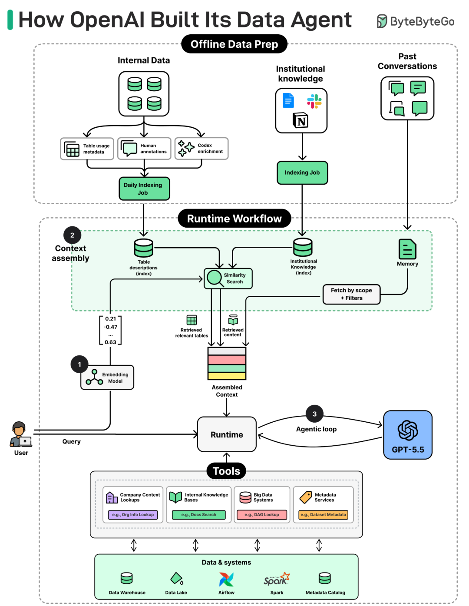

## 第一印象：在 Slack 里问数据

想象一下：OpenAI 的一名工程师或营销人员想快速了解某个数据。他们打开 Slack，用自然语言提问。几秒钟后，代理回复了答案、它运行的 SQL 以及查询来自哪些表。

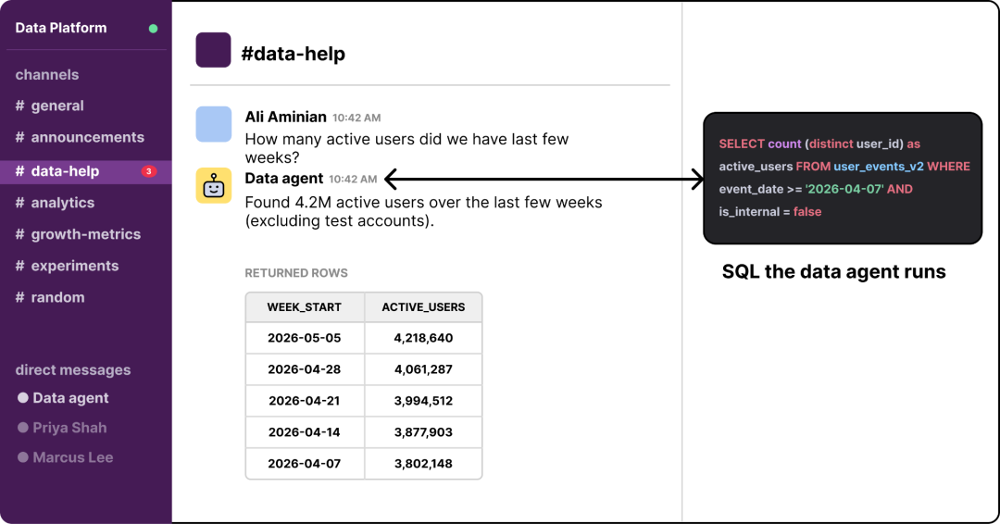

这就是 OpenAI 数据代理的用户体验——在所有员工已经工作的场景中无缝嵌入。

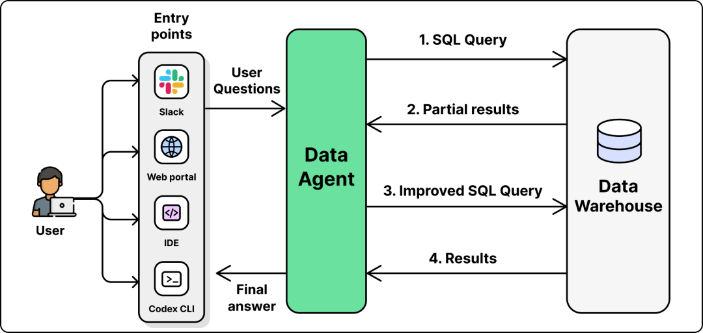

### 代理的接入点覆盖了整个工作流

* **Slack 机器人**
* **Web 门户**
* **IDE 集成**
* **Codex CLI**

  （通过 MCP 协议）

* **内部 ChatGPT**

  （通过 MCP 连接器）

## 核心理念：简单到极致，但基础设施足够强大

大多数团队构建数据代理时，会叠加路由器（router）、微调模型（fine-tuning）和复杂的检索管道。OpenAI 走了截然相反的路。

## 基础模式：LLM + 运行时框架（Harness）

代理的基本模式是一个 LLM 加上一个运行时框架。LLM 提供推理能力，运行时框架提供工具和代理循环，将推理转化为行动。

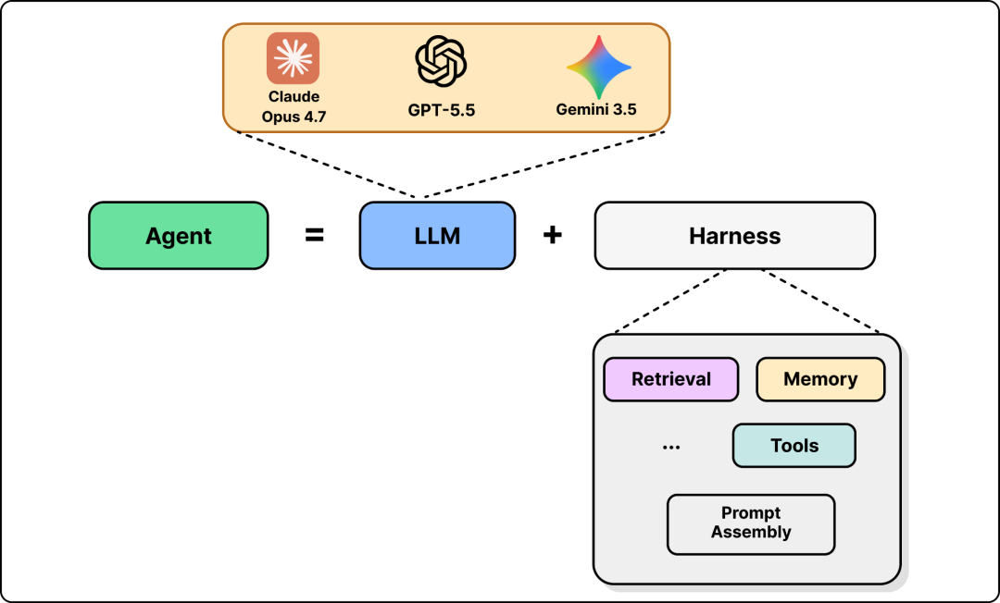

LLM 提供推理能力，但仅凭 LLM 无法操作数据。它不能运行 SQL 查询，不能对结果采取行动。正是运行时框架（Harness）填补了这一空白。

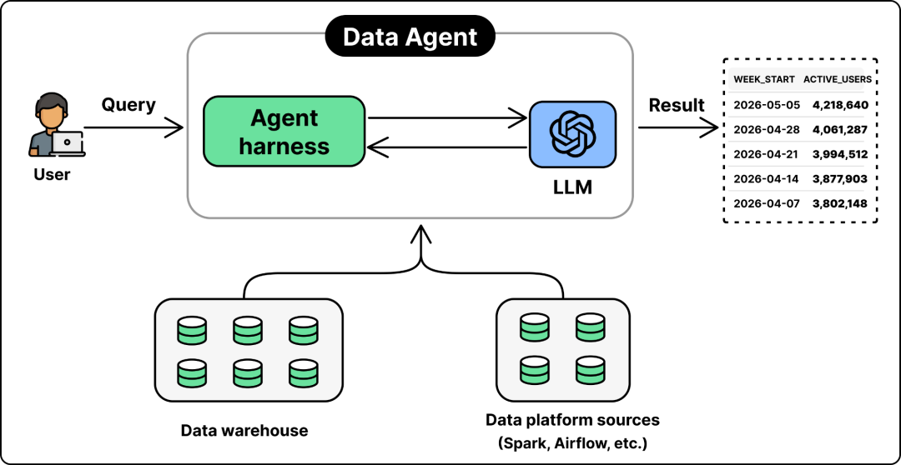

许多代理系统在这一点上变得复杂——添加路由器将简单问题发给小模型、复杂问题发给大模型，混合多个 LLM，微调内部数据模型，或构建不同嵌入模型组成的复杂检索管道。每一种选择都增加了成本、延迟和更多故障点。

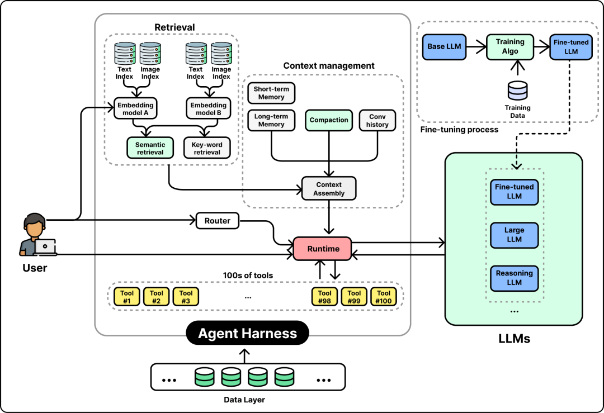

OpenAI 的数据团队走了不同的路。

### OpenAI 数据代理架构由四个组件构成

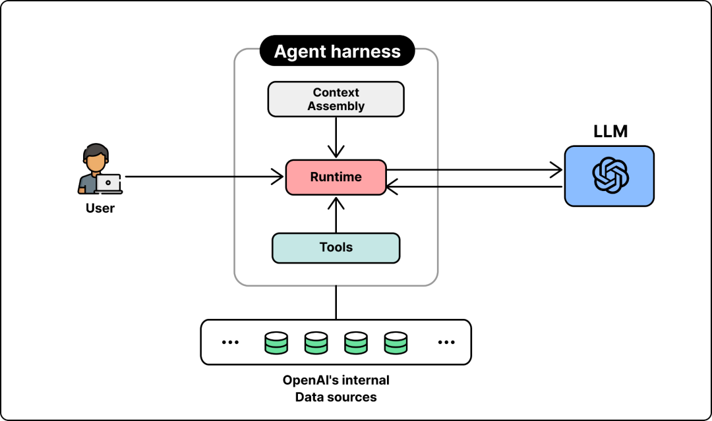

## 1. 单一 LLM

每个请求都使用 **GPT-5.5** 作为基础模型。没有路由器，没有多模型混合，没有微调。

## 2. Runtime（运行时）

驱动每个请求的编排器。解析模型输出、调度工具调用、将结果反馈给模型，形成「推理→行动→观察→再推理」的循环。

## 3. Context Assembly（上下文组装）

**这才是真正的工程核心所在。** 没有正确的上下文，再强的模型也会答错。裸 schema 不足以区分表。例如，两张表都有 user\_id 列，看起来几乎一样，但一张包含已登出用户而另一张不包含。从 schema 看，模型根本无法判断该选哪张。

## 4. 工具集（13 个）

经过精心筛选，**仅 13 个工具**，涵盖公司上下文查询、内部知识库、Airflow/Spark 等大数据系统和元数据服务。

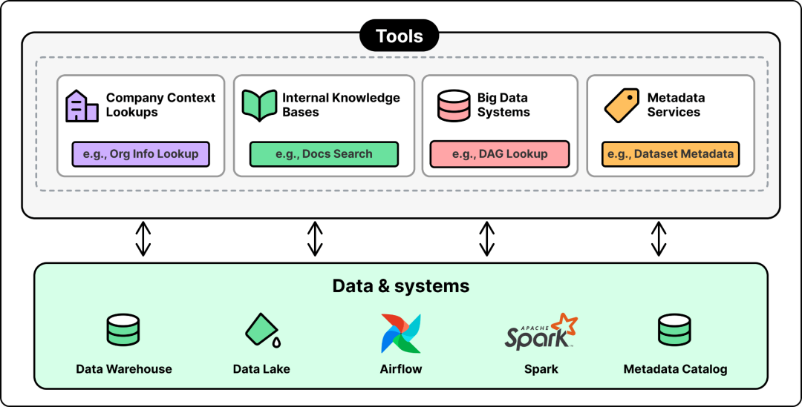

---

## 六个上下文层：让一个模型搞定 90,000 张表

代理依赖 **六层上下文** 来构建正确的表描述：

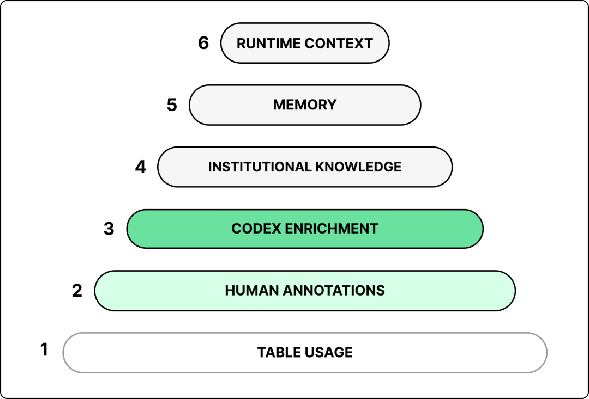

## 第 1 层：表使用元数据

表的 schema、血缘关系以及历史查询记录。并非所有查询都同样有用——**数据科学家编写的高频仪表盘查询**权重最高（因为它们通常是正确且可复用的），一次性探索性查询权重最低。

## 第 2 层：人工注释

表所有者编写的描述，包含业务含义、所有权、关键性和已知注意事项。这些信息无法从 schema 或历史查询中推断。

## 第 3 层：Codex 代码富化（秘密武器）

每晚，Codex 作业爬取生产每张表的管道代码。每次批量处理 100-200 张表，每张表耗时 5-10 分钟。通过读取代码，它捕获表实际包含什么数据、如何派生、数据新鲜度以及何时使用它而不是类似表。

## 第 4 层：制度知识

大量公司数据上下文存在于数仓之外——Slack 讨论、Google 文档、Notion 页面。这些文档被单独提取和嵌入，通过**访问控制检索服务**提供，确保代理不会暴露用户无权查看的文档。

## 第 5 层：记忆

代理从之前对话中保存的修正和学习，分为**全局级别和个人级别**。

## 第 6 层：运行时上下文

当离线上下文缺失或过期时，代理直接查询数据仓库，也可以与 Airflow、Spark 等其他平台系统对话来填补空白。

## 离线索引与运行时检索

前三个层（表使用元数据、人工注释、Codex 富化）描述了表的特征。一个**每日离线管道**将它们合并成每张表的单一描述，再用嵌入模型将其转为向量存储。

运行时，当用户提问，与问题最匹配的表描述被检索到上下文中。

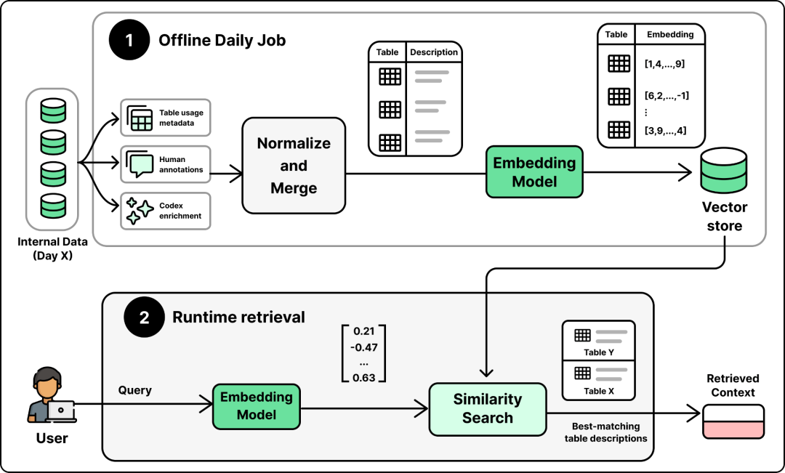

记忆层则在检索到的描述之上叠加修正，让代理从更准确的基线开始。

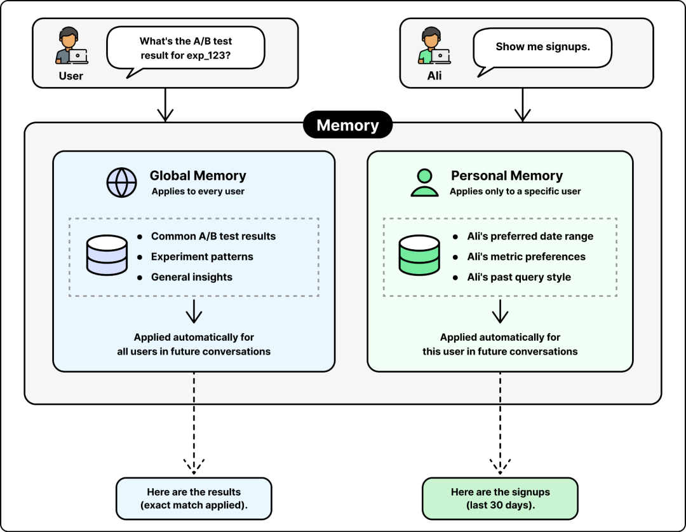

完整上下文组装的端到端流程：

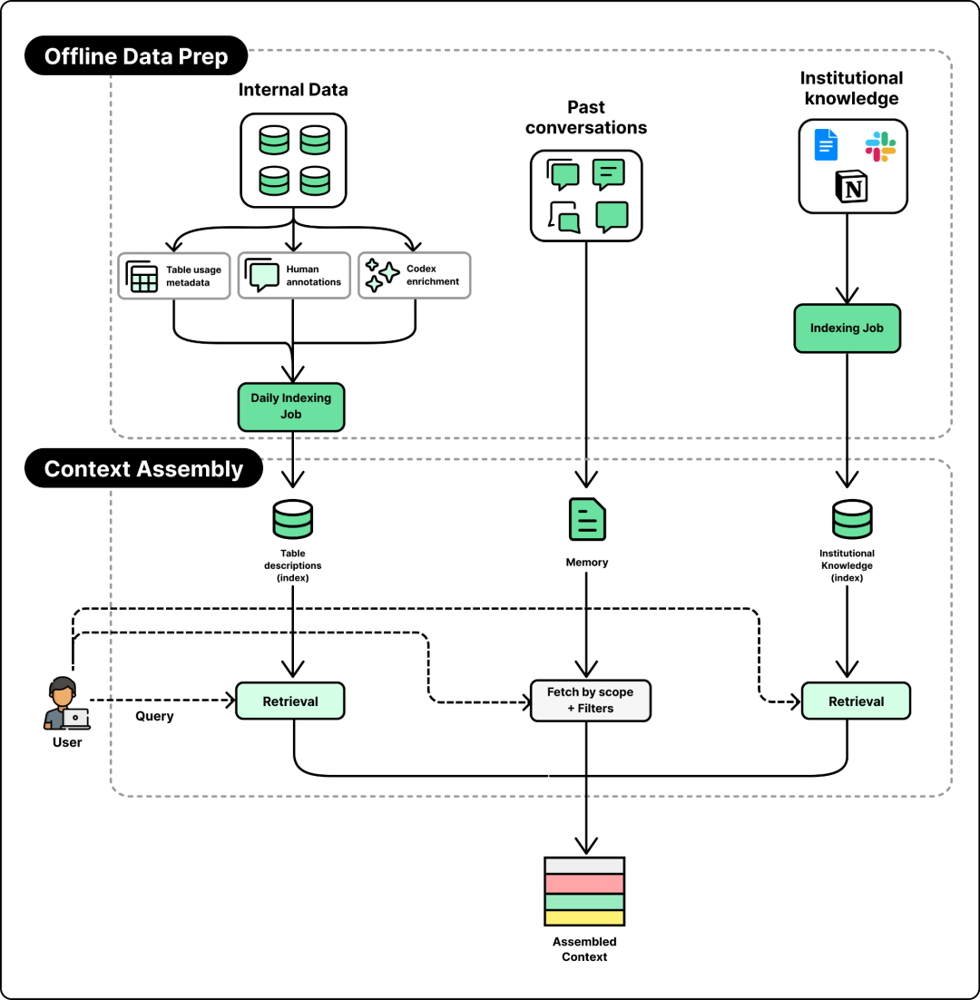

## 从问题到验证答案：三步走

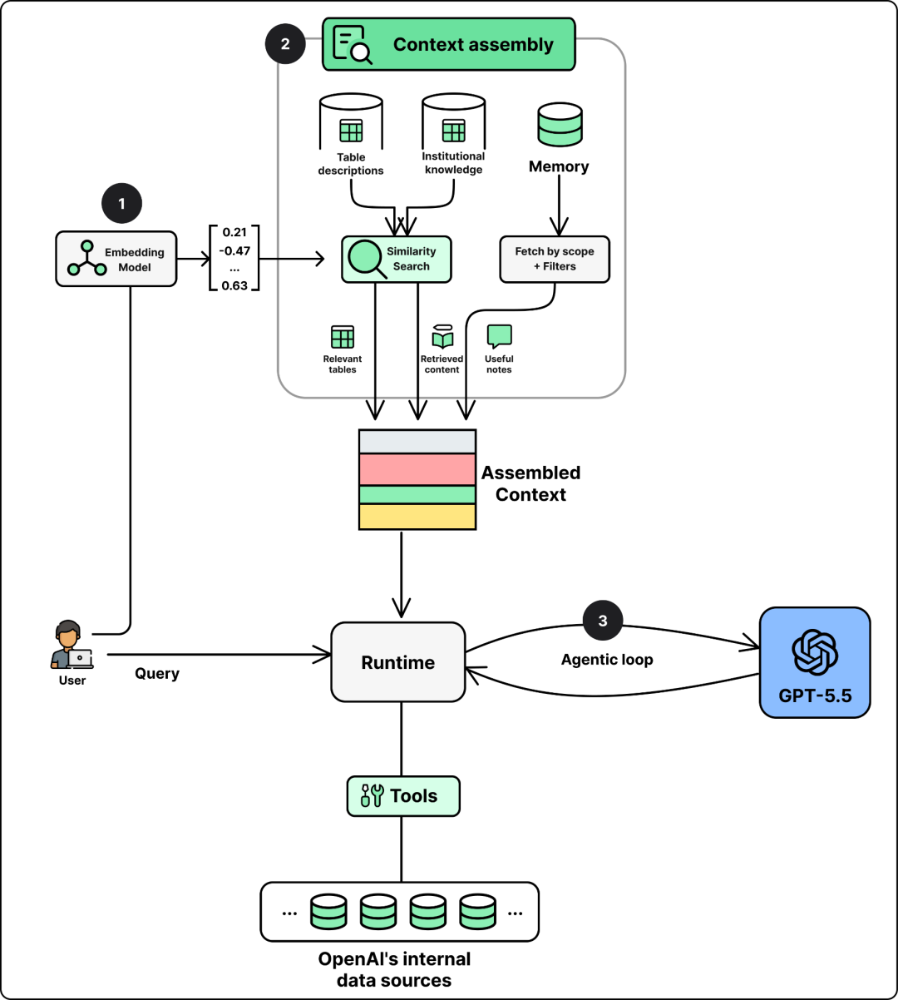

## 第 1 步：向量化问题

用户的问题被转换为向量，使用与离线时相同的嵌入模型。

## 第 2 步：组装上下文

上下文组装层在向量存储中搜索与问题最匹配的表描述，结合**语义搜索**与**精确文本匹配**。同时通过访问控制服务检索相关制度知识，并添加相关记忆。

## 第 3 步：启动代理循环

将组装好的上下文发送给 LLM，进入循环：写 SQL → 看返回结果 → 再试，直到答案正确。

这就是完整流程。**三步从问题到验证答案。** 可靠性来自于在问题被提出之前就已经准备好的六层数据基础设施。

## Codex 的三大实战案例

同样的 Codex 投资赋予了代理能力，也让 OpenAI 做到了其他公司认为不可能的事。

## 案例一：2 个月内完成跨云迁移

涉及 **10,000 个 DAG**、**90,000 张表**、**600 PB** 数据。

难点不在于搬数据，而在于**依赖图**。表构成 DAG——表 B 依赖表 A，表 C 依赖表 B。无法随意排序迁移。团队构建了一个跨云数据复制系统，由 Codex 生成数十万个 PR 来指向新云。

其他公司类似的跨云迁移运行了数年，OpenAI **大约 2 个月完成**。

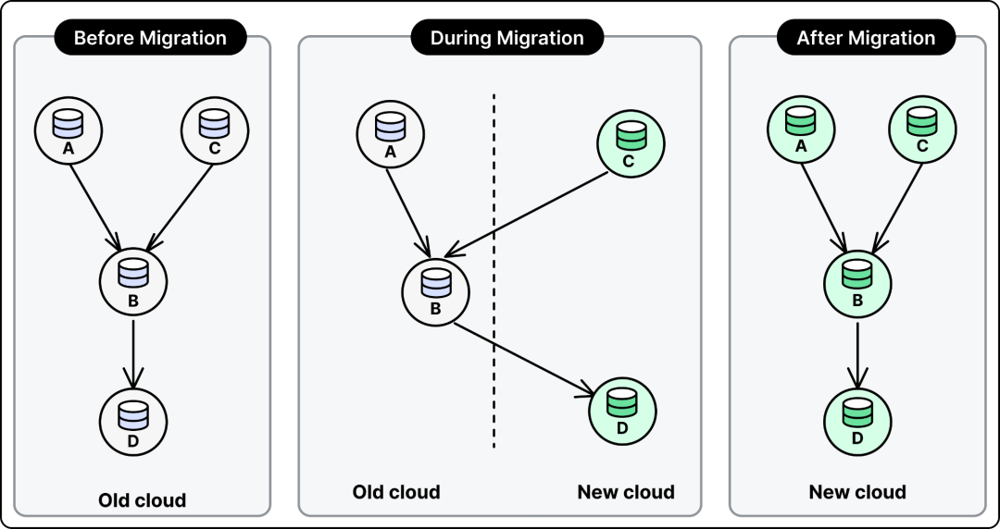

## 案例二：无人参与的开源补丁发布

OpenAI 的数据平台运行在十几个开源工具上（Spark、Kafka、Flink 等），每个都有内部定制补丁。

过去：工程师守护每个发布。  
现在：Codex 驱动的发布代理验证补丁 → 诊断失败 → 建议修复 → 发布到生产 → 告警团队。

**已经连续 3-4 个月无人工介入、零事故运行。**

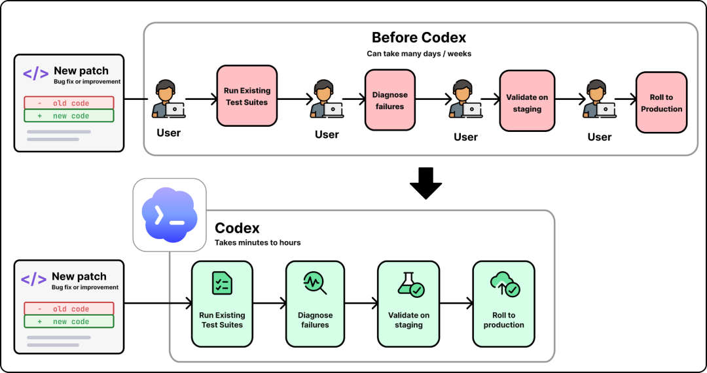

## 案例三：智能工单闭环

一个支持机器人处理常见问题，无法解决时工程师将问题交给 **Codex**。Codex 调查、找到修复、应用修复，工程师审查批准。

过去一个工单需要工程师几小时，现在**工程师每天可以处理约 100 个修复**。

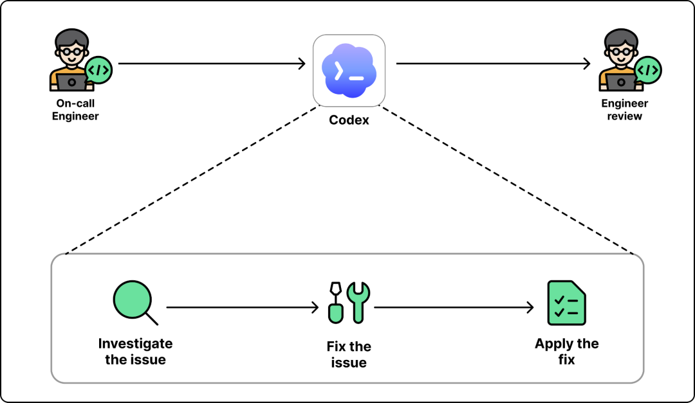

## 给其他团队的五条经验教训

## 1. 先打好数据地基

代码代理的真相只有一个：仓库。数据代理的真相是整个公司。如果数据分散或不一致，**先投资基础设施，而不是代理。**

## 2. 工具贵精不贵多

团队最初将 **40 个工具** 连接到代理——结果很差。模型选错工具，被做类似事情的工具的冲突答案搞混。**限制到 13 个工具，去掉重叠的工具**，问题解决了。

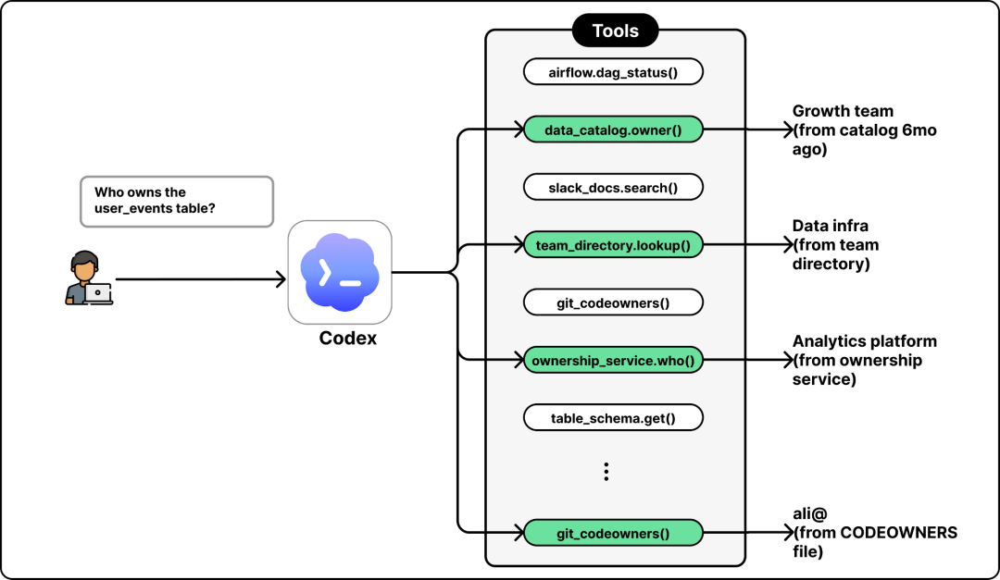

## 3. 不是所有查询都值得学习

将历史上所有的查询都嵌入上下文中没用。大多数查询是一次性的。**团队按可信度对查询排名**：高频仪表盘查询（通常由数据科学家编写）排名最高，一次性探索性查询排名最低。

## 4. 指令越少越好

详细的逐步指令反而损害结果。**高层指导效果更好**——告诉模型目标是什么，给它正确的上下文和工具，相信它的推理能力。

## 5. 重新定义时间线

如果项目听起来该花一年，正确的问题是：**有了 AI 代理，它能不能在一个季度内完成？** 坚持旧时间线的团队永远无法发现新工具的可能性。

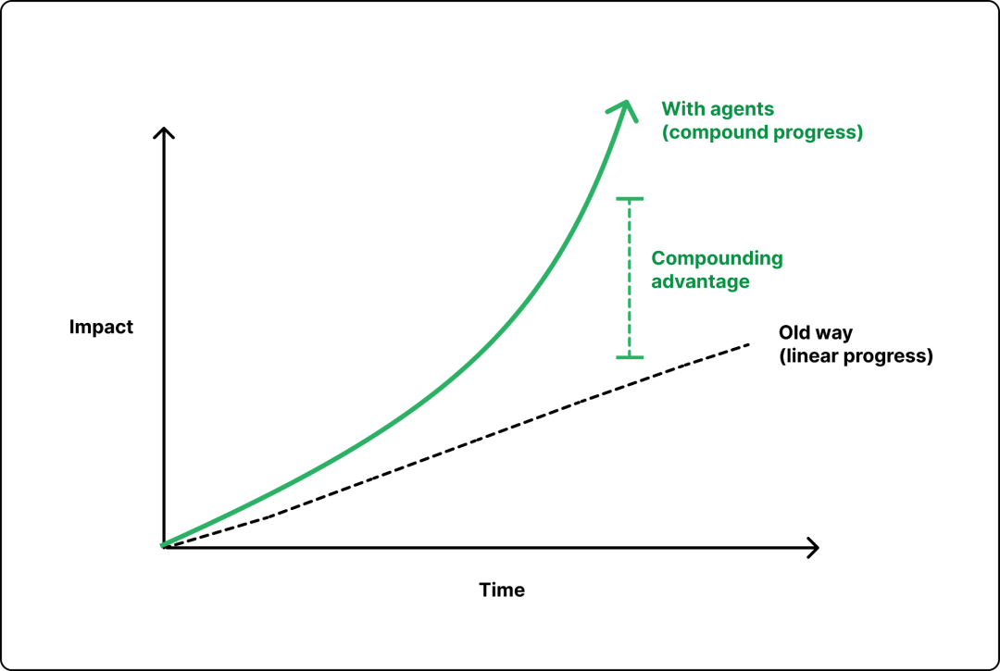

## 未来方向

## 按需生成应用

目前代理已经可以按需构建传统仪表盘。下一步是：**生成定制的 React 应用**，连接后端存储，适配用户的确切需求。每个应用只需数秒构建，运行在真实数据上。

一个想探索营销活动效果的营销人员只需描述需求，应用就会生成。

## 平台跟上用户的步伐

Codex 加速了每个团队。前端工程师一个上午就能新写出 UI。研究员按需启动定制管道。但让他们这样做的代码可能来自不完全理解底层机制的人。

如 Emma 所述：用户问"为什么 Flink 集群崩了？" —— "我不知道 Flink 怎么工作，这是 vibe-code 的，你能帮忙修一下吗？"

**下一个挑战：不是构建面向用户的代理，而是构建面向平台侧的代理**——用来分流进来的代码、在运行前验证它、吸收 AI 增强用户带来的洪流。

---

## 结语

OpenAI 的数据代理故事告诉我们：**数据基础设施的价值远大于代理本身。** GPT-5.5 在 API 上可用，Codex 是公开的，MCP 是开放协议。OpenAI 用的所有工具，任何认真的工程团队都能拿到。

区别在于：一个**统一、整洁、健壮的数据基础**，一个精心设计的上下文层，以及让代理本身保持简单的坚定意愿。

>
>
> "A coding agent has one source of truth: the repository.  
> A data agent's source of truth is the whole company."  
> — Emma Tang, Head of Data Platform Engineering at OpenAI
>
>

原文发表于 ByteByteGo Newsletter，2026 年 6 月 3 日

原文链接：<https://blog.bytebytego.com/p/how-openai-built-its-data-agent>
