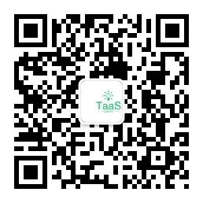
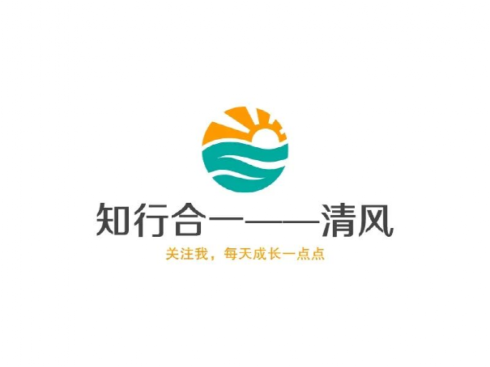

# 📰 未来十年数据工程师完整能力清单（2026-2036）

ETL 和 SQL 编写正交给 AI，数据工程师的核心竞争力从「数据搬运」迁移到「语义治理、AI 底座与数据产品运营」。

---

引子

过去十年，数据工程师的核心工作是写 ETL、搭管道、做调度、修脏数据。

### 但这一切正在被 AI 快速取代。

未来十年，ETL、管道开发、基础调度、普通脏数据排查将几乎全部交由 **Data‑Agent** 自治处理。人工编写同步脚本和清洗 SQL，将变成极其小众的工作。

数仓体系最耗人力的瓶颈，正在**逐层向上迁移**：

数据搬运 → 数据治理 → 业务语义 → AI 体系管控、数据产品运营

下面按**耗时权重从高到低**，完整拆解未来十年的能力图谱。

---

## 一、第一大耗时：业务语义与指标共识

### 永远无法被 AI 全自动替代。

当下口径冲突只是部门之间的事。十年后，AI 助手、业务 Agent、算法特征库、机器人流程——**全部在读取数仓指标**。

核心挑战：

• **同一业务名词，各方理解不同**——产品、财务、运营、风控、AI 智能体各有一套定义

• **业务迭代极快**——新模式、新活动随时上线，指标定义跟着变

• **AI 只能按人定口径生成 SQL**——它无法自主判断什么叫「有效付费用户」

未来，数据工程师**一半以上工时**将用于**语义层工程**：搭建企业术语库、指标中台、业务实体模型，供给所有 AI Agent 读取上下文。

---

## 二、第二大耗时：数据治理与合规风控

普通脏数据由 AI 自动修复；剩下的，**全是带有人为责任的高难度工作**。

• **多层级权限管控**——面向员工、AI、合作方设置细粒度的行级/列级脱敏

• **法律合规持续适配**——跨境数据、用户隐私、全链路审计

• **AI 新型风险**——大模型幻觉、Agent 错误逻辑、向量库隐私泄露

• **上游 Schema 频繁变动**——评估对下游几百个 Agent 的连锁影响

**基础质量交给 AI，风险和法律责任只能由人承担。**

---

## 三、第三大耗时：多架构适配与运维

十年后，数仓不再是 BI 报表的后端，而是**整个企业 AI 基础设施的底座**：

• 传统离线报表、OLAP 分析

• 毫秒级实时数据流

• 向量检索、RAG 知识库

• ML 训练数据集、在线特征仓库

• 反向推送给业务系统和 Agent

### 核心痛点：

• 批‑流‑向量‑特征多引擎间的**数据一致性最难处理**

• AI Agent 随时出现**失控查询**，打爆集群

• 需要人为做数据隔离、查询熔断、成本管控

---

## 四、第四大耗时：技术债务与架构迭代

未来 AI 能自动生成中间层宽表，但**AI 生成的表经常冗余、分层混乱、产生大量废弃资产**：

• 海量自动生成的宽表需要**人工梳理、合并、下线**

• AI 擅长短期生成，**不擅长长期架构规划**

• 历史数据迁移、存量脏数据、遗留数据债务

---

## 五、第五大耗时：数据产品运营

普通报表交给业务人员和 BI‑Agent 自助查询后，数据团队重心转为**打造可复用的数据产品**：用户标签、事件标准、供应链数据集、客户画像、AI 训练集。

**从「写 SQL 的开发者」变为「数据产品经理」。**

---

## 六、第六大耗时：跨组织数据协作

• 联邦计算、多方安全计算——不出库的数据共享

• 与外部伙伴统一业务术语、对齐指标口径

• 管控合作方 AI 调取数据的权限

---

三代瓶颈变迁

**2010 年前后**——手动 ETL、调度、硬件 → 瓶颈：数据能不能搬运入库

**当下 2026**——口径对齐、脏数据排查、模型维护 → 瓶颈：数据是否可信

**未来 2026‑2036**——语义统一、合规管控、多引擎协同 → 瓶颈：让所有 AI 正确理解、安全使用数据

---

本质趋势

**1. 人力瓶颈一路向上迁移**：物理搬运 → 清洗治理 → 业务语义 → AI 体系管控

**2. 确定性、重复性工作全部交给 AI**

**3. 之后所有耗人工的工作，都是 AI 无法接手的**：业务判断、利益权衡、法律风险、长期架构决策

**4. 岗位正在重塑**：传统 ETL 团队萎缩，人才转向语义工程师、AI‑Data 架构师、数据产品、数据合规专家

---

下面说说数据工程师未来 10 年的完整能力清单

## 一、底层基础工程（必备底座）

• **湖仓一体多模架构**——数据湖、数仓、向量库、图数据库混合；批‑流一体、冷热分层、查询熔断

• **实时数据流**——CDC 捕获、乱序处理、消息队列排查、Data‑Contract 管理

• **云原生运维**——K8s 部署、Agent 调度、全链路血缘、技术债务清理

• **基础编码**——Python、Go；审核 Agent 生成代码，处理复杂自定义逻辑

## 二、AI‑原生基建（最核心技能）

• **RAG 知识库工程**——文档切片、Embedding 策略、向量索引调优、抑制大模型幻觉

• **语义层工程**——术语词典、指标中台、Text‑to‑SQL 管控、口径仲裁

• **Agent 平台运维**——管控自助式数据智能体的查询开销、权限、审计

• **MLOps 与特征仓库**——特征管理、数据漂移检测、训练数据风险排查

## 三、治理与合规（AI 无法替代）

• 全链路元数据、血缘管理、冗余资产下线

• 细粒度权限：行级/列级脱敏、分级保密、多套权限体系

• 法律合规：数据留存、跨境管控、完整审计

• **AI 风险治理**——偏见排查、幻觉溯源、隐私泄露防控

• 多方安全计算、联邦协作

## 四、业务语义（拉开薪资差距的分水岭）

• **行业深度认知**——吃透业务链路、盈利模式、隐性规则

• **指标中台**——统一全公司、全部 AI 智能体的口径

• **需求翻译**——业务口语 → 标准化数据表、标签

• **变更管理**——评估指标改动对下游的连锁影响

## 五、数据产品思维

• 设计可复用资产：用户标签、事件标准、行业数据集

• 优化易用性、完善文档、收集反馈持续迭代

• 评估数据资产的业务收益与投入产出比

## 六、跨域协同

• **沟通**——跨部门对齐口径、化解诉求冲突

• **风险判断**——权衡便利性、安全、合规、成本

• **长期规划**——预判 3‑5 年业务迭代，搭建可演化模型

---

分级能力

**初级（0‑3 年）**：排查 Agent 管道故障、基础质量监控、维护特征库/向量库

**资深（3‑7 年）**：搭建语义层、多引擎运维、治理技术债务、RAG 知识库建设

**架构师（7‑10 年+）**：AI 原生顶层架构设计、全公司数据治理标准、跨企业协作统筹

---

将被 AI 替代的旧技能

• 手写大批量 ETL 脚本、常规清洗 SQL

• 重复性调度配置、基础 DAG 编写

• 简单数据质量检查、基础报表开发

• 常规分区、索引优化

---

三条主流职业路线

**1. AI‑Data 架构师**——主攻湖仓、向量库、Agent 底层基础设施

**2. 业务语义与数据专家**——深耕垂直行业、指标治理、数据产品

**3. 合规风险专家**——隐私计算、数据安全、AI 风险管控

---

未来十年，数据工程师不再是「写 SQL 的人」，而是**企业 AI 底座的架构师、业务语义的翻译官、数据资产的经营者**。

---

今天的分享就到这里，如果您觉得有用的话，记得关注哦，关注后才能第一时间看到清风君的每周分享。

关注“数字化与AI之知与行”

### \<===\> END \<===\>

