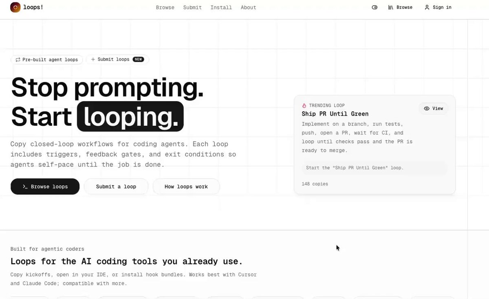

我推荐这个网址：
[loops.elorm.xyz](https://loops.elorm.xyz/)
收录了几十个大神的 
loop engineering的思路 

## 💬 Replies

### 1 @li9292 (李韭二) (Author)

*Fri Jun 19 16:10:32 +0000 2026*

别学了，直接拿去抄了用吧！

### 2 @li9292 (李韭二) (Author)

*Thu Jun 25 06:02:10 +0000 2026*

[x.com/li9292/status/…](https://x.com/li9292/status/2070024500700418254?s=46)

### 3 @wquguru (WquGuru)

*Sat Jun 20 13:19:43 +0000 2026*

@li9292 确实很不错，作者 @elorm\_elom 也在X上

### 4 @li9292 (李韭二) (Author)

*Sat Jun 20 13:24:07 +0000 2026*

@wquguru @elorm\_elom 笑死，YouTube university ，谢谢老师分享

### 5 @MinLiBuilds (实践哥 Li)

*Fri Jun 19 23:59:15 +0000 2026*

@li9292 牛 好好研究一下 你们 loop 派是对的

### 6 @li9292 (李韭二) (Author)

*Sat Jun 20 00:48:57 +0000 2026*

@MinLiBuilds 实践哥客气了，我也在学习中

### 7 @gerardsans (Gerard Sans | Axiom 🇬🇧)

*Sat Jun 20 18:32:15 +0000 2026*

@li9292 🕳️🐇

### 8 @li9292 (李韭二) (Author)

*Sun Jun 21 01:04:26 +0000 2026*

@gerardsans @grok 用Alice in the wonderland中的经典台词回复这个回复

### 9 @chekecen (Kesen Nil)

*Sat Jun 20 16:46:54 +0000 2026*

@li9292 [github.com/kelvinschen/ac…](https://github.com/kelvinschen/acpus)

除了思路以外，loop的harness也很重要，推荐一下我实现的dynamic workflow runner: acpus. 一个能让任意acp agent 能够执行loop的harness, 而不仅限于claude code。而且，我也有一些有意思的playbook，这里有可视化：[kelvinschen.github.io/acpus/workflow…](https://kelvinschen.github.io/acpus/workflows/)

### 10 @li9292 (李韭二) (Author)

*Sun Jun 21 01:04:53 +0000 2026*

@chekecen 谢谢您分享并开源

### 11 @PanXing0827 (王小丑)

*Sat Jun 20 07:48:52 +0000 2026*

@li9292 多谢韭二老师分享呀😃

### 12 @li9292 (李韭二) (Author)

*Sat Jun 20 13:31:54 +0000 2026*

@PanXing0827 谢谢老师评论

### 13 @kingbacktim999 (calary)

*Sat Jun 20 02:02:18 +0000 2026*

@li9292 真不错，嘎嘎牛逼的网站

### 14 @li9292 (李韭二) (Author)

*Sat Jun 20 07:38:53 +0000 2026*

@kingbacktim999 分享牛皮的网址哈哈，随便让自己更加牛皮

### 15 @AllOrdinalsX (AllOrdinals)

*Sun Jun 21 02:31:09 +0000 2026*

@li9292 @godsonde 哇，收录大神思路，这个链接得马克一下！

### 16 @li9292 (李韭二) (Author)

*Mon Jun 22 01:42:48 +0000 2026*

@AllOrdinalsX @godsonde 谢谢您的收藏

### 17 @ddny09 (Evan.Z)

*Sat Jun 20 12:41:19 +0000 2026*

@li9292 感谢分享！loop engineering这块一直想系统学学，这下有宝藏了～

### 18 @li9292 (李韭二) (Author)

*Sat Jun 20 13:40:48 +0000 2026*

@ddny09 我quoted的原帖里，烟花老师也分享了不少链接

### 19 @yichuanflow (益川 | Yichuan Flow)

*Sat Jun 20 05:20:22 +0000 2026*

@li9292 @PandaTalk8 先收藏一下，之前一直没整明白咋用。

### 20 @li9292 (李韭二) (Author)

*Sat Jun 20 06:29:39 +0000 2026*

@RichieY13785 @PandaTalk8 谢谢老师收藏

### 21 @sycbruce (AARON 阿龙🐉|前IT讲师的AI增长实验)

*Fri Jun 19 16:27:51 +0000 2026*

@li9292 神速啊 这

### 22 @li9292 (李韭二) (Author)

*Sat Jun 20 00:57:57 +0000 2026*

@sycbruce 都是学习的高手

### 23 @linjunwu6941 (朝林)

*Sat Jun 20 12:08:40 +0000 2026*

@li9292 @PandaTalk8 收藏了

### 24 @li9292 (李韭二) (Author)

*Sat Jun 20 13:32:04 +0000 2026*

@linjunwu6941 @PandaTalk8 谢谢老师的收藏

### 25 @WukongAt (Sun Wukong)

*Sat Jun 20 17:54:13 +0000 2026*

@li9292 谢谢分享 第一次看到这个概念

### 26 @li9292 (李韭二) (Author)

*Mon Jun 22 01:42:01 +0000 2026*

@WukongAt 谢谢您的喜欢，我quote的帖子里也有很多资源链接 可以参考

### 27 @slgxmf (Archer Sun)

*Sun Jun 21 02:08:42 +0000 2026*

@li9292 @wquguru loop

### 28 @LonglinX (龙鳞)

*Sun Jun 21 00:06:10 +0000 2026*

@li9292 mark

### 29 @erickhchow115 (ck)

*Sat Jun 20 00:22:11 +0000 2026*

@li9292 @grok please summarise and give 3 action plan

### 30 @php_martin (Martin)

*Sun Jun 21 12:29:27 +0000 2026*

@li9292 资源库解决的是“看哪些案例”，但落地时还要先判断任务是否值得循环：是否重复、是否有可验证终点、成本能否承受、工具是否齐全。这个四条件框架能把案例变成可执行方案：[x.com/php\_martin/sta…](https://x.com/php_martin/status/2068665524578660645)

### 31 @tttttttttmax (蜻蜓队长)

*Fri Jun 19 18:51:48 +0000 2026*

@li9292 如果我懒惰几天，loop engineering是不是也会过时。

