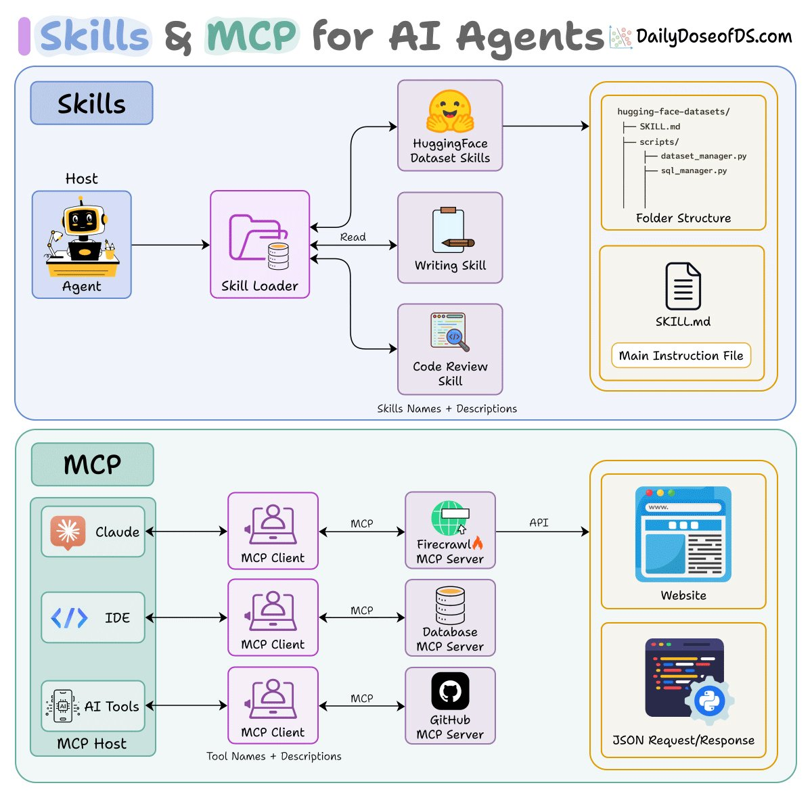

谁能想到MCP都已经凉了
当年（也就200天前）
mcp创业团队还好吗？🫠
R

## 💬 Replies

### 1 @li9292 (李韭二) (Author)

*Thu Apr 23 15:56:11 +0000 2026*

准备好好看下这个链接[x.com/claudedevs/sta…](https://x.com/claudedevs/status/2047086372666921217?s=46)

### 2 @qzhxjhj (Bruce Qin)

*Mon Apr 20 08:27:18 +0000 2026*

@li9292 没理解，能稍微解释一下吗

### 3 @li9292 (李韭二) (Author)

*Mon Apr 20 09:34:39 +0000 2026*

@qzhxjhj mcp链路太长，执行任务太重，大家都去卷skill.md了

### 4 @AstroHanRay (AstroHan)

*Mon Apr 20 11:14:44 +0000 2026*

@li9292 MCP 没凉，Claude 还很喜欢呢... Firecrawl，Computer Use，Claude Chrome 都走的 MCP。但确实太占用上下文了

### 5 @li9292 (李韭二) (Author)

*Mon Apr 20 11:19:39 +0000 2026*

@AstroHanRay 对，但我觉得computer use会取代mcp的生态位。今天用Claude mcp in chrome跑Claude design 在windows上没跑通，明天试试macOS上

### 6 @suenchunyu (Yaid)

*Tue Apr 21 03:26:41 +0000 2026*

@li9292 MCP凉在哪里？Skills + MCP 是很常见的实践，听风就是雨很好玩吗？

### 7 @li9292 (李韭二) (Author)

*Tue Apr 21 03:30:06 +0000 2026*

@suenchunyu 是是是你说的对，@grok 用《咬文嚼字》的编辑口语给这中文都不及格的人解释一下什么叫“听风就是雨”

### 8 @KevinShengHui (ShengHui Wang)

*Tue Apr 21 02:52:35 +0000 2026*

@li9292 没吧,只不过之前的什么工具,什么工具都接 mcp
现在很多转向 cli
但是一些 computer use 等等的不还需要 mcp
mcp 也可以渐进式披露呀.
不至于没了
官方还在一致向前探索呢
昨天还看到一个 mcp future 的好几个视频

### 9 @li9292 (李韭二) (Author)

*Tue Apr 21 03:13:34 +0000 2026*

@KevinShengHui 辛苦老师发下链接吗？感恩，学习一下

### 10 @hiheimu (赖叔 | LaiShu.ai)

*Mon Apr 20 09:59:00 +0000 2026*

@li9292 明年再回头看，会不会skills也凉了。。

### 11 @li9292 (李韭二) (Author)

*Mon Apr 20 10:03:02 +0000 2026*

@hiheimu who knows

### 12 @xxxjzuo (Jason Zuo)

*Mon Apr 20 18:58:22 +0000 2026*

@li9292 是不是所有因为当前模型能力或infra限制，所出现的的创业机会都会随着技术发展凉凉？最好的结果也就是被大厂收购😂

### 13 @li9292 (李韭二) (Author)

*Tue Apr 21 01:36:21 +0000 2026*

@xxxjzuo 被大厂收购已经是不错的结局了上岸了

### 14 @bainianAI (百年 AI×出海)

*Mon Apr 20 13:12:09 +0000 2026*

@li9292 AI 控制多浏览器 MCP 还是最好的选择

### 15 @li9292 (李韭二) (Author)

*Mon Apr 20 13:57:15 +0000 2026*

@yidabuilds 那你怎么看computer use

### 16 @ideaxiaoshi (idea小时)

*Tue Apr 21 01:28:01 +0000 2026*

@li9292 这两个就不是一个层面的东西，你在胡说八道什么，听风就是雨，流量真好用是吧。

### 17 @li9292 (李韭二) (Author)

*Tue Apr 21 03:12:44 +0000 2026*

@ideaxiaoshi 是是是你说的对吧

### 18 @agentbuff_dev (AgentBuff)

*Tue Apr 21 08:45:42 +0000 2026*

@li9292 也不算吧，现在很多skills里的内容是这么写的：通过xxx mcp调用xxx tool，在agent与第三方集成的技能里还有很多是这么玩的，虽然在cli化

### 19 @li9292 (李韭二) (Author)

*Tue Apr 21 09:30:43 +0000 2026*

@CoderBuf 嗯嗯感谢您的分享

### 20 @shirumesu (希露梅斯)

*Tue Apr 21 03:18:15 +0000 2026*

@li9292 一直都搞不懂mcp跟skill有什么区别（
除非是brave那种他本身有优质服务的才有用，剩下很多mcp给人的感觉就是他在其他环境帮你装好skill和tool，实际上你自己安装也行
现在有了cli，各家也开始适配agent访问，更加不需要mcp了

### 21 @li9292 (李韭二) (Author)

*Tue Apr 21 03:18:52 +0000 2026*

@shirumesu 握手🤝

### 22 @z7nnnnnnn (7nnnnnnn)

*Tue Apr 21 03:00:43 +0000 2026*

@li9292 mcp 还可以呀，一直在用

### 23 @li9292 (李韭二) (Author)

*Tue Apr 21 03:14:18 +0000 2026*

@z7nnnnnnn 一直是在什么场景呢？感恩，真心求教

