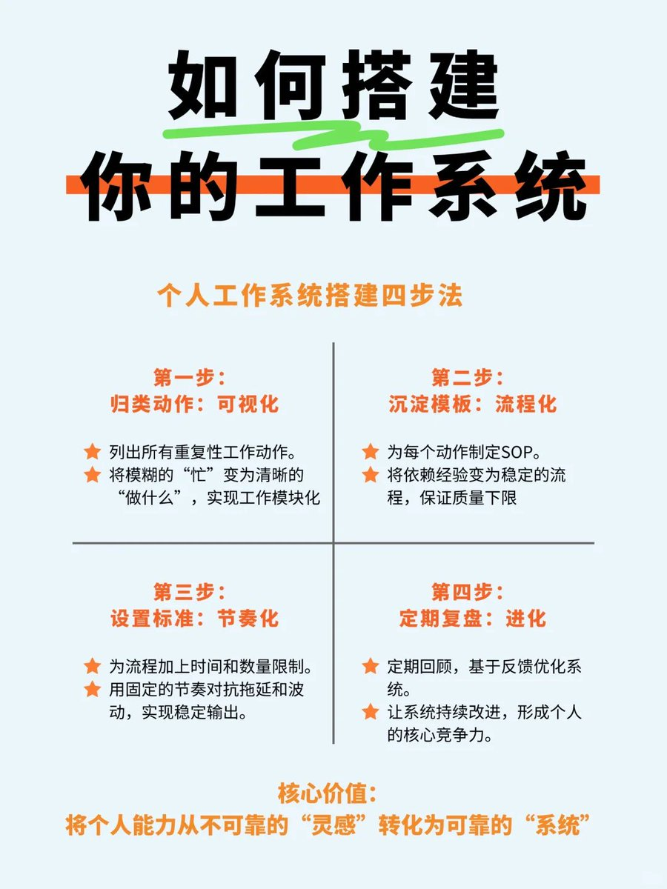
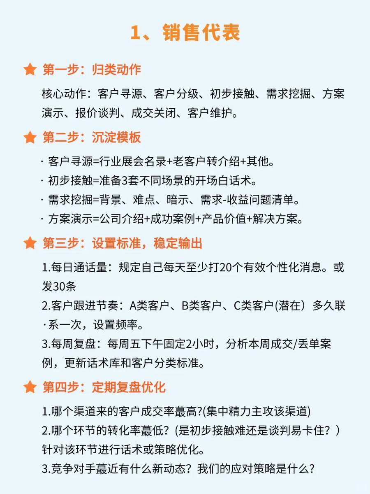
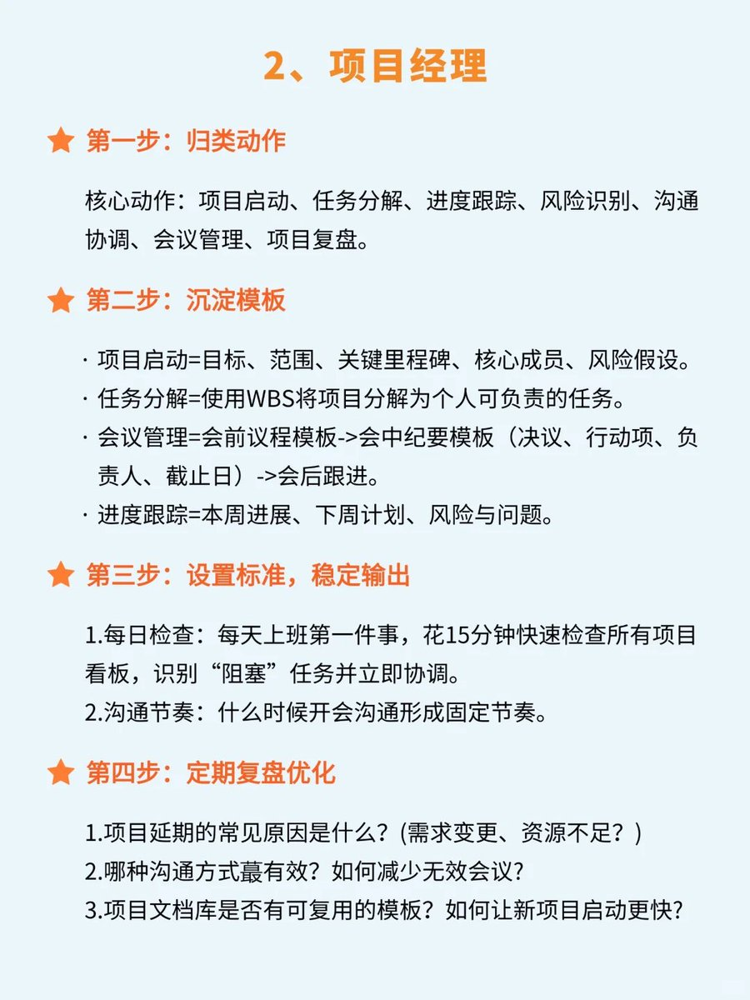
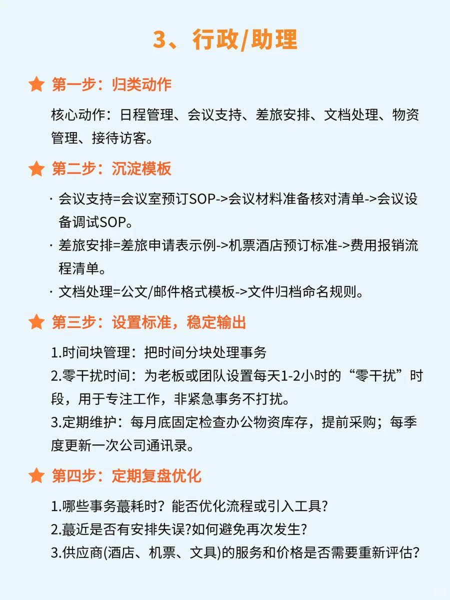
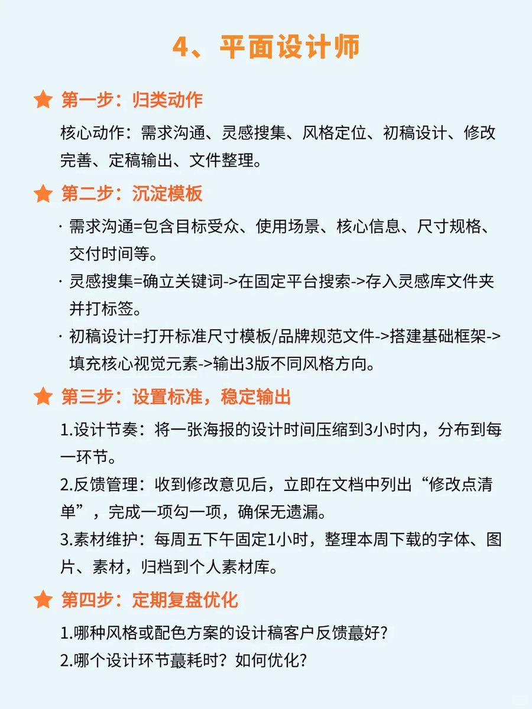
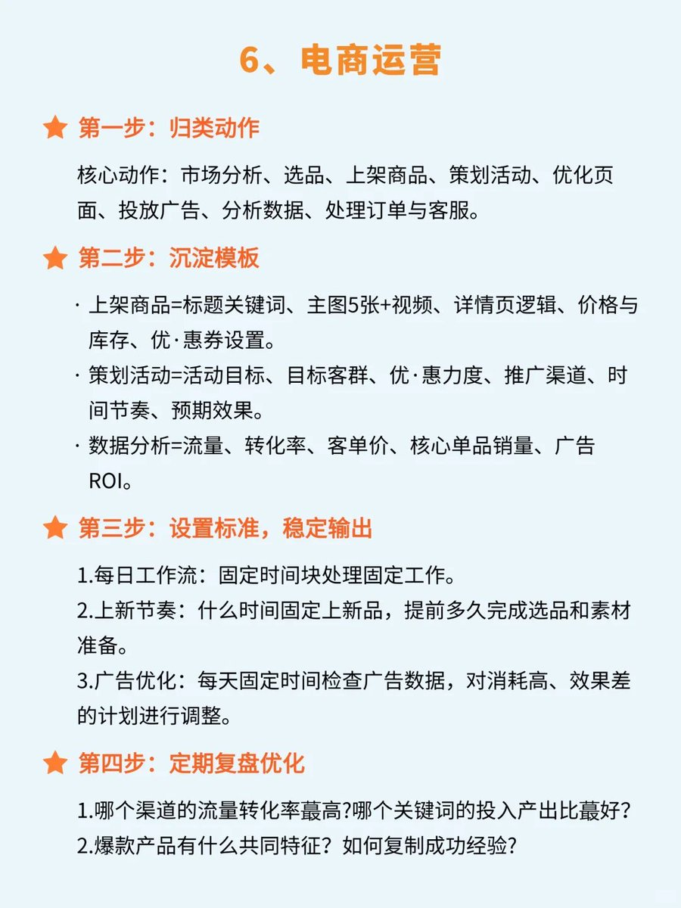

工作能力强的人，都会搭建工作系统❗❗

简单来说，工作系统就是为你量身定制一套稳定的工作流程和习惯哦😎。它能把那些重复、耗神的任务变得井井有条，让你从“被动救火”转向“主动管理”呢👏O3

## 💬 Replies

### 1 @TaoTaoOps (桃桃 AI 分享📓) (Author)

*Fri Oct 17 01:35:13 +0000 2025*

### 2 @TaoTaoOps (桃桃 AI 分享📓) (Author)

*Fri Oct 17 01:35:14 +0000 2025*

### 3 @TaoTaoOps (桃桃 AI 分享📓) (Author)

*Fri Oct 17 01:35:14 +0000 2025*

### 4 @TaoTaoOps (桃桃 AI 分享📓) (Author)

*Fri Oct 17 01:35:15 +0000 2025*

### 5 @TaoTaoOps (桃桃 AI 分享📓) (Author)

*Fri Oct 17 01:35:16 +0000 2025*

### 6 @TaoTaoOps (桃桃 AI 分享📓) (Author)

*Fri Oct 17 01:35:16 +0000 2025*

### 7 @AChoi96809 (Chesser)

*Sat Oct 18 08:14:55 +0000 2025*

@TaoTaoOps 謝謝， 好提議！

### 8 @AlexLiangHaibin (Alex Liang)

*Fri Oct 17 03:50:46 +0000 2025*

@TaoTaoOps 请问这种知识卡片是用什么生成的

