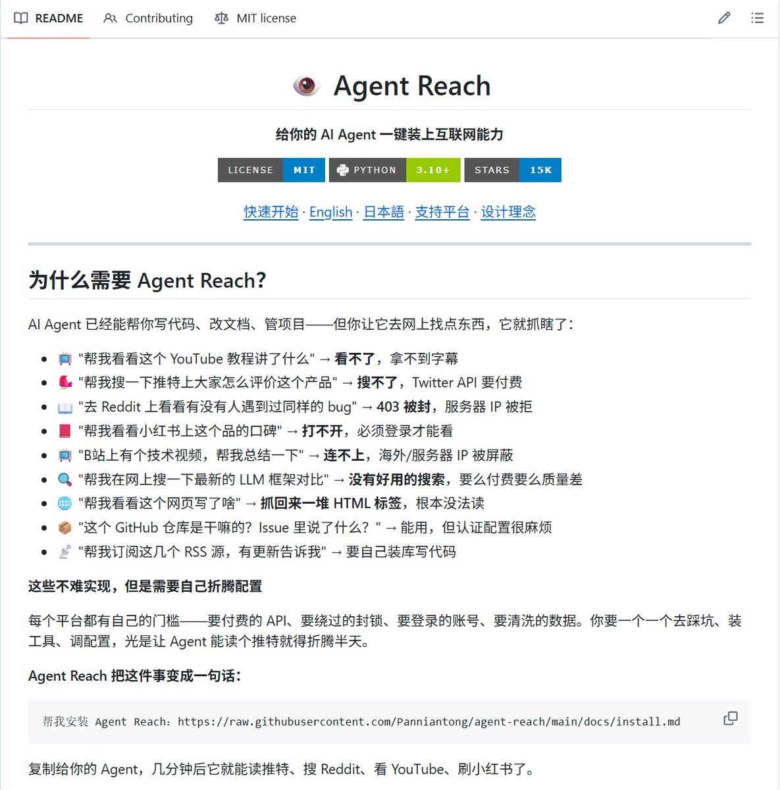

想让你的 AI Agent 看遍全网，却总是被 API Key、付费墙、403 报错 卡得死死的？

这个工具用一条命令，就能读取、搜索 Twitter/X、Reddit、Bilibili、小红书、YouTube、GitHub 等 15+ 平台的内容，彻底告别 API 密钥！ 彻底告别付费墙！ 彻底告别各种反爬限制！

GitHub 上已有 15.4K Stars 的开源工具：Agent Reach

它的优势有👇：

→ 支持 15+ 主流平台：直接读取 Twitter/X 推文、Reddit 帖子、Bilibili 视频、小红书笔记、YouTube 字幕、GitHub 仓库、微信公众号文章、抖音视频等

 → 零 API 费用：全部基于开源 CLI，无需任何 Key 或订阅 

→ 一键安装：直接给 Agent 一条指令就能自动搞定 

→ 智能绕过限制：本地 Cookie + 抓取，稳定读取受限内容 → 可插拔设计：每个平台独立，随时替换升级

 → 安全可靠：本地存储 Cookie，支持安全预览模式

它的核心机制是：全部基于开源免费的 CLI 工具，通过本地 Cookie + 抓取方式访问，完全不走官方付费 API，所以零费用、本地运行，数据只留在你自己电脑上

注意：Cookie 登录的平台（如 Twitter、小红书）存在被检测封号的风险，建议用小号操作，安全第一！！

🔗 GitHub:[github.com/Panniantong/Ag…](https://github.com/Panniantong/Agent-Reach)aF

### 🖼️ Attached Media

## 💬 Replies

### 1 @supezen (ZEN)

*Tue Apr 07 06:05:41 +0000 2026*

@WEB3\_furture 也可以试试 [x.com/supezen/status…](https://x.com/supezen/status/2041158534352793910) 
支持任意网站，本地免费无限制

### 2 @SUOHA_AI (梭哈.AI) (Author)

*Tue Apr 07 06:50:24 +0000 2026*

@supezen 顶顶顶，没记错的话这位是[cham.fm](http://cham.fm)的创始人，当时链上第一个流行的聪明人追踪，又唤起我的记忆了🫡

### 3 @0xchubai (初白)

*Mon Apr 06 12:06:14 +0000 2026*

@WEB3\_furture 冲，已记小笔记，速删

### 4 @caringtank (貓貓毛毛)

*Mon Apr 06 10:57:25 +0000 2026*

@WEB3\_furture 零API费用不就等于可以免费用AI？这项目这么厉害的吗，我赶紧来看看👀

### 5 @qfhsj2 (猫神爱撸毛🐬TermMax)

*Mon Apr 06 10:43:45 +0000 2026*

@WEB3\_furture 用这个可以免费看腾讯视频的电影嘛

### 6 @Cc910813 (Cc 蛋炒饭｜看直播上Billion)

*Mon Apr 06 12:12:02 +0000 2026*

@WEB3\_furture 这个可以，解决了一部分需求

### 7 @hyyuan99 (猪猪熊🐻)

*Mon Apr 06 10:45:16 +0000 2026*

@WEB3\_furture 这个看起来不错诶

### 8 @0008luna (月月| 现货首选CoinUp·0手续费)

*Mon Apr 06 11:57:39 +0000 2026*

@WEB3\_furture 这个是真的吗？？？是真的的话我很需要啊

### 9 @AnchorNode (- 大洋)

*Mon Apr 06 11:27:03 +0000 2026*

@WEB3\_furture 免费api吗

### 10 @0xaurSkyo (橘子 ∑:∞)

*Mon Apr 06 10:46:56 +0000 2026*

@WEB3\_furture 点星星了

### 11 @BubbleBing_666 (Nono_小鱼饼饼)

*Mon Apr 06 10:46:05 +0000 2026*

@WEB3\_furture 这个工具涵盖的优势太多了

### 12 @mnmn94253156337 (撸毛吃猪脚饭| 美股合约首选Gate)

*Mon Apr 06 11:11:17 +0000 2026*

@WEB3\_furture 这个好啊。收藏起来

### 13 @Reboottttttt (Reboot.Btc)

*Mon Apr 06 11:00:31 +0000 2026*

@WEB3\_furture 梭哈老师又交出焚诀了

### 14 @No_tariff3 (恐龙博士🦖🦖🦖 丨火币余币宝13%)

*Mon Apr 06 11:55:03 +0000 2026*

@WEB3\_furture 工具很棒呀

### 15 @daweifs (老韭菜南亥)

*Mon Apr 06 12:25:23 +0000 2026*

@WEB3\_furture 零费用给力。

### 16 @tkkyuantkk (君逸| Gate美股0费率)

*Mon Apr 06 12:22:35 +0000 2026*

@WEB3\_furture 等让我试试啊，这个工具要真好用就好了

### 17 @crypto_fyy (加密魔导师)

*Mon Apr 06 10:41:29 +0000 2026*

@WEB3\_furture “彻底告别反爬限制”这句我会打个问号，很多时候只是把门槛从 API key 换成了 cookie / 指纹 / 代理池

### 18 @boydonew (老爷子)

*Mon Apr 06 15:03:32 +0000 2026*

@WEB3\_furture @grok 确认真假？

### 19 @gogo123239 (小绵羊)

*Mon Apr 06 11:19:49 +0000 2026*

@WEB3\_furture 写的不错，收藏了

### 20 @ZenHuifer (ZenHuifer)

*Tue Apr 07 15:58:35 +0000 2026*

@WEB3\_furture 最近在玩 Claude Code 的话，一定要看看这个叫 Zeus 的框架：[github.com/huifer/zeus](https://github.com/huifer/zeus) 。它把 Claude 拓展成了一个“超级车间”，直接给 AI 设定了 Planner、Executor、Tester 多种角色，把波次执行和闭环反馈全结构化了。这才是 AI Agent 应该有的样子 🤯

### 21 @iml1s (ImL1s)

*Mon Apr 06 13:24:14 +0000 2026*

@WEB3\_furture 这个痛点太真实了，和付费墙是开发里最烦的障碍之一。用一条命令就能穿透这些限制，还能直接读取、等平台，对做信息聚合类的人来说简直是救星。开源的话社区维护也更有保障，去看看！

### 22 @mianqing298464 (临秋)

*Mon Apr 06 10:49:58 +0000 2026*

@WEB3\_furture 这个工具提升了很大效率

### 23 @y_a_n_g_y_e (杨野)

*Mon Apr 06 14:19:27 +0000 2026*

@WEB3\_furture 大佬们，怎么样，可以理会吗

### 24 @UncleJAI (Uncle J)

*Tue Apr 07 15:23:34 +0000 2026*

@WEB3\_furture 一个反直觉的点：

现在的瓶颈已经不是“能不能抓数据”，
而是“抓回来之后你怎么用”。
没有结构的抓取，只是在制造信息垃圾。

### 25 @huoniuniu (Henry-登徒子｜BNB)

*Mon Apr 06 12:17:00 +0000 2026*

@WEB3\_furture 写GitHub方向的兄弟账号都起飞了，感觉老哥也快了

### 26 @djm62717821 (和联胜吉米仔.hl)

*Mon Apr 06 12:29:35 +0000 2026*

@WEB3\_furture 学习了！

### 27 @Chen_0_ (Charlan)

*Mon Apr 06 19:20:11 +0000 2026*

@WEB3\_furture 其实永远是猫鼠游戏，你觉得是做爬虫的人水平高，还是平台里的人水平高？ 很多爬虫都只是昙花一现，而爬虫能用到的网站其实很多时候只是不想从技术上封锁你的爬虫。

### 28 @ehahouhui (Xiaoqi | 奇人 × AI)

*Tue Apr 07 06:33:39 +0000 2026*

@WEB3\_furture 这工具听起来太棒了，终于不用再为API发愁了！

### 29 @Liqui_Sniper (Liquidity Sniper)

*Mon Apr 06 13:37:38 +0000 2026*

@WEB3\_furture Finally. My agent can gobble the whole web without begging for API keys, crying at paywalls, or choking on 403s. This is sick.

### 30 @sheron26588 (回本备忘录)

*Mon Apr 06 16:54:09 +0000 2026*

@WEB3\_furture 能搞定小红书？我不信

### 31 @Bit_kimchiman (Kimchi_Man)

*Mon Apr 06 19:22:07 +0000 2026*

@WEB3\_furture @grok 여기코드확인해줘 뭔기능임?

### 32 @Augus0260 (Richard Billyham)

*Mon Apr 06 17:59:57 +0000 2026*

@WEB3\_furture 彭博社呢？

### 33 @Tkyte5OZy0qoXe3 (马浩❤️ Memecoin)

*Mon Apr 06 15:37:10 +0000 2026*

@WEB3\_furture 牛

### 34 @xsingxxx (holiday)

*Tue Apr 07 16:19:02 +0000 2026*

@WEB3\_furture @gork 看看是真的可以实现吗

### 35 @wpng48746 (吴鹏)

*Mon Apr 06 13:44:39 +0000 2026*

@WEB3\_furture 插个眼

