妈的，终于把 Chrome 上的 Gemini 开了

录个视频教大家怎么开启

如果你也跟我一样，所有的方法都用了，还是不行，而且你是 macOS 系统的话。

你直接把系统语言改成英文，它重启后就出来了。

首先就是 Chrome 的设置：
1\. 把 Gemini 相关的所有开关都打开
2\. 然后再把所有的 Chrome 浏览器地区设置成美国

这个流程可以用命令行去完成，也可以用现成的项目（如下面所发）去完成

然后关于谷歌账号和系统的设置：
1\. 把你的 Google 账号地区改成美国
2\. 把 Google 账号语言设置成英文
3\. 刚才我提到的 Google 浏览器也需要改成英文

在 macOS 上，如果想把 Google 浏览器改成英文界面，需要把你整个系统语言都设置成英文

### 🖼️ Attached Media

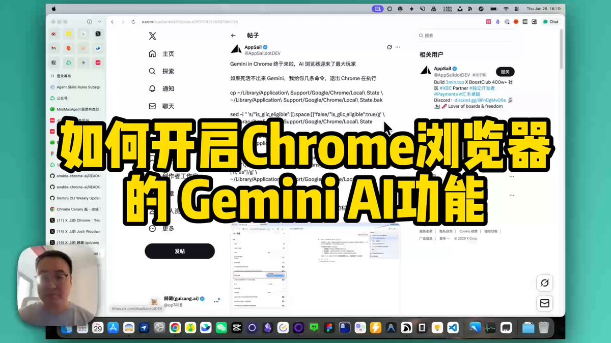

## 💬 Replies

### 1 @op7418 (歸藏(guizang.ai)) (Author)

*Thu Jan 29 08:35:44 +0000 2026*

两个二选一

相关项目：[github.com/lcandy2/enable…](https://github.com/lcandy2/enable-chrome-ai)

命令：[x.com/AppSaildotDEV/…](https://x.com/AppSaildotDEV/status/2016743176497991798)

### 2 @op7418 (歸藏(guizang.ai)) (Author)

*Thu Jan 29 08:48:38 +0000 2026*

Mac OS 可以用这个命令改浏览器语言，这样就不用改系统语言了

defaults write [com.google.Chrome](http://com.google.Chrome) AppleLanguages '("en-US")'

### 3 @op7418 (歸藏(guizang.ai)) (Author)

*Thu Jan 29 09:06:54 +0000 2026*

老了，原来 macOS 可以单独给应用设置语言。

在“语言与地区”拉到下面，找到“应用程序”点击加号就行。 

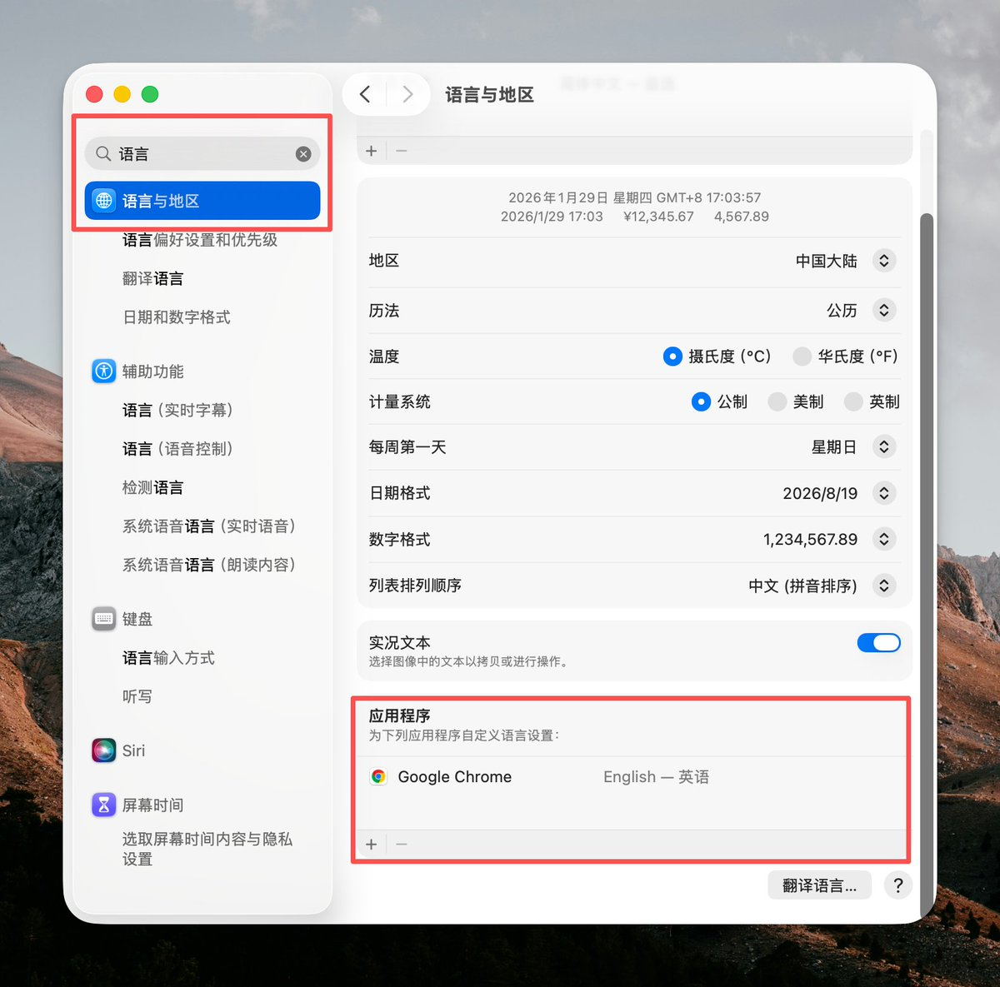

### 4 @yangyi (Yangyi)

*Thu Jan 29 12:03:54 +0000 2026*

@op7418 太难了 全干了一遍 还是没开启
我这chrome被诅咒了 

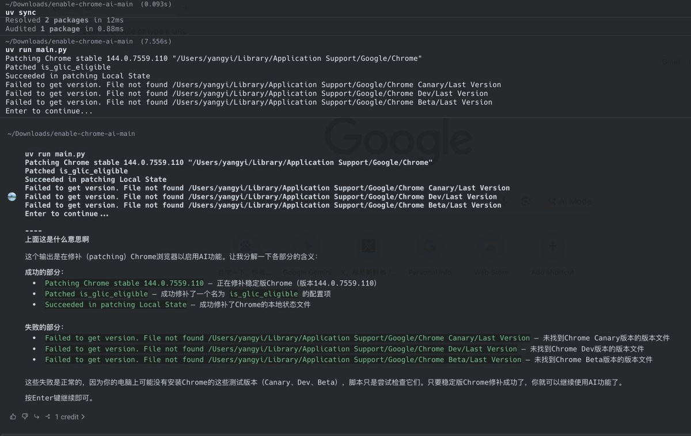

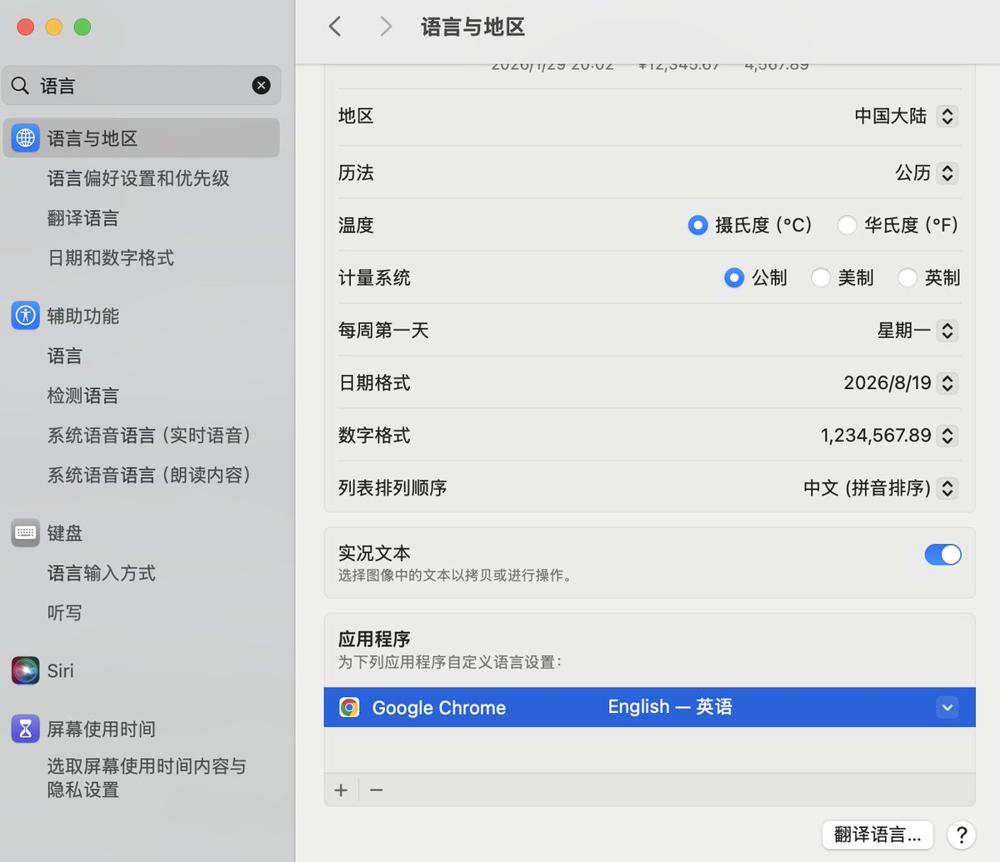

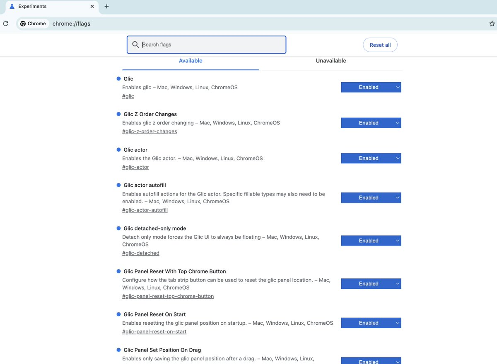

### 5 @op7418 (歸藏(guizang.ai)) (Author)

*Thu Jan 29 16:04:46 +0000 2026*

@yangyi 啊？难道是账号问题

### 6 @bigerchicken (比哥鸡排)

*Thu Jan 29 08:43:03 +0000 2026*

@op7418 不用换语言能开 

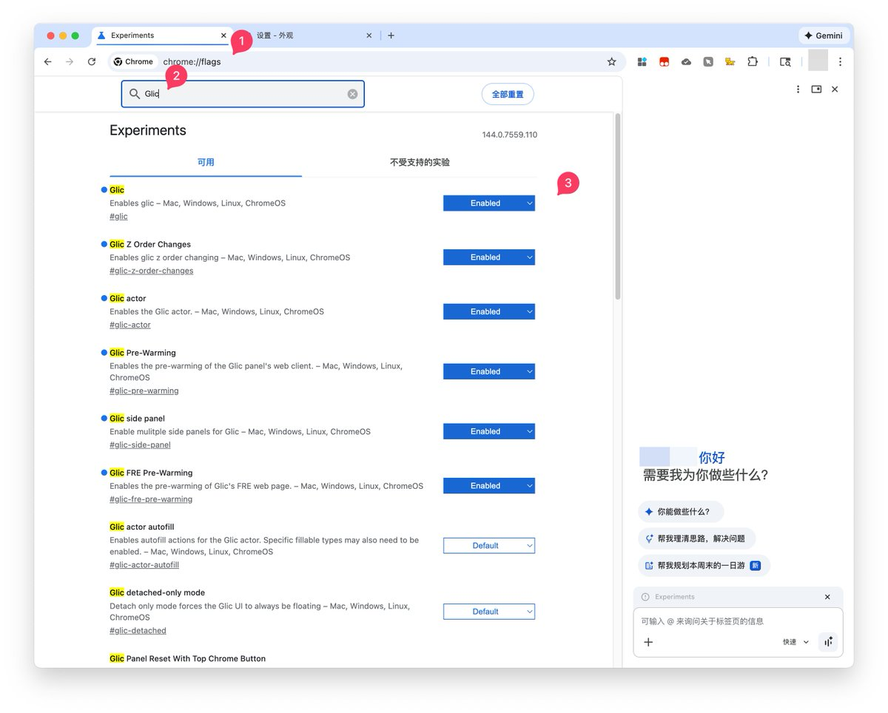

### 7 @op7418 (歸藏(guizang.ai)) (Author)

*Thu Jan 29 08:48:08 +0000 2026*

@bigerchicken 哎，哥怎么听不明白呢？有的人行，有的人不行。

### 8 @raymzhu (Raymond Zhu)

*Thu Jan 29 09:04:09 +0000 2026*

@op7418 补充一下，Macos可以针对具体应用设置语言，包括Chrome设置为英语 

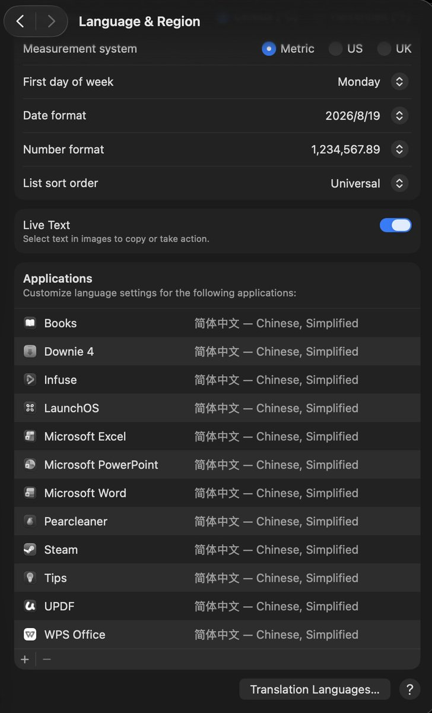

### 9 @op7418 (歸藏(guizang.ai)) (Author)

*Thu Jan 29 09:05:52 +0000 2026*

@raymzhu 可以可以，刚才群里有朋友说，我也才刚知道

### 10 @SeeWhatse_e (不晚)

*Thu Jan 29 08:37:23 +0000 2026*

@op7418 语言倒也不用设置成英文的也可以。 

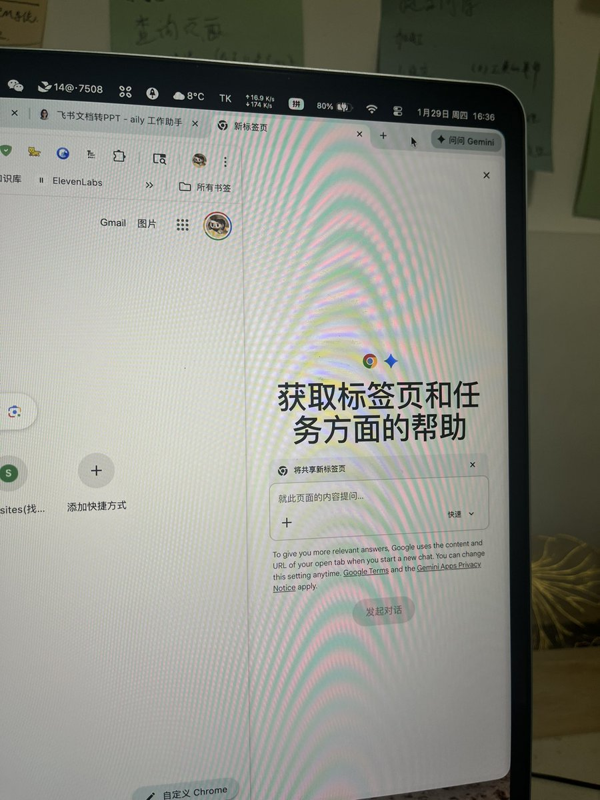

### 11 @op7418 (歸藏(guizang.ai)) (Author)

*Thu Jan 29 08:40:14 +0000 2026*

@SeeWhatse\_e 有的人可以不设置，有的人不行。

我就不行，我所有的操作都做了，但就是不显示，最后设置成英文以后才出来。

### 12 @Jarvis2hang (Jarvis贾维斯)

*Thu Jan 29 13:17:14 +0000 2026*

@op7418 真的就是这个，操作系统的地区设置，MacOS一直用的就是英语，只是地区设置的不是美国，都不行。调整地区后就出来了。 

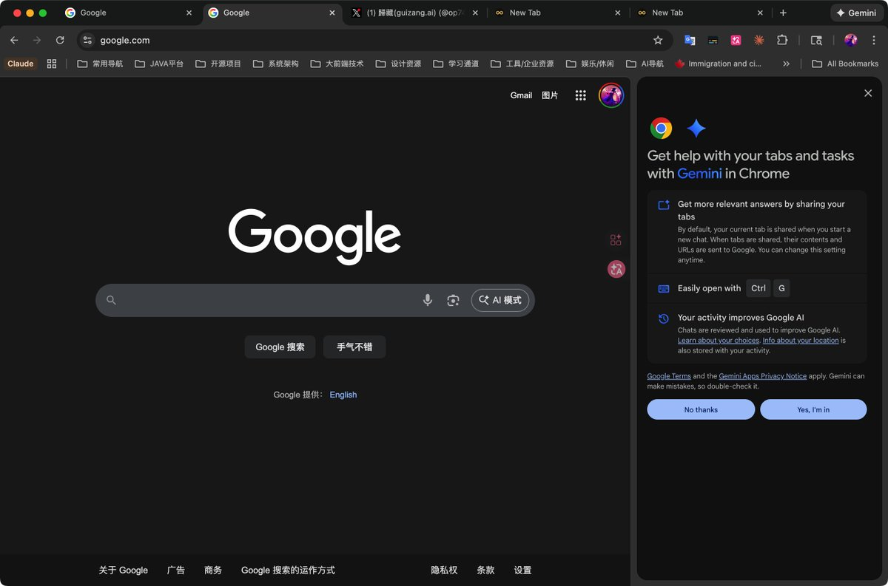

### 13 @op7418 (歸藏(guizang.ai)) (Author)

*Thu Jan 29 13:38:00 +0000 2026*

@Jarvis2hang 哈哈

### 14 @huzhouagi (胡诌AGI)

*Thu Jan 29 09:26:33 +0000 2026*

@op7418 以后歸藏大大都要养成习惯说“妈的”了

### 15 @op7418 (歸藏(guizang.ai)) (Author)

*Thu Jan 29 09:48:52 +0000 2026*

@HuZhou\_Mr 我尽量改改

### 16 @zjp1997720 (智见AI-大鹏)

*Thu Jan 29 12:51:09 +0000 2026*

@op7418 藏师傅的 Agent 功能打开了吗

### 17 @op7418 (歸藏(guizang.ai)) (Author)

*Thu Jan 29 16:04:55 +0000 2026*

@zjp1997720 不能

### 18 @pxNl8MfkN338618 (不知)

*Fri Jan 30 10:53:50 +0000 2026*

@op7418 藏师傅，你的 chrome 自动控制能用么。我这显示就是受组织控制，打不开 

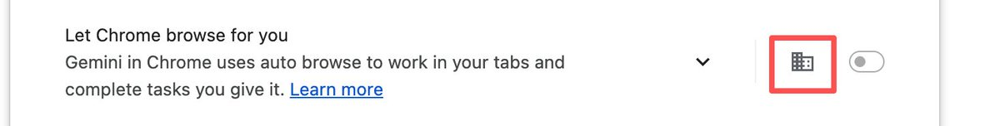

### 19 @op7418 (歸藏(guizang.ai)) (Author)

*Fri Jan 30 10:54:18 +0000 2026*

@pxNl8MfkN338618 不行

### 20 @shajiabiji (Sha Jia （AndroidMan）)

*Thu Jan 29 10:41:57 +0000 2026*

@op7418 艹，这也太麻烦了，不用了

### 21 @op7418 (歸藏(guizang.ai)) (Author)

*Thu Jan 29 10:48:06 +0000 2026*

@shajiabiji 嗯嗯 没啥用

### 22 @QikunXie (Nickel-3（学习版）)

*Thu Jan 29 14:04:32 +0000 2026*

@op7418 Windows是不是不可以？（新手发问）

### 23 @op7418 (歸藏(guizang.ai)) (Author)

*Thu Jan 29 16:05:02 +0000 2026*

@QikunXie 可以的

### 24 @waterlemongg (duaduadua)

*Thu Jan 29 09:18:29 +0000 2026*

@op7418 你的浏览器控制功能能打开嘛

### 25 @op7418 (歸藏(guizang.ai)) (Author)

*Thu Jan 29 09:54:52 +0000 2026*

@waterlemongg 不能那个是预览版估计都打不开

### 26 @hejun9527 (good nice)

*Thu Jan 29 12:52:27 +0000 2026*

@op7418 我美版的苹果就可以用啊，哪有那么麻烦

### 27 @op7418 (歸藏(guizang.ai)) (Author)

*Thu Jan 29 13:39:34 +0000 2026*

@hejun9527 你的可以不是其他人都可以，很多人不理解这个，总觉得大家环境都一样

### 28 @Lee931018 (Lee🫧)

*Thu Jan 29 11:54:18 +0000 2026*

@op7418 有点怪 有图标 但是显示Gemini in Chrome isn't available in your location This feature isn't available in your location yet. 

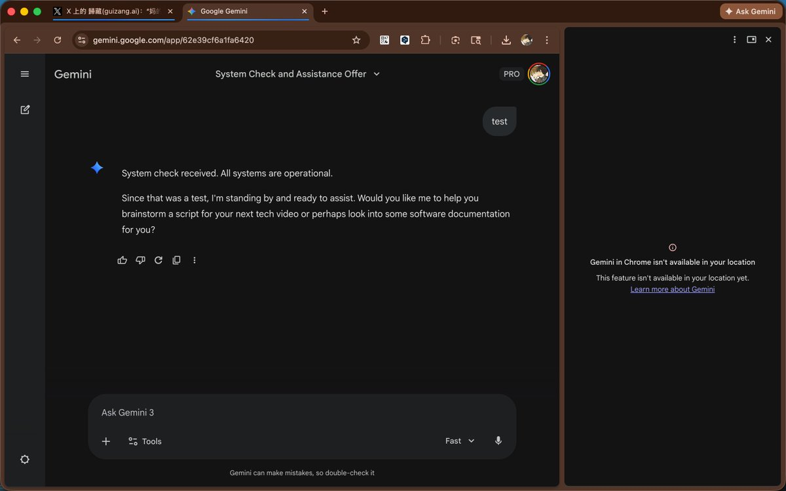

