# 📰 开源个 Skill｜彻底解决小红、小绿书配图难题

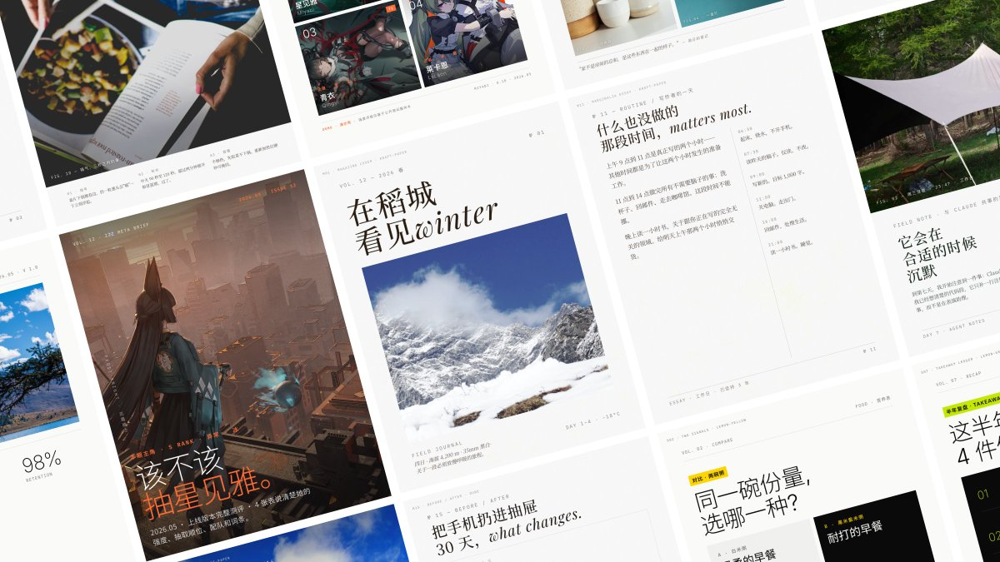

前段时间开源了 [guizang-ppt-skill](https://mp.weixin.qq.com/s/MVXHToWtNVT_b68zxr7fSA)，之后我自己用它做内容的时候发现一件事。

用它出的网页，单张截下来发到图文平台，反响和数据比我手工排版还很多。

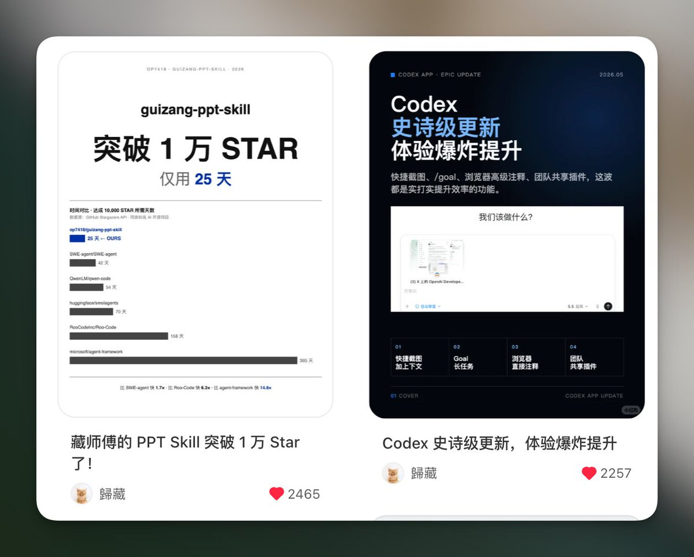

我相信你之前也找到过一些这种生成3：4 卡片图的提示词或者 Skill。

他们几乎都是一个味道：Tailwind + 大色块 + emoji 堆砌 + 中规中矩的字号层级。

看完之后，我大致能理解为什么 AI 出的图文卡片那么容易被一眼识破，它们做的是网页，不是杂志。

图文卡片对比 PPT 完全是另一种生物：竖屏、信息流里 1 秒钟决定停不停下、靠图说话而不是靠字。

版式不同、节奏不同、读者不同。

于是我把它从 PPT Skill 里拆了出来，单独做成了 guizang-social-card-skill （https://github.com/op7418/guizang-social-card-skill）。

下面讲讲它好在哪、我为什么愿意在它身上花这么多时间。

## 二、到底好在哪里

3:4 竖图是图文卡片的主战场。这个 Skill 的绝大部分设计精力都在 3:4 上，字号层级、版式比例、断行规则。

全部按 3:4 在手机信息流里被滑过的真实场景校准过。21:9 和  1:1 公众号头图也都支持。

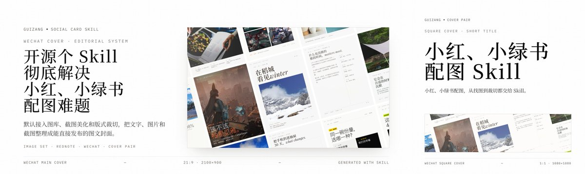

下面从图文创作者最关心的事开始讲。

2.1 它分得清你在写什么，然后用对的方式去配

图文平台上的内容是分门类的。一篇影评和一篇产品测评，需要的视觉语言完全不一样；

一篇旅行散记和一篇职场干货，该用的版式也不是同一回事。

但绝大多数 AI 工具不管这件事，你写什么内容它都用同一套模板套出来。

结果就是所有人发的卡片都长得像一个公众号的封面流水线。

这个 Skill 内置了 11 个常见图文品类的适配规则：

- 旅行 / 生活方式：杂志风为主，暖色板，大图压全屏，衬线大标题；

- 职场 / 干货 / 商业洞察：网格风为主，深色背景，数据大字报版式；

- 影视 / 文化：偏冷色调的杂志风，电影海报式版式，人物特写优先；

- 产品测评 / 数码：网格风，对比矩阵，设备框美化截图；

- 读书 / 笔记：杂志风，衬线字体，引文居中版式，留白拉满；

- 美食 / 探店：高饱和杂志风，俯拍图优先，文字向四角让位；

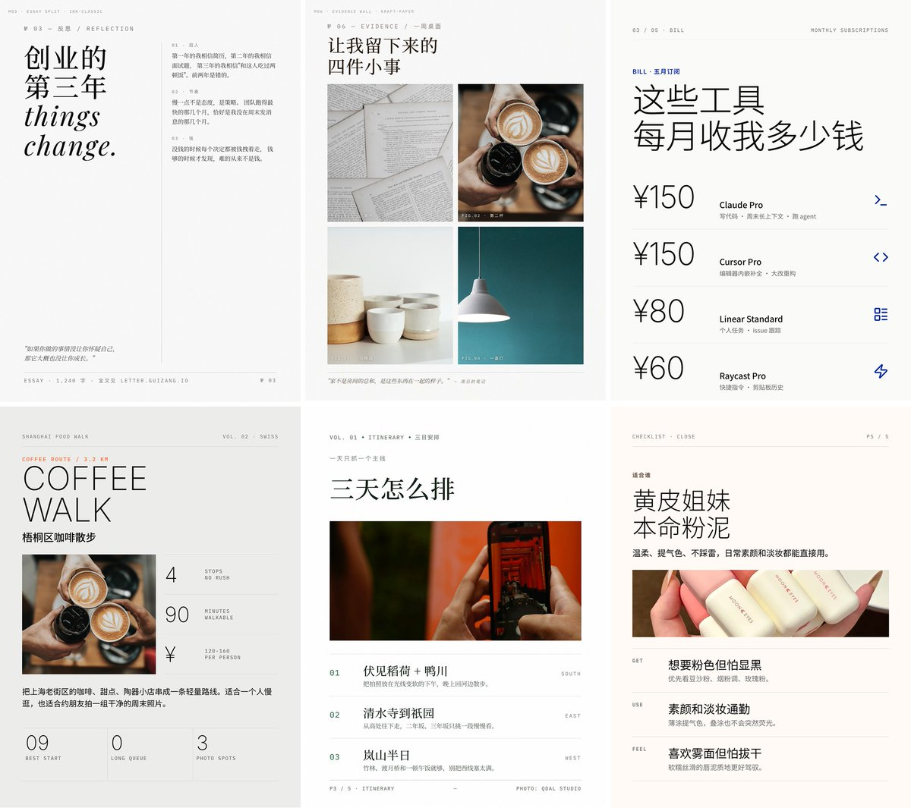

我甚至专门为旅行博主做了地图组件。你可以把店的位置和旅行路线都标注在上面，AI 会自动帮你生成标注。

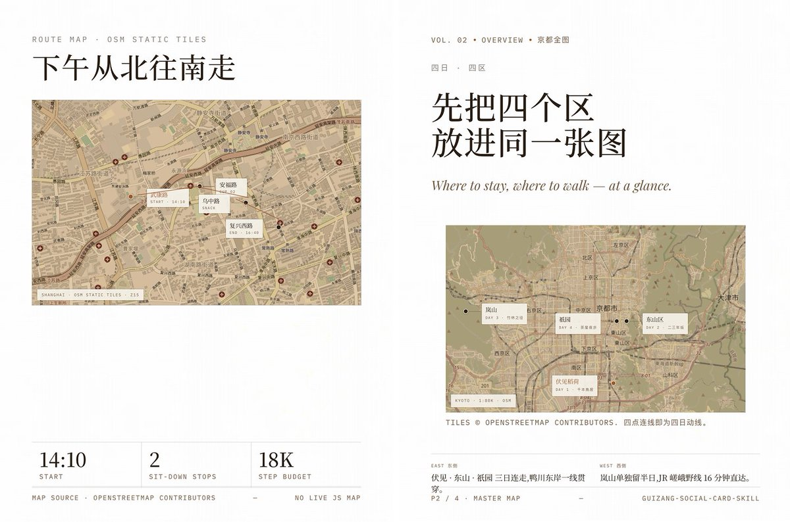

同一段文字喂给它，你说这是影评，它给你电影海报式的卡片；

你说这是产品测评，它给你带设备框的对比图。

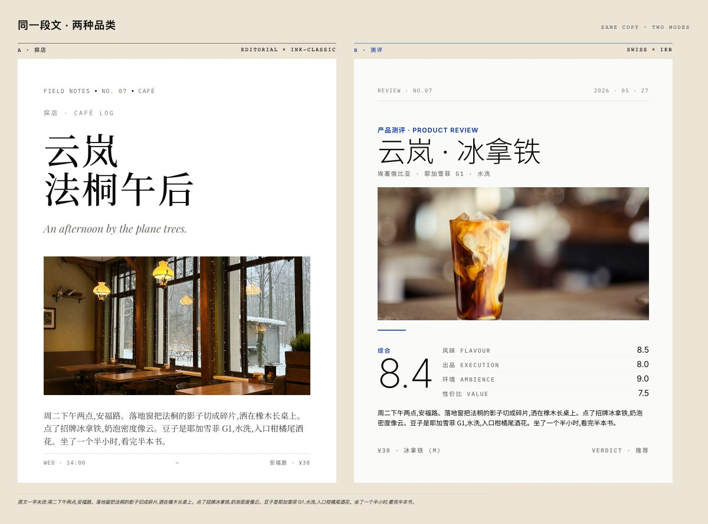

更重要的是，它有明确不接的活：

- 追星粉丝向，需要的视觉语言完全是另一脉；

- 纯促销硬广，违背它强调内容性的设计哲学；

- 超过 12 屏的长教程，图文形态不是长教程的最优载体。

碰到这些场景，Skill 会在开头就告诉你"你可能想用别的工具"。

这是我故意留的。能力边界比能力本身更能定义一个产品，一个什么都能做的 Skill 最后通常什么都做不好。

2.2 文字怎么压在图上

文字压图是图文卡片里最难的一件事，也是最容易暴露"AI 感"的地方。

压不好就会出现三种翻车：

1. 文字盖在人脸或产品中心位置上

1. 白字压浅色背景或黑字压深色背景读不清

1. 文字横跨整张图把本来好看的构图毁掉。

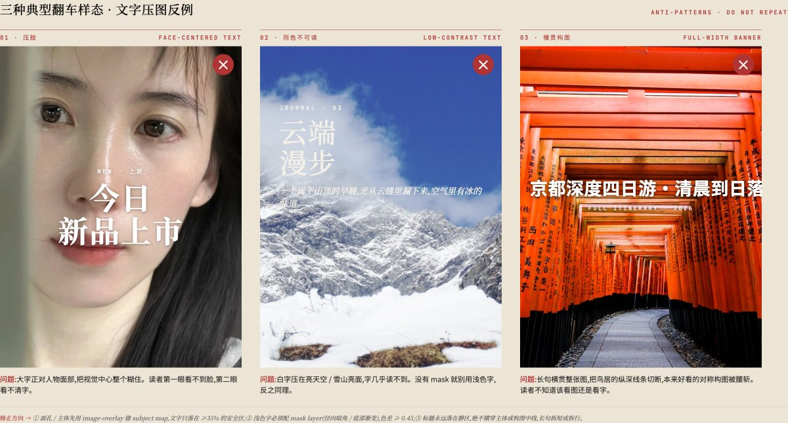

Skill 处理这件事用了三步：

1. 识别图里的主体：人脸、产品、文字密集区，版式上自动避开；

1. 算落点区域的色和明度：决定字色、要不要加蒙版、阴影该多深；

1. 字号和断行自适应：根据落点区域大小动态调整字号和换行位置，而不是写死字号让它溢出。

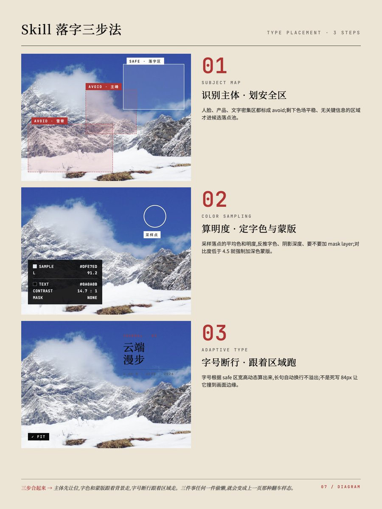

这套规则跑下来，卡片的"高级感"基本就立住了。读者看不出"被压上去的字"和"图本来就在那里的字"的区别。

2.3 图片从哪来：这是和市面上 AI 卡片工具最大的差别

绝大多数 AI 生成图文卡片的工具，要么让你自己上传图，要么用 emoji 顶替，要么生成一些一眼 AI 的插画。

结果就是手工补图很累，或者堆 emoji 显得很假。

这个 Skill 默认接入了三个免费可商用图库：

- Pexels，支持中文搜索，大众化场景够用；

- Unsplash，摄影质感最强，人物、生活、空间类内容首选；

- Wallhaven，游戏、摄影、壁纸之类的图都在这里，版权混乱。

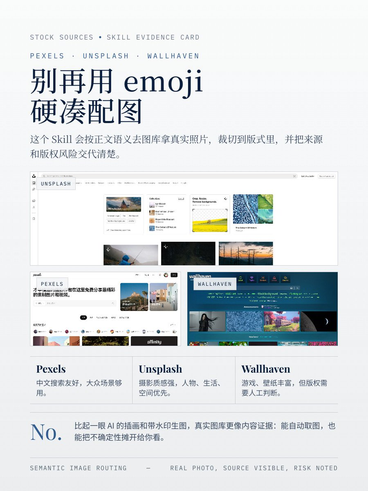

它会根据正文段落的语义自动派发搜索词、拿回图、按版式裁切到位、避开人脸或主体被切掉。

你拿到的是一张配了真实摄影图的卡片，而不是一张色块卡片。

而且它也不会死板地去寻找绝对没有版权问题的图。

能拿到的图都会告诉你，由你自己来判断要不要放版权不明确的图片。

另外，现在各个平台对 AI 带水印的问题管得很严。

目前你用的大部分 AI 生图都会有水印，而有水印就会被平台标注，一旦被标注就容易被限流，这是大家非常困扰的一个问题。

2.4 截图也是图：四件套美化

我们的很多内容用不了摄影图，得是软件截图、聊天记录、产品界面。

Skill 内置了一套截图美化：

加 macOS / iOS 风格的设备外框（browser chrome 或手机边框），用不同材质的背景托住截图，格纸、点阵、暖白或深色，让截图不再白底飘在白底上；

同时根据视觉风格自动匹配阴影层次和圆角参数，两套风格各有一套截图配方，前后一致不用手动调。

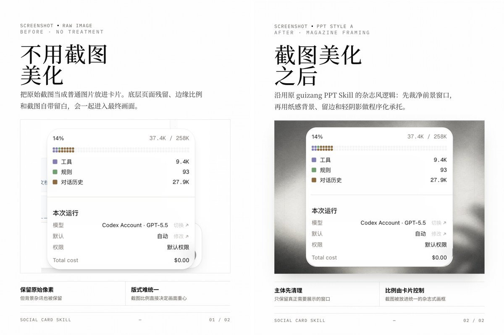

简单一句，你随手截的图，过它一道，看上去就像产品官方做的宣传图。

2.5 AI 生图：克制地用

只有前面所有找图渠道都拿不到合适素材时，Skill 才会调用 AI 生图。

生图时会强制带上风格约束词，避免出现"一眼 AI 插画"那种平庸视觉。

我宁可它少用 AI，也不想它把 AI 用成那个让所有图文卡片长得都像姐妹的元凶。

也避免你使用 AI 图片导致内容曝光受影响。

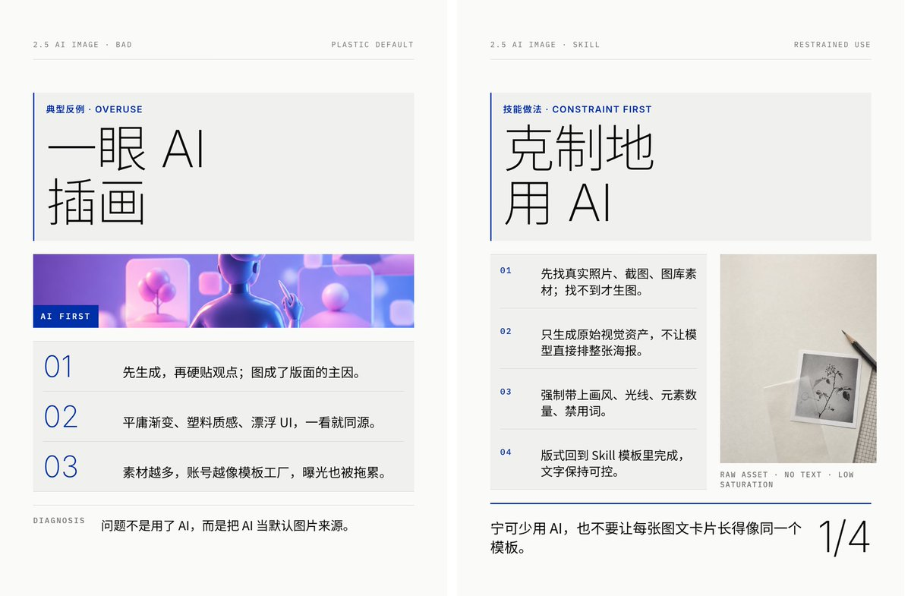

2.6 视觉系统：两套风格 + 28 个版式骨架

熟悉我之前的 PPT 的人会觉得眼熟。

这两套视觉系统和版式骨架，是从 PPT Skill 那边沿用并重新校准过来的。

我就不重复展开，简单说一下它在图文卡片场景下的样子。

两套视觉系统：

- 杂志风：你在《The New Yorker》和上海译文社的封面上看到的那种排版。大留白，衬线大标题，版式不对称，文字有呼吸感。

- 网格风：Massimo Vignelli 和 Helmut Schmid 瑞士平面设计那一脉。强网格，无衬线，几何感，用色克制但精准。

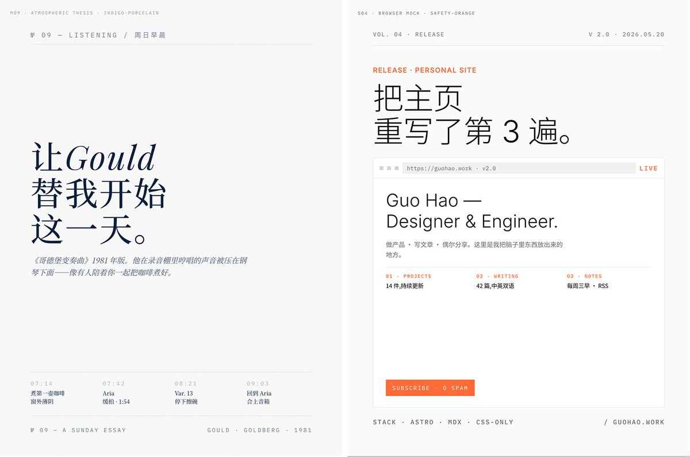

28 个版式骨架，是我从过去十年看过的杂志、海报、专辑封面、电影海报里挑出来，经得起放大看的那些。

AI 在"自由版面设计"上现在还是平庸的，给它一个被验证过的骨架，它的任务就从"设计"降级成"填充"，成品稳定性立刻上来。

10 套主题色板、固定字体搭配、有限图标库，这些细节就不一一列了。

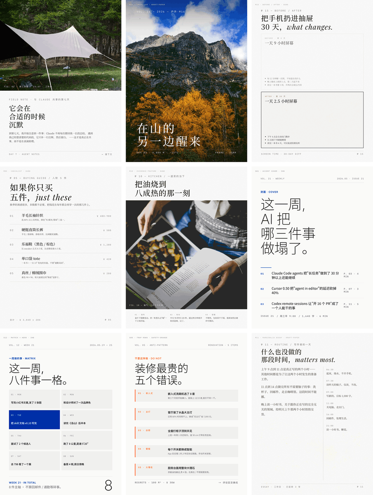

它们的逻辑是同一个：限制不是阻碍，是底线。

给一个内容创作者无限的颜色选择，他更容易做出难看的东西；

给他 10 套被验证过的色板，他做出能看的东西的概率会接近 100%。

## 三、为什么要这么做

3.1 设计角度：杂志感非常有效

为什么走杂志风和网格风，而不是更"现代"的卡片设计?

图文卡片的本质，和印刷海报、画报、专辑封面是同一种东西。

用一张静态图，在 1 秒钟里说服一个陌生人停下来。杂志和海报在过去一百年已经把这件事研究透了。

网页设计语言是为可滚动、可交互的场景做的，搬到一张静态图上，会显得用力过猛、信息平淡。

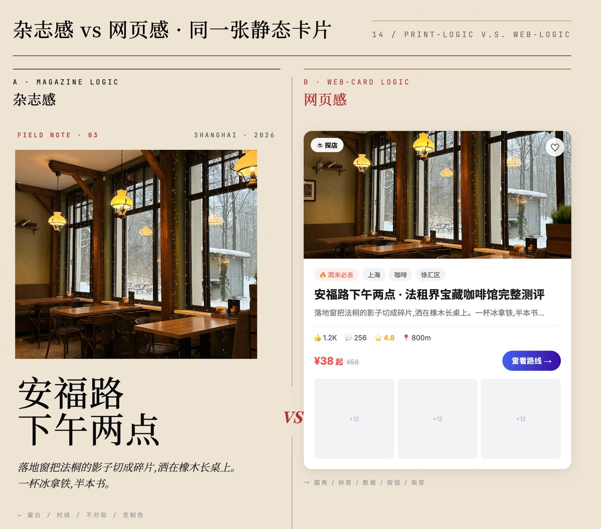

所以这个 Skill 在视觉决策上的所有"为什么"：

- 为什么大留白?留白是杂志告诉你"重点在这里"的方式；

- 为什么衬线字体优先?衬线字体在大字号上有印刷品的重量感；

- 为什么版式不对称?不对称会制造视觉节奏，让眼睛知道先看哪；

- 为什么用色克制?社交信息流里，克制的色板反而比饱和度高的更显眼，它和周围所有"喊得很大声"的卡片不一样。

这些决策听起来都很"虚"，但它们落到代码里全是具体的常量。

字号阶比例、留白比例、网格列数、对比度阈值、断行规则。这些常量才是这个 Skill 真正的护城河。

3.2 产品角度：它是一个产品，不是一段 Prompt

做了这么多 Skill 之后，我对"Skill 这种东西到底是什么"形成了一个判断：

Skill 这种东西，本质上是一个小产品。

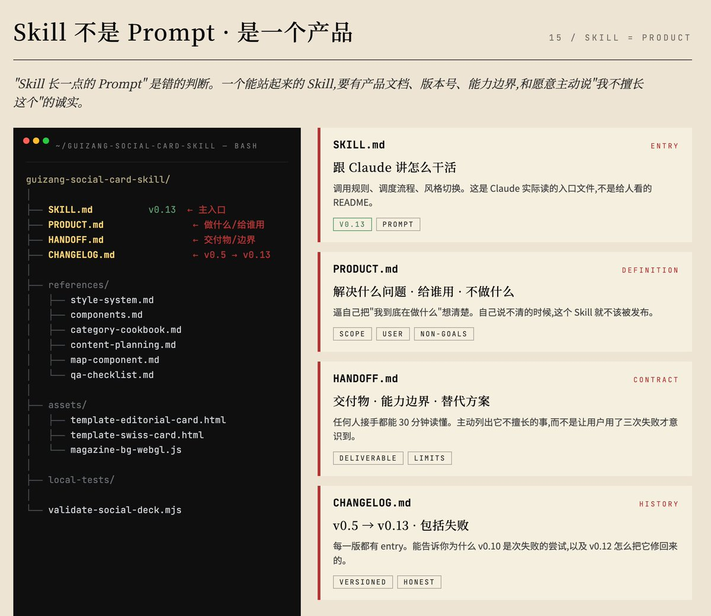

落到这个项目里：

我给它写了 PRODUCT.md，讲清楚它解决什么问题、给谁用、不做什么。

是为了逼自己把"我到底在做什么"想清楚。我自己说不清的时候，这个 Skill 就不该被发布。

我给它打 版本号(v0.5 / v0.9 / v0.10 / v0.12)，每一版都有 CHANGELOG。

我能告诉你为什么 v0.10 是一次失败的尝试，以及 v0.12 怎么把它修回来的。

我给它写 HANDOVER.md，讲清楚交付物长什么样、能力边界在哪、什么场景该用别的工具。

我希望任何人接手它，都能在 30 分钟内对它有完整理解。

我会提前列出它不擅长的事，省得用户试错三次才发现。

为什么要费这么大功夫?

因为 Skill 生态最大的问题，是绝大多数 Skill 满足于"我能做一个"，很少有人在追求"把这件事做到极致"。

一个 Skill 应该是能站起来的小产品。Prompt 十分钟会被同行复制走，产品不会。

这件事的反面是，如果我连自己 Skill 的能力边界都说不清，我就没资格让别人把工作流交给它。

## 写在最后

这个 Skill 让我反过来理解了我的 PPT Skill 真正做对的是什么。

真正做对的，是它从一开始就被当成产品对待。

模板多、规则细、颜色好看，都是这件事的副产品。

以后再有人问我 Skill 是什么，我会用两句话回答：

Skill 是一个产品。 判断一个 Skill 好不好，看它有没有被它的作者偏爱过。

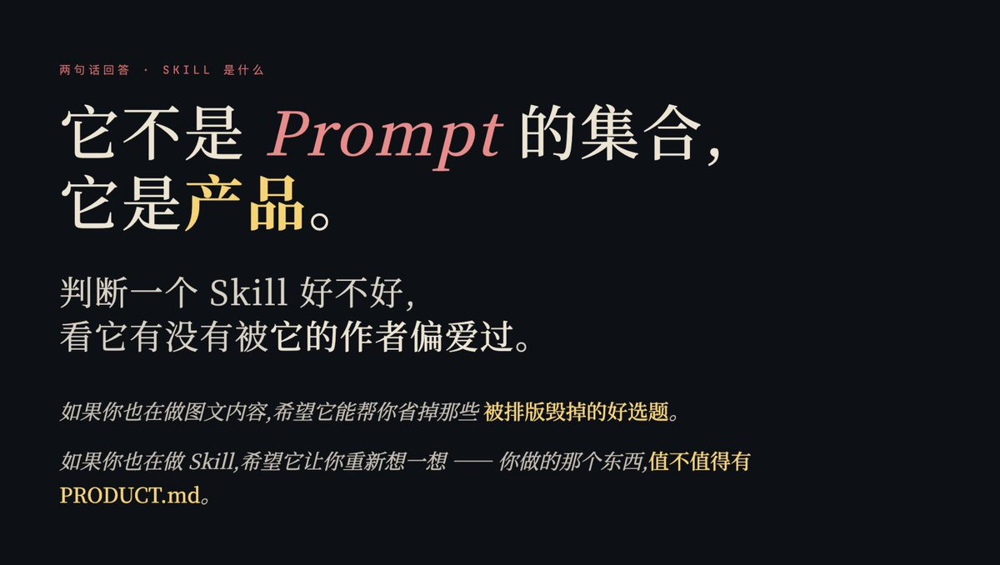

如果你也在做图文内容，希望它能帮你省掉那些被排版毁掉的好选题。

如果你也在做 Skill，希望它让你重新想一想，你做的那个东西，值不值得有 PRODUCT.md。

GitHub： https://github.com/op7418/guizang-social-card-skill

跟你的 Codex、小龙虾、ClaudeCode、Workbuddy 说：帮我安装这个 Skill：https://github.com/op7418/guizang-social-card-skill

### 🖼️ Attached Media

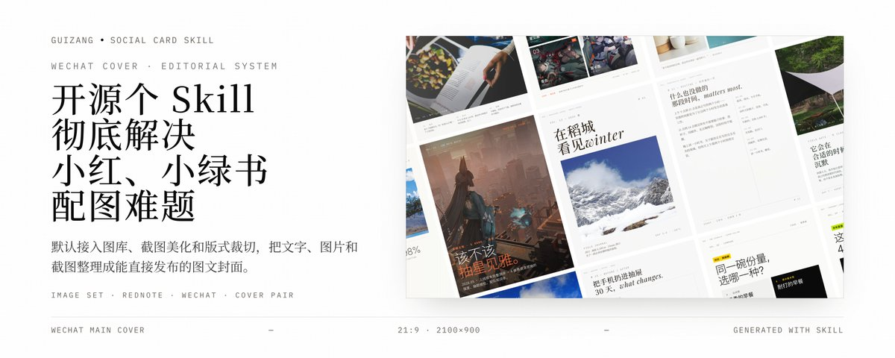

## 💬 Replies

### 1 @op7418 (歸藏(guizang.ai)) (Author)

*Thu May 28 02:35:31 +0000 2026*

哥哥们，都白嫖了，去点个 star 和点个赞吧！

### 2 @YMjbfc25354 (好鸡性，不如烂笔头)

*Thu May 28 03:21:36 +0000 2026*

@op7418 我觉得最好的就是克制AI生图这个了，文章配图第一还是得用真实的图源，这样文章更显真实性，除非一些特别的文章才可以纯用ai生图。

### 3 @op7418 (歸藏(guizang.ai)) (Author)

*Thu May 28 03:22:54 +0000 2026*

@YMjbfc25354 是的

### 4 @gerardsans (Gerard Sans | Axiom 🇬🇧)

*Sat May 30 21:28:54 +0000 2026*

@op7418 [x.com/gerardsans/sta…](https://x.com/gerardsans/status/2058513537815752911)

### 5 @Lonely__MH (Lonely)

*Thu May 28 03:22:29 +0000 2026*

@op7418 🥳🥳

### 6 @justloveabit (loveabit)

*Thu May 28 17:17:20 +0000 2026*

@op7418 这个skill真不错，配图简单了。

### 7 @OATHVIP (OATH)

*Sat Jul 25 13:17:59 +0000 2026*

@op7418 @grok 替我保存这个skills

### 8 @OATHVIP (OATH)

*Sat Jul 25 12:45:32 +0000 2026*

@op7418 @grok 帮我总结下来。

### 9 @nzc_wyh (ningzaichun)

*Thu May 28 09:25:42 +0000 2026*

@op7418 审美真的没话说，必须点赞，今晚的小红书就去发，哈哈哈 

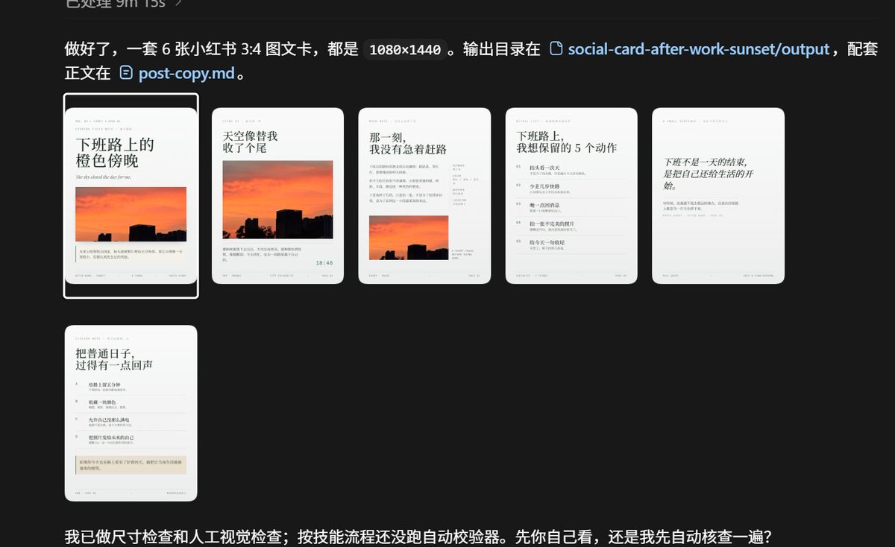

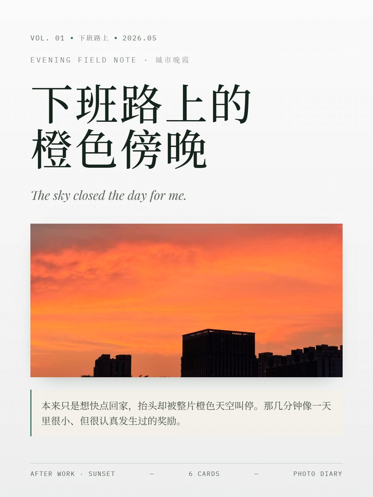

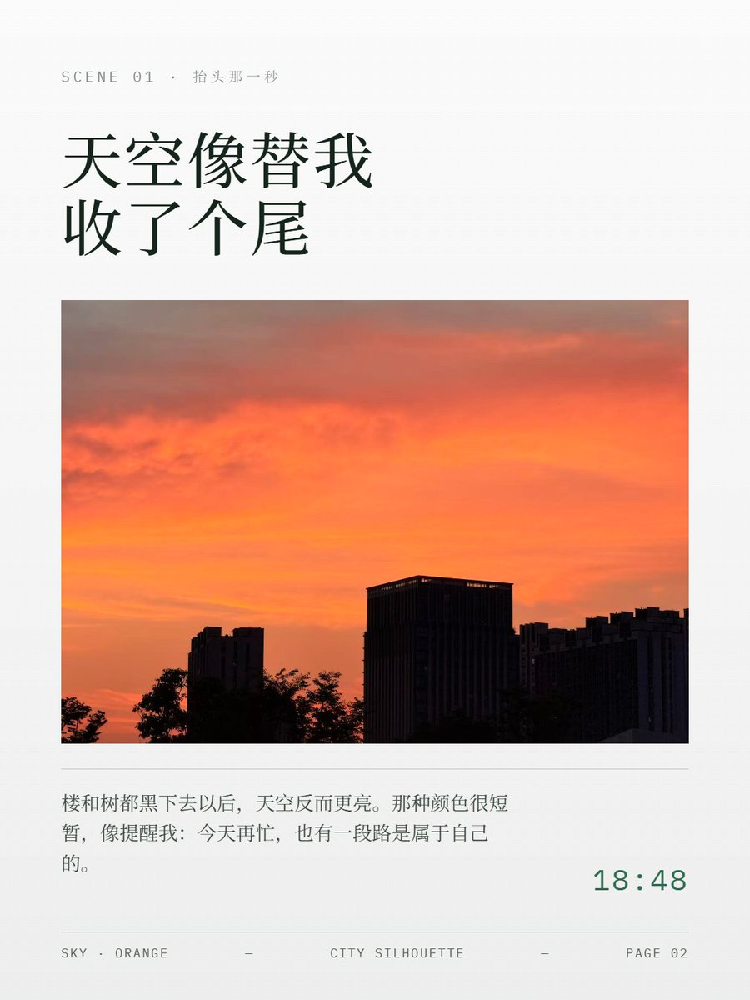

### 10 @gaoqian2580 (AI搞钱Hacker)

*Thu May 28 02:37:52 +0000 2026*

@op7418 和官方的Claude skill看来漂亮很多呀，我还在学官方Claude code skill

[x.com/gaoqian2580/st…](https://x.com/gaoqian2580/status/2059786247682637972?s=46)

### 11 @lone3m (周冷清)

*Thu May 28 03:43:25 +0000 2026*

@op7418 为什么不拿来出售？

### 12 @XiaoheiSpring (xiaohei_spring)

*Thu May 28 13:22:17 +0000 2026*

@op7418 简直是大善人👍

### 13 @menglign_wu (Mengling🌙)

*Thu May 28 02:14:17 +0000 2026*

@op7418 終於出了，昨晚就在等這個

### 14 @Makelove711 (Makelove)

*Sat Jun 06 12:10:06 +0000 2026*

@op7418 做6个小红书图，得花半个小时。工具是好的，就是效率能再快就了，总之鼓励。 

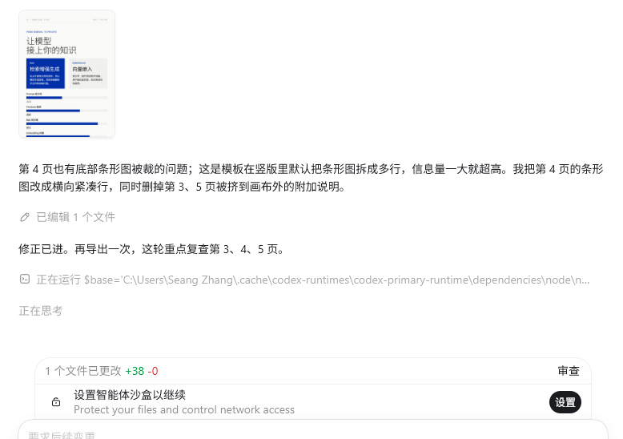

### 15 @lsslsy159401 (lsslsy)

*Thu May 28 03:54:24 +0000 2026*

@op7418 必须支持一波 

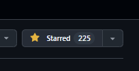

### 16 @samxqu8 (sam)

*Thu May 28 03:21:15 +0000 2026*

@op7418 太棒了👍，老师会不会出一个微信公众号 skill

### 17 @Ni_Agent (逆耳)

*Thu May 28 14:40:46 +0000 2026*

@op7418 以前做小红书图文，写文案20分钟，找图、排版能磨两小时。现在 Claude Code 一次给你生成完整组图，瑞士风、电子杂志风随便切，地图组件都内置好了

### 18 @alexchou_x (Alex Chou)

*Thu May 28 14:53:04 +0000 2026*

@op7418 太强了，必须给藏老师点赞👍

### 19 @suddenly01234 (suddenly)

*Mon Jun 08 08:48:59 +0000 2026*

@op7418 哥不白看，哥给你你点赞

### 20 @Wanglei850403 (krislwang)

*Thu May 28 03:51:40 +0000 2026*

@op7418 感谢 藏师傅 每一个用心打磨产品的人 都好帅～

### 21 @Samleoohw (派叔Ai)

*Thu May 28 02:55:51 +0000 2026*

@op7418 这个太刚需了。

很多创作者不是卡在写内容，而是卡在写完之后的分发脏活：

配图
排版
封面
尺寸适配
平台风格匹配

Skill 的价值不是多生成一张图，而是把内容分发链路补齐。

### 22 @Mk_Flow (MK@Phoenix)

*Thu May 28 03:43:03 +0000 2026*

@op7418 又多了一个宝库, 我非常认真的, 大家可以收集下, 然后蒸馏出自己的

### 23 @k_yllaaaaa (Kayla)

*Mon Jun 01 07:04:11 +0000 2026*

@op7418 感谢大佬🌺🌺🌺🌺

### 24 @baibaida (狐狸布布)

*Fri May 29 00:28:49 +0000 2026*

@op7418 配图排版这个痛点太真实了 我每次发小红书光调版式就要磨半天...截网页这个思路确实够野

### 25 @baibaida (狐狸布布)

*Thu May 28 13:12:16 +0000 2026*

@op7418 等等 配图这个痛点解决了的话...做小红书内容的效率直接起飞了吧

### 26 @baibaida (狐狸布布)

*Thu May 28 06:13:23 +0000 2026*

@op7418 25天破万star 说明内容创作者对配图排版的痛点是真的深...之前做内容运营的同事也是 花在排版上的时间比写文案还多 这个方向值得深挖

### 27 @baibaida (狐狸布布)

*Thu May 28 02:16:20 +0000 2026*

@op7418 这种工具才是真正能用的...小红书配图我每次都花半天 有个能自动匹配排版的skill直接省掉一半时间

### 28 @TobyAtLarge (Toby!)

*Thu May 28 06:36:52 +0000 2026*

@op7418 封面居然有该不该抽星见雅哈哈哈哈哈！

（小声bb：这个版本肯定不抽了，等3.0新虚狩）

### 29 @LinlinPeng12742 (蛙仔不潜水)

*Fri May 29 17:08:25 +0000 2026*

@op7418 明天就试试

### 30 @TChangyin (陶常胤)

*Tue Jun 02 07:31:15 +0000 2026*

@op7418 感谢分享。

### 31 @erqianburongyi (千儿不是千)

*Tue Jul 21 12:20:06 +0000 2026*

@op7418 感觉挺牛逼的，跟那些成天发布这 skill 那 skill 的不是一个级别的，理念也认同，回头试试

### 32 @AstroHanRay (AstroHan)

*Thu May 28 05:06:13 +0000 2026*

@op7418 太棒了！！果断点赞点星！

### 33 @ninthbit_ai (Kieran Zhang)

*Thu May 28 03:29:01 +0000 2026*

@op7418 star 了，完全可以做一个商业产品的程度，直接开源了～伟大无需多盐

### 34 @mercu_win (Mercury)

*Sun May 31 01:55:20 +0000 2026*

@op7418 确实好用

### 35 @yuanyon03601419 (Jarvan)

*Fri May 29 03:54:05 +0000 2026*

@op7418 太牛了 我的好 bro

### 36 @star_flow_ai (星川 ✨ StarFlow)

*Tue Jul 21 12:52:17 +0000 2026*

@op7418 设计的不错

