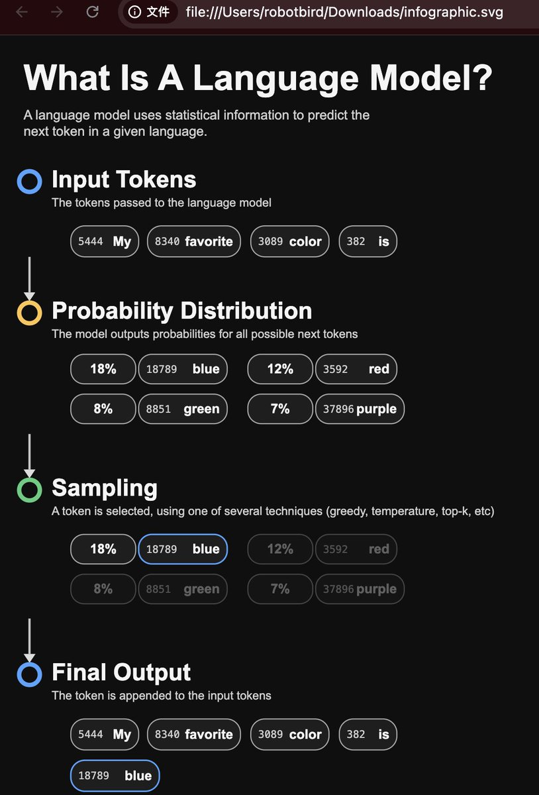

用途：我发一张信息图或海报截图，你把它高保真还原为可编辑 SVG，整体排版尽量一致，但文字改成 {中文}（或保持原语言）。
 提示词：
指令
请把我发送的图片转成可编辑 SVG：

保持版式与层级结构（标题、分区、图标、箭头、图表等）尽量一致；
所有文字保留为 &lt;text&gt; 可编辑（不要转路径）；

所有图形用向量元素（&lt;rect&gt;/&lt;circle&gt;/&lt;path&gt;/&lt;line&gt;/&lt;polygon&gt;），不要嵌入位图；

颜色与风格尽量接近原图；

分组与命名清晰：01\_Header、02\_Section\_\*、Icon\_\*、Chart\_\*；

画布尺寸按原图推断；坐标/描边尽量用整数；

生成文件到 /mnt/data/infographic.svg 并给出下载链接。
若图片中有不清晰的内容，请做合理假设并在结果底部列出“假设项”。

（语言：{中文 \| 保持原文}）

## 💬 Replies

### 1 @robotbird01 (robotbird)

*Wed Oct 29 10:44:37 +0000 2025*

@op7418 非常有用，我已经验证了这个提示词，输出的是英文版本的。
提示词已收藏到我的网站 [promptpack.net/prompt/ZSkiUvey](https://www.promptpack.net/prompt/ZSkiUvey) 

