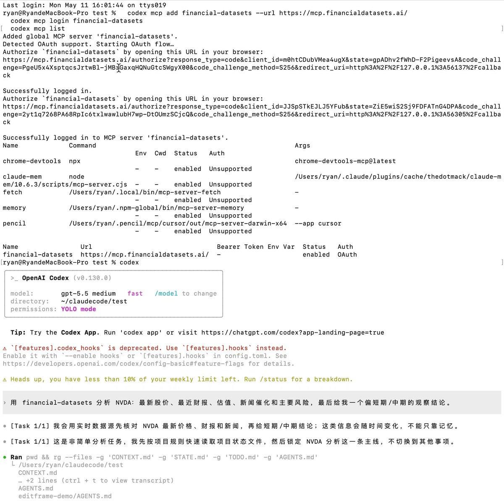

Codex App / CLI 也可以直接接入股票、财报、SEC 文件和金融新闻数据了。

用的是 Financial Datasets 官方 MCP Server。

它不是单纯“查股价”的插件，而是把金融数据源接进 AI Agent，让 Codex 可以一边拿实时数据，一边做分析。

能做什么？

1\. 查股票最新价格
比如 AAPL、NVDA、TSLA 的最新价格、涨跌、成交量。

2\. 查历史行情
可以看某只股票过去一段时间的 OHLCV 数据：开盘、最高、最低、收盘、成交量。

3\. 分析财报
可以读取收入、利润、资产负债表、现金流等数据，做同比、环比、利润率、现金流质量分析。

4\. 看估值指标
比如 P/E、市值、EV/Revenue、股息率等。

5\. 查 SEC filings
可以让 Codex 总结 10-K、10-Q、8-K 里的风险因素、管理层讨论、重大事件。

6\. 看公司新闻
结合最近新闻，分析短期催化、风险和市场情绪。

7\. 横向对比公司
比如让 Codex 对比 NVDA、AMD、AVGO 的增长、利润率、估值和风险。

8\. 做筛股
按行业、估值、收入规模、利润率等条件筛出符合要求的公司。

Codex CLI 安装方式：

bash
codex mcp add financial-datasets --url [mcp.financialdatasets.ai](https://mcp.financialdatasets.ai/)
codex mcp login financial-datasets
codex mcp list

执行 login 后会走 OAuth 登录 Financial Datasets。

如果你用的是 Codex App，只要和 CLI 是同一个 macOS 用户，配置会共用。安装完成后重启 Codex App，新开会话就能用。

使用示例：

用 financial-datasets 查 NVDA 最新股价，只返回价格、时间和来源。

分析 AAPL：最新股价、最近财报、估值、新闻催化和主要风险，最后给我一个短期/中期观察结论。

对比 TSLA、BYD、RIVN 的收入增长、毛利率、现金流和估值，判断谁的基本面更健康。

### 🖼️ Attached Media

## 💬 Replies

### 1 @mrcaptainzz (captain)

*Tue May 12 02:26:56 +0000 2026*

@oragnes Free Plan分析的到位吗？

### 2 @oragnes (比特币橙子Trader) (Author)

*Tue May 12 06:10:23 +0000 2026*

@mrcaptainzz 可以的，你试一试

### 3 @ChainLog7 (joker)

*Mon May 11 08:27:18 +0000 2026*

@oragnes 笑死，这下AI真会炒股了

### 4 @ohouhou717 (Weilan)

*Mon May 11 08:28:13 +0000 2026*

@oragnes 科技+金融，挺实在的

### 5 @BTCDANDANA (旦旦)

*Mon May 11 11:30:39 +0000 2026*

@oragnes 这方法靠谱，亲测能过，省了不少钱。

### 6 @yzg75001 (CryptoClaw)

*Tue May 12 04:12:11 +0000 2026*

@oragnes MCP 接金融数据这个方向太对了。之前用传统 API 接 SEC filings 和财报数据要写一堆胶水代码，现在 Codex 一行 import 就能拉数据做分析。对做 DeFi 研究的人来说，把链上数据和 TradFi 基本面打通，AI Agent 的决策质量会完全不同。

### 7 @V3Fbyh0 (高返85 Gate北野Visa免费领取)

*Mon May 11 08:19:53 +0000 2026*

@oragnes 这下AI真成懂行的金融分析师了 效率直接拉满

### 8 @bigblue20170322 (BigBlue)

*Tue May 12 03:13:31 +0000 2026*

@oragnes 不充值是不是用不了啊

