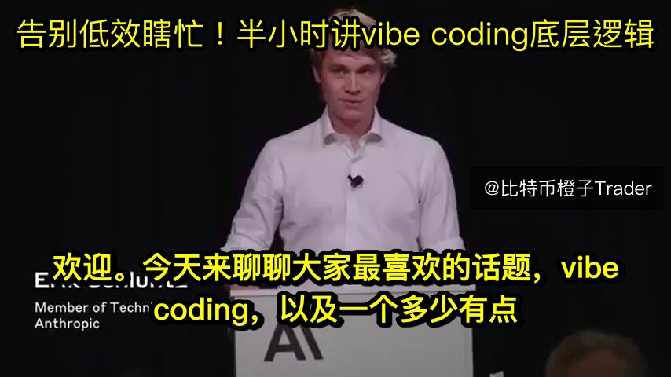

卧槽！真心强烈推荐所有人，不管你懂不懂技术，只要你想在AI时代做商业、搞投资或者抓住时代红利，都去狠狠刷一遍Anthropic官方的这场超神分享！

直接把未来三五年的终极生产力革命直觉编程彻底讲透了！

这绝对是降维打击级别的认知。内容深度直接拉满，从普通人怎么给AI当大脑，到如何把大模型安全接入真实的业务和商业场景，全是没有水分的顶级实操干货，连很多核心圈的资深从业者目前都还没摸透这套底层逻辑。

周末别再整天碎片化刷短视频浪费时间了，赶紧先点赞收藏存下来，抽个半小时静下心完整看一遍。

看完你绝对会觉得头皮发麻，彻底弄懂怎么统御大模型为你打工，绝对是你这周回报率最高、最颠覆认知的一次学习！

### 🖼️ Attached Media

## 💬 Replies

### 1 @yigeren555 (头号咨询玩家)

*Wed Apr 22 15:22:52 +0000 2026*

@oragnes @grok 帮我总结成干货发给我

### 2 @chenbossx (Xinyang Chen)

*Tue Apr 21 20:50:48 +0000 2026*

@oragnes @grok 这个讲的有用吗，分析一下

### 3 @AriesYangMen (Arise)

*Wed Apr 22 00:41:43 +0000 2026*

@oragnes 看一眼AI写的代码又不会死😂

### 4 @CY_Chase_AI (承越.Chase)

*Wed Apr 22 00:23:30 +0000 2026*

@oragnes 这个原文在哪里呀？

### 5 @bilion1983 (Bitcoin Maxi |Billy 马 ⛽️🔥🌮)

*Thu Apr 23 03:41:30 +0000 2026*

@oragnes @grok 帮我总结这个视频的核心内容和关键要点

### 6 @david89274803 (david)

*Wed May 20 00:44:20 +0000 2026*

@oragnes @grok 完整梳理视频的原始内容和观点，不要裁剪和提炼。

### 7 @BuildMetricsIO (Build Metrics)

*Thu Apr 23 06:56:41 +0000 2026*

@oragnes @grok 总结主要内容发给我

### 8 @Alexlu37332528 (Alex)

*Thu Apr 23 00:14:00 +0000 2026*

@oragnes @grok 总结这个演讲

### 9 @XY8778808480158 (XY)

*Thu Apr 23 08:59:48 +0000 2026*

@oragnes @grok
总结一下，主要内容发给我

### 10 @YiYeshu41733 (Yi Yeshu | XunZhi Tech)

*Wed Apr 22 13:17:41 +0000 2026*

@oragnes @grok 提炼一下核心观点

### 11 @NeilZ666 (Neil Z)

*Thu Apr 23 01:05:53 +0000 2026*

@oragnes @grok Summarize the core points

### 12 @zao_tan96361 (乱跑实战)

*Thu Apr 23 01:30:22 +0000 2026*

@oragnes @grok 总结一下，主要内容发给我

### 13 @aniula00762647 (aniula007)

*Thu Apr 23 03:26:59 +0000 2026*

@oragnes @grok 总结把主要内容发给我

### 14 @JShi727 (JShi)

*Thu Apr 23 05:04:43 +0000 2026*

@oragnes @grok 帮我总结下

### 15 @x3105105793465 (喬治 x 喬太太的料理)

*Thu Apr 30 23:06:35 +0000 2026*

@oragnes @grok 幫我總結˙

### 16 @AI_EC_Hacker (EC専門エンジニア)

*Wed Apr 22 10:06:11 +0000 2026*

これに乗っかると、痛い目にあうリスクもある現場感を補足しますね。

実は「全部見まくる」だけで勝てるわけじゃなくて、Anthropicの設計思想と自社の収益モデルを掛け合わせる作業が本丸。資料を浴びて得られるのは知識のストックで、そこをプロダクトや営業フローに落とし込めるかで生産性が10倍にも1/10にもなる。CPUが演算力を出すには冷却と電力管理が要るように、知識を動かすには市場仮説と実地検証という“運用”が必要。

### 17 @dxh8286239 (Du Xh ❤️ Memecoin)

*Thu Apr 23 04:24:36 +0000 2026*

@oragnes 已收藏，下次学习新东西，试试

### 18 @RedhatWang (redhat wang)

*Tue Apr 21 23:40:10 +0000 2026*

@oragnes 看完了，问答部分都是些经典问题

