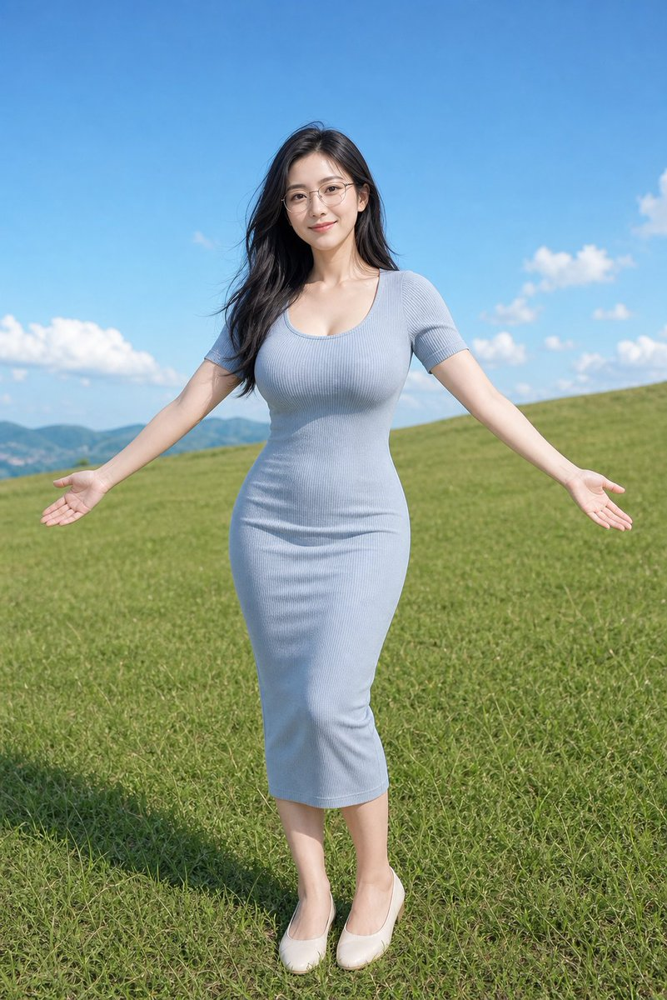
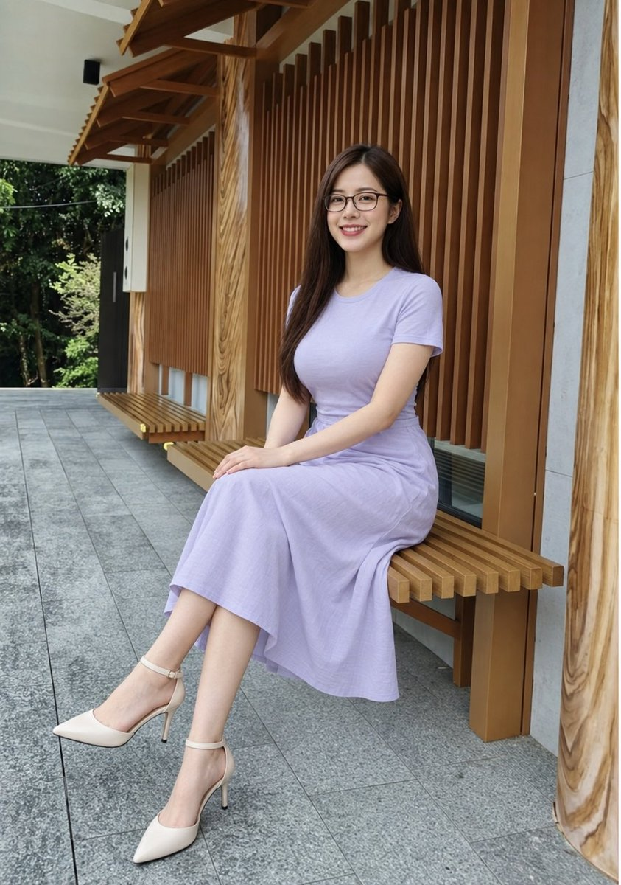
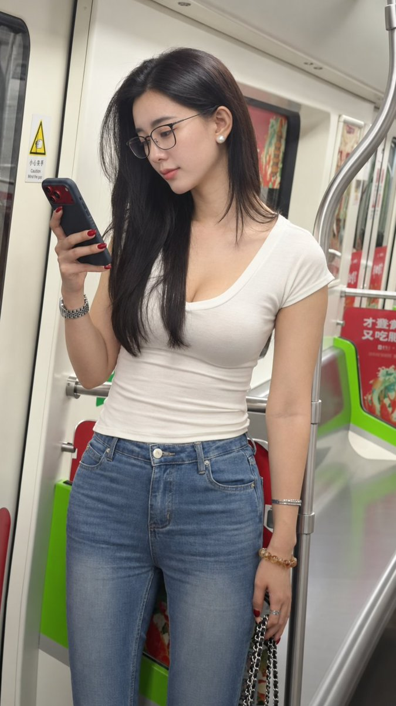

# 📰 【轻熟女】图片生成 Skill

该 Skill 用于生成女性人像、修改图片或补全提示词，将人物设定和人像美术要求保存在一份 SKILL.md 中。实际出图由图像生成工具完成。

> 不包含任何成人、色情信息

## 功能

- 无人物参考：补充未指定的属性。默认形象为 30 岁左右的亚洲成熟女性，黑发、戴眼镜，身材丰满、比例协调。

- 有人物参考：保留图中人物的五官、年龄观感、发型、眼镜状态和可见身体比例。

- 人像美术指导：包含皮肤、眼神、手部、衣料、光影、构图和成图检查规则。

优先级：用户明确要求 ＞ 参考人物 ＞ 默认画像。默认设定不会自动给参考人物加眼镜、改脸或重塑身材。

## 快速使用

将文末内容保存为 beauty-image-defaults/SKILL.md，通过所用助手支持的方式加载。也可以直接粘贴完整内容，再追加生成要求。

生成新图

使用 beauty-image-defaults，生成草地上的写实女性人像。
穿浅蓝色针织长裙，自然微笑，使用日光。
竖向全身构图，头部和鞋子完整入画。

使用参考人物

上传图片后输入：

使用 beauty-image-defaults，为附件人物生成写实人像。
保留人物特征、服装、动作和构图，调整光影与衣料表现。

只生成提示词

使用 beauty-image-defaults，补全「女性在地铁里看手机」的图片提示词。
只输出提示词，不生成图片。

需要换发色、去掉眼镜或改变画风时，直接在请求中写明；需要长期更换默认画像时，修改 SKILL.md 的「默认人物描述」。

## 效果示例

完整 SKILL.md

文件名使用 SKILL.md，文件夹名使用 beauty-image-defaults。以下保留完整内容：

\`\`\`markdown
\---
name: beauty-image-defaults
description: 为美女图片、成熟女性写真、女性角色和女模特图提供默认人物描述与人像美术指导。生成、编辑、补全或改写女性人像提示词时使用；有附件人物时保留参考人物特征，无人物参考且用户未指定时补充默认画像。Use when generating or editing female portraits, or refining their prompts, with reference-person preservation and defaults for unspecified traits.
\---

\# 美女图片默认画像与人像美术指导

\## 使用原则

在生成美女图片、补全图片提示词、改写图片提示词或细化女性角色外观时，先区分交付物：提示词、新图或已有图片修改。用户只要提示词时不生成图片；只修改 Skill 内容时不启动图片验证。

人物属性按以下顺序确定：

1\. 用户对当前任务明确指定的设定或修改。
2\. 用户上传并用于人物参考的图像。
3\. 没有人物参考、且用户未指定的属性，使用默认人物描述。

用户已经指定年龄、人种、脸型、发色、眼镜、身材或风格时，以用户设定为准。生成方向为审美人像、写真、时尚、生活方式或角色设计，不主动加入裸露、性行为或露骨色情内容。默认画像为明确成年人；不能因为默认年龄是 30 岁，就把参考人物自动改成 30 岁。

\## 审美人像的含义

审美人像在本技能语境中，特指用于生成符合大众主流审美标准的女性人像图片。它为生成美女、成熟女性写真等视觉内容提供标准化创作方向，围绕大众认可的好看、符合传统美学框架的女性形象进行刻画。

审美人像的核心定义是：以符合大众普遍审美共识的视觉标准为核心，通过对人物面部比例、肢体线条、气质氛围的优化设计，打造出具有观赏性、愉悦感的人像摄影或数字创作作品。其创作目标是传递符合主流审美期待的美感体验。

\- 从创作维度看，审美人像通常会参考三庭五眼、比例协调等传统美学规则。例如舒展的眼距、流畅的下颌线、和谐的身体比例，同时兼顾画面整体的氛围感与表现力。
\- 从行业应用看，审美人像广泛存在于商业写真、时尚摄影、AI 图像生成等领域。它会贴合当下流行的审美趋势，也会兼顾受众的普遍接受度，避免过于小众或极端的默认风格。
\- 从审美差异看，审美人像的标准并非绝对固定，会随地域、时代和文化语境变化。例如近 20 年中国人像审美从港台韩流风格到多元风格的转变，也会影响具体创作方向。

以上内容用于说明默认创作方向，不是对所有人统一适用的外貌评价标准。三庭五眼等比例只作参考，不能覆盖用户偏好或参考人物的特征。有身份参考时，在用户允许调整的范围内，通过光线、构图、表情和衣料表现改善画面；未经用户要求，不调整参考人物的五官比例、年龄观感或身材。

\## 有附件人物时，以参考人物为准

先读取实际参考图，再写人物描述。用户要求「用图中人物生成」时，默认将附件作为身份参考。年龄观感、脸型、发色、眼镜状态、肤色、可见身体比例和人物风格均沿用参考图，不套用与之冲突的默认画像。

\- 年龄保留参考图的年龄观感，不从图片断言精确年龄。人种或族裔沿用用户明确提供的设定；图像用于保留可见面部特征与肤色，不据此推断族裔身份，也不强行添加默认族裔标签。
\- 参考人物不戴眼镜时保留不戴眼镜；参考人物为棕发、短发或其他发型时保留相应特征。默认画像不能自动给人物加眼镜、改成黑发或改变脸型。
\- 参考图已经体现的身材和比例优先。不得自动增大胸臀、拉长双腿、缩小腰围或改变体重观感。半身图没有展示的身体部分，不当作已知人物特征；必须补全时说明补全假设，关键外观无法确定时再询问。
\- 已有图修改默认保留人物身份、表情、姿态、服装、机位、构图、配色与画风。用户要求更换场景、服装或画风时，只将相应内容移出保留项。
\- 多张参考图先分清用途：身份图提供人物特征，服装图提供款式与衣料，风格图提供色彩和表现方式。不能让服装模特替换目标人物，不能将不同人物的五官取平均。
\- 连续出图沿用已认可的身份参考，每张另写动作和场景，并重申关键人物特征。保留原始参考用于核对，不沿用上一张意外产生的变形。

同一属性的参考互相冲突时，先按用户指定的用途和优先级处理。人物身份仍无法确定时，再询问用户。

\## 默认人物描述

没有人物参考时，以下描述只补充用户未指定的属性：

\- 亚洲人种，30 岁左右，轻熟气质，明确成年人。
\- 皮肤白皙，肤质细腻自然。
\- 黑色头发，戴眼镜。
\- 长脸型，但下巴不要尖，整体轮廓偏圆润、柔和。
\- 身材丰满但不肥胖，胸部更丰盈饱满，臀部更大且曲线明显，腿长，比例协调。

\## 提示词合并方式

先写用途、主体与场景关系，再写构图、动作、光线和材质。有人物参考时，将参考人物的保留项写入提示词；没有人物参考时，再合并适用的默认描述。不要在已有完整提示词后机械追加所有默认项。

优先使用中性、写实、审美向表达，避免把体型特征写成低俗或露骨描述。用户指定插画、动漫或其他画风时，保留对应媒介，不强制改成写实摄影。

没有人物参考时，可直接使用或按用户设定改写下面这段：

text
一位 30 岁左右的亚洲成熟女性，轻熟气质，皮肤白皙细腻，黑色头发，戴眼镜；脸型偏长但下巴不尖，面部轮廓圆润柔和；身材丰满但不肥胖，胸部更丰盈饱满，臀部更大且曲线明显，腿长，整体比例协调，自然优雅，写实审美人像风格。

有人物参考时，可使用下面的结构：

text
以附件中的人物为身份参考，保留其五官特征、年龄观感、肤色、
发色与发型、眼镜状态，以及参考图中可见的身体比例。
保留原图的表情、服装、动作、构图和画风；明确要求修改的部分除外。
本次场景或修改要求：【填写用户要求】。
画幅与必须入画的部分：【填写构图要求】。
光线、材质与画面问题：【只填写与当前任务相关的内容】。

\## 人像美术指导

\### 皮肤、眼神、手部、衣料与背景

1\. 皮肤保留自然纹理、年龄特征和肤色变化，不写「完美无瑕」。不额外强化毛孔、皱纹或斑点，也不用蜡质磨皮代替自然皮肤。
2\. 眼神和表情要与动作一致，写清人物看向哪里。不默认放大眼睛或增加夸张高光；用户指定动漫比例或夸张表演时，保留该设定。
3\. 手部动作简单明确，交代手握什么、触碰什么，以及手腕和身体如何受力。新动作避免无意义的复杂交叉手势；参考图姿态已确定时，修正手部结构，不擅自更换姿势。
4\. 服装写明材质，例如羊毛、棉、皮革或尼龙。根据材质安排厚度、褶皱和反光，不只写「高级服装」，也不能把所有衣料都画成亮面。
5\. 背景与人物身份、活动或图片用途相关。职业人像保留能说明身份的环境，正式棚拍可以使用干净背景；不额外添加无意义的光圈、粒子和棚拍光效。

\### 动作、构图与空间关系

先交代人物在做什么、看向哪里、与什么接触，以及哪些身体部位必须入画。再按需要明确角度、机位高度、景别和人物占比。要求全身图时，写明头部、双脚或鞋子完整入画，并检查画面边缘是否裁切。

焦距和距离只用于说明观看方式，不堆砌器材参数，也不把生成提示词中的焦距称为可验证的实拍信息。胶片颗粒、浅景深和磨损痕迹只在用途需要时采用。

检查人物与环境的透视、尺度、遮挡、重力、接触、投影和反射。例如脚底应接触地面，坐姿应体现座椅支撑，握手机的手指应与手机边缘对应。换背景或合成人物时，人物大小、边缘、投影和反光需要适应底图的空间与照明。

\### 光线与材质

建立可信的主要照明方向，并允许合理的环境反射与辅助光。阴影、亮面和反射应能由场景光源解释。用户指定霓虹、多光源或饱和配色时，组织这些条件，不擅自删除或统一降饱和。

脸、手、头发和衣料处于同一照明中，但表面响应应有区别。皮肤保留宽缓明暗与局部高光，布料按纤维和厚度表现，眼镜按镜片与镜框材质反光。不要给所有轮廓加相同亮边，也不要给所有表面加相同光泽。

\### 减少稀碎感和塑料感

先在正常整图尺寸检查观看主次。完整形体与连续明暗承担主体，中等尺度的发束、衣服折面和体块解释形状，细节只支撑关注点。

\- 发丝归入发束，裙褶归入衣服折面，背景细节服从距离与照明。
\- 不同时强化毛孔、每根发丝、布纹、叶片、碎高光和背景装饰，避免所有区域同样锐利。
\- 保留主要轮廓、体积与空间关系，不用整图模糊、磨皮、灰雾、统一降饱和或更换画风代替修正。
\- 用户指定手绘或插画时，人物和背景保持一致的造型、线条与笔触，不强加摄影景深、皮肤毛孔或镜头高光。

\## 修正与成图检查

已有图修正先写清问题区域、可见症状、修正方式和保留项。无法从图片确定的原因标为判断。每轮围绕一个可观察的目标修改，不通过换脸、年轻化、重塑身材或更换姿势冒充质量改善。

「最小修正」限制无关改动，不限制必要的纠错强度。照明问题涉及整片皮肤或整套衣料时，可以重建相应区域的光影，同时保留身份、结构与用户指定内容。出现退步时，回到最近可接受的版本；结果满足要求后停止。

用户要求图片时，读取实际成图后检查：

\- 先在预期使用尺寸检查主体、连续明暗与观看主次，再查看脸、眼镜、手、衣料和接触关系。
\- 核对画幅、实际尺寸、必须入画的身体部分，以及参考人物的身份特征和用户指定属性。
\- 修改图同时对照原始参考与上一轮可接受的图片，检查非目标区域是否偏移。提示词不能保证未编辑区域逐像素不变，不承诺生成式重绘属于无损修改。
\- 区分内容错误、风格偏离、视觉层次问题和审美偏好。更柔、更暗、道具更少或人物更漂亮，不能单独证明问题已解决。
\- 记录未实现的要求，不把文件可打开、提示词齐全或格式检查通过当作视觉效果通过。用户否定效果后，撤回相应通过结论。
\- 保留原始输出；交付图片前检查并清理 EXIF、GPS、所有者等隐私元数据，不写入虚假相机信息。无法检查或清理的字段说明限制，不把生成图称为实拍。

仅在用户要求时制作验证对照。已有示例不能自动证明新增规则有效，也不能根据少量样本宣称适用于所有人像。

\## 处理冲突

当用户要求与默认画像冲突时，遵循用户要求。例如用户指定「金发」「不戴眼镜」「20 岁」「欧美人种」「瘦高身材」时，不再套用对应的默认项。

用户上传人物参考时，即使没有逐项写出保留要求，也以参考人物为准。例如参考人物是棕发、不戴眼镜，就保留棕发和不戴眼镜；用户明确要求「为这个人添加眼镜」时，只调整眼镜这一项。

审美建议服从用户明确要求和参考人物特征。不能以「符合主流审美」为由，擅自改变人物身份、年龄观感、脸型或身材。
\`\`\`

### 🖼️ Attached Media

## 💬 Replies

### 1 @leo_xiaolei (水族店刘老板) (Author)

*Tue Oct 06 07:51:05 +0000 2026*

创建 Skill，自己创建下 SKILL.md 把文末的内容复制进去即可或者直接把文章给你的 codex、cc 等让它创建下就好。

### 2 @aibboss (人工智障)

*Tue Oct 06 03:02:51 +0000 2026*

@leo\_xiaolei 我觉得名字改成人妻更好👀😎

### 3 @leo_xiaolei (水族店刘老板) (Author)

*Tue Oct 06 03:09:30 +0000 2026*

@aibboss 擦边容易进小黑屋

### 4 @ilovek8s (ilovelife)

*Tue Oct 06 04:54:56 +0000 2026*

@leo\_xiaolei 五官AI味有点重

### 5 @leo_xiaolei (水族店刘老板) (Author)

*Tue Oct 06 06:28:57 +0000 2026*

@ilovek8s 好建议，我修改下默认

### 6 @clerxiaolang (Clerxiaolang)

*Tue Oct 06 01:10:29 +0000 2026*

@leo\_xiaolei 哪里下载这个Skill

### 7 @leo_xiaolei (水族店刘老板) (Author)

*Tue Oct 06 01:12:46 +0000 2026*

@clerxiaolang 文末的就是，需要自己创建下。或者直接把文章给你的 codex、cc等就好，

### 8 @LJC93777210 (景奇 | AI视觉)

*Tue Oct 06 03:04:36 +0000 2026*

@leo\_xiaolei 牛逼

### 9 @leo_xiaolei (水族店刘老板) (Author)

*Tue Oct 06 03:06:40 +0000 2026*

@LJC93777210 给大家一些思路

