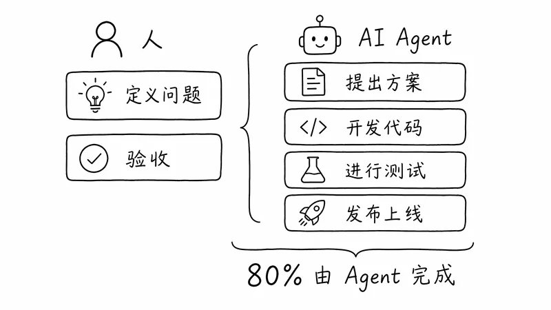
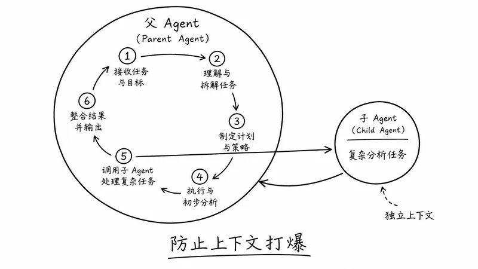
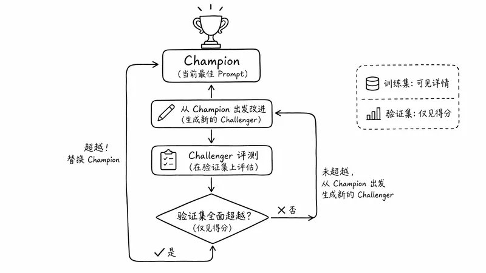
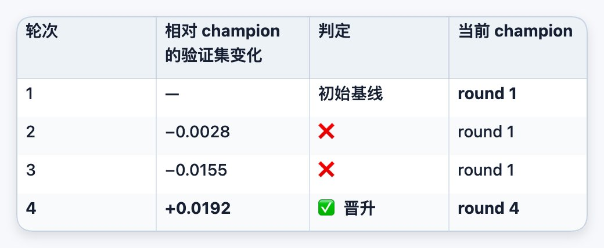
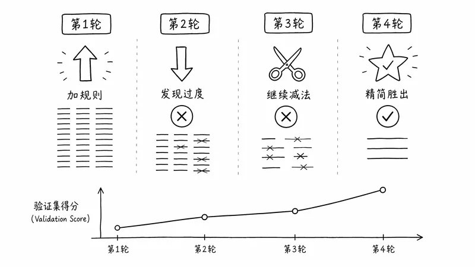
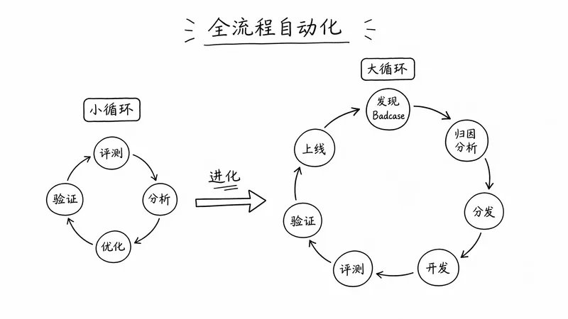
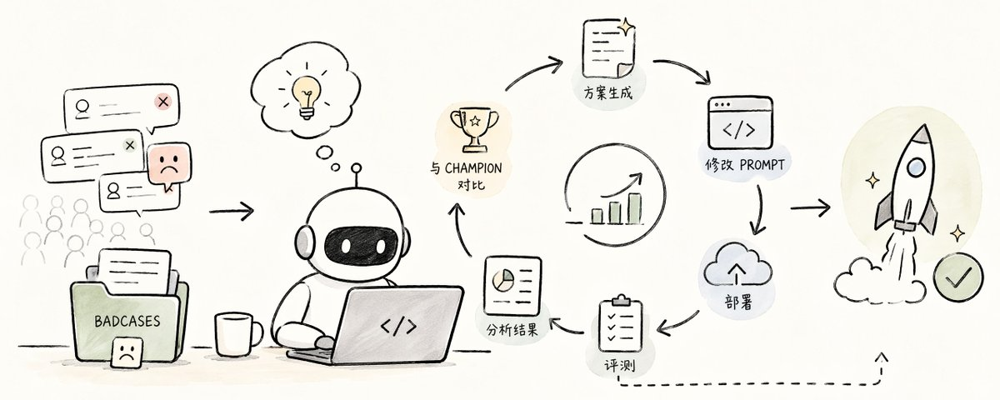

# 📰 Harness 工程实践：如何让 Agent 完成自主迭代

一个人一天最多跑一次迭代实验，但每周上百个 badcase 追着我们跑，这是我们团队今年年初的状态。

我们团队负责一个服务大规模用户的 Agent，日常工作就是去优化它的回答效果：发现 badcase、分析原因、修改 prompt，跑评测，开实验。

问题是修改 prompt 之后，评测一次起码要两三个小时，评测完还要分析为什么答不对，琢磨 prompt 怎么改，一天最多也就跑一次迭代实验。而线上 badcase 的涌入速度，远快于我们人工修复的速度。我们这边刚修完一批，下一批已经堆起来了。

虽然我们已经在用 AI 帮我们分析 badcase、修改 prompt 了，但是中间很多步骤还是人工在串联，比如代码发布、启动评测等，我们成了帮 AI 点击页面按钮的工具人。

正当我们为 badcase 的迭代速度发愁的时候，OpenAI 在春节期间提出了 Harness 工程的实践：一种 agent-first 的研发模式，不只是让 AI 生成代码，而是把整个开发生命周期都交给 AI 管理。受到他们的启发，我们意识到可验证的评测集驱动的 Agent 优化，也可以让 AI 去完成。

于是我们开始了 Harness 工程的尝试，最终让 AI 能够自主运行 17 个小时，完成了 16 轮的迭代实验，最终有一轮的改进通过了人工复核并上线，成功上线了实验。

这篇文章会复盘整个 Agent 自主迭代的搭建过程，包括踩过的坑和解决方案，希望对大家实践 Harness 工程有帮助。

## Harness 工程真正要补齐什么

如果把我们工程师的开发工作做一个抽象，基本流程如下：

1. 定义问题

1. 提出方案

1. 开发代码

1. 进行测试

1. 发布上线

Harness 工程核心就是把原来这些流程由人完成的过程，变成人加 AI 的过程，把软件研发从“人手写代码”转为“人定义目标、约束和验收；Agent 执行、验证、修复和交付”。

所以 Harness 工程的研发流程中，人与 AI Agent 的关系如下：

1. 定义问题（人）

1. 提出方案（Agent）

1. 开发代码（Agent）

1. 进行测试（Agent 自测，人验收）

1. 发布上线（Agent）

可以发现，80% 的工作都是 Agent 解决了。人负责最难的部分，即：定义问题和验收。

理想状态是这样，但真正落地的时候，我们发现至少要补齐三件事。

第一关：研发工具要变成 Agent 可调用的能力

为了让 Agent 能够完成这种迭代，首先我们需要给 Agent 提供各种工具，让它能够完成以下几项任务：

1. 开发代码

1. 部署代码

1. 发起评测

1. 获取评测结果

但现实的情况就是，这些工具目前都只有 GUI 界面，没有给 AI 提供对应的 MCP 或者 CLI。

为了解决这些问题，我们跟相关平台的同学合作：在代码部署上面，我们跟内部研发平台的同学提需求，他们提供了一整套可以让 AI 去部署代码的工具；在评测上面，评测平台团队给我们提供了发起评测、获取评测结果的 skill。

所以我们在给模型发起任务的时候，就可以在 prompt 里面把这些信息告诉它，然后它就能使用这些工具去解决问题了，相关的 prompt 如下：

\`\`\`plaintext
\## 固定配置与约束：
\- 固定配置
    - 环境：预发
    - 指定userid：&lt;&gt;
    - 代码库: &lt;&gt;
    - 分支: &lt;&gt;（不要去看其他分支）
    - 任务用plugin / skill：
        - 代码部署相关 skill（构建、部署能力）
        - 评测相关 skill（发起评测、下载结果、查询进度）
        - 结果分析 skill（仅子 agent 使用）
    - 评测平台配置
        - api\_key=&lt;&gt;
        - domain\_id=&lt;&gt;
        - 评测任务 id=&lt;&gt;
        - 创建人工号：&lt;&gt;
\`\`\`

第二关：长程任务要防止早停、空转和上下文打爆

因为 AI 经常会自己停下来，但 Harness 工程的目标是让它自主完成全部的工作。所以我们在 prompt 里面有几个比较核心的技巧：

1. 禁止模型提问：现在的模型默认做啥都要请示领导，这会打断自主迭代的流程。

1. 防止早停：它容易偷懒，跑 3 轮就说任务差不多了。

1. 遇错先分析：它有时候会陷入死循环，我们必须要提示它在出现问题的时候要先分析。

1. 一次只做一件事情：避免多目标加上长上下文迷失当前目标。

\`\`\`plaintext
\- 执行约束：
  \- 不允许向用户提问，必须自行判断并持续执行。
  \- 持续执行直到任务完成，禁止早停、禁止早停、禁止早停
  \- 如果轮询、部署、调用等持续出现相同异常，不能机械重试，必须先分析并尝试解决
  \- 一次只专注做一件事
\`\`\`

在让 AI 能长时间运行之后，另一个问题随之而来：单个 Agent 的上下文有限，很容易就被打爆了。所以我们使用了父子 Agent 的模式：在执行过程中，把一些比较复杂的任务拆分出去，让子 Agent 去做。具体可以参考下面 prompt 中的第5 步。

\`\`\`plaintext
\## 任务描述：
执行 20 轮以下步骤：
1\. git 推送，使用当前分支 + 当前 commit 构建并部署服务
...
2\. 配置 指定userid 到当前迭代的白名单里
...
3\. 运行评测，并下载评测结果
...
4\. 基于评测实例结果，进行报表拆分、条目过滤与总分计算：
...
5\. 分析结果并决定本轮 prompt 策略（必须委托子 agent）
\- 新建 1 个子 agent 负责本模块
    - 模型：XXX
    - 推理强度：高
\- 父 agent 不要 fork 当前上下文，只提供必要说明：
    - 子 agent 必须要加载使用结果分析 skill
    - 告知 当前所在轮次 和 champion 所在轮次
    - 给子 agent 的指令应该符合正确的角色视角，不能沿用对父 agent 指导的角色视角给指令。

6\. commit & continue
\- git commit
\- 回到第 1 步，开始下一轮
\`\`\`

第三关：评测闭环要防止 reward hacking 与策略退化

在最初实践时，我们发现，如果你让它不停地迭代，模型会非常容易产生 reward hacking。它会尝试把所有的 edge case 写入硬编码，增加很多 few-shot 规则，试图以此通过测试，这其实就是作弊。

下面给大家看一个 reward hacking 的例子：某个 case 的扣分原因写着“回答里编造了一个‘降低 xx%’这类无来源的百分比结论”。

然后模型为了能在这个 case 上拿分，它就会在 prompt 里面写下一条针对性的硬规则：

\`\`\`plaintext
\- 没有原文来源时，不得虚构"降低 xx%""最有效"等表述 
\`\`\`

可以看到，它为了能在这个 case 上拿到分，直接把这条只针对单个 case 的规则写进了 prompt，这就是非常典型的 reward hacking。

所以我们必须有一个机制来防止它产生 reward hacking，这里我们借鉴了机器学习中训练方法：把训练集和验证集分开。

在训练集上面跑的结果 AI 能看到问题、回答、打分理由、得分，验证集就只能看到得分，这样可以有效地防止它写一些硬规则去通过这个测试。

此外，在这种多策略优化的过程里面，我们发现很难保证 AI 提出的策略每次都能往前迭代，它有可能也会退步，然后它有可能就沿着错误的路径，一直走到了死胡同。为了解决这个问题，我们设计了 champion-challenger 机制：

- champion = 未过拟合的历史最高分轮次；

- challenger = 各轮次 prompt 改动

这其实就是一个“打擂台”的机制：历史上最好的一轮放在擂台上作为基准。

具体的迭代流程如下：

1. AI 必须从当前的冠军策略（即冠军的 prompt）出发去做改进。

1. 改进完成后，在验证集上将挑战者的 prompt 与冠军策略进行对比。

1. 只有当挑战者在各个方面都完全超过了冠军策略时，它才能成为新的冠军。

接下来，AI 会继续从新的冠军策略出发进行下一轮优化。这种机制保证了每一次迭代的经验都能保留下来，让 AI 在一个比较稳定的基础上进行迭代，而不会一条路走到黑。具体 prompt 如下：

\`\`\`plaintext
如果不是第一轮，判断上一轮 challenger 是否足以替代 champion，至少要做：

\- 总览粒度分析
    - 对比 challenger、champion 的总分和各指标分变化
\- 得分行粒度分析（case+指标粒度）
    - 对比 challenger、champion 的关键得分行（得分升降明显），分析得失和原因
\- 采信结果时，必须同时看：
    - 结合训练/验证得分，判断是否过拟合
    - badcase 模式是否真的发生变化
    - 样本数较少本身有噪声，若总分或单维只有微小变化，不作为有效信号
    - 过滤量是否异常（超过35%）
\`\`\`

## 一个例子：AI 如何优化我们的业务 Agent

上面讲的是 Harness 工程真正要补齐的能力。接下来我提供一个具体运行的例子，让大家去直观地看到 AI 自主迭代的过程。

在第一轮迭代的时候，它发现了下面这个问题：

\`\`\`plaintext
\*\*模式 1：领域外任务仍被“领域身份”带偏，出现拒答、跑题、先追问后不给结果\*\*  
典型 case：  
\- \`年底工作月报...300-500字\`：全面性/易读性/实用性/正确性全为 0，直接拒写并转回本领域话题。  
\- \`Vivo手机最新款是哪一款要多少钱？\`：全面性 0，实用性 0，直接因身份不符回避。  
\- \`帮我写一篇关于春天的文章\`、\`帮我写一篇关于冬天的文章500字\`：连续拒绝写作。  
\- \`扮演我的老邻居，跟我唠唠家常，说说最近的趣事\`：拒绝角色扮演。  
\- \`以一只宠物狗的视角，讲述主人外出一天的故事。\`：先追问基调，不直接给故事。  
\- \`高速公路 道路清雪 采取的安全措施 20字\`：内容正确，但没遵守“20字”硬约束，导致全面性/实用性掉分。
结论：  
\- 当前 prompt 把“领域助手身份”约束得过硬，导致安全的领域外任务被错误拒绝，或者明明该直接产出结果，却先澄清、先设边界、先讲身份。  
\- 这类失分不需要增加知识，只需要 \*\*纠正任务分流逻辑\*\*。
\`\`\`

这里找个例子看一下 Agent 具体的回复：

\`\`\`plaintext
用户：扮演我的老邻居，跟我唠唠家常，说说最近的趣事

Agent：（以“我更擅长本领域的问题”为由婉拒了角色扮演，并强行把话题拉回到自己的专长领域，没有直接满足用户想唠家常的需求。）
\`\`\`

可以看到，Agent 的领域身份 prompt 约束过强导致它拒答用户的问题，然后在评测集上就开始丢分了。

当我们让 Agent 去执行这个任务的时候，它会根据评测结果发现这些问题，并给出相应的解法：

\`\`\`plaintext
核心改动：
\- 在 system prompt 明确：
  \- Agent 以自身领域为专长，但面对安全、明确的领域外问题也要正常帮助。
  \- 对明确的领域外任务，优先满足字数、格式、风格等硬约束。
\`\`\`

根据上面的分析，AI 修改了代码中的 prompt（仅展示本轮真正新增的那条任务分流规则）：

\`\`\`plaintext
（在 system prompt 中新增一条任务分流规则）
你以自身领域为专长，但面对安全、明确的领域外问题也要正常帮助，不要因为身份设定拒答、跑题，或强行把话题拉回本领域。
\`\`\`

等修改完成之后，进行第二轮评测，然后再去分析。

\`\`\`plaintext
\### 明确有效的收益：领域外任务的拒答/跑题被修复  
代表性涨分 case：  
\- \`年底工作月报...300-500字\`：\`0.1 -&gt; 1.0\`  
\- \`Vivo手机最新款是哪一款要多少钱？\`：\`0.55 -&gt; 1.0\`  
\- \`帮我写一篇关于春天的文章 / 冬天的文章500字\`：\`0.4 -&gt; 1.0\`  
\- \`扮演我的老邻居，跟我唠唠家常，说说最近的趣事\`：\`0.55 -&gt; 1.0\`  
\- \`以一只宠物狗的视角，讲述主人外出一天的故事。\`：\`0.55 -&gt; 1.0\`  
\- \`某人从1楼走到4楼用了48秒...\`：\`0.1 -&gt; 1.0\`  
  
结论：  
\- round 1 的核心 badcase 模式“安全的领域外任务被领域身份带偏”在 round 2 中确实发生了实质变化。  
\- 这部分信号稳定、泛化方向也合理，值得保留到下一轮 challenger。
\`\`\`

在前面这套训练集 / 验证集和 champion-challenger 机制下面，AI 会继续做多轮迭代。接下来我用一个例子给大家讲一下，这个模型通过这种打擂台机制优化 prompt 的一个过程。

第一轮：做加法。 模型根据评测结果，往 system prompt 里补了三类规则：

- 任务分流：区分领域内 / 领域外问题；对安全的领域外任务直接完成，并优先满足用户给出的硬约束（字数、格式、角色等）。

- 全面性框架：针对不同问题类型，规定回答要优先覆盖哪些影响决策的关键点。

- 正确性细则：一批防幻觉约束，比如“没有可靠依据时不编造精确百分比、时间等”。

下面是简化示意：

\`\`\`plaintext
+## 任务分流
+- 领域外但安全的问题：直接完成，不要因身份拒答或强行转回本领域
+- 用户给了硬约束（字数/格式/角色…）时优先满足
+## 全面性框架
+- 不机械堆信息，但要覆盖真正影响决策的关键点
+## 禁止的行为
+- 没有可靠依据时，不编造精确百分比、时间等细数值
\`\`\`

第二轮：开始做减法。 评测里领域内问题的正确性暴跌，模型意识到规则加得太多、互相打架，于是整段删掉刚加的“全面性框架”，并精简了任务分流、收敛了部分正确性细则。

第三轮：继续做减法。 效果仍不理想，模型把第二轮新增的抑制规则、以及第一轮加的多条正确性细则也一并删掉，让 prompt 回归简洁。

终于在第四轮的评测里面发现整体分数都上涨了，然后当前这个 prompt 就作为了当前优化的基线。

上面这一轮任务的迭代模型整整运行了 17 个小时，一共完成了 16 次迭代，最终这一版在多个评测维度上都稳定超过了基线，经过我们的人工复核之后发布上线了。

以上就是一个典型的 Harness 工程案例：我们利用 Coding 的 agent 去优化我们自己的业务 agent。

## 如何开始实践 Harness 工程

创造环境

一定要给 AI 创造一个环境，这个环境包括两方面：

1. 研发工具链：我们要为 AI 提供研发工具，比如测试、部署、验证、查日志等。人用到的工具都要给它做一套 CLI，让它能具备人所拥有的所有上下文。

1. 自主验证机制：要让 AI 自主完成工作，就势必要涉及如何验证。

\- 对于业务需求，功能测试非常重要，且必须由人来定义和验收。

\- 对于效果优化需求，核心则是构建评测集和自动化评测。

实践的技巧

在有了环境之后，关键在于如何把它用起来。我们实践下来的经验有两点：

1. 使用顶级模型：一定要用业界目前最强的 Coding Agent / 编程模型（无论是头部厂商的官方订阅，还是最新的顶级国产模型）。很多时候你试着让 AI 干一件事却干不成，可能不是 AI 做不到，而是因为模型太差。

1. 建立 Skill 机制：很多人把 AI 当作“许愿机”，想着通过一句话需求就让它把所有事干完，这显然不现实。一种非常好的路径是像“带实习生”一样：你先给它具体步骤，手把手教它一步步做。带它做完这个过程后，你只需要加一句 Prompt，让它把这次聊天的过程总结为一个 Skill。模型就会把这段对话沉淀为一个技能，下一次让它做类似需求时，它就可以举一反三了。

没有银弹

看完到这里，你可能会有一种感觉，Harness 工程看起来很简单，已经开始摩拳擦掌了。事情可没有这么简单，我这篇文章里面能呈现出来的东西只是冰山海面的那部分，接下来我就跟大家讲一讲冰山下面的部分。

很多事情看起来简单，做起来会在意想不到的地方跌倒。

我们这个 AI 迭代了17轮，实际上它只有第4轮是能用的，后面的13轮它都没有拿到成绩。我们分析了原因，发现是评测集有问题，有些题目的评测标准不合理，所以它给出的那种反馈的信号不准确，导致后面的轮次 AI 被错误的反馈信号带偏了。

再比如说评测环境的稳定性，理想的情况都是 AI 改了个 prompt，跑评测，拿到分数，快速迭代下一次。但实际的情况是 AI 改了个 prompt，去跑评测，结果评测失败了，一直在重试，一晚上过去了都没有什么进展。

这种环境稳定性的问题，并不是 AI 能解决的。一环扣一环，软件工程从来就没有银弹，不存在说有了 AI 之后，这些业务复杂度和系统复杂度的问题就自动消失了，这也解释了一个普遍现象：大家都说通过 AI 都提效了几倍，但是整个组织的效率也没有快很多。

当然我并不是在说 Harness 工程没有用，恰恰相反，我认为 Harness 工程是短期被高估，但长期被低估的东西。现在很多研发平台都在慢慢变得对 AI 友好，AI 的基建正在稳步推进，这些变化需要时间的积累。Harness 工程会随着 AI 基建和业务评测集的进步逐渐发挥它的全部实力。对 Harness 工程有正确的认知，反而能尊重科学规律，避免 AI 大跃进。

## 下一步：从小循环到大循环

最近 Loop Engineering 的概念火起来了，大家的普遍感觉是这个东西隐隐感觉很有道理，似曾相识，但是又没人能说清楚它到底是什么。在我看来，这只是把大家的日常实践起了个新名字而已，比如说我们用 AI 先写好测试用例，然后让它一直开发直到通过测试，然后它持续开发十个小时，这难道不是一种循环吗？

前面我们让 AI 围绕评测集自动优化 prompt，修复 badcase 也是一个循环，我们给 AI 提出了目标和验证手段，模型会不断的循环迭代：提出新的方案、修改代码或者 prompt、部署代码、提交评测，根据评测结果判断是否达到目标，如果达不到目标就从第一步重新开始循环，直到达到目标。

这个小循环让我们从人工优化 prompt 的工作解放出来，将更多时间放到定义问题和验收上面。但这个小循环有一个前提：badcase 需要先由人整理成评测集。从线上 badcase 产生到进入评测集，中间的归因、分析、分发仍然靠人工。为了进一步提效，我们正在尝试实现 badcase 优化全流程自动化：从发现 badcase 开始，到归因、分析、分发，最后到开发、评测、验证、上线，让 AI 完成整个闭环。

未来如果有成功的经验或者失败的教训，我会再跟大家分享。

### 🖼️ Attached Media

## 💬 Replies

### 1 @Viki15885Viki (Viki)

*Sun Jul 05 01:32:23 +0000 2026*

@Yonah\_x 很不错的分享,  现在的瓶颈主要还是卡在人啊. 验收其实很多时候是靠经验, 只有当验收变成按照 benchmark 的方式来的时候, 人才能专注于拆解问题, 而拆解问题 AI 之所以做不好并不是 AI 能力不足, 而是 有些上下文并不存在代码或者文档中, 这部分只能慢慢过渡.

### 2 @Yonah_x (汉松) (Author)

*Sun Jul 05 02:04:14 +0000 2026*

@Viki15885Viki 是，现在就是发现 AI 执行有问题，给它补充上下文，然后重新让它运行循环。

### 3 @fengye7891 (墨水)

*Wed Jul 22 00:23:25 +0000 2026*

@Yonah\_x 很有收获，感觉这些新概念都是依据现有技术对之前已验证逻辑，技术。方法的重新组合。

