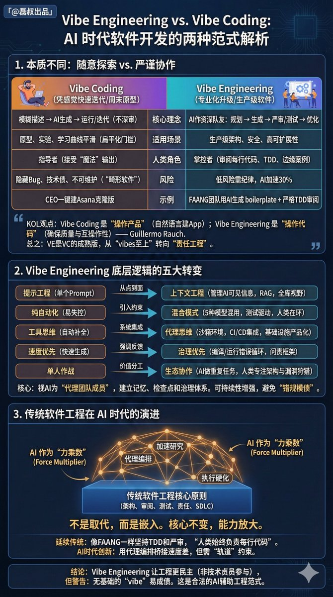

周末看了个 OpenAI 论坛的内部分享，叫 Vibe Engineering。

内容不少，我整理了分享的全文放到墨问里，差不多 9100 字，还有实操项目的 github 仓库地址，可以先收藏再看：

Web 版本：[note.mowen.cn/detail/6gMtxCP…](https://note.mowen.cn/detail/6gMtxCP_NhLJyOZnK6AQ_)

什么是 Vibe Engineering？AI 不只是“帮你写代码”，而是参与到工程的全链路里，帮你更快做出能上线、能维护、能扩展的生产级软件。前提是：每一行要发到生产环境的代码，仍然必须由人来负责。他们把这种用法叫做 “Vibe Engineering”。

它和过去一年流行的 “Vibe Coding” 最大的不同是，从“写出一段能跑的代码”升级为“完成一次真正的工程交付”。

很多 AI 编程工具最近都在做这方面的变化。

为了讲清楚这件事，OpenAI 的工程师 Aaron Friel 做了一个硬核 demo：用 Rust 重写一个成熟的 Kotlin 开源项目，并且做到了和原项目 100% 兼容。

任务从一个空目录开始，除了提示词什么都没有。使用传统做法，这种重写加验证可能要几周时间；而在他的实验里，Codex 能够连续工作十几个小时，把脚手架、测试体系、对照验证、文档都推进到一个可以跑通 CI 的程度。

这里的关键不在于“模型写了多少行”，而是它如何“像工程师一样工作”。

Friel 给 Codex 的不是一串小任务，而是一套长期目标和约束，并要求它维护一个持续更新的计划文档（exec plan）。更有意思的是，Codex 会自动拉起子 Agent：一个像“Watch Dog”一样不断提醒不要偏离整体目标；另外一些子 Agent 去并行做研究，补齐背景知识，甚至会主动 clone 仓库、对照实现等等。

分享里讲了 Vibe Engineering 的三个方法论：

1、让 AI 写可读的产物，而不只是可运行的代码。

2、并行化。Codex 提供的 “Best of N” 思路很像把一个问题同时交给四个候选工程师：让它们走不同路线，产出不同方案，然后人来选更符合目标、也更符合品味的那个。

3、把“技术能力”外溢到工程团队之外。在 OpenAI，Codex 也被用来帮助产品、销售、现场支持等非工程角色理解代码库：当他们想知道一个功能怎么工作，先问 Codex。

这套东西应该对 AI 改进研发团队的效率有很大启发，推荐一下。

## 💬 Replies

### 1 @kk23232f (kk2323)

*Sun Dec 14 12:40:55 +0000 2025*

@sagacity 文中提到的prompt并没有发布到github的repo中，并且运行所用到的子agent功能似乎是fork codex魔改的，只能看个大概的思路

### 2 @AgiRay1015 (AI磊叔)

*Tue Dec 16 02:39:21 +0000 2025*

@sagacity 这概念抓到本质了。

AI不是替代工程师，而是放大能力。

Vibe Engineering听起来轻松，实则强调责任和结构，正好平衡了AI hype和工程现实。

不过我的疑问是：
1）和 vibe coding 的本质不同 
2）它自身有哪些底层逻辑的变化 
3）是否就是传统软件工程在 ai 时代的应用

写不了长文😆我想的答案⬇️x

### 3 @dankopeng (Danko Peng)

*Mon Dec 15 19:41:08 +0000 2025*

@sagacity Thanks for sharing 👍👍

### 4 @ggstyop (Gary tt)

*Sun Dec 14 11:08:21 +0000 2025*

@sagacity @readwise save

