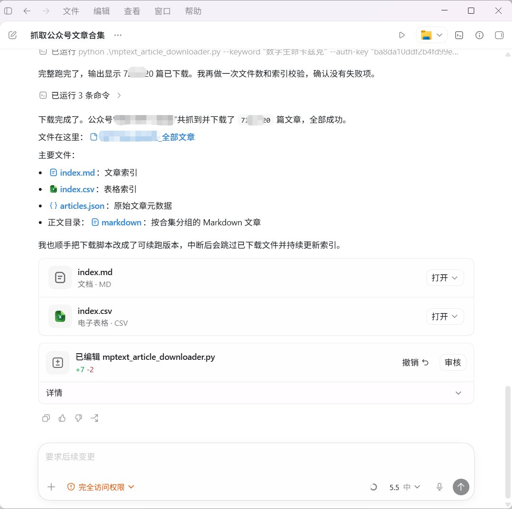
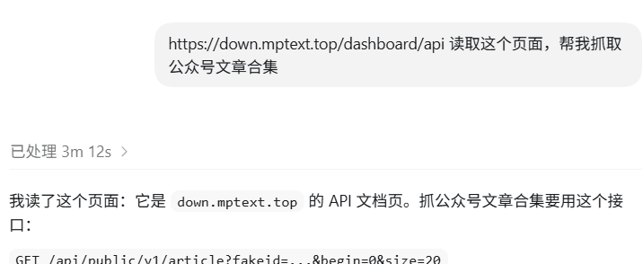

太强了！批量下载七百多篇文章，只用了十来分钟！
而且自动按合集分类！
每篇文章的文字和图片都在！

用起来超简单！没有门槛。
[down.mptext.top/dashboard/api](https://down.mptext.top/dashboard/api)
直接把链接丢给Codex，然后获取免费的api key，然后让Codex下载xx公众号的全部文章。 

## 💬 Replies

### 1 @aigedade (那不能撕)

*Mon May 18 09:51:34 +0000 2026*

@yyyole 请教大佬：是直接把
[down.mptext.top/dashboard/api](https://down.mptext.top/dashboard/api)丢给codex吗？

### 2 @yyyole (沐阳) (Author)

*Mon May 18 09:53:07 +0000 2026*

@aigedade 没错，接下来就是把api给他，告诉他下载哪个公众号的文章。（网站需要登录） 

### 3 @ajs6888 (安叫兽|Bird🕊️ 🔶 BNB)

*Mon May 18 15:19:03 +0000 2026*

@yyyole 这速度有点离谱，分类也省太多事了
[x.com/ajs6888/status…](https://x.com/ajs6888/status/2056343936067948546?s=20)

### 4 @LoongLab (LoongLab 🐉)

*Tue May 19 15:02:31 +0000 2026*

@yyyole 厉害，这效率绝了，再喂给AI生成工作流如何？

### 5 @gulingpake (不是李白)

*Wed May 20 03:54:38 +0000 2026*

@yyyole 用了有段时间了 好用 但是apikey老是过期 设置的自动任务就断了，再用opencli兜底

### 6 @iBigQiang (强子手记)

*Mon May 18 17:10:09 +0000 2026*

@yyyole 公众号的数据茧房就这么被捅穿了，下一步该有人拿它训练自己的风格克隆skill了吧

### 7 @blanplan (BlanPlan)

*Tue May 19 02:45:17 +0000 2026*

@yyyole Codex 当一次性爬虫用，是长尾工具消亡的开端。以前每个开发者都自己写过一堆一次性脚本，从此 agent 自己拆需求、跟着实现、跑完即丢。这套工作流解决的是开发者不再为一次性任务造工具的认知负担。反爬触发频率高是代价，每次 5 美金不到能接受。

### 8 @yuqianyi1001 (qianyi1001)

*Mon May 18 18:58:51 +0000 2026*

@yyyole 不需要whitelist ip？

### 9 @Cyan_Aesthetics (xixi | AI 光影诗语)

*Mon May 18 12:30:40 +0000 2026*

@yyyole 这么方便，下来就去codex试试

### 10 @mi_fan14398 (饭米粒（程序员小饭）)

*Wed May 20 01:45:58 +0000 2026*

@yyyole 这个看起来很不错

