# 📰 Obsidian零基础教程

## 为什么最终选择Obsidian

在尝试过众多笔记工具后，我最终选择了Obsidian，主要基于以下核心优势：

数据安全与本地优先

- 所有笔记以Markdown格式存储在本地，数据完全自主可控

- 可通过GitHub实现安全的云端同步

极致性能与稳定性

- 界面流畅无卡顿，支持完全离线使用

- 自动保存，内容零丢失

强大的扩展能力

- 丰富的插件生态，可自由定制功能

- 完美支持AI工具集成

专业的Markdown支持

- 双向链接构建知识图谱，笔记间智能关联

- 完整支持技术文档所需的各类元素

接下来我会教大家如何使用obsidian，保证是最全最详细的教程，并且全部免费

## 如何使用

下载安装

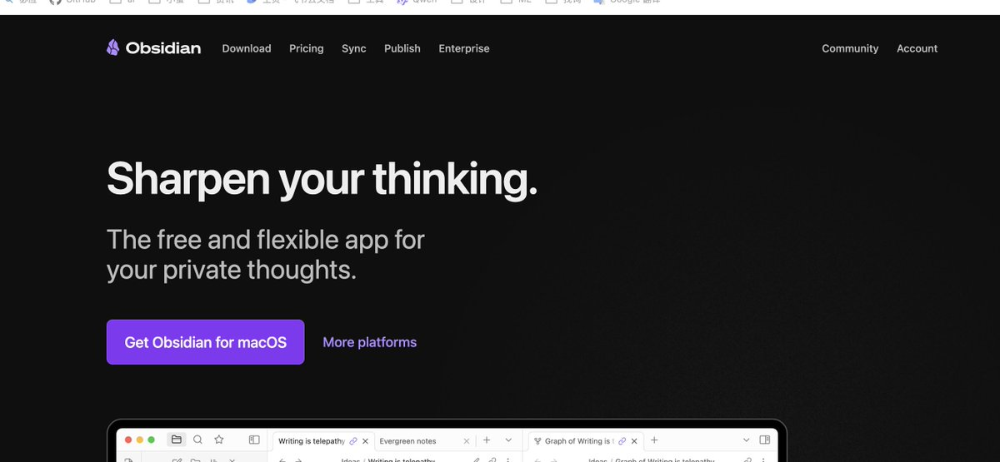

打开官网
https://obsidian.md/
根据自己的系统下载对应的版本

新建笔记仓库
在下载过程中我们打开github，没有的伙伴可以注册一个，点击New Repository

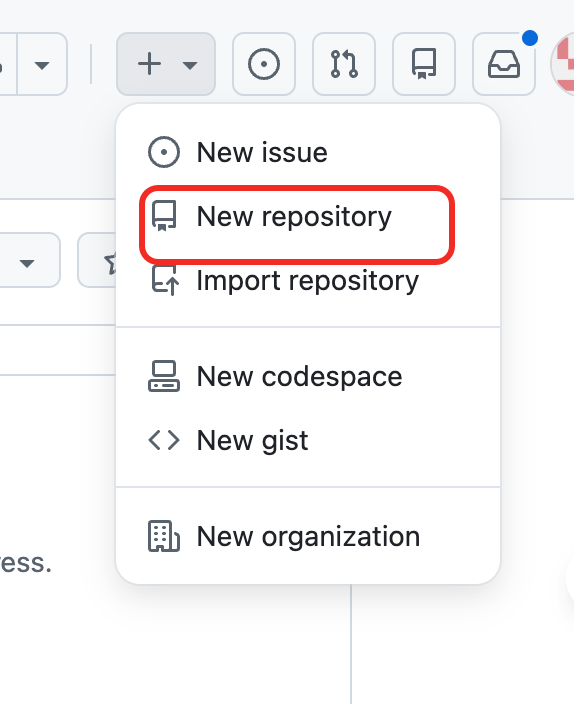

创建完以后，将链接复制在本地找个文件夹，执行以下命令
\`git clone  链接地址\`

接下来添加一个 \`.gitgnore\`文件，在里面输入以下内容，防止将一些不想上传的也放进去了

> .obsidian/workspace.json
.obsidian/workspace-mobile.json

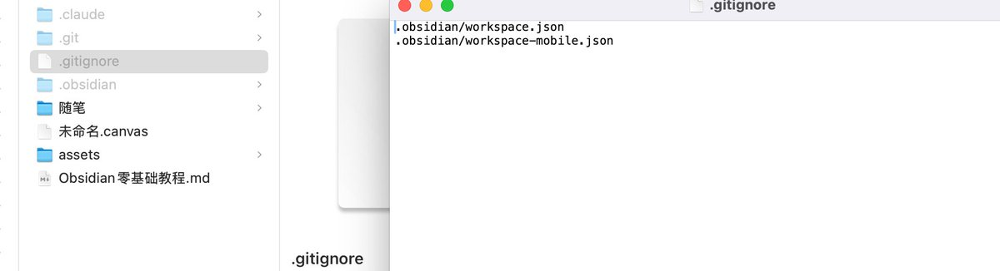

打开本地仓库
这时候如果已经下载安装好了，我们打开刚刚clone下来的文件夹

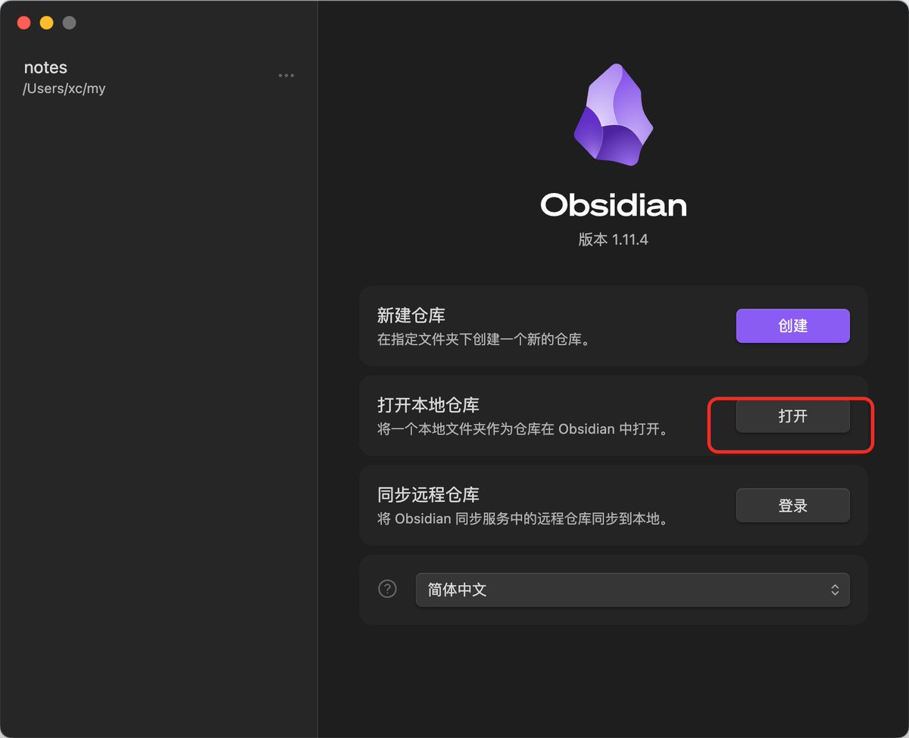

配置git同步
我们点击第三方插件，然后先将安全模型关闭，然后点击浏览，在搜索框输入git，下载第一个就可以

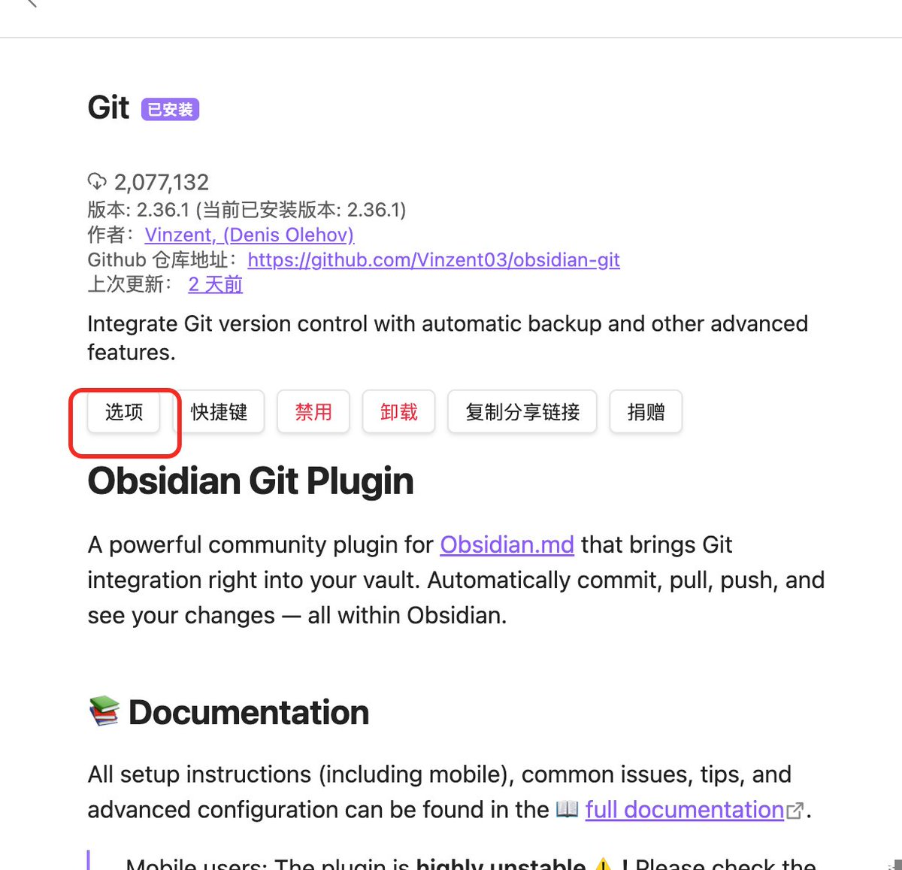

在选项这里，注意配置更新时间 然后打开下面标识的按钮

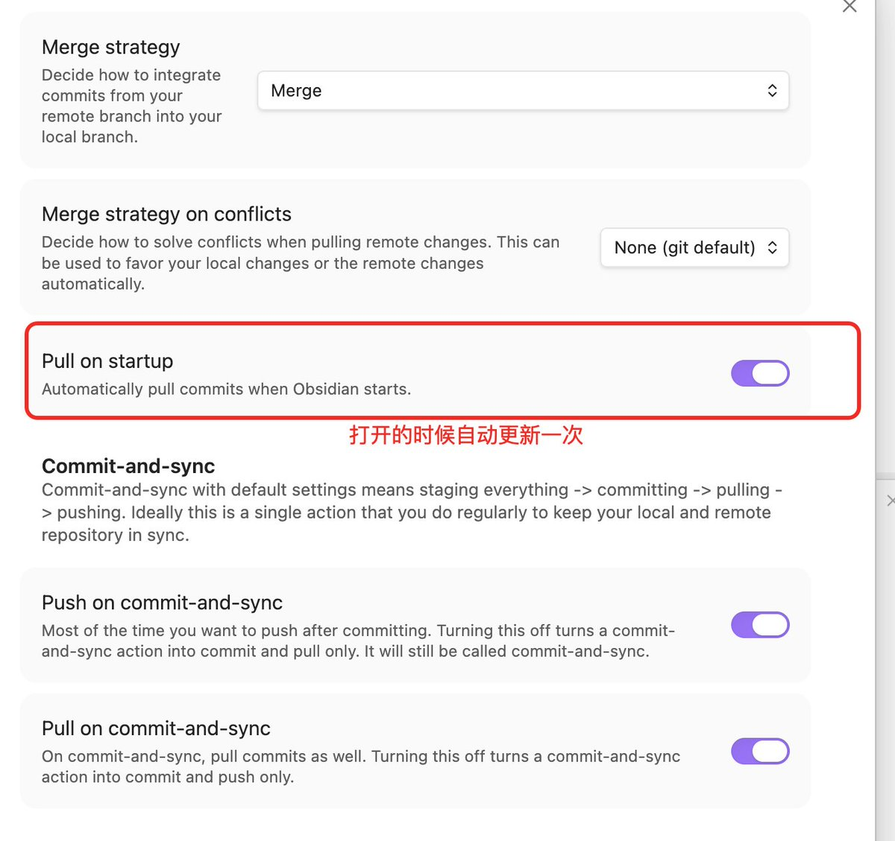

这样我们进行修改以后，再右边就会有黑框，告诉你 pull

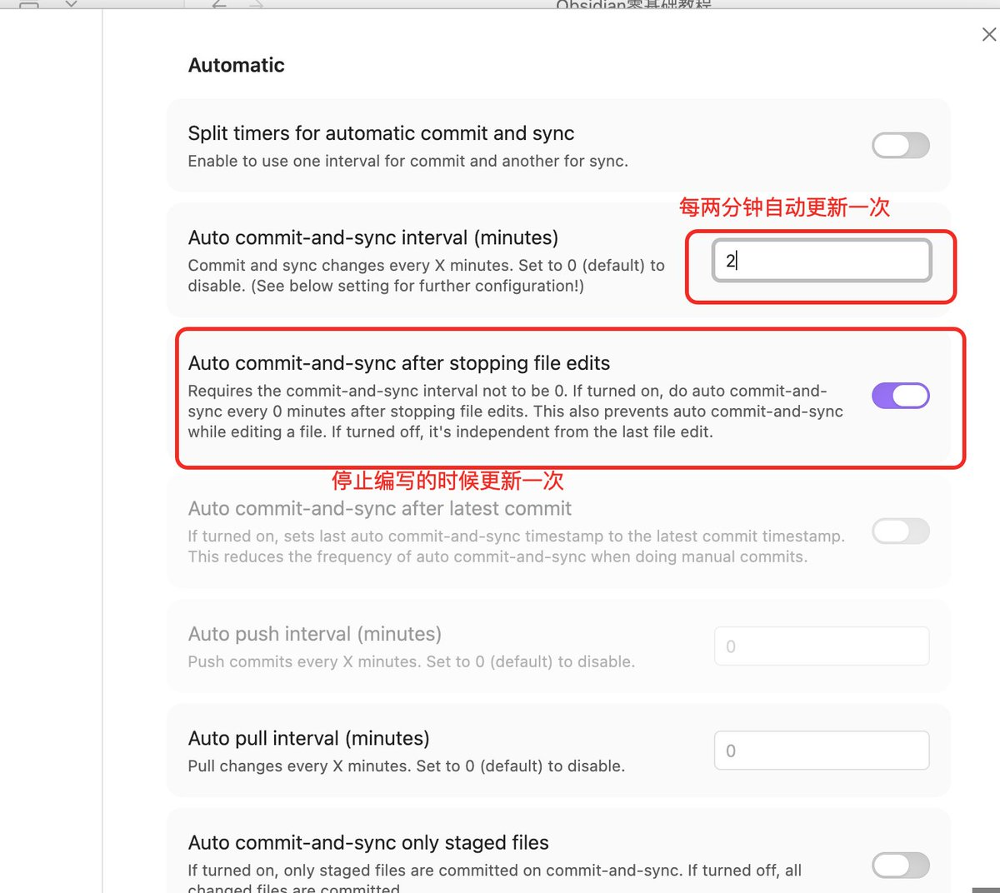

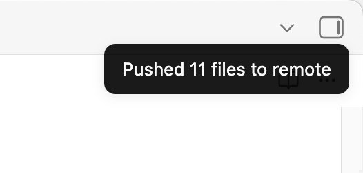

图片插件

我们在写文档的时候必定会使用很多图片，默认的图片，不是按照md语法渲染的，不好用，然后图片放置也很随意，我们需要安装下面这个插件

插件市场搜索 Custom attachment 安装然后启动

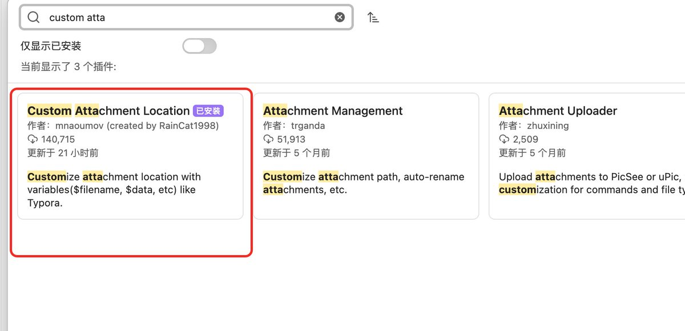

点击选项需要配置一下几个东西

- Markdown URL 格式

> assets/${noteFileName}/${generatedAttachmentFileName}

还有按照我图片的配置都选一下，要和我保持一致

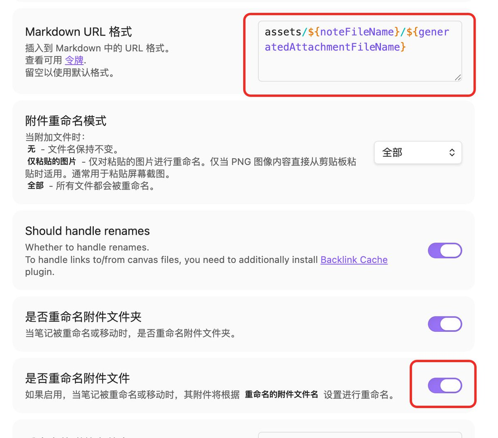

点击文件与链接也需要改下面两个

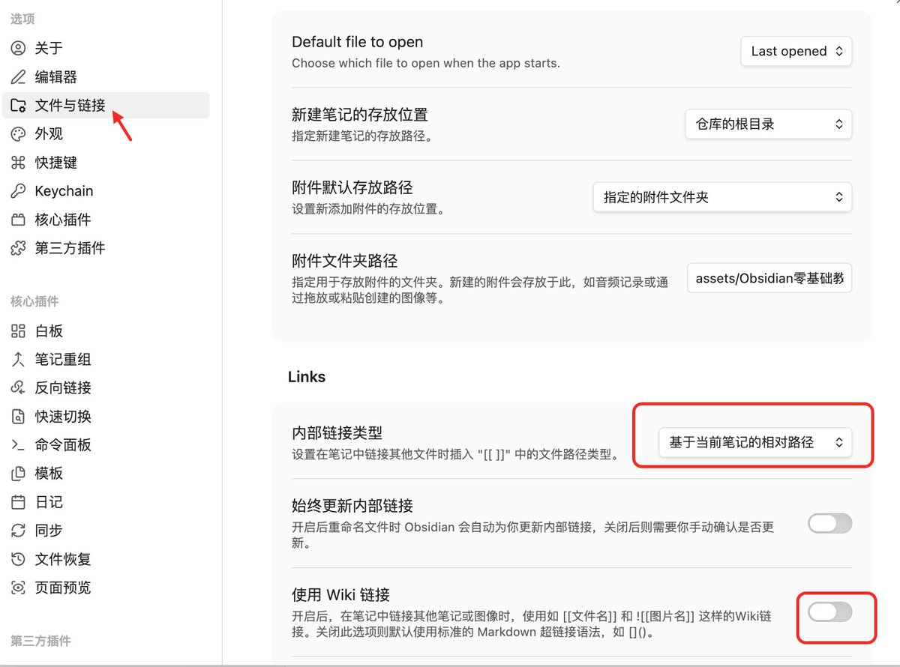

这时候我们将图片复制过来就可以看到路径了，我们可以通过修改\`\[\]\` 内的数字改变图片尺寸

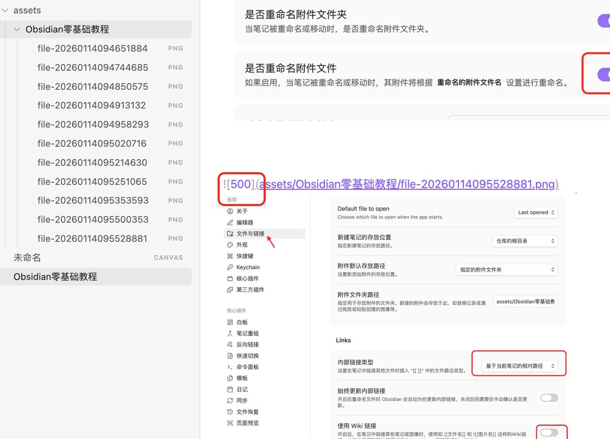

我们已经完成了基础配置，接下来我带大家学习一下md语法

## Markdown语法基础

Markdown是一种轻量级标记语言，在Obsidian中用于排版笔记内容。以下是常用的Markdown语法：

标题分级

使用\`#\`符号创建不同级别的标题，\`#\`的数量决定标题级别：

> \# 一级标题
\## 二级标题
\### 三级标题
\#### 四级标题

文本格式化

加粗文本：使用两个星号包裹文字

> 这是加粗文字

斜体文本：使用一个星号包裹文字

> 这是斜体文字

==高亮文本==：使用两个等号包裹文字

> ==这是高亮文字==

\~\~删除线\~\~：使用两个波浪号包裹文字

> \~\~这是删除线文字\~\~

列表与任务管理

无序列表：使用\`-\`或\`\*\`开头

> \- 列表项1
\- 列表项2
  \- 子列表项

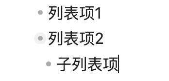

有序列表：使用数字加点号开头

> 1\. 第一项
2\. 第二项
3\. 第三项

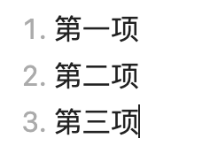

任务列表：使用\`- \[ \]\`创建待办事项

> \- \[x\] 已完成的任务
\- \[ \] 未完成的任务
\- \[ \] 待处理的任务

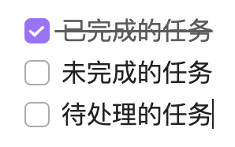

代码块

行内代码：使用反引号包裹

> 这是\`代码示例\`的效果

代码块：使用三个反引号包裹，可指定语言实现语法高亮

def hello\_world():
    print("Hello, World!")

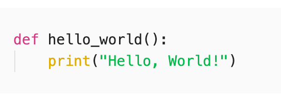

表格

使用竖线和横线创建表格：

> \| 列标题1 \| 列标题2 \| 列标题3 \|
\|---------\|---------\|---------\|
\| 内容1   \| 内容2   \| 内容3   \|
\| 内容4   \| 内容5   \| 内容6   \|

效果：

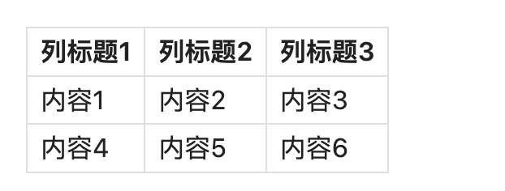

链接与图片

链接：

\[显示文字\](https://example.com)

> [显示文字](https://example.com/)

图片：

!\[图片描述\](图片链接)

> !图片描述

## AI结合Obsidian使用方式

Obsidian的纯文本架构天然适配AI工具，可以极大提升笔记管理效率：

AI自动化笔记管理

通过AI工具（如Gemini CLI）可以实现：

- 自动创建笔记：AI根据指令自动生成笔记文件和文件夹结构

- 生成内容大纲：输入主题，AI自动生成详细的文章大纲和框架

- 批量整理笔记：AI可以批量处理零散内容，整理为结构化的笔记

示例操作：

> \# 使用claude code 生成笔记
claude "帮我基于晴天写一首诗放到随笔里面"

AI会自动创建文件,然后写入到随笔里。

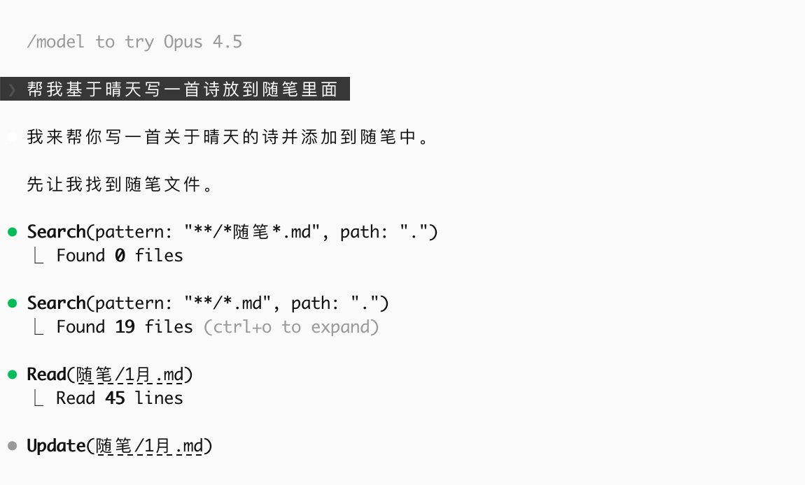

Markdown文件批处理

AI可以执行以下批量操作：

- 重命名笔记时自动更新所有附件路径

- 将零散的字幕或OCR内容整理为连贯段落

- 自动添加YAML元数据（标题、日期、标签等）

- 批量格式化代码块和表格

智能内容生成

内容摘要：

> AI指令：总结这篇文章的核心要点，用列表形式呈现
输出：自动生成带复选框的Markdown段落

智能关联：

- AI通过分析笔记内容，自动建立双向链接

- 在关系图谱中智能标注相关主题

- 推荐相关笔记和参考资料

常用AI工具集成

Gemini CLI：

- 执行自然语言指令处理笔记

- 支持批量操作和自动化脚本

- 输出标准Markdown格式

Claude Code：

- 分析代码片段并插入注释

- 通过代码块与AI交互

- 生成技术文档和API说明

集成方式：

- 安装对应的AI工具CLI版本

- 在Obsidian中通过命令行或插件调用

- 设置自动化工作流，如每日自动总结笔记

## 双向链接与知识图谱

双向链接是Obsidian最核心的特性之一，它让笔记之间建立起有机的联系，构建个人知识网络。

什么是双向链接

双向链接是一种高级的引用方式：

- 当你在笔记A中引用笔记B时

- 笔记B会自动显示被笔记A引用

- 形成双向的关联关系

这种机制让知识点自然串联，而不是孤立存在。

如何使用双向链接

基本语法：使用双中括号\`\[\[\]\]\`创建链接

> \[\[笔记名称\]\]

引用文件示例：

> 我本月写了一个教程 \[Obsidian零基础教程\](../Obsidian零基础教程.md)

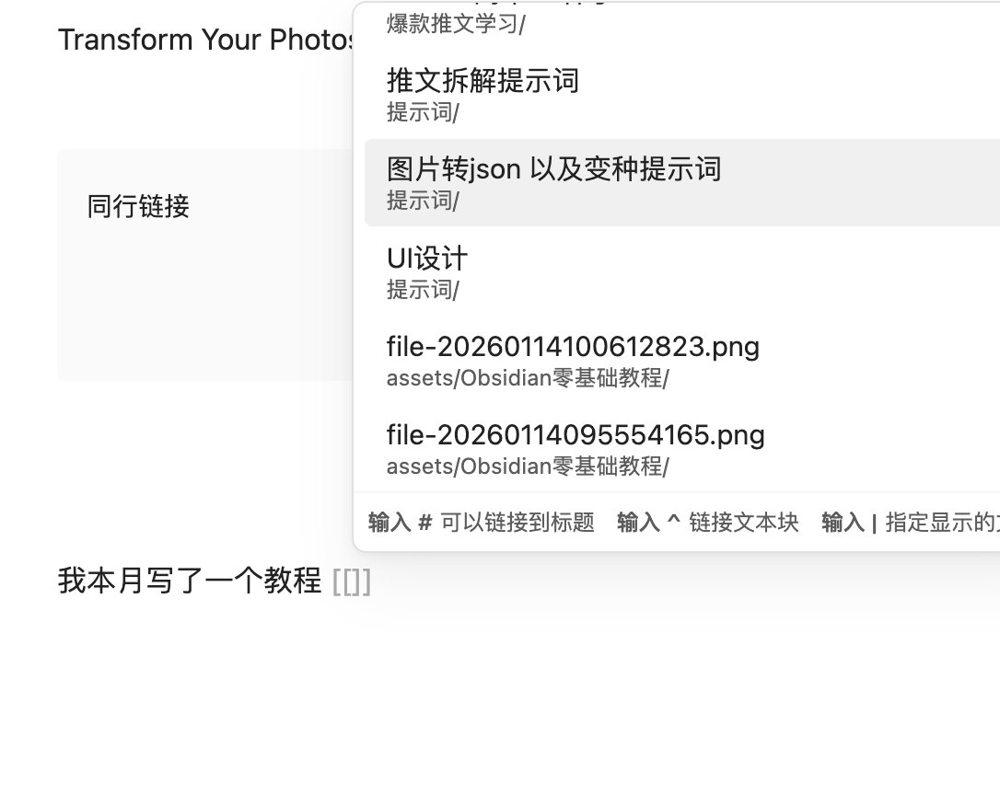

链接到标题：

> \[\[笔记名称#标题名称\]\]
例如：\[\[Obsidian教程#安装步骤\]\]

自定义显示文字：

> \[\[实际笔记名称\|显示的文字\]\]
例如：\[\[Markdown语法\|MD语法\]\]

嵌入笔记内容：使用\`!\[\[\]\]\`在当前笔记中显示被引用笔记的内容

> !\[\[笔记名称\]\]

创建双向链接的方法

方法1：拖拽创建

- 在编辑模式下，直接从左侧文件列表拖拽笔记到编辑区

- 自动生成双向链接语法

方法2：输入创建

- 输入\`\[\[\`后，Obsidian会自动提示现有笔记

- 选择或继续输入笔记名称

- 如果笔记不存在，点击链接会自动创建

方法3：反向链接面板

- 每篇笔记右侧会显示"反向链接"面板

- 列出所有引用当前笔记的其他笔记

- 点击可快速跳转

标签系统

除了双向链接，标签也是组织笔记的重要方式：
创建标签：

> #标签名称
#技术/编程/Python

标签的作用：

- 快速分类和检索笔记

- 在图谱中以不同颜色显示

- 支持嵌套标签（用\`/\`分隔）

知识图谱

知识图谱是双向链接的可视化呈现：
打开图谱：

- 点击左侧边栏的"关系图谱"图标

- 或使用快捷键\`Ctrl/Cmd + G\`

图谱功能：

- 节点：每个节点代表一篇笔记

- 连线：连线表示笔记之间的链接关系

- 颜色：可根据标签或文件夹设置不同颜色

- 筛选：可以筛选特定标签或文件夹的笔记

图谱操作：

- 拖拽节点调整布局

- 点击节点打开对应笔记

- 放大缩小查看整体结构

- 使用筛选器关注特定主题

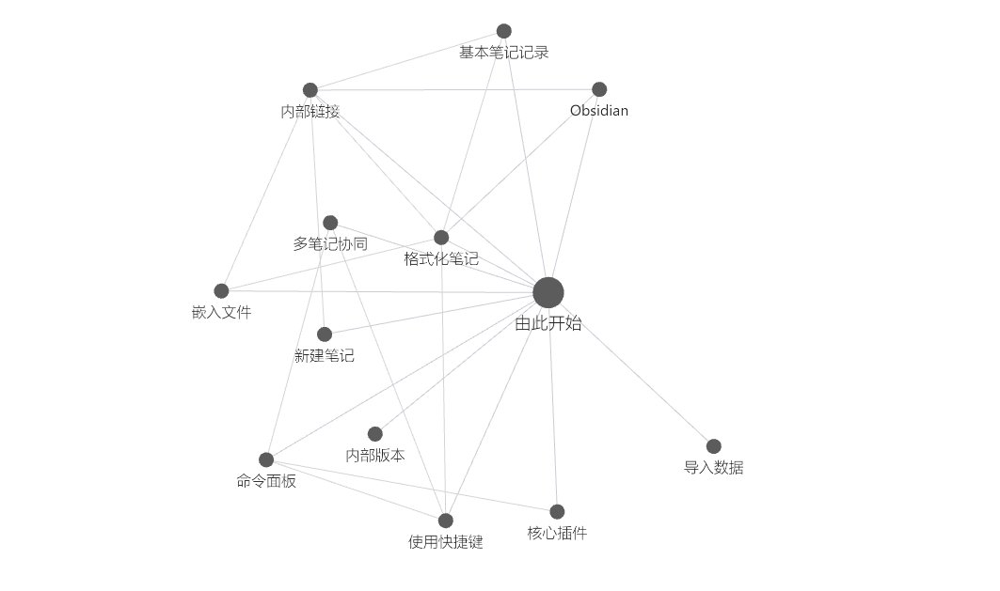

实用技巧：

> \# 在笔记中建立知识网络
\[\[核心概念\]\] → \[\[具体应用\]\] → \[\[实践案例\]\]
使用标签分类：
#项目管理 #个人成长 #技术学习

## 好用的插件推荐

Obsidian的强大之处在于其丰富的插件生态。插件分为核心插件（官方自带）和社区插件（第三方开发）。

必备核心插件

1\. 大纲（Outline）

- 实时显示当前笔记的标题结构

- 点击标题快速跳转到对应位置

- 便于查看和管理长文档结构

2\. 工作台（Workspaces）

- 保存不同的工作布局

- 一键切换学习、写作、项目管理等场景

- 每个工作台可包含不同的笔记和面板组合

3\. 录音机（Audio Recorder）

- 在笔记中直接录音

- 录音文件自动保存在库文件中

- 适合记录会议、讲座等场景

4\. 模板（Templates）

- 创建笔记模板，避免重复输入

- 支持日期、时间等动态变量

- 适合日记、会议记录等固定格式笔记

设置方法：

> 1\. 创建模板文件夹（如"Templates"）
2\. 在设置中指定模板文件夹位置
3\. 创建模板文件，使用{{date}}等变量
4\. 使用时点击"插入模板"

热门社区插件

1\. Calendar

- 在侧边栏显示日历视图

- 点击日期创建或打开日记笔记

- 可视化查看笔记创建时间

2\. Advanced Tables

- 快速创建和编辑Markdown表格

- 自动对齐表格列

- 支持表格排序和公式计算

3\. Templater

- 比核心模板插件更强大

- 支持JavaScript脚本

- 可创建动态模板和自动化工作流

示例模板：

> \---
title: &lt;% tp.file.title %&gt;
date: &lt;% tp.file.creation\_date("YYYY-MM-DD HH:mm:ss") %&gt;
tags: 
\---

4\. Dataview

- 将笔记当作数据库查询

- 生成动态内容列表

- 适合任务管理、项目追踪

示例查询：

> \# 查询所有未完成任务

TASK
WHERE !completed

> 5\. Excalidraw
\- 在Obsidian中绘制手绘风格图表
\- 支持流程图、思维导图
\- 可嵌入到笔记中
6\. Auto Link Title
\- 粘贴URL时自动获取网页标题
\- 生成格式化的Markdown链接
\- 节省手动输入标题的时间
\### 插件使用建议
1\. 循序渐进：不要一次性安装太多插件，先熟悉基本功能
2\. 按需安装：根据实际使用场景选择插件
3\. 定期清理：卸载不常用的插件，保持系统流畅
4\. 查看文档：每个插件都有说明文档，遇到问题先查阅文档
5\. 社区交流：加入Obsidian中文社区，获取插件推荐和使用技巧
\### 插件配置技巧
设置快捷键：
\- 打开设置 → 快捷键
\- 搜索插件命令
\- 设置自定义快捷键
\- 
\---
以上就是Obsidian零基础教程的核心内容。建议先掌握Markdown语法和双向链接，再逐步探索插件功能。记住，工具是为内容服务的，最重要的是持续记录和积累知识。

### 🖼️ Attached Media

## 💬 Replies

### 1 @AI_Jasonyu (鱼总聊AI)

*Thu Jan 15 13:24:08 +0000 2026*

@bozhou\_ai 我去，太有用了这东西

### 2 @gkxspace (余温)

*Fri Jan 16 03:14:01 +0000 2026*

@bozhou\_ai 写的太详细太用心了，点赞啊

### 3 @bozhou_ai (泊舟) (Author)

*Fri Jan 16 03:34:11 +0000 2026*

@gkxspace 哈哈哈 谢谢

### 4 @yanhua1010 (Yanhua)

*Fri Jan 16 10:54:11 +0000 2026*

@bozhou\_ai 我看了发现很多都没用到

### 5 @li9292 (李韭二)

*Thu Jan 15 11:30:33 +0000 2026*

@bozhou\_ai 谢谢老师！太需要了

### 6 @bozhou_ai (泊舟) (Author)

*Thu Jan 15 11:31:08 +0000 2026*

@li9292 哈哈哈 一起学习

### 7 @teach_fireworks (烟花老师)

*Thu Jan 15 23:24:16 +0000 2026*

@bozhou\_ai ob 真的太适合个人了，尤其是开放的插件系统和丝滑的内容编辑，现在我也逐步抛弃其他工具了，变得更高效聚焦

### 8 @bozhou_ai (泊舟) (Author)

*Fri Jan 16 00:55:30 +0000 2026*

@brad\_zhang2024 是的，非常的丝滑

### 9 @gougeip (钩哥Johnny)

*Thu Jan 15 13:18:12 +0000 2026*

@bozhou\_ai 云同步那部分没看太懂

### 10 @bozhou_ai (泊舟) (Author)

*Thu Jan 15 14:04:15 +0000 2026*

@zhang\_zjing 简单说就是自动提交到github上面，如果你没有编程基础的话，可以搜一下同步到谷歌云或者其他云上

原理就是把文件存储到一个网盘上面，只不过github免费，还不限制容量

### 11 @Boboo520 (Bobopig)

*Thu Jan 15 14:46:47 +0000 2026*

@bozhou\_ai 一篇很好的科普文章，如果放在一年前看到，会让我少了很多折腾。但是已经折腾过了，所以觉得的介绍的内容很熟悉，有些就是我目前的方案，有些新的东西可以学习

### 12 @bozhou_ai (泊舟) (Author)

*Thu Jan 15 15:19:12 +0000 2026*

@bxbzjzllan898 哈哈哈。大佬也分享一下经验

### 13 @ljhspurs (JimmyJacy)

*Thu Jan 15 10:00:24 +0000 2026*

@bozhou\_ai 好教程👍

### 14 @bozhou_ai (泊舟) (Author)

*Thu Jan 15 10:01:41 +0000 2026*

@ljhspurs 哈哈哈，主打零基础

### 15 @LongXiao4082 (Rivers)

*Thu Jan 15 14:10:50 +0000 2026*

@bozhou\_ai 我前一段时间也在找好用的笔记工具

也使用了 Obsidian 后来觉得只能本地使用就放弃了

当时忘了有 github 可以做云端同步了，哦 shit

### 16 @bozhou_ai (泊舟) (Author)

*Thu Jan 15 14:31:13 +0000 2026*

@LongXiao4082 哈哈哈，还可以同步手机端

### 17 @bggg_ai (饼干哥哥AGI（2.0）)

*Thu Jan 15 12:37:20 +0000 2026*

@bozhou\_ai 好干

### 18 @bozhou_ai (泊舟) (Author)

*Thu Jan 15 13:16:17 +0000 2026*

@bggg\_ai 哈哈哈，还是饼干哥哥的内容，更加干

### 19 @toyHanli (青燃)

*Thu Jan 15 10:31:19 +0000 2026*

@bozhou\_ai 正需要这个

### 20 @bozhou_ai (泊舟) (Author)

*Thu Jan 15 10:45:15 +0000 2026*

@toyHanli 哈哈哈那正好

### 21 @SisWood33 (空空子)

*Thu Jan 15 14:47:11 +0000 2026*

@bozhou\_ai 在纠结Obsidian还是Notion😂

### 22 @bozhou_ai (泊舟) (Author)

*Thu Jan 15 15:19:58 +0000 2026*

@SisWood33 我觉得Obsidian吧，不过Notion的UI感觉好点

### 23 @renlixingx2 (星火燎原)

*Thu Jan 15 11:16:33 +0000 2026*

@bozhou\_ai 有没有实时渲染的插件

### 24 @bozhou_ai (泊舟) (Author)

*Thu Jan 15 11:28:17 +0000 2026*

@renlixingx 这个得搜一下 我还真没有这个需求

### 25 @knownc0ld (knowncold)

*Fri Jan 16 23:42:07 +0000 2026*

@bozhou\_ai 他最多支持多少量的笔记？几万以后会占内存会卡吗

### 26 @bozhou_ai (泊舟) (Author)

*Sat Jan 17 00:35:02 +0000 2026*

@knownc0ld 这个是存本地文件夹的，几万内存不会卡的，现在的电脑应该问题不大

### 27 @ianneo_ai (Ian (伊恩))

*Thu Jan 15 10:16:20 +0000 2026*

@bozhou\_ai 👍 写的真好

### 28 @cnyzgkc (木马人)

*Thu Feb 12 09:18:38 +0000 2026*

@bozhou\_ai gitgnore -&gt; gitignore，纠个错，哈哈

### 29 @0xkakarot888 (0x卡卡撸特🍌🧪🤖😈)

*Fri Jan 16 02:50:33 +0000 2026*

@bozhou\_ai 爆母鸡教程，已转，感谢🙏 正好是我当下需要的，想什么来什么，真好！

### 30 @JXianSheng (🅹先生 🧑‍🚀 🧙🏻‍♂️ 👨🏻‍💻🌳)

*Thu Jan 15 17:58:04 +0000 2026*

@bozhou\_ai 其实 围绕第二大脑 知识花园的构建会更好…

### 31 @yungui_ml (云归)

*Fri Jan 16 11:57:42 +0000 2026*

@bozhou\_ai 非常详细，刚好把我前两天下载还没用上的 obsidian 的初始化配置搞好了，赞一个\~

### 32 @iamzhihui (志辉)

*Fri Jan 16 00:46:04 +0000 2026*

@bozhou\_ai 点赞一波，普及 ob 的路上少不了你

