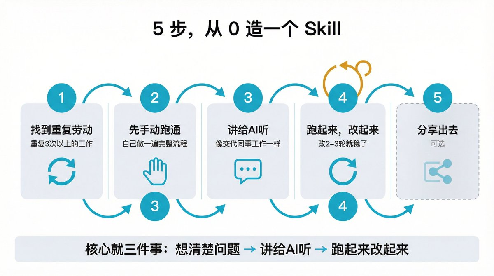
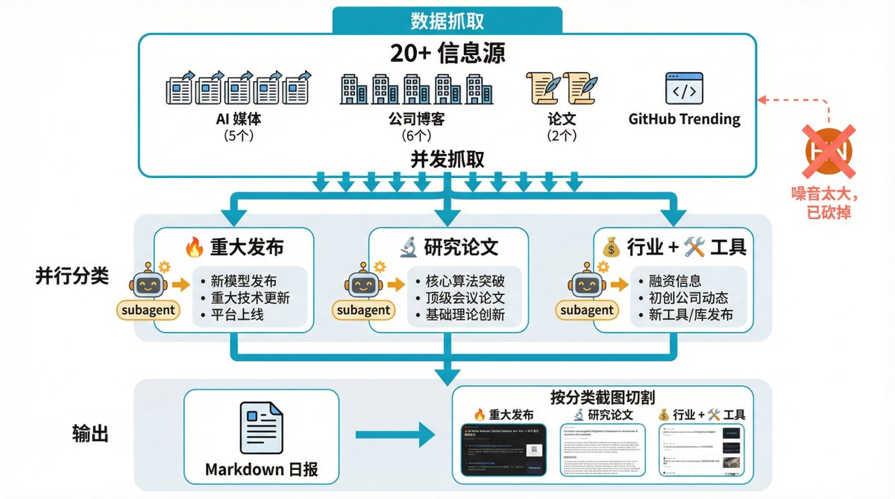
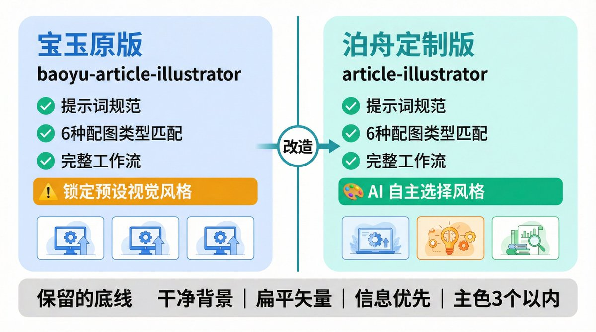
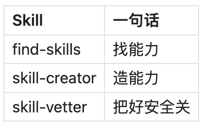
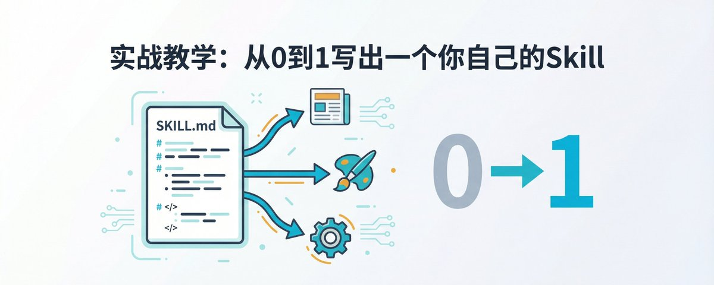

# 📰 实战教学:从0到1写出一个你自己的Skill

# 

大家好，我是泊舟。

我每天早上有个固定动作：从 20 多个网站扒 AI 新闻，筛选、分类、写成日报。整套流程下来，少说 40 分钟。

后来我给 Claude Code 做了一个 AI 日报 Skill。现在我只需要打一句AI 日报，它自己抓数据、分类、写稿、渲染成图片。40 分钟变成了一句话。

这个 Skill 不是别人给我的，是我自己做的。不用写代码，核心就是一个 Markdown 文件。

怎么做到的？接下来我用自己的两个 Skill 案例，把从零开始造 Skill 这件事聊透。不用写代码，也不用懂编程。

## 一、Skills 到底是什么

一句话：Skill 就是给 AI 准备的技能手册。

打个比方。你去餐厅吃饭，厨师有基本功，能切菜能炒菜。但要做出一道特定的菜，他需要菜谱。菜谱告诉他：用什么食材、什么火候、什么顺序。

Skill 就是 AI 的菜谱。Claude Code 本身什么都能干一点，但你给它一个 Skill，它就知道碰到某类任务该怎么做、用什么流程、输出什么格式。

一个文件夹，核心就一个文件

Skill 的结构非常简单：

my-skill/
├── SKILL.md       # 核心：告诉 AI 怎么干活
├── scripts/       # 可选：需要跑的脚本
└── references/    # 可选：参考文档、模板

最重要的就是 SKILL.md。这个文件分两部分：

第一部分是元数据，包括名字、描述、触发条件。比如我的 AI 日报 Skill，描述写的是聚合 20+ AI 信息源，生成每日 AI 日报。

第二部分是操作指南，告诉 AI 具体怎么一步步干活。

一个容易忽略的细节：Description

Description 这个字段特别关键。AI 不会一上来就读完你所有 Skill 的内容，它先看 Description，觉得匹配了才会去读详细说明。

这就像你在应用商店搜 App，搜索结果里只显示一行简介。简介写得准，用户才会点进去。Description 写模糊了，AI 就匹配不到你的 Skill，等于白做。

Claude Code 和 OpenClaw 的 Skills：一套东西，两个地方用

如果你同时在用 Claude Code 和 OpenClaw，有个好消息：两边的 Skill 结构几乎一样，核心都是一个 SKILL.md。

我自己的用法是：用 Claude Code 开发和测试 Skills，跑通了再部署到 OpenClaw 使用。Claude Code 里迭代方便，改完立刻能测。等稳定了，丢到 OpenClaw 的工作区，通过飞书、微信这些渠道就能触发。

一份 Skill 两个平台用。

## 二、5 步，从 0 造一个 Skill

造 Skill 听起来好像要写代码。其实不用。

核心就三件事：想清楚问题，讲给 AI 听，跑起来改起来。

拆成 5 步来说。

第一步：找到你的重复劳动

起点不是"我想做个 XX Skill"，而是"我每天在 XX 事情上花太多时间了"。

一个简单的判断标准：这件事你重复做了 3 次以上，每次流程差不多，你就可以考虑做成 Skill。

我做 AI 日报 Skill 的起点就是这样的。每天早上打开十几个网站，从 VentureBeat 翻到 HuggingFace，再到 GitHub Trending，重复了两个月，终于受不了了。

第二步：先手动跑通一遍

这一步很多人会跳过，但我吃过亏。

我做 AI 日报的时候，第一版效果很差。原因是我直接让 AI 去造 Skill，自己都没搞清楚完整的流程到底是什么。哪些信息源该抓，哪些该扔，输出格式是什么样的，截图要怎么切，这些细节不手动跑一遍根本想不到。

所以建议：在让 AI 造 Skill 之前，自己先手动做一遍完整流程。把每一步具体在干嘛写下来。这份手动流程就是你给 AI 的最好需求文档。

第三步：把需求讲给 AI 听

这一步就像跟同事交代工作。你不用写代码，用大白话说就行：

帮我创建一个 Skill，每天从 20 个 AI 信息源抓新闻，按分类汇总成一份日报，最后渲染成图片。

AI 收到之后会追问细节。触发关键词是什么？输出格式要 Markdown 还是 HTML？图片要不要切割？

你一问一答聊完，需求就清楚了。AI 会帮你生成一个标准的 SKILL.md。

生成之后记得检查一下 Description 是不是准确。前面说过了，这个字段决定了 AI 能不能正确找到你的 Skill。

第四步：跑起来，改起来

Skill 生成之后，试跑一次。

大概率第一次跑出来的效果不会让你满意。可能是抓取的数据有噪音，可能是分类逻辑不对，可能是输出格式不好看。

这很正常。改一改，再跑一次。一般改个 2-3 轮就基本稳定了。

我的经验是，前两轮主要是修大问题（流程跑不通、关键步骤缺失），第三轮开始是调细节（格式微调、措辞优化）。

第五步：分享出去（可选）

觉得自己的 Skill 好用，可以分享到 GitHub 或者 ClawHub。让别人也能用。

当然这一步完全可选。自己用得爽就够了。

## 三、实战案例：我的 AI 日报 Skill

方法论讲完了，接下来看看真实场景里会遇到什么。

为什么做

前面提过，每天从 20 多个信息源扒 AI 新闻。这些源包括 VentureBeat、TechCrunch、The Verge、OpenAI Blog、Anthropic Blog、HuggingFace Papers、GitHub Trending 等等。

手动做的时候，光是打开这些网站、扫一遍标题、筛出有价值的内容，就要半个多小时。更别说还要分类整理、写成日报格式。

最终效果

现在我只需要说一句AI 日报，整个流程自动跑：

1. 脚本从 20+ 源并发抓取数据

1. 用多个 subagent 并行处理不同分类（重大发布、研究论文、行业商业、工具应用）

1. 汇总生成 Markdown 日报

1. 渲染成 Newsletter 风格的 HTML

1. 自动截图，按分类切成多张图片

从触发到出图，全程不用我动手。

迭代过程中的坑

这个 Skill 不是一次做好的，改了很多轮。聊几个印象比较深的。

一开始我把 Hacker News 也加到了信息源里。想法是 HN 上技术内容多，应该有不少 AI 相关的。跑了几天发现不对，HN 的内容太杂了，AI 相关的帖子占比很低，大量非 AI 内容混进来。每次生成的日报里总有几条完全不相关的东西。我没去优化过滤逻辑，直接把 HN 这个源砍了。

还有截图的问题。日报生成之后，需要渲染成好看的页面再截图发到社交平台。一开始截的是一整张长图，但一份日报内容很多，截出来图片太长，微信里根本看不清。后来做了按分类切割：以每个大标题为边界，把长图裁成多张。今日头条一张，重大发布一张，研究论文一张。每张图信息量刚好，发出去阅读体验好很多。

GitHub Trending 也踩了坑。上面的项目不一定都和 AI 相关，光看项目名和简介经常误判。后来加了一层验证：抓到项目之后，再去读一下它的 README 内容，综合判断是不是真的和 AI 相关，不相关的直接跳过。这个改动之后，日报里推荐的 GitHub 项目质量提升了不少。

核心体感

每次跑一遍都会发现新问题，改一改再跑。核心流程稳了之后就舒服了，后面都是些小调整。

## 四、实战案例：站在别人肩膀上改配图 Skill

第二个案例是我的文章配图 Skill。这次我没从零开始。

起因

我写公众号文章经常需要配图。每次手动找图或者做图特别麻烦，而且质量不稳定。我想要一个能自动分析文章内容、判断哪里该配什么类型的图、然后直接生成的 Skill。

发现宝玉的 baoyu-article-illustrator

找了一圈，发现宝玉大佬在 GitHub 上开源了自己的自媒体skills,里面有一个一个文章配图

看了一下他的方案，我觉得他的提示词规范做的特别好。每种配图类型都有结构化的 prompt 模板，布局、数据、颜色、比例都有明确要求，不是随便写一句话让 AI 去猜。

配图类型的匹配逻辑也想得很清楚。文章里出现数据和指标，匹配 infographic。出现步骤和流程，匹配 flowchart。出现对比，匹配 comparison。出现架构，匹配 framework。不是拍脑袋决定用什么图，而是有一套信号匹配规则。

整个工作流也串得很顺：分析文章、确认设置、生成大纲、写 prompt、生成图片、插入文章，6 步走完不用我操心中间环节。

我改了什么

宝玉的版本有一个设计我不太认同：他锁定了预设的视觉风格。

我觉得不同文章应该有不同的视觉表达。技术文章适合蓝紫色科技感，叙事类文章适合暖色调，教程类适合卡片步骤风格。锁定一种风格，等于所有文章长一个样。

所以我做了一个调整：把风格决策权交给 AI。AI 读完文章之后，自主判断这篇文章适合什么视觉风格，然后在 prompt 里具体描述出来。

当然底线还是有的：干净背景、扁平矢量、信息优先、主色不超过 3 个。但在这些底线之上，AI 可以自由发挥。

改完之后效果明显好了。技术文章出来的图有科技感，个人向的文章配图就暖一些，不再千篇一律。

这件事的启示

宝玉的 Skill 提示词规范和类型匹配逻辑都很好，我只改了风格策略这一块。省了大量从零搭建的时间。

很多时候造 Skill 最快的路径就是这样：找一个靠谱的基础版本，让其变成我么的私人定制版本。

## 五、几个踩过坑之后的建议

1\. Description 要写准

再强调一次。Description 是 AI 匹配 Skill 的第一道关卡。写得太宽泛，比如"一个有用的工具"，AI 不知道什么时候该用它。写得太窄，比如只写了一个触发词，覆盖场景又不够。

好的 Description 用一句话说清楚这个 Skill 干什么就行。比如我的日报 Skill 写的是"聚合 20+ AI 信息源，生成每日 AI 日报"，简短、具体、能被匹配到。

2\. 先手动跑通再封装

如果你手动都没做过这件事，直接让 AI 生成 Skill，出来的东西大概率不能用。因为你自己都不知道完整流程是什么，AI 更不可能知道。

先手动跑通一遍，把流程记下来，再让 AI 封装成 Skill。这个顺序不能反。

3\. 一个 Skill 解决一个问题

别贪多。一个 Skill 想干 5 件事，结果每件事都做得一般。

我的做法是把大任务拆成多个 Skill。日报是日报的 Skill，配图是配图的 Skill，排版是排版的 Skill。各自独立，各自迭代。

4\. 迭代心态

第一版一定不完美。别纠结，改就是了。

改 2-3 轮基本就稳了。前两轮修大问题，第三轮调细节。

## 六、三个推荐安装的 Skills

讲了怎么造 Skill，最后推荐三个我觉得应该装上的 Skills。这三个不是干某件具体的事，而是让你的 AI 自己能找工具、造工具、审工具。

find-skills：技能发现器

ClawHub 上有一万多个 Skill，你不可能一个个翻。

装了 find-skills 之后，你跟 AI 说"我想实现 XX 功能"，它自动去搜索、推荐、帮你安装。相当于给 AI 装了一个自己找工具的能力。

我做配图 Skill 的时候就是这样找到宝玉的方案的。

skill-creator：技能创建器

ClawHub 上找不到你想要的？自己造一个。

用 skill-creator，你用自然语言描述需求，它帮你生成标准的 SKILL.md，直接就能用。不用写代码，不用研究格式规范。

这个 Skill 相当于把前面讲的第三步做了标准化封装。

skill-vetter：技能安全审查器

安装任何第三方 Skill 之前的安全门卫。

它会自动检测 Skill 里有没有红旗信号：可疑的权限请求、异常的命令执行、不明的外部调用。帮你评估风险，识别潜在问题。

别觉得多余。ClawHub 上鱼龙混杂，之前 OpenClaw 社区就出过供应链攻击事件，恶意 Skill 篡改用户的配置文件。装第三方 Skill 之前扫一下，花 30 秒的事。

三个 Skill 的组合逻辑

有现成的就用 find-skills 找，找不到就用 skill-creator 自己造。不管哪种，装之前让 skill-vetter 扫一遍。

从每天 40 分钟扒新闻，到一句话搞定日报。中间隔的不是什么高深技术，就是一个 SKILL.md 文件。

如果你也有某个重复性工作让你头疼，可以试试做成 Skill。先从 find-skills 搜搜有没有现成的。找不到就自己造一个，前面讲的 5 步跟着走就行。

一个 Skill 解决一个具体问题，慢慢攒着，你的 AI 就越来越顺手了。

### 🖼️ Attached Media

## 💬 Replies

### 1 @GoSailGlobal (Jason Zhu)

*Thu Apr 02 07:03:45 +0000 2026*

@bozhou\_ai 不错

### 2 @berryxia (Berryxia.AI)

*Thu Apr 02 06:56:13 +0000 2026*

@bozhou\_ai 很适合新手学习啊！

### 3 @bozhou_ai (泊舟) (Author)

*Thu Apr 02 07:13:11 +0000 2026*

@berryxia 专门为新手写的  哈哈哈

### 4 @yshnln (shan)

*Thu Apr 02 07:34:35 +0000 2026*

@bozhou\_ai 第一次写skill

鬼画符了几个，放clawhub上

现在，竟然都快到10K的下载量了

### 5 @bozhou_ai (泊舟) (Author)

*Thu Apr 02 07:40:57 +0000 2026*

@linyishan 哈哈哈 证明是命中需求了

### 6 @hungxun254458 (文轩)

*Thu Apr 02 06:55:04 +0000 2026*

@bozhou\_ai skills的作用是很大的，但是token消耗量也很多，每次用baoyu老师的skills一下就没了很多token

### 7 @bozhou_ai (泊舟) (Author)

*Thu Apr 02 07:13:25 +0000 2026*

@hungxun254458 是的 baoyu老师的skills 非常好

### 8 @rionaifantasy (Rion Wu)

*Thu Apr 02 07:41:28 +0000 2026*

@bozhou\_ai @grok 帮我总结一下

### 9 @justlikemaki (何夕2077 (个板马版))

*Thu Apr 02 15:51:26 +0000 2026*

@bozhou\_ai 非常感谢分享！Claude Code Skill 的实战教学对我们非常有启发，自动化日报确实能极大提升工作效率。

### 10 @wanxiang21286 (wanxiang)

*Fri Apr 03 01:27:07 +0000 2026*

@bozhou\_ai 大佬这个skill开源了吗

### 11 @Adam38363368936 (Adam也叫吉米)

*Fri Apr 03 03:24:56 +0000 2026*

@bozhou\_ai 这个写的实用

### 12 @98_swagger (0xSwagger)

*Fri Apr 03 08:19:40 +0000 2026*

@bozhou\_ai so clean love it

### 13 @nunu29441988704 (Ethan Shen)

*Thu Apr 02 07:07:26 +0000 2026*

@bozhou\_ai 好细👏

### 14 @wenye233 (温叶的代码日记)

*Thu Apr 02 17:03:31 +0000 2026*

@bozhou\_ai 有用

### 15 @liush1203 (Robin@SZ)

*Thu Apr 02 11:10:39 +0000 2026*

@bozhou\_ai 把skill发出来呀

### 16 @ASPHALT_jp (ASUFARUTO)

*Sat Apr 04 03:40:20 +0000 2026*

@bozhou\_ai 整个搭框架的思路还是可以借鉴的。但报纸本身就可信吗？我不觉得跳过信息源本身不看是个好事。看完了再叫ai洗信息更好。

### 17 @leozhang1976 (leo zhang)

*Sun Apr 05 13:01:01 +0000 2026*

@bozhou\_ai 学习了

### 18 @nvha90874457 (fuscoyu)

*Fri Apr 03 03:36:52 +0000 2026*

@bozhou\_ai 赞赞赞

### 19 @rookiebaby188 (rookiebaby)

*Tue Apr 07 12:31:21 +0000 2026*

@bozhou\_ai 我的做法是把大任务拆成多个 Skill。日报是日报的 Skill，配图是配图的 Skill，排版是排版的 Skill。各自独立，各自迭代。

这个我不理解，你日报不要排版吗，日报不用配图吗，那你写的日报skill到底有没有排版和配图呢，还是三个skill一起配合，不理解

### 20 @zhngyfi10621382 (arfi)

*Fri Apr 03 16:22:34 +0000 2026*

@bozhou\_ai skill可以分享不

### 21 @jiangzaijie1 (杰瑞是只猫)

*Thu Apr 02 14:08:03 +0000 2026*

@bozhou\_ai 脚本怎么写呢

