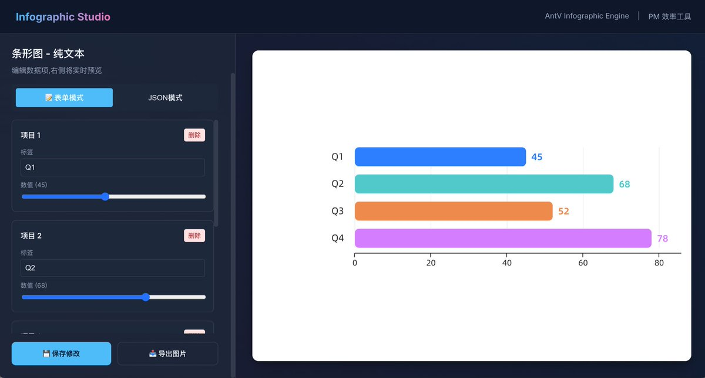

蚂蚁开源了一个对AI非常友好的制作信息图的开源项目，
[github.com/antvis/Infogra…](https://github.com/antvis/Infographic)

内置了接近两百个的信息图模板，并且里面直接有了Prompt模版和[skills.md](http://skills.md)文件。

可以非常快速接入claude code 或者我们的工作流，并且基于svg进行生成保证视觉品质与可编辑性 

## 💬 Replies

### 1 @i_m_m_ (黑眼圈| 美股合约首选Gate)

*Sun Dec 28 13:13:33 +0000 2025*

@bozhou\_ai 蚂蚁这个太实用了！

### 2 @ljhspurs (JimmyJacy)

*Sun Dec 28 11:20:11 +0000 2025*

@bozhou\_ai SVG是可便捷性的关键，以前画架构图太痛苦了😂, 毕竟理工男在美工上不太行

### 3 @S8Vb8 (waka)

*Mon Dec 29 08:01:18 +0000 2025*

@bozhou\_ai 确实不错，已经vibe coding成工具了，用了一下还不错 

### 4 @Linyuan_Milesya (林远)

*Sun Dec 28 13:33:13 +0000 2025*

@bozhou\_ai 漂亮

### 5 @kukuyidui (crypto 墨道)

*Sun Dec 28 13:05:57 +0000 2025*

@bozhou\_ai 撸起来

### 6 @ripple_z (ripple_k)

*Sun Dec 28 18:32:33 +0000 2025*

@bozhou\_ai nb

### 7 @canleoinc (Berin)

*Sun Dec 28 18:07:17 +0000 2025*

@bozhou\_ai 这个可以学习下

### 8 @GuxiaoTec1024 (guxiao-tech)

*Mon Dec 29 00:17:47 +0000 2025*

@bozhou\_ai 看起来钉钉 ai 会议纪要用的模板类似这套？

