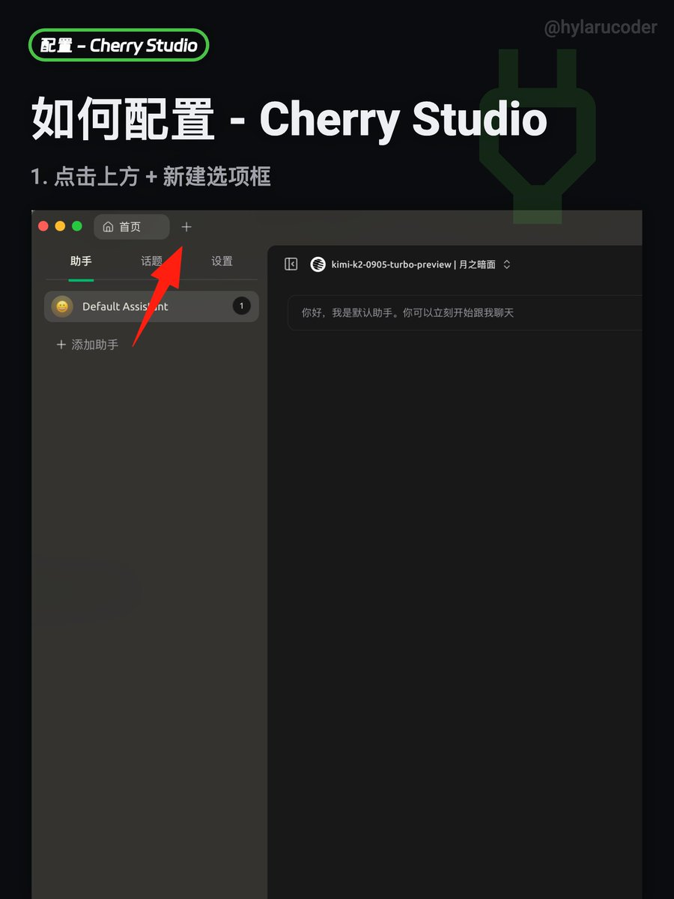
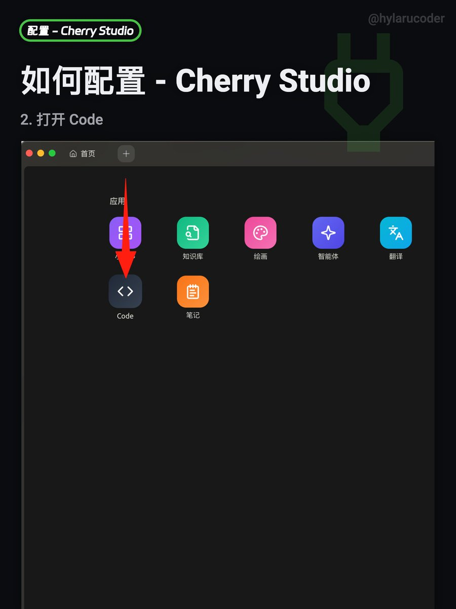
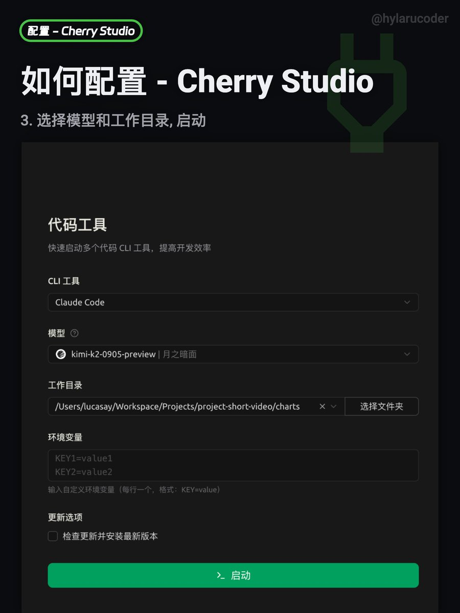
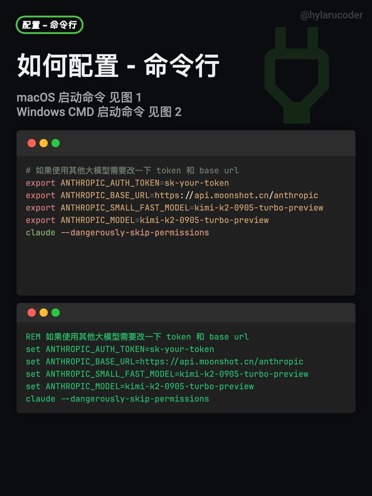

\# 从降智到小动作: Claude Code 平替计划

Claude 最近很忙, 忙着降智降低老用户体验，忙着发公告搞排外，小动作不断

作为 Claude Code 早期用户, 实在是被恶心到了。

所以我写了这份「Claude Code，但是国产大模型」的无缝“搬家”指南。

国产大模型发展很快，本人对 K2 模型相对熟悉一些，以 K2 为例 K2 0905 相比 K2 0711，速度更快（60～100 token/s）、上下文更长（256K）、工具调用更稳（Toolcall 成功率近 100%）

编辑失败率低了很多，Vibe Coding 更跟手了。

1\. Sonnet 4 级别的模型，已经被  K2 / GLM / Qwen 为代表的国产模型迅速追平。基础一些的需求都可以用国产大模型替代了。
2\. Opus 4 目前还是第一梯队，但一山更比一山高 GPT-5 + high 超 opus 太多。

对于预算有限、又想追求更好效果的朋友，可以试试组合工作流

用 ChatGPT Plus (Codex + GPT-5 High) 进行头脑风暴和任务拆解，生成清晰的规格文件，然后将具体的执行任务交给 K2 完成

关于 Codex cli 组合工作流后面我也会出一期视频)。 好钢用在刀刃上。

习惯图形界面的朋友可以使用 @CherryStudioHQ  按图完成配置, 其他模型如 Qwen / GLM 4.5 也可以

习惯命令行的朋友，可以复制命令到你的终端。

macOS 版

\`\`\` 
export ANTHROPIC\_AUTH\_TOKEN=sk-your-token
export ANTHROPIC\_BASE\_URL=[api.moonshot.cn/anthropic](https://api.moonshot.cn/anthropic)
export ANTHROPIC\_SMALL\_FAST\_MODEL=kimi-k2-0905-turbo-preview
export ANTHROPIC\_MODEL=kimi-k2-0905-turbo-preview
claude --dangerously-skip-permissions\`
\`\`\`

windows CMD 版

\`\`\`
set ANTHROPIC\_AUTH\_TOKEN=sk-your-token
set ANTHROPIC\_BASE\_URL=[api.moonshot.cn/anthropic](https://api.moonshot.cn/anthropic)
set ANTHROPIC\_SMALL\_FAST\_MODEL=kimi-k2-0905-turbo-preview
set ANTHROPIC\_MODEL=kimi-k2-0905-turbo-preview
claude --dangerously-skip-permissions
\`\`\`

与其被动接受平台的反复无常，不如主动构建一套属于自己的、稳定可靠的工作流。

当然，如果你有更好的方案，也欢迎在评论区分享交流！

#claudecode #mcp #cherrystudio #vibecoding #kimi

### 🖼️ Attached Media

## 💬 Replies

### 1 @hylarucoder (海拉鲁编程客) (Author)

*Sun Sep 07 11:58:08 +0000 2025*

@YinsenHo\_ 老板，来认领图

### 2 @onlookersh (平凡OnlOOker)

*Sun Sep 07 12:03:09 +0000 2025*

@hylarucoder 给大佬纠正！kimi-k2-turbo-preview 现在就是0905版本，不需要加0905，就是turbo

### 3 @hylarucoder (海拉鲁编程客) (Author)

*Sun Sep 07 12:03:59 +0000 2025*

@onlookersh 酱紫，感谢纠正

### 4 @alanhe421 (Alan H)

*Sun Sep 07 13:56:29 +0000 2025*

@hylarucoder k2 vs deepseek，觉得哪个好点。

### 5 @hylarucoder (海拉鲁编程客) (Author)

*Sun Sep 07 14:00:59 +0000 2025*

@alanhe421 同一梯队测意义不大，挑一个你熟悉的就行。

### 6 @choo_charles_ya (Charles Lee)

*Sun Sep 07 14:58:12 +0000 2025*

@hylarucoder 深度先后使用cc套壳 kimi k2 和 sonnet 4 做自动驾驶的开发4周，前者跨越不过的坎，后者轻松。所以要自己试试

### 7 @kimihuang (Kimi Huang)

*Sun Sep 07 13:40:36 +0000 2025*

@hylarucoder Claude code + deepseek 跟 Claude code + K2 哪个更好？更强？ 主要是实用工具方面？

### 8 @nascent_li (Nan Li)

*Sun Sep 07 17:25:03 +0000 2025*

@hylarucoder CC官方文档写的已经弃用ANTHROPIC\_SMALL\_AND\_FAST\_MODEL这个参数，新的是ANTHROPIC\_DEFAULT\_HAIKU\_MODEL

### 9 @wilbeibi (wilbeibi)

*Sun Sep 07 20:47:19 +0000 2025*

@hylarucoder 我也退订 claude 了，要用的话用 AWS bedrock 版 CC 就够了，还便宜

### 10 @rokcso (苏柯蕤)

*Mon Sep 08 09:34:06 +0000 2025*

@hylarucoder 用 Claude Clode Router 也不错，感觉配置管理更方便

[x.com/rokcso/status/…](https://x.com/rokcso/status/1962723307075346603)

### 11 @huo0x0 (huo0)

*Sun Sep 07 16:41:42 +0000 2025*

@hylarucoder 虽然但是…k2响应真的很慢，glm又不是很聪明。我又用回了cursor 的c4。如果真的有正经平替就好了，哪怕国产的包月30刀

### 12 @JonathanCaiSG (蔡荔谈AI (公众号）)

*Mon Sep 08 03:40:41 +0000 2025*

@hylarucoder 不建议用kimi-k2-0905-turbo-preview，用kimi-k2-0905-preview，token消耗会更便宜一些

### 13 @ousfifty (ous fifty)

*Mon Sep 08 07:53:33 +0000 2025*

@hylarucoder 没拿到 k2-0905 的权限😭

### 14 @LeoYang14799607 (HELLO KITTY)

*Sun Sep 07 23:32:44 +0000 2025*

@hylarucoder @readwise save

### 15 @mooonb (ふーん)

*Sun Sep 07 23:34:45 +0000 2025*

@hylarucoder claude code 本身没有好的平替吗？

### 16 @Murder23333 (Fu_sir)

*Sun Sep 07 13:09:35 +0000 2025*

@hylarucoder 我还是觉得cursor比较符合我的喜好但可惜会降智

### 17 @prodbitz (DZ)

*Thu Sep 11 01:00:48 +0000 2025*

@hylarucoder 没有包月套餐，实际使用也不便宜，处理一个开发任务，不留神花了30￥。觉得 glm 20￥包月，更适合一些

### 18 @Paidaixinbao (派大星星星星)

*Sun Sep 07 16:24:11 +0000 2025*

@hylarucoder gpt5确实挺不错，但是我觉得有个缺点就是惜字如金，很多地方都不会说的非常清楚或者详细，导致我需要让他进一步解释从而更多的浪费token，这个能用什么好的prompt解决吗？

### 19 @Ethan_C_2000 (Ethan_C)

*Mon Sep 08 14:31:41 +0000 2025*

@hylarucoder gpt5讲话的风格好奇怪

### 20 @Ushio1458962107 (ashia satomi)

*Sun Sep 07 15:57:52 +0000 2025*

@hylarucoder 今天用了k2一天，晚上用了GLM，一下子有了通畅的感觉，kimi k2都不知道谁在吹，我就不谈他的准确率，1.响应慢2.收费高 对比之下性价比极低，Glm有专门适配claude code的套餐，响应效率怎么形容呢，输出一遍错误然后再让它自己修复bug，这一套跑完k2第一步的输出还没完成，性价比完胜

### 21 @qwwr757240 (qwwr)

*Sun Sep 07 18:19:33 +0000 2025*

@hylarucoder claude好好升级他的编码能力不行吗，还搞歧视中国，真的脑残200刀取消了

### 22 @JezeChou (JezeChou)

*Sun Sep 07 15:13:09 +0000 2025*

@hylarucoder mark

### 23 @Raymond72297680 (Raymond Ho)

*Mon Sep 08 22:01:42 +0000 2025*

@hylarucoder 昨晚被Claude sonnet 4玩慘了，在一個小修改上反反復復快一個小時搞不定，無奈之下換了gpt -5 preview試試，10秒不到就搞定了，真沒想到。

### 24 @MichaelYchFENG (Yuanchang)

*Sun Sep 07 23:19:22 +0000 2025*

@hylarucoder @readwise save thread

### 25 @Ivlucks123 (GUO)

*Mon Sep 08 01:17:08 +0000 2025*

@hylarucoder 你应该把YouTube上推广这家恶心公司的所有推广视频下架！！！！

### 26 @LouiseMaud49599 (Louise Maud)

*Sun Sep 07 23:08:38 +0000 2025*

@hylarucoder 其实装一个claude code router最简单，它相当于是claude code 后端url的一个router转发，兼容openai，anthropic，gemini几种格式。网友们各种逆向的2api服务都可以无缝接入

### 27 @chen79639ddc (DDChen (Daniel Chen))

*Sun Sep 07 17:05:10 +0000 2025*

@hylarucoder 謝大哥分享，最近幾個月AI coding 變化太大了，學工具永遠無盡頭…不如構建自己的工作流派

### 28 @Q_samas (William)

*Sun Sep 07 17:13:09 +0000 2025*

@hylarucoder 用了一圈，这样做确实可以平替Claude code，主要是GPT-5 thinking好用，难的它都解决了，kimi那边就像执行师，没啥技术含量的

### 29 @sn4802446440604 (智海星|自动发布系统)

*Thu Sep 11 08:58:02 +0000 2025*

@hylarucoder 服务商若无法维系用户体验，用户自然会寻找新选择。这份指南恰逢其时，不仅解决了迁移痛点，也折射出国产大模型在追赶甚至超越的潜力。

💡 DevTools技术，智能化自动发推文系统，高度模拟人类操作，安全稳定，低价高效。详见账号置顶

