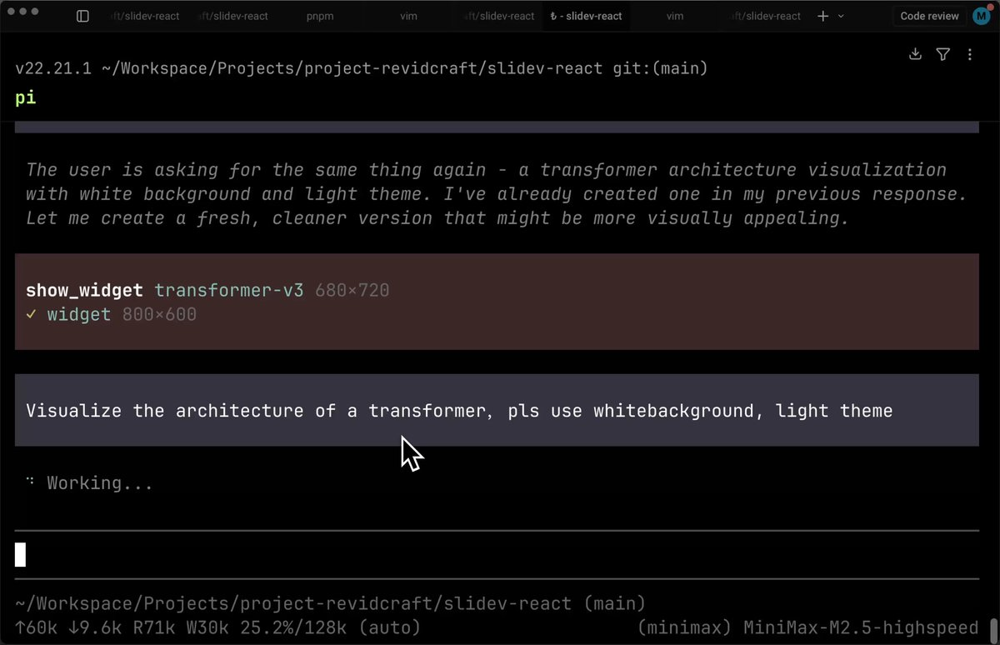

昨天 claude 的可视化图表看起来非常牛逼

但其实你用 @MiniMax\_AI 或者其他国产大模型都能搞定。

大致步骤如下

1\. 安装  pi，你可以理解为一个开源版本的 claude code， npm install -g @mariozechner/pi-coding-agent
2\. 安装 generative-ui ，命令 pi install git:[github.com/Michaelliv/pi-…](http://github.com/Michaelliv/pi-generative-ui) 感谢 @micLivs 
3\. 配置环境变量 MINIMAX\_API\_KEY，进入终端输入你的需求

比如

1\. Visualize the architecture of a transforme，light theme
2\. Show me how compound interest works

基本两次抽卡就能包爽！

### 🖼️ Attached Media

## 💬 Replies

### 1 @yangyi (Yangyi)

*Sat Mar 14 08:58:33 +0000 2026*

@hylarucoder @MiniMax\_AI 确实是这样，很多牛B效果国产模型都能搞定了
终端如果用不明白，也可以用牛马AI，更简单！
可以类似Claude Desktop一样有GUI操作界面和文件管理系统，跑Skills更方便

邀请码：NM-7S6T-VW23
[niuma.limyai.com](https://niuma.limyai.com)

### 2 @wangleineo (Gilfoyle)

*Sat Mar 14 17:12:27 +0000 2026*

你没注意到Claude的是实时stream到会话里的，必须一次过，不能出一点错。
这个演示相当于Claude的artifact，早就可以做了。

### 3 @hylarucoder (海拉鲁编程客) (Author)

*Sat Mar 14 17:16:31 +0000 2026*

@wangleineo @MiniMax\_AI 你仔细看看，这也是实时的

### 4 @QT9277 (阿台🕊️)

*Sun Mar 15 01:32:19 +0000 2026*

@hylarucoder @MiniMax\_AI 国产大模型同样出色的可视化工具。

### 5 @huskyship (Husky | Solo Dev)

*Sun Mar 15 12:44:19 +0000 2026*

@hylarucoder @MiniMax\_AI 这个牛

### 6 @iamzhihui (志辉)

*Sat Mar 14 08:48:38 +0000 2026*

@hylarucoder @Pluvio9yte @MiniMax\_AI 海哥玩的花呀

### 7 @hanxu2018 (han xu)

*Sat Mar 14 07:48:31 +0000 2026*

@hylarucoder @MiniMax\_AI 学到了新东西 pi 尝试使用下

### 8 @ilexax (LexaAI)

*Sun Mar 15 11:15:24 +0000 2026*

@hylarucoder @MiniMax\_AI 经常黑屏，不知道什么原因

### 9 @sNyBwfKdEYMzJw4 (FFF)

*Sun Mar 15 11:40:19 +0000 2026*

@hylarucoder @MiniMax\_AI @Grok
这个的原理是啥呀？是不是就是通过一个前端的方式，然后再加上一个 skill?

### 10 @LuoWen74 (rust＆c)

*Sun Mar 15 15:21:56 +0000 2026*

@hylarucoder @MiniMax\_AI 开源版claude code？不是cc吗

### 11 @9o_zZz_o6 (CV 攻城湿)

*Sat Mar 14 10:59:40 +0000 2026*

@hylarucoder @MiniMax\_AI 学习下，pi 还没尝试过

