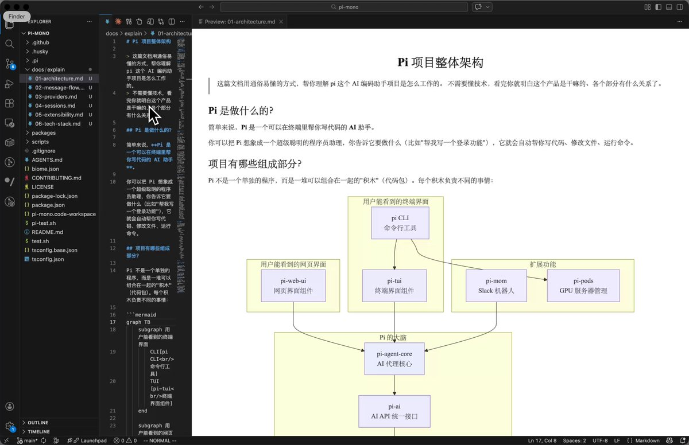

最近读代码仓库的活全部丢给 AI 干了, 预先让AI 生成详细的文档+图, 效果很好, 步骤如下

以 pi-mono 这个 13k 的仓库为例

1\. 打开 opencode/claude code + @MiniMax\_AI M2.5
2\. 输入如下的提示词, 回车

「我是一个不懂技术的产品经理, 我想通过 Mermaid 图表深度梳理一下业务。麻烦帮我分析一下这里面有哪些值得挖掘的点。帮我写几篇逻辑详尽的说明文档，放在 docs/explain/\*.md 。文档里要大量运用 Mermaid 语法来可视化这些逻辑，越详细越好,越详细越好,越详细越好，哪怕我不懂技术也能一眼看清业务逻辑的走向。辛苦啦！」

3\. 打开 vscode 安装响马老师 @xicilion  开发的 markdown viewer extension 扩展, 提升阅读体验

一图胜千言, 几分钟看完!

### 🖼️ Attached Media

## 💬 Replies

### 1 @peter6759 (zdhpeter)

*Wed Feb 18 07:09:04 +0000 2026*

@hylarucoder @MiniMax\_AI [deepwiki.com](https://deepwiki.com/) is also cool

### 2 @hylarucoder (海拉鲁编程客) (Author)

*Wed Feb 18 07:10:22 +0000 2026*

@peter6759 @MiniMax\_AI deepwiki 肯定是个不错的项目了, 但不能定制提示词.

### 3 @Gvoiceluli (LI LU)

*Wed Feb 18 07:06:15 +0000 2026*

@hylarucoder @MiniMax\_AI 我也是看了openclaw才注意到pi这个项目,完全无法理解openAI为什么会花巨资收购这个项目,整个项目并没有特别之处,即使用他们自己家的codex也能很快vibe更好的版本.这价格收购也是神了,openclaw这个项目无疑是初学者都能很好借鉴的项目,学习与获取灵感,但感觉到openAI技术品味比不上anthropic…

### 4 @hylarucoder (海拉鲁编程客) (Author)

*Wed Feb 18 07:08:33 +0000 2026*

@Gvoiceluli @MiniMax\_AI 1. 没有收购 openclaw
2\. 更像是买 peter

### 5 @hiheimu (赖叔 | LaiShu.ai)

*Wed Feb 18 08:39:41 +0000 2026*

@hylarucoder @MiniMax\_AI 选用minimax是因为便宜+够用吗
直接上opus是不是效果提升不大？

### 6 @hylarucoder (海拉鲁编程客) (Author)

*Wed Feb 18 08:48:37 +0000 2026*

@hiheimu @MiniMax\_AI 是的

opus 没试过, 可能效果会好

### 7 @EinNewton (Jason)

*Wed Feb 18 11:17:01 +0000 2026*

@hylarucoder @MiniMax\_AI 為什麼不直接deepwiki ?

### 8 @hylarucoder (海拉鲁编程客) (Author)

*Wed Feb 18 12:29:03 +0000 2026*

@EinNewton @MiniMax\_AI deepwiki不能针对性写提示词呀。

### 9 @ArtistZhou (Artist Zhou｜OPC)

*Wed Feb 18 08:40:32 +0000 2026*

测试了一下这个流程，发现一个小细节非常关键。
生成的 md文件最好直接放在项目根目录同步 Git。我之前的痛点是 AI 生成完文档就丢在对话框里，过两天就找不到了。现在这种直接修改仓库、生成持久化文档的做法，才算是真正把 AI 接入了工作流。
响马老师@xicilion的那个插件确实好用，预览渲染非常丝滑，体验感直接拉满。

### 10 @Leoskie_L (Leonard)

*Wed Feb 18 10:17:06 +0000 2026*

@hylarucoder @MiniMax\_AI 嗯，这个好。我都叫他直接自己读，然后就没有记录，然后每次都要再重新来。

### 11 @Chinese_XU (君子中庸)

*Wed Feb 18 05:27:10 +0000 2026*

@hylarucoder @MiniMax\_AI gpt3.5刚出来后就用来看论文。不过当时没那么多可视化。总之模式差不多，直接看细节的确太累

### 12 @LukeLiu95 (刘仙升)

*Wed Feb 18 12:42:38 +0000 2026*

@hylarucoder @MiniMax\_AI 大佬，学习了。写了一个 skill   [gitmap.simprr.com](https://gitmap.simprr.com/)

### 13 @rango5813 (rango)

*Thu Feb 19 02:27:16 +0000 2026*

@hylarucoder @MiniMax\_AI 按这个思路写项目的文档也挺适合给公司其他人介绍自己做的项目，感谢分享✌️

### 14 @LotusDecoder (LotusDecoder)

*Tue Mar 03 13:48:17 +0000 2026*

@hylarucoder @MiniMax\_AI 用过几次，确实好用。

### 15 @WOWOO222W (HHHYYY)

*Wed Feb 18 12:24:25 +0000 2026*

@hylarucoder @MiniMax\_AI 對資深工程師來說這是必備的技能
現在網路上的開源都可以用這個方式來去蕪存菁
把好架構好用的代碼萃取之後轉換成自己的提示詞rule
也可以更快的理解整個架構

### 16 @taomin15201212 (KEEN的创享)

*Wed Feb 18 13:20:34 +0000 2026*

@hylarucoder @MiniMax\_AI 试试这个 “我需要对这个项目进行学习，学习其整体结构与核心实现，输出一系列 md 文档在 docs 文件夹下供我参考。”

### 17 @sydmousr8039 (ironore)

*Wed Feb 18 17:23:39 +0000 2026*

@hylarucoder @MiniMax\_AI deepwiki发布一年了，自己造轮子何必呢

### 18 @ayyuu1688 (Mina玩转ai)

*Thu Mar 05 03:27:23 +0000 2026*

@hylarucoder @MiniMax\_AI 学到了

### 19 @mugen_shuu (夢幻舟)

*Thu Feb 19 06:37:30 +0000 2026*

@hylarucoder @MiniMax\_AI Minmax不是多模态吧

### 20 @atgihdgv (atgihdgv)

*Wed Feb 18 23:05:38 +0000 2026*

@hylarucoder @grok 请给出这个项目的详细方案与使用介绍，发给我

