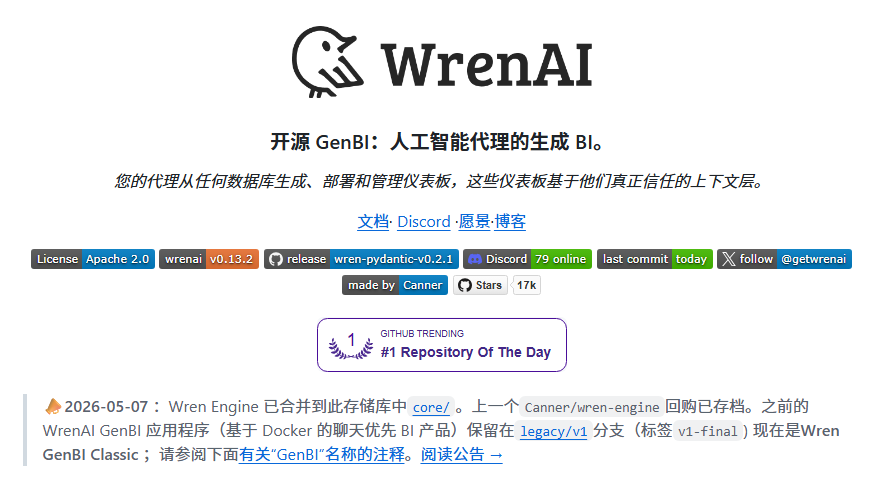

公司的 SQL 仔和数据分析师要被这个开源神器干失业了！老板直接用自然语言提问，AI 就能自动打通底层数据库生成数据报表，关键是还不会胡乱捏造指标。  

这玩意真有人做出来了——GitHub 爆火开源项目 WrenAI，目前已经斩获 16.8k Star，采用 Apache 2.0 协议开源。它是一个专门给 AI Agent 打造的 Generative BI（生成式商业智能）引擎。简单来说，它在你的数据库和 AI 之间塞了一层“业务语义理解”，不管是 PostgreSQL、ClickHouse、Snowflake 还是 BigQuery，连上就能直接让人话变成准到离谱的 SQL 和可视化图表。  

🔥 核心卖点：
• 通吃 20+ 种主流数据库：大小数据库一键打通，不挑食
• 独家业务上下文层：AI 不再瞎猜表结构，查询零幻觉
• 自动出可视化图表：说句人话直接生成漂亮仪表盘
• 无缝对接 AI Agent：跟 Claude Code、Cursor 秒无缝集成
• 完全开源可私有化：敏感数据不外流，本地部署超省心  

🔗 传送[github.com/Canner/WrenAI](https://github.com/Canner/WrenAI)s4

### 🖼️ Attached Media

## 💬 Replies

### 1 @QT9277 (阿台🕊️)

*Wed Aug 05 10:28:48 +0000 2026*

@CycleDecoded 老板要失业了，这 AI 太猛了！

### 2 @ajs6888 (安叫兽|Bird🕊️ 🔶 BNB)

*Wed Aug 05 10:26:28 +0000 2026*

@CycleDecoded 老板会问，数据口径谁来背锅

### 3 @GuoshengZh69305 (guosheng zhai)

*Thu Aug 06 04:46:00 +0000 2026*

@CycleDecoded 很好奇，如果字段名是zyxcjssl，没有对照的文档，ai能分析出来这个字段是什么意思吗？值是纯数量，不看代码能猜出来是支援乡村教师数量吗？
甚至如果字段就是string1，long1，double1，num5，int3，ai怎么猜？
agent会去搜文档，搜代码解决吗？

### 4 @ace91697962 (codeAce)

*Thu Aug 06 00:25:16 +0000 2026*

@CycleDecoded [github.com/lixinxins/Quil…](https://github.com/lixinxins/QuillDB)也不错

### 5 @xiaoyaocity (xiaoyaojun)

*Thu Aug 06 14:49:02 +0000 2026*

@CycleDecoded 这个厉害👍

### 6 @daniel_du (Daniel Du)

*Thu Aug 06 06:10:59 +0000 2026*

@CycleDecoded 这个有用，这是刚需。

### 7 @helloworld668 (Famer)

*Thu Aug 06 06:40:44 +0000 2026*

@CycleDecoded 看着挺不错，试试看

### 8 @xmlleee (村里 直樹)

*Thu Aug 06 13:19:22 +0000 2026*

@CycleDecoded 这就是个伪命题，工作量大的在知识表示，真以为plantir是靠搞定史密斯专员拿项目的么？

