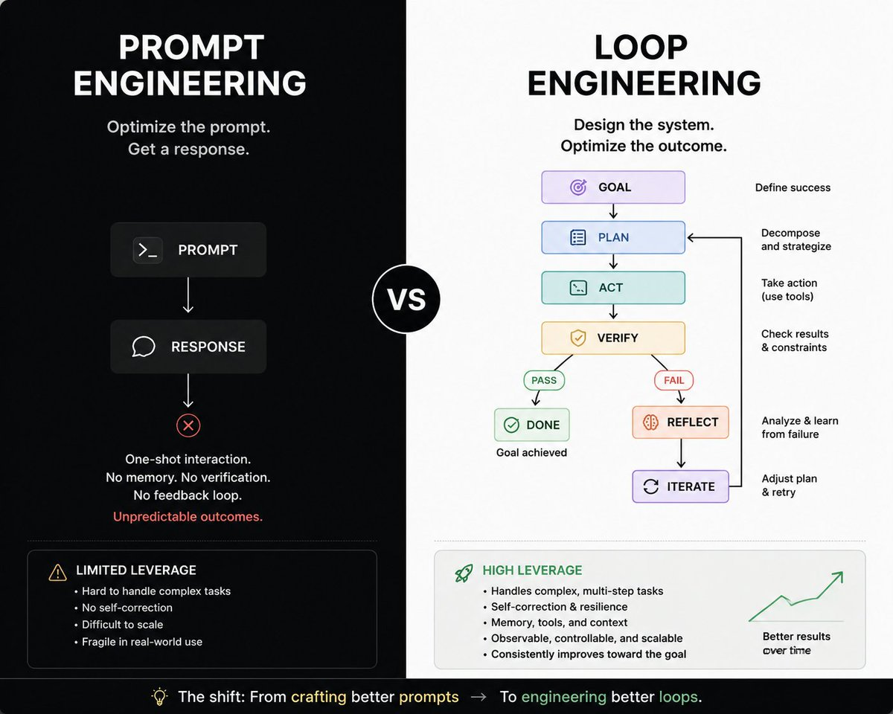

Loop Engineering 精华文章汇总!

2026 年 Agent 开始聚焦在长任务后，重点慢慢变成了：

如何设计一个能够持续思考、执行、观察、验证和演进的循环系统？

从 Codex 到 Claude Code，从 OpenHands 到各种 Coding Agent。

业余项目和生产级系统之间最大的差距是Harness 工程，包括 Loop。

Agent 能不能持续工作几十分钟甚至几个小时？

能不能在失败后恢复？

能不能控制成本？

能不能知道什么时候停下来？

这些问题，最终都落到了 Loop 设计上。

📚 推荐阅读

1\. Loop Engineering — Addy Osmani[addyosmani.com/blog/loop-engi…](https://addyosmani.com/blog/loop-engineering/)B

2\. Loop Engineering — Firecrawl[firecrawl.dev/blog/loop-engi…](https://www.firecrawl.dev/blog/loop-engineering)1

3\. What Is the AI Agent Loop? — Oracle[blogs.oracle.com/developers/wha…](https://blogs.oracle.com/developers/what-is-the-ai-agent-loop-the-core-architecture-behind-autonomous-ai-systems)f

4\. Harness Engineering — OpenAI[openai.com/index/harness-…](https://openai.com/index/harness-engineering/)B

5\. Harness Engineering for Coding Agent Users — Martin Fowler[martinfowler.com/articles/harne…](https://martinfowler.com/articles/harness-engineering.html)h

6\. Agentic Loops: From ReAct to Loop Engineering[datasciencedojo.com/blog/agentic-l…](https://datasciencedojo.com/blog/agentic-loops-explained-from-react-to-loop-engineering-2026-guide/)i

7\. Loop Engineering for AI Agents (Memory-First) — Mem0[mem0.ai/blog/loop-engi…](https://mem0.ai/blog/loop-engineering-for-ai-agents-memory-first-design)D

📄 推荐论文
1\. Agentic Harness Engineerin[arxiv.org/abs/2604.25850](https://arxiv.org/abs/2604.25850)tF

2\. From Agent Loops to Structured Graph[arxiv.org/abs/2604.11378](https://arxiv.org/abs/2604.11378)rw

🛠 推荐研究的开源项目
Codex C[github.com/openai/codex](https://github.com/openai/codex)vJF

OpenHan[github.com/All-Hands-AI/O…](https://github.com/All-Hands-AI/OpenHands)Jrp

Pydantic[github.com/pydantic/pydan…](https://github.com/pydantic/pydantic-ai)iCR

OpenAI Agents S[github.com/openai/openai-…](https://github.com/openai/openai-agents-python)cVu

重点研究：
Loop 如何运行
Loop 如何停止
Loop 如何验证
Loop 如何恢复
Loop 如何调试

Prompt 决定 Agent 如何开始。
Context 决定 Agent 能看到什么。
Loop 决定 Agent 最终能走多远。

Loop Engineering：
Think
↓
Act
↓
Observe
↓
Verify
↓
Evolve
↓
Repeat

你设计循环。
Agent 在循环中持续改进。
每完成一次循环，系统都会比上一次更接近目标。
Agent 从来不缺 Loop。
缺的是 Loop 的工程学。

### 🖼️ Attached Media

## 💬 Replies

### 1 @adelbucetta (Adel Bucetta)

*Fri Jun 19 05:24:51 +0000 2026*

@teach\_fireworks the honest answer is the real breakthrough wasn't codex or any other model, but being able to design a feedback loop that doesn't break in production, a problem that still needs solving

### 2 @teach_fireworks (烟花老师) (Author)

*Fri Jun 19 05:37:52 +0000 2026*

@adelbucetta right,totally agree!

### 3 @Forest_GoGoGo (Forest)

*Fri Jun 19 23:03:51 +0000 2026*

@teach\_fireworks 会循环到死机吗

### 4 @teach_fireworks (烟花老师) (Author)

*Sat Jun 20 01:35:55 +0000 2026*

@Forest\_GoGoGo 一般在设计阶段就要考虑退出和完成机制，崩溃恢复或最大循环次数，成本上限这些条件

### 5 @kaiNakamur78644 (kai Nakamura)

*Fri Jun 19 03:14:03 +0000 2026*

@teach\_fireworks Loops need contracts.

### 6 @teach_fireworks (烟花老师) (Author)

*Fri Jun 19 04:20:20 +0000 2026*

@kaiNakamur78644 true!

### 7 @ajs6888 (安叫兽|Bird🕊️ 🔶 BNB)

*Fri Jun 19 00:35:22 +0000 2026*

@teach\_fireworks 长任务一上来，loop 的坑就藏不住了

### 8 @php_martin (Martin)

*Fri Jun 19 11:13:19 +0000 2026*

@teach\_fireworks Loop Engineering 这条线很关键：Agent 不是一次回答，而是持续观察、执行、验证、演进的循环系统。这里有份从 LLM、Context、Tool 到 Agent Skill 的底层框架，可以作为前置概念图： [x.com/php\_martin/sta…](https://x.com/php_martin/status/2067918422684655930)

### 9 @UncleJAI (Uncle J)

*Fri Jun 19 05:11:26 +0000 2026*

@teach\_fireworks 同意。Prompt 是入口，Loop 才是生产系统：任务拆解、工具调用、状态记录、观察验证、失败恢复、复盘沉淀。业余 demo 和生产系统的差距，基本都在这些 boring parts 里。

### 10 @andysingal (Ankush Singal)

*Fri Jun 19 20:28:17 +0000 2026*

@teach\_fireworks added here: [github.com/andysingal/pro…](https://github.com/andysingal/prompt-docs/blob/main/loop_engineering.md)

### 11 @HarriesSteele (Harries)

*Sat Jun 20 00:31:27 +0000 2026*

@teach\_fireworks 直接看openclaw源码 ，就知道loop杂回事了

### 12 @2Hugh3 (Xinyu Cai)

*Tue Jun 30 09:08:48 +0000 2026*

@teach\_fireworks Thanks

### 13 @PanXing0827 (王小丑)

*Sat Jun 20 07:47:51 +0000 2026*

@teach\_fireworks 我准备把烟花老师收集的这些loop engineering 精华直接扔个codex 😃

### 14 @slgxmf (Archer Sun)

*Sat Jun 20 13:38:38 +0000 2026*

@teach\_fireworks loop实施

### 15 @winnerineast (Winnerineast)

*Fri Jun 19 14:06:11 +0000 2026*

@teach\_fireworks 个人认为这个会是昙花一现，因为loop最大的红利是模型优化，做不到的话，你到底在优化时候，提示词吗？

### 16 @LonglinX (龙鳞)

*Sat Jun 20 06:26:48 +0000 2026*

@teach\_fireworks 感谢

### 17 @moreoronce (Lex Parsimoniae🚲)

*Sat Jun 27 10:02:21 +0000 2026*

@teach\_fireworks 我跑多模型共识Loop目前遇到的最大坑：

辩论轮没有明确的退出条件，模型会一直互相补充观点，跑到token烧完都不收敛。后来设定了硬约束——连续两轮没有新增实质分歧就强制收敛。Loop的工程学核心不仅仅是让它转起来，也要知道什么时候该喊停。

### 18 @ValiNagacevschi (Vali)

*Tue Jun 30 16:35:16 +0000 2026*

@teach\_fireworks There's a full handbook on Loop Engineering if you want to go deeper: [gettinggoodwithai.com/books/loop-eng…](http://gettinggoodwithai.com/books/loop-engineering-handbook). First 50 to DM me get it free.

### 19 @oficialp4trick (OfficialP4trick)

*Fri Jun 19 21:46:34 +0000 2026*

@teach\_fireworks I buy &amp; sell AI and Cloud Credits.
Azure • OpenAI • Claude • GCP • AWS
Fast response ⚡

Create an x cover photo off this

### 20 @oravlasoul (Oravla Soul)

*Fri Jun 19 10:47:30 +0000 2026*

@teach\_fireworks Your compilation on loop design for long tasks in 2026 is insightful. For agents navigating complex loops, having diverse SOUL.md personas can streamline the process. Check out [oravla.cyou](http://oravla.cyou) for 16 personas tailored for AI agents.

