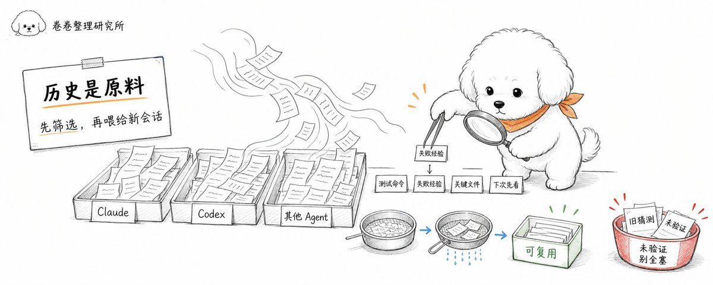
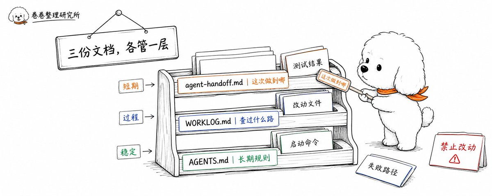
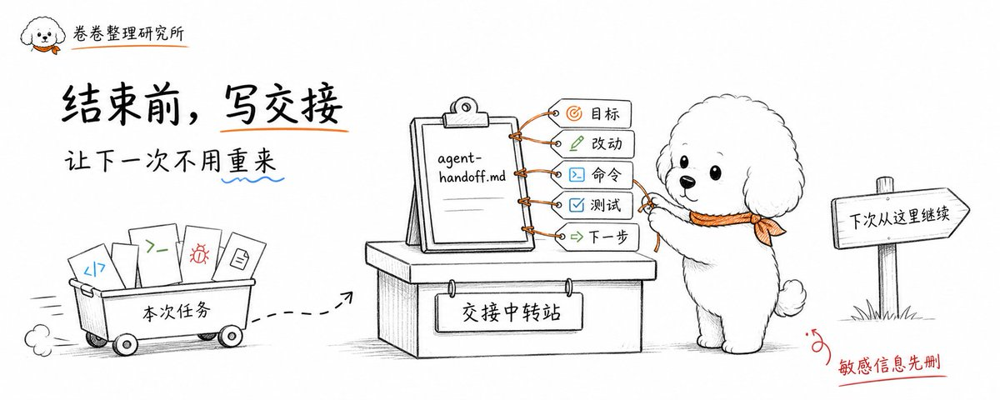
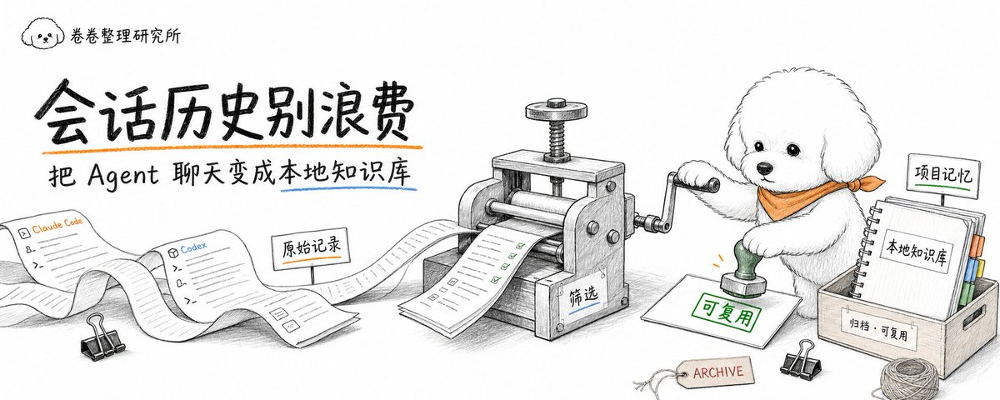

# 📰 Agent 会话历史别浪费：把 Claude Code 和 Codex 的历史变成本地知识库

> 把一次性的 Agent 聊天记录，整理成下一次任务能直接复用的项目记忆。

现在用 Claude Code、Codex 写代码，浪费经常发生在任务结束以后。Agent 已经帮你读过项目结构、分析过报错、试过几种方案、跑过测试，但这些过程最后往往只留在某个会话里。下次再开新任务，又要重新解释一遍项目背景。

这就很可惜。因为很多 Agent 会话里，其实藏着一份很有价值的项目知识：哪些文件最关键，哪个测试命令能跑通，某个报错以前怎么处理过，哪些方案试过但不适合。它们如果只停留在聊天记录里，很快就会变成一次性消耗。

这篇主要讲一个更实用的用法：不要把 Claude Code 和 Codex 的历史只当聊天记录，而要把它整理成本地知识库。 这样下次再开新会话，Agent 不用从零摸项目，人也不用反复解释同一件事。

## 为什么会话历史值得留下来

Claude Code 和 Codex 的会话，和普通聊天不太一样。普通聊天可能只是问答，代码 Agent 的会话里会包含大量过程信息，比如它读了哪些文件、判断了哪些依赖、改了哪些地方、跑了哪些命令、测试失败在哪里、后来怎么修复。

这些内容就是一个开发者的工作日志。只是过去这个日志散在不同工具里：Claude Code 有自己的 session，Codex 有自己的 session，Cursor、OpenCode、Gemini CLI 也各有各的记录。人切换工具以后，最麻烦的往往就是上下文分散。

Claude Code 官方已经支持 session 管理，可以恢复之前的会话，也能浏览和导出 transcript。Codex 这边也有本地会话记录。问题在于，单个工具的恢复能力主要解决「回到上一段对话」，但很难解决「把多个工具里的历史统一查找、复用、整理成项目知识」。

## 本地优先工具开始补这块短板

最近有一类工具开始专门处理这个问题，比如 Agent Sessions（链接在文章末尾）。它是一个 local-first 的 macOS 应用，可以把 Codex、Claude Code、OpenCode、Cursor Agent、Gemini CLI、GitHub Copilot CLI、OpenClaw 等工具的历史放到一个本地视图里，支持搜索 transcript、查看图片输出，也能对部分 CLI 生成恢复命令。

这类工具的重点不只是「看历史」，更像是把不同 Agent 产生的工作记录放到一起。比如你记得 Claude Code 上周帮你分析过一个鉴权问题，但忘了在哪个会话里；或者 Codex 昨天跑过一轮测试，里面有一个失败原因很关键。以前要靠翻终端和聊天记录，现在可以直接搜关键词。

还有一个相关项目叫 ctx（链接在文章末尾），它的思路更进一步：用本地 SQLite 把 Claude Code 和 Codex 的上下文做成 workstream。一个 workstream 可以包含多个 session、notes、decisions、todos 和 resume packs。这个方向很值得关注，因为它把「恢复会话」推进到了「延续一条工作流」。

## 别把历史库当成万能记忆

这里要先说清楚，本地会话历史不是 RAG，也不是让 Agent 自动拥有长期记忆。它更像项目的档案柜。你可以从里面查到过去发生过什么，但要不要把这些内容喂给新会话，还需要筛选。

如果把所有历史都无脑塞回上下文，效果反而会变差。旧方案、旧报错、已经废弃的路径，会把新任务带偏。更好的做法是从历史里提取稳定信息，比如项目启动方式、常用测试命令、关键目录说明、上次没解决的问题、某个模块的设计取舍。

会话历史适合做原始材料，项目知识库才是整理后的结果。 原始记录可以很细，知识库要克制，只留下以后真的会复用的东西。

## 可以先从三个文件开始

如果不想一上来搞复杂系统，可以先在项目里放三个文件：agent-handoff.md、WORKLOG.md、AGENTS.md。这三个文件的分工要清楚，不然很快又会变成新的信息堆积。

agent-handoff.md 适合写短期交接，比如这次任务做到哪，改了哪些文件，跑了什么测试，还有哪些地方需要人工确认。WORKLOG.md 适合记录过程，比如某个 bug 查了哪些方向，哪条路走不通，最后为什么换方案。AGENTS.md 适合放稳定规则，比如项目启动命令、测试命令、目录约定、禁止改动的文件、代码风格要求。

这三个文件分清楚以后，Agent 历史就不会乱。短期信息不会污染长期规则，长期规则也不会埋在一堆聊天记录里。

## 每次任务结束前，让 Agent 写交接

最简单的做法，是在 Claude Code 或 Codex 每次完成任务前，加一句固定提示：

> 「请在结束前写一份任务交接，包含：本次目标、已完成内容、修改文件、执行过的命令、测试结果、未完成事项、需要人工确认的点、下一步建议。内容写入 agent-handoff.md。」

这条提示不用复杂，但很有用。因为它会强迫 Agent 把过程从聊天里抽出来，变成项目内可以复用的文档。下次你再开一个新会话，直接让 Agent 先读 agent-handoff.md 和 AGENTS.md，它进入状态会快很多。

如果某次任务里真的发现了稳定经验，比如某个测试必须先启动本地服务，或者某个目录不能直接改，就不要只放在交接里。可以让 Agent 追加到 AGENTS.md 的对应位置。这样它就从一次任务记录，变成了项目长期记忆。

## 哪些内容值得从会话里捞出来

不是所有聊天都值得保存。比较值得留下来的，通常是几类信息：项目怎么启动，测试怎么跑，哪个模块负责什么，某个报错以前怎么定位，哪些方案已经试过，哪些文件不要乱动，下一次接手应该先看哪里。

不太建议保存的是临时猜测、过时方案、模型自己编出来但没验证的结论。尤其是 Agent 在排查 bug 时，经常会提出几个假设，其中一部分后来被证明是错的。如果这些内容不标注状态，后面再被拿来当事实用，就会制造新的麻烦。

一个简单标准是：能被下一次任务直接复用的，留下；只是当时推理过程的一部分，除非很关键，否则放在原始 session 里就够了。

## 隐私和安全也要一并处理

把会话历史变成本地知识库时，最容易忽略的是敏感信息。Agent 会话里可能出现 API Key、数据库地址、客户数据、内部路径、私有仓库信息。即使是本地保存，也不代表可以随便同步到云盘或公开仓库。

比较稳的做法是，项目知识库只保存工作方法和项目规则，不保存密钥和真实客户数据。如果交接里出现敏感内容，要么删掉，要么改成占位符。比如把真实 token 改成 &lt;API\_KEY&gt;，把客户名改成 &lt;CLIENT\_NAME&gt;。

如果使用 Agent Sessions、ctx 这类本地工具，也要搞清楚它读取哪些目录、数据存在哪里、是否会同步到外部服务。local-first 的好处是数据主要留在本机，但最终安全边界还是取决于你怎么备份、怎么同步、怎么共享项目。

## 更推荐的完整工作流

实际使用时，可以把流程固定成这样：Claude Code 或 Codex 正常完成任务；任务结束前写 agent-handoff.md；人检查交接里有没有敏感信息和错误结论；稳定经验再整理进 AGENTS.md；需要回溯时，用 Agent Sessions 或类似工具搜索原始 transcript。

这样做几次以后，项目会慢慢形成一套自己的「Agent 工作记忆」。它不靠模型自己记住你，也不靠你每次重新解释，而是把真实发生过的过程留在项目里。Agent 负责执行，人负责筛选，项目文档负责长期保存。

## 最后提醒

Agent 会话历史别浪费，但也别全部塞进长期知识库。原始历史可以多留，项目规则要少而准。真正有价值的并非聊天记录本身，是从聊天记录里提炼出来的启动命令、测试方法、设计取舍、失败经验和下一步交接。

如果你已经同时用 Claude Code 和 Codex，建议先从一个项目试起来。让每次任务结束都有交接，让每次稳定经验都进入 AGENTS.md。一两周以后你会发现，Agent 不再每次像新员工入职一样从零开始，项目会越来越好接。

## 参考链接

- Agent Sessions：[https://github.com/jazzyalex/agent-sessions](https://github.com/jazzyalex/agent-sessions)

- Agent Sessions 官网：[https://jazzyalex.github.io/agent-sessions/](https://jazzyalex.github.io/agent-sessions/)

- HN 讨论：Local-first history, search, and analytics for Claude Code and Codex：[https://news.ycombinator.com/item?id=48462489](https://news.ycombinator.com/item?id=48462489)

- Claude Code Sessions 官方文档：[https://code.claude.com/docs/en/sessions](https://code.claude.com/docs/en/sessions)

- ctx，跨 Claude Code 和 Codex 的本地 workstream：[https://github.com/dchu917/ctx](https://github.com/dchu917/ctx)

---

📚 历史文章

1. [别把 Codex 只当代码助手，它正在变成工作流系统](https://x.com/thinkszyg/status/2057427584909291987?s=20)

1. [Codex 的 Pinned Threads，到底该怎么用？](https://x.com/thinkszyg/status/2057736054657130695?s=20)

1. [Codex App 不折腾上手指南：先会这几个命令就够了](https://x.com/thinkszyg/status/2058004216904564747?s=20)

1. [AGENTS.md 完全指南 2026：规范、工具、示例](https://x.com/thinkszyg/status/2060295182864814569?s=20)

1. [Codex 最佳实践：入门指南与提升效果的经验法则](https://x.com/thinkszyg/status/2061089701860352025?s=20)

1. [Codex App 线程调度指南：当前线程、新对话、派生、工作树、Subagents 到底怎么选？](https://x.com/thinkszyg/status/2061278800491729292?s=20)

1. [复杂需求先别让 AI 写代码：多 Agent 并行 Plan 实操](https://x.com/thinkszyg/status/2061761272199479511?s=20)

1. [让 Codex 排查 Codex：手机端和桌面端协同踩坑复盘](https://x.com/thinkszyg/status/2062033005028475173?s=20)

1. [MacBook 合盖后，Codex 手机远程不断线的方法](https://x.com/thinkszyg/status/2062903943131488367?s=20)

1. [知识库最缺的不是更多笔记，而是一个 500 字符的热缓存](https://x.com/thinkszyg/status/2063150365739249682?s=20)

1. [Codex 的「批注」功能，把 AI 改代码变得像改 Word 文档](https://x.com/thinkszyg/status/2063222472644895017?s=20)

1. [三 Agent 工作流实操：双 Agent battle 用久了，我加了一个裁判](https://x.com/thinkszyg/status/2063592599504777426?s=20)

1. [从需求到部署：这 10 个 Codex App 插件，让 AI 编程真正跑完整个项目](https://x.com/thinkszyg/status/2064921557793927616?s=20)

1. [Agent 记忆不是 RAG：给 Codex 和 Claude 做长期记忆的最简方式](https://x.com/thinkszyg/status/2065034172759175366?s=20)

1. [MacBook 合盖不断线进阶版：Codex 手机远程 + Amphetamine + 任务交接](https://x.com/thinkszyg/status/2065594110027973091?s=20)

---

如果这篇对你有帮助，欢迎 关注 + 收藏 + 转发 [👏](https://abs.twimg.com/emoji/v2/svg/1f44f-1f3fb.svg)🏻

关注 [@thinkszyg](https://x.com/@thinkszyg) , 持续分享真实战，生产级，AI真干货。

### 🖼️ Attached Media

## 💬 Replies

### 1 @ai_super_niko (Niko爱学习)

*Sat Jun 13 11:37:31 +0000 2026*

@thinkszyg 对话历史中隐藏着你的个人判断、项目背景 好的实现方案，可以推广的经验，浪费了确实有点可惜

### 2 @thinkszyg (爆裂队长NEXT) (Author)

*Sat Jun 13 11:48:02 +0000 2026*

@ai\_super\_niko 所以，历史不能只当聊天记录，要把它整理成本地知识库，长期积累下来，能做很多事情。尤其，搭配我开源的BLCaptain Meta Skill，效果更佳!
[x.com/thinkszyg/stat…](https://x.com/thinkszyg/status/2065624946756472848?s=20)

### 3 @slgxmf (Archer Sun)

*Sat Jun 13 19:15:30 +0000 2026*

@thinkszyg 试试

