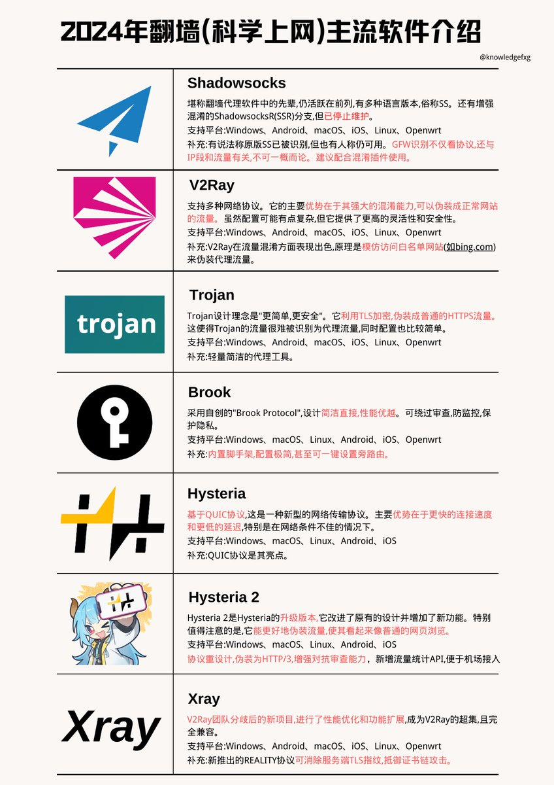

2024年7大翻墙（科学上网）主流软件介绍⬇️

Shadowsocks
[shadowsocks.org](https://shadowsocks.org/)

V2Ray
[v2ray.com](https://www.v2ray.com/)

Trojan
[github.com/trojan-gfw/tro…](https://github.com/trojan-gfw/trojan)

Brook
[github.com/txthinking/bro…](https://github.com/txthinking/brook)

Hysteria
[github.com/apernet/hyster…](https://github.com/apernet/hysteria)

Hysteria 2
[v2.hysteria.network](https://v2.hysteria.network/)

Xray
[github.com/XTLS/Xray-core](https://github.com/XTLS/Xray-core) 

## 💬 Replies

### 1 @Btc_Crush (梦想成为科学家)

*Sun Sep 01 23:07:28 +0000 2024*

@knowledgefxg 为什么没有clash

### 2 @OfficialNewsWin (OFFICIAL NEWS)

*Sat Aug 31 17:18:06 +0000 2024*

@knowledgefxg 2024年，翻墙利器Shadowsocks，依旧是网友们心头好，稳如老狗。  ,,

### 3 @xCh3ns (C_Test)

*Sat Aug 31 21:33:47 +0000 2024*

@knowledgefxg 中國人為了上網也是拼了

### 4 @OWALabuy (欧阳闻奕)

*Sat Aug 31 15:43:39 +0000 2024*

@knowledgefxg 我常用的是xray和hy2 很不错 我用linux 没有图形界面 得手动写配置文件 还写了一个运行脚本方便日常的使用
准备有空写一个类似V2RayN这样的皮套 没有GUI也可以 在命令行中实现管理机场订阅的功能

### 5 @hksimcards (HKSIM.CARDS)

*Mon Sep 02 04:53:26 +0000 2024*

@knowledgefxg 小火箭很不错

### 6 @noone92667098 (捏人张)

*Sun Sep 01 15:59:00 +0000 2024*

@knowledgefxg 有没有一个支持多端的自动代理工具可以国内的走正常，境外走梯子或VPN

### 7 @Tiger2015_7 (The observer)

*Sat Nov 23 14:06:06 +0000 2024*

@knowledgefxg @SaveNotion # gfw

### 8 @guohuihong1996 (huihong•guo)

*Sun Nov 24 07:57:33 +0000 2024*

@knowledgefxg 完美

### 9 @s2005lg1 (s2005lg)

*Sun Sep 01 14:30:16 +0000 2024*

@knowledgefxg 没有Surge？

### 10 @Jason_Wong_Dg (Jason_wong)

*Sun Sep 01 12:17:48 +0000 2024*

@knowledgefxg Openvpn 呢

### 11 @Tiger2015_7 (The observer)

*Sat Nov 23 12:46:03 +0000 2024*

@knowledgefxg @threadreaderapp unroll

### 12 @crosswall8 (CrossWall 机场/VPN 官方)

*Thu Jan 16 18:59:06 +0000 2025*

@knowledgefxg 我一直用这个很稳定，也不贵
[crosswall.org](http://crosswall.org)

### 13 @qq13800138000 (躺平才能救中国)

*Mon Sep 02 05:13:44 +0000 2024*

@knowledgefxg Trojan是软件？ 我还以为是协议类型

### 14 @TempleFlame_CN (傅钧霖·TempleFlame)

*Sun Sep 01 08:54:47 +0000 2024*

@knowledgefxg 怎么没有这个 

### 15 @Tom_and_J (Cloud_world)

*Sun Sep 01 00:01:35 +0000 2024*

@knowledgefxg 谢谢分享！！

### 16 @black_Eeg (杨光磊)

*Mon Sep 02 08:00:17 +0000 2024*

@knowledgefxg cy

