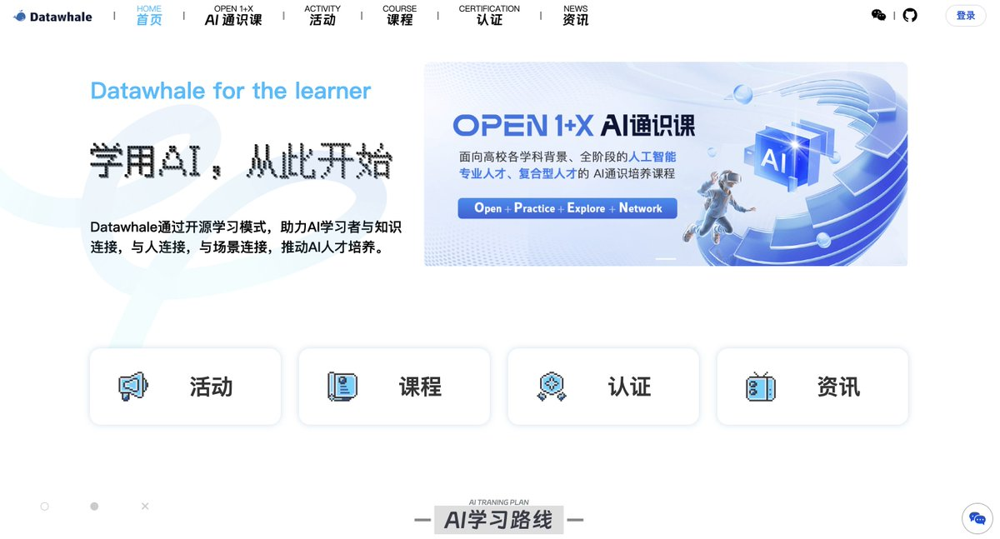

发现一个学习AI知识的网站：Datawhale
这是一个专注于AI与数据科学的开源组织，其网站收集了不少关于人工智能的开源课程，从初级到高级都有涉猎，课程全是最新的，感兴趣的可以瞧一瞧。
网站：[datawhale.cn/home](https://www.datawhale.cn/home)
GitHub：[github.com/datawhalechina](https://github.com/datawhalechina) 

## 💬 Replies

### 1 @MiraNetworkCN (Mira (3/3) | 中文社区 🁢🁢🁢)

*Sat Feb 08 21:58:11 +0000 2025*

@knowledgefxg 很有意思。

### 2 @EthanSynthMind (Ethan_PolyPredict AI)

*Sat Feb 08 16:35:19 +0000 2025*

@knowledgefxg 课程更新快，跟上趋势很重要。

### 3 @Avery_Ai_infra (Avery)

*Mon Feb 10 06:19:15 +0000 2025*

@knowledgefxg 從初級到高級的 AI 課程都有，Datawhale 的資源確實值得收藏，感謝推薦

### 4 @helson170699890 (murphy)

*Sun Feb 09 01:56:22 +0000 2025*

@knowledgefxg 他们有专门的夏令营之类的活动，我还有他们的vx🥳🥳🥳

### 5 @kingwang76 (king)

*Sat Feb 08 15:59:40 +0000 2025*

@knowledgefxg @readwise save

