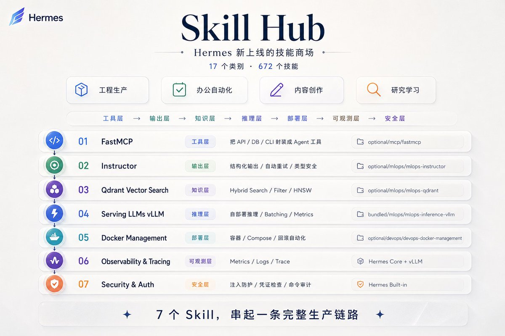
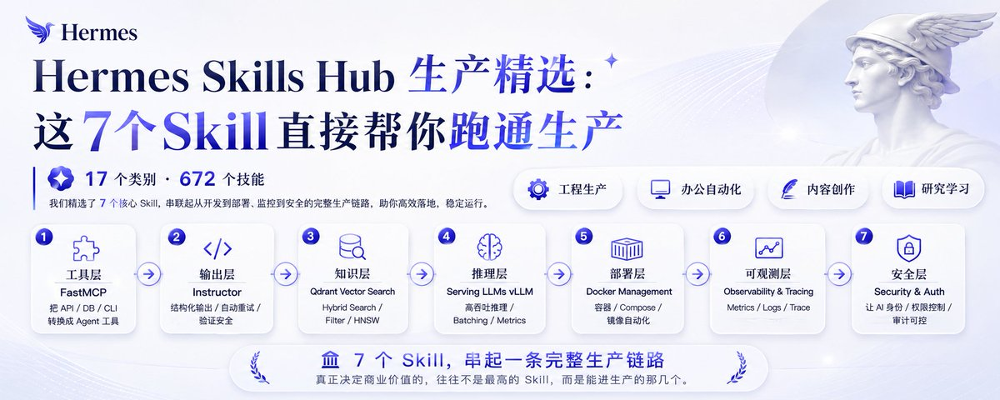

# 📰 Hermes Skills Hub 生产精选：这7个Skill直接帮你跑通生产

hermes的skill hub技能商场上线了🥳🥳 

17个类别，672个技能，里面包罗万象，大概可以分为四类

我帮大家归类出了7个可落地，能接入生产的skill，它们连起来刚好是一条线：工具层 → 输出层 → 知识层 → 推理层 → 部署层 → 可观测层 →安全层。

## 一、fastmcp

路径： optional/mcp/fastmcp

Agent 用它来接触真实业务系统

fastmcp 做的事情很简单：把你内部的 API、DB、CLI 包装成 Agent 能调的工具。

它提供了一个脚手架，scaffold\_fastmcp.py 一键生成模板。写工具用 @mcp.tool，命名用 verb-based，docstring
写清楚类型。本地开发跑 fastmcp run / inspect / call，上线转 HTTP endpoint。

他在实际生产中：

▎ auth 走环境变量，不硬走编码。会把错误全报出来

## 二、Instructor

路径：optional-skills/mlops/instructor

不夸张地说，很多 AI 项目翻车都是同一个问题：

模型能答，但答出来的东西不能落库，不能进 workflow。

Instructor 解决的就是这个问题。

它基于 Pydantic，做三件事：

> 结构化输出
自动重试
类型安全解析

用法很直接：

from openai import OpenAI

import instructor

client = instructor.from\_openai(OpenAI())

result = client.chat.completions.create(
model="gpt-4o-mini",
response\_model=MyModel,
messages=\[{"role": "user", "content": "..."}\],
)

你不再只是让模型“回答一段话”，
而是让模型输出一个系统可以直接消费的对象。

有了 Instructor 

▎模型就不只是在聊天，而是正在进入生产。

## 三、qdrant-vector-search

路径： optional/mlops/mlops-qdrant

FAISS 是玩具。Qdrant 是生产。

Docker 一键启动，Python client 操作。功能清单很简单：

- hybrid search

- 多向量

- metadata filter

- 量化

- HNSW

- Raft 分布式

- on-disk payload

> client.create\_collection()
upsert()
search(query\_filter=Filter(...))

换 Qdrant 之后最直观的感受：延迟可控了，扩展不慌了，filter 精准了。

## 四、serving-llms-vllm

路径： bundled/mlops/mlops-inference-vllm

不想被 API 供应商锁死的话，vLLM 是最成熟的自部署方案。

一行启动：

> vllm serve model --quantization awq --tensor-parallel-size N

内置 PagedAttention、continuous batching、prefix-caching、Prometheus metrics。

也支持 OpenAI API 兼容和离线 batch。

自己控成本、控延迟、控合规。三控都在自己手里。

## 五、docker-management

路径： optional/devops/devops-docker-management

这个在实际生产比较常用，

覆盖 Docker / Compose 全生命周期：

- 容器起停、exec、logs

- image prune

- volume / network cleanup

- Compose up / down / config

- 健康检查模板

Agent 自己能管容器 = 部署、运维、回滚全自动化。

## 六、Observability & Tracing

不是独立 Skill，是 Hermes 核心 + vLLM metrics 的组合。

生产里最痛苦的事是系统挂之后不知道哪挂了。

这套东西做的事：

- vLLM 内置 Prometheus，暴露 TTFT、请求数、GPU cache

- Docker logs

- Skill 执行 trace

Agent 被训练成：先查 metrics，再关联日志。

跑通之后，出问题 10 秒内能定位是 MCP 挂了、RAG 慢了还是 inference 爆了。

## 七、Security & Auth

也是 Hermes 内置的，不是独立 Skill。

所有 Skill 安装时自动做三件事：

1. 扫描：防 prompt injection

1. 检查：防 credential 泄露

1. 审计：防 destructive command

MCP 层强制 env var auth + command approval + container isolation。

开箱就有，不需要自己搭。

其实这 7 个东西排在一起，逻辑很清楚：

MCP 打底 → 模型能碰系统
Instructor → 输出能落库
Qdrant → 知识能检索
vLLM → 模型能自跑
Docker → 部署能自动化
可观测 → 挂了能定位
安全 → 暴露了能兜底

自己可以动手装一下，体验一下

> hermes skills install fastmcp
hermes skills install instructor
hermes skills install qdrant-vector-search
hermes skills install serving-llms-vllm
hermes skills install docker-management

### 🖼️ Attached Media

