# 📰 Gemini Chrome (Chrome AI) 最全激活指南：看这一篇就够了，亲测有效！

Gemini Chrome 早在 25年9月份就正式发布了，不知道为啥 X 平台到处都是教程，这次仅是 Gemini Chrome小更新，还没有兑现上次官方宣布即将推出的 Agent能力，依旧没法和 Claude for Chrome 插件相比，说实话我对这次不痛不痒的更新是失望的。

早在去年 9月份我就发布了多篇体验和教程文章，算是国内早期体验者，我的粉丝也早早就体验到了。X 上出现了即使账号不是米国也可体验到 Gemini Chrome 的教程，不过，大多是模棱两可，粗制滥造，且同质化严重。我真心看不下去了，今天就出一篇完整的教程，关于 Gemini Chrome 看我这篇就够了。

我之所以敢自称“教程天花板”最重要的原因是我出的教程不仅让大家知其然，更知其所以然。

话不多说，咱们开始。

# Gemini Chrome 到底是什么？

它的全称叫 Gemini in Chrome，从字面意思就可以看出，它是原生深度嵌入 Chrome 浏览器的一个 AI 助手，我们只需点一下右上角图标，或者直接按下快捷键（Alt+Q），它就会从侧边栏弹出，它会自动识别当前界面，我们只需输入对话，Gemini Chrome就会自动总结和分析界面。如下图所示。

# Gemini Chrome 有什么价值？

以往我们使用 AI 工具有一个巨大的痛点：提供上下文极其繁琐。为了让 AI 理解我们的意图，我们需要不断地复制粘贴文本、上传文件、截图。我们花费了大量时间在喂信息，而不是在解决问题。

而 Gemini Chrome 的革命性价值就在于，它能自动、无缝地理解你正在浏览的内容。

懂上下文工程的朋友都知道这意味着什么。上下文工程，就是“为语言模型提供足够背景信息，使任务具备可解性的艺术”。

Gemini Chrome 让你不再需要繁琐地上传截图或复制文本，Gemini Chrome 就在那里，随时准备基于你眼前的页面，甚至多个页面进行分析、总结、创作。

这种行云流水的体验，才是 AI 时代该有的样子。

推荐阅读：[Gemini Chrome 的体验简直“离谱”，这才是浏览器 AI 该有的样子](https://x.com/LipuAIX/status/1995088496269414891?s=20)

## 本次 Gemini Chrome 更新了什么？

根据官方文章《The new era of browsing: Putting Gemini to work in Chrome》，本次核心更新点如下：

一是：推出 Auto Browse（自动浏览）：不是Agent功能，只能说是接近，它能帮你处理多步骤任务。比如搜索多个日期的酒店和机票并比价，甚至能识别照片中的物品并将其添加到购物车 Auto Browse。

二是：新增侧边栏（Side Panel）交互方式：相比以前用户点击Gemini图标会出现对话弹窗外，现在对话窗口可常驻侧边栏，两者交互方式也可切换。

三是：加入Nano Banana 图像转换能力：结合了Nano Banana模型，你可以直接在侧边栏输入文字提示，修改或转换网页上的图片，不需要下载再上传。

四是：Connected Apps（关联应用）深层集成：它可以直接读取你的 Gmail、日历、地图等数据。例如，从邮件里找会议时间，然后结合 Google Flights 给你推荐航班。

## 如何才能体验到 Gemini Chrome？

## 背景信息

Gemini Chrome 只在米国开放了，所以要切换至米国线路，其次要确保 Google账号所在地是米国（最关键），最后则是 Gemini 是Pro或Ultra会员。

只要满足以上三个条件，就会得到 Google官方下发 Gemini Chrome体验真正的资格。

## 如何查看Google账号所在地？

在 Gemini界面上，点击右上角的头像，点击服务条款，在服务条款中可以看到账号所在的国家或地区。如下图所示：

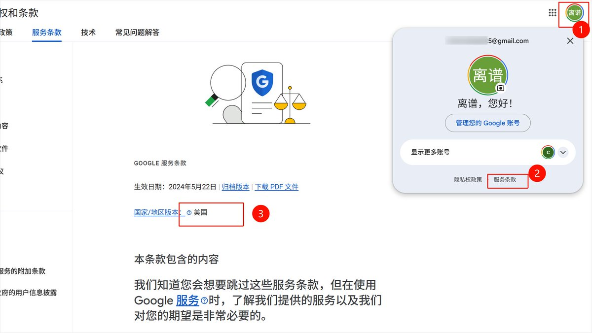

## 如何查看账号获得了官方下发的 Gemini Chrome 使用资格？

在 Chrome浏览器地址栏中输入 chrome://sync-internals 并回车，点击上面Tab “Sync Node Browser” ，接着点击 “Priority Preferences” 文件夹，查看是否存在一个名为 “sync.glic\_rollout\_eligibility” 的条目，点击后，右侧会出现“true”的资格确认/开启代码。如下图所示。

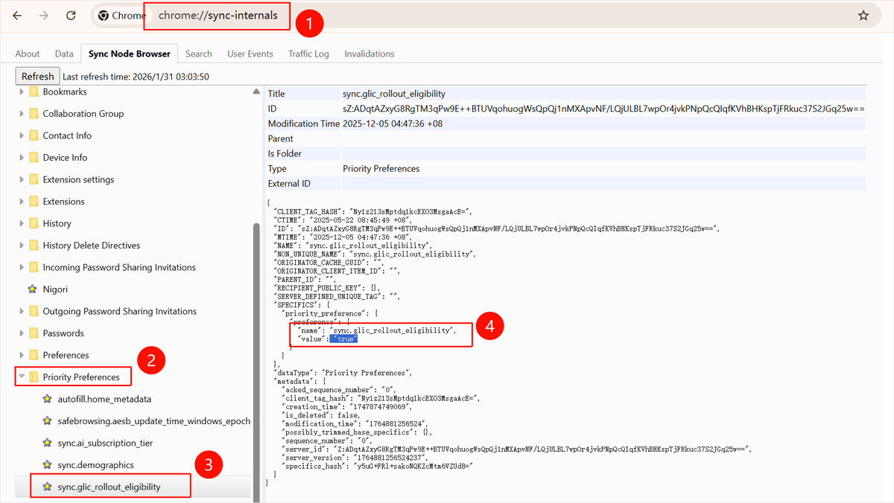

若没有“sync.glic\_rollout\_eligibility”则说明你的账号没有资格。

# 那么又该如何做才能体验到 Gemini Chrome？

方式一：通过寻找客服或者修改账号支付资料再或者保持米国IP一段时间，就可以将账号所在地更换到米国，甚至直接在米国IP下注册一个新的谷歌账号，在 Chrome登录后会自动获取到官方下发的真正资格。

方式二：你要么通过“邪修”方法：如@小互，@苍何等人推荐的脚本修改法或者其他博主推荐的修改快捷方式/命令行启动。这些方法的原理都是为了让 Chrome 以为你在美国，之所以这些邪修方法能成功，主要原因是 Chrome 对 Gemini Chrome 功能的校验逻辑其实主要卡在“国家/地区”这一关。

当然，这种邪修方法相比有真正资格的账号有一些弊端：

因为这种方法本身没有改变账号所在地（云端），只是在本地进行了操作（伪造），所以这种方法往往对此电脑，当前浏览器的配置是有效，若你的账号在新设备上登录的话，重置或卸载 Chrome 浏览器设置，可能需要你重新运行一次脚本。

另外，该邪修方法可能存在一些后遗症，如必须修改浏览器语言为英文或者需修改电脑设置中所在的国家/地区为米国。

所以，我更推荐大家将自己账号所在地更改为米国，或者干脆重新注册一个新号，不但一劳永逸而且稳定。

若若这些方法都尝试了还未出现 Gemini的图标的话，则可能是 Glic功能没有打开，可以在 Chrome 地址栏输入“chrome://flags/”，进入 Experiments（实验室），依次开启Glic、Tabstrip Combo Button和Glic side panel，即 Default 改成 Enabled，最后点击右下角的“重新启动”即可。如下图所示。

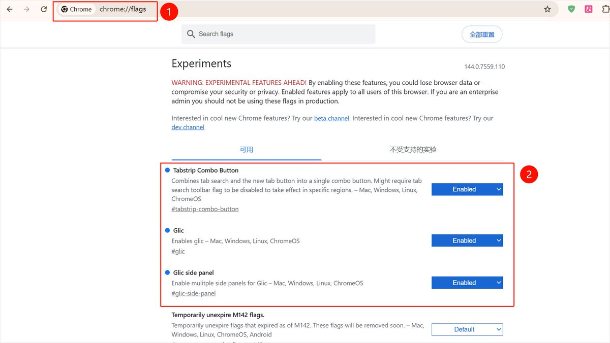

说明：这里的 Glic 其实就是谷歌内部对 Gemini Live in Chrome（或者更广泛的 Chrome AI 助手项目）的代号。

Tabstrip Combo Button (标签栏组合按钮) 把标签搜索（Tab Search）和新建标签页按钮合并或调整位置。简单说这是给 Gemini 图标腾位置的。

Glic (核心开关)：启用 Glic，这是 Gemini 助手的总开关。

Glic side panel (Glic 侧边栏)：启用 Glic 的多个侧边栏。这是本次更新的新的交互方式——侧边栏。若大家将 Chrome 浏览器更新至最新后（Win版本 144.0.7559.110），发现设置中侧边栏配置是置灰状态，如下图所示，则可以在这里将Glic side panel开启。

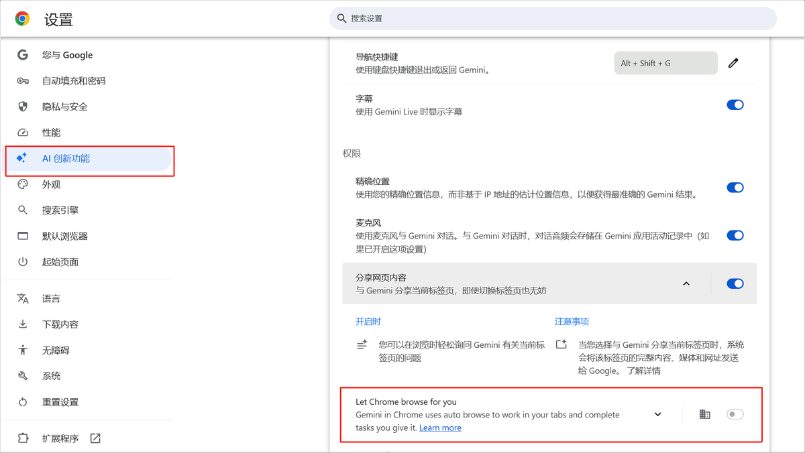

# 脚本修改法（以 Windows电脑为例，仅展示邪修）

## 背景信息：

1\. 原理：直接修改 Chrome 存储在硬盘上的 Local State（本地状态文件） 。 脚本会找到这 个 JSON 文件，强行写入两行代码："variations\_country": "us"（修改国家）"is\_glic\_eligible": true（强行声明有资格） 。

2\. 效果：这是一个物理层面的修改。修改后，即使你以后正常双击 Chrome 图标（不带任何参数），浏览器读取配置文件时，依然会看到伪造的信息。

具体方法来自：Github lcandy2/enable-chrome-ai 项目

## 前提条件：

谷歌账号所在地不在米国。

## 操作步骤：

步骤一：环境准备。你需要确保电脑上有 Python。检查 Python：按 Win + R，输入 cmd 回车，在命令行窗口中输入 python --version 。

说明：版本必须在 3.13以上。如果没装或版本低，请去Python 官网下载安装，记得勾选"Add Python to PATH"。

步骤二：安装 uv 工具。uv 是一个极速的 Python 包管理器，能帮你省去很多报错麻烦。

1\. 在电脑开始搜索框中搜 PowerShell，右键以管理员身份运行。

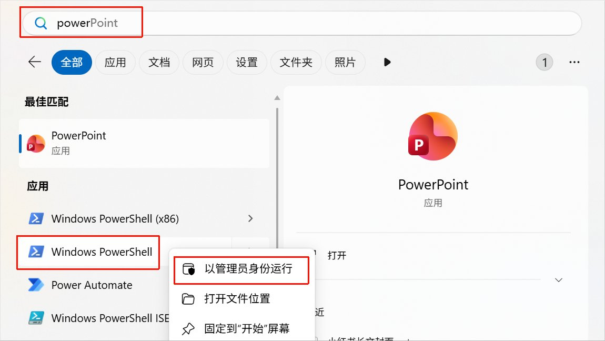

2\. 粘贴并运行以下命令：

\`\`\`
powershell -ExecutionPolicy ByPass -c "irm https://astral.sh/uv/install.ps1 \| iex" 
\`\`\`

窗口会显示下载和进度，完成后输入 uv --version，如果出现 uv 0.x.x，如下图所示uv 0.9.28则说明成功了。

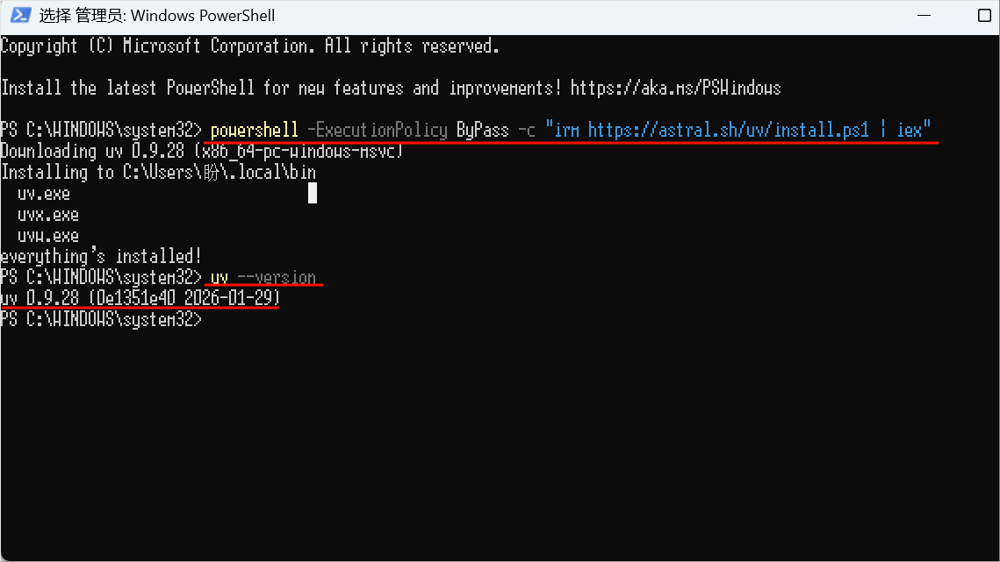

步骤三：下载 lcandy2/enable-chrome-ai 项目

方式一：直接使用Git 命令拉取项目（推荐）

1\. 确保已安装 Git。在命令窗口输入 git --version 。如果显示版本号，继续下一步；如果报错，请先去官网下载安装 Git。

2\. 执行克隆命令。在命令窗口（CMD 或 PowerShell）中，依次执行以下两条命令，进入项目文件夹。

\`\`\`
1\. git clone https://github.com/lcandy2/enable-chrome-ai.git
2\. cd enable-chrome-ai
\`\`\`

说明：执行完 cd 命令后，你的命令行前缀路径应该会变成...\\enable-chrome-ai&gt;，这说明你已经成功进入了文件夹。

3\. 依次输入以下命令。接着重启 Chrome 就可以看到 Gemini 角标了。

\`\`\`
1\. uv sync 
2\. uv run main.py 
\`\`\`

方式二：直接下载并解压该项目。

1\. 浏览器地址栏输入此链接，进入该项目。

\`\`\`
https://github.com/lcandy2/enable-chrome-ai
\`\`\`

2\. 点击 Code，在下拉栏中点击 Download ZIP，下载项目压缩包。

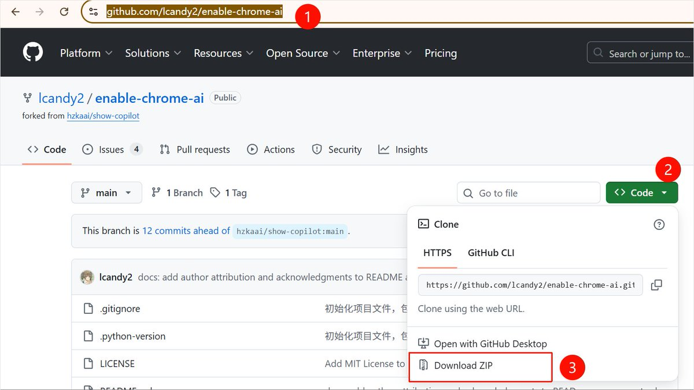

3\. 解压该项目压缩包后，进入该文件夹中，在地址栏上输入 cmd 并回车，进入该项目的命令行窗口。

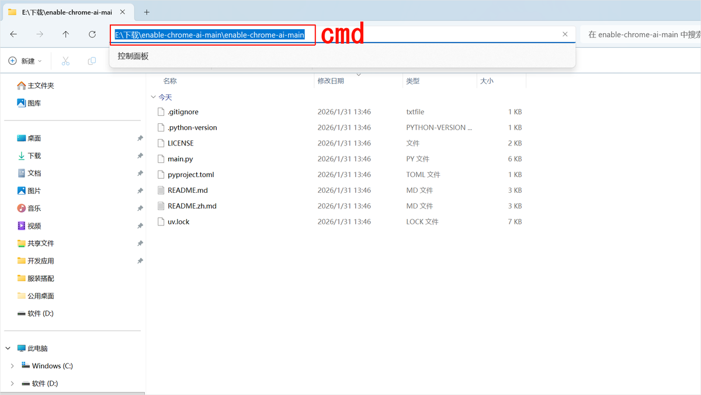

4\. 同步环境：在命令窗口输入 uv sync 下载程序。如下图所示：

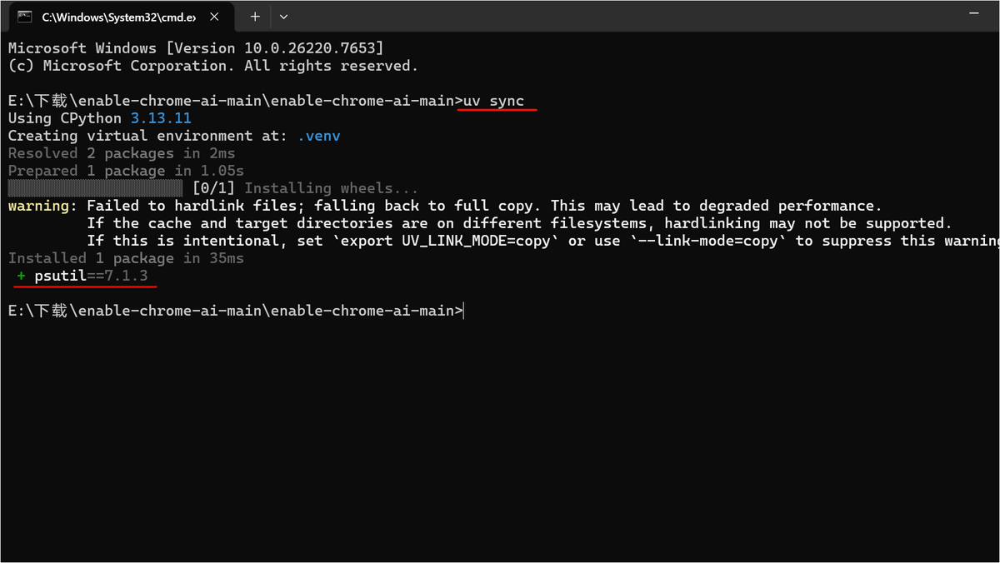

5\. 执行修改：输入以下命令，此时 Chrome 会被强制关闭和重启

\`\`\`
uv run main.py
\`\`\`

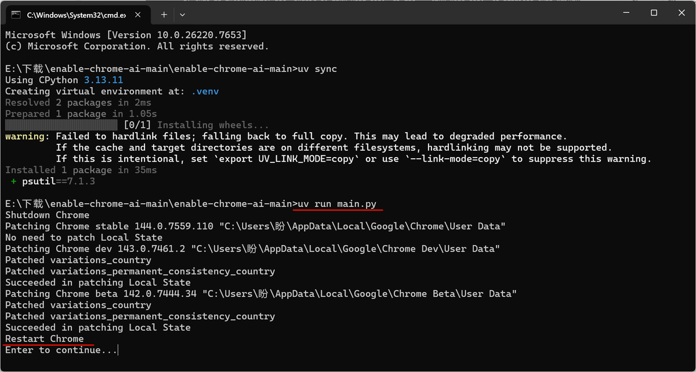

不出意外，Chrome 浏览器右上角会出现 Gemini角标了。

——结束

## 异常情况处理

若执行了以上脚本还是没有出现Gemini角标的话，可以执行以下操作：

1\. 确保完全退出 Chrome：脚本执行前，请按下 Ctrl + Shift + Esc 打开任务管理器，确认没有任何chrome.exe 进程在后台。如果进程没杀干净，脚本无法修改配置文件。

2\. 语言锁死： 即便运行了脚本，如果你的 Chrome 界面语言是“中文”，图标可能还是出不来。修正：进入 Chrome 设置 -&gt; 语言 -&gt; 将"英语 (美国)" 置顶，并点击“以这种语言显示 Google Chrome”，然后重启。

3\. Flag 手动干预：如果图标还没出来，在地址栏输入 chrome://flags，搜索并启用以下三个实验项（改为Enabled）：Tabstrip Combo Button、Glic、Glic side panel。

# 快捷方式/命令行启动法

相比于 Python 脚本修改，快捷方式/命令行启动法则更加轻量、安全，且不需要安装任何额外的编程环境。

## 背景信息：

核心原理：利用Chrome 自带的调试参数--variations-override-country=us，在启动时强制覆盖地区检测。

## 前提条件：

1\. 谷歌账号所在地不在米国。

2\. 确保已彻底关闭 Chrome浏览器：Windows：检查任务栏，确认没有 Chrome 图标。最好打开任务管理器，确保后台没有chrome.exe 进程。macOS：在 Dock 栏对着 Chrome 图标右键 -&gt; 退出，或者按 Command + Q。

## 操作步骤（ Windows和 macOS系统）

步骤一：找到快捷方式在桌面找到 Google Chrome 的图标。

说明：必须是快捷方式图标（左下角带小箭头），不能是任务栏上的固定图标。

步骤二：修改目标参数

1\. 右键点击图标，选择“属性”。

2\. 找到“快捷方式”选项卡下的“目标(T)” 一栏。

3\. 关键操作：在原本的路径最后面，先打一个空格，然后粘贴以下代码：

--variations-override-country=us

修改后的样子示例：

"C:\\Program Files\\Google\\Chrome\\Application\\chrome.exe" --variations-override-country=us

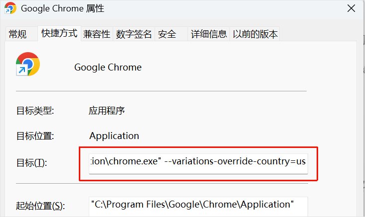

步骤三：保存并运行。点击右下角的“应用”-&gt;“确定”。如果系统提示需要管理员权限，点击“继续”。双击这个修改过的快捷方式启动 Chrome。

——结束

Mac 用户无法像 Windows 那样直接修改图标属性，需要通过终端（Terminal）来启动。

步骤一：打开终端按Command + 空格，搜索Terminal或终端 并打开。

步骤二：输入启动命令复制以下整行代码，粘贴到终端里，然后按回车：

open -n -a"Google Chrome" --args --variations-override-country=us

步骤三：成功启动Chrome 会自动弹出来。此时你可能需要重新登录一下账号，或者看到欢迎页。

启动浏览器后：若右上角是否出现了一个 Gemini图标则表示成功了。如果没出现，请点击地址栏，输入chrome://flags，确保以下三个选项是Enabled 状态：Tabstrip Combo Button 、Glic 、Glic side panel ，最后重启浏览器即可体验。

说明：这个方法是“一次性” 的。Windows 用户：必须通过你修改过的那个快捷方式打开才有效。如果你点击微信里的链接自动唤起 Chrome，或者直接点任务栏图标，那个参数就不会生效，Gemini 功能会消失。

Mac 用户： 必须每次都用这行命令启动。为了方便，你可以把这行命令做成一个 Automator (自动操作) 的 App 放在桌面上。

---

如果你受够了 AI 圈的营销号，想看真正的人使用 AI 如何破局现实难题，欢迎关注我和我的公众号【稀有学生】。以下是我的介绍，不知道能否打动你？[《我是离谱，一个粉丝不多但坚持搞硬核内容的 AI 实战派》](https://x.com/LipuAIX/status/2007092205857775671?s=20)

### 🖼️ Attached Media

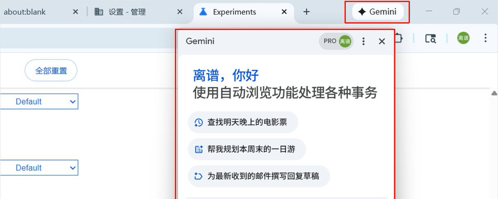

## 💬 Replies

### 1 @wavesdylan (浪、大浪)

*Sat Jan 31 14:51:44 +0000 2026*

@LipuAIX 感谢大佬！另外问一下，这个“let chrome browse for you”怎么开启啊？已开AI pro。提示：此设置由您的管理员管理。可这是我的个人账号啊。 

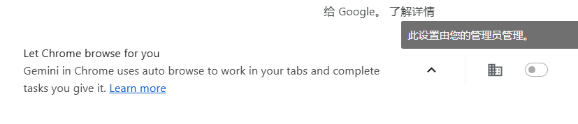

### 2 @LipuAIX (离谱) (Author)

*Sat Jan 31 16:25:00 +0000 2026*

@wavesdylan 一看你们就没有认真看文章。地址栏搜索chrome://flags/，搜索并开启Glic side panel，重启浏览器即可。 

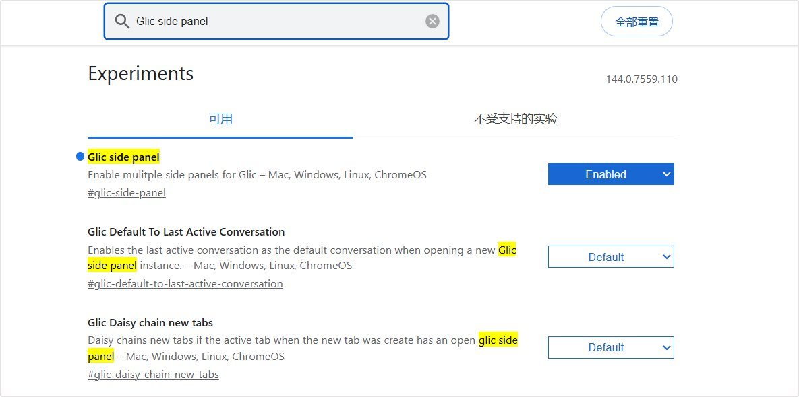

### 3 @cliuxinxin (Liuxinxin)

*Sat Jan 31 15:38:29 +0000 2026*

@LipuAIX 谢谢你，离谱侠 

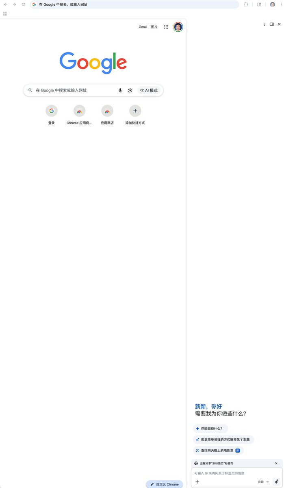

### 4 @LipuAIX (离谱) (Author)

*Sat Jan 31 16:23:30 +0000 2026*

@cliuxinxin 可以的😄

### 5 @bigplay27081138 (bigplayer)

*Sat Jan 31 15:24:14 +0000 2026*

@LipuAIX 我试了一下win的话，不需要这么麻烦，chrome右击属性目标了加一行代码，开美国节点，chrome里语言改成英语。不需要谷歌账号是美国。这样就可以用。我自己是台区的帐号，实验是成功的。现在比较担心台区账号一直挂美国节点会不会封号。

### 6 @LipuAIX (离谱) (Author)

*Sat Jan 31 16:26:04 +0000 2026*

@bigplay27081138 你这种情况，文中也提到了，算是邪修，并不是官方真正的资格。

### 7 @gymnofghj (yunoshima)

*Sat Jan 31 15:50:37 +0000 2026*

@LipuAIX @readwise save thread

### 8 @qsGFJ5Kl1dcCnTh (山月沙花)

*Sat Jan 31 14:02:20 +0000 2026*

@LipuAIX 感谢，太厉害了

### 9 @QikunXie (Nickel-3（学习版）)

*Sat Jan 31 15:26:16 +0000 2026*

@LipuAIX 学习啦，昨天开了

### 10 @livermoerR (livermoer)

*Sat Jan 31 14:26:15 +0000 2026*

@LipuAIX 非常详细

### 11 @rayidea (ray)

*Sun Feb 01 01:05:41 +0000 2026*

@LipuAIX 这个有点复杂，有一个简单的，直接让G家的Anit那应用自己部署就完了

### 12 @DavisNc9527 (Davis.AI.Explorer)

*Sat Jan 31 14:44:04 +0000 2026*

@LipuAIX 写的太详细了，赞一个鼓励

### 13 @Lauzs3 (Lauzs)

*Sun Feb 01 05:30:59 +0000 2026*

@LipuAIX 感谢！

### 14 @guozheng055 (guozheng727)

*Sun Feb 01 17:36:17 +0000 2026*

@LipuAIX @grok 整理给我一份

### 15 @ningyuwhut (ningyu)

*Tue Feb 03 02:28:02 +0000 2026*

@LipuAIX 赞，设置完果然出现了

### 16 @BGjsiHH8ZF3864 (MaxChan)

*Sat Jan 31 15:40:23 +0000 2026*

@LipuAIX MacOS要把语言设置成英语（美国）

### 17 @hengtong (Root)

*Sun Feb 01 05:48:43 +0000 2026*

@LipuAIX 按照上面的操作，提示：Gemini in Chrome isn't available in your location This feature isn't available in your location yet.

这是怎么回事？使用的是美国节点 

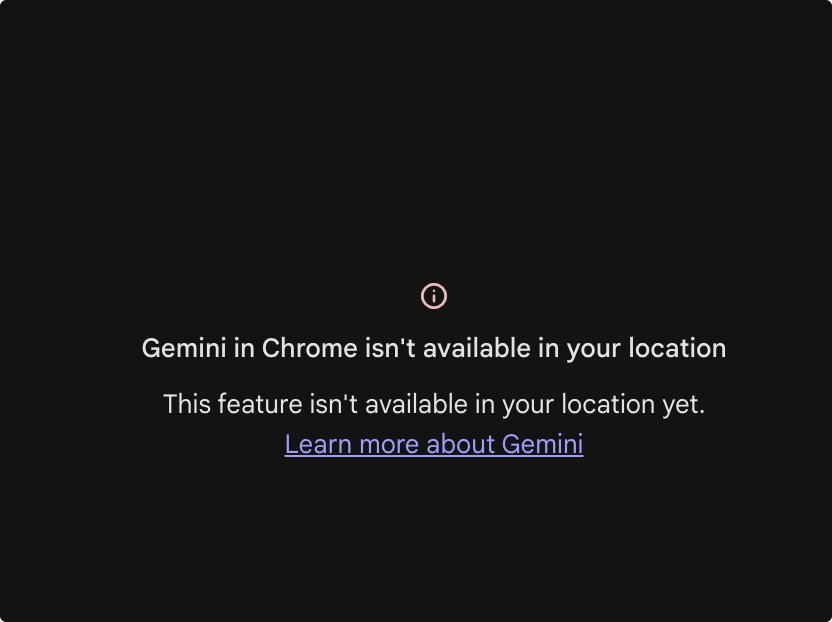

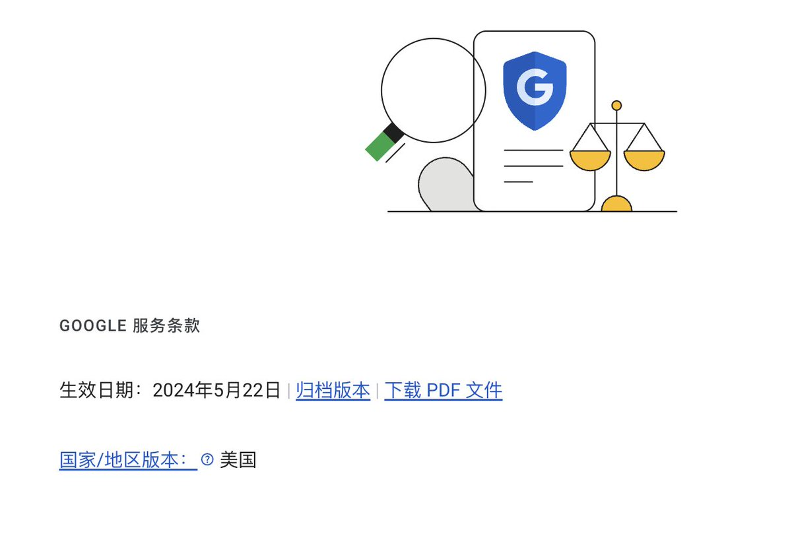

### 18 @alicechen300 (Alice Chen)

*Tue Feb 03 02:19:11 +0000 2026*

@LipuAIX 真的有用，感谢

### 19 @xhoox123 (xhoox)

*Sat Jan 31 14:39:35 +0000 2026*

@LipuAIX 我的有点奇怪，服务条款显示美国，但没有“sync.glic\_rollout\_eligibility”，而"is\_glic\_eligible": 是根据chrome的界面语言切换来变化的，我手动修改重启后它会自动改回去，chrome的界面语言为英语时"is\_glic\_eligible":true，可以正常显示gemini，不需要修改其他东西

