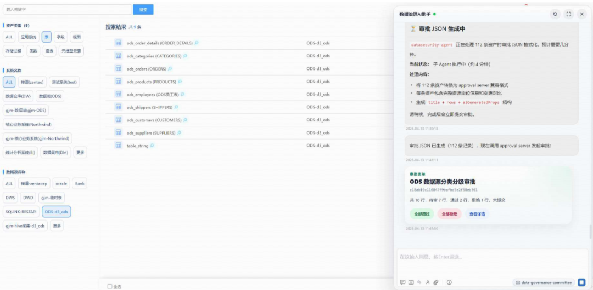
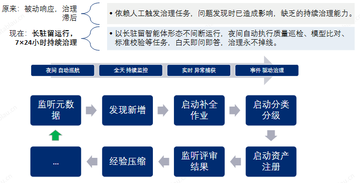
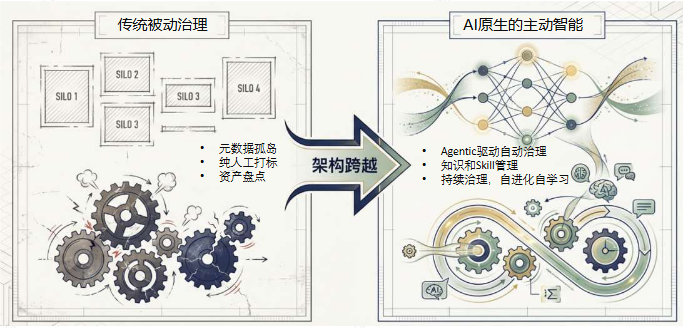
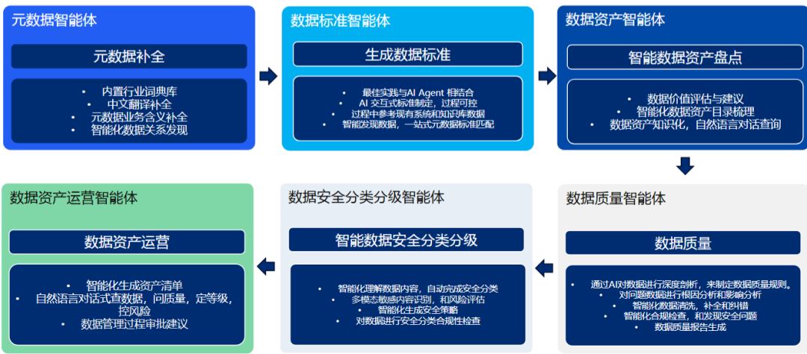
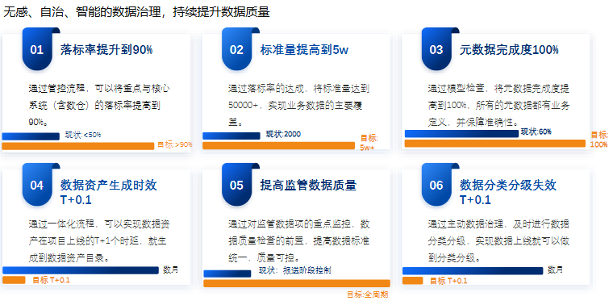

# 📰 数据治理90%的人第一步就错了，我用一张表理清了所有问题

老板说上平台，你说先建数仓，隔壁部门说先买工具……结果三个月过去了，连第一张表都没定下来。

这真不是段子，是我亲眼见过无数公司的真实状态。数据治理这事，90%的人错在第一步——不是选工具，不是建架构，而是先问自己：我的数据到底在哪儿？

## 一、数据治理前必须搞清的3个问题

先别急着买工具。先花半小时，把这3个问题搞清楚，比你读十本数据治理的书都有用。

### 自测3问

## 1. **核心业务数据在哪？**

    CRM里？ERP里？Excel里？还是纸质单据上？

## 2. **谁在管理这些数据？**

    是IT部门统一管，还是业务自己存自己删？

## 3. **这些数据当前“能用”的比例有多少？**

    随便拉一张表，看看字段有没有空值、有没有重复、有没有你根本看不懂的缩写。

## 二、从哪张表开始？——数据治理路线图

我踩过最大的坑就是：想一次性管好所有表。别傻了，那不是治理，是找死。

### 正确做法：按“业务频率+影响范围”分层

|层级 | 数据类别  |      举例      |治理优先级 |
|---|-------|--------------|------|
|L1 |核心业务实体表| 客户表、订单表、产品表  |⚡ 第一优先|
|L2 |业务交易流水表|销售明细、采购明细、库存变动| 第二优先 |
|L3 |配置/维度表 |组织架构、人员信息、产品分类| 第三优先 |
|L4 |日志/中间表 | 操作日志、ETL中间表  | 最后处理 |

### 实操5步，一步都不能跳

### 第1步：找到那张最痛的表

哪个业务天天问“数据对不上”？哪个报表一出就吵架？那张表就是你的起点。大多数公司第一张要管的，是**客户表**——因为几乎所有业务都依赖它：销售用，财务用，运营用，服务用。它乱了，全乱。

### 第2步：定唯一ID

什么才算“同一笔数据”？客户号、订单号、产品编号——跟业务方坐下来，把这事定死。不然A系统和B系统说“张三”，一个写“张三”，一个写“Zhang San”，你觉得AI能干啥？

### 第3步：清理存量

去重、补缺失值、字段标准化。把历史上那些“脏数据”全部揪出来。我见过一张表里，同一个客户名写了3种写法：全称、简称、拼音缩写。不讲这个笑话，你自己想。

### 第4步：锁增量

系统里开一个字段叫“填表规范”，推送提示。不允许再乱填。这一步叫“止血”——不清掉新进来的脏数据，前面都白干。

### 第5步：建立“表间血缘”

知道A表和B表怎么关联。比如客户表和订单表怎么连的？用客户号还是订单号？把这个关系写清楚、固化下来，成为文档。以后谁来了都不会被搞乱。

## 三、落地工具链：我自己的实操链路

### Step 1：用IMA做数据资产盘点

我习惯在IMA里建一个叫“数据治理”的知识库。然后把所有数据库表、字段、业务含义结构化地梳出来——建脑图、建树状结构。这件事不做，你都不知道自己有多少“家底”。

### Step 2：导出字段字典到Excel

把知识库里那些定义好的字段拍平到Excel里，一个个标上：哪个字段是核心字段、哪个是辅助字段、有没有和别的系统重复定义。这一步会非常痛苦但极其重要。

### Step 3：用SQL/Python做批量清洗

几个简单的SQL：去重、统一格式、标重复值、输出不可用清单。或者更省事的，直接上低代码平台如网易有数、简道云——做一次清洗配置，后面自动跑起来。

### Step 4：写数据质量看板

把清完的数据挂到看板上。核心监控指标：字段完整率、重复率、一致率。不看不知道，一看吓一跳。我第一周看到的完整率才73%——也就是说，三成关键字段都是空的。

---

## 四、从“数据孤岛”到“数据资产”：一些我的发现

读完帆软的王府井免税案例，我最大的感触是：数据治理的终点不是“把数据整理好”，而是**让数据能用起来**。王府井从数仓到BI、从指标体系到经营分析会，用了8年时间才跑通这个闭环。

但我们现在有这个条件了。IMA + 低代码平台 + 开源调度工具，从数据盘点开始，3到6周就能出一个最小可行版本。不是等所有表都管完才用，而是先管好一两张核心表，让业务看到效果，信心就有了。

数据治理不是基建工程，是认路。第一步不是修路，是知道自己在哪。

**你公司现在到哪步了？评论区说说，我帮你画路线图。**
