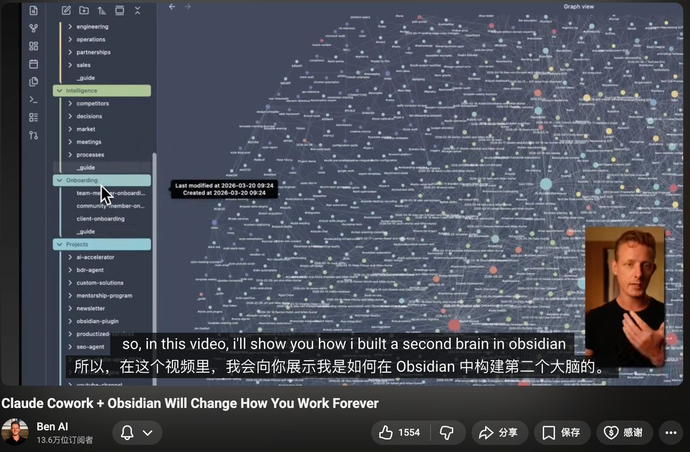
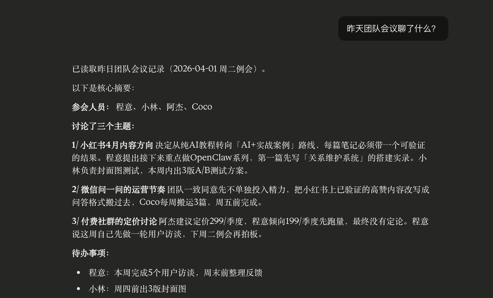
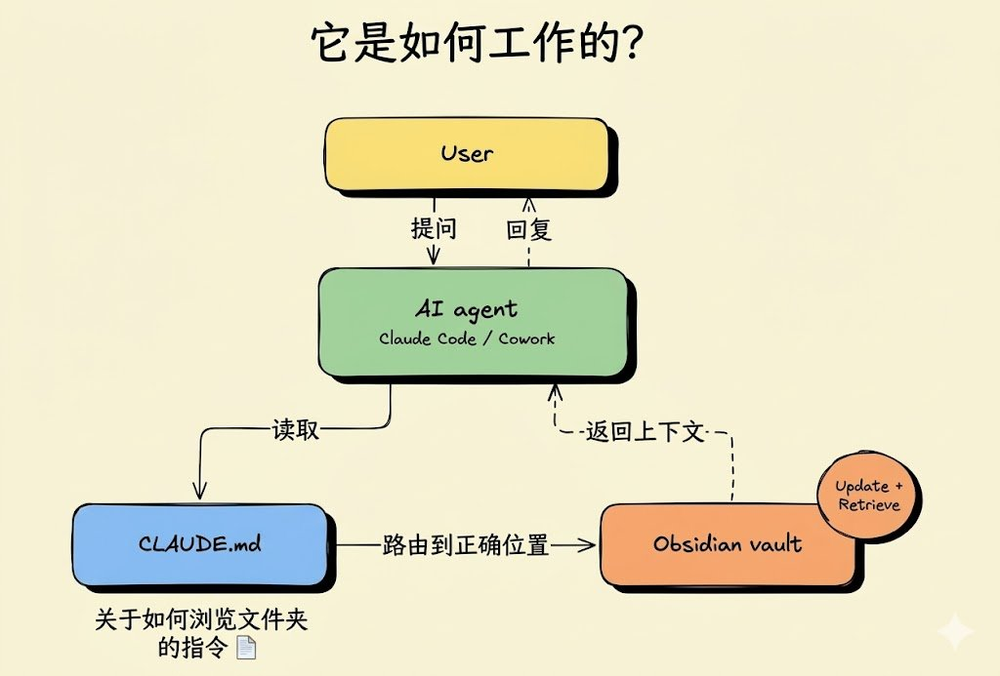
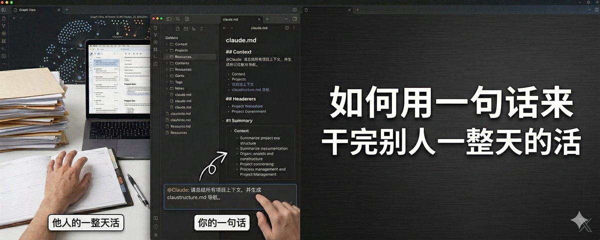

# 📰 如何用一句话来干完别人一整天的活

最近看到一个老外做了一件事，看完我觉得我过去一年用AI的方式全是错的。

他用Obsidian给自己搭了一个「第二大脑」，然后把Claude Cowork、Claude Code这些AI工具全接进去。

什么意思？

就是他的AI不再是一个失忆患者了。

你现在用AI是什么体验？每次开一个新对话，都得重新介绍一遍：我是做什么的、我的客户是谁、我的项目进展到哪了、我的写作风格是什么样的。

跟AI聊天跟鱼聊天一样，说完就忘，下次还得重来。

我自己也是这样。之前用Claude写东西，每次都得先贴一堆背景资料，告诉它我的受众是谁、风格是什么、哪些词不要用。一次两次还行，一天用十几次就疯了。感觉自己不是在用AI，是在给AI做入职培训，而且这个新员工每天早上都失忆一次。

但这哥们搞完这套系统以后，画风完全变了。

他开一个新对话直接说：

「What should I focus on today」

就这么一句话。

AI自动调出他的项目进度、团队会议记录、本周优先级排序，精准告诉他今天该干三件事：改落地页文案、录视频、筹备线下活动。

没有任何前置解释，没有任何背景铺垫，一句话，直接出结果。

他说「帮我根据这周团队会议讨论的AI话题写一篇帖子」，AI自动去翻他这周所有的团队会议记录，找到讨论过的话题，按照他的写作风格、他的受众画像、他的内容调性，直接出一篇完整的帖子。

他问「我们昨天团队会议聊了什么」，AI直接调出昨天的会议转录，把关键信息摘出来给他。

你品品这个效率差距。

普通人用AI：花5分钟解释背景，花3分钟等它生成，看完觉得不对，再花5分钟纠正，来回三四轮，得到一个勉强能用的东西。整个过程20分钟。

这哥们用AI：一句话，10秒钟，90分的精准输出。

20分钟 vs 10秒钟，差了100倍。

而且这个差距会随着时间越来越大，因为他的AI每天都在变强，而你的AI每天都在失忆。

差的不是AI模型，是喂给AI的上下文。

那这套系统到底牛在哪？我觉得有几个点特别值得聊。

第一，它会自己进化。

他在AI对话里随口说了一句：「以后给我写东西别用破折号，把这条记在我的第二大脑里」

然后AI自动把这条规则存回他的第二大脑，具体写进了「写作偏好」这个文档里。

从这一刻开始，不管是写小红书笔记的技能、写公众号文章的技能、还是写朋友圈文案的技能，只要调用了写作偏好这个文件，全部自动遵守这条规则。

不用说第二遍。

你想想这意味着什么。

你用了三个月，纠正了50条规则，补充了30个偏好，记录了100次决策——你的AI就变成了一个深度了解你的私人助理，而且它永远不会忘。

新来一个实习生，你得花一个月教他你的习惯和风格。但AI接入了你的第二大脑，第一秒就知道你所有的规矩。

三个月前的AI和三个月后的AI完全不是同一个东西。

普通人的AI永远停留在第一天，因为每次对话都是从零开始。

这哥们的AI每天都在升级，因为每次对话都在往第二大脑里存东西。

差距就是这么拉开的。

第二，他把AI技能的搭建逻辑彻底改了。

以前做一个AI技能，比如写小红书笔记的技能，你得在技能文件夹里塞一堆参考资料——你的用户画像、写作风格指南、品牌调性文档、爆款笔记案例。

问题是什么？

你做第二个技能，写公众号长文的，又得塞一遍用户画像、写作风格、品牌调性。

第三个技能，写视频号脚本的，再塞一遍。

十个技能，同样的参考资料复制粘贴十遍。

然后你改了一次用户画像，十个技能里的用户画像文件全是旧版的，你得一个一个手动更新。

这哥们的做法是：所有参考资料都存在第二大脑里，技能文件里只写流程指令，然后指向第二大脑里的对应文件。

他直接让AI重构了自己的技能：「把我的LinkedIn技能改造一下，创建一个新版本，让它去我的第二大脑里读取参考资料，不要把资料存在技能里面」

重构完以后，技能文件里只剩流程指令——第一步去第二大脑读用户画像，第二步读写作风格，第三步按以下流程写内容。

干净利落。

改了一次用户画像文档，小红书技能、公众号技能、视频号技能、朋友圈技能——所有调用这个文档的技能全部同步更新。

一次修改，全局生效。

而且他在第二大脑里专门建了一个Resources文件夹，当作提示词库、模板库、框架库和爆款案例库。所有技能都可以随时调用这个库里的素材。

你攒了100条爆款小红书标题模板存在资源库里，以后不管是写笔记的技能还是写视频号标题的技能，都能直接调用。

一次建设，永久复用。

第三，整个团队可以共享同一个大脑。

这个对做团队的人来说杀伤力最大。

他的团队成员全部接入同一个第二大脑。品牌调性、用户画像、写作规范、项目进度、决策记录——所有人的AI都能读取。

结果是什么？

他团队里一个工程师，本来不会写内容的，用AI接入第二大脑以后，写出来的帖子跟他本人的风格高度一致。

因为所有的上下文——怎么写、写给谁、什么调性、什么忌讳——全在那里，AI照着来就行。

你想想如果你是一个做自媒体的主理人，你的写作风格、选题偏好、品牌调性、用户画像全在第二大脑里，你随便找个助理接进去就能帮你写小红书笔记，质量不会偏离太远。

主理人只需要最后审一眼，改几句话。

以前公司的「标准」在老板脑子里，新人来了靠口口相传慢慢学。

现在标准全在AI能读取的文档里，新人第一天接进去就能产出80分的东西。

从一个人干变成一群AI在干，你只负责把关。

第四，不绑定任何平台。

他的第二大脑在Obsidian里，而Obsidian本质上就是你电脑上一个普通的文件夹，里面都是Markdown文件。

不需要API，不需要云同步，全部本地运行。

你可以给Claude接入这个文件夹，也可以给Kimi接入，也可以给豆包接入，也可以给DeepSeek接入，任何AI工具都行。

他自己演示了：同一个问题分别在三个不同的AI里问，答案基本一致，因为它们读的是同一份上下文。

明天出了一个更好的国产AI，你把文件夹指过去就行，所有积累的上下文一秒迁移。

你的护城河不是工具，是数据。

那怎么搭？说说具体的。

先下载Obsidian，免费的，创建一个Vault，本质上就是在你电脑上新建了一个文件夹。

然后在这个文件夹里搭文件结构。他推荐的结构大概长这样：

Context——你是谁、你的业务、策略、团队、品牌定位、用户画像、客户痛点。这是AI了解你的基础，相当于你这个人的说明书。

Daily——每天的AI对话日志、会议记录、当日决策。这个是保持AI跨对话连续性的关键，没有这个文件夹，AI还是每天失忆。

Projects——正在推进的项目，每个项目一个子文件夹。做自媒体的话可以是每条爆款笔记的复盘一个文件夹，做服务的话可以是每个客户一个。

Intelligence——竞品研究、市场洞察、行业信息、重要决策的记录。你在小红书上看到的竞品爆款拆解、行业趋势分析，全往这里扔。

Resources——提示词库、模板库、框架库、爆款案例库。所有可复用的东西都放这里，AI技能可以随时调用。比如你攒了50条小红书高赞开头话术、30个爆款标题公式、20个选题框架，全存在这。

Skills——各个AI技能的参考文件，用户画像、写作风格指南、品牌调性文档都放这里，技能通过指向这些文件来获取上下文。

Tasks——待办事项和任务清单。

如果是团队用，再加上Departments（部门SOP）和Teams（成员角色分工）。个人用户不需要这两个。

然后最核心的是根目录下那个claude.md文件。

这个文件就是一份导航手册，告诉AI你的文件夹结构长什么样、什么类型的信息去哪个文件夹找、新信息应该存到哪里。

AI每次接到你的问题，先读这个导航文件搞清楚去哪找资料，然后去对应文件夹读取内容，最后回来回答你。

你可以把它理解为AI的导航地图，没有这个文件，AI面对几十个文件夹就跟没装导航的外卖骑手一样，满大街乱转。

有人可能会问：Claude、Kimi不是有内置记忆功能吗，为什么还要搞这么复杂？

因为内置记忆太浅了。

AI的内置记忆就是记住几个基本事实——你叫什么、做什么工作、偏好什么风格。基本上就是一个文档的容量。

而这套第二大脑是几十个、几百个、上千个文档的深度上下文。

两者的区别就像认识一个人的名片和读过他的自传。

名片上写着「张三，某公司CEO」，你知道他是谁。

自传里写着他的创业历程、决策逻辑、踩过的坑、管理风格、用人标准——你才真正了解他。

内置记忆是名片，第二大脑是自传。

你想让AI给你干活，你给它名片还是给它自传，出来的东西能一样吗？

搭完以后日常怎么用，有几个小习惯很关键。

第一，每次开新对话都指向同一个文件夹。这样AI永远能读到你最新的上下文。

第二，对话中遇到值得记住的东西，直接跟AI说「把这条存到我的第二大脑里」。最好具体一点，比如「存到写作偏好里」或者「存到竞品分析里」，AI执行得更准确。

第三，如果AI找信息找歪了，更新一下导航文件claude.md。在里面加一条规则，告诉它「关于XX类信息应该去XX文件夹找」，下次就不会走错路了。

第四，搭AI技能的时候，参考资料不要存在技能里，存在第二大脑里，让技能指向对应文件。这样改一处更新全局。

最后说一个我觉得最重要的点。

这哥们说了一句话：你的竞争对手如果晚你6个月开始搭这套系统，他落后的不是一个工具，是6个月的上下文积累。

模型会更新换代，今天是Claude，明天可能是DeepSeek，后天可能是别的。但你积累的上下文数据不会过期——你的决策记录、你的用户洞察、你的写作规范、你的爆款案例库、你的竞品分析——这些东西换了任何一个AI模型都能立刻用上。

而且他说他刚开始也就5个文件。

不是一上来就搞几百个文档，而是从最基本的开始——你是谁、你做什么、你的客户是谁、你现在在推进什么项目、你的写作风格什么样。

就这5个文件，先跑起来。

然后每天跟AI对话的过程中，信息自然越积越多。一条规则、一个偏好、一次纠正、一个决策——每天存一点，几周以后回头看，已经是一个非常厚实的上下文库了。

这个逻辑跟做自媒体一模一样——你不可能第一天就有一万粉，但你第一天发的那条内容，是所有后续积累的起点。

先跑起来的人，后面的人追不上。因为你追的不是一个工具，是别人用这个工具积累了几个月的数据资产。

数据资产追不上，工具再好也白搭。

### 🖼️ Attached Media

## 💬 Replies

### 1 @yijiangren (Metamental | 方外之域)

*Thu Apr 02 15:37:28 +0000 2026*

@ChengYi3629 ai时代 比的就是谁更快

### 2 @ChengYi3629 (程意) (Author)

*Thu Apr 02 15:38:38 +0000 2026*

@yijiangren 谁聪明谁就赢💪

### 3 @cnyzgkc (木马人)

*Sat Apr 04 15:05:42 +0000 2026*

@ChengYi3629 写的不错

### 4 @ChengYi3629 (程意) (Author)

*Sat Apr 04 15:06:34 +0000 2026*

@cnyzgkc 谢谢木马哥！！！🤗

### 5 @nicebabycat (韦小宝)

*Thu Apr 02 15:50:39 +0000 2026*

@ChengYi3629 mark 了明天起来好好研究下

### 6 @ChengYi3629 (程意) (Author)

*Thu Apr 02 15:51:42 +0000 2026*

@Nicebabycat 早点睡奈斯老师☺️

### 7 @xaoxong (nil)

*Sun Apr 05 14:26:31 +0000 2026*

@ChengYi3629 如果说只是为了路由到正确的位置，那就没必要非Obsidian了吧？notion, git仓库都可以吧？

### 8 @ChengYi3629 (程意) (Author)

*Sun Apr 05 14:27:56 +0000 2026*

@xaoxong 是的，都可以，根据自己的使用习惯来选择

### 9 @_miuj_9 (波奇塔Pochii)

*Thu Apr 02 16:22:49 +0000 2026*

@ChengYi3629 不得了，这样的效率实在是太高了，Nice

### 10 @ChengYi3629 (程意) (Author)

*Thu Apr 02 16:23:56 +0000 2026*

@\_miuj\_9 咪啾老师快用起来～

### 11 @ASPHALT_jp (ASUFARUTO)

*Sat Apr 04 17:15:58 +0000 2026*

@ChengYi3629 “他开一个新对话直接说： 「What should I focus on today」 就这么一句话。 AI自动调出他的项目进度、团队会议记录、本周优先级排序，精准告诉他今天该干三件事：改落地页文案、录视频、筹备线下活动。”
一个睡了一觉就得看笔记想起来该干嘛的家伙，那谁是AI？

### 12 @ChengYi3629 (程意) (Author)

*Sat Apr 04 17:19:20 +0000 2026*

@ASPHALT\_jp 我是😭，兄弟我是

### 13 @0x_Cognitivot (Kyanite | 猫头人)

*Fri Apr 03 15:41:02 +0000 2026*

@ChengYi3629 团队协作的沟通是长痛，越业余的团队gap越大，完成高度统一产出的要求也越高，这时候（可对接AI的）知识库的帮助将会非常显著😉
借刘震云老师一本书的书名来说，是“一句顶一万句”！

### 14 @ChengYi3629 (程意) (Author)

*Fri Apr 03 15:52:33 +0000 2026*

@0x\_Cognitivot 相当赞成！👍

### 15 @hungxun254458 (文轩)

*Tue Apr 07 02:12:24 +0000 2026*

@ChengYi3629 以前用claude code的方法全都错了

### 16 @ChengYi3629 (程意) (Author)

*Tue Apr 07 02:26:13 +0000 2026*

@hungxun254458 是的 

### 17 @iridite_ (Iridite)

*Fri Apr 03 01:34:24 +0000 2026*

@ChengYi3629 这种能最短时间最低成本用起来的才是 best practice，我之前一直想搞notion的agent访问结果就是走了不少弯路

### 18 @ChengYi3629 (程意) (Author)

*Fri Apr 03 01:47:08 +0000 2026*

@iridite\_ 是的，我之前用obsidian 和Claude 终端忙活了一下午也没搞出来什么

### 19 @gavin_arron (胡楊)

*Sun Apr 05 04:38:38 +0000 2026*

@ChengYi3629 回想阵亡的龙虾战士里，有一只当时就跟我说，虽然流程存在obsidian，可他忘了读。🥲

### 20 @jaylenngx (不惑X nitama.de)

*Thu Apr 02 16:04:31 +0000 2026*

@ChengYi3629 好好研究一下！(\*^ｰ^)👍

### 21 @irisw668432 (Iris)

*Sun Apr 05 04:18:21 +0000 2026*

@ChengYi3629 学习了，很有启发！

### 22 @YMD_2010 (Jacbos)

*Sun Apr 05 04:02:40 +0000 2026*

@ChengYi3629 现在都用notion了，自动帮你归类搭建，都不用自己搭，每天用聊天的方式记录就行，做一个秘书agent，它自动帮你整理，自动去寻找。只要训练这个agent就行，不用自己搭

### 23 @yidianhongxin (长颈路人)

*Sat Apr 04 21:48:39 +0000 2026*

@ChengYi3629 必须高赞的文章，ob 库路由 Ai 全局，天才想法

### 24 @Ellie_loveSKZ (Ellie)

*Mon Aug 17 08:36:28 +0000 2026*

@ChengYi3629 学到了！一直有在被同样的问题困扰着

### 25 @zhangge01hao (gebiwangge)

*Sun Apr 05 23:57:50 +0000 2026*

@ChengYi3629 有无操作教程，大佬

