# 这个 Skill 把你的简历部署成个人网站

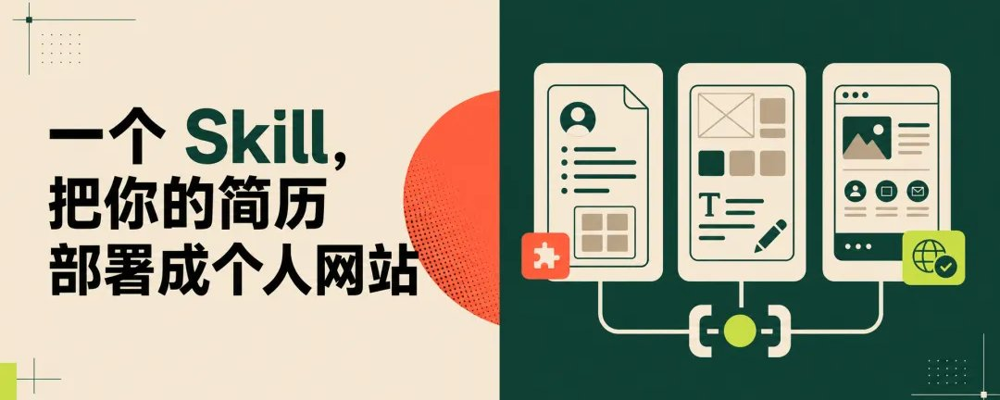

发现很多人都有做个人网站的需求。所以，我做了一个 Skill：personal-site-builder。

这个 skill 可以读取你的简历、社交主页、作品集和过往项目，通过询问对话，一步步帮你整理内容、设计网站，最后完成部署。

下面是我用这个 Skill 给自己制作的极客风格网站，只要给到信息就能按 6 种内置的风格出网站。

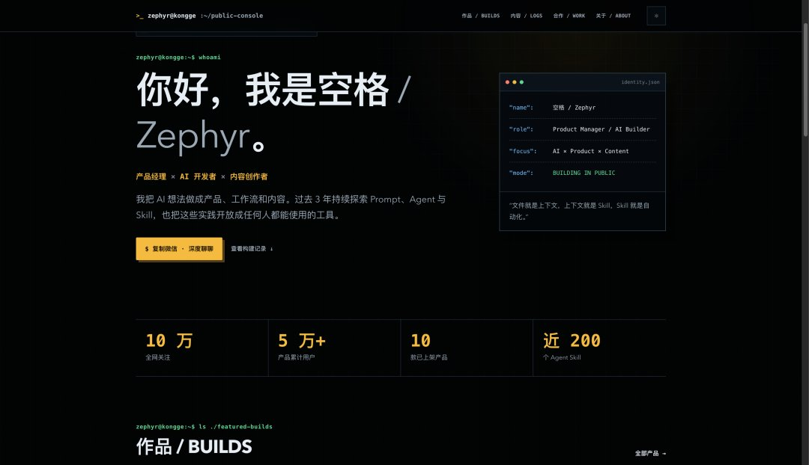

个人网站在找工作时，可以介绍你自己；别人搜索你时可以找到你；如果你有咨询、课程或产品，也可以直接在网站上销售。

它是实时在线的，帮你连接潜在的朋友、客户和合作伙伴。

现在有了 Agent，几乎人人都能做网站。但真正开始做个人网站，还是会卡在三个地方：

不知道怎样收集和整理个人资料；

不知道网站应该放什么，以及采用什么风格；

页面写出来了，不知道怎么部署上线。

这个 Skill 可以帮你快速搭建，下面是详细教程：

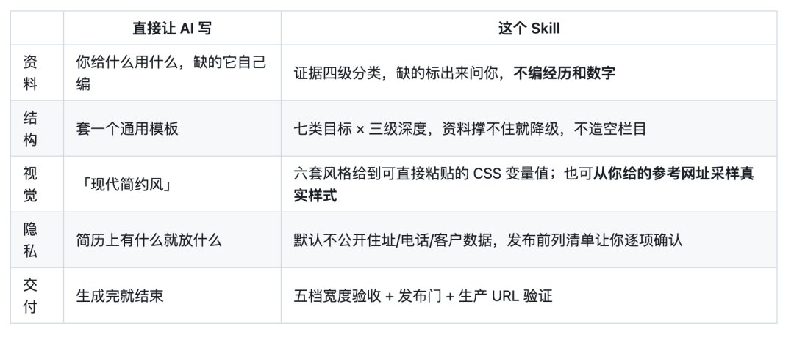

安装和使用

可以直接把项目地址交给 Agent，让它安装：

帮我安装这个 Skill https://github.com/SpaceZephyr/personal-site-builder.git ~/.claude/skills/personal-site-builder

安装完成后，告诉 Claude Code：

帮我制作一个个人网站。

接下来，它会带你完成整个流程。

第一步：把资料都交给它

简历、GitHub、公众号、小红书、作品集， 给个链接也可以。有什么就给什么。

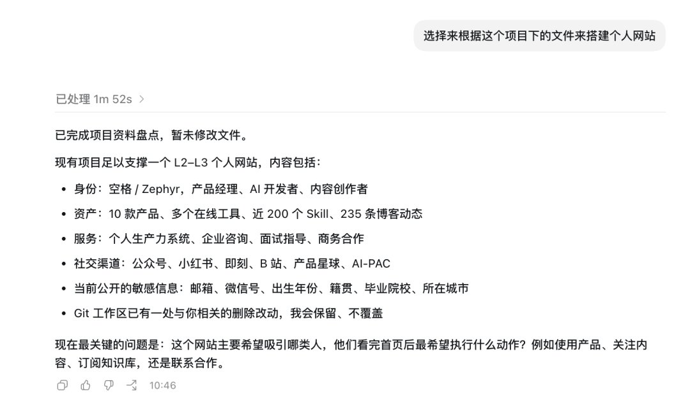

它会读取资料，并整理成一份清单：

- 哪些经历和数字已经得到证实；
- 哪些信息需要你确认；
- 目前还缺少什么；
- 哪些内容建议补充截图或案例。
第二步：确定网站是给谁看的

它不会先问你喜欢什么颜色，而是先问：

继续和它讨论，它会给你提供一些详细的网站搭建的方案。

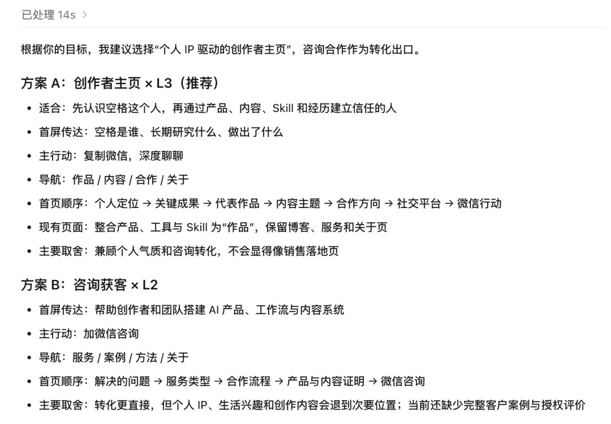

这个 Skill 总共内置了 7 种类型的网站设计方案

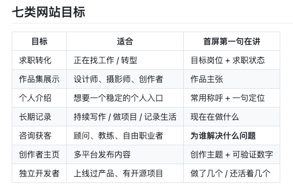

网站还会根据用户提供的内容量级，分成三个层级：

- L1：个人名片；
- L2：经历和作品证明；
- L3：可以持续更新的内容系统。
资料不够，就先上线一个完整的 L1。

等一切信息确认后，就可以让 Agent 选择视觉风格来搭建网站来。

第三步：选择设计风格

Skill 内置了极简黑白、编辑排版、终端极客、Bento 卡片、杂志标题和暖色手作等 6 种风格。下面是一些示例。

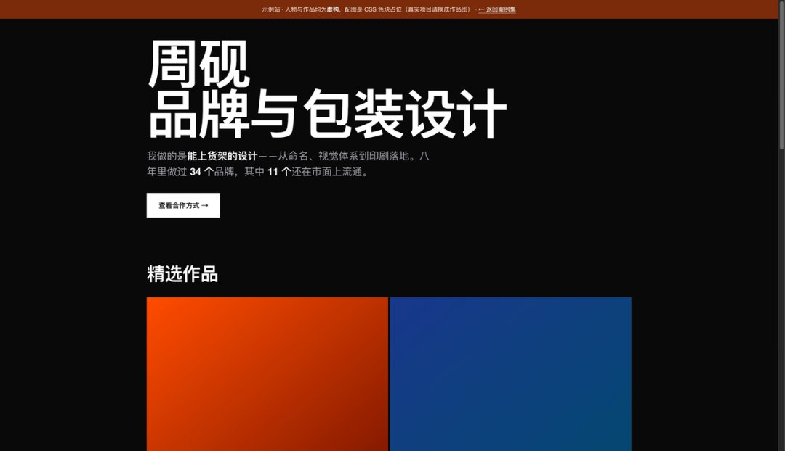

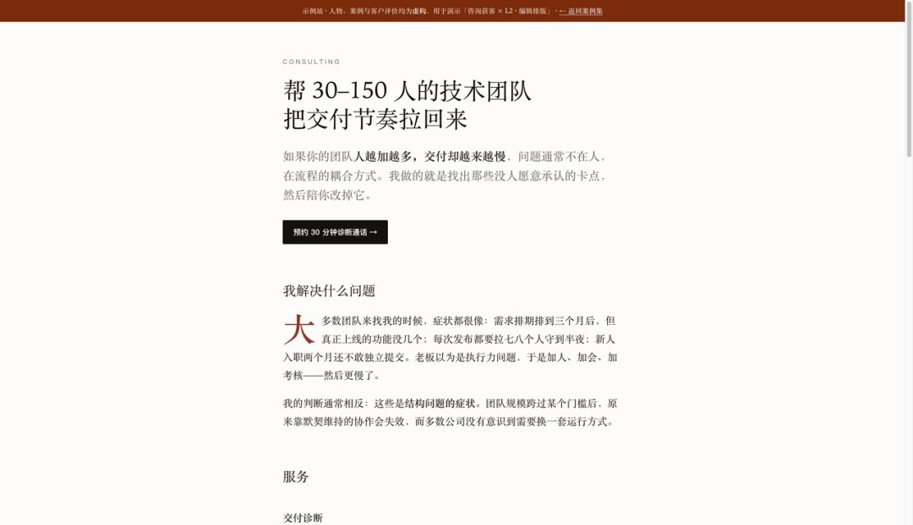

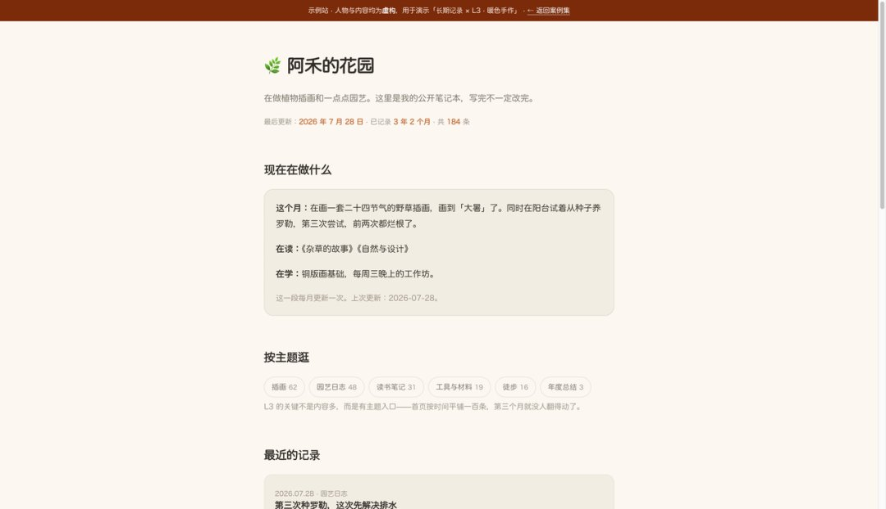

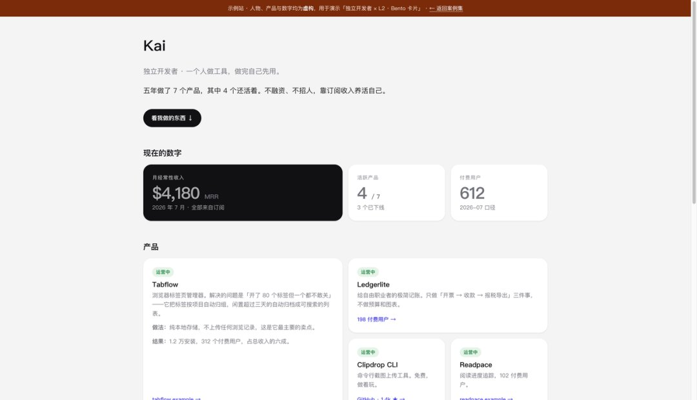

如果你有自己喜欢的风格，也可以直接发给它一个参考网站，说：

参考这个网站xxx，来设计，但不要复制内容和版式。

它会分析字体、字号、颜色、间距、内容宽度、圆角和明暗主题，再转化成适合你资料的设计。

可以在 behance 站酷搜个人网站设计给 Agent 参考：

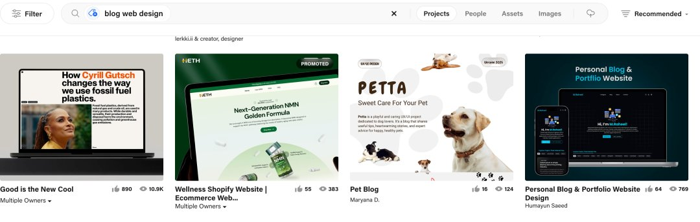

好的个人网站是借助设计把你自己的信息讲清楚。

第四步：验收并部署

网站完成后，Skill 会自动检查不同屏幕宽度、明暗主题、文字溢出、控制台错误，以及页面中是否还残留占位符和假数据。

部署不会自动执行。

它会先告诉你准备发布到哪个平台、使用哪个仓库，以及哪些联系方式将被公开。

这里推荐你在 Agent 连接器安装 Github 和 Vercel，将代码推送到 Github，再用 Vercel 部署

详细教程：[个人网站](https://mp.weixin.qq.com/s?__biz=MzkxMTQ0ODE3Ng==&mid=2247495909&idx=1&sn=cd9beaaeca1d807942c50c708ea3f687&scene=21#wechat_redirect)教程

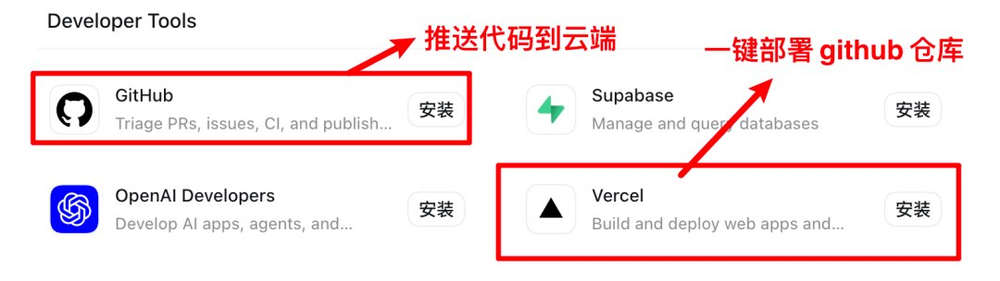

最后

个人网站是自己在互联网上真正拥有的一块地方。

个人网站会不断生长。

今天先上线一张个人名片，做了新项目就增加一个案例，有了稳定输出再加入文章。

时间久了，它自然会变成你的作品档案和个人品牌入口。

这个 Skill 不负责替你产生经历，也不能替你拥有品味。

它帮你解决资料整理、网站设计和部署上线这些容易拖延的事情。

让你把精力留给真正重要的部分：你是谁，以及你希望别人怎样认识你。

项目地址：github.com/SpaceZephyr/personal-site-builder
