# 📰 每年 3 毛钱，白嫖一个德国手机号 沃达丰免费 eSIM 保姆级教程

先说结论：这张卡你不申请，绝对血亏，会后悔到拍大腿。

它的成本已经低到没人性了——保号一年只要 3 毛钱人民币，比最近很火的 giffgaff 还便宜。之前这个口子关过一阵，现在我又把方法找回来了。欧洲对预付卡的监管只会越来越紧，趁政策还没收紧，能上车就先上。

[⏱](https://abs.twimg.com/emoji/v2/svg/23f1.svg)全流程时间预估

顺利的话 约 10 分钟，遇到问题也基本不超过 24 小时。填表 + KYC 认证 10–20 分钟，剩下是等官方审核（10 分钟到 24 小时，大部分人 1 小时内到）。建议尽早申请。

## 0：开通前必看：先备齐这些

动手之前，把下面几样准备好，省得中途卡壳：

- 护照　KYC 实名认证必须用护照，目前不支持身份证。

- 邮箱　用来接收 eSIM 二维码和账号信息（推荐 Gmail）。

- 支持 eSIM 的手机　海外版 iPhone / Pixel / 三星直接用；国行用户需要 XeSIM、ESTK 等写卡器（强烈建议入一个）。

- 外币支付工具（可选）　仅保号环节才用得上：Visa / Mastercard，或 Wise、Bybit Card、N26 等虚拟卡。开卡本身免费。

- 德国 IP　实测必须是住宅 IP，机房 IP 容易过不了。

## 实体卡还是 eSIM？

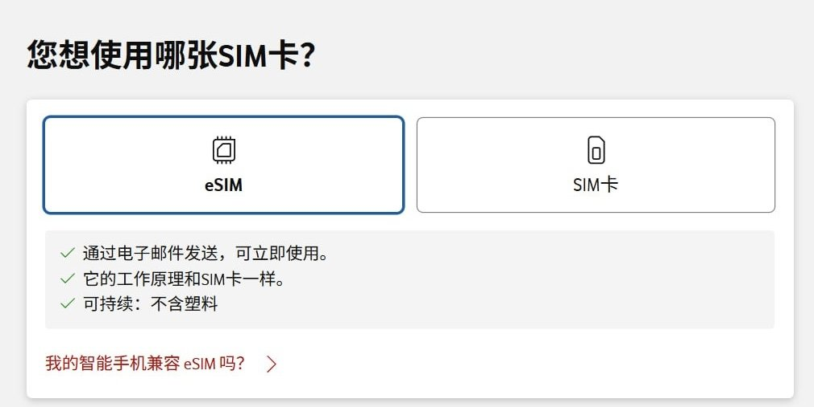

沃达丰有两种开卡方式，结论很直接：

实体卡

需要德国地址收快递，不适合国内用户。

eSIM（强烈推荐）

在线申请、秒级开通、不用等快递。配合 XeSIM / ESTK，国行手机也能用。

开始实操

1 ：申请免费 eSIM
打开沃达丰官网的申请页面（直达链接）：[vodafone.de/freikarten/callya-classic-form](https://www.vodafone.de/freikarten/callya-classic-form/)进去之后直接开始申请，选 eSIM。

A · 填写个人信息
姓名——用拼音，必须和护照一致。
邮箱——千万别填错！eSIM 二维码会发到这里。
德国地址——一定要在 Google Maps 找一个真实地址。

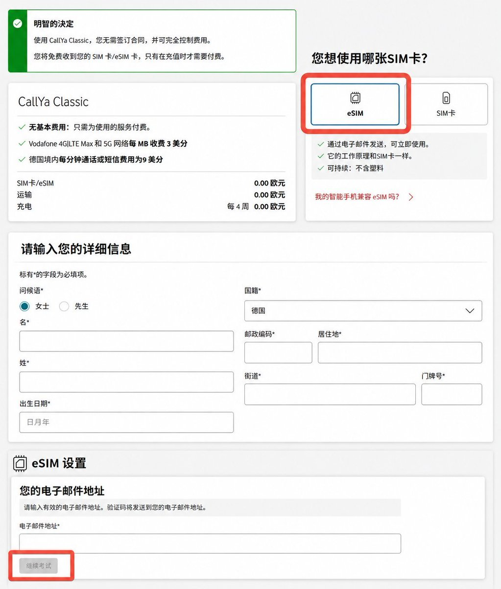

地址别用 AI 或生成器编，一定要去 Google Maps 找真实存在的德国地址，否则过不了审核。

B · 输入邮箱验证码

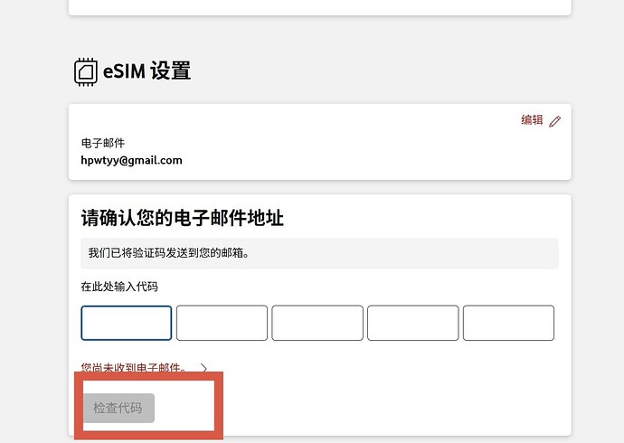

C · 设置客户密码

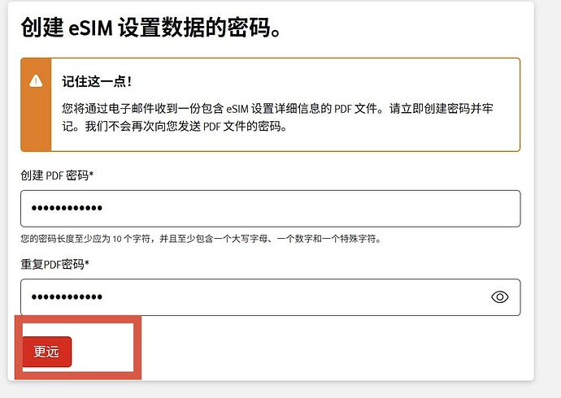

这里的密码必须是「纯大写字母 + 数字」。它同时是后面打开邮件里 PDF 文件的密码，务必记牢！

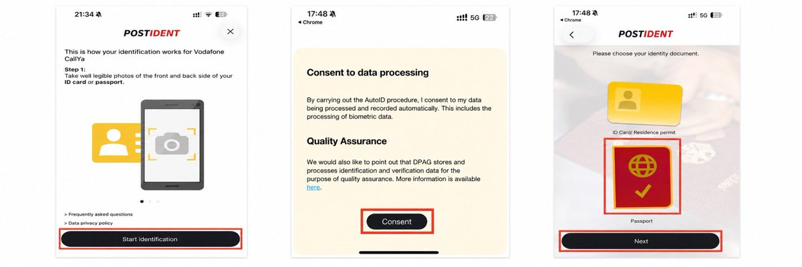

## 2：KYC 实名认证

提交信息后，系统会要求做 KYC 认证。选 “自动识别 + 自拍”（Auto ID），最简单。

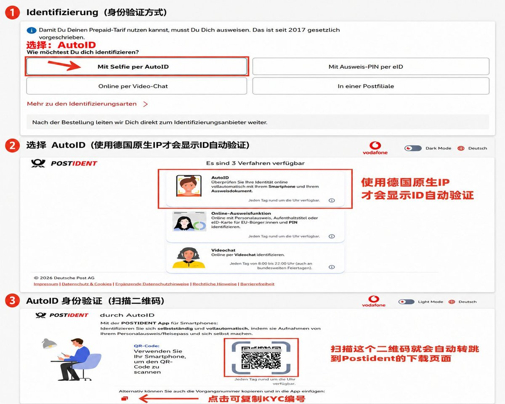

💡如果界面没出现 Auto ID 选项，换一个德国住宅 IP + Gmail 邮箱再试（我试了 2 次成功、1 次失败）。会德语的朋友可以直接走视频认证，更稳。

电脑上的操作做到出现下面这张二维码页就行——然后去任意应用商店下载认证 APP，用手机扫码，开始认证：

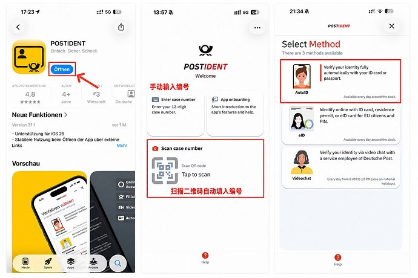

1. 选择 Passport（护照）

1. 拍护照封面

1. 拍护照人像页

1. 按提示上下左右转动角度，多角度拍护照内页

1. 人脸识别——跟着指示从不同角度录一段视频

整个过程大概 5–10 分钟，完成后等审核。下面是 APP 里一步步的实拍参考：

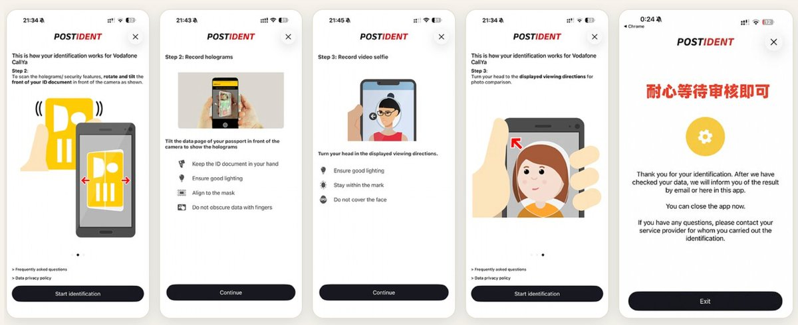

## 3：接收 eSIM 二维码

审核通过后（通常 10 分钟到 24 小时），你会收到三封邮件：

- 第一封：确认收到申请、身份认证通过。

- 第二封：要求邮箱验证，点链接确认即可。

- 第三封：含 eSIM 信息的 PDF 附件，里面有可直接下载 eSIM 的激活码。

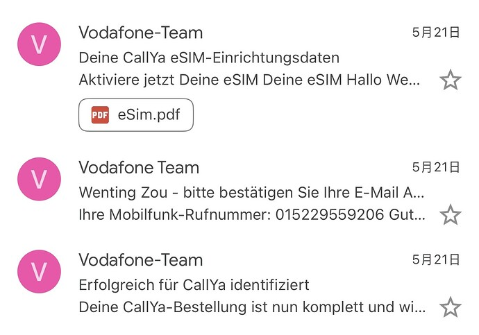

打开第三封邮件的 PDF 附件（密码就是刚才设的「全大写 + 数字」那个）。里面有：

📱eSIM 二维码扫码下载到手机

[☎️](https://abs.twimg.com/emoji/v2/svg/260e.svg)德国手机号格式 +49 xxx

🔢25 位激活码扫码失败时手动输

🔐6 位 PIN 码激活时填写

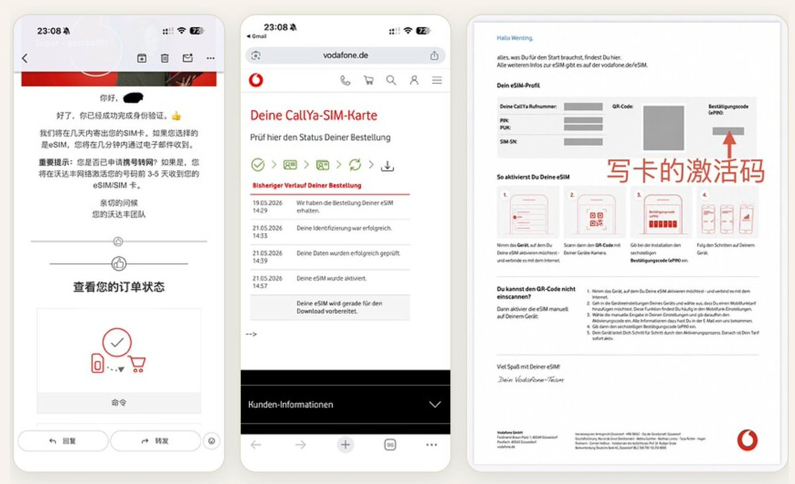

我同一个人试了三个号，成功两个——所以截图里会有一个显示「过几天才认证」，正常现象。

4激活 eSIM & 测试收短信
扫码下载完 eSIM 后，系统会让你输 PIN 码：默认一般是 0000，不对就用 PDF 里那个 6 位 PIN。激活成功后，状态栏会出现 “Vodafone.de” 信号（在国内会显示漫游到移动 / 联通）。

[⚠](https://abs.twimg.com/emoji/v2/svg/26a0.svg)激活后立刻做两件事
① 关闭「数据漫游」，避免天价流量费；

② 只保留「语音和短信」功能。

然后赶紧测一下能不能收短信。我实测：Telegram　秒收验证码
WhatsApp　秒收
ChatGPT　可以注册
微信　可以绑定（但建议当备用号）
基本上，只要支持德国号码的服务，都能正常收码。

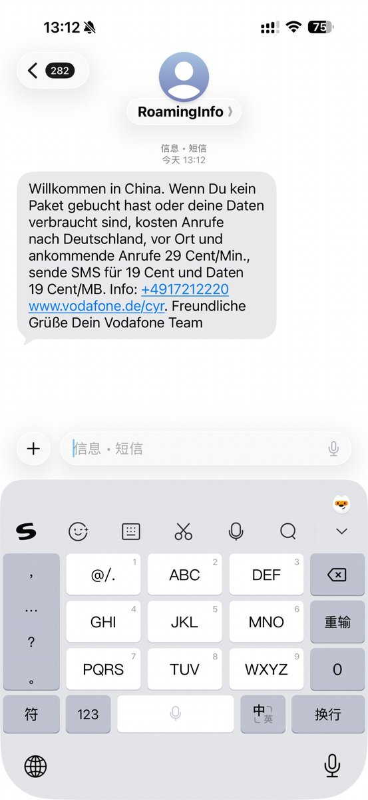

## 5：注册沃达丰账号 & 绑定号码

保号之前，强烈建议先注册一个官网账号。有账号才能：随时查余额和有效期、在线充值（比第三方方便）、查消费记录、管理套餐。

访问官网，点右上角 Registrieren（注册）：

[vodafone.de/meinvodafone](https://www.vodafone.de/meinvodafone/)

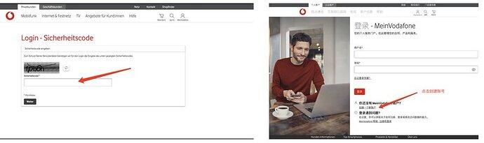

填写注册信息

- 手机号——把开头的 49 替换成 0，后面接号码。

- 邮箱——用申请时填的那个。

- 密码——至少 8 位，含大小写 + 数字 + 特殊字符。

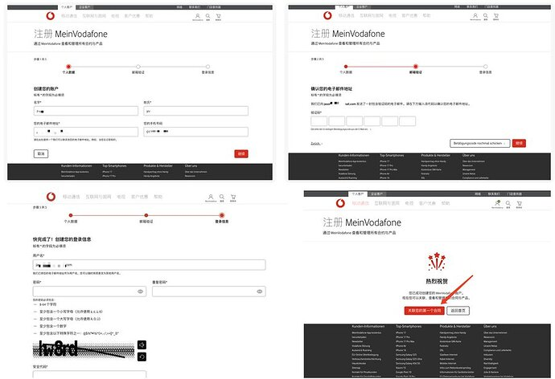

关联手机号（一次性搞定，别急着回首页）

1. 点「关联您的第一个合同」

1. 填手机号和验证码——前缀同样是 0，不是 49

1. 设置密码——就是那个 PDF 密码，建议也用全大写 + 数字

1. 输入沃达丰发来的手机验证码

1. 参与者名称——默认即可，不用管

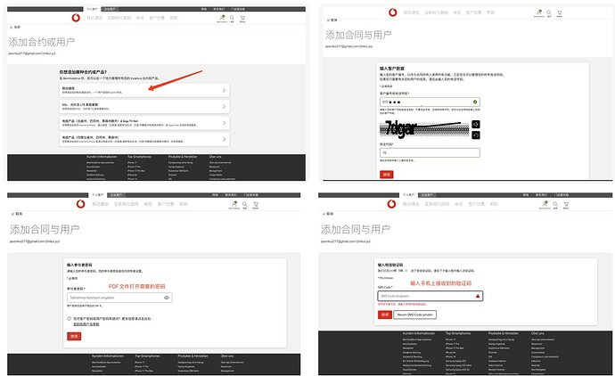

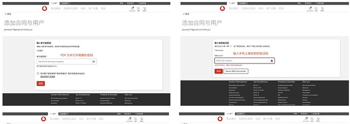

注册并绑定完成后登录，就能看到当前余额、有效期（Gültig bis）、已用流量 / 通话、以及充值入口：

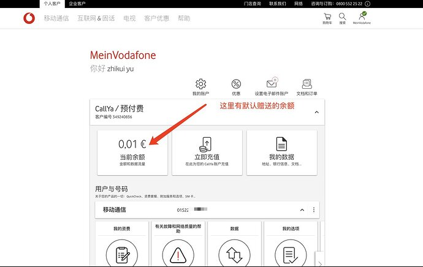

💡把登录信息存到密码管理器里，以后查余额和有效期方便。

6：保号攻略：一年只要 3 毛钱
虽然是免费卡，但要保号。沃达丰的规则是：每 90 天余额只要有变动，有效期就顺延 90 天。
收短信免费、不扣钱——所以光收短信没法保号，必须主动消费或充值。
终极方案：Wise / N26 自动转账（真正躺平）
这是目前成本最低、最省心的方式：每年 0.01 欧 × 4 = 0.04 欧（约 0.33 元），还能设置自动执行，完全不用操心。

前置条件：有 Wise（推荐，国内可申请）、N26，或其他支持 SEPA 转账的欧洲银行账户其一即可。

第一步 · 拿到沃达丰的收款账户信息
登录官网账号 → 进入 充值（Aufladen）页面 → 选 银行转账（Überweisung）：

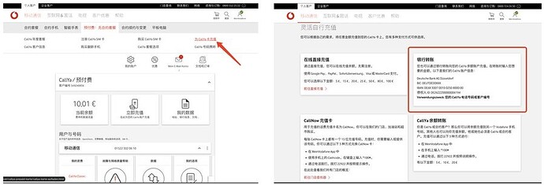

系统会显示沃达丰的收款账户：

收款人Deutsche Bank AG Düsseldorf

IBANDE68 3007 0010 0250 8000 00

BIC / SWIFTCOBADEFFXXX

转账备注你的手机号码 / 客户编号

[⚠](https://abs.twimg.com/emoji/v2/svg/26a0.svg)最关键的一步

转账备注（Verwendungszweck / Reference）一定要填你的客户编号或德国手机号，否则钱可能到不了账！格式通常是 49xxxxxxxxx（去掉开头的 + 和 0）。这个收款账户是共用的，全靠备注认人。

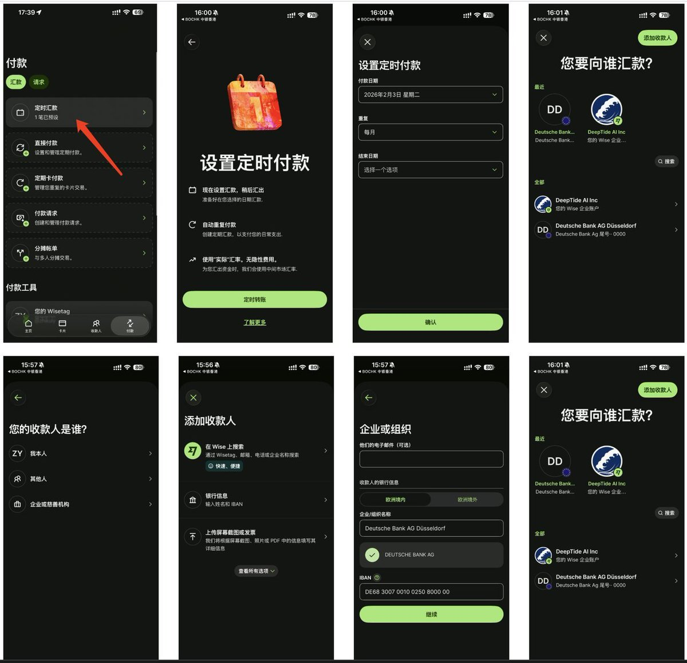

💡合同绑定不上的，也可以直接汇款保号。查余额：拨号界面输入 \*100# 再拨号即可。设置一笔每月自动转账（Wise / N26 都行），从此躺平。

最后：抓紧上车
这个免费 eSIM 项目能撑多久，说实话我也不知道。欧洲对预付卡的监管越来越严，未来很可能加强实名、取消免费、提高保号门槛。所以建议很简单：趁现在还能白嫖，赶紧申请一个。反正免费，不申请白不申请，就算以后不用也没任何损失。而有了这个号，注册 ChatGPT、Telegram 这些服务，再也不用为验证码发愁。

转载作者 hpwtyy：https://linux.do/t/topic/2294180

### 🖼️ Attached Media

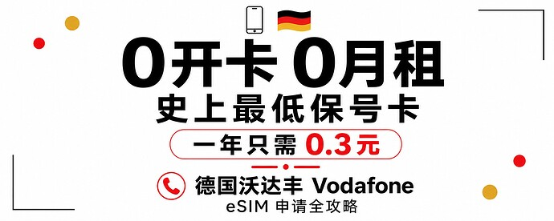

## 💬 Replies

### 1 @aikongmeng1 (Akm)

*Thu Jun 04 05:29:19 +0000 2026*

@suandao\_island 没有护照😂

### 2 @lufeiBTC (路飞Ai版)

*Wed Jun 03 09:53:31 +0000 2026*

@suandao\_island 可以，备用一下。。辛苦，

### 3 @php_martin (Martin)

*Fri Jun 05 14:13:31 +0000 2026*

@suandao\_island 外区订阅现在经常卡在手机号和支付两头：手机号要稳定，Apple ID 和礼品卡也最好自己掌握。我这边刚实测了印度区 Apple ID 注册/充值流程，土区 Plus 也能迁移： [x.com/php\_martin/sta…](https://x.com/php_martin/status/2062781332749721765?s=20)

### 4 @ChuanqiAGI (川启)

*Wed Jun 03 10:12:41 +0000 2026*

@suandao\_island 这个还是太复杂了，而且不适合普通人，能不能过KY C都不一定，这个50一年，5分钟搞定，[x.com/joybunala/stat…](https://x.com/joybunala/status/2061858892578234608?s=46)

### 5 @leemac8866 (aurora)

*Wed Jun 03 11:10:55 +0000 2026*

@suandao\_island 得要德国 ip?

### 6 @ws490224 (色彩)

*Wed Jun 03 17:10:00 +0000 2026*

@suandao\_island 门槛太高了啊 光一个美版手机和护照就卡死一大半人了

### 7 @TonyLiao1208 (TonyLiao)

*Wed Jun 03 09:27:04 +0000 2026*

@suandao\_island 现在已经绑定不到自己的账号了，需要激活码

