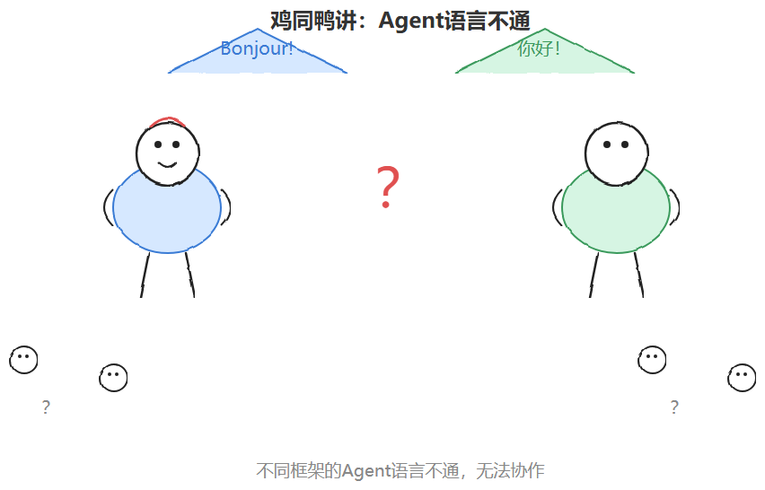
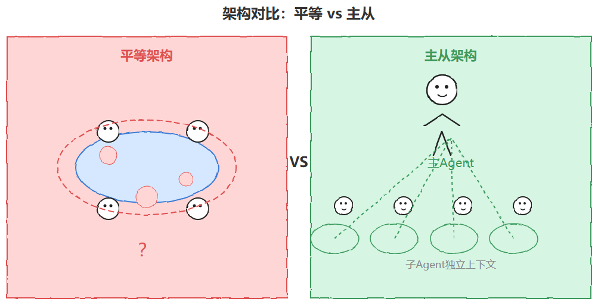
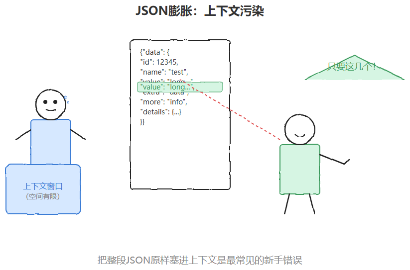
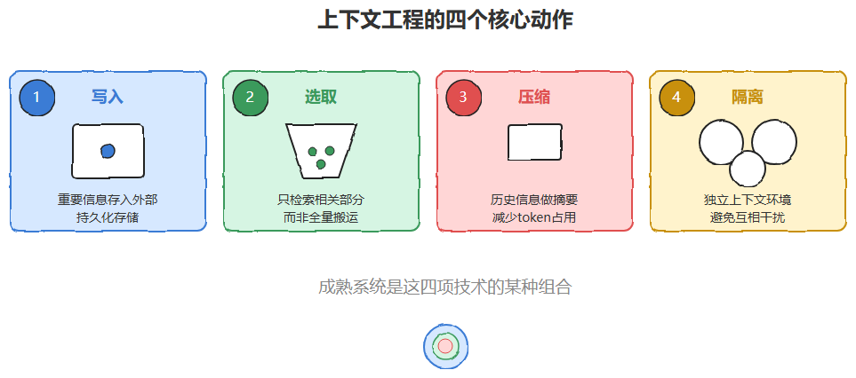
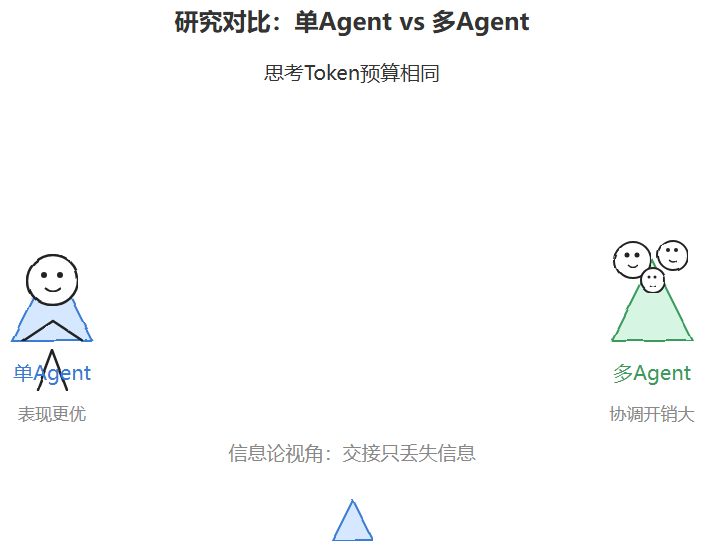

# 📰 淘天三面被问：Multi-Agent体系中智能体怎么通信，上下文如何管控？我说"用消息队列传递，共享上下文，谁需要就去读。他摇了摇头没说话

前几天听一个朋友聊他的Agent开发三面经历。

面试官抛出一个问题："Multi-Agent体系中，各个智能体之间怎么通信？上下文又是怎么统一管控的？"

他脱口而出："用消息队列传递呗，大家共享同一个上下文，谁需要就去读。"

面试官摇了摇头，没再追问，面试很快就结束了。

这个回答其实不算错，但只说对了表面——"消息队列"回答的是最原始的传输方式，没有涉及行业里已经收敛出来的标准协议；"共享同一个上下文"听起来直觉合理，但恰恰是多智能体系统里最容易出问题、也是2026年被反复讨论要极力避免的坑。

这两个问题看似简单，其实背后分别对应着这两年多智能体工程里最核心的两套方法论：通信协议栈的分层收敛，以及上下文工程里对"污染"的系统性防御。今天就把这道面试题拆开，讲透彻。

2026年被很多从业者称为"智能体爆发年"。当一个任务复杂到超出单个Agent的能力边界——上下文窗口不够用、需要多个专业领域配合、或者子任务可以并行处理——多智能体系统就成了绕不开的选项。

但一个团队被组建起来之后，马上要面对两个最扎心的工程问题：

1. 1.智能体之间怎么"说话"？谁来发现谁、用什么格式交换任务、结果怎么传回来？
2. 2.大家看到的"世界"是不是一致的？上下文谁来存、谁能看、怎么防止信息越传越乱？

这篇文章把这两个问题拆开讲清楚，同时也会聊聊"什么时候真不该上多智能体"这种冷静话题。

✦ ✦ ✦

## 一、通信协议栈：从"各自为战"到"分层收敛"

早两年，不同厂商、不同框架做出来的Agent几乎没法对话——一个说"法语"，一个说"中文"，凑在一起就是鸡同鸭讲。

这两年行业慢慢收敛出了一套分层的协议栈，大致可以理解成三层：

#### ‣ 1. MCP（Model Context Protocol）—— 解决"Agent怎么用工具" ####

MCP由Anthropic在2024年底提出，核心使命是把AI模型和外部工具、数据源、服务之间的交互标准化，相当于给"模型-工具"这条链路定义了一套通用接口。它采用Host-Client-Server的架构模型，让不同的模型都能用同一种方式去发现和调用工具、读取资源、获取提示模板。

到2026年初，MCP生态的成长速度相当惊人：活跃的MCP服务端数量早已破万，SDK月均下载量接近上亿次量级。谷歌、SUSE等厂商也陆续把自己的能力接入了MCP协议。这个协议在2025年底捐给了Linux基金会旗下的Agentic AI基金会，往通用行业标准的方向又走了一步。它接下来的路线图还包括任务追踪、重试语义、原生流式支持和可复用技能等能力的完善。

一句话总结：MCP解决的是"AI怎么接入现实世界的工具和数据"，不是Agent与Agent之间的协作。

#### ‣ 2. A2A（Agent-to-Agent Protocol）—— 解决"Agent之间怎么合作" ####

如果说MCP是"AI到工具"，那么A2A就是"AI到AI"。它由谷歌在2025年推出，随后移交给Linux基金会托管，目前已经获得上百家科技公司的支持。

A2A的设计目标很直接：让不同框架、不同厂商做出来的智能体，能够标准化地互相发现、交换任务、反馈结果——就像不同操作系统之间用HTTP传输网页一样简单。它的核心机制包括任务状态机（跟踪一个任务从发起到完成的生命周期）和Agent Card（每个智能体对外声明"我能做什么"的名片，供其他智能体发现和调用）。到2026年，A2A已经进入相对稳定的版本迭代阶段，并开始支持gRPC这样的高性能传输方式。

一句话总结：A2A解决的是"不同智能体之间怎么协作"，是真正意义上的Agent间通信层。

#### ‣ 3. ANP及其他 —— 探索去中心化身份 ####

除了MCP和A2A，业内还在探索ANP（Agent Network Protocol）这样面向开放网络、去中心化身份验证的协议，目标是让智能体在没有中心化平台托管的情况下也能相互确认身份、建立信任。目前这条线还处于早期探索阶段，没有MCP和A2A那么成熟。

值得一提的是，早期还出现过一个叫ACP的协议，但后来它的能力已经并入了A2A——这也说明协议生态本身也在经历"合并同类项"的收敛过程。

#### ‣ 4. 主从（Subagent）架构 vs 平等（Multi-Agent）架构 ####

抛开具体协议不谈，工程实践里还有一个更根本的架构选择：智能体之间是平等对话，还是主从调度？

* ◆平等架构：所有Agent共享同一份历史上下文，看起来协作更"自然"，但代价是上下文极易被污染——谁都能往里面加东西，谁的输出出了问题都很难定位。
* ◆主从（Subagent）架构：子Agent拥有独立的上下文窗口，跑完任务后只把结论传回主Agent，主Agent的上下文始终保持干净。

不少一线团队的实战经验是：主从式的Subagent架构才是目前唯一相对稳定、可控的落地模式。当Agent数量超过三到五个、任务之间又存在较强依赖时，平等架构里"讨论"和"投票"带来的协调成本，往往会超过并行处理省下来的时间。

✦ ✦ ✦

## 二、上下文如何统一管控：不是"塞得多"，而是"防污染"

如果说通信协议解决的是"消息怎么传"，那上下文管理解决的就是"大家共享的认知怎么保持一致、干净、可控"。这也是目前公认比"选协议"更难啃的硬骨头。

#### ‣ 上下文污染的三种典型模式 ####

在生产环境里，上下文被"弄脏"通常有三种方式：

1. 1.噪声累积：长对话里，早期一个错误的前提假设，即便后面已经纠正，模型在很多轮之后仍可能被这段"旧信息"带偏。
2. 2.工具输出膨胀：Agent调用外部工具后，原始返回结果往往体积巨大，但真正有用的可能只是其中几个字段——把整段JSON原样塞进上下文，是最常见的新手错误。

1. 3.指令冲突：系统提示和用户指令产生矛盾时，模型的行为会变得不可预测，而这种冲突常常不是显式的，而是在多轮对话里通过语义漂移慢慢累积出来的。

#### ‣ 四项核心技术：写入、选取、压缩、隔离 ####

目前业内比较认可的上下文工程方法论，可以归纳成四个动作：

* ◆写入（Write）：把重要信息持久化到上下文窗口之外的存储里（比如记忆文件、数据库），而不是全部堆在对话历史里。
* ◆选取（Select）：需要用到的时候，只检索和当前任务真正相关的那部分内容，而不是"全量搬运"。
* ◆压缩（Compress）：对历史信息做摘要，用更少的token承载同样的信息密度。
* ◆隔离（Isolate）：给不同子任务分配各自独立、干净的上下文，避免互相干扰——这也正是前面提到的Subagent架构的底层逻辑。

大多数成熟的多智能体系统，实际上都是这四项技术的某种组合，而不是单靠某一招。

#### ‣ 统一管控的几种落地方式 ####

具体到工程实现上，常见的"统一管控"手段包括：

* ◆全局上下文存储 / 黑板模式：设立一个所有Agent都能读写的共享存储区（类似经典的Blackboard架构），每个Agent只把自己需要对外暴露的关键信息写进去，而不是把完整思考过程都同步给别人。
* ◆角色感知的上下文过滤：不同角色的Agent只能看到和自己职责相关的那部分上下文切片，减少无关信息造成的干扰。
* ◆版本控制 / 状态机：结合A2A协议里的任务状态机思路，给上下文的每次更新打上版本号，方便追溯"谁在什么时候改了什么"，也方便出问题时回滚。
* ◆主Agent兜底压缩：由主Agent负责在关键节点对子Agent回传的信息做统一摘要和结构化，再决定要不要继续往下传递，避免污染像滚雪球一样越滚越大。

#### ‣ 怎么判断上下文管理是否真的有效 ####

比较扎实的做法是针对一组评估任务持续跟踪任务成功率，同时看几个效率指标：单次任务消耗的token数、上下文窗口利用率、检索的精确率与召回率，以及延迟和成本。好的上下文工程应该是在保持甚至降低成本的同时提升成功率——每次改动之后都在这套评估集上跑一遍，才知道这次调整到底是帮忙还是添乱。

✦ ✦ ✦

## 三、冷静的声音：多智能体不是万能药

聊了这么多协议和架构，也得说一句大实话：多智能体在工业界的真实落地案例，目前仍然有限。

2026年有一项研究把这件事量化了下来：在同样的思考token预算下，单个Agent在多跳推理任务上的表现常常不输、甚至优于多智能体系统。研究者给出的解释是一种信息论视角——每一次Agent之间的交接，本质上只会丢失信息，不会凭空创造信息；多智能体既摊薄了思考预算，协调本身又要额外开销。

行业内部也基本认同：多智能体真正适合的场景，是那些能并行处理、需要大量阅读、子任务彼此相对独立的任务。一旦子任务之间存在强依赖、需要共享大量上下文，硬拆成多个Agent反而会变成负担，不如老老实实用一个上下文更完整的单Agent来处理。

"什么时候真该上多智能体"这个问题，到2026年也还没有一个放之四海而皆准的答案——这恰恰说明，协议和架构只是工具，能不能用好，还是要回到具体任务的特点上来判断。

✦ ✦ ✦

### 写在最后 ###

如果要用一句话总结

* ◆通信层：MCP管"Agent怎么用工具"，A2A管"Agent之间怎么协作"，主从（Subagent）架构目前是相对最稳的落地方式；
* ◆上下文层：核心不是塞进更多信息，而是通过"写入、选取、压缩、隔离"这四板斧，防止上下文被污染，同时用黑板模式、角色过滤、版本控制等手段做统一管控；
* ◆别忘了冷静判断：任务能不能拆、要不要拆成多智能体，比"选哪个协议"更值得先想清楚。

多智能体系统正在从"实验性玩具"走向"生产级基础设施"，但这条路上，协议标准化只是地基之一，真正决定系统能不能稳定跑起来的，往往还是上下文这一层看不见的"管道工程"。

回到开头那道面试题——如果重新答一次，大概可以这么说："智能体间通信目前有分层的协议栈，MCP管工具调用，A2A管Agent间协作；上下文不建议全量共享，而是通过写入、选取、压缩、隔离这几种手段做隔离和统一管控，主从架构比平等架构更稳。" 这次，面试官大概率不会再摇头了。

