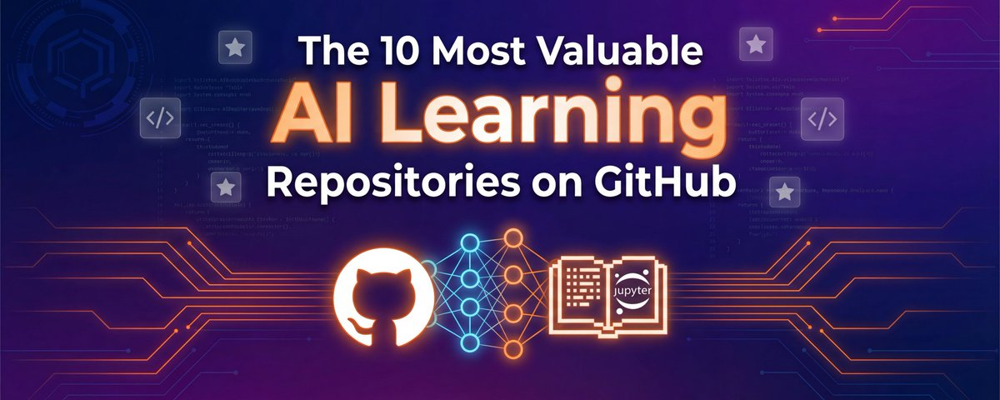

# 📰 GitHub 上最有价值的 10 个 AI 学习仓库，Star数加起来近百万

在人工智能快速发展的浪潮中，找到高质量、实用的学习资源可能让人不知所措。在分析了以 Jupyter Notebooks (.ipynb) 为主要格式的顶级 GitHub 仓库后，我过滤掉了那些纯粹的炒作，识别出 10 个真正能提升你 AI 专业能力的最有价值仓库。这些不仅仅是代码堆砌——它们是结构化的、可用于生产的学习路径，连接理论与实践。

## 1\. Microsoft 生成式 AI 入门课程（约 10.5 万星）

这门由微软云倡导者团队打造的综合课程提供了 21 节课，涵盖构建生成式 AI 应用的基础知识。仓库包含完整的 Jupyter 笔记本、实践课程以及从零开始构建 GenAI 应用的实用指南。其独特之处在于结构化的课程设计，从理解什么是生成式 AI 以及大语言模型如何工作，到提示工程技术，再到使用嵌入构建聊天应用和搜索系统。课程还涉及 AI 系统安全、威胁以及保护这些系统的方法等关键主题。[citation](https://github.com/microsoft/generative-ai-for-beginners)

## 2\. Sebastian Raschka 的《从零开始构建 LLM》（约 8.3 万星）

由 AI 研究员 Sebastian Raschka 创建，这个仓库提供了用 PyTorch 从零开始构建 GPT 风格大语言模型的教育性实现。与许多依赖高级库的资源不同，这个项目逐步引导你了解每个组件，帮助你理解现代 LLM 的基本架构。配套书籍《从零开始构建大语言模型》深入剖析了这些模型的实际工作原理。对于任何想要超越 API 调用、真正理解语言模型机制的人来说，这是无价之宝。[citation](https://github.com/rasbt/LLMs-from-scratch)

## 3\. Microsoft AI 智能体入门课程（约 4.9 万星）

随着 AI 系统从简单的问答发展到更复杂的形态，理解智能体 AI 变得至关重要。这门 12 节课的课程专注于构建具有工具、记忆、规划能力和复杂工作流的 AI 智能体系统。仓库使用 Microsoft Agent Framework 与 Azure AI Foundry，包含展示实际实现的 Python 代码示例。如果你已经掌握了基础的 GenAI 概念，想要构建更复杂、能够推理、规划和执行多步骤任务的自主 AI 系统，这就是你的下一步。[citation](https://github.com/microsoft/ai-agents-for-beginners)

## 4\. Microsoft 机器学习入门课程（约 8.3 万星）

在深入神经网络和 Transformer 的深水区之前，扎实的经典机器学习基础仍然至关重要。这门 26 节课的课程使用实践性的方法涵盖基础 ML 概念。它非常适合那些想要在专攻深度学习或 LLM 之前，理解支撑现代 AI 的原理——回归、分类、聚类等——的人。结构化的课程使复杂概念变得易于理解，同时不牺牲深度。[citation](https://github.com/microsoft/ML-For-Beginners)

## 5\. OpenAI Cookbook（约 7.1 万星）

OpenAI 官方 API 示例仓库是生产就绪模式、配方和演示的宝库。这本 cookbook 的卓越之处在于它由 OpenAI 自己维护，确保示例反映当前的最佳实践和 API 能力。你会发现从提示工程技术和嵌入实现，到函数调用、智能体架构以及图像处理的所有内容。这些笔记本设计为立即可用——复制、修改和部署。[citation](https://github.com/openai/openai-cookbook)

## 6\. Jack Frued 的《Python 100 天》（约 17.7 万星）

虽然不是专门针对 AI 的，但这个密集的 Python 学习路线图对任何认真从事 AI 开发的人来说都是基础性的。这个包含练习和笔记本的 100 天结构化方法，带你从 Python 基础到高级概念。由于 Python 是 AI 和机器学习的通用语言，彻底掌握它是不可妥协的。这个仓库通过实用的实践练习提供了全面的基础。[citation](https://github.com/jackfrued/Python-100-Days)

## 7\. Pathway LLM App（约 5.4 万星）

从笔记本到生产环境是许多 AI 项目失败的地方。这个仓库通过提供即用型 RAG（检索增强生成）模板和真实世界的 LLM 应用来弥合这一差距。Pathway 方法的独特之处在于它专注于处理来自 SharePoint、Google Drive、S3、Kafka 和 PostgreSQL 等来源实时数据的生产就绪管道。这些模板对 Docker 友好，设计为与你的数据源实时同步。如果你正在构建需要处理不断更新知识库的企业 AI 应用，这是必不可少的。[citation](https://github.com/pathwaycom/llm-app)

## 8\. Jake VanderPlas 的《Python 数据科学手册》（约 4.6 万星）

这个基础性集合涵盖了每个数据科学家和 AI 从业者必须掌握的核心库：用于数值计算的 NumPy、用于数据操作的 Pandas、用于可视化的 Matplotlib 以及用于机器学习的 Scikit-Learn。这些笔记本写得非常好，将清晰的解释与实际示例相结合。即使你专注于前沿的 LLM，你也会不断回到这些基础知识进行数据预处理、分析和评估。[citation](https://github.com/jakevdp/PythonDataScienceHandbook)

## 9\. CompVis Stable Diffusion（约 7.2 万星）

对于那些对文本之外的生成式 AI 感兴趣的人，原始的 Stable Diffusion 仓库为理解文本到图像模型提供了出色的学习材料。虽然现在许多人通过 API 或 UI 使用 Stable Diffusion，但研究原始实现可以揭示扩散模型如何工作、如何训练以及文本条件如何引导图像生成。如果你正在构建自定义图像生成系统或为特定领域微调模型，这种深入理解是无价的。[citation](https://github.com/CompVis/stable-diffusion)

## 10\. Meta 的 Segment Anything Model（约 5.3 万星）

Meta 的 Segment Anything Model(SAM）代表了交互式图像分割的突破。该仓库展示了如何将基础模型应用于计算机视觉任务，实现对新图像分布和任务的零样本泛化。研究 SAM 的架构和实现可以深入了解大规模视觉模型是如何构建的，以及它们如何适应各种下游应用。[citation](https://github.com/facebookresearch/segment-anything)

## 超越代码：这些仓库教给我们什么

虽然这些仓库在提供实践编码练习方面表现出色，但值得注意的是它们没有完全解决的问题：将称职的从业者与卓越的 AI 工程师区分开来的更深层次的问题解决框架。学习实现 RAG 管道是有价值的；理解何时 RAG 是错误的解决方案以及存在哪些替代方案才是变革性的。

最有效的学习方法是将这些实用仓库与对 AI 系统设计的批判性思考相结合，理解架构权衡，认识模型局限性，并质疑训练数据和目标中嵌入的假设。Cookbook 教你执行；从零开始构建教你原理。两者都是必要的，但单独都不够。

## 开始学习

这些仓库的美妙之处在于，你可以根据自己的兴趣和技能水平从任何地方开始。完全的初学者可能从 Microsoft 的机器学习入门或 Python 100 天课程开始。有编程经验但对 AI 新手的人可以跳到生成式 AI 入门。希望加深理解的经验丰富的从业者应该探索《从零开始构建 LLM》或深入 Pathway 的 LLM App 模板进行生产部署。

关键是不要只是阅读笔记本，而是要运行它们、修改它们、破坏它们并重建它们。Fork 这些仓库，尝试不同的参数，尝试将技术应用于你自己的数据集，并构建结合多个来源概念的小项目。真正的学习就发生在这里——在将这些想法变成你自己的混乱、令人沮丧、令人兴奋的过程中。

AI 领域发展迅速，但这些基础性仓库提供了稳定的构建基础。它们代表了数千小时的专家知识，浓缩成易于理解的实用格式。问题不在于这些资源是否有价值——而在于你是否会利用它们。

### 🖼️ Attached Media

## 💬 Replies

### 1 @DavisNc9527 (Davis.AI.Explorer)

*Mon Feb 23 02:11:25 +0000 2026*

@gxjdian 你这资料整理的太全了，都不知道从哪里开始看了😅

### 2 @gxjdian (纯棉短裤) (Author)

*Mon Feb 23 02:12:01 +0000 2026*

@DavisNc9527 哈哈哈，确实，先收下慢慢看🤣

