# 📰 美团搜索3.0：LLM 语义表征在排序模型的探索与应用


点亮👆“☆”星标，不错过推送内容\~

全文速读

在大语言模型（LLM）技术的深刻影响下，搜索引擎正经历第三次范式跃迁：从 1.0 时代的“关键词文本匹配”，到 2.0 时代的“行为统计与个性化搜索”，再到 **3.0** 时代向“复杂意图理解与认知决策”的全面进化。

美团搜索团队正依托团垂融合新架构与生成式大模型新技术，全面重构本地生活搜索底座。本系列技术博客将持续介绍美团搜索 3.0 的技术探索，本文聚焦 LLM 语义表征在服务零售排序场景上的三期实践——从单点特征验证到系统性表征体系构建，再到跨场景迁移复用，探索语义匹配信号在搜索排序中的应用路径。

🎈我们还在文末增加了读者互动环节，欢迎大家晒出自己的见解、思考，分享实践经验，一起交流学习。

本文目录

* 一、背景与动机

* 二、一期：精排引入大模型语义表征（验证可行性）

* 2.1 核心思路

* 2.2 技术方案

* 2.3 线上效果

* 2.4 一期的局限性

* 三、二期：商家精排表征系统性升级

* 3.1 核心动机

* 3.2 技术方案

* 3.3 表征应用方式

* 3.4 线上效果

* 四、三期：下挂精排引入表征 + 全域交叉统计特征

* 4.1 核心动机

* 4.2 技术方案

* 4.3 线上效果

* 五、核心洞察与经验沉淀

* 六、业内工作对比与独立创新点

* 七、后续展望

* 八、总结

## 一、背景与动机

服务零售是将服务销售给最终消费者的商业活动，与之对应的概念为商品零售。服务零售和商品零售是美团零售业务的两个主要组成部分。

在美团搜索场景下，相较于到家和其他到店业务，服务零售具有以下显著特点：

* **品类丰富**：覆盖丽人、休闲娱乐、家政、进场零售等众多细分行业。

* **搜索需求类型丰富**：交易型、信息型、留资型并存。

* **供给非标准化程度高**：交易内容的多维组合性（e.g. 券、时间、位次、场次、空间、技师等）以及基于"人"和"场所"进行履约，共同促使供给的个性化和非标准化。

传统精排模型的语义建模高度依赖文本匹配，但这类特征构建成本高、泛化能力弱，在面对服务零售大量长尾品类、复杂 Query 意图时尤为明显。例如，"宠物 SPA+洗澡"这个 Query 对应的商品名称可能是"萌宠清洁护理套餐"、"春节大扫除"这个 Query 对应的商品名称可能是"深度保洁服务套餐"，在这些 Case 中，搜索词和供给在文字上几乎没有重叠，但语义上是高度相关的。

这类语义 Gap 在美团服务零售搜索场景（生活服务、休闲娱乐等）尤为突出。服务零售的品类长尾分散、商品描述非结构化、Query 意图复杂多样，传统特征工程难以覆盖。而大语言模型（LLM）在语义理解方面的能力成熟度正在快速提升，给我们带来了新的解题思路。

从 2025 年 Q4 到 2026 年 Q2，服务零售搜索排序团队系统性地探索了 LLM 在精排模型中的应用，核心方向是用 LLM 为搜索词（Query）、商家（POI）和商品（Deal）生成高质量的语义向量表征，将语义匹配信息以 cosine 相似度的形式注入排序模型，弥补传统特征在语义理解上的不足。经过三期迭代，累计完成 3 个 Launch Review（LR），均已完成全量上线，带来了显著的线上收益。

下图展示了三期技术演进的整体脉络。每一期都在前一期的基础上进行系统性升级，从验证可行性到全面优化再到跨模块迁移复用，逐步构建起一套完整的语义表征体系。

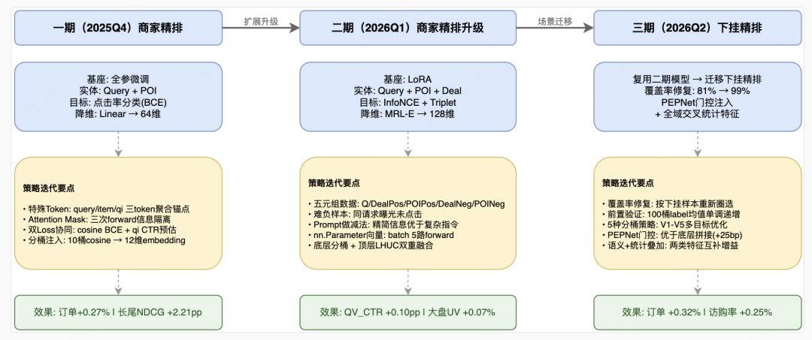图1 三期技术演进整体脉络：从特征验证到体系重构再到跨场景迁移

## 二、一期：精排引入大模型语义表征（验证可行性）

### | 2.1 核心思路 ###

服务零售精排在语义层面的建模几乎为零，排序模型主要依赖少量文本匹配和 Query 统计类特征。所以一期的目标很纯粹：**验证 LLM 表征能否对精排模型有实质性帮助**。如果用 LLM 生成的语义向量能带来正向收益，就值得投入更多资源深度优化。整个一期的设计都围绕「先把路走通」。

**整体思路是**：选择一个轻量级的 LLM 作为基座，对 Query 和 POI 的信息进行统一建模，通过微调，使模型仅依赖文本语义来判断"这个搜索词和这个商家是否匹配"，然后全量推理出 Query 和 POI 各自的语义向量，计算它们的 cosine 相似度，作为特征注入精排模型。

### | 2.2 技术方案 ###

### 模型设计：特殊 Token 与信息隔离

一期选用小参数量的开源基座模型，采用全参数微调。

要提取语义表征，需要一个明确的"聚合点"——**模型在哪个位置把输入文本的语义信息汇聚成一个向量**。直接用序列末尾 Token 或整个 Token 序列 Mean Pooling 也可以，但缺少可学习性。一期的核心设计是在词表中新增三个特殊 Token——`<|query|>`、`<|item|>`、`<|qi|>`，作为专门的聚合锚点，在训练中与模型参数一起优化。特殊 Token 的嵌入采用平均初始化法，参考 vocab-expansion<sup style="line-height: 0;"><span leaf="">[1]</span></sup>。

输入 Prompt 的结构如下：

```

prompt = """用户查询：{}<|query|>候选商铺信息如下：商铺名称：{}热销商品：{}所属品牌：{}商铺分类：{} - {} - {}用户评分：{}分平均价格：{}元所在商圈：{}<|item|>请判断该商铺是否匹配用户查询<|qi|>"""

```

设计三个而非一个 Token，是因为需要三种不同类型的表征：`<|query|>` 聚合 Query 侧语义，`<|item|>` 聚合 item 侧语义，`<|qi|>` 聚合双侧融合信息——前两者用于推理时独立提取各自的 Embedding 并计算 cosine 相似度，后者仅用于微调时的辅助 Loss。

三个特殊 Token 内嵌在同一条 Prompt 序列中，意味着训练时 Query 和 item 的文本信息是混在一条序列里的。如果不加干预，`<|query|>` 会自然"看到"后面的 item 文本，`<|item|>` 也会"看到"前面的 Query 文本。这本身对 `<|qi|>` 不是问题——它本来就要看两侧信息。但对 `<|query|>` 和 `<|item|>` 来说是个问题：推理时，Query 和 item 的 Embedding 是分别独立生成的，如果训练时 `<|query|>` "看到"了 item 信息，它学到的表征就会依赖 item 上下文，推理时只输入 Query 文本，产出的表征就失去了意义。

因此，通过 Attention Mask 对同一条输入序列进行三次独立 forward pass：提取 query 表征时，mask 将注意力范围限制在 Query 文本段，`<|query|>` 只能聚合查询信息；提取 item 表征时，mask 限制在 item 文本段，`<|item|>` 只能聚合商家信息；提取融合表征时使用完整 mask，`<|qi|>` 可以 attend 到整条序列。这样确保了 Query 和 item 各自的表征是自包含的，可以独立提取和存储。

表征提取方式是取 transformer 最后一层在特殊 Token 位置的 hidden state，经两层 MLP（hidden\_size → 512 → ReLU → LayerNorm → 64）降至 64 维，作为最终的目标语义表征。

### 训练数据与目标

从服务零售垂直搜索链路的精排日志中抽取近 2 个月、共 3,000 余万条训练样本，其中下单:点击未下单:未点击 = 1:3:6。训练目标包含两个 Loss 协同优化：

* Loss\_1 基于`<|query|>` 和 `<|item|>` 单侧表征的 cosine 相似度，经可学习温度参数缩放后做二分类交叉熵，让模型从语义层面学习匹配程度；

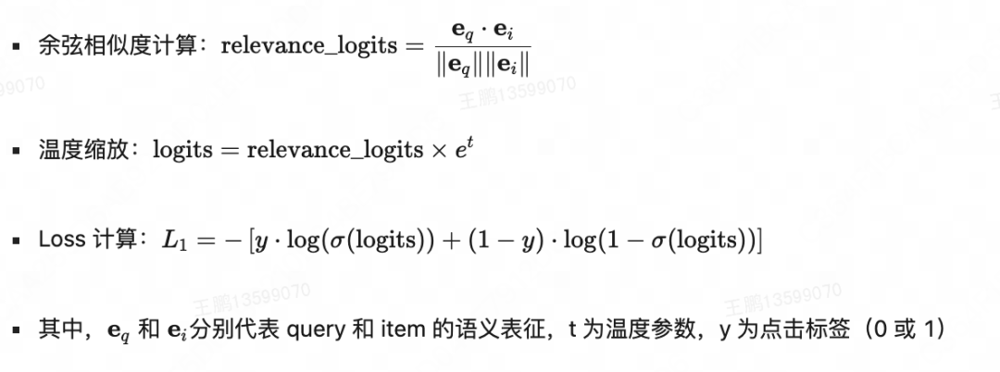

Loss\_1 计算公式

Loss\_2 基于 `<|qi|>` 融合 query 和 item 的双侧信息，经 MLP 后预测点击率，目的是让学到的语义表征对齐下游排序目标。

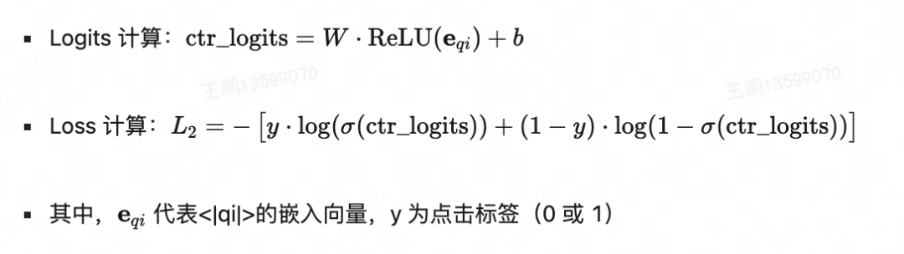

Loss\_2 计算公式

最终 Loss：L = Loss\_1 + Loss\_2。

双 Loss 设计的目的是让模型同时学习"单侧表征的质量"和"双侧匹配的判断"——前者直接服务于推理时的 cosine 相似度计算，后者辅助表征对齐下游点击率预估目标。

### 从模型到特征：推理、分桶与注入

推理时分别独立生成 Query 和 item 的语义 Embedding，离线存储至 Hive 表，按天例行增量更新。

### 模型推理

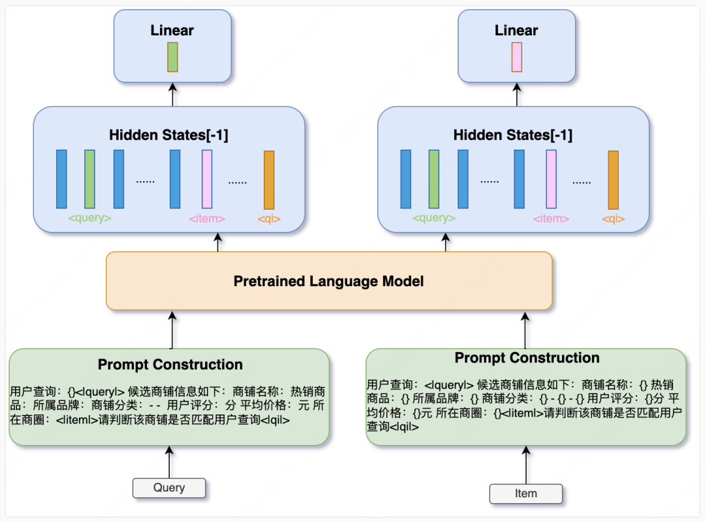图2 一期表征生产流程

### 精排模型集成

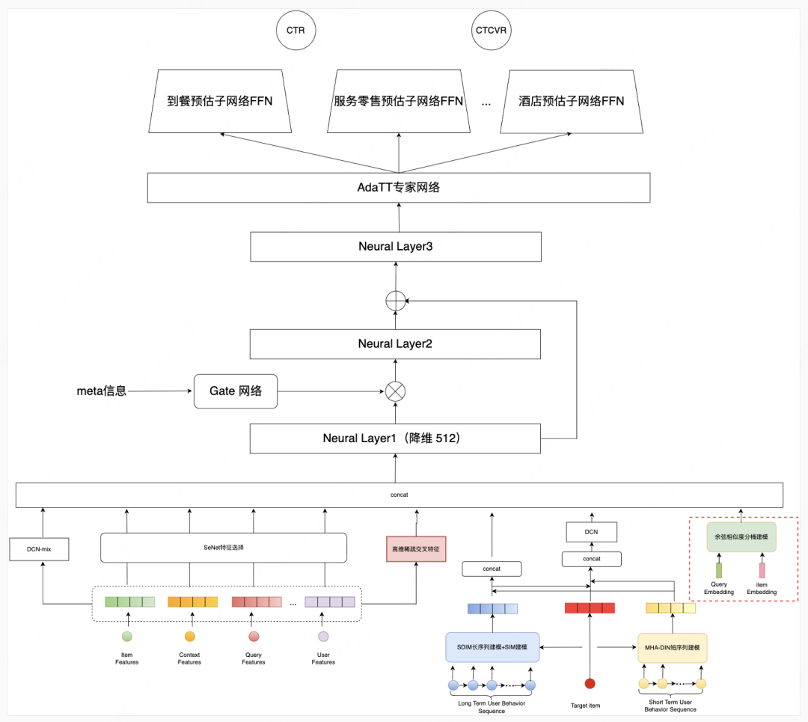图3 一期精排集成方式

模型获得语义 Embedding 后，计算 Query 与 item 的 cosine 相似度，并按预设的分桶边界将相似度划分进 10 个分桶。分桶边界为[-0.40, -0.30, -0.18, -0.12, 0.00, 0.10, 0.16, 0.22, 0.30]，设计时考虑了每个桶内的样本量分布，并尽可能区分下单与未下单、点击与未点击等行为标签。

通过抽取 2 万条搜索曝光样本，我们验证了不同类型样本在各分桶中的分布。如下图所示，Query 和 item 语义越相似，点击/下单的样本占比越高：

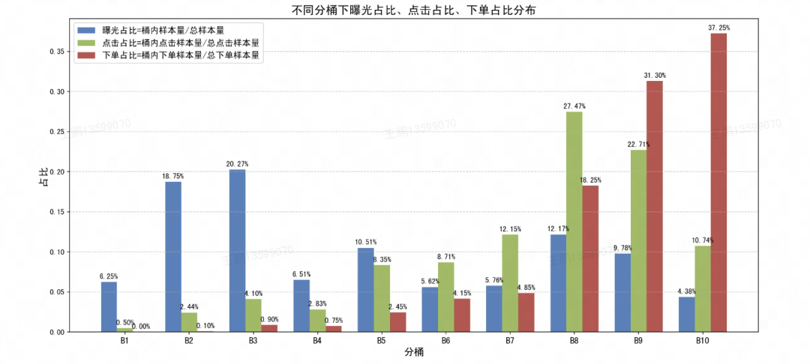图4 不同行为标签在各 cosine 相似度分桶中的分布（2 万条搜索曝光样本）

这意味着我们可以将 Query 和 item 的语义表征相似度作为一个强特征引入排序模型，以提升模型在点击/下单率预估方面的表现。

为了实现这一目标，我们为每个分桶分配一个可学习的 Embedding 向量（12 维），拼接到精排模型现有特征中。使用分桶而非直接使用连续相似度值的原因是：离散化后的特征能更好地被精排模型的特征交叉网络利用，同时降低噪声敏感度。使用可学习的 Embedding 向量则是为了增强模型对于不同相似度区间的表达能力。

离线验证显示，引入表征特征后点击 NDCG +9bp，下单 NDCG +13bp，验证了方案的有效性。

### | 2.3 线上效果 ###

实验周期 2025 年 9 月 18 日至 10 月 1 日，20%流量 14 天，AA 校验通过。

大盘搜索支付订单显著+0.20%，服务零售订单显著+0.27%。更值得关注的是体验指标的表现：长尾 NDCG@5 显著+2.21pp，长尾 BadCase@1 显著-2.96pp。语义理解提升在长尾场景体感最明显——这正符合预期，因为长尾 Query 恰恰是传统词面匹配最薄弱的地方。

一个只有 64 维的语义表征，仅通过分桶拼接的方式注入精排，就带来了显著的订单增量——这个结果直接证明了 LLM 语义表征在精排场景的价值，坚定了后续深度投入的信心。

### | 2.4 一期的局限性 ###

一期验证了 LLM 表征在精排中的可行性，但也暴露了四个明显短板。一是只覆盖 Query-商家两端，商品侧语义完全缺失——而在服务零售场景中，用户很多时候是在搜商品而非搜商家。二是全参数微调训练成本高、维护困难，不利于快速迭代。三是微调目标以点击率预估为主，对排序优化不够全面——下游精排同时也关注成单目标。四是三次 Forward Pass 的推理效率有优化空间，表征提取方式还有更高效的替代。这些问题成为二期系统性升级的起点。

## 三、二期：商家精排表征系统性升级

### | 3.1 核心动机 ###

一期验证了 LLM 表征在精排中的可行性，但四个短板制约了进一步迭代：仅覆盖 Query-商家两端，缺失商品语义、全参数微调成本高、点击率分类目标对排序不够全面、三次 Forward Pass 效率低。二期的目标不是单点优化，而是系统性重构表征生产的全流程——从训练数据、基座模型、微调方式、表征提取、降维方式到损失函数，逐一对应一期的短板进行升级，同时将下挂商品（Deal）纳入建模，构建 Query-POI-Deal 三元语义表征体系。

贯穿二期的核心矛盾是：一期的训练目标是"判断 Query 和商家是否匹配"的二分类问题，但排序模型真正需要的是"在多个候选中哪个更匹配"的相对序关系。这个矛盾直接驱动了从点击率分类到对比学习的损失函数重设计，也间接影响了训练数据构建（需要难负样本）、表征提取方式（需要更高效的聚合）等其他模块的决策。

### | 3.2 技术方案 ###

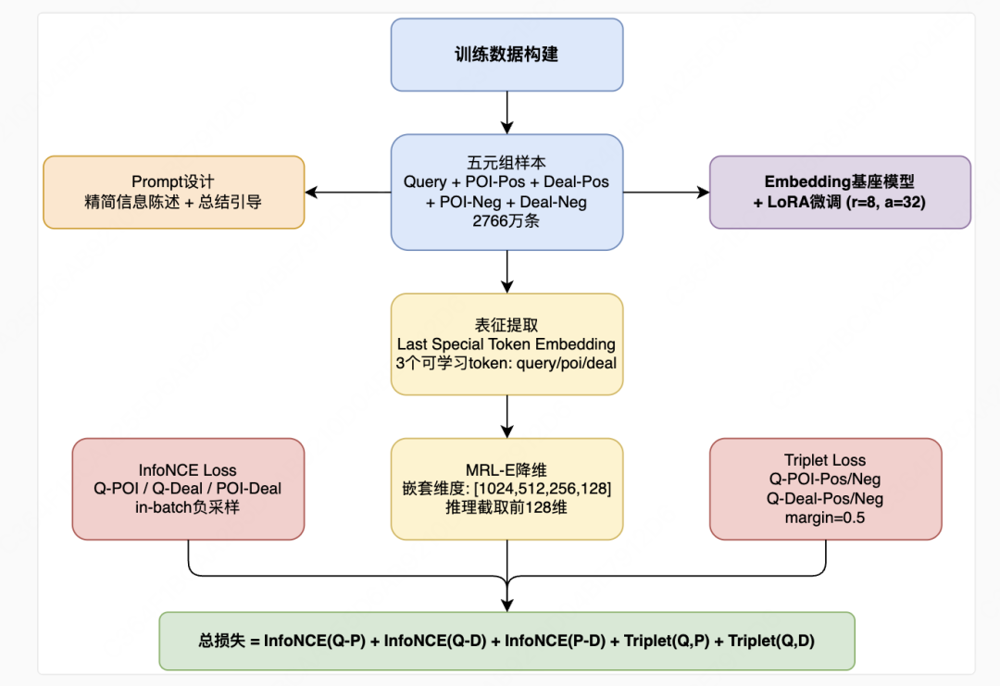图5 二期技术方案全景

### 训练数据：从单条样本到五元组

一期每条样本只有 Query 和 POI 两部分，用于对齐下游目标的训练信号是"是否点击"。二期将每条样本扩展为五元组：Query、Deal 正样本、POI 正样本、Deal 难负样本、POI 难负样本。难负样本的选取是关键——Deal 难负样本来自同一请求、同一商家下曝光但未点击的商品，POI 难负样本来自同一请求下曝光但未点击的商家。这种"同请求"的难负采样策略确保了负样本与正样本在 Query 意图和上下文上高度相似，只在"是否被用户选择"上有差异，能迫使模型学到更精细的判别能力。最终我们构建了 2766 万条训练样本。

### Prompt 设计：反直觉的发现

确定了"喂什么数据"后，下一步是"怎么组织成文本"。我们尝试了多种 Prompt 方案：精简信息陈述+总结引导、简单任务指令、丰富版任务指令、仅信息陈述。实验发现一个反直觉的结论：精简信息陈述+总结引导效果最好，过于复杂的任务指令反而降低表征质量。

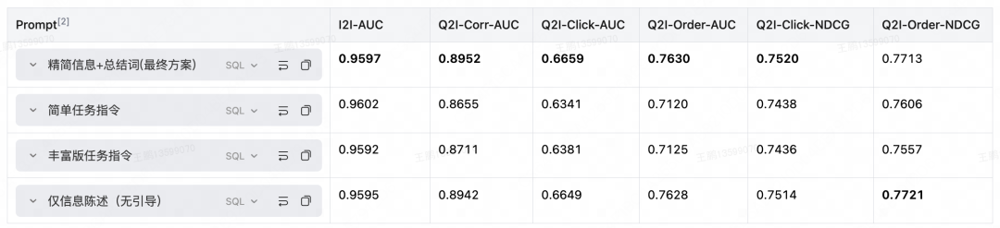不同 Prompt 设计的离线评估结果

这与常见的 LLM 问答任务的直觉相反。我们推测原因是：在 Embedding 训练场景中，Prompt 的作用是引导模型理解"要聚合哪些语义信息"，而非传统的"指令遵循"。过于复杂的指令会干扰模型对核心语义信息的聚合，就像给一个本该专注于理解文本的人过多任务要求，反而分散了注意力。这一结论对后续其他表征场景有直接参考价值。

具体的 Prompt 如下：

* **商家**："商铺信息如下：商铺名称为{}，热销商品为{}，品牌名为{}，主营类目的三级标签分别是{}、{}、{}，次营类目为{}，所属商圈为{}。请根据以上信息，详细描述该商铺："

* **下挂商品**："商品信息如下：商品名称为{}，商品类目的三级标签分别是{}、{}、{}，所属商家名称为{}。请根据以上信息，详细描述该商品："

* **搜索词**："查询信息如下：用户查询词为{}。请根据该查询词，总结用户的查询意图："

二期在商家的 Prompt 中也新增了"次级经营品类"、"热销商品"等信息，以期望学到更完整的商家语义表征。

一个值得注意的实验发现是：我们尝试在商品特征中引入 CPV（商品属性）信息后，排序评估效果反而下降：

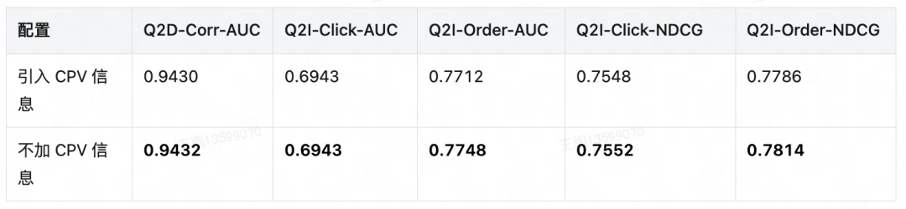商品引入 CPV 离线评估结果

我们推测原因是当前 CPV 信息过于繁杂，未经筛选地引入反而会带来噪声。这个反直觉的结果说明，**在表征训练中，信息质量比信息量更重要**。

### 基座模型与微调方式：从全参到 LoRA

基座模型选择上，我们横向对比了参数量在 0.5B～8B 的多个模型，涵盖通用、Embedding、Instruct 等多个系列。

实验发现，中等参数档位是效果与推理成本的最优平衡点——更大的模型在 NDCG 指标上提升有限且推理成本显著上升；最小参数档位则在各项指标上全面落后。最终选定专门为文本表征任务优化的 Embedding 模型变体，它在 Click-AUC 和 NDCG 上均优于同参数量的通用模型。

微调方式从全参数微调切换到 LoRA<sup style="line-height: 0;"><span leaf="">[3]</span></sup>（r=8、α=32，目标模块 q\_proj 和 v\_proj）。对比实验显示一个有趣的现象：LoRA 在 NDCG 指标上优于全参数微调，但全参在 AUC 上略有优势。这一现象仅在本场景中观察到，是否具有普适性有待验证。综合考虑训练效率和维护成本最终选择 LoRA。

**表征提取：从三 Token 单序列到独立序列+可学习向量**

一期在同一条序列中内嵌三个词表 Token，通过三次 Forward Pass 和不同 AttentiOn Mask 实现信息隔离，推理效率低。二期彻底重构了表征提取方式：不再将 Query 和 item 放在同一条序列中，而是各自在独立的序列中处理；特殊 Token 不再是 vocabulary token，而是 nn.Parameter——一个维度为 hidden\_size 的可学习向量。具体做法是：对输入文本做 tokenize 后取 input embeddings，找到序列中最后一个有效位置，将该位置的 Embedding 覆写为对应的可学习向量，经过 Transformer 后取该位置的 hidden state 作为表征。Query、POI、Deal 各有独立的可学习向量。

这种设计相比一期有几方面优势：不再需要 Attention Mask 隔离（因为各实体本就在独立序列中处理），一次 Forward 可以同时处理五路输入（五元组的各部分拼接在 batch 维度上），推理效率大幅提升。同时，可学习向量直接作为"聚合锚点"放在序列末尾，模型在训练中学会在该位置汇聚全序列的语义信息。

对比实验显示，Last Special Token Embedding 优于 Mean Pooling 和直接取最后一个有效 Token，推测原因是可学习的特殊 Token 比固定位置或平均池化更能有效聚合序列信息并区分不同实体类型。

### 降维方式：从 Linear 到 MRL-E

一期用两层 MLP 将 hidden state 降至 64 维。二期改用 MRL-E<sup style="line-height: 0;"><span leaf="">[4]</span></sup>（Matryoshka Representation Learning）策略：设置嵌套维度列表[1024, 512, 256, 128]，训练时对每个维度分别计算损失并取平均，推理时直接截取前 128 维。

MRL-E 相比 Linear 降维的核心优势不在于精度提升（离线指标差异不大），而在于灵活性：同一套训练出的表征可以根据不同场景的效率需求选择不同维度，无需重新训练。这在后续三期将表征迁移到下挂精排时体现了价值——不同模块对 Embedding 维度的要求可能不同，MRL-E 提供了开箱即用的多尺度选择。因此我们选择 MRL-E 作为最终降维方案。

### 损失函数：从分类到对比学习

这是二期最核心的升级，也是"从分类到排序"这一核心矛盾的直接解法。

一期用 BCE Loss 做点击率二分类，模型只学到"是否匹配"的绝对判断。但排序模型需要的是相对序——在多个候选中哪个更匹配。InfoNCE Loss<sup style="line-height: 0;"><span leaf="">[5]</span></sup>天然面向这个目标：它利用 Batch 内负样本构建对比任务，最大化正样本对相似度的同时最小化与 batch 内其他样本的相似度，本质上是在做"从 N 个候选中选出正确匹配"的排序训练。

我们具体设计了三组 InfoNCE Loss：Query↔POI、Query↔Deal、POI↔Deal。三组对比覆盖了三元实体间所有两两关系，使表征空间同时编码 Query-商家匹配度、Query-商品匹配度和商家-商品一致性。采用归一化嵌入后的内积作为相似度度量，温度参数可学习：

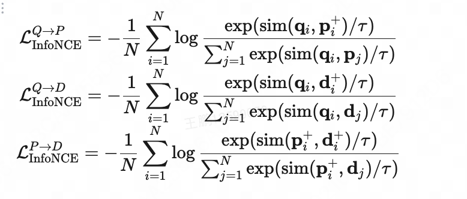

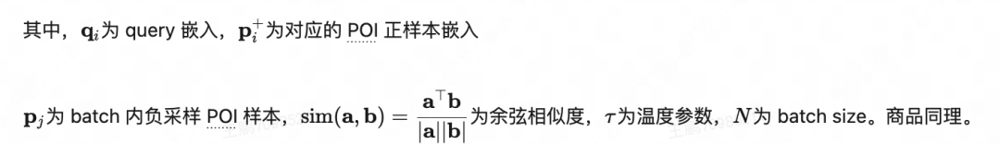

InfoNCE Loss

但如果 InfoNCE 的负样本仅来自 Batch 内随机采样，难度不够——大部分 Batch 内负样本与 Query 的语义差距很明显，模型不费力就能区分。为此我们引入 Triplet Loss 专门处理构建出的难负样本：采用欧氏距离，margin=0.5，分别计算 Query-POI 和 Query-Deal 的 Triplet Loss。难负样本是"同请求同商家曝光未点击"的样本，与正样本在 Query 意图和上下文上高度相似，只在用户选择上有差异——这才是模型真正需要学会区分的。

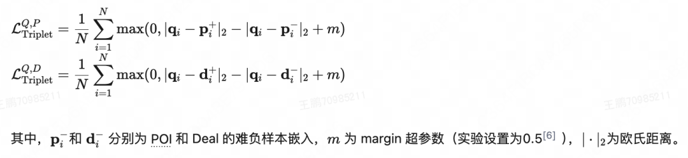

Triplet Loss  

消融实验验证了这一设计：引入 Triplet Loss 后，Q2I-Click-AUC<sup style="line-height: 0;"><span leaf="">[7]</span></sup> +4.85pp，Q2I-Order-AUC +11.02pp。Order-AUC 的提升幅度远高于 Click-AUC，说明难负样本建模对排序下单信号的捕获比点击信号更难、但更有价值——这也印证了"从分类到排序"的转型方向是正确的。

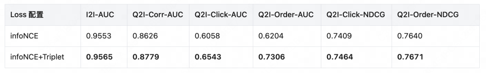

最终的训练目标为上述五个损失的加权和：

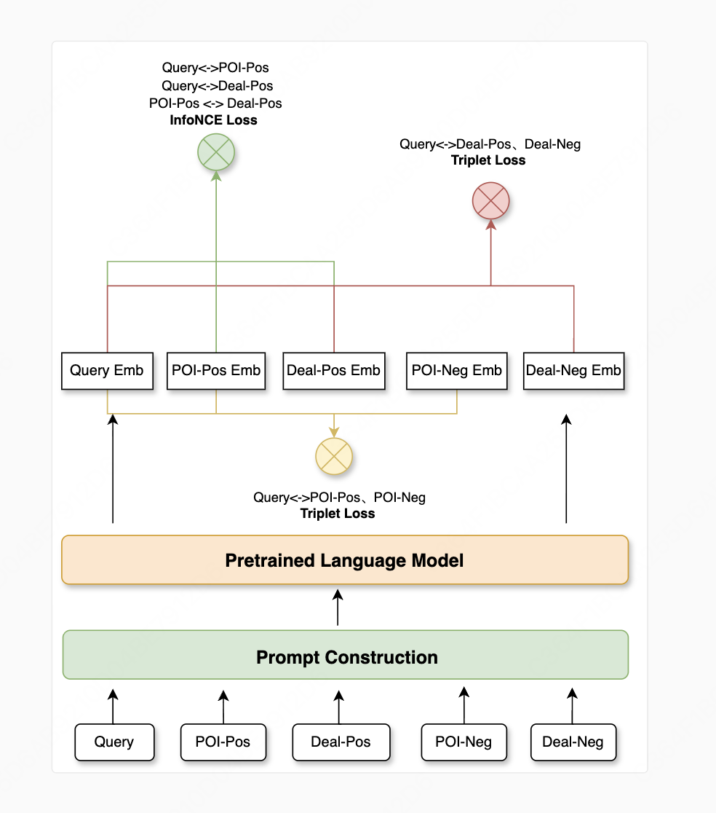图6 二期训练目标与损失函数概览

二期相比一期在多项关键指标上取得了显著提升：Q2I-Click-AUC 提升 6.25pp、Q2I-Order-AUC 提升 5.37pp、Q2I-Click-NDCG 提升 1.77pp、Q2I-Order-NDCG 提升 2.03pp。

### | 3.3 表征应用方式 ###

### 相似度分桶策略升级

沿用一期的相似度分桶机制，但进行了两项升级。一是从单组相似度扩展到双组——同时计算 Query-POI 和 Query-Deal 的 cosine 相似度，各自分桶，使模型能分别利用 Query-商家和 Query-商品的语义匹配信号。二是引入零向量边界，用于捕获无表征样本（缺失表征置为零向量，并在特征计算中进入专门的缺失值分桶），确保未覆盖样本落入同一桶中，避免无表征样本的噪声干扰。

### 底层+顶层双重融合

表征信息通过底层和顶层两种方式融入精排模型。底层融合将分桶 Embedding 与精排模型现有特征拼接，参与特征交叉学习；顶层融合将原始 cosine 相似度直接在顶层拼接，经一层 LHUC 后用于 CTR 和 CTCVR 预测。

为什么要同时做底层和顶层？底层融合让语义特征参与特征交叉，能与其他特征产生交互效应，但经过分桶离散化后丢失了相似度的连续信息。顶层融合直接使用原始 cosine 相似度，保留了连续语义信号，但无法参与特征交叉。两者互补——加入顶层融合后点击 NDCG +5bp，下单 NDCG +3bp。

### 加载方式优化

一期采用 HashTable 热启方式加载表征，但二期引入 Deal 表征且维度从 64 维扩展至 128 维后，若沿用热启方式，模型体积将成倍增长，带来明显的存储和部署压力。为此，在工程实现上，二期优化为"离线训练样本化+线上 KV 读取"方案：离线训练时表征以样本特征形式引入，随样本一同加载；线上服务时从 KV 存储实时读取表征向量。优化后模型体积不增反降，相比一期基线还略有缩减，在牺牲部分应用灵活性的前提下解决了存储和部署压力。

### | 3.4 线上效果 ###

实验周期 2026 年 3 月 17 日至 3 月 23 日，20%流量 7 天，AA 校验通过。

搜索大盘搜索 UV 显著+0.07%，有效点击 QV 显著+0.13%，服务零售结果页有效 QV\_CTR 显著+0.10pp（+0.15%）。性能上 TP90 仅+0.2ms。

线上数据中出现了一个值得分析的现象：服务零售搜索 QV 略有下降（-0.05%，不显著），但有效点击 QV 正向（+0.09%，不显著），结果页 QV\_CTR 显著正向。下钻分析发现，QV 下降主要集中在美团某事业部（-0.70%，显著），但该事业部的 QV\_CTR 反而提升了0.24pp（显著）。原因是实验组优化了排序结果，减少了无效曝光——部分此前会被曝光但不会被点击的结果被更相关的结果替代，虽然总曝光量下降，但转化效率提升。线上排序指标印证了这一判断：实验组点击 NDCG@30 +6bp，点击 GAUC +13bp。

这个现象说明，语义表征的引入不仅是"增加曝光机会"，更重要的是"优化曝光质量"——**让更匹配的商品和商家排在前面，即使用户看到的选项变少了，转化效率反而更高**。

## 四、三期：下挂精排引入表征 + 全域交叉统计特征

### | 4.1 核心动机 ###

商家精排两期的表征体系已成熟，但下挂精排——对商家下挂的具体商品进行排序——在语义维度的建模几乎为零。三期的核心逻辑是：**复用二期已训练的表征模型，将成熟方案平移到下挂精排**。这看起来是最自然的延伸，但实际执行中遇到了意料之外的挑战。

与表征迁移同步进行的，还有一项系统性特征治理工作。团队对下挂精排特征进行了全面梳理，发现部分特征已失效，同时在"个性化×商品"和"Query 意图×商品"两个交叉维度上存在建模空白。因此三期是"大模型表征迁移"和"全域交叉统计特征补充"两条线并行推进，最终以叠加效果上线。

### | 4.2 技术方案 ###

### 扩大覆盖率：迁移的第一道关卡

表征模型直接复用二期，但表征的"覆盖范围"不能直接复用。二期的 Query Embedding 是基于商家精排样本圈选的——即只对商家精排中出现的 Query 生成 Embedding。直接迁移到下挂精排时，Query 覆盖率仅 81.24%，双覆盖率（Query+Deal 同时有 Embedding）更只有 73.61%。

原因在于两个场景的 Query 分布有本质差异。商家精排的 Query 偏向商家意图词（如"SPA"），而下挂精排的 Query 更多是商品意图词（如"双人 XX 套餐"）——用户在商家列表页搜索的是"找什么样的店"，进入下挂排序时搜索的是"买什么样的商品"。这些商品意图词在商户样本中可能从未出现，自然没有对应的 Embedding。

解决方案是重新用下挂精排的样本分布圈选 Query Embedding 的生成范围。修复后 Query 覆盖率升至 98.92%，双覆盖率达 89.81%。

这个工程细节看起来不起眼，但它直接决定了特征有效性。修复前的 73.61% 双覆盖率意味着超过四分之一的样本拿不到语义匹配信号——如果带着这个缺口上线，特征的价值会被严重稀释。这一经验也成为了跨模块复用表征的标准 checklist：表征模型的迁移不是直接复用模型参数，必须针对目标场景的样本分布重新圈选 Embedding 覆盖范围。

### 特征有效性前置验证

补充完 Embedding 后，团队先做了一项前置验证：将 Query 和 Deal 的 Embedding cosine 特征等距分为 100 个桶，分别计算每个桶内各 label（成单、货架成单、点击、全域成单）的平均值。结果显示随着 cosine 分数单调上升，所有 label 均值也单调上升，方向明确。这个验证虽然简单，但它回答了一个关键问题：迁移过来的表征在下挂场景是否依然有效？答案是肯定的——Query-Deal 的语义匹配度与用户行为之间存在清晰的正相关。

### 分桶策略：一种特征，五个视角

cosine 相似度与 label 虽然正相关，但并非严格线性。为了让特征分桶与各 label 呈现更强的正相关性，团队设计了 5 种分桶策略：等样本量分桶（V1，每个桶内样本数相等）、按下挂成单 label 均值等差分桶（V2）、按货架成单 label 均值等差分桶（V3）、以及在下挂曝光样本和货架曝光样本上分别按对应 label 等差分桶（V4、V5）。

为什么要设计 5 种而不是选 1 种？因为下挂精排同时优化多个目标（点击、下挂成单、货架成单），不同目标与 cosine 分数的关系曲线不同。等样本量分桶对综合目标最优，而按特定 label 等差分桶则在该 label 的方向上更敏感。Droprank 特征重要性分析也印证了这一点：V1（等样本量分桶）综合重要性最高（排名第21），但 V2、V3、V4 也分别排在第40、164、129 位——它们从不同方向对模型有独立贡献。

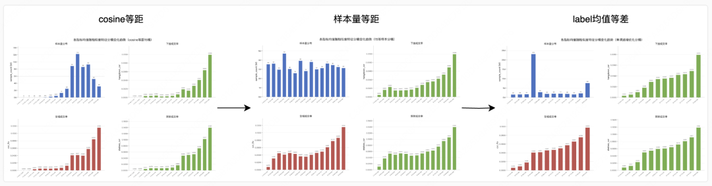图7 不同分桶策略下 label 均值与 cosine 相似度的对应关系

### 应用方式：从底层拼接到 PEPNet 门控

三期在表征与模型的耦合方式上做了系统探索。对比了 4 种方案：底层拼接交叉统计特征（+7bp）、底层拼接 LLM 相似度+交叉统计特征（+18bp）、LLM 相似度放在输出塔前（+8bp，且部分指标负向）、PEPNet 门控注入<sup style="line-height: 0;"><span leaf="">[8]</span></sup>（+25bp）。

为什么 PEPNet 门控效果最优？底层拼接让语义特征参与特征交叉，但经过分桶离散化后信号被压缩；输出塔前注入保留了连续相似度信号，但无法与模型其他特征交互。PEPNet 门控机制的优势在于：它将语义相似度作为"门控信号"调制模型其他特征的权重——高语义匹配时放大相关特征的贡献，低匹配时抑制。这种自适应调节比固定位置的拼接更灵活，离线 ctcvr\_auc\_global\_poi +25bp，远高于底层拼接的 +18bp。

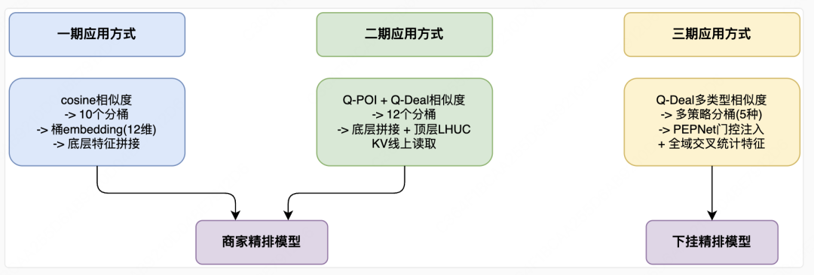图8 三期表征注入方式对比：底层拼接、输出塔前注入、PEPNet 门控的离线效果

### 全域交叉统计特征：语义维度之外

在大模型表征之外，三期还补充了四类全域交叉统计特征：user×deal id 体系交叉统计、POI 的 cate3 统计特征、user×POI 的 cate3 交叉统计、query×deal id 体系交叉统计。这四类特征弥补了下挂精排在"个性化×商品"和"Query 意图×商品"两个交叉维度上的建模空白。其中订单及转化相关特征因覆盖率极低（低于 0.1%），在消融实验中被移除——这也是一个值得注意的经验：统计特征的价值不仅取决于相关性，还取决于覆盖面，覆盖率太低的特征即使方向正确也难以产生实际收益。

### | 4.3 线上效果 ###

实验周期 2026 年 5 月 28 日至 6 月 3 日，10%流量 7 天，AA 校验通过。

服务零售业务订单显著 +0.32%，服务零售访购率显著 +0.29%，搜索大盘支付订单显著+0.35%，大盘访购率显著 +0.25%。

三期的 +0.32% 订单是大模型表征和全域交叉统计特征两类特征叠加的结果。两类特征在离线均单独验证正向，但叠加效应比预期更强。这说明语义维度（LLM 表征）和统计维度（交叉特征）在捕获用户偏好上存在互补性——语义特征捕捉的是" Query 和商品在语义上是否匹配"，统计特征捕捉的是"具有某种行为的用户是否偏好这类商品"，两者从不同角度刻画了用户-商品的匹配关系，叠加后形成了更完整的判断。

## 五、核心洞察与经验沉淀

三期迭代的技术细节已在前文展开，这里不再复述，而是聚焦于几条跨阶段的、对后续工作有直接指导意义的判断。

## 1、 中等参数量是当前阶段的最优平衡点，但不一定是终局。 在 0.5B～8B 的参数量区间内，中等档位模型在效果与推理成本上取得了最优平衡。专门为表征任务优化的 Embedding 变体优于同参数量的通用模型 。但这个结论有阶段局限性：随着推理优化技术（量化、蒸馏、推测解码）的成熟，更大模型的推理成本会持续下降，最优平衡点也会上移。因此更本质的认知是——表征模型的选型不应追求"最大可用"，而应在当前推理预算下选择效果最优的，并定期重新评估。

## 2、 难负样本是提升表征判别能力的关键。一期使用点击率分类目标，模型只学到"是否匹配"的绝对判断，表征的判别能力有限。二期引入"同请求同商家曝光未点击"的难负样本，配合 InfoNCE + Triplet 对比学习框架后，离线指标大幅提升。难负样本的核心价值在于：它迫使模型学习"在高度相似的候选中，用户为什么选了这个而非那个"——这种精细判别能力是单纯靠正样本和随机负样本无法获得的。在构建表征训练数据时，难负样本的质量直接决定了表征质量的上限。

## 3、 Embedding 场景的 Prompt，做减法比做加法有效。 在传统 LLM 任务中，更详细的指令通常带来更好的效果。但在 Embedding 训练场景，精简信息陈述+总结引导优于复杂的任务指令和推理链。原因是 Embedding 的 Prompt 作用是"引导模型聚合哪些语义信息"，而非"指导模型完成什么任务"——过多的任务指令会干扰模型对核心语义的聚焦。这一结论与传统 LLM 任务的直觉相反，对后续其他表征场景有直接参考价值：写 Embedding 的 Prompt 时，问自己"模型需要从这段文字中聚合什么信息"，而不是"模型需要完成什么任务"。

## 4、 表征迁移的核心风险不在模型，而在覆盖率。 三期最大的工程挑战不是模型适配，而是 Query 覆盖率从 81.24% 到 98.92% 的修复。表征模型的参数可以直接复用，但 Embedding 的覆盖范围必须针对目标场景重新圈选——否则覆盖率缺口会直接压低特征有效性。这条经验看似简单，但容易被忽略，因为"复用模型"天然暗示着"可以直接上线"。后续任何跨模块迁移表征的工作，都应将覆盖率验证作为第一步 Checklist。

## 5、语义特征和统计特征是互补的，不是替代的。 三期的 +0.32% 订单是两类特征叠加的结果，且叠加效应比预期更强。语义特征从"Query 和商品在语义上是否匹配"的角度刻画用户-商品关系，统计特征从"具有某种行为的用户是否偏好这类商品"的角度刻画——前者是内容理解，后者是行为模式。两者各自有盲区，叠加后形成了更完整的判断。这意味着在特征体系设计中，不应将"大模型表征"和"传统统计特征"视为二选一的方向，而应将它们作为互补的信号源协同设计。

## 六、业内工作对比与独立创新点

本工作处于"LLM 文本表征"与"搜索排序特征工程"的交叉地带。为厘清本工作在技术版图中的位置，从三个维度梳理业内工作。

### 维度一：文本表征模型（Producer）

文本表征领域经历了从 Word2Vec 到 BERT 再到 LLM 的演进。以 E5<sup style="line-height: 0;"><span leaf="">[9]</span></sup>、BGE<sup style="line-height: 0;"><span leaf="">[10]</span></sup>（BAAI）、GTE<sup style="line-height: 0;"><span leaf="">[11]</span></sup>（阿里通义）系列为代表，训练范式以 in-batch negatives + InfoNCE 为标准配方。2025 年基于 LLM 的表征模型成为主流，代表工作有 Qwen3-Embedding（false-negative mask）、Conan-embedding<sup style="line-height: 0;"><span leaf="">[12]</span></sup>（动态硬负样本挖掘）、Llama-Embed-Nemotron<sup style="line-height: 0;"><span leaf="">[13]</span></sup>（纯难负样本 InfoNCE）。这些工作的共同关注点是负例质量——"Embedding 质量的天花板在负例质量，不在 Backbone"已成为业界共识。在降维策略上，MRL 提供了多尺度可截断方案；高效微调方面，LoRA 成为参数高效微调的事实标准。

### 维度二：表征在排序中的应用（Consumer）

在表征如何融入排序模型这一问题上，业内存在多条路线。TIGER<sup style="line-height: 0;"><span leaf="">[14]</span></sup>开创了生成式检索范式，将 Embedding 量化为分层 Semantic ID 用于序列召回，但未直接用于判别式排序。在判别式排序中，表征的注入方式正在从简单拼接向门控和自适应融合演进：UNGER<sup style="line-height: 0;"><span leaf="">[15]</span></sup>指出语义与协同 Embedding 直接拼接时语义信号会占据主导，需显式模态平衡。

### 维度三：难负样本策略

难负样本是表征质量的关键杠杆。ANCE<sup style="line-height: 0;"><span leaf="">[16]</span></sup>首次提出用异步 ANN 索引从全局语料库采样难负样本，解决了 in-batch negatives 信息量不足的问题。此后业界发展出多种策略：Meta 的 realtime hard neg 使用 LLM 聚类后的同簇 OOB 负样本配合 LogQ 校正；Apple Music 的 Elise 采用课程式调度——前期用 InfoNCE 构建全局结构，后期切换到最难 Hinge Loss 锐化边界；小红书的 Uninote 提出多粒度难负挖掘与 JS 散度软标签。这些策略的共性是：从随机负样本转向"够难但不是假负例"的精细构造。

### 独立创新点

将上述工作作为参照系，本工作在以下方面具有独立创新性：

## 1、 面向搜索排序的语义相似度直接特征注入 。业界表征工作以推荐场景为主，表征主要作为底层特征拼接（如 TIGER 的 SID embedding），与排序目标之间的映射是隐式的。本工作基于搜索场景特点，将 query 与供给的 cosine 语义相似度作为直接特征注入精排——分桶离散化参与特征交叉（底层融合），同时保留连续相似度在输出塔前直接参与预测（顶层融合）。这种做法相比推荐场景的底层拼接有两方面优势：一是语义相似度直接刻画"搜索词与供给是否匹配"，与搜索排序目标天然对齐，方案更具可解释性；二是底层 + 顶层的双重融合设计兼顾了特征交叉能力和信号保真度，比单一注入方式更充分地利用了语义信号。

## 2、 基于"店+下挂商品"展示结构的难负样本构造 。利用美团搜索"店+下挂商品"的两层展示结构，构造"同请求、同商家、曝光未点击"的下挂商品作为难负样本。这类样本与正样本在 query 意图和上下文上高度相似（同一搜索词、同一商家），仅在用户选择上有差异——迫使模型学习"在高度相似的候选中，用户为什么选了这个而非那个"。相比 ANCE 的全局 ANN 难负采样，本方案的难负样本天然绑定了搜索场景的上下文信息（同一请求、同一商家），难度更高且更贴近排序任务的真实分布。消融实验显示，引入此类难负样本后 Q2I-Order-AUC 提升11.02pp，远高于 Click-AUC 的4.85pp，验证了"从分类到排序"转型方向的有效性。

## 3、 Query/POI/Deal 三元实体联合表征 。业界文本表征工作以两元对（query-document 或 user-item）为标准建模单元。本工作面向服务零售"搜索词→商家→商品"的三元匹配结构，设计了三组 InfoNCE Loss（Query↔POI、Query↔Deal、POI↔Deal）覆盖三元实体间所有两两关系，使表征空间同时编码 Query-商家匹配度、Query-商品匹配度和商家-商品一致性。这种三元联合对比学习在公开文献中较少见，其设计动机直接来自业务场景——用户在服务零售搜索中既需要找到对的商家，也需要找到对的商品，二者构成层次化匹配关系。

## 七、后续展望

基于三期迭代积累的经验和前沿技术调研，后续有四个值得探索的方向。

## 1、 负例质量提升 ：当前表征训练的最大洼地。 二期的负例策略是 in-batch 随机负样本+单显式难负样本，已有不错效果，但前沿实践表明这个方向还有很大空间。 Qwen3 Embedding 工作 [17] 提出了 false-negative mask——把疑似假负例从 InfoNCE 分母中剔除，是零结构改动的即插项；KALM v2 [18] 的 focal-style 难度重加权让训练聚焦真难例；Nemotron 的相似度阈值筛选只保留"够难但不是假负例"的区间。这些方法的共同认知是：embedding 质量的天花板在负例质量，不在 backbone。当前仅采用 in-batch 随机负样本 + 单个显式难负样本，负例构造仍是明显短板，优先补这一环的性价比最高。

## 2、 MRL 低维档诊断与 SID 量化 ：从连续表征到离散语义 ID。 当前使用 MRL-E 的嵌套维度列表[1024, 512, 256, 128]，推理时截取前 128 维。前沿调研显示两个值得关注的点：一是 d\<128 的极低维档存在退化风险（多篇工作独立证实），需要对各截断层做 neighbor-overlap 诊断，若发现退化，则移除对应维度档位，避免多尺度联合 loss 被最差档拖累。

二是更激进的方向：将连续 Embedding 量化成分层离散语义 ID（Semantic ID）<sup style="line-height: 0;"><span leaf="">[19]</span></sup>。SID 把 embedding 压成"分层的离散码字序列"（如 3 层码本）<sup style="line-height: 0;"><span leaf="">[20]</span></sup>，既保留语义近邻结构，又能像 ID 一样查 Embedding 表、天然层级共享、对新品友好。SID 的潜在价值在于：它打通了语义表征和 ID 特征的壁垒，让大模型表征能以更原生的方式融入排序模型的特征交叉体系，而非仅通过 cosine 相似度分桶间接参与。

## 3、 针对下挂场景重训表征模型 。三期复用的是商家精排的表征模型，训练数据以商户样本为主。下挂样本在 Query 分布（更多商品意图词）和正负样本构成上与商户有显著差异，专项针对下挂场景训练一版表征模型，预期能进一步提升 Embedding 质量和覆盖率。同时，前面提到的负例质量提升和 MRL 诊断，可以一并在这版重训中落地。

## 4、 Producer→Consumer 闭环：让排序信号回灌表征 。当前的表征训练和下游排序是单向的——表征产出后通过 cosine 相似度喂给排序模型，但排序模型学到的场景感知相关性没有回流到表征训练。前沿工作 relevance\_based\_emb 提出了这条闭环的雏形：把下游排序的相关性判断作为蒸馏信号回灌到表征训练，让表征不仅语义准确，还对齐下游排序目标。这是 Producer（表征生产）与 Consumer（排序侧消费）协同的独有优势，有望进一步缩短离在线 Gap。

## 八、总结

本文介绍了服务零售搜索排序团队在 2025 年 Q4 至 2026 年 Q2 期间，将 LLM 语义表征引入精排模型的三期实践。一期验证了可行性——用 64 维 cosine 相似度特征就带来了显著订单增量；二期系统性重构了表征生产全流程——从分类目标转向对比学习，从全参数微调转向 LoRA，构建了 query-POI-deal 三元表征体系；三期将成熟表征迁移到下挂精排——在解决覆盖率问题后，通过 PEPNet 门控注入和全域交叉统计特征的叠加，进一步拓展了收益边界。

三期迭代的主线可以概括为一个认知演进：从"用 LLM 生成一个语义特征"到"构建一套可迁移的表征生产体系"。一期的重心是验证"LLM 表征能不能用"，二期是解决"怎么把表征做好"，三期是探索"好的表征怎么跨场景复用"。每一期的技术决策都建立在前一期的短板分析之上，而非独立的技术选型。

从方法论角度，三期实践沉淀了一条可复用的表征工程路径：用对比学习目标（InfoNCE + Triplet）训练 LLM 表征模型，用 MRL-E 实现多尺度降维，用相似度分桶或 PEPNet 门控注入排序模型。这条路径的每个环节都有明确的工程 checklist——难负样本的质量决定表征上限，Prompt 精简化优于复杂指令，覆盖率验证是跨模块迁移的第一步，语义特征与统计特征应协同设计而非二选一。

### // 注释 //

[1] Hewitt, J. "Initializing New Word Embeddings for Pretrained Language Models". Columbia University. https://www.cs.columbia.edu/\~johnhew/vocab-expansion.html

[2] Prompt：该部分实验在单独商家表征建模阶段进行，表格中未包含商品 Prompt 的对比实验。实验得到的 Prompt 设计原则(精简信息优于复杂指令)可通用到商品表征建模中。

[3] Hu, E. et al. (2022). "LoRA: Low-Rank Adaptation of Large Language Models". ICLR 2022. https://arxiv.org/abs/2106.09685

[4] Kusupati, A. et al. (2022). "Matryoshka Representation Learning". NeurIPS 2022. https://arxiv.org/abs/2205.13147

[5] van den Oord, A. et al. (2018). "Representation Learning with Contrastive Predictive Coding". arXiv:1807.03748. https://arxiv.org/abs/1807.03748

[6] 实验设置为0.5：通过网格搜索实验(m ∈ {0.1, 0.3, 0.5, 0.7,1.0})，发现 m=0.5 时模型在验证集上取得最佳效果，该设置能够在保证正负样本区分度的同时避免过度惩罚。

[7] Q2I-Click-AUC：基于 query 和 item 表征的余弦相似度作为打分，在精排样本上计算得到。这些指标能够直接反映表征的语义匹配质量

[8] Chang, J. et al. (2023). "PEPNet: Parameter and Embedding Personalized Network for Injecting Tunneling Personalized Prior Information". KDD 2023. https://arxiv.org/abs/2302.01115

[9] Wang, L. et al. (2024). "Improving Text Embeddings with Large Language Models". ACL 2024. arXiv:2401.00368. https://arxiv.org/abs/2401.00368

[10] Xiao, S. et al. (2023). "C-Pack: Packaged Resources To Advance General Chinese Embedding". BAAI. arXiv:2309.07597. https://arxiv.org/abs/2309.07597

[11] Li, Z. et al. (2023). "Towards General Text Embeddings with Multi-stage Contrastive Learning". Alibaba. arXiv:2308.03281. https://arxiv.org/abs/2308.03281

[12] Li, S. et al. (2024). "Conan-embedding: General Text Embedding with More and Better Negative Samples". Tencent. arXiv:2408.15710. https://arxiv.org/abs/2408.15710

[13] Babakhin, N. et al. (2025). "Llama-Embed-Nemotron-8B: Training Llama 3.1 8B as a Top-Performing Embedding Model". NVIDIA. arXiv:2511.07025. https://arxiv.org/abs/2511.07025

[14] Rajput, S. et al. (2023). "Recommender Systems with Generative Retrieval". NeurIPS 2023. arXiv:2305.05065. https://arxiv.org/abs/2305.05065

[15] (2025). "UNGER: Generative Recommendation with A Unified Code via Semantic and Collaborative Integration". HUST & Huawei. arXiv:2502.06269. https://arxiv.org/abs/2502.06269

[16] Xiong, L. et al. (2020). "Approximate Nearest Neighbor Negative Contrastive Learning for Dense Text Retrieval". arXiv:2007.00808. https://arxiv.org/abs/2007.00808

[17] Zhang, D. et al. (2025). "Qwen3 Embedding: Advancing Text Embedding and Reranking Through Foundation Models". Alibaba Group. arXiv:2506.05176. https://arxiv.org/abs/2506.05176

[18] Zhao, K. et al. (2025). "KaLM-Embedding-V2: Out-tasking Specialized LLM Embedders for Multi-lingual Multi-context Retrieval". arXiv:2506.20923. https://arxiv.org/abs/2506.20923

[19] Ju, Z. et al. (2025). "Generative Recommendation with Semantic IDs: A Practitioner's Handbook". Snap Inc. arXiv:2507.22224. https://arxiv.org/abs/2507.22224

[20] Fu K. et al. (2025) "Forge: Forming semantic identifiers for generative retrieval in industrial datasets"[J]. arXiv preprint arXiv:2509.20904, 2025. https://arxiv.org/abs/2509.20904


欢迎大家在文末评论区积极留言，分享自己对搜索、推荐等技术发展方向的看法，也可以进行讨论和经验分享。我们会精选一些评论，给大家送上一份美团定制的小礼品。

\---------- END ----------

 推荐阅读 

|[美团正式发布 CatPaw：全场景 AI Agent，从个人提效到企业智能化](https://mp.weixin.qq.com/s?__biz=MjM5NjQ5MTI5OA==&mid=2651783056&idx=1&sn=c5c7f73638bc777077e1b88b6f6acebd&scene=21#wechat_redirect)

|[正式开源！美团 LongCat-2.0 同步开放国产卡推理代码](https://mp.weixin.qq.com/s?__biz=MjM5NjQ5MTI5OA==&mid=2651783022&idx=1&sn=9c28dd11a4d95d5eebbb097e0a1aace0&scene=21#wechat_redirect)

|[Agent评测漫谈 —— 由浅入深讲解Agent评测](https://mp.weixin.qq.com/s?__biz=MjM5NjQ5MTI5OA==&mid=2651783112&idx=1&sn=785b0bc4b98c0324a528cb87717f3032&scene=21#wechat_redirect)

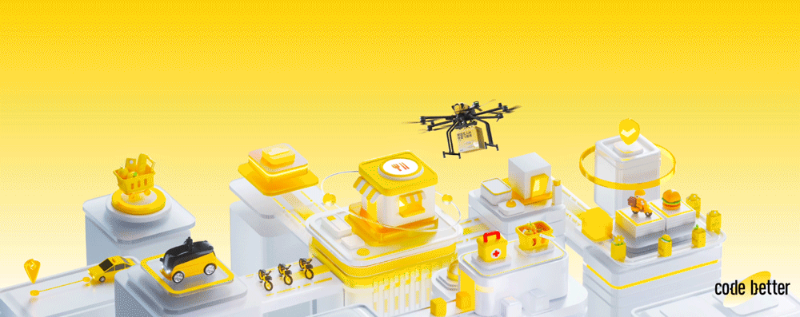


❤️❤️❤️ 如果这篇文章对你有帮助，欢迎大家帮忙点赞、评论，分享给更多的小伙伴。⬇️

