# 📰 Karpathy 最新分享：用 LLM 搭建个人知识库，告别 RAG 的低效循环

你以为把文档扔给 AI 让它检索就叫知识管理？Karpathy 说，那叫每次从零开始。

几个小时前，Karpathy 在 GitHub 上发了一篇 Gist，提出了一个完全不同的思路：不是让 AI 被动检索，而是让 AI 主动帮你建一个 Wiki，持续更新、自动交叉引用、知识越积越厚

你只用负责读和想，AI 负责整理和维护

今天老张就按照Karpathy这套方法，手把手教你在 Obsidian 里落地👇

---

# 一、Karpathy 核心洞察为什么 RAG 不够用？

大多数人用 AI 处理文档的方式是 RAG，例如通过NotebookLM、ChatGPT 文件上传一堆文件，问问题的时候 AI 临时检索相关片段，拼出一个答案，基本都是这个模式。

Karpathy 指出了这种方式的根本问题是没有积累。
每次提问，AI 都在从头搜寻知识。
问一个需要综合五篇文档的问题？AI 要每次现场找碎片、现场拼，什么都没沉淀下来。

他提出的替代方案叫 LLM Wiki，让 AI 增量地构建和维护一个持久化的 Wiki，其实就是互相链接的 Markdown 文件。

# 二、Karpathy的实战操作

## 2.1  用Chrome浏览器插件Obsidian Web Clipper 做素材采集

1、在浏览器安装 Obsidian Web Clipper 扩展

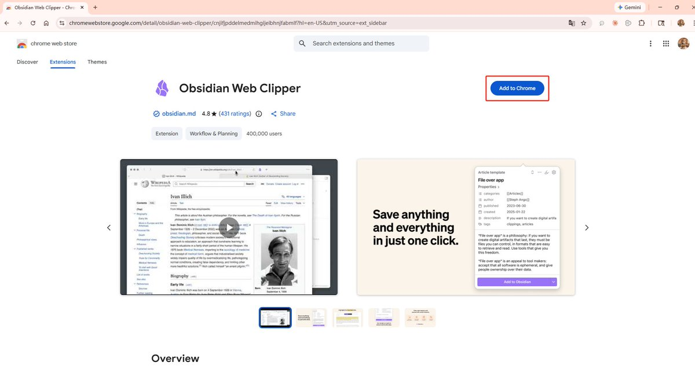

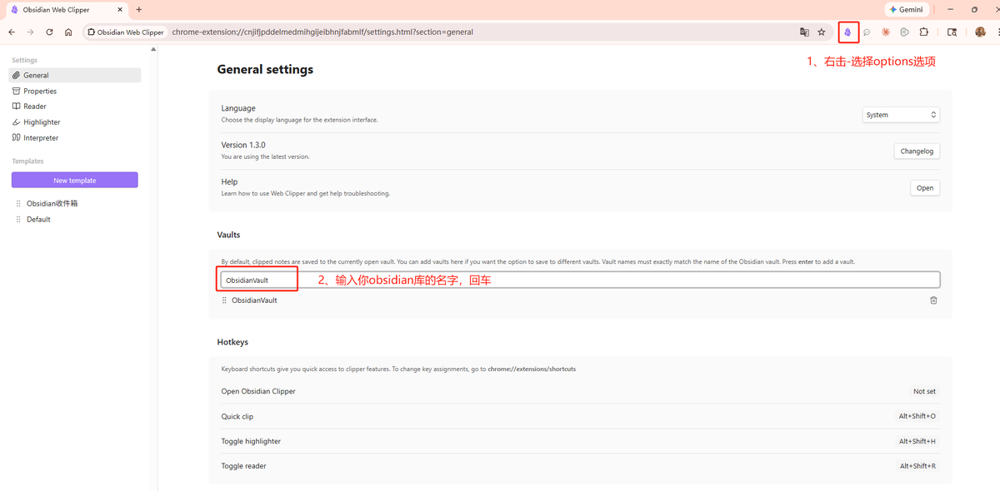

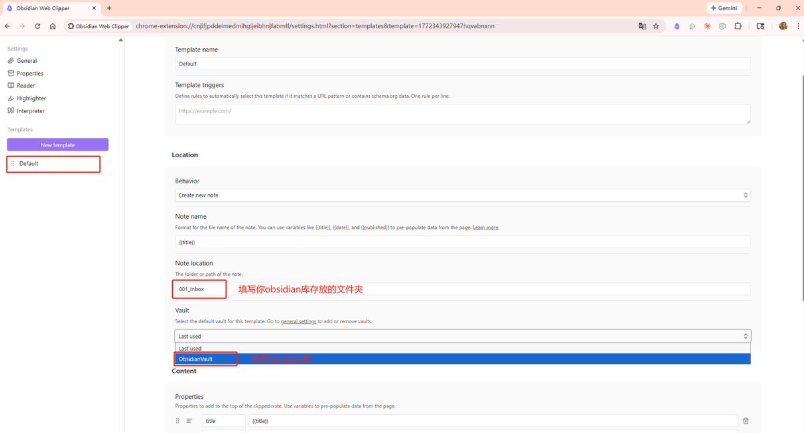

2、打开任意网页文章，点击扩展图标--Add to Obsidian

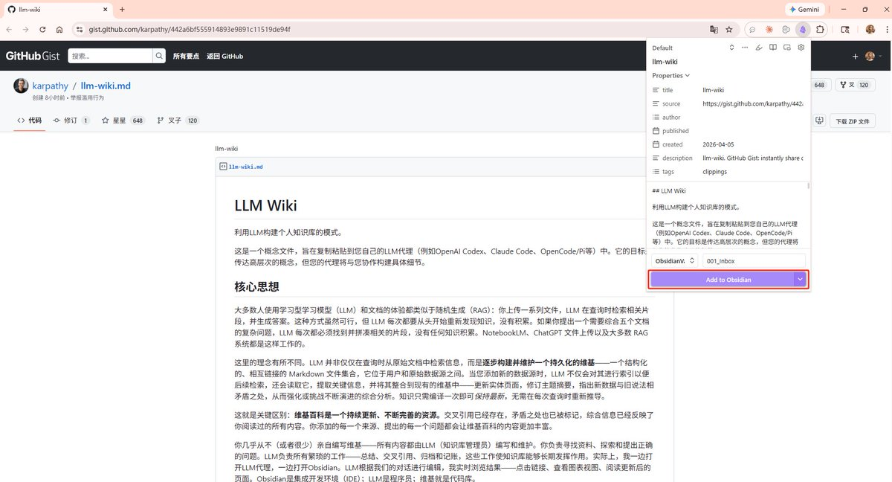

3、保存后文章自动转为 Markdown 出现在 Obsidian 里

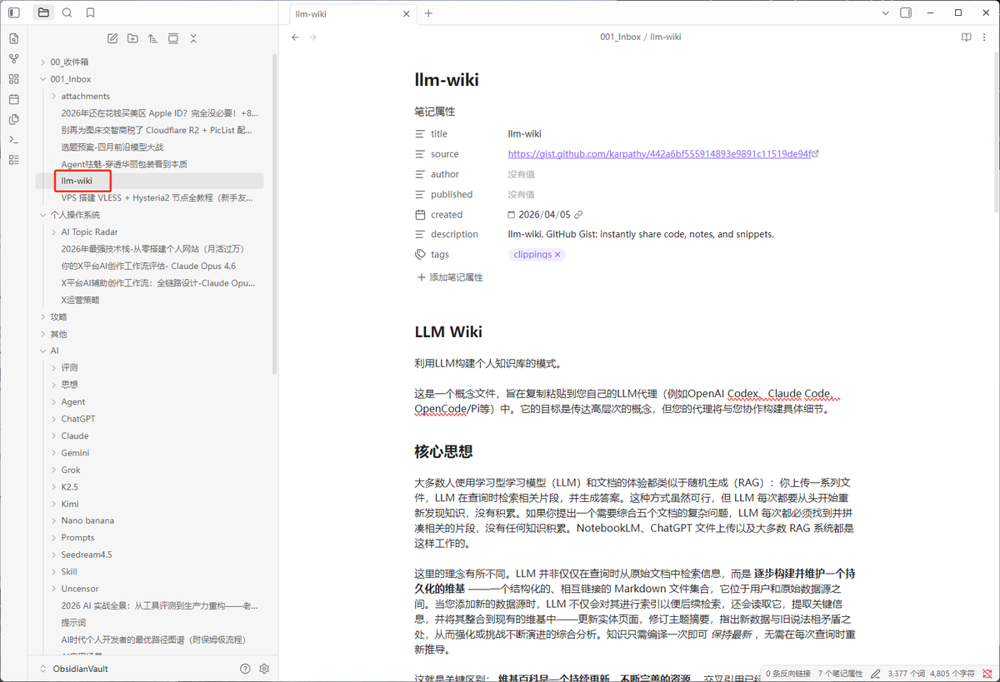

## 2.2 一个快捷键，让图片本地化，告别外链失效

剪藏下来的文章，图片通常还是外链，过几个月链接一挂，文章就残了。更关键的是，AI 读不了挂掉的图片链接。
Karpathy 的方案是两步配置，一劳永逸：

第一步：统一附件存储路径

打开 设置 → 文件与链接 → 找到附件存储路径 → 设为当前文件夹下指定的子文件夹，子文件夹名称设为attachments
不推荐Karpathy的固定到一个目录 raw/assets/ 因为多了之后附件混在了一起不好管理。

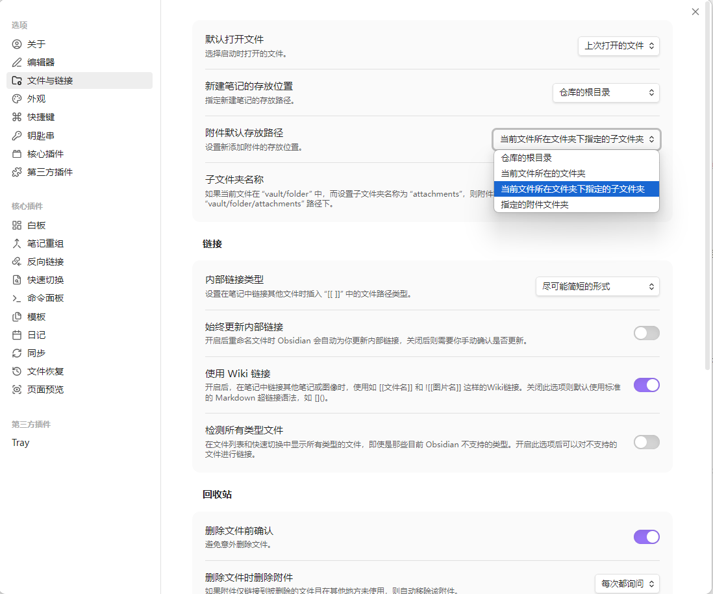

第二步：绑定下载快捷键
设置 → 快捷键 → 搜索 "下载" →  绑定快捷键Ctrl+Shift+D

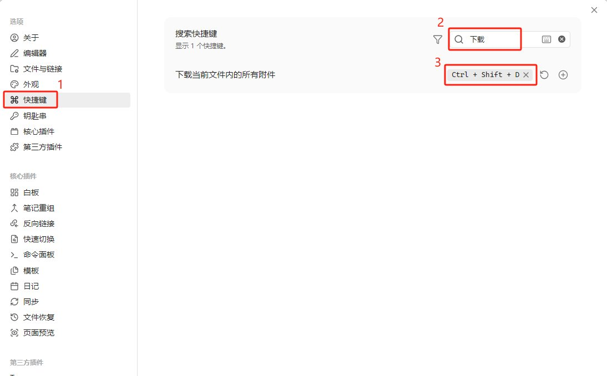

以后每次剪藏完一篇文章，按一下 Ctrl+Shift+D，所有图片自动下载到本地。AI 就能直接读取和引用这些图片了

这里Karpathy分享了一个小细节：LLM 目前没法一次性读取带内嵌图片的 Markdown。变通做法是先让 AI 读文本内容，再让它单独查看文章引用的图片，不够优雅，但管用。

## 2.3 用图谱视图一眼看清知识库的全貌

Obsidian 的 Graph View是这套方法使你的所有 Wiki 页面以节点形式展示，页面之间的 双链 关系自动连线。打开方式：左侧边栏点击图谱图标或者用快捷键 Ctrl+G

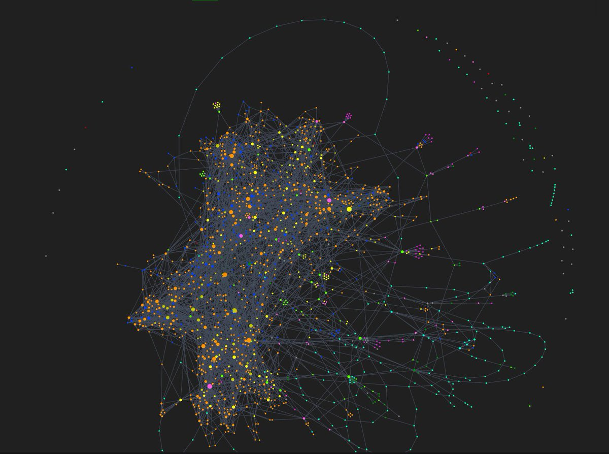

Karpathy把图谱视图结合AI用在两个场景：

1、Lint 健康检查时 一眼看出哪些页面是孤岛没有任何链接指向它，说明交叉引用缺失，需要让 AI 补上

2、发现知识盲区  如果某个概念被很多页面提到但自己没有独立页面，它在图谱里会显示为一个灰色的幽灵节点，提醒你应该让 AI 为它创建专页

## 2.4 用Dataview让 Wiki 自己生成报表（实用价值老张保留意见😂）

Dataview 是 Obsidian 的社区插件，它能对页面的 YAML frontmatter 做数据库式查询，自动生成动态表格和列表。
我觉得这个价值不大，只有多到一定程度或者想用元数据查询方式习惯的可以考虑，老张是直接用索引文件或者配合Claude 的文件检索 ,需要了无非在Prompt写的细一点
安装路径：设置 → 第三方插件→社区插件市场 → 搜索 "Dataview" → 安装并启用

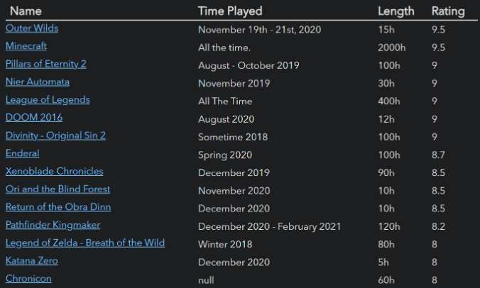

配合 LLM Wiki 的用法是：让 AI 在每个 Wiki 页面的 frontmatter 里写上结构化元数据，比如：

\`\`\`markdown
type: source
title: "文章标题"
date: 2026-04-05
tags: \[AI, knowledge-base\]
source\_count: 3
\`\`\`

然后你在任意页面写一段 Dataview 查询：

\`\`\`markdown
TABLE title, date, tags
FROM "wiki/sources"
SORT date DESC
\`\`\`

就会自动生成一个按日期倒序排列的来源列表，Wiki 页面越多，这个报表越有价值。

## 2.5 用 Marp 把Wiki 里的内容直接变成幻灯片（实用价值老张保留意见😂）

Marp 是一个基于 Markdown 的幻灯片格式，在 Obsidian 里装上 Marp Slides 插件就能直接预览和导出。
安装路径：设置 → 社区插件 → 搜索 "Marp Slides" → 安装并启用。

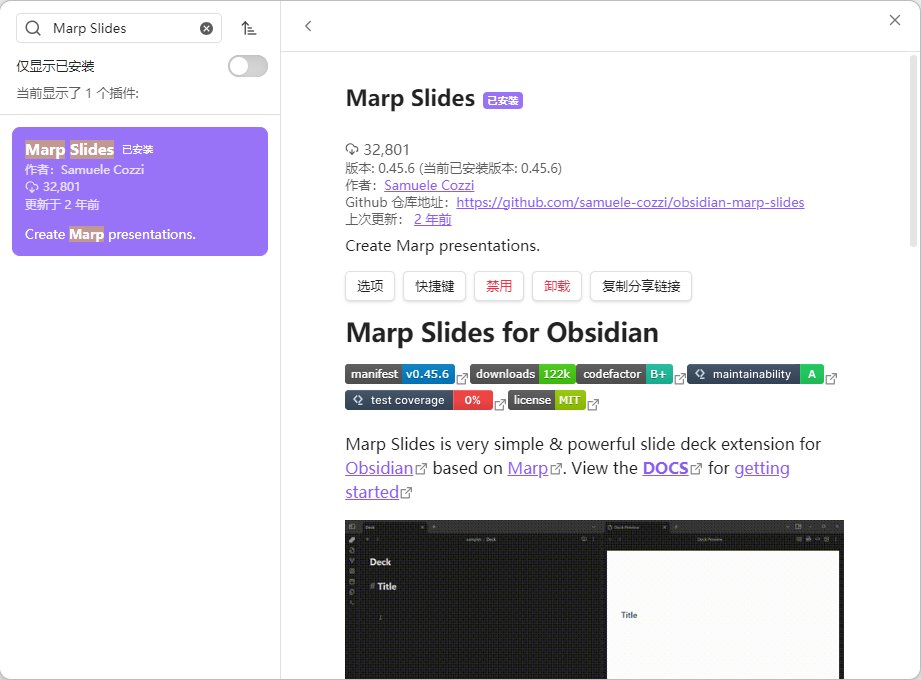

用法：在 Markdown 文件开头加上 marp: true，用 --- 分隔每页幻灯片，写完直接在 Obsidian 里预览，也可以导出为 PDF / HTML / PPTX。

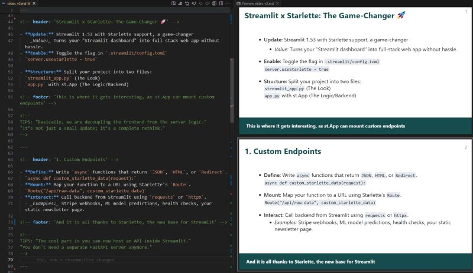

配合 LLM Wiki 的场景，让 AI 从 Wiki 的某个主题页面直接生成 Marp 格式的幻灯片草稿，你微调后就能用。

## 2.6  知识库用Git做版本管理

操作步骤：设置 → 第三方插件 → 社区插件市场 → 搜索 "git" → 安装并启用

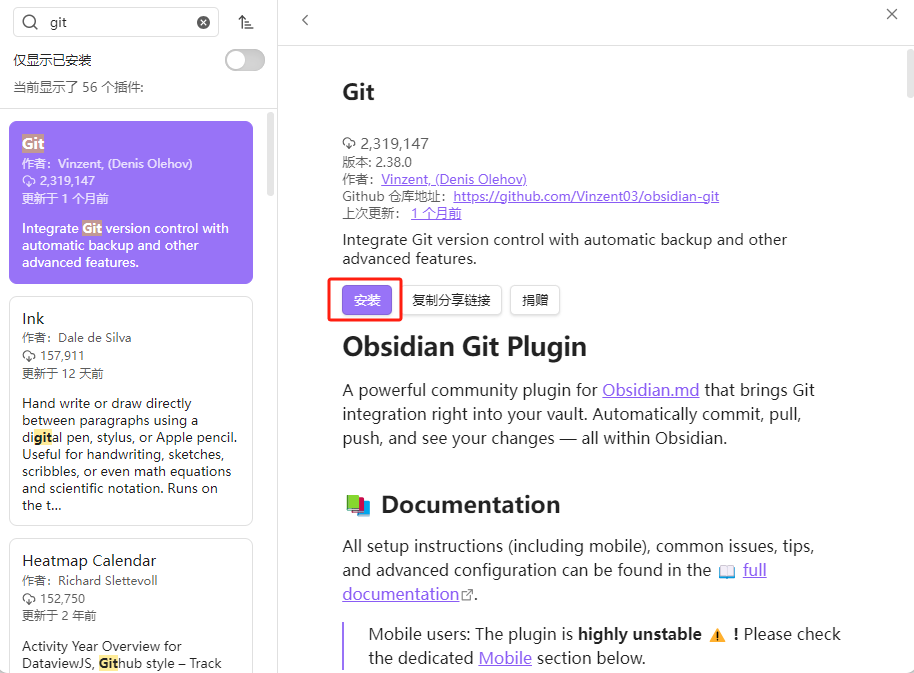

如果你的 Vault 还不是一个 Git 仓库，需要初始化一次：

1、打开终端（Windows 用 PowerShell，Mac 用 Terminal），cd 到你的 Vault 目录 执行 git init 初始化仓库

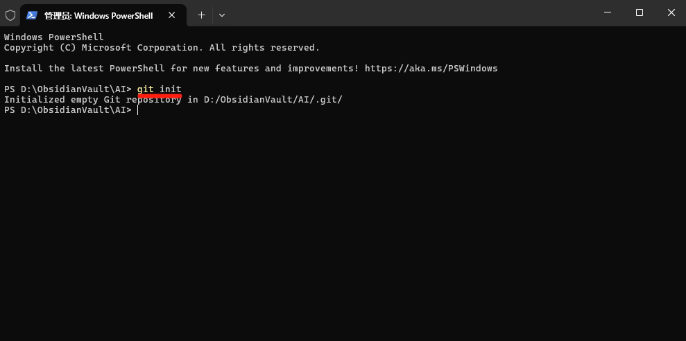

2、打开github.com 创建一个private仓库

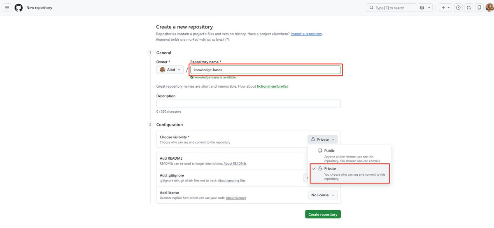

3、如果要同步到 GitHub，在 GitHub 上创建一个私有仓库（重要，知识库是私人数据），然后

\`\`\`bash
git branch -M main
git remote add origin https://github.com/你的用户名/knowledge-bases.git
git add .
git commit -m "init: 初始化知识库"
git push -u origin main
\`\`\`

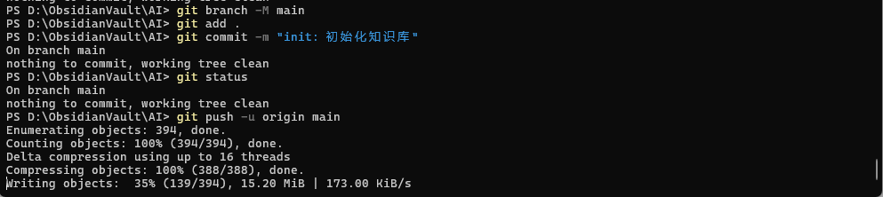

安装完 Obsidian Git 插件后，打开它将Auto commit-and-sync interval设为10 分钟，插件会自动 commit + push，你完全不用管

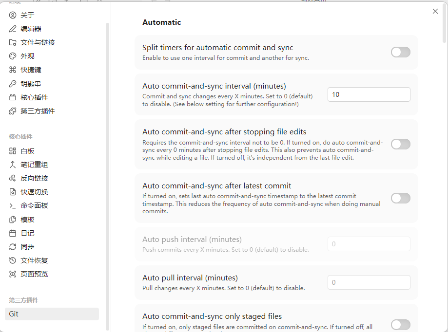

配好之后日常使用你不需要做任何事情。每隔几分钟插件自动 commit 和 push，相当于你的知识库有了一个实时备份+完整历史。

Git 对这套 LLM Wiki 方法来说是必选项，AI 批量改文件的能力越强，你越需要版本管理来兜底。

7\. 搜索利器：qmd 让 AI 精准定位知识

Wiki 规模小的时候，一个 index.md 目录文件就够 AI 导航了。但页面多了之后，需要真正的搜索能力。
Karpathy 推荐 qmd（github.com/tobi/qmd），一个完全本地运行的 Markdown 搜索引擎
对于咱们大多数人，Wiki 到几百个页面之前 index.md 完全够用。等你觉得 AI 找东西变慢了，再接入 qmd 也不迟。

---

# 三、为什么这套方法有效？

Karpathy 的原话很到位 维护知识库最痛苦的不是阅读和思考，而是记录。更新交叉引用、保持摘要最新、标注新旧矛盾、维护几十个页面的一致性。人类放弃 Wiki 是因为维护成本的增长速度超过了价值的增长速度。
但是AI 不会厌倦，不会忘记更新交叉引用，一次操作可以碰十五个文件。维护成本趋近于零，知识库就能真正活下去。

思想精髓： 你把精力放在 选素材、定方向、问好问题、思考意义，AI 负责其他一切。

其实老张觉得 Obsidian Web Clipper + 图片本地化附件热键 + Git + Claude 就够了，完全可以打造和Karpathy一样的RAG知识库，与Claude集成看这篇

[Embedded Tweet: https://x.com/i/status/2037106215747280968]

Karpathy的llm-wiki链接：[https://gist.github.com/karpathy/442a6bf555914893e9891c11519de94f](https://gist.github.com/karpathy/442a6bf555914893e9891c11519de94f)

以上就是老张经过自己实操分享的内容，如果你喜欢，欢迎点赞 、关注 + 转发！

### 🖼️ Attached Media

## 💬 Replies

### 1 @AYi_AInotes (AYi)

*Sun Apr 05 10:07:14 +0000 2026*

@laozhang2579 很细👍

### 2 @laozhang2579 (老张来了) (Author)

*Sun Apr 05 10:17:17 +0000 2026*

@AYi\_AInotes 谢谢AYi  Karpathy 这个思路把过去的被动检索变成了主动建模  从根本上解决了向量检索RAG对上下文理解碎片化的问题提供了一个很好的路径

### 3 @yyyole (沐阳)

*Sun Apr 05 10:40:26 +0000 2026*

@laozhang2579 很好的思路，很详细的分享。

### 4 @laozhang2579 (老张来了) (Author)

*Sun Apr 05 10:52:54 +0000 2026*

@yyyole 谢谢 沐阳大V的认可 沐阳老师一直是老张学习的榜样 怎么老张忽然有种被临幸的感觉呢 哈哈哈😂☕️

### 5 @FLMdongtianfudi (Fang)

*Sun Apr 05 10:11:50 +0000 2026*

@laozhang2579 赶紧扔给龙虾让它学习下

### 6 @laozhang2579 (老张来了) (Author)

*Sun Apr 05 10:23:13 +0000 2026*

@FLMdongtianfudi 哈哈哈 Fang回头把龙虾学习结果回来分享下，一起交流😂🤝

### 7 @Lonely__MH (Lonely)

*Sun Apr 05 10:10:25 +0000 2026*

@laozhang2579 老张出品，必属精品。

### 8 @laozhang2579 (老张来了) (Author)

*Sun Apr 05 10:20:04 +0000 2026*

@Lonely\_\_MH Lonely过誉了，我这两天把你的文章全看了一遍，很多都值得收藏反复观看 共勉💪

### 9 @shitunote (马识途)

*Sun Apr 05 10:58:58 +0000 2026*

@laozhang2579 手把手的教啊 赞 正需要这个呢

### 10 @laozhang2579 (老张来了) (Author)

*Sun Apr 05 11:19:57 +0000 2026*

@shitunote 哈哈哈🤝 做 AI 实践的最怕在低效 RAG 里打转 写的时候觉得这个实操一定要分享出来，能帮到你老张太开心了😂

### 11 @xiangxiang103 (雨哥向前冲)

*Sun Apr 05 11:46:31 +0000 2026*

@laozhang2579 老张这版超级完整啊，每步都很到位，基本完全复刻了AK的想法，给力！

### 12 @laozhang2579 (老张来了) (Author)

*Sun Apr 05 12:02:32 +0000 2026*

@xiangxiang103 谢谢雨哥的认可  确实是边啃AK 边把细节补全，目标就是老张提前把路趟一遍让大家少走弯路，能直接上手

### 13 @ModengSir (Modengsir AI)

*Sun Apr 05 12:08:37 +0000 2026*

@laozhang2579 够全面，收藏了，慢慢消化

### 14 @laozhang2579 (老张来了) (Author)

*Sun Apr 05 12:22:18 +0000 2026*

@ModengSir 摩灯先森的收藏就是对老张文章最大的认可，等你哪天开搞的时候回来翻这篇，希望还能帮你节省点时间😀

### 15 @happy20250912 (硅谷AI玩家)

*Sun Apr 05 10:15:51 +0000 2026*

@laozhang2579 维护知识库最痛苦的不是阅读和思考，而是记录📚(¯∇¯;)确实📖(≧∇≦)

### 16 @laozhang2579 (老张来了) (Author)

*Sun Apr 05 12:13:27 +0000 2026*

@happy20250912 一针见血 感受和你一样  Karpathy的这套方法让我们看到我们宝贵的精力应该放哪 怎么跟AI协作 给了一条清晰的脉络

### 17 @issacmsa (Issac)

*Mon Apr 06 08:25:45 +0000 2026*

@laozhang2579 為什麼我按照您的方法設置，Add to Obsidian卻無法自动出现在 Obsidian 里

### 18 @laozhang2579 (老张来了) (Author)

*Mon Apr 06 08:37:25 +0000 2026*

@issacmsa 首先确认你插件设置的Obsidian库 是不是你当前打开的，第二个是确认保存的文件夹是否在你库里一级目录

### 19 @austincityu (Austin)

*Tue Apr 07 06:02:12 +0000 2026*

@laozhang2579 请教老张，我按照您的步骤实践后，Obsidian Git 插件自动同步每次都要求输入github的用户名和token，这个如何解决呢？

### 20 @laozhang2579 (老张来了) (Author)

*Tue Apr 07 06:15:09 +0000 2026*

@austincityu 在你git上点设置然后在Developer settings里创建一个你的Personal access tokens
回到本地git config --global credential.helper store

### 21 @ChazzJang (Chazz Jang)

*Tue Apr 07 04:06:29 +0000 2026*

@laozhang2579 感谢内容。请问视频内容（youtube、其他视频平台等）有办法这样纳入Obsidian么？

### 22 @laozhang2579 (老张来了) (Author)

*Tue Apr 07 04:14:14 +0000 2026*

@ChazzJang 可以通过超链接的形式纳入markdown文档中，视频为主的话 基座模型就推荐Gemini  其次GPT,  尤其YTB 只有Gemini能做到逐帧级分析 ，文档Karpathy指引里放的是Claude的Claude.md 或者OpenAI的Agents.md

### 23 @Ianyao007 (Ian Yao)

*Tue Apr 07 07:02:56 +0000 2026*

@laozhang2579 谢谢分享。我想请教一下：我现在主流用notion  感觉上需求没那么强，是我的使用场景不对？

### 24 @laozhang2579 (老张来了) (Author)

*Tue Apr 07 07:12:52 +0000 2026*

@Ianyao007 notion区别在云端管理，区别是Claude里叫connectors ChatGPT叫Apps, 不一定完全按照AK的方法，只要找到一个适合你的习惯方式就是最好的

### 25 @JunEr_Lab (JunEr)

*Sun Apr 05 11:27:18 +0000 2026*

@laozhang2579 谢谢你的分享，我也在自己搭建……使用一阵感受一下

### 26 @laozhang2579 (老张来了) (Author)

*Sun Apr 05 11:36:29 +0000 2026*

@LqzhsyCfNq89679 哈哈 你执行力真强 自己搭一遍用起来最有感觉，欢迎随时回来交流心得 🤝

### 27 @ervintrust (Ervin💫)

*Mon Apr 06 22:22:18 +0000 2026*

@laozhang2579 如果不是本地搭建而是在服务器上搭建，并且多人提交引用，老张有什么建议吗？

### 28 @laozhang2579 (老张来了) (Author)

*Tue Apr 07 01:23:41 +0000 2026*

@ervintrust Karpathy在架构那意思一个是维护CLAUDE.md或者AGENTS.md另一个我们可以理解为索引文件和日志wiki文件夹下维护index.md和log.md 前期可以考虑半自动化 先丢入新的资料 然后LLM会根据你维护的最前面的那个markdown的信息处理 等你觉得满意了再考虑全自动

### 29 @Lil_Vic_160 (Vic Chen)

*Sun Apr 05 15:37:37 +0000 2026*

@laozhang2579 想請問老張 github 有遇到過限制嗎？
因為個人 wiki 或 vault 龐大到百筆至千筆後 (含圖片) 的大小可能無法 git...

### 30 @laozhang2579 (老张来了) (Author)

*Mon Apr 06 01:42:19 +0000 2026*

@Lil\_Vic\_160 好问题 Git的LFS免费2G，推荐用Cloudflare的R2做图片存储，过两天老张单独发一个操作指引

