# 📰 将Claude Code 接入Telegram（保姆级教程）

昨晚躺在床上刷手机，随手在 Telegram 发了句"帮我写个 Python 脚本检测服务器状态"，30秒后，我电脑上的 Claude Code 自动执行完毕，结果直接返回到了我手机上

没开电脑，没碰键盘，一条消息就让 AI Agent 替我干活了！

这不是什么未来概念，今天这篇教程，老张和你一起5分钟搞定👇

---

## 第一步：环境准备

MCP 服务器需要依赖 Bun 运行，如果你的电脑上还没有安装 Bun，请先打开终端并运行以下命令进行安装：

\`\`\`bash
npm install -g bun
\`\`\`

## 第二步：创建一个 Telegram 机器人

我们需要在 Telegram 里创建一个专门的机器人来充当传话筒

1. 打开 Telegram，在搜索框搜索 "@BotFather"

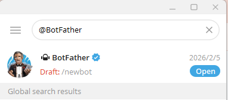

2、向它发送指令 /newbot, 按照提示，它会问你两个问题：Name 和Username（机器人的唯一 ID）必须以 bot结尾

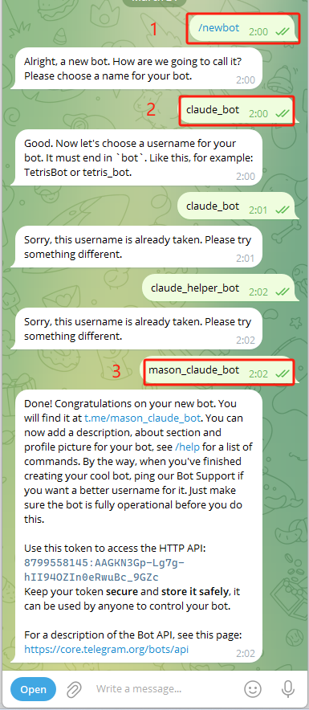

3、创建成功后，BotFather 会回复你一大段话，里面包含了一串 Token

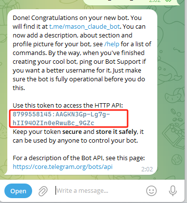

## 第三步：安装并配置 Claude 插件

1. 在 Claude Code 的输入框中，输入以下命令安装 Telegram 插件：

\`\`\`bash
/plugin install telegram@claude-plugins-official
\`\`\`

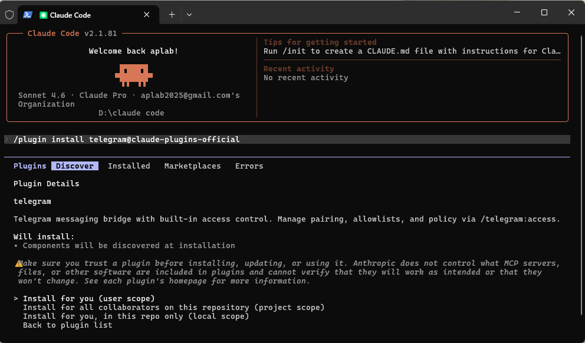

2、安装完成后，配置你刚才获取的 Token（把下面 Token 替换成你自己的）：

\`\`\`bash
/telegram:configure 87955:AGKGp-g7g-hII94I0euc\_G
\`\`\`

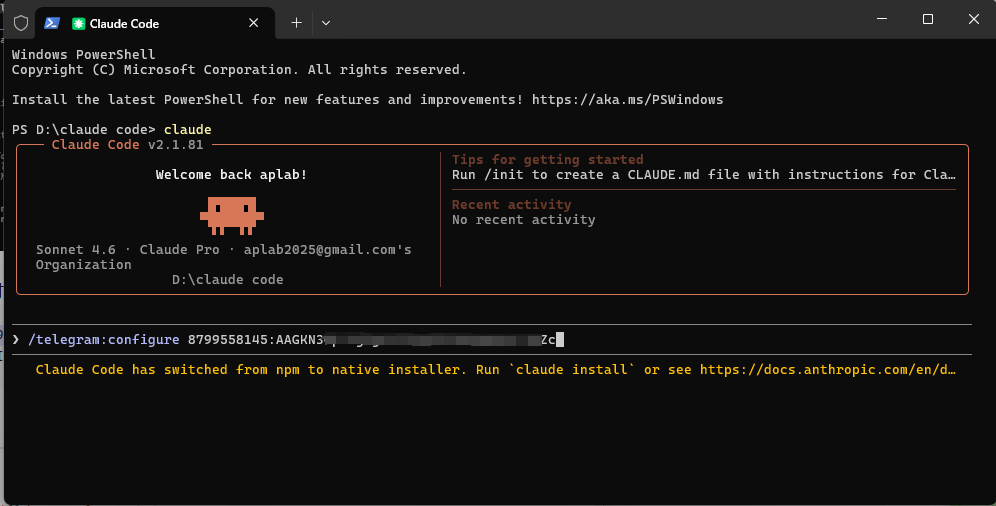

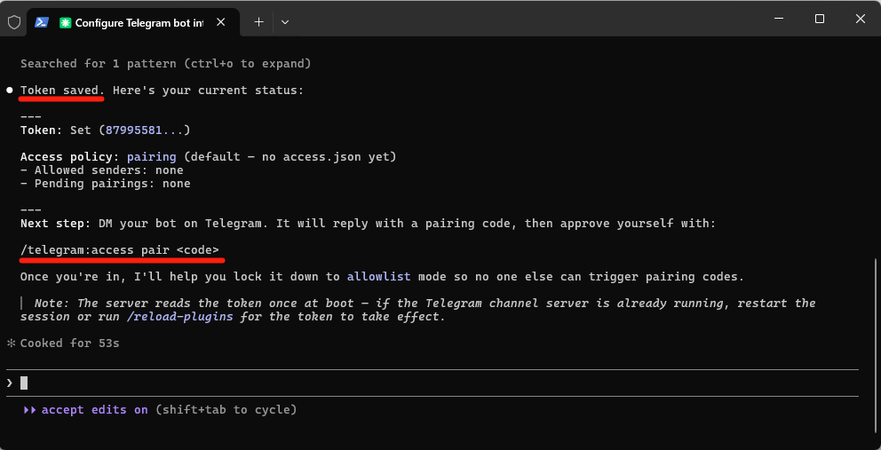

看到上图代表Token凭证保存成功，输入 /exit 或按 Ctrl+C 退出当前的 Claude 会话

## 第四步：重启并进行配对 

插件配置好后，必须带上专属参数重新启动 Claude 才能生效

1. 在终端中输入以下命令重新启动 Claude：

\`\`\`bash
claude --channels plugin:telegram@claude-plugins-official
\`\`\`

2、保持终端运行。打开 Telegram，向你刚才创建的机器人发送任意一条消息 "Hello"

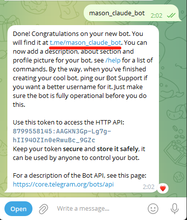

3、机器人会回复你一个 6位数的配对码 (Pairing code)

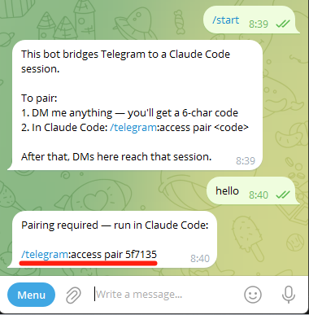

4、回到你的终端 Claude Code 界面，输入配对命令（替换为你收到的验证码）：

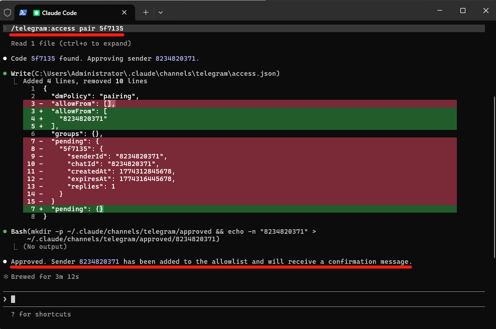

你通过手机Telegram发给机器人一条信息："你好，请告诉我你现在的运行环境"
“帮我看看当前目录下有哪些文件？” 
“创建一个名为 test\_tg.txt 的文件，里面写上 "Hello from Telegram” 
“帮我写一个简单的计算机状态的 Python 脚本保存在当前目录，并运行它告诉我输出结果。”

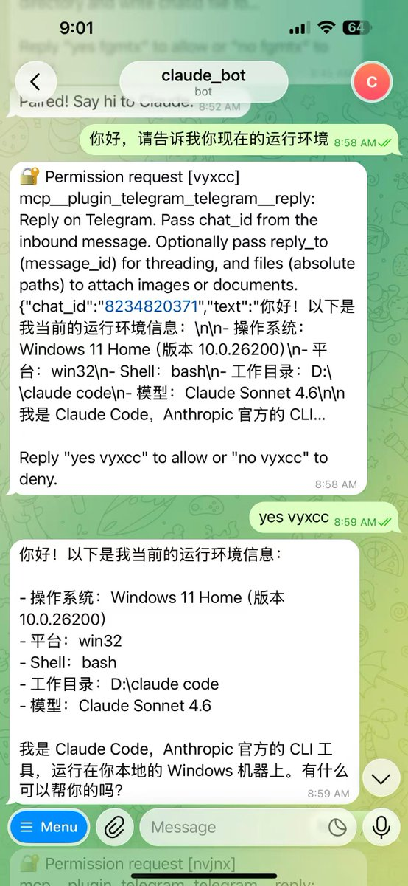

恭喜你 配对成功！
你打算用 Telegram + Claude Code 做的第一件事是什么？

大家过程中遇到什么问题可以在评论区留言，老张都会回复。

以上就是老张今天分享的内容，如果你喜欢，欢迎点赞 + 关注 + 转发！

### 🖼️ Attached Media

## 💬 Replies

### 1 @Lonely__MH (Lonely)

*Tue Mar 24 04:44:07 +0000 2026*

@laozhang2579 我遇到了Bug😮‍💨[x.com/lonely\_\_mh/sta…](https://x.com/lonely__mh/status/2035736436419469497?s=46&t=rV0Jfn54zxsvYDMyr_vq-w)yv

### 2 @laozhang2579 (老张来了) (Author)

*Tue Mar 24 05:59:14 +0000 2026*

@Lonely\_\_MH 你环境bun安装了吗 运行之前 需要安装plugin ，如果你以上都做了 那大概率是版本 要升下级 “npm update -g @anthropic-ai/claude-code”

### 3 @hook_yimin (徐益民)

*Tue Mar 24 07:52:45 +0000 2026*

@laozhang2579 --channels ignored (plugin:telegram@claude-plugins-official)
Channels are not currently available 是不是需要登录才能用这个插件，我是 windows 下的，claude cli 版本，没有登录，用的 ccswitch 切的 minimax

### 4 @laozhang2579 (老张来了) (Author)

*Tue Mar 24 08:03:16 +0000 2026*

@hook\_yimin 是的 目前这个插件是开源免费的，但是要通过channels只支持Claude 订阅用户

### 5 @ZombieShaw1221B (Zombie Shawn)

*Tue Mar 24 10:14:24 +0000 2026*

@laozhang2579 想问问博主，这个和openclaw+tele连接比，优势体现在哪里

### 6 @laozhang2579 (老张来了) (Author)

*Tue Mar 24 10:56:10 +0000 2026*

@ZombieShaw1221B 老张的回答是更成熟稳定，Token消耗更少；更多差异请看这张图 

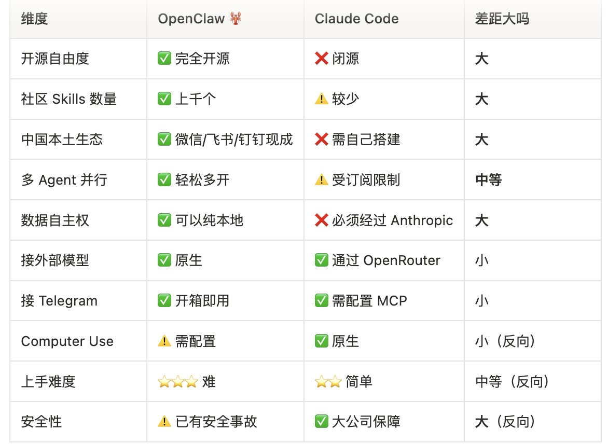

