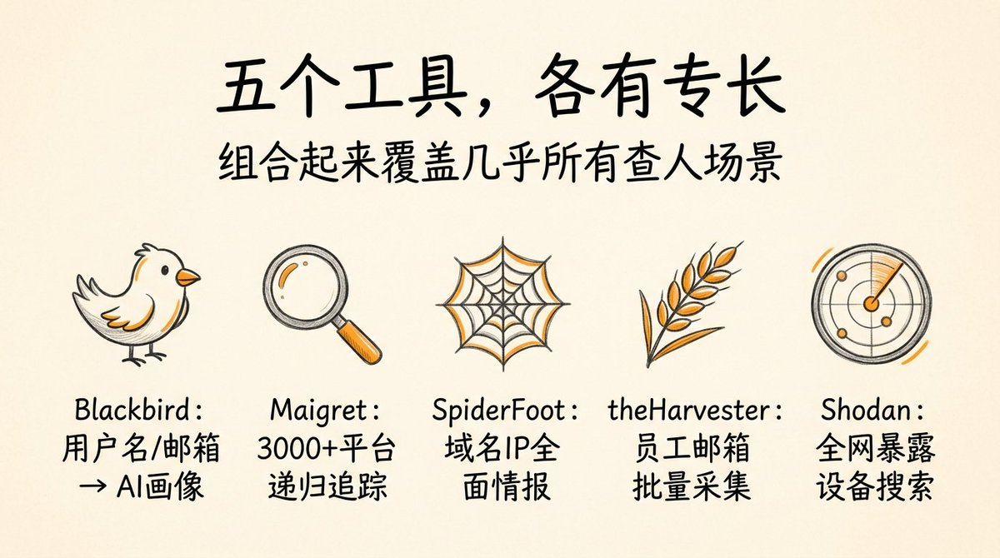
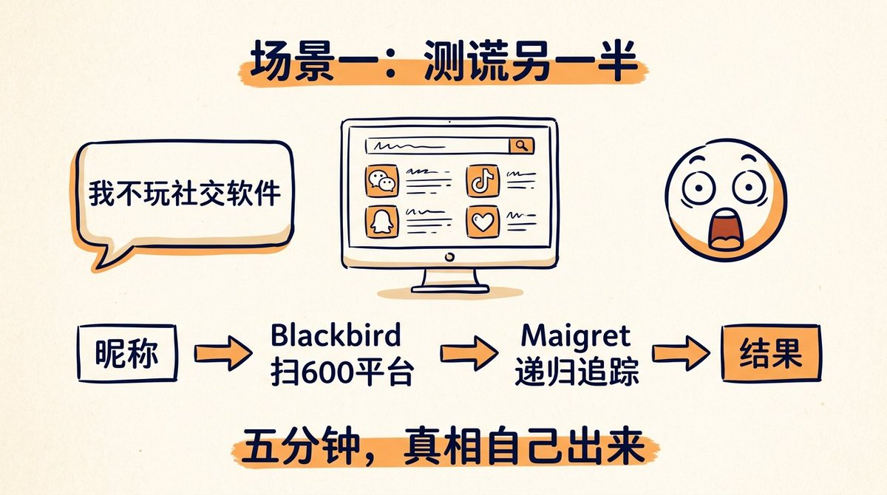
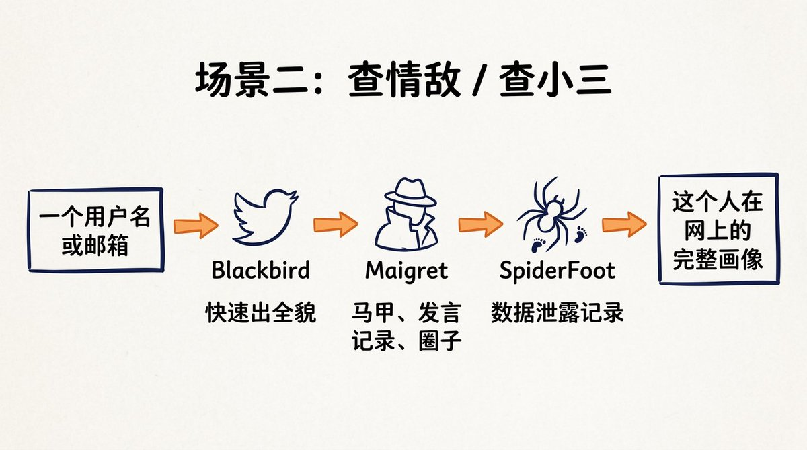
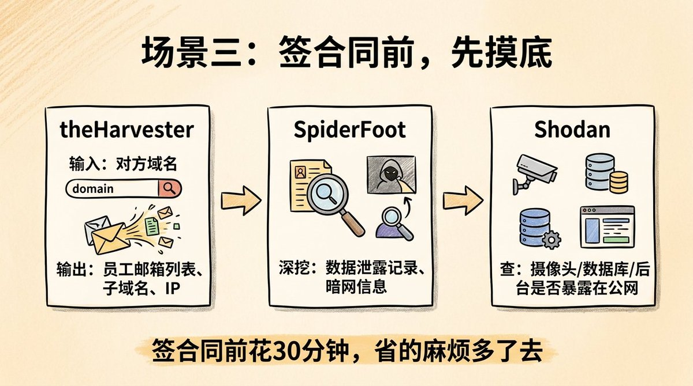
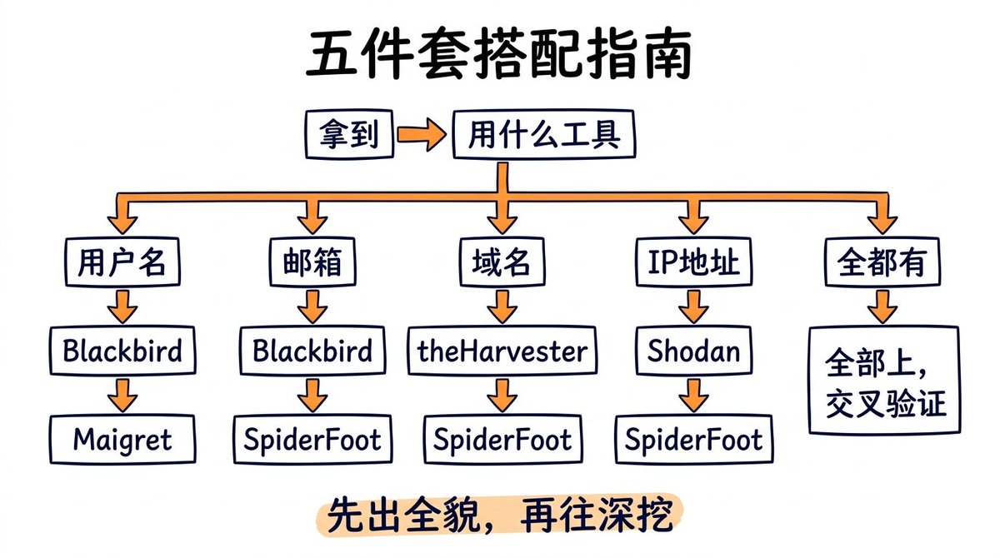
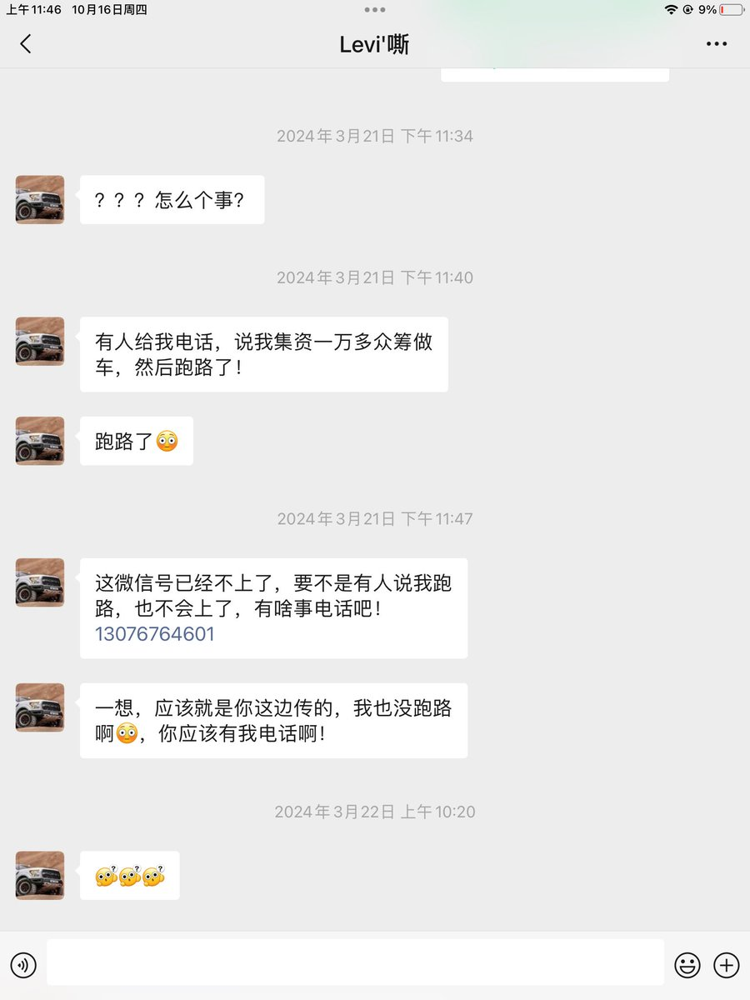

# 📰 网警同款开盒思路，查人查公司查设备，五个免费开源工具

最近连续分享了好几个 OSINT 工具，今天就给兄弟们讲讲怎么组合用。

今天一次说清楚——五个工具，覆盖你能想到的几乎所有查人、查公司、查设备场景，直接开盒任何人，

本文只讲思路和介绍工具及YY使用场景；不提倡实际应用。

这套东西不提倡查别人，希望大家用来保护自己。

## 先说五个工具各干什么

Blackbird（6300 Star）——用户名和邮箱都能查，接入 600+ 平台，查完免费调 AI 生成人物画像，PDF 一键导出。新手入门首选。

Maigret（33000 Star）——用户名查人的专精版，覆盖 3000+ 平台，核心是递归追踪——发现你在 A 平台还有另一个马甲，自动拿这个马甲继续搜，顺着线挖到底。

SpiderFoot（18000 Star）——重炮。手机号、邮箱、域名、IP 全吃，200+ 模块同时出动，能查数据泄露、暗网、子域名，出可视化关系图谱。

theHarvester（16500 Star）——给你一个域名，自动从谷歌、必应、LinkedIn、DNS 记录等 40+ 个数据源里，把这家公司的员工邮箱、子域名、IP、URL 批量扒出来。查公司专用。

Shodan Python（2800 Star）——Shodan 是"设备版谷歌"，全网扫描暴露在公网上的摄像头、路由器、服务器、工业控制系统。这个库让你用代码自动化查询 Shodan 数据库。

## 真实场景，五个工具怎么用

## 场景一：测谎另一半。

另一半说"我不玩社交软件"，你只知道他/她的常用昵称。

第一步 Blackbird：昵称扔进去，600 个平台扫一遍，陌陌、Soul、探探、Tinder 有没有账号，AI 直接出画像。

第二步 Maigret 接力：Blackbird 找到的账号里，可能暴露了另一个用户名。拿新用户名丢进 Maigret，3000 个平台再扫一圈，递归追踪到底。

五分钟基本有答案了，爱TA，还是啪啪打脸TA，就看命了。

## 场景二：查情敌/查小三 / 查陌生人

只有一个用户名或邮箱。

先用 Blackbird 快速出全貌，再用 Maigret 深挖递归，把这个人在网上所有马甲、发言记录、混过的圈子全翻出来。

再拿邮箱丢进 SpiderFoot，查有没有在历史数据泄露里出现，看看他/她有没有被拖过库。

## 场景三：查一家公司，商业尽调

准备跟一家公司合作，想先摸底。

第一步 theHarvester：输入对方域名，自动从 LinkedIn、谷歌、DNS 里扒出公司员工邮箱列表，能看到邮箱格式规律（比如 firstname.lastname@company.com），顺带出子域名和 IP 列表。

第二步 SpiderFoot：拿域名深挖，扫全部子域名和服务器信息，查有没有出现在数据泄露事件里，往暗网搜一圈看有没有公司数据被挂牌出售。

第三步 Shodan：拿 IP 段扔进 Shodan，看这家公司有没有把数据库、后台管理界面、监控摄像头直接暴露在公网——这个细节能看出对方的技术水平和安全意识。

合作之前前花半小时，省的事多了去。

## 场景四：查自己公司的安全及舆情管理

很多公司不知道自己在网上暴露了什么。

theHarvester 查域名，看对外暴露的邮箱有多少、子域名有多少；Shodan 查 IP 段，看有没有服务器端口、摄像头、内部系统直接对公网开着口子。

很多小公司的 NAS、摄像头、打印机，配置没改，直接就能在 Shodan 上搜到，连密码都是出厂默认值——自己查一遍，能查出来很多意想不到的漏洞。

## 场景五：查竞争对手的技术架构

想知道竞争对手用了什么技术栈、服务器在哪、用了哪些云服务。

theHarvester 扒出子域名列表，能看出对方的产品线分布；Shodan 查 IP，能看出用了什么服务器软件、哪个版本、部署在哪个云上。

技术选型、团队规模、基础设施——这些以前要靠内线打听，现在公开信息就能拼出七七八八。

## 场景六：查自己的数字痕迹，清理信息

把自己的常用用户名、邮箱分别跑一遍 Blackbird 和 Maigret，看有多少你忘掉的老账号还挂在各平台上。

再把邮箱丢进 SpiderFoot，看有没有在数据泄露事件里出现过，被哪次拖库波及。

知道暴露了什么，才能有针对性地清理、注销、换密码。

## 五个工具，怎么搭配

> 拿到用户名   →  Blackbird（快速全貌）→ Maigret（递归深挖）
拿到邮箱     →  Blackbird（账号+AI画像）→ SpiderFoot（泄露+暗网）
拿到域名     →  theHarvester（邮箱/子域名批量采集）→ SpiderFoot（深挖）
拿到 IP      →  Shodan（设备和服务暴露情况）→ SpiderFoot（关联情报）
什么都有     →  全部上，交叉验证

原则只有一条：先用最快的出全貌，再用最深的往下挖。

## 安装，一人一行命令

> \# Blackbird
git clone https://github.com/p1ngul1n0/blackbird && pip install -r requirements.txt
\# Maigret
pip install maigret
\# SpiderFoot
git clone https://github.com/smicallef/spiderfoot && pip install -r requirements.txt
\# theHarvester
git clone https://github.com/laramies/theHarvester && uv sync
\# Shodan Python
pip install shodan

Blackbird、Maigret、SpiderFoot 不需要 API Key，开箱即用。

theHarvester 部分数据源需要 Key（谷歌、Bing 等），但基础功能免费够用。

Shodan 需要注册一个免费账号拿 API Key，免费额度日常够用。

## 最后说一句

这五个工具放在一起，代表的是一种思路：

一个人、一家公司，在网上能藏住的东西，远比他们以为的少得多。

你以为删掉的账号，以为没人知道的马甲，以为没有暴露的服务器——只要存在过，大概率能找回来。

再次声明。这套东西不提倡查别人，希望大家用来保护自己。

知道自己暴露了什么，是第一步。

五个项目链接：

- github.com/p1ngul1n0/blackbird

- github.com/soxoj/maigret

- github.com/smicallef/spiderfoot

- github.com/laramies/theHarvester

- github.com/achillean/shodan-python

好东西转给需要的兄弟。🚀

#OSINT #开源工具 #老杨啊分享

### 🖼️ Attached Media

## 💬 Replies

### 1 @berryxia (Berryxia.AI)

*Sun Jun 21 07:22:34 +0000 2026*

@yhslgg 私家侦探上线吗

### 2 @yhslgg (老杨啊 | AI产品商业化) (Author)

*Sun Jun 21 08:05:58 +0000 2026*

@berryxia 不是不是，思路碰撞而已，不敢想别的。😎

### 3 @gengdaJ (逸尘)

*Tue Jun 23 07:04:42 +0000 2026*

@yhslgg 握草牛逼

### 4 @yhslgg (老杨啊 | AI产品商业化) (Author)

*Tue Jun 23 08:18:29 +0000 2026*

@gengdaJ 大佬的内容更牛皮卧槽，我每次都是慢慢消化。

### 5 @lala_oldtang (Mr Richard@AI+Crypto)

*Sat Jun 20 13:08:06 +0000 2026*

@yhslgg 发这个确定好吗？

### 6 @yhslgg (老杨啊 | AI产品商业化) (Author)

*Sat Jun 20 13:19:03 +0000 2026*

@lala\_oldtang 你说说不好在哪里？

### 7 @dnTDyl6BFU8FdbH (你的豚)

*Sun Jun 21 02:07:16 +0000 2026*

@yhslgg 是不是真的？ 

### 8 @yhslgg (老杨啊 | AI产品商业化) (Author)

*Sun Jun 21 02:25:29 +0000 2026*

@dnTDyl6BFU8FdbH 没看懂哟

### 9 @ericoding99 (🅴🆁🅸🅲 晓҈峰҈)

*Sun Jun 21 04:23:15 +0000 2026*

@yhslgg 杨总牛逼🐮先拿来查查自己😅没什么想查的人

### 10 @yhslgg (老杨啊 | AI产品商业化) (Author)

*Sun Jun 21 04:44:45 +0000 2026*

@ericoding99 主要就是查自己的信息有没有披露出来，好预仿。

### 11 @CeoSpaceY (AImaster)

*Mon Jun 22 12:38:31 +0000 2026*

@yhslgg 有用吗

### 12 @yhslgg (老杨啊 | AI产品商业化) (Author)

*Mon Jun 22 12:39:51 +0000 2026*

@CeoSpaceY 谁用谁知道。

### 13 @shelly_6688 (Shelly)

*Tue Jun 23 04:52:39 +0000 2026*

@yhslgg 很适合做背调

### 14 @yhslgg (老杨啊 | AI产品商业化) (Author)

*Tue Jun 23 06:36:51 +0000 2026*

@shelly\_6688 是的，很多场景都可以适用。

### 15 @zhuzhngwi230786 (jacob725)

*Tue Jun 23 09:21:07 +0000 2026*

@yhslgg 作为小白，在spider里运行了后试了下没成功

### 16 @yhslgg (老杨啊 | AI产品商业化) (Author)

*Tue Jun 23 09:23:07 +0000 2026*

@zhuzhngwi230786 可以看一下我最新的贴子，不用部署也能查人。

### 17 @vancehu (Vance)

*Tue Jun 23 07:43:35 +0000 2026*

@yhslgg 请教一下，实测下来这套组合的反爬情况怎么样呢？Maigret查3000+平台、SpiderFoot 200+模块同时出动，请求频率怎么控制才能规避不被封的风险？特别是Shodan免费tier有速率限制，大规模查询会不会直接锁账号

### 18 @yhslgg (老杨啊 | AI产品商业化) (Author)

*Tue Jun 23 08:16:04 +0000 2026*

@vancehu 没详测哈，反爬探测的话，前期还是要去多试探才行，我一般是设一个上限然后按系数向下去试探，能力有限，我只能用这种方式，
Shodan免费的不行就用收费的，闲鱼找便宜渠道
模块多的话，自己可以改造一下，做排队分流机制，不要全体出动就好。

### 19 @RunnerElect (Runner-Elect)

*Sat Jun 20 23:10:10 +0000 2026*

@yhslgg 社交软件自动生成用户名，绝大多数人都不改，用系统给的。你无从查起。

### 20 @yhslgg (老杨啊 | AI产品商业化) (Author)

*Sat Jun 20 23:32:28 +0000 2026*

@RunnerElect 你说的那是昵你

### 21 @dh30770855 (anyixuan)

*Tue Jun 23 01:41:02 +0000 2026*

@yhslgg 只针对外国人吧

### 22 @yhslgg (老杨啊 | AI产品商业化) (Author)

*Tue Jun 23 01:52:01 +0000 2026*

@dh30770855 全网呦

### 23 @snsn30119321 (三三)

*Mon Jun 22 05:17:56 +0000 2026*

@yhslgg 是用电脑使用 ？可以在store下载吗

### 24 @yhslgg (老杨啊 | AI产品商业化) (Author)

*Mon Jun 22 05:54:48 +0000 2026*

@snsn30119321 文章最后有说明。

### 25 @NWanStar (雾里行舟)

*Tue Jun 23 00:25:15 +0000 2026*

@yhslgg 有没有人教一下怎么用呀，GitHub总是找不到安装包☺️

### 26 @yhslgg (老杨啊 | AI产品商业化) (Author)

*Tue Jun 23 01:53:21 +0000 2026*

@NWanStar 让ai帮你

### 27 @Tianantjcy (Tianan)

*Sun Jun 21 21:11:51 +0000 2026*

@yhslgg 怎么获取这些软件呢

### 28 @yhslgg (老杨啊 | AI产品商业化) (Author)

*Sun Jun 21 23:27:38 +0000 2026*

@Tianantjcy 文章最下面有地址哈，可直接本地安装使用。

### 29 @tugawayu (sakana)

*Wed Jun 24 02:18:32 +0000 2026*

@yhslgg 点进去我怎么看不懂啊。这怎么下载꒦ິ^꒦ິ

### 30 @yhslgg (老杨啊 | AI产品商业化) (Author)

*Wed Jun 24 02:22:18 +0000 2026*

@tugawayu 看不懂可以看这个[x.com/yhslgg/status/…](https://x.com/yhslgg/status/2068863614593962247)

### 31 @xMYVMFBVXNCZF9Z (j)

*Tue Jul 21 13:36:27 +0000 2026*

@yhslgg 收费吗

### 32 @yhslgg (老杨啊 | AI产品商业化) (Author)

*Tue Jul 21 13:59:50 +0000 2026*

@xMYVMFBVXNCZF9Z 全部是免费开源的，自己部署一下就可以。

### 33 @zheng_dao12480 (bzhmy)

*Thu Aug 27 21:45:39 +0000 2026*

@yhslgg 大佬 请问SF到底是干啥的呀 光说了泄露也不知道是哪里泄露的 我查了自己的

### 34 @Autonomous667 (🌊Autonomous🏳️‍⚧️🇹🇼🇳🇫🍥)

*Sun Jun 21 03:12:44 +0000 2026*

@yhslgg 😂

