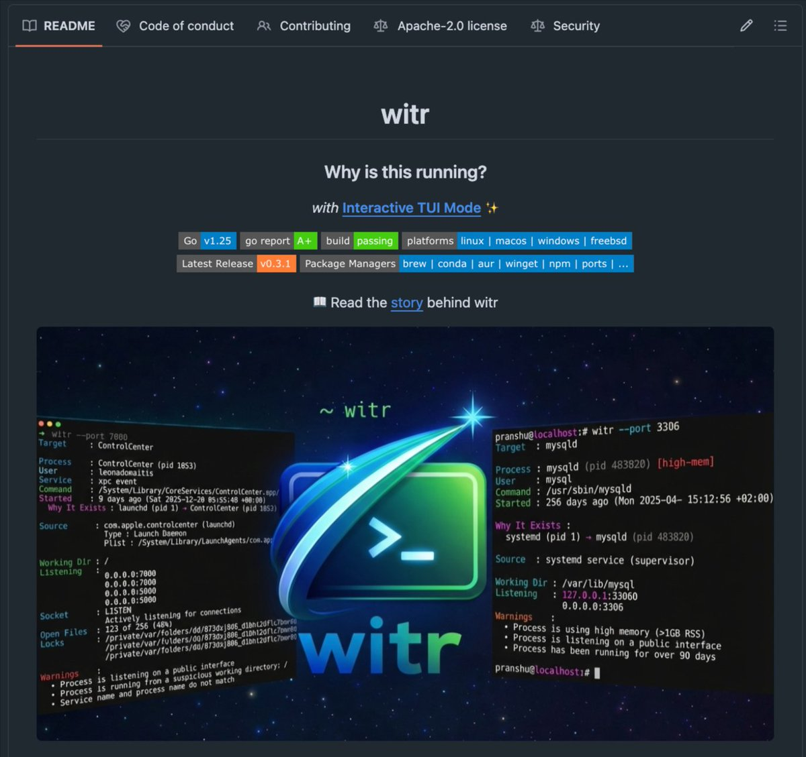

牛 x 啊，一个印度独立开发者，

做出了一个被程序员忽视了 20 年的终端工具。

名字叫 witr。

它能回答一个你的操作系统始终拒绝回答的问题：

为什么这个进程正在运行？ 

## 💬 Replies

### 1 @laobaishare (老白（每日 AI 干货✊）) (Author)

*Fri May 15 07:00:02 +0000 2026*

你看到一个奇怪的进程在偷你的 RAM。

你看到一个本不该开放的端口。

你看到一个你完全不记得装过的服务。

每一个工具都告诉你"它存在"。但没有一个工具告诉你"它为什么存在"。

### 2 @laobaishare (老白（每日 AI 干货✊）) (Author)

*Fri May 15 07:00:03 +0000 2026*

ps 给你看进程。lsof 给你看端口。systemctl 给你看服务。

但没有一个工具，能给你看完整的因果链。

从生成 supervisor 的那个 shell、再到拉起守护进程的 supervisor、再到打开 socket 的那一环——这整条链子，没有人帮你串起来。

witr 可以。

### 3 @laobaishare (老白（每日 AI 干货✊）) (Author)

*Fri May 15 07:00:03 +0000 2026*

你敲一条命令，它就帮你把整条因果关系追下去。

从内核 → PID → 父进程 → 拉起它的那个 launchd 任务或 systemd 单元；从一个开放端口 → 反向追到绑定它的二进制；从一个服务 → 追到触发它的那个用户 shell。

操作系统藏起来的东西，witr 用人话告诉你。

### 4 @laobaishare (老白（每日 AI 干货✊）) (Author)

*Fri May 15 07:00:03 +0000 2026*

和之前每一个"进程查看器"的本质区别：

· 追完整因果链，不只是 PID 和端口
· 交互式 TUI 仪表盘，不是一堵纯文本墙
· 单个 Go 静态二进制，5 秒装完
· 原生支持 Linux、macOS、Windows、FreeBSD
· 已经被打包到 brew、conda、AUR、winget、npm、scoop、chocolatey、FreeBSD ports 等几乎所有发行渠道
· 能识别 supervisor 链、容器父级、systemd 单元的血缘关系
· 标记出"在公网监听"或"从可疑工作目录跑起来"的进程
· 找出吃内存大户，以及那些跑了好几个月你都没发现的沉默进程

### 5 @laobaishare (老白（每日 AI 干货✊）) (Author)

*Fri May 15 07:00:04 +0000 2026*

从此消失的东西：

每一个"这是什么进程"的 Stack Overflow 兔子洞、每一条"我 Mac 为什么在跑这玩意"的 Reddit 提问、每一段你从 2014 年的论坛复制下来的 PowerShell 一行命令——全部不需要了。

### 6 @laobaishare (老白（每日 AI 干货✊）) (Author)

*Fri May 15 07:00:04 +0000 2026*

5 个月，15104 颗星，401 个 fork，34 位贡献者，18 个版本。Apache 2.0 协议。

Pranshu Parmar 一个人，用一台笔记本就把它做出来了。

没有 VC，没有团队，没有加速器。

你的操作系统，终于愿意跟你说实话了。

仓库：[github.com/pranshuparmar/…](http://github.com/pranshuparmar/witr)

### 7 @blanplan (BlanPlan)

*Fri May 15 12:29:27 +0000 2026*

@laobaishare ps + lsof + strace 这套老组合能拼出大半个答案, 调用栈和触发链得自己脑补。witr 直接把 cgroup parent + 启动 args + open fd 三块合在一个视图, 看起来是把脑补步骤省掉。我自己 debug 内存泄露常卡在这一步, 准备先装一份试两天。

### 8 @no36bigyee (落落落下的第一位)

*Fri May 15 14:58:11 +0000 2026*

@laobaishare 这没什么用，程序员肯定用不到，不是程序员拿到也没用，但是如果给小白发一个这个，起码能把情绪价值拉满🤣

### 9 @AI_EC_Hacker (EC専門エンジニア)

*Sat May 16 10:08:02 +0000 2026*

あ、そこ掘ると面白いですよね。実は「なぜ動いているか」の答えはプロセス単体のログだけでなく、開発フローと運用ルートの接続点に眠っていることが多い。

つまりwitrは単なるツールではなく、OSの外側にある「設計→実装→デプロイ」の因果線を可視化するセンサー役。現場だとこれで1時間の調査が10分に落ちることが多いです。比喩で言えば、ログの暗号を解く鍵を渡される感覚。

### 10 @Prmtr4IndstryAI (Prmtr4IndustryAI)

*Fri May 15 11:10:25 +0000 2026*

@laobaishare 有没有写好的 skill？

### 11 @breeeszerg (PenguinPenGuin)

*Fri May 15 14:48:40 +0000 2026*

@laobaishare 我記得window自己有出一個

### 12 @kleon_ai (Kleon)

*Sat May 16 16:21:46 +0000 2026*

@laobaishare 跑agent自动化的时候这个工具特别有用。经常有僵尸进程占住端口或者吃CPU，ps只告诉你PID不告诉你为什么在跑。之前只能lsof+strace手动查，现在一行命令就行。做CLI工具的人都知道：解决一个够痛的小问题比做一个大而全的平台值钱多了

### 13 @trueloveglory (todamoon)

*Sat May 16 09:03:50 +0000 2026*

@laobaishare 非常好，這個做成技能給AI用方便多了

