# 📰 一个Skill搞定服务重构：从链路分析到测试自动化

关注腾讯云开发者，一手技术干货提前解锁👇


开发者公众号专属群聊

扫码加入获取更多一手教程、科技前沿报告

历史服务重构，主要难点不在于翻译代码，而在于先把多年迭代后散落在调用链里的业务逻辑（如状态机分支、隐式校验、数据依赖等）梳理清楚，再据此做更合理的分层改造与业务适配。我们针对服务重构场景，沉淀成一个 Skill，用流程拆分、分层知识库和 Harness Engineering 三部分把重构流程标准化，并在十几个真实重构场景中验证其价值。

# 01

背景：服务重构为什么难

### 1.1 重构 ≠ 一比一的代码搬运 ###

重构不仅仅是换个语言或框架把老服务逻辑重写一遍，代码迁移只是表象，真正的成本在于把业务逻辑重新梳理清楚、再表达出来。

一个经历多年迭代的老服务，业务规则往往不是集中写在某处，而是散落在跨多个模块的调用链细节里：

* **状态机分支**：一段逻辑中可能有 10+ 种状态转换分支，藏在层层嵌套的 `switch/case` 里，每个分支还有各自的前置条件；

* **隐式校验**：必传字段校验、时间格式校验、限流阈值、签名/票据验证，常常和主流程代码交织在一起；

* **数据依赖**：分表查询、缓存反查、下游 RPC、消息队列，一次请求背后可能牵动十几张表和多个外部系统；

* **历史包袱**：为兼容某个历史场景打的补丁、绕过某个 bug 的临时处理，代码里往往没有注释说明。

**重构要做的，就是把这些藏在代码里的规则梳理出来，再用新架构重新组织：**

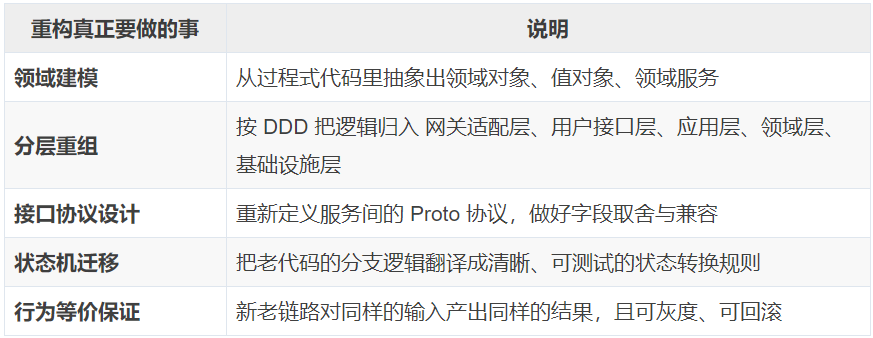

### 1.2 老服务典型的四层调用链 ###

**我们的接口服务是 C++ 多进程架构：一次请求会跨 4-5 个独立的 C++ 项目，各项目独立进程，项目的服务框架各异，重构中还要在 C++、Go、Proto 多种语言之间来回对照。以我们的一个交易类服务的支付结果回调接口为例，它的老链路结构如下：**

```

外部回调通知
  → HTTP 入口层（解密 / 校验 / 反查 / 确定状态）
  → 业务编排层（流程编排、下游调用聚合）
  → 核心业务层（DB 事务、状态流转、写入）
  → 查询层（只读查询）

```

**历史链路中，四层的划分是清楚的，复杂度主要在每层内部：**

* **入口层**：不只是收包转发，还要做解密、验签、多层报文解析、限流、单号反查，这些前置逻辑里任何一个字段的来源都可能影响后面的分支判断；

* **编排层**：按顺序调用多个下游，再把各下游的返回聚合成一个业务决策，中间还夹着票据生成与校验这类跨调用的隐式契约；

* **核心业务层**：最复杂，写入前要先加行锁读当前状态，再根据状态、金额、笔数等条件进入十几个 `switch` 分支之一，每个分支的字段更新规则都不一样；

* **查询层**：本身逻辑不多，但它决定了上游拿到的数据口径，字段对不齐，整条链路的判断就会错。

人工梳理这样一条链路，要跨 4-5 个项目逐个方法读，容易漏掉一个 `switch` 分支或一个隐式字段，这些遗漏常常要等新服务上线报错或状态错乱才暴露。加上这类系统一般没有最新的设计文档，能信的只有代码本身，所以光是把链路理清、产出一份能评审的方案，人工通常就要 2-3 天。

### 1.3 目标：重构成 tRPC-Go 微服务 + DDD 分层 ###

**新架构由网关直切目标 tRPC-Go 服务，不再经过原服务入口层。目标服务通过 Gateway 层完成网关协议与 PB 协议转换，再进入标准 DDD 分层：**

```

外部回调通知
  → 网关
  → tRPC-Go Gateway 层（网关协议 ↔ PB 协议转换）
  → tRPC-Go AO 服务（DDD 编排：参数校验、反查、状态确定全部上移）
  → tRPC-Go BO 服务（领域服务：DB 事务、状态流转）

```

**这次重构涉及多个 C++ 老项目的分析、多个新 tRPC-Go 项目的开发、Proto 协议定义与补充、10+ 种状态机分支的迁移，全程由 Skill 跑通。**

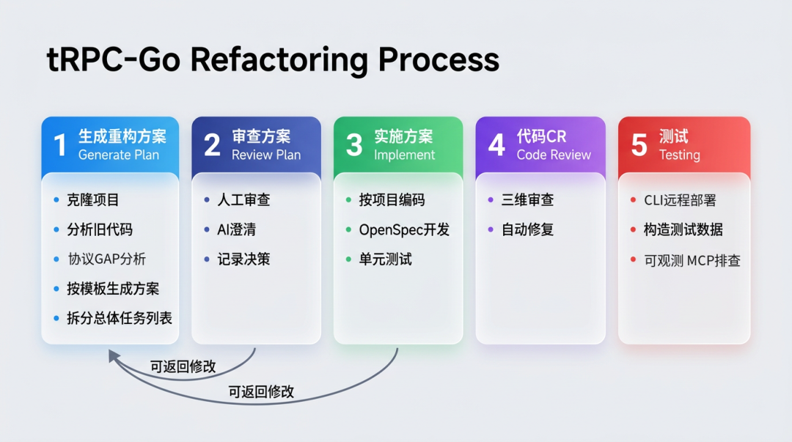

# 02

这个 Skill 长什么样

**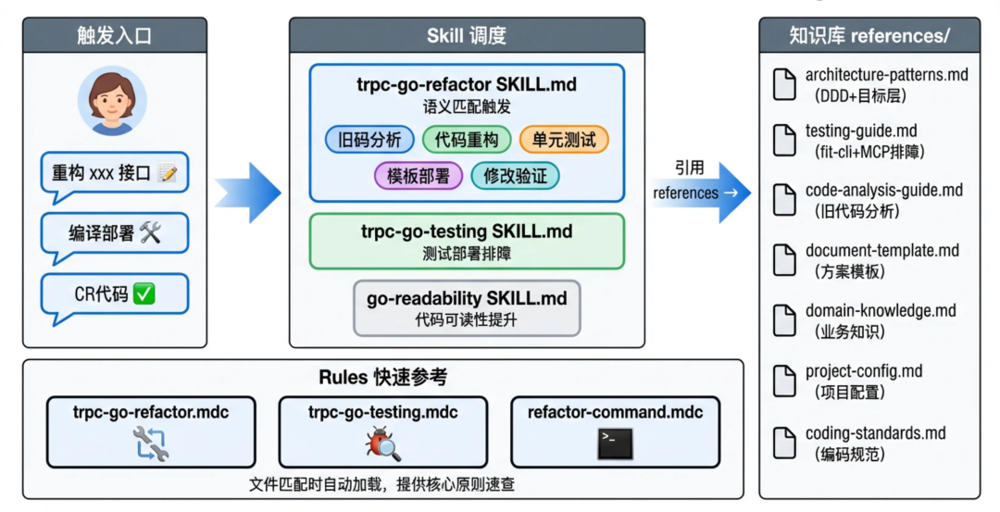**

### 2.1 核心思想：渐进式披露（Progressive Disclosure） ###

AI 的上下文窗口有限，不能一次性把所有重构知识都塞进去。这个 Skill 采用三层渐进式加载，让 AI 在每个时刻只加载当前需要的那部分知识：

```

第 1 层（自动加载）：核心原则速查（Rule，< 100 行）
    → 编辑 service/logic/repo/entity 目录时自动注入 DDD 分层、命名规范等

第 2 层（按阶段加载）：Skill 主文件（< 200 行）
    → 描述 5 阶段流程，AI 根据当前阶段跳转到对应章节

第 3 层（按需加载）：Reference 知识库（专题文件，不限行数）
    → 阶段1 加载链路分析指引和 Proto 规范；阶段3 加载设计模式和编码规范；
      阶段5 加载部署与排障指引

```

### 2.2 文件结构 ###

```

/skills/trpc-go-refactor/
├── SKILL.md                          ← 主控文件（5 阶段流程 + Harness 机制）
├── assets/
│   ├── document-template.md          ← 重构方案 11 章节模板
├── references/
│   ├── architecture-patterns.md      ← DDD 分层 + 四件套设计模式 + 编码规范
│   ├── code-analysis-guide.md        ← 老代码链路分析方法论
│   ├── domain-knowledge.md           ← 业务领域知识（状态机 / 分表 / MQ / 枚举）
│   ├── project-config.md             ← 项目 Git 地址 + 文件查找规则
│   └── testing-guide.md              ← 测试与部署指引（编译部署 + 排障）
├── rules/
│   ├── refactor-command.mdc          ← 重构命令与项目定位规则
│   └── trpc-go-refactor.mdc          ← 自动加载的编码规则
└── bundled-skills/
    └── observe/                      ← 生产监控、日志查询、告警分析

```

### 2.3 知识库与阶段的映射 ###

有了三层加载机制和文件骨架，还要明确每份知识在哪个阶段用。

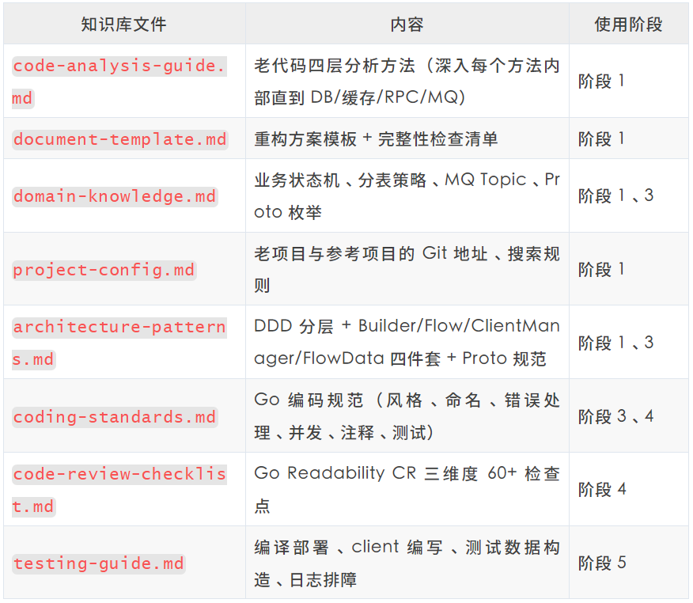

# 03

阶段执行：从链路分析到自动化测试

知识库解决的是 AI 该知道什么，接下来是 AI 该怎么一步步做。整个重构按 5 个阶段线性推进，每个阶段都是人发起命令、AI 执行、人审查后再推进，阶段之间支持回退。分工上人定方向、AI 执行：架构边界、协议字段取舍、灰度策略由人决定，AI 负责老代码分析、新代码生成和编译部署。

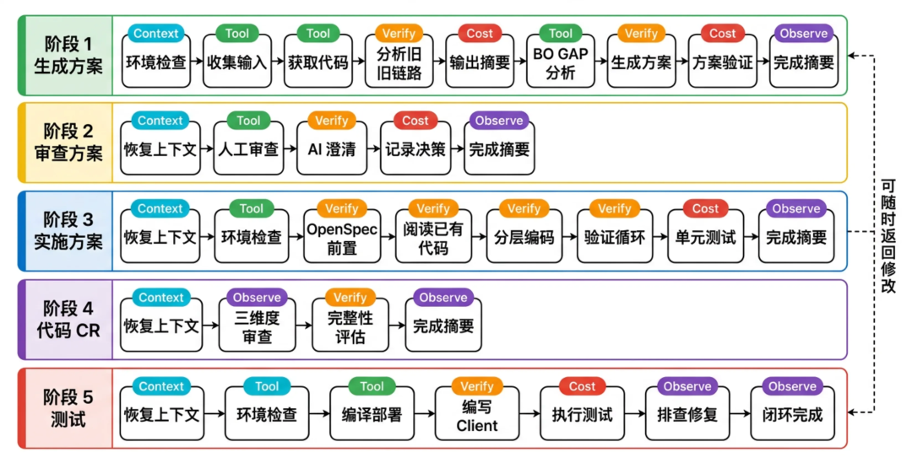

内部详细的执行流程：

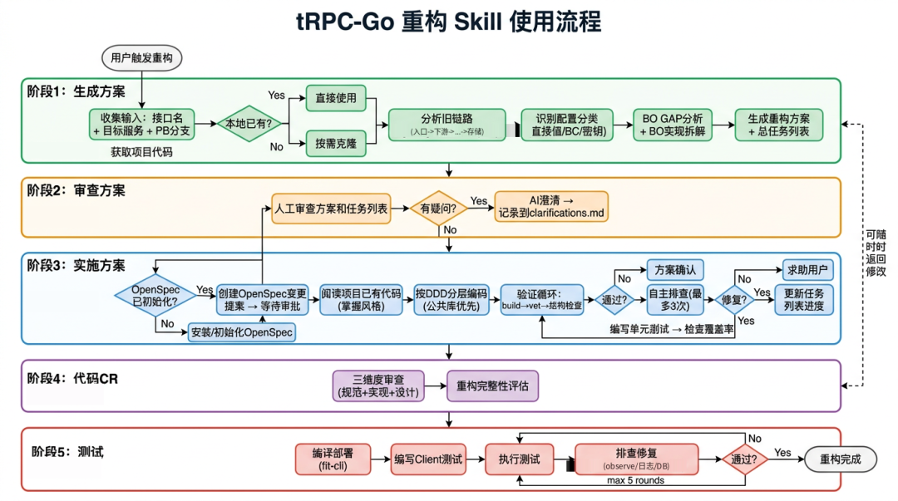

### 3.1 阶段 1：链路分析 & 生成方案 ###

链路分析是决定重构质量的一步，也最能体现 AI 的价值。

**Step 1 · 拉取依赖代码**：AI 读取 `project-config.md`，把所有老项目和已上线的 tRPC-Go 参考项目克隆到统一目录 `../_refactor_deps/`，与当前工作项目隔离。

**Step 2 · 全量链路分析**：AI 按四层顺序追踪完整调用链。这里的关键是不能只看调用关系，要深入每个方法内部，逐层展开到最终的 DB 操作、缓存读写、RPC 调用和 MQ 发送。例如入口层的一个方法：

```

入口层 (回调处理)
## 1. 参数解析 — 深入内部：
     → 外层报文解析 → 解密 → 内层报文解析 → 产出完整字段列表（= 新接口 Proto Req 的来源）
## 2. 限流校验 — 深入内部：必传校验、时间格式校验、限流阈值
## 3. 单号反查 — 深入内部：特定场景按业务单号反查，常规场景直接复用
## 4. 调用下游 — 深入内部看参数组装
      ▼
核心业务层 (状态处理)
## 1. 加锁读取 — SELECT FOR UPDATE，读取 20+ 字段
## 2. 状态处理 — 10+ switch 分支逐一展开，每个分支的转换规则和前置条件
## 3. 写回更新 — UPDATE / INSERT 各字段

```

强调"深入方法内部"，是因为只看调用关系会漏掉两类信息：一是每个字段的真实来源（入参、反查所得、还是常量），二是分支的前置条件（在什么状态、什么金额下才走这条分支）。分析到这个粒度，方案里每个步骤的字段、条件、分支才有出处，后面翻译成 Go 代码才不会漏。这个阶段设了成本上限：同一个文件最多读 2 次、参考项目最多查 3 个，避免在某段代码上反复纠缠。

**Step 3 · Proto GAP 分析**：老链路要用到的能力，未必在现有 tRPC-Go 服务里都有对应接口。AI 会把老链路需要的每个下游能力，和现有服务的 Proto 接口逐一比对，标记状态并列出要补的字段：

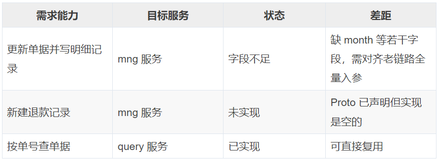

这张表直接决定了 Proto 要改哪些、BO 要补哪些实现，是后续排期的依据。

**Step 4 · 生成方案 + 拆分任务**：AI 按 `document-template.md` 的模板生成完整方案，并拆成跨项目的总任务列表。方案覆盖链路概述、原始调用链、数据依赖分析、DDD 归属映射、Proto 协议定义、详细实现方案、Gateway 层改造、关键迁移点、配置变更、实现优先级、测试验证与风险应对。

其中 DDD 归属映射是最关键的一张表：它把老链路的每个步骤明确归到新架构的某一层、某个服务。比如网关协议解析与转换归 Gateway 层，参数校验、单号反查、状态确定归 AO 编排层，加锁读取、状态流转、落库归 BO 领域层。有了它，编码阶段就不用回头猜某段逻辑该放哪。方案生成后 AI 会跑一遍完整性检查（方案文档的所有章节是否齐全、每个旧步骤是否都有归属、状态机分支是否都列出），确认没有明显缺口再交人审查。

### 3.2 阶段 2：审查方案 ###

方案再完整，也要人来把关，尤其是那些只有熟悉业务的研发才能决策的取舍，这是人机协作最密集的阶段。人工审查主要看：归属映射是否正确（某步骤归 AO 还是 BO）、Proto 字段是否完整、状态机分支是否遗漏、GAP 怎么处理（新增接口还是扩展已有接口）。

这个阶段离不开人，因为有些判断只能靠业务经验：一个 `switch` 分支是废弃逻辑还是仍在生效、某个字段能不能安全去掉、灰度按什么维度切，这些代码里读不出来。AI 负责把这些取舍整理成清楚的选择题摆出来，做最后决策的还是人。

在审查过程中 AI 也会主动问一些决策点，例如：

* "下游 Rsp 需要返回明细记录用于构建 MQ 消息，是否需增加 `xxx_detail` 字段"

* "channel\_type 会影响状态机的多个分支判断，老 Proto 里没有这个字段，是否需要列入补充清单"

为控制单轮成本，AI 每轮最多问 5 个问题。所有澄清和最终决定都记到 `clarifications.md`，后面换人接手或换 session，也能通过这份记录还原当时的决策过程。

### 3.3 阶段 3：实施编码 ###

方案和协议定下来之后，编码基本是照着方案里的 DDD 分层和设计模式落地。前置条件是方案审查通过、Proto 已提交并生成桩代码。AI 按项目维度逐个编码，遵循方案的分层设计。

#### DDD 分层架构 ####

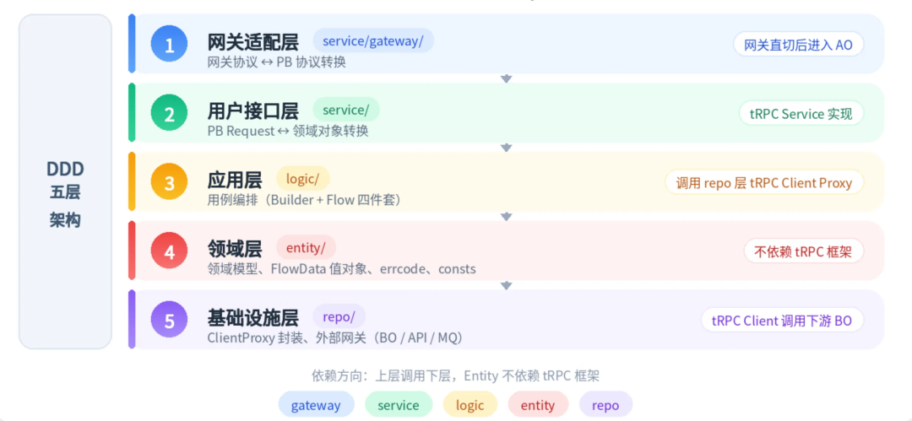

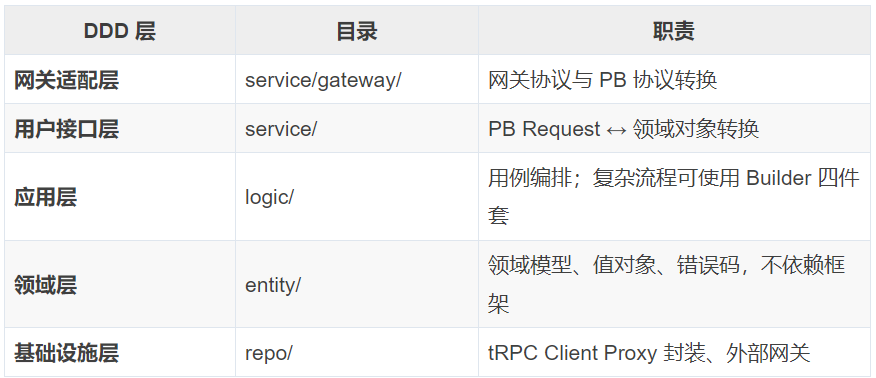

主要调用方向为 `Gateway → Service → Logic → Repo`，其中领域层 `Entity` 不依赖 tRPC 等框架，Logic 通过接口使用 Repo 能力。这条规则让业务逻辑不被协议和基础设施细节污染。CR 阶段会专门检查分层边界，例如 Service 里是否混入业务逻辑、Logic 里是否直接使用 PB 类型。

#### Logic 层四件套设计模式（视具体业务/架构决定） ####

####   
 ####

下面这个仅是我们 tRPC-Go AO 服务的核心设计模式，其他的业务进行实践，需要根据业务和架构规则进行设计。

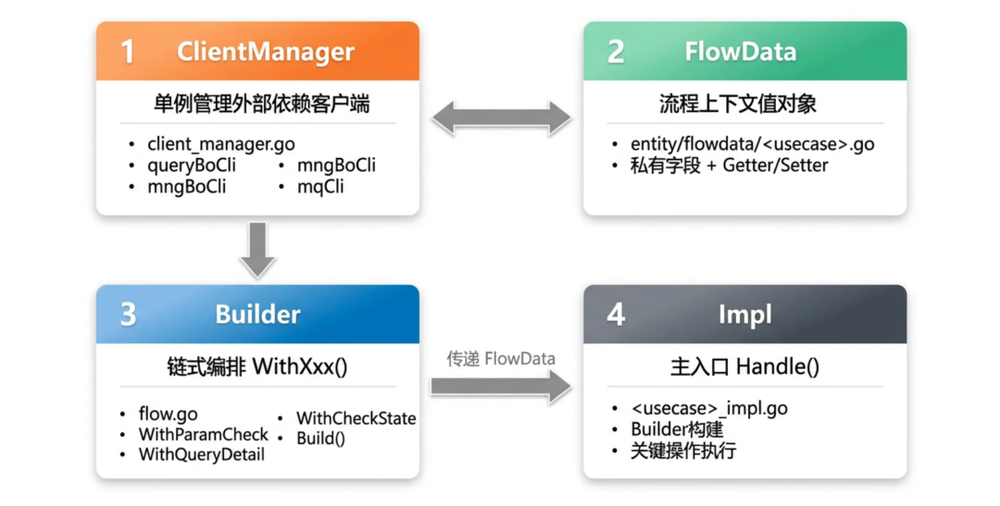

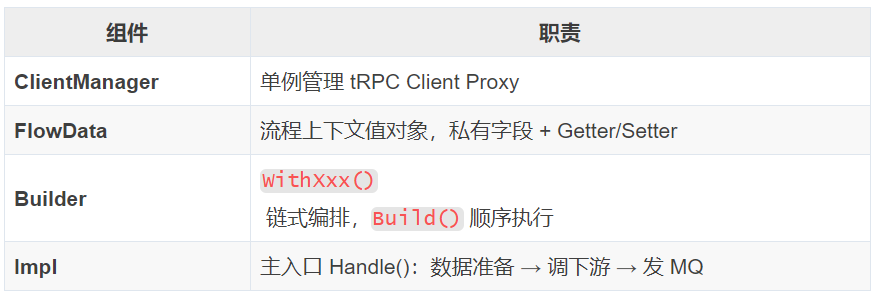

Builder 链式编排让流程一眼能看清，每个 `WithXxx` 是一个独立、可插拔的步骤：

```

flowData, err := builder.
    WithParamValidation().        // ① 参数校验
    WithResolveOrderNo().         // ② 确定业务单号（特定场景反查）
    WithQueryOrderDetail().       // ③ 查详情
    WithCheckOrderState().        // ④ 状态校验（幂等）
    WithVerifyTicket().           // ⑤ 票据验证（非关键，失败不终止）
    WithDetermineTargetStates().  // ⑥ 确定目标状态
    Build()

```

这套模式带来几个实际好处：非关键步骤（如票据验证）失败时不终止主流程，只上报监控，不会因为一个旁路校验卡死整笔业务；新增或删掉步骤只是加减一行 `WithXxx`，互不影响；FlowData 用私有字段加 Getter/Setter，步骤之间只能按约定接口传数据，中间状态不会被随意改写。

验证循环：每完成一个逻辑单元（一个 `WithXxx` 或一个 repo 方法），立即跑 `go build → go vet → 结构验证`，通过后再继续，错误在产生的那一步就能发现，不会扩散到后面。同一个错误连续修 3 次还没过就停下交人，不继续空转。

### 3.4 阶段 4：代码 CR ###

代码写完不等于写对。CR 阶段要回答两件事：写得规不规范，方案有没有落全。AI 按 `code-review-checklist.md` 的 60+ 检查点从三个维度自查：

* **设计层**：DDD 分层是否合理、依赖方向是否单向、repo 是否通过接口隔离实现细节；

* **实现层**：错误处理是否规范包装、日志是否携带 traceID、Context 是否全链路透传；

* **规范层**：缩写大小写、导出方法 GoDoc、import 分组。

除此之外还要做重构完整性评估：方案 11 章节是否全部实现、归属映射里每个旧步骤是否都有对应新代码、状态机分支是否全覆盖、Proto 是否与方案一致。

### 3.5 阶段 5：自动化测试闭环 ###

静态检查过了，还得用真实运行验证行为是否和老服务一致。这是自动化程度最高的阶段，AI 从构造数据到排查问题一条龙做完：

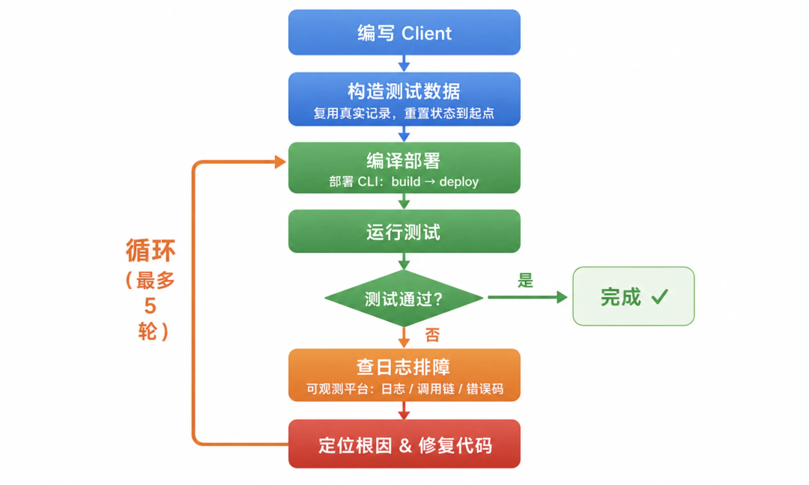

## 1. **编译部署**：用部署 CLI 执行 `build` → `deploy`

## 2. **编写 client**：用正确的协议和端口，靠命令行参数切换不同业务场景

## 3. **构造测试数据**：复用 DB 里已有记录并重置状态，关键字段用真实值

4. **自动修复循环**：运行 client → 报错 → 查日志 → 改代码 → 重新部署 → 重测，最多 5 轮，超限就暂停并汇总给人决策

## 5. **排障**：用可观测平台搜索日志、追踪调用链、查看错误码

这几步里最容易被低估的是构造测试数据。交易类接口对数据真实性很敏感，很多字段不是随便填个值就能跑通：状态字段要落在能触发目标分支的取值上，单号往往要和下游系统里的真实记录对得上，编码、金额、笔数之间还有一致性约束。所以更稳妥的办法是复用库里已有的真实记录，只把状态字段重置到起点，而不是凭空造一条。

自动修复循环是这个阶段的核心。一次典型循环是：运行 client 报错，到可观测平台按 traceID 拉出这次请求的完整日志和调用链，判断是代码 bug、配置问题还是数据问题，改完重新部署再跑一遍。整个过程 AI 自己闭环，人只在超过 5 轮仍未解决时介入。本案例里 AI 自动处理了下面几类问题：

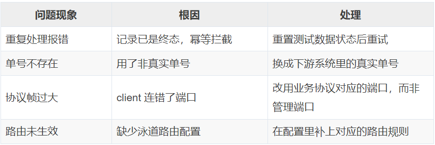

这类问题大多出在环境和配置上，规律性强，交给 AI 按流程排查就行，人不必过多介入。

# 04

凭什么可靠：Harness Engineering 五机制

五个阶段说清了做什么，而让 AI 真正靠得住的，是贯穿每个阶段的一套保障机制。（参考 Harness Engineering 的观点：模型本身已经是商品化的输入，编排、验证、可观测性这套 Harness 才是决定 Agent 可靠性的大部分因素。这也是这个 Skill 敢说"搞定重构"的原因。

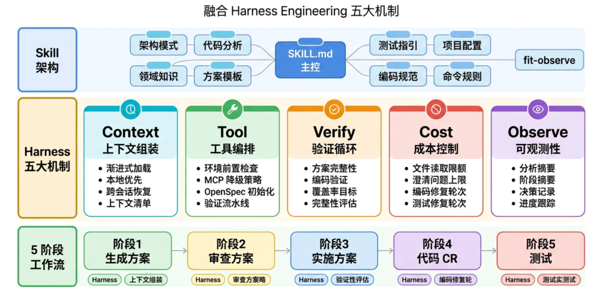

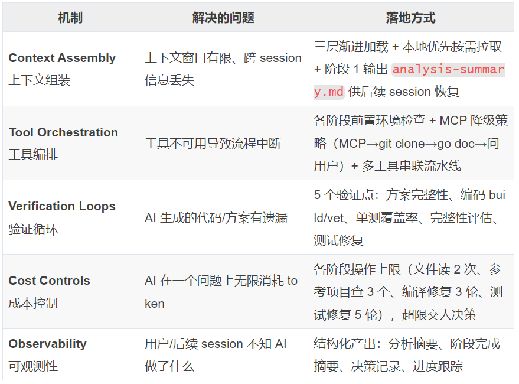

这五个机制合起来，让 AI 的执行做到知识加载精准、流程不中断、结果有校验、成本不失控、过程可追溯。前面几个阶段的例子其实都能对应上：分析阶段的"文件最多读 2 次"是成本控制，编码阶段的"错误修 3 次不过就交人"是成本控制加验证循环，测试阶段的"按 traceID 拉全链路日志"是可观测性。这些约束不是额外加的一层管理动作，而是直接写进了每个阶段的操作里。

# 05

常见坑与规避

重构过程中反复遇到、也最好提前规避的几类问题：

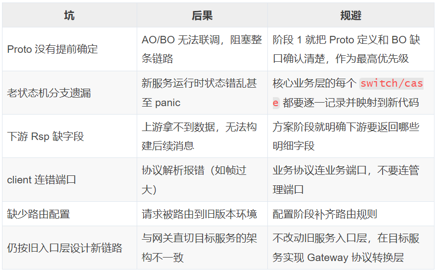

这些坑解决后都会写进知识库对应的文件，下次重构时 AI 会在相应阶段自动提示或规避。

# 06

小结

服务重构的难点不在语言转换，而在梳理清楚多年沉淀在调用链里的业务逻辑，再用新架构重新表达。这个 Skill 把这件事拆成了三部分能力：

* 5 阶段流程把重构分成链路分析、审查、编码、CR、测试五步，每步的输入、产出和人机分工都很明确；

* 分层知识库通过渐进式加载，让 AI 在每个阶段只读当前需要的知识，既省 token 又保证准确；

* Harness Engineering 的五个机制贯穿全程，管住知识加载、流程、校验、成本和可追溯。

使用这个 Skill 进行重构，原本很依赖历史业务经验、动辄好几天又容易出错的重构，变成了相对标准化、可复现、质量可控的流程。过程中沉淀下来的知识资产（Skills、Rules、References、问题解决方案等）也会随每次重构积累：遇到过的坑写进知识库，下次自动规避，同类重构会越做越顺。

\-End-

原创作者｜徐鑫

感谢你读到这里，不如关注一下？👇


扫码领取腾讯云开发者专属服务器代金券！


[](https://mp.weixin.qq.com/s?__biz=MzI2NDU4OTExOQ==&mid=2247695850&idx=1&sn=ecfbc2739caa6d9ebda151aadc400c8a&scene=21#wechat_redirect)

[](https://mp.weixin.qq.com/s?__biz=MzI2NDU4OTExOQ==&mid=2247695865&idx=1&sn=d300189a3247bb4da82e03c2c1d9e772&scene=21#wechat_redirect)

[](https://mp.weixin.qq.com/s?__biz=MzI2NDU4OTExOQ==&mid=2247695963&idx=1&sn=29f18a2db784e1ddb56796af76543688&scene=21#wechat_redirect)


