# 📰 一文讲透Agent三件套：MCP、Skill、Hook如何给大模型装上护栏

关注腾讯云开发者，一手技术干货提前解锁👇

让 Agent 会干活不难，难的是让它干得安全、可控、有迹可循。prompt 约束是软的，Agent 一旦"自信"起来就会绕过；真正的安全边界，要靠工程架构来保障。

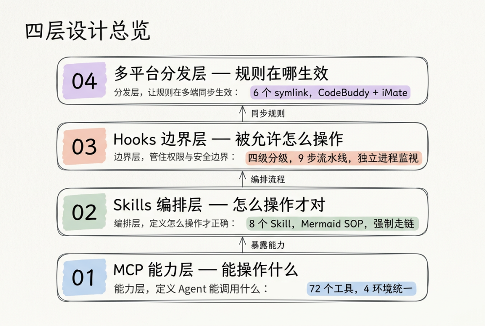

# 01

### MCP、Skills、Hooks 三者的关系

MCP 为 Agent 接入平台能力——以 tools 的形式，让 Agent 按接口定义发送请求、调用后端。

但单个工具调用凑不成完整流程。工具之间如何协作、按什么顺序串联，需要 Skills 来编排——Skills 与业务紧密绑定，定义"先做什么、再做什么、失败怎么办"。

即便有了流程，Agent 在调用时仍会出问题：参数一多就丢字段，复杂嵌套就误填，偶尔还擅自调用高风险工具造成意外伤害。Hooks 正是在 Agent 发起工具调用（以及 Skills 内脚本执行）时进行规则拦截，保障安全运行；同时记录审计日志，让每次调用有迹可循。

# 02

### MCP 设计：Agent需要一个应用市场

### 2.1 MCP 协议是怎么回事 ###

MCP（Model Context Protocol）协议中，Server 暴露给 Client 三种核心原语：**Tools**、**Resources**、**Prompts**。要理解 Agent 插件怎么设计，先要理解这三种原语在 Agent 运行时分别是如何被加载和使用的。

### Tools：启动时批量注册，注入 system prompt

**Agent 启动时，CodeBuddy 框架向所有已配置的 MCP Server 发送** `tools/list`请求，拿到完整的工具清单。每个工具是一个结构体：`name`（工具名）、`description`（功能描述）、`inputSchema`（参数的 JSON Schema）。这些定义会被注入到 LLM 的 system prompt 中——LLM "看到"的不是函数指针，而是一段文本描述："你可以调用 `workflow_create`，它接受 `name`（必填, string）、`spaceId`（必填, int64）……"

### Resources：惰性拉取，Agent 按需查询

Resources 不像 Tools 那样启动时一次性拉取。它们的加载是**惰性**的——Agent 在对话中根据需求主动发起 `resources/read`请求。

比如 MCP Server 暴露了 150+ 张数据表作为 Resources（`starrocks://tables/...`的 URI）。Agent 不会在启动时把所有表的 schema 都拿到，而是等用户说"查一下 ODS 层的员工表有哪些字段"时，才去请求对应的 Resource URI，拿到字段名、类型、注释。这套按需加载机制避免了启动时的通信风暴，也避免了 system prompt 被大量无用信息填满。

### Prompts：Server 端预定义的提示词模板

Prompts 是 MCP Server 上预定义的、可参数化的提示词模板。Agent 通过 `prompts/list`查看可用模板，通过 `prompts/get`获取具体模板并填入参数。与 Tools 不同，Prompts 没有副作用，纯粹是帮助 Agent 更好地理解"在特定场景下该怎么做"。

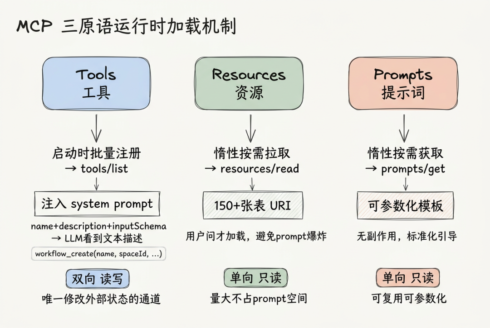

### 三种原语的多维对比

| 维度 |         Tools          |         Resources          |      Prompts      |
|----|------------------------|----------------------------|-------------------|
|数据流向|     双向（参数入 → 结果出）      |   单向（Server → Client，只读）   |单向（Server → Client）|
| 读写 |         **读写**         |             只读             |        只读         |
|加载策略|启动时批量注册，注入 system prompt|         惰性按需拉取，可缓存         |    惰性按需获取，可缓存     |
|适合场景|  CRUD、部署、启停等需要"动手"的操作  |表 schema、数据字典、配置文档等大量结构化参考数据|   需要标准化引导的重复性任务   |
|核心优势|      唯一能修改外部状态的通道      |    量大不占 prompt 空间，按需加载     |  可复用、可参数化，保持行为一致  |
|不适合 | 纯信息查询（用 Resource 更高效）  |      实时计算任务（应走 Tool）       | 动态决策（模板会限制推理灵活性）  |

实战中用好这三种类型的原语，能够提高agent调用效率和token的使用效率。MCP协议计划在2026年7月28日发布一次重大更新（当前为候选版），主要是从原来的有状态连接变成无状态连接，这对后续高性能的MCP集成是一次重大的进步，MCP逐渐会成为Agent更坚实的基础设施。具体的内容可以参考这个博客。

（<https://blog.modelcontextprotocol.io/posts/2026-07-28-release-candidate/）>

### 2.2 自建 MCP Server 的经历 ###

最初方案是自建一个 Spring Boot MCP Server——在 Agent 和 DES 后端之间架一套中间代理（Agent → MCP → des-mcp-server → REST → DES Backend）。

自建的好处是自由度极高——工具注册策略、参数校验逻辑、错误处理方式都可以自己控制，比如可以按业务域灵活分级部署工具。但真正上手之后，两个核心问题逐渐暴露：

* **架构取舍**：如果新建一套 AiController 并直接调用 Service 层来绕过原 Controller，那么原 Controller 上设计的 AOP 切面、并发控制、异常处理等逻辑全部需要在新 AiController 中重做一遍——不是简单的"调用转发"，而是整套横切关注点的二次实现。

* **部署运维**：MCP Server 作为一套独立的 Java 服务，构建、部署、监控、扩缩容都需要额外维护——它和服务本身不在同一个交付单元里，版本同步、依赖管理、线上排错都多了一层。

这些本质上不是"做不出来"的问题，而是"值不值得单独维护一个中间代理层"的问题。正是这个判断，让我们把目光转向了部门内已有的基础设施。

### 2.3 选择 SA-Market ###

SA-Market 是部门内已有的 MCP 市场，**原生支持将 REST API 自动注册为 MCP 工具**——上传 Swagger/OpenAPI 规范（后也支持 MCP Json），平台自动解析出 tool schema，无需写一行 MCP 适配代码。架构上同样是一层路由（Agent → MCP 协议 → SA-Market → REST → DES Backend），但省掉了自建中间服务的所有维护成本。这更像是应用市场，能够有一个中心化的平台路由分发各个项目接入的能力，集中管理和维护。

对比自建方案，SA-Market 省掉了两块最大的开销：

* **不用自建中间服务**：2.2 中提到的架构取舍和部署运维问题直接不存在了——不用纠结 AiController 的复用策略，也不用维护独立 Java 服务的构建部署链路

* **不用手写适配代码**：Tool 的 inputSchema 和后端接口入参之间的耦合是绕不开的——自建方案里这份映射靠人工维护，SA-Market 则是上传一份 OpenAPI/JSON 规范，平台自动解析出 MCP 工具定义，省去了手写和维护映射逻辑的工作

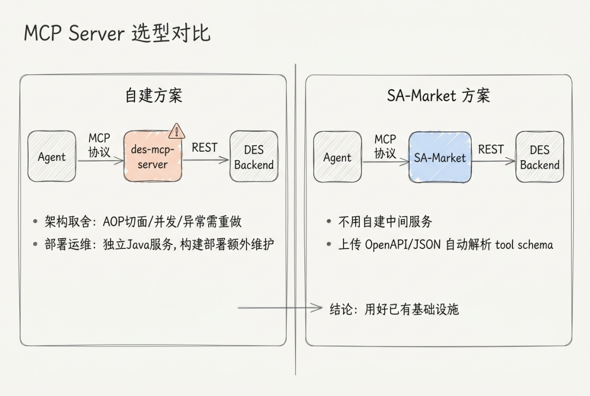

# 03

### Skills 设计：Mermaid一言以蔽之

### 3.1 多步骤操作的编排困境 ###

MCP 工具就位后，一个完整的业务流程往往要调用多个工具，而且工具的使用有顺序依赖和注意事项。

比如部署一个工作流：

```

导入 JSON → 保存草稿 → 调试运行 → 修复问题 → 更新 → 发布上线

```

这不是一个单步 MCP 调用，而是 5-6 个步骤组成的有向无环图。如果靠 LLM "自由发挥"来编排，会出现：

* **跳步**：没调试就直接发布上线，带着 bug 跑

* **乱序**：先 publish 再 save draft —— 状态机冲突

* **遗漏错误处理**：debug\_run 失败了不知道怎么修，卡在半路

MCP 工具层解决了"能调用什么"，但没有解决**"怎么组合调用才是正确的"**——这个编排问题，需要 Skills 层来解决。

### 3.2 Mermaid SOP：用流程图替代文字步骤列表 ###

但是SOP 类型的 Skill 一旦步骤长、分叉多，纯文本写下来既冗长又难理解。引入 Mermaid 后，几行就能描述一个分支复杂的完整流程。

以 `deploy-workflow`Skill 为例，它的 mermaid SOP 大致结构是：

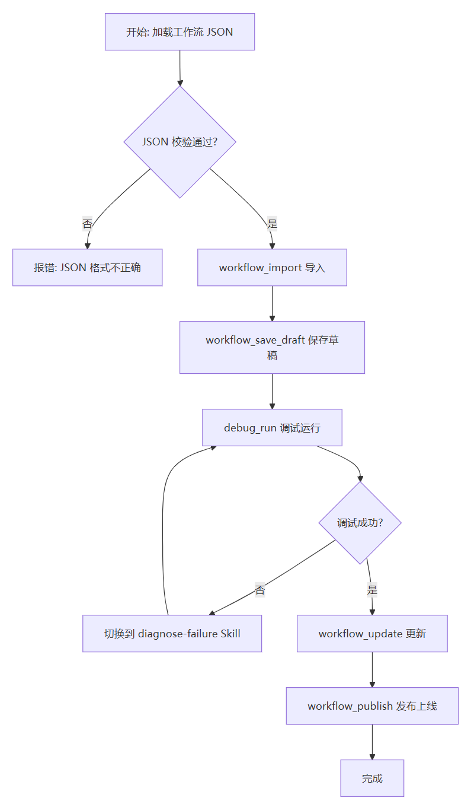

相比于纯文本的步骤列表，Mermaid 的视觉表达让 Agent 能更准确地理解：

* 哪些步骤是顺序依赖的（A→B→C）

* 哪里有条件分支（成功→继续，失败→诊断修复）

* 失败后的回退路径是什么（回到上一步重试）

虽然没有进行量化实验对照，但实际使用效果可以感觉到，Agent 跳步、乱序的问题显著减少，因为Mermaid能够在有限的篇幅传达高密度的信息。

### 3.3 强制走链规则 ###

除了 SOP 编排，Skills 层还有一条硬约束：**某些 MCP 写工具必须先走完对应 Skill 才能调用**。例如：

* 调用 `workflow_import`tool 前必须先走 `des-generator`skill —— 确保 JSON 是标准化流程生成的、经过字段校验的

* 调用 `dqc_rule_create`tool 前必须先走 `dqc-workflow-generator`skill → `create-dqc`skill —— 确保规则参数完整、合规

这条规则在 `context.md`中定义为行为规范约束，Agent 在执行写操作前会检查依赖链并引导用户先走 Skill 流程。它不依赖 Hook 层的代码拦截（Hook 层负责的是安全分级），而是在 Agent 的推理层面建立"先走流程、后调工具"的纪律。

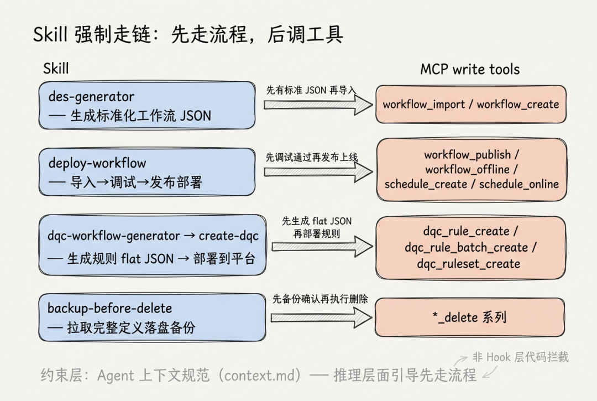

# 04

### Hooks 设计：All you need is 强而有力的脚本

如果说 MCP 层解决"能操作什么"、Skills 层解决"怎么正确操作"，那么 Hooks 层解决的是最后一个、也是最关键的问题：Agent 被允许怎么操作——安全边界在哪里。

### 4.1 Hook 的运行原理：MCP 调用链路中的检查点 ###

Hook 不是嵌入 Agent 对话流程中的 prompt 规则，而是插件框架在 MCP 工具调用链路里注入的同步拦截点。

Agent 构造完 tool call 后、框架实际发起调用之前，引擎暂停执行流，将 tool\_name 和 tool\_input 序列化后交给 Hook 脚本裁决。脚本执行校验逻辑后返回结构化控制字段：continue 决定放行或拦截，permissionDecision 决定是否弹出确认框，modifiedInput 用于补全缺失参数，等等。引擎根据这些字段执行最终动作，放行、弹窗确认、或直接拒绝。Agent 无法绕开，因为 tool call 到实际执行的路径被框架独占，Hook 是这条路径上的唯一道闸。

des-agent-plugin这里主要使用了三种事件类型，PreToolUse（调用前拦截）、PostToolUse（调用后审计）、SessionStart（会话开始注入）。

|    Hook    |     触发时机      |         文件         | 代码量  |        职责         |
|------------|---------------|--------------------|:----:|-------------------|
| PreToolUse |调用 MCP 工具**之前**|`pre_tool_guard.py` |\~60KB|安全拦截 + 参数校验 + 字段补全 |
|PostToolUse |MCP 工具调用**完成后**|`post_tool_audit.py`|\~40KB|审计记录 + 产出物管理 + 经验闭环|
|SessionStart|  每次对话**开始时**  | `session_start.py` |\~15KB|   注入上下文、偏好、最近操作   |

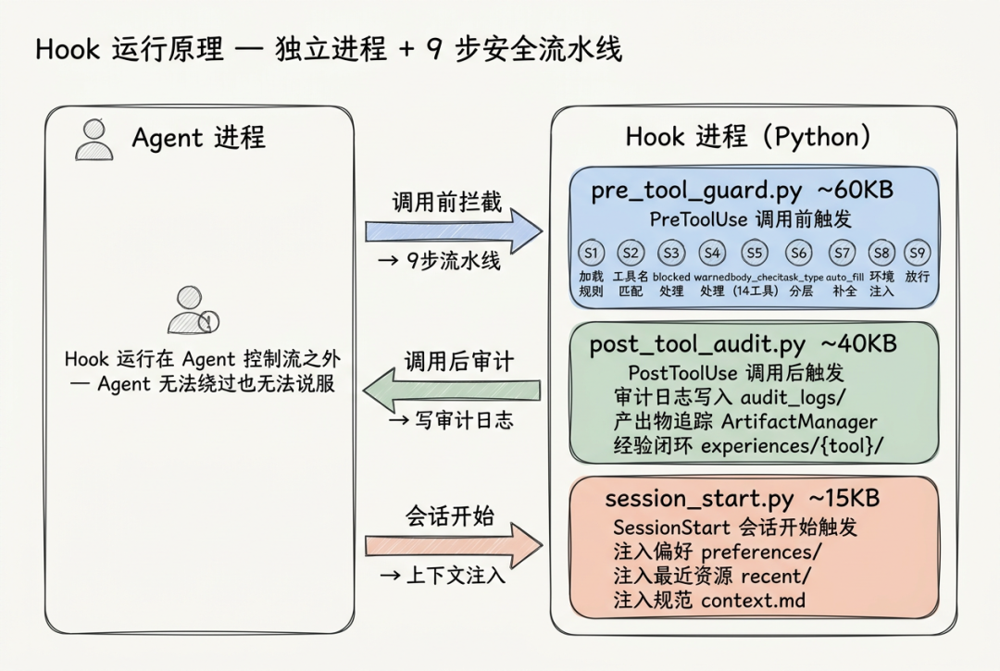

### 4.2 四级安全分级 ###

拦截点就位后，接下来要定义规则：什么操作该拦截、什么该放行。

设计上采用了**渐进式安全分级**，而不是二元的"允许/拒绝"——从静默放行到硬阻断，四个梯度覆盖了查询、审计、写操作、不可逆删除全部场景：

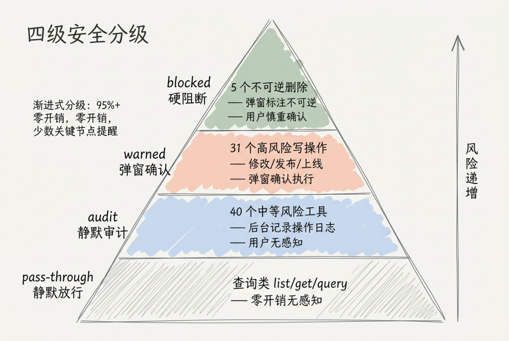

### 4.3 9 步安全流水线：从规则加载到放行 ###

`pre_tool_guard.py`的内部逻辑是一条 **9 步流水线**

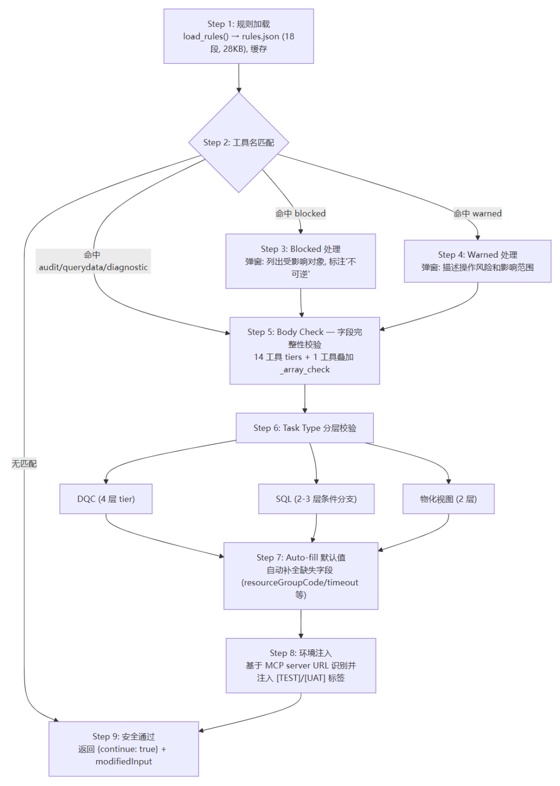

每一步都是独立可测试的模块，新增规则只需在 `rules.json`中追加配置段，无需修改 `pre_tool_guard.py`的主体逻辑。

### 4.4 Tier 条件链与 Body Check ###

### 4.4.1 Tier 条件链：一种条件性字段校验模型 ###

**Tier 是这里定义的一种条件性字段校验层**。一个 tier 包含一组字段声明（`required`：必填非空 / `nullable`：必填可空）和一个可选的触发条件。条件支持三种操作符：`eq`（精确相等，含布尔/字符串类型兼容）、`contains`（数组包含）、`not_empty`（非空触发）。

多个 tier 串联形成 **condition-chain**——tier0 无条件必检，tier1 在某字段满足条件时追加校验，tier2 又依赖 tier1 的结果……链条深度随业务复杂度递增。以 DQC 任务为例：

|tier |             触发条件             |                                   required                                    |  nullable   |
|-----|------------------------------|-------------------------------------------------------------------------------|-------------|
|tier0|            无条件必检             | `datasourceId`<br/><br/>, `isSr`, `databaseName`, `tableName`, `dqcRuleCodes` |`description`|
|tier1|      `isAlert == true`       |`alertConfigType`<br/><br/>, `isMergeAlert`↳tier2, `isAlertDeduplication`↳tier3|      —      |
|tier2|    `isMergeAlert == true`    |                               `alertConfigIds`                                |      —      |
|tier3|`isAlertDeduplication == true`|                             `deduplicationRange`                              |      —      |

>
>
> isMergeAlert 和 isAlertDeduplication 经 tier1 校验通过后，分别下探为 tier2 和 tier3 的触发条件。
>
>

**执行逻辑**：tiers 数组按序遍历，当前 tier 的 condition 满足 → 追加校验该 tier 的字段；不满足 → 跳过。没有 condition 的 tier（如 tier0）无条件必检。

链条深度随业务复杂度递增：DQC 任务 4 层，STARROCKS\_SQL/JDBC\_SQL 2-3 层，body\_check 的写工具通常 2-3 层。

Step 5（body\_check）和 Step 6（task\_type）共用这套 tier 抽象，但校验对象不同：body\_check 校验请求体顶层字段（扁平结构）；task\_type 校验的是 `taskDefinitions[].taskProperties`——三层嵌套的键值对数组（`[{prop: "xxx", value: "yyy"}]`）。如果硬塞进 body\_check 的通用逻辑，校验层级会过深、代码复杂度爆炸。因此 taskProperties 被单独拆出为 `task_type_field_checks`段 + 独立的 `_check_task_properties`函数，但内部复用同一套 condition-chain 求值器（`_matches_tier_condition`+ `_check_tier_fields`）。

### 4.4.2 两种格式覆盖 14 个写工具 ###

### 4.4.1 中定义的 condition-chain 抽象在这里同样适用：body\_check 的 tier 链通常 2-3 层，比 task\_type 的 4 层浅。不同的 API 参数结构不同，同一套校验逻辑无法适配所有场景，因此设计了两种格式 ###

**tiers 格式**（14 个工具）——分层条件校验，覆盖所有需要字段校验的写工具。

每个工具的校验定义包含 `_get_tool`（关联查询工具）和 `tiers`数组。每个 tier 有三层语义：

* `required`：必填且非空。缺失或空值直接拦截——如 `workflow_update`的 `taskDefinitions`缺失会导致画布无节点、publish 失败。

* `nullable`：必填但可为空。字段必须存在，值可以为空数组或空字符串——如 `alertChannels`可为空数组（表示无告警）。

* `condition`：条件触发。当某字段满足条件时，追加额外必填校验——如选了 `TIMEOUT`告警渠道时，`timeout`字段变为必填非空。

`  
`

`_get_tool`机制是 tiers 格式的关键：在Agent调用传入了不完整字段，会返回提示信息调用关联的 get 工具（如 `workflow_update`关联 `workflow_get`），拉取当前对象的现有状态用于对比，避免 Agent 用残缺参数覆盖完整数据。

**\_array\_check 格式**——批量操作元素级校验，作为 tiers 的补充。

`dqc_rule_batch_create`这类批量工具，不仅要校验数组非空，还要对数组中每个元素内部用 tiers 逻辑逐条校验。`_array_check`定义了 `field`（数组字段名）和 `item_tiers`（每个元素的 tier 校验规则），相当于把 tiers 格式嵌套进数组遍历。这个工具同时也有 tiers 格式定义——\_array\_check 是在 tiers 基础上的额外补充。

两种格式不是并列关系，而是**叠加关系**：14 个工具都有 tiers 格式，其中 `dqc_rule_batch_create`额外叠加 \_array\_check 做数组遍历。这种设计避免了"写一个万能校验引擎"的过度抽象——tiers 解决结构化参数的条件校验，\_array\_check 解决批量操作的逐元素校验，各司其职。

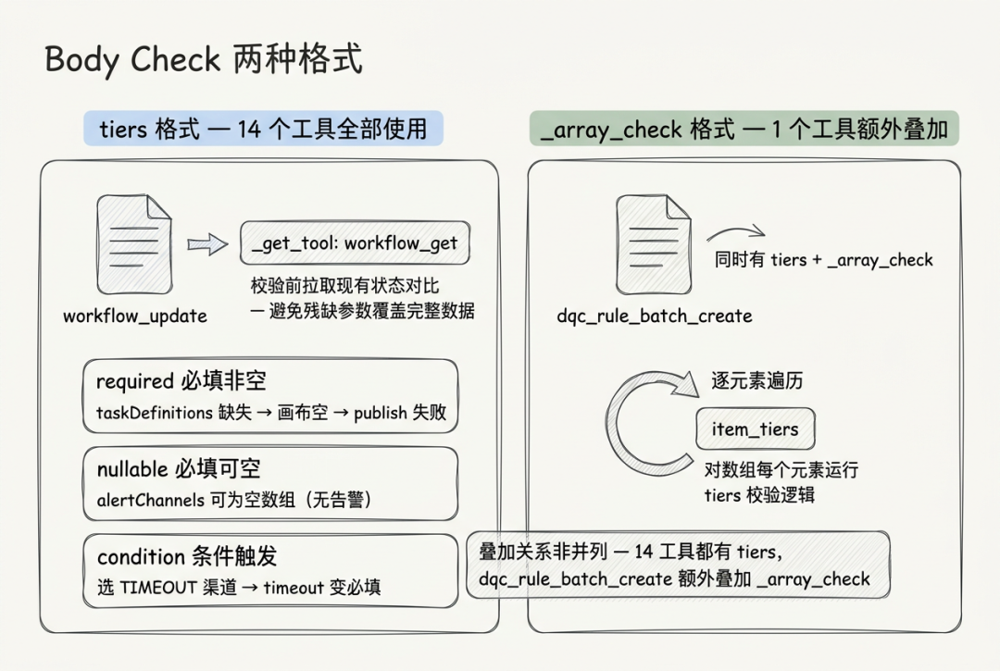

# 05

### 多平台设计：设计规则"在哪里生效"

### 5.1 双平台实战演示 ###

DES 插件需要覆盖两类用户：

* **CodeBuddy IDE 用户**

* **iMate 用户**

des-agent-plugin在这两个平台的 Hook 脚本实现语言不同（Python vs JavaScript），但需要**一致的安全规则和行为规范**。

## 第四章从代码层面拆解了 Hook 引擎的 9 步流水线和 tier 条件链。下面从各平台的 实际运行效果 来展示拦截和校验在真实对话中长什么样

### CodeBuddy IDE

以下是发布工作流的场景，在用户提到发布工作流时会加载deploy-workflow Skill，发布前会向用户确认当前工作流的信息和状态。

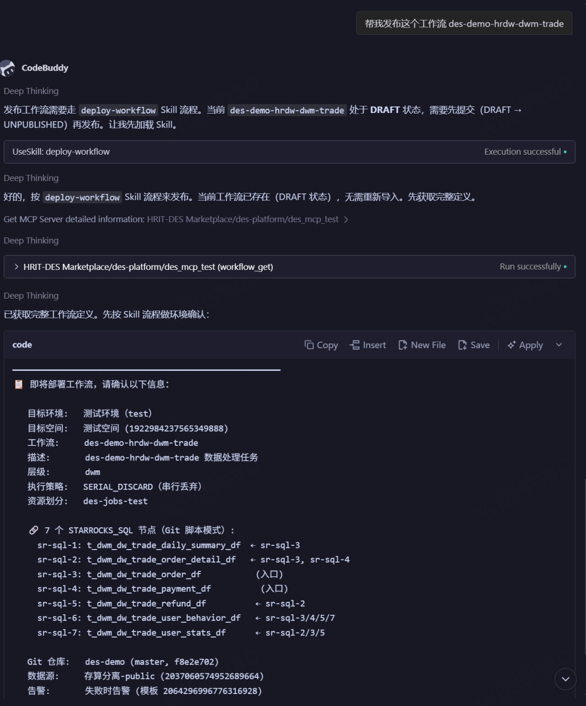

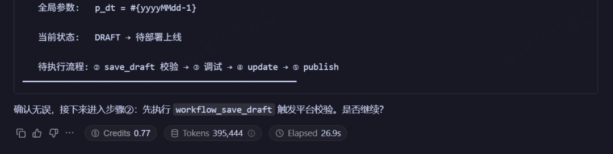

用户确认继续后会进入到下一个阶段，这里的workflow\_save\_draft是保存草稿，但是其中集成了对工作流的合法性校验，在Skill中定义了在发布前需要执行校验的步骤。在agent调用工具的时候，如果传入的请求体字段不满足hook中约束的字段规则，会执行deny拒绝掉本次调用，并返回所缺少的字段。agent会根据提示信息重新发起一次调用，字段满足后会调起hook弹窗。

用户确认后会按照Skill中定义好的mermaid流程图，进入到下一阶段，这里是在流程图的节点中声明，在调试阶段需要询问用户是否需要调试，这里是要求Agent调用AskUserQuestion工具，这样就能够出现如图的弹窗供用户选择。

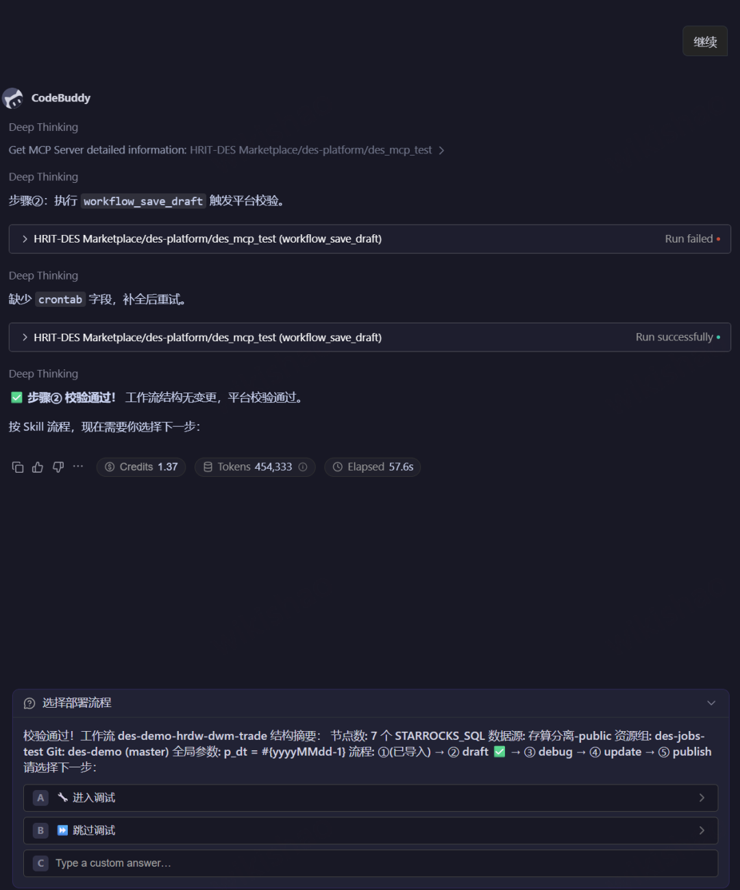

iMate 平台

在iMate平台的网页版和企微机器人实现了同样的插件机制，这里展示的是hook弹窗。这里因为iMate在调度mcp的时候使用的是mcporter，调用的命令的形式和CodeBuddy不完全一致，在hook脚本中进行调用匹配的逻辑上做了一些适配。

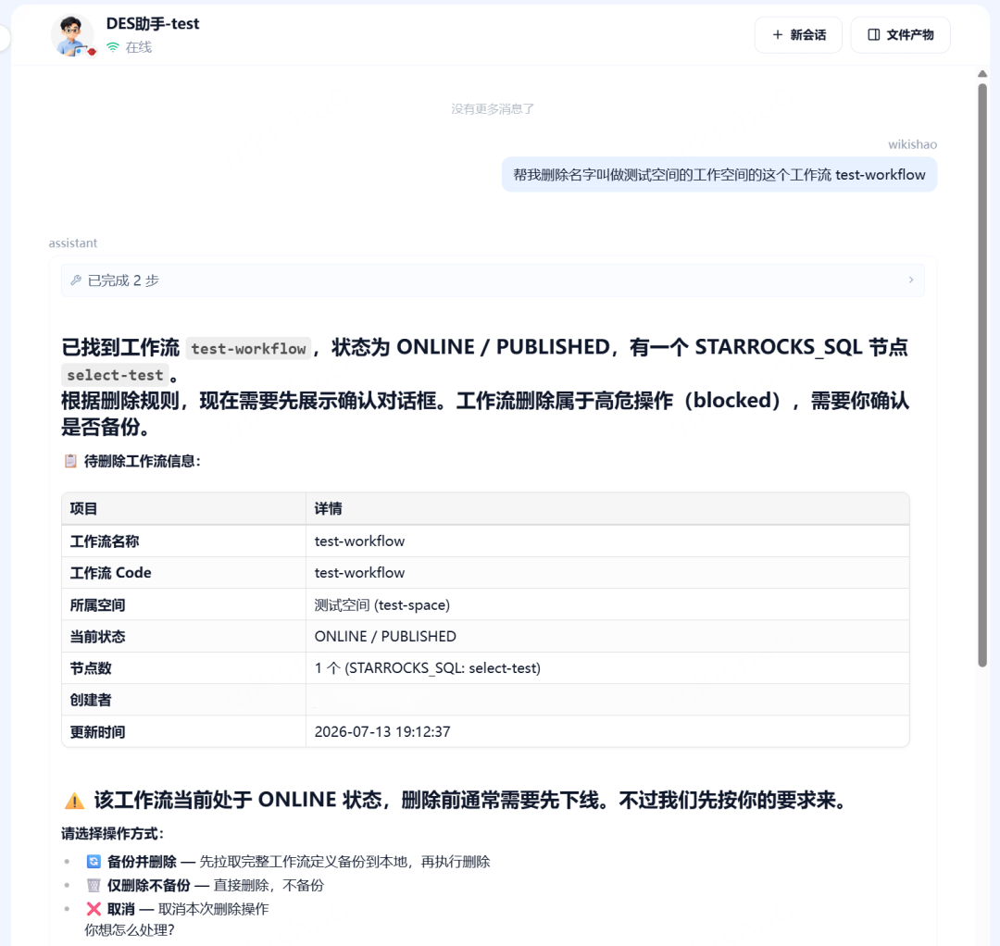

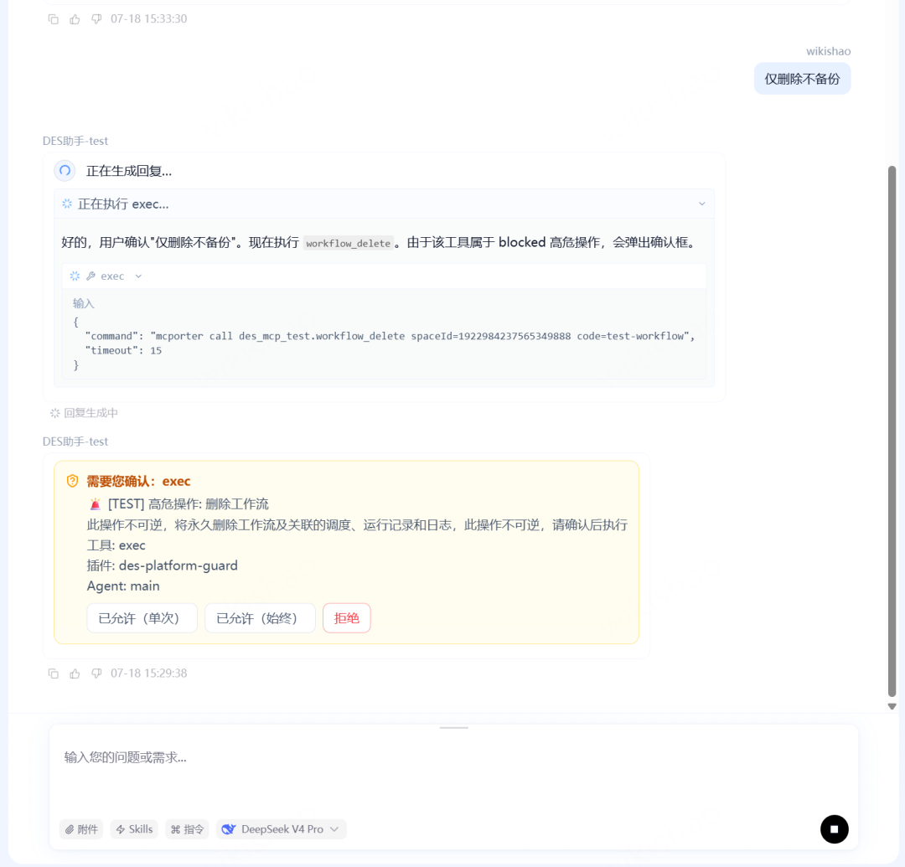

这里是企微机器人的场景。

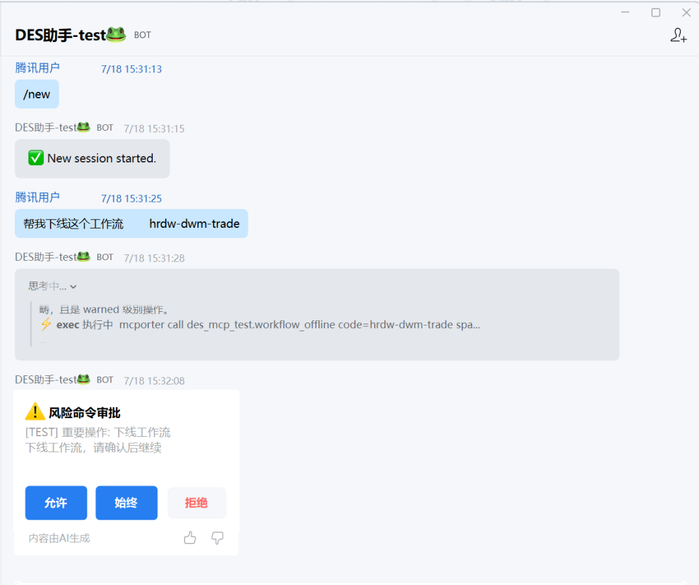

### 5.2 Symlink 单源管理 ###

要适配多平台，又想要在同一个仓库中维护管理插件，解决思路是 **Monorepo + Symlink**：

```

des-agent-plugin/
├── shared/                              ← 唯一的配置源
│   ├── rules.json                       (18段, 28KB)
│   ├── rules-error-patterns.json        (错误模式库)
│   └── context.md                       (Agent行为规范)
│
├── plugins/des-platform/                ← CodeBuddy IDE 插件
│   └── hooks/
│       ├── rules.json ──⛓── ../../shared/rules.json           (symlink)
│       ├── rules-error-patterns.json ──⛓── ../../shared/...   (symlink)
│       └── context.md ──⛓── ../../shared/context.md           (symlink)
│
└── platforms/imate/                     ← iMate/OpenClaw 插件
    └── src/
        ├── rules/rules.json ──⛓── ../../../shared/rules.json     (symlink)
        ├── rules/rules-error-patterns.json ──⛓── ../../../...    (symlink)
        └── config/context.md ──⛓── ../../../shared/context.md    (symlink)

```

### 5.3 Symlink 是怎么工作的 ###

流程很简单：

1. 如果仓库中已经构建好了软链接，那么`git clone`获取仓库——Linux/macOS 下 git 原生保留 symlink，clone 后自动生效；Windows 需开启开发者模式并设置 `git config core.symlinks true`

2. 若上述条件不满足（如 Windows 未配置），需要运行提前写好的脚本 `init-platforms.sh`，执行 6 条 `ln -sf`命令重建 symlink，如果软链接实在无法构建，脚本中还有直接复制过去的fallback

## 3. 之后修改 `shared/rules.json`→ symlink 自动跟随 → 双平台同时生效

对代码本身来说，symlink 是透明的：

* Python 侧：`common.py:load_rules()`用 `os.path.dirname(__file__)`相对路径读取，文件系统自动解析为 `shared/`下的实际文件

* JS 侧：`import rules from "../rules/rules.json"`中 Node.js 的模块解析自动跟随 symlink

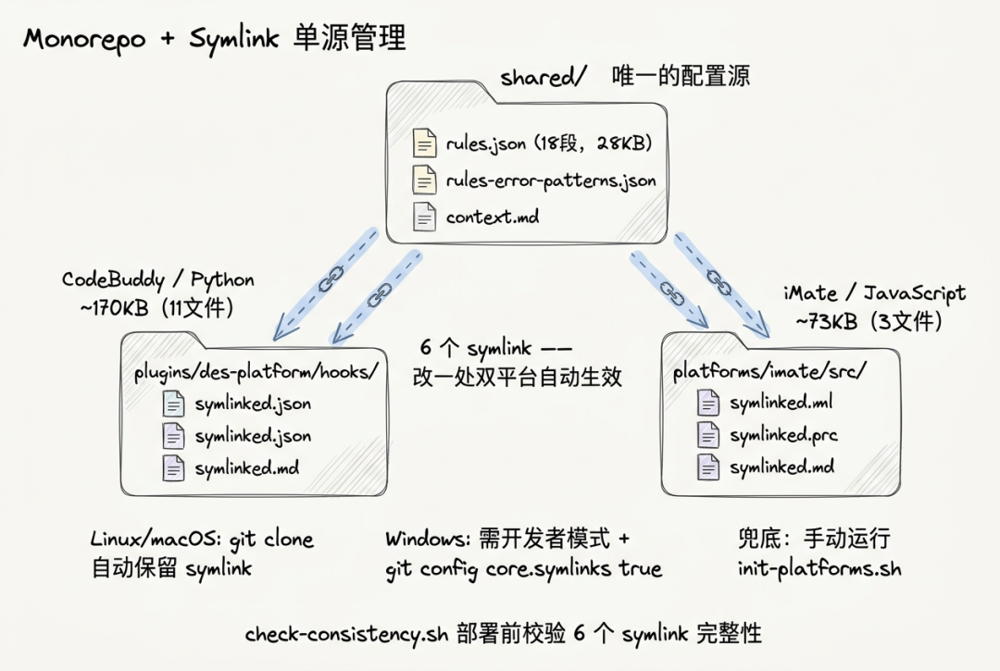

# 06

### 多平台设计：设计规则"在哪里生效"

### 6.1 rules.json：18 段配置的完整体系 ###

所有安全规则、字段校验、DDL 模式、环境映射全部外化到 `rules.json`中——不在 `pre_tool_guard.py`中硬编码任何规则。

18 段配置的结构从简单到复杂渐进：

|\# |              段名              |                 内容                  |复杂度|
|:-:|------------------------------|-------------------------------------|:-:|
| 0 |           version            |                配置版本号                | 低 |
| 1 |         des\_servers         |          MCP URL → 环境名称映射           | 低 |
| 2 |           blocked            |             5 个不可逆删除工具              | 低 |
| 3 |            warned            |             31 个高风险写工具              | 中 |
| 4 |      dangerous\_scripts      |           3 个高危 Python 脚本           | 低 |
| 5 |   dangerous\_ddl\_patterns   |           8 种 DDL 危险语句检测            | 高 |
| 6 |            audit             |             40 个静默审计工具              | 中 |
| 7 |    experience\_ttl\_days     |            经验闭环 TTL=30天             | 低 |
| 8 |       querydata\_tools       |             12 个分页查询工具              | 低 |
| 9 |      diagnostic\_tools       |               6 个诊断工具               | 低 |
|10 |      recent\_categories      |              9 条记忆分类映射              | 中 |
|11 |        failure\_tips         |              5 条失败重试指引              | 中 |
|12 |      body\_check\_tools      |14 工具字段完整性（tiers + \_array\_check 叠加）| 高 |
|13 |body\_check\_ask\_user\_guides|               弹窗引导文案                | 低 |
|14 | task\_property\_check\_tools |       6 个 taskProperties 校验工具       | 中 |
|15 |  task\_type\_field\_checks   |        4 种 TaskType 分层 tier         | 高 |
|16 |      auto\_fill\_fields      |               自动补全默认值               | 低 |
|17 |         diff\_tools          |              3 个差异对比工具              | 低 |

这里的外化相当于将配置文件和代码逻辑进行解耦，便于长期维护。以上的规则配置这里只是给出一个参考的实践方式，具体还可以有更多的发挥空间。

### 6.2 Agent Plugin Factory：从"做插件"到"做做插件的工具" ###

在完成 DES 插件之后，我们考虑把设计和开发经验固化为一个元工具：**Agent Plugin Factory**——给一个 Swagger/OpenAPI 规范，自动生成完整的平台 Agent 插件。目前这套流程还在开发验证阶段，因为不同的系统的具体情况不一样，这里提供一种可参考的方法论，具体的实施和测试环节需要根据具体的情况再进行一些适配上的工作。

四阶段流水线：

```

Swagger/OpenAPI
    ↓
Stage 1: Parse — parse_swagger.py 解析所有 API endpoint，提取 path/method/params/schema
    ↓
Stage 2: Classify — classify_tools.py 按 HTTP 方法自动安全分级:
  DELETE / delete → blocked
  POST / create|update|import → warned
  GET / list|get|query → audit
  其他 → pass-through
    ↓
Stage 3: Detect — detect_querydata.py 检测哪些接口返回 list/rows，标记为 querydata_tools
    ↓
Stage 4: Generate
  ├─ generate_all.py: SA-Market JSON 脚本生成 + 三层校验（语法/语义/集成）
  ├─ AI Agent 理解需求并填充 config.yaml → Jinja2 模板引擎渲染 17 文件一键生成
  └─ 输出: CodeBuddy 插件 (.mcp.json + hooks + context.md + 8 Skills)
         + iMate 插件 (openclaw.plugin.json + JS Hooks)
         + SA-Market 注册文件

```

这里设想着不再只为 DES 这一个平台解决问题，而是把"如何给任意 API 服务生成安全可控的 Agent 插件"的方法论固化为工具，成为能够高自动化将项目转化为集成MCP、Skills、Hooks的Agent插件。

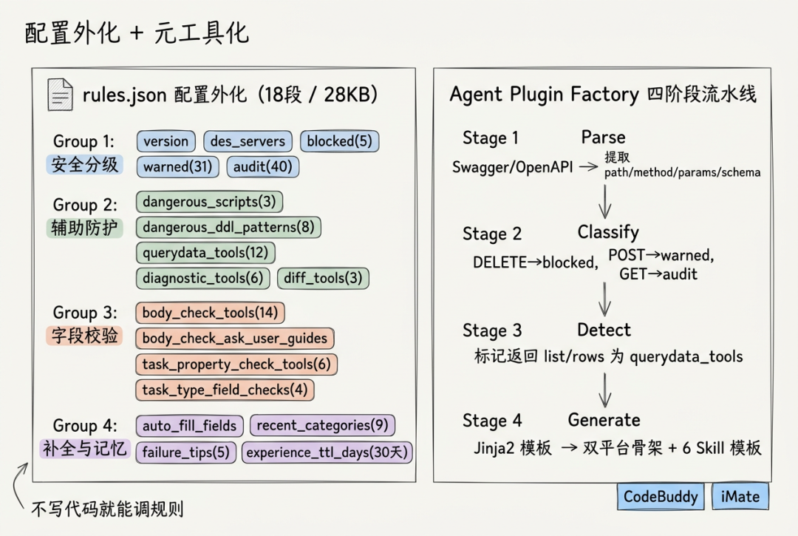

# 07

**总结**

回头看这四层设计，每一层解决的是 Agent 操作平台的不同维度问题：

* **MCP 层**定义"能操作什么"——72 个工具，4 个环境统一，1 份 Swagger 规范即注册。经验：与其自建中间代理，不如用好已有的基础设施。

* **Skills 层**定义"怎么操作才对"——8 个 Skill，Mermaid SOP 可视化，强制走链。经验：让 Agent 按规矩办事，比让它"更聪明"更可靠。

* **Hooks 层**定义"被允许怎么操作"——四级分级，9 步流水线，18 段外化规则，170KB 拦截逻辑。经验：**安全边界不靠 prompt 保证，靠工程架构保障。**

* **多平台层**定义"规则在哪生效"——6 个 symlink，双平台原生 170KB+73KB，不改代码就能同步规则。经验：不做抽象层，用文件系统级的一致性保证逻辑一致。

这四层叠在一起，构建了一个让 Agent **有能力、有规矩、有底线、有一致性**的操作框架。

今天的模型能力已经跃过了一道门槛，理解意图、生成代码、自主推理不再是瓶颈。但模型不会自动解决工程问题：安全边界在哪里、操作流程怎么规范、规则怎么在多平台同步。对于Coding Agent的工程化，有人说会是这样的发展链路：

```

Prompt Engineering -> Context Engineering -> Harness Engineering -> Loop Engineering -> Graph Engineering

```

但是我在想，这里所设计的工程，也是人类的集体的智慧围绕着大模型搭建起的护栏，那么对于 Agent 本身，我们能否使其涌现出群体的智慧，我们是否知道 Agent 知道多少，Agent 自己本身是否知道自己知道多少，我们到底应该如何定义 Agent 呢？这里也许还需要着长期的探索。

\-End-

原创作者｜邵炜杰

感谢你读到这里，不如关注一下？👇


📢📢来抢开发者限席名额！点击下方图片直达👇

[]()


你对本文内容有哪些看法？同意、反对、困惑的地方是？欢迎留言，我们将邀请作者针对性回复你的评论，欢迎评论留言补充。我们将选取1则优质的评论，送出腾讯云定制文件袋套装1个（见下图）。7月30日中午12点开奖。


扫码领取腾讯云开发者专属服务器代金券！


[](https://mp.weixin.qq.com/s?__biz=MzI2NDU4OTExOQ==&mid=2247695850&idx=1&sn=ecfbc2739caa6d9ebda151aadc400c8a&scene=21#wechat_redirect)

[](https://mp.weixin.qq.com/s?__biz=MzI2NDU4OTExOQ==&mid=2247695865&idx=1&sn=d300189a3247bb4da82e03c2c1d9e772&scene=21#wechat_redirect)

[](https://mp.weixin.qq.com/s?__biz=MzI2NDU4OTExOQ==&mid=2247695963&idx=1&sn=29f18a2db784e1ddb56796af76543688&scene=21#wechat_redirect)


