# 📰 Agent开始“自我进化”：会出题、会反思，还会自己长出新技能

作者：horacebao、ashexie

>
>
> 当 Agent 自己会出题、自己会答题、还能把答错的经验沉淀成下一次的"技能包"——一个永远在长大的 Agent，到底能走多远？
>
>
>
> 十几篇论文反复啃读，从"存技能"到"训技能"，再到"零数据自训"，我们终于摸清了自进化 Agent 这条赛道的脉络。本文将带你深入 Agent 的"经验大脑"——从把经验写进文件，到把经验训进权重，再到完全无人工数据的自我循环，一步步拆解研究路径。
>
>

一个完全自主、越用越强的 Agent，有可能实现吗？本文聚合了现有的前沿探索工作，向大家展现这一方向上的最新成果。话不多说，现就开启学习之旅吧——本次文章覆盖自进化 Agent 的三大技术路线、代表工作详解、横向对比、关键洞察等话题。

## 01 自进化 Agent 介绍

### 1.1 什么是自进化 Agent？ ###

**自进化 Agent**（Self-Evolving Agent）指的是一类能够在与环境/用户交互过程中**自动积累经验、提炼能力、并在后续任务中复用与提升**的智能体。简单来讲：让 Agent 自己越用越聪明，而不是每次都靠人工去喂数据、调提示词、改模型。

它的核心诉求可以拆成三件事：

* **能存**：把交互过程中沉淀下来的有价值的东西（成功模式、失败教训、可迁移技能）存下来；

* **能用**：在新任务中能把之前存下来的东西检索/调用/内化进自己的决策；

* **能进化**：经验本身是动态的，能更新、能合并、能淘汰，避免越攒越乱。


### 1.2 为什么这件事现在被重视起来了？ ###

回到大模型本身的几个老大难问题：

* **静态知识**：训练完成那一刻起，模型对世界的认知就被冻结了；

* **上下文有限**：再长的上下文窗口也总有边界，多轮交互终究"断片"；

* **重复犯错**：今天教会它的事，明天还会再犯一遍；

* **训练贵**：每次想让模型变强一点，要么 SFT 要么 RL，都得重新跑一遍。

而自进化 Agent 想要的正是绕开这些限制：**让经验本身成为模型能力的延伸或更新通道**。这件事在学术上不算新概念（早期的强化学习+经验回放就是雏形），但在大模型时代被重新点燃，本质是因为：

* LLM 本身具备总结归纳的能力（自己能给自己写笔记了）；

* Agent 形态的产品越来越多，长程交互场景终于有了真实需求；

* 高质量人工标注数据越来越贵，社区开始探索"少人工 / 无人工"路线。

### 1.3 三大技术路线一览 ###

我们把目前调研到的工作按"**是否更新模型权重**"和"**是否依赖人工数据**"两个维度划成了三类：

|         路线         |是否更新模型权重|是否依赖人工数据|                         代表工作                          |
|--------------------|--------|--------|-------------------------------------------------------|
|**第一类：经验/Skill 存储型**| ❌ 不更新  |  ❌ 依赖  |AutoSkill、EvoSkill、MemSkill、CoEvoSkills、SE-Agent、Hermes|
|   **第二类：RL 训练型**   |  ✅ 更新  |  ❌ 依赖  |   EvolveR、SAGE、SkillRL、SKILL0、SkillOS、AgentEvolver    |
|  **第三类：0 数据自学型**   |  ✅ 更新  | ✅ 不依赖  |             Agent0、Tool-R0、Absolute Zero              |

简单一句话来理解三类工作的差异：

* **第一类**像是给 Agent 配了一本"工作笔记"，模型本身不动，只在需要时翻阅；

* **第二类**则是直接把"工作笔记"上的经验通过 RL 写进模型的权重里，让 Agent 真正"长本事"；

* **第三类**更激进——干脆连"老师"都不要了，让 Agent 之间互相出题互相考试，自己跟自己打。

下面分别展开。

---

## 02 第一类：经验/Skill 存储型（不更新模型权重）

**特征**：不训练、跨会话保留上下文、文件式存储；核心是把经验沉淀为可检索/可复用的"技能（Skill）"。

类比来看，这类工作就像是给 Agent 配了一个"外挂大脑"，本体（base LLM）保持冻结，所有的"成长"都发生在外挂里。

### 2.1 AutoSkill（arXiv: 2603.01145） ###

**TLDR**：基础款，动态增删改查 Skill 来防止 Skill 库爆棚。

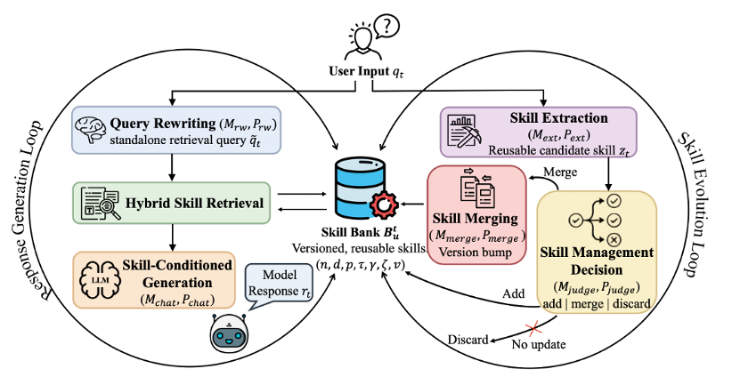

整体设计是一个非常经典的**双环结构**：

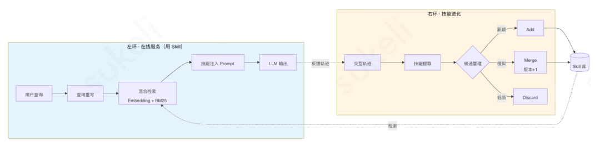

* **左环——在线服务（用 Skill）**

* 查询重写：把用户原始问题改写成更适合检索的形式

* 混合技能检索：语义相似度（Embedding）+ 词汇相关性（BM25）双管齐下

* 技能注入生成：把检索到的技能渲染为外部记忆上下文，注入到提示词里

* **右环——技能进化循环（更新 Skill）**

* 技能提取：从用户交互信号中抽取可重用的技能候选

* 候选技能管理：判断该 Add（新增）/ Merge（合并）/ Discard（丢弃）

* 版本化合并：语义并集更新，保留技能身份并更新版本号

评估数据集是 WildChat-1M，但**没有具体性能指标**——论文里只看了抽出来的 skill 数量。这其实是这一类工作最大的痛点：评估缺位。

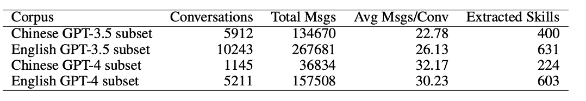

### 2.2 EvoSkill（arXiv: 2603.02766） ###

**TLDR**：让多个 Agent 分工协作——一个执行、一个反思、一个落地——把"失败"变成"新 Skill"，并用 Pareto 前沿机制保证 Skill 库永远精而不滥。

EvoSkill 来自 Sentient 和弗吉尼亚理工的合作工作，主张是把传统 Agent "失败即重试" 的笨办法改造成 **"失败即学习"** 的进化闭环。它的最大特点是把 Skill 当作**一等公民**来升级，而不是只在 prompt / code 层面做文字游戏。

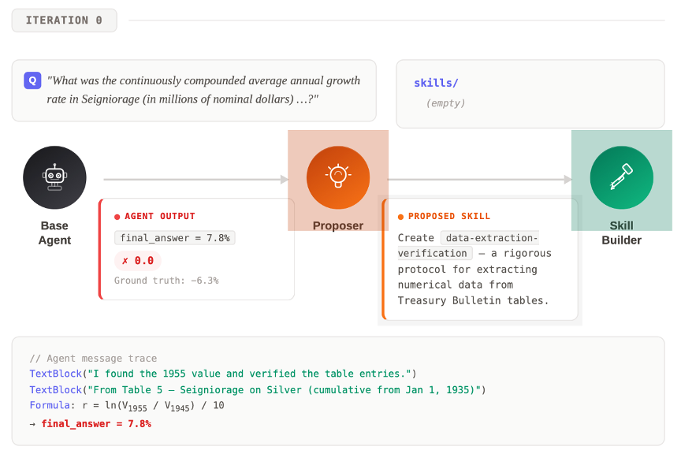

**三 Agent 分工**：

* **Executor Agent（执行者）**：拿当前 Skill 库去跑任务，把失败案例完整记录下来——失败原因、轨迹、最终错误结果一起留档。这是后面所有进化的"原材料"。

* **Proposer Agent（反思者）**：扮演"诊断医生"的角色。它读完 Executor 的失败记录后，会先**做根因分析**（为什么失败？是缺技能？还是技能用错了？），再基于过往的反馈历史决定**新建一条 Skill**还是**修改已有 Skill**——例如在金融文档 QA 任务里它会自动总结出 "data extraction validation"（数据抽取校验）这样的可复用技能。

* **SkillBuilder Agent（落地者）**：把 Proposer 的自然语言提案变成结构化的 Skill 文件夹（含元信息、操作步骤、辅助脚本），并在小样本验证集上跑一轮单元化校验。

**核心机制——Pareto Frontier 精英池**：

新生成的 Skill 不是无脑入库，而是要跟已有 Skill 在多维指标上比较，**只有在至少一个维度上严格优于现有 Skill 的才会进入精英池**，否则丢弃或合并。这套机制保证了 Skill 库随着规模增长依然保持"精而不滥"——这也是它跟 AutoSkill 那种"全量保留 + 版本化"做法最大的不同。

**评估亮点**：

* **OfficeQA 主任务**：基于美国财政部公告（89K 页扫描财务文档）的复杂数值推理任务。基线准确率 **60.6% → 进化后 67.9%（+7.3pp）**，主要靠两条自学到的 Skill 撑场：

* *Data extraction validation* —— 解决了之前表格解析时常见的"单元格错位"问题；

* *Quantitative analysis with checkpoints* —— 在金融数值计算环节强制加入校验点。

* **跨任务迁移**：在 SealQA 上学到的 *search persistence protocol*（搜索坚持协议）直接挪到 BrowseComp 任务上，**无需重新训练**就带来 +5.3pp 的提升——这点跟后面 CoEvoSkills 的"transfer 不如自己 self-evo"结论形成有趣对比，说明**只要 Skill 抽象得足够通用，是可以跨任务迁移的**，但前提是抽象层级要选对。

>
>
> PS：虽然叫"训练集"，但训练集只用来总结，不更新任何模型。
>
>
>
> 评论：在第一类工作里，EvoSkill 是"工程化程度"的中间档——比 AutoSkill 多了精英池筛选机制，但比 Hermes 那种带 GEPA 反向进化的还差一截。它的真正价值在于**把"失败"明确写进了进化闭环**，这也成了后续很多工作（包括 SkillRL 的 failure trajectory distillation）的直接灵感来源。
>
>

### 2.3 MemSkill（arXiv: 2602.02474） ###

**TLDR**：之前两个工作针对用户指令；MemSkill 只针对**操作 Memory 的 Skill** 做自进化。

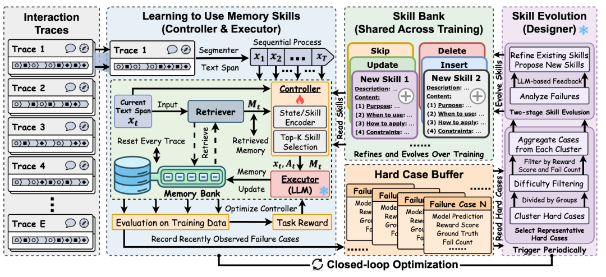

这个工作有意思的地方在于它把组件拆得很细：

* **Retriever**：基于 Qwen0.6B Emb 的相似度计算

* **Controller**：MLP 结构，**接受 RL 训练**（注意这是这一类里少见的"有训练"环节）

* **Executor Designer Base LLM**：全部冻住

它有两个并行的更新 Loop：

* Controller 更新：Retriever 抽取 Memory + 对话 → Controller 选 Skill → Executor 更新 Memory 库 → 用下游 F1 / Success Rate 作为 reward 训练 Controller

* Skill 库更新：训练中遇到的 Hard Case 交给 Designer 更新 Skill 库

**亮点**——Transfer Evaluation：

* 在 LLaMA 上训练所得 Controller & Skill 迁移到 Qwen 上**仍然有效**；

* 在 LoCoMo 上训练所得 Controller & Skill 迁移到 LongMemEval 上**仍然有效**。

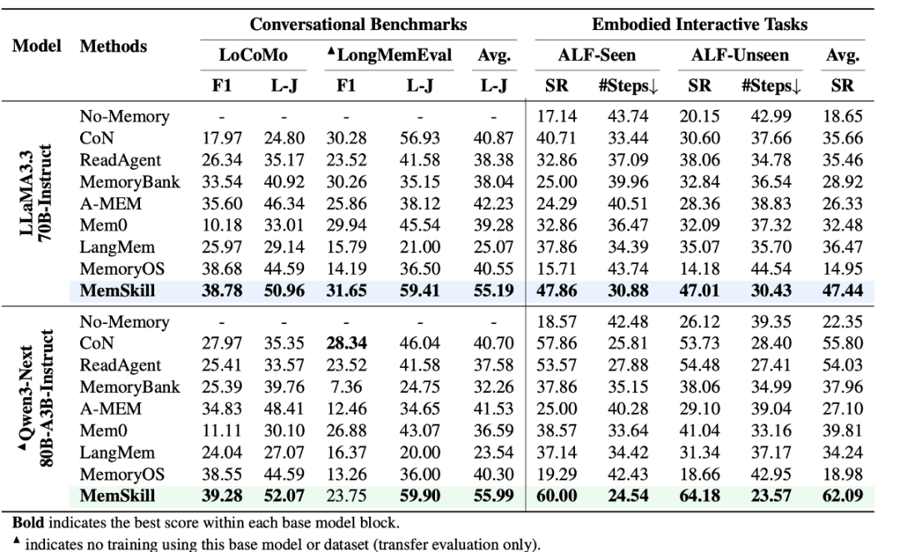

由于 Base LLM 不动，仍归为"无训练"类。但 MemSkill 给前面两篇工作（AutoSkill / Hermes Agent 没有性能评估）提供了一条参考思路：**在训练集上构建 Skill，在测试集/其他数据集的测试集上评估**。当然，这种做法下"喂给 Agent 的样本顺序"就变得很重要。

### 2.4 CoEvoSkills（arXiv: 2604.01687v2） ###

**TLDR**：给每条新总结的 Skill 配一个"考官"（Verifier），生成的 Skill 必须先通过考试才能进库；通不过就带反馈打回，让 Generator 重写——这是把软件工程的"单元测试"理念搬到了 Skill 进化里。

CoEvoSkills 想解决的是前面几篇工作的一个老大难问题：**Skill 总结出来到底靠不靠谱？** AutoSkill / EvoSkill 都是"生成完了直接入库"，质量基本靠 LLM 自觉。CoEvoSkills 的回答是：**不能靠自觉，得有验证闭环。**

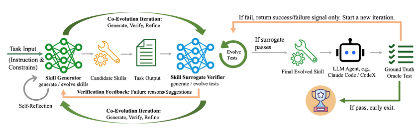

**核心组件——Generator + Verifier 双子星**：

* **Skill Generator**：从执行轨迹里提炼候选 Skill。除了写出 Skill 本身（描述 + 步骤），还要**同步生成对应的单元测试**（输入样例、期望输出、验证逻辑）。

* **Skill Surrogate Verifier**：在一个**隔离的 sandbox 环境**里跑 Generator 写的 Skill 与单元测试，返回结构化验证反馈（不是简单的 pass/fail，而是带"失败原因"和"建议修改方向"的自然语言反馈）。

* **Co-Evolution Iteration（共进化迭代）**：Skill 与 Test **同时进化**——这跟传统软件开发里"先写测试再写代码"的 TDD 有点像。如果 Skill 多次都过不了 Test，可能是 Test 本身写得不合理；反过来如果 Test 太宽松导致烂 Skill 也进库了，下游评估时就会暴露出来。两者互相牵制，逐步收敛到"高质量 Skill + 高严谨度 Test"的稳态。

**两阶段验证**：

1. **Surrogate 验证（廉价）**：内置的 Verifier 直接给反馈，跑得快、能快速迭代；

2. **Oracle 验证（昂贵但权威）**：通过 Surrogate 的 Skill 还要在真实 LLM Agent（论文中用了 Claude Code / CodeX 等）上跑端到端任务，\*\*只有真的解决了任务才算"进化成功"\*\*。如果 Oracle 测试失败，整条 Skill 直接打回。

**亮点结论——Self-evo 优于 Cross-model Transfer**：

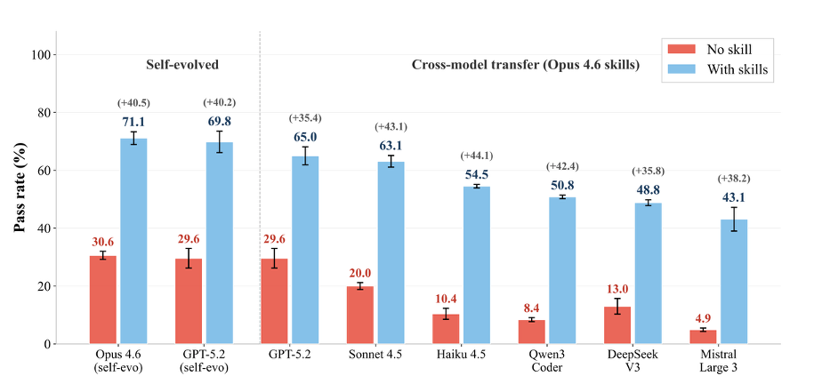

论文做了一组很有意思的对照实验：把强模型（Opus 4.6）self-evo 出来的 Skill 直接 transfer 到弱模型（Haiku 4.5、Qwen3-Coder、DeepSeek V3、Mistral Large 3）上，跟让弱模型自己 self-evo 比较——结果是：

* **self-evo（强模型自己用自己的 Skill）**：Opus 4.6 从 30.6% → 71.1%（+40.5），GPT-5.2 从 29.6% → 69.8%（+40.2）；

* **cross-model transfer**：把 Opus 4.6 的 Skill 给到弱模型，提升从 +35.4 到 +44.1 不等，但**绝对值都明显低于让模型自己 self-evo**（如 Mistral Large 3 才到 43.1%）。

这个观察的含义是：**Skill 跟模型本身的"风格"是耦合的**——强模型生成的 Skill 在强模型自己上效果最好；强迁到弱模型上，弱模型未必能完整地"读懂并执行"那些精巧的步骤。这点对工程界的启示很大：与其花大钱让 GPT-5 / Claude 4.6 给你的产品蒸馏 Skill，不如让产品自己用的小模型来 self-evo——前者贵且效果未必更好。

>
>
> PS：虽然有"信号"，但实际上不涉及训练，仅仅是驳回 Generator 创建的 Skill。
>
>
>
> 评论：CoEvoSkills 的"测试驱动 Skill 进化"思路在第一类里独树一帜，本质上是把 Verifier 当成 "便宜的 reward model" 用——这跟第二类工作里训练 Curator 的逻辑已经很接近了，只差最后一步：把 Verifier 也训起来。
>
>

### 2.5 SE-Agent（arXiv: 2508.02085） ###

**TLDR**：与其反复"自我反思"在同一条轨迹上小修小补，不如一次跑出多条轨迹，**让它们之间互相借鉴、互相打磨**——SE-Agent 把 Agent 自进化从"单线程深度修补"切到了"多线程横向融合"。

SE-Agent 来自 OPPO 的 OpenSearch-AGI 团队和复旦大学等机构，被收录于 NeurIPS 2025。它瞄准的是前面所有 self-refine / ReAct 类工作的共同短板——**单轨迹反思的视野太窄**。当一条轨迹整体走偏的时候（例如一开始就选错了策略），无论怎么 reflection 都救不回来；只有跳出当前轨迹，从多条不同策略的轨迹里学习，才能突破"局部最优"。

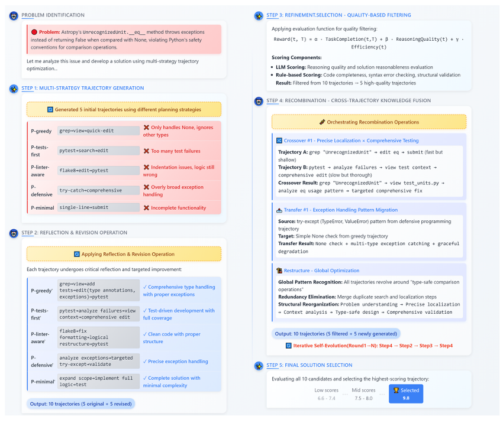

**完整五阶段流程**：

1. **多策略轨迹生成（Multi-Strategy Generation）**：用不同的"性格"采样 N 条轨迹。论文里给了 5 种典型策略——`P-greedy`（贪心快出）、`P-tests-first`（先写测试）、`P-linter-aware`（关注代码风格）、`P-defensive`（防御式编程）、`P-minimal`（最小可行）。同一道题，每种策略得到的轨迹完全不同，犯的错也不同。

2. **反思修订（Revision）**：对每条轨迹独立做一遍传统 self-refine——找到执行偏差点，针对性修正。这一步是"纵向"的（深耕单条轨迹）。

3. **质量过滤（Quality-based Filtering）**：用一个综合评分函数 `Reward(t,T) = α·TaskCompletion(t) + β·ReasoningQuality(t) + γ·Efficiency(t)` 给每条轨迹打分，把候选数从 10 条砍到 5 条。这避免了下一步重组时被低质量轨迹"污染"。

4. **跨轨迹重组（Recombination）⭐核心创新**：这一步是 SE-Agent 区别于所有 self-refine 工作的关键。它对剩下的 5 条高分轨迹做两类操作：

* **Crossover（交叉）**：把"轨迹 A 在步骤 5 的精确定位"嫁接到"轨迹 B 的全面测试覆盖"上，合成出一条原本任何单条策略都达不到的混合轨迹；

* **Transfer（迁移）**：把"防御式策略里学到的 try-except 异常处理"迁移到"贪心策略里缺失异常处理"的位置；

* **Restructure（重构）**：识别多条轨迹共有的全局模式（如"所有轨迹都漏掉了 type-safe 比较"），统一抽象后做一次系统级重写。

1. **最终方案选取（Final Solution Selection）**：从 10 个候选（5 原始 + 5 重组）中选最高分的作为输出。整个流程可以**迭代多轮**（论文里给的 N=4 时已经收敛），每一轮的结果会再喂给下一轮做新的多策略生成。

**关键观察——横向 vs 纵向**：

它定义了三种轨迹层操作（与单条轨迹的 self-refine 形成对照）：

* **修订（纵向）**：找出错误步骤并纠正——这是传统 self-refine 在做的事；

* **重组（横向）**：跨轨迹借用成功的子片段——这是 SE-Agent 的真正创新；

* **精炼（横纵融合）**：在重组后的轨迹上再做一轮纵向打磨。

跟其他工作的关键区别是**总结的方向不同**：其他第一类工作几乎全是**纵向总结**（基于单条历史轨迹/对话），SE-Agent 是**横向总结**（基于多次采样的多条轨迹）。这个"横向 vs 纵向"的概念会贯穿全文——它是后面我们讨论"研究空白"时的一个重要锚点。

**评估**：

* 主战场是 **SWE-Bench Verified**（GitHub 真实代码修复任务）。SE-Agent 让多个底层 LLM 都拿到了显著提升，最高一档实现了 **+55% 相对改善**——在这个领域属于很扎实的提升。

* 跟 Claude Code 等工业级 Coding Agent 也做了对比，验证了"轨迹级进化"是一个**与底层模型选择正交**的优化维度。

>
>
> 评论：SE-Agent 是第一类里思路最"野"的——它没有 Skill 库这种长期记忆机制，但用"一次性多采样 + 跨轨迹融合"的办法做到了类似的效果。某种意义上它跟第二类的 SAGE（Sequential Rollout）是**镜像关系**：SE-Agent 是横向**采**，SAGE 是横向**用**；前者不训模型，后者用 RL 让模型学会自己横向沉淀。
>
>

### 2.6 第一类总结：还是要训练数据的 ###

写到这里，其实第一类工作有几个统一的特征值得提一下：

### 核心点 1. 看似不训练，其实仍要训练数据

不管是人为交互提供反馈，还是训练集提供反馈，本质都是训练数据，没有真的做到"零数据"。

### 核心点 2. 核心是"存下经验/Skill"

这一类工作的灵魂在于把交互的副产物沉淀下来，做成可检索的资产。

### 核心点 3. 总结这一步，被严重低估

几乎所有工作都默契地把 Skill 总结这一步交给了"冻结的 base 或独立的 LLM"——按理说这是整条 pipeline 最关键的环节，但**针对总结去优化的工作几乎没有**。这是一个值得深挖的空白。

### 核心点 4. 横向 vs 纵向总结

* **纵向总结**（其他工作）：根据历史对话/单条轨迹总结；

* **横向总结**（SE-Agent）：根据多次采样的多条轨迹总结。

二者都是"存 skill"的不同侧面。

---

## 03 第二类：基于 RL 的训练型自进化（这是重点）

**特征**：通过 RL 训练直接更新模型权重，让模型从根本上变强。这一类是当前学术界与工业界的主流方向，本报告的重点也在这里。

### 3.1 EvolveR（arXiv: 2510.16079） ###

**TLDR**：算是这一类的基础型，分两阶段。

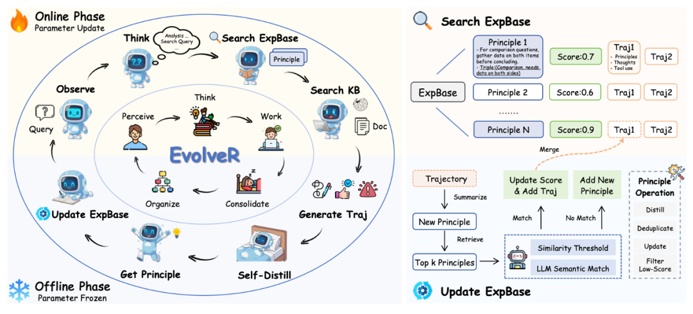

* **离线阶段**：Agent 跑完一批任务后，对所有轨迹做提炼，把具体的交互步骤抽象成更通用的"策略原则"，存入原则库（策略原则可以视作一种 Skill）。

* **在线阶段**：Agent 在新任务里实时检索这些原则，指导自己的行动，同时又产生新轨迹反哺下一轮蒸馏训练。

**Reward 设计**：最终结果 + 格式 reward **评估**：Natural Questions、HotpotQA、TriviaQA、PopQA

>
>
> PS：看起来很像"RL by talking"，但是仍然要靠标注数据集 Ground Truth 去训练的。也就是 talking 的数据只用来蒸馏经验/skill，**不用来当训练标签**。
>
>

### 3.2 SAGE（arXiv: 2512.17102） ###

**TLDR**：提出 **Sequential Rollout** —— RL rollout 时序列化地跑一系列相似任务，后序任务训练时就可以使用前序生成的 skill。

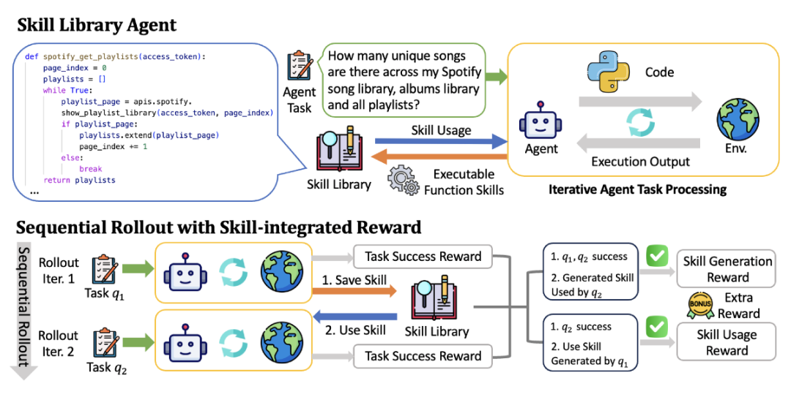

这个思路很巧妙：每次 rollout 不是跑一个任务，而是让 Agent 依次跑一串相似的任务。跑早期任务时积累下来的技能，在同一个 rollout 里的后续任务里就能直接用。这意味着在训练过程中，\*\*模型就被迫学会"生成技能"和"复用技能"\*\*，不只是会完成任务。

除了任务完成的结果奖励，SAGE 还设计了 **Skill-integrated Reward**——额外的信号专门激励技能的生成和调用。评估数据集是 AppWorld（APP 交互数据集）。

### 3.3 SkillRL（arXiv: 2602.08234）⭐ ###

来到本文重点关注的四篇工作之一。

**核心主张**：用强模型（o3）蒸馏 Skill，再通过 RL 训练弱模型学会使用，并递归进化技能库。

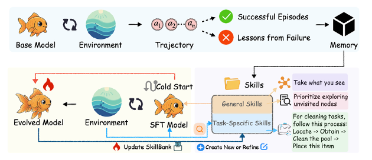

**统一三角色梳理**：

|     角色      |                               配置                               |
|-------------|----------------------------------------------------------------|
|   训练题目来源    |官方数据集训练集：ALFWorld（7,500 条 SFT）、WebShop（2,400 条 SFT）、7 个搜索 QA 数据集|
|     出题者     |                         无独立出题者，直接使用数据集                         |
|   **解题者**   |**Qwen2.5-7B-Instruct ✅ 训练**<br/><br/>（Cold-start SFT → GRPO RL）|
|**Skill 总结者**|                      **OpenAI o3 ❌ 不训练**                       |

**Skill 总结机制**：

* 成功轨迹 → 提取关键决策点与可迁移模式

* 失败轨迹 → 合成失败教训（失败点 + 错误推理 + 应对策略）

* 压缩比：10–20×

**总体流程**：解题者交互 → 轨迹交给总结者总结 skill → 下一轮训练时使用。

**主要实验结果**：

|     基准      |SkillRL|GRPO 基线|  提升   |
|-------------|-------|-------|-------|
|  ALFWorld   | 89.9% | 77.6% |\+12.3%|
| WebShop SR  | 72.7% | 66.1% |\+6.6% |
|Search-QA avg| 47.1% |\~38.5%|\+8.6% |

Skill 库增长：55 → 100 条（通用 12→20，任务专属 43→80）。

**核心设计哲学**：强模型提炼知识，弱模型通过 RL 学会使用知识。

>
>
> 评论：我们倾向于把这种归类于**蒸馏**，而非真正的**进化**。
>
>

### 3.4 SKILL0（arXiv: 2604.02268）⭐ ###

**核心主张**：将 Skill 从推理时的"外挂上下文"内化到模型参数，实现零样本执行（每步 \< 0.5K tokens）。

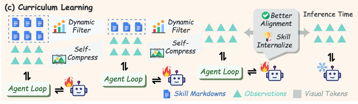

|     角色      |                            配置                            |
|-------------|----------------------------------------------------------|
|   训练题目来源    |直接继承 SkillRL 的 SkillBank（ALFWorld WebShop Search-QA 官方训练集）|
|     出题者     |                            无                             |
|   **解题者**   |  **Qwen2.5-VL-3B/7B-Instruct ✅ 训练**<br/><br/>（三阶段渐进课程）   |
|**Skill 总结者**|                  继承 SkillRL 的 o3，❌ 不训练                   |

**三阶段渐进课程**：

|阶段|Skill 数量|目标|
|-------|--------|----|
|Stage 1|6 条|学会调用|
|Stage 2|3 条|减少依赖|
|Stage 3|0 条|完全内化|

**核心设计哲学**：从"使用技能"到"内化技能"的范式转变 —— 消除推理时的检索成本、Token 开销和噪声，把知识真正固化进模型权重。

\> SKILL0 不关心 Skill 从哪里来，只关心如何内化。它本质上是 SkillRL 的"下游消费者"。

### 3.5 SkillOS（arXiv: 2605.06614）⭐⭐ ###

这是四篇里我们认为**最有启发性**的一篇。

**核心主张**：训练一个专门的 **Curator**，通过 RL 学会如何**增 改 删 SkillRepo**，而不是直接学如何使用 Skill。

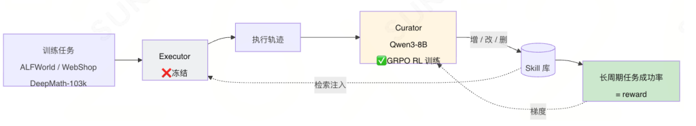

|     角色      |                                                                配置                                                                 |
|-------------|-----------------------------------------------------------------------------------------------------------------------------------|
|   训练题目来源    |       Agentic（ALFWorld、WebShop 官方训练集）+ 推理（DeepMath-103k 随机采样 33,000 条）；两步预处理：Gemini-2.5-Pro 标注属性标签 → 按相似度分组（group\_size=8）        |
|   **出题者**   |                                        **Gemini-2.5-Pro ❌ 不训练**<br/><br/>，仅离线标注每个任务的技能相关属性                                        |
|   **解题者**   |**Executor ❌ 冻结，不训练**<br/><br/>；训练时用 Qwen3-8B；测试时用 Qwen3-8B 32B Gemini-2.5-Pro / Gemini-3.1-Flash-Lite；ReAct（Agentic 任务）+ CoT（推理任务）|
|**Skill 总结者**|                                                 **Qwen3-8B Curator ✅ GRPO RL 训练**                                                 |

**核心设计哲学**："学会如何**管理**技能，而不是学会如何**使用**技能" —— Executor 冻结，只训练 Curator，通过长周期间接奖励信号学习 Skill 的增删改策略。

**这篇工作给出了两个对后续研究极其重要的结论**：

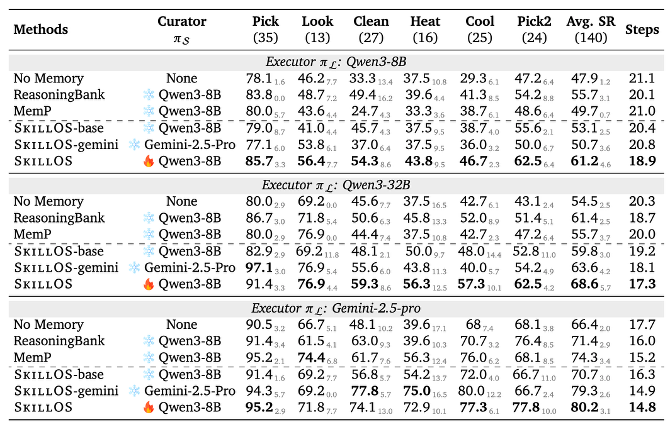
>
>
> **结论 1：训练过的小模型总结者 \> 冻结的大模型总结者**
>
>
>
> 在 SkillOS 的实验里，RL 训练过的 Qwen3-8B 作为 Curator，效果**超过**直接用冻结的 Gemini-2.5-Pro 作为 Curator。这说明"如何管理 skill"本身是一项**可被训练**的能力，而且小模型经过专门训练后能压过大模型直接使用。
>
>

>
>
> **结论 2：不动解题者，性能也能涨**
>
>
>
> 在 ALFWorld 上，仅训练 Curator、解题者完全冻结的情况下，整体性能仍能取得长足进步。这意味着"换 Curator"是一条比"换 Executor"更轻量的优化路径。
>
>

### 3.6 AgentEvolver（arXiv: 2511.10395）⭐ ###

**核心主张**：完全自主的三环自演化框架 —— **自出题、自解题、自总结**经验，全链路无需人工标注。

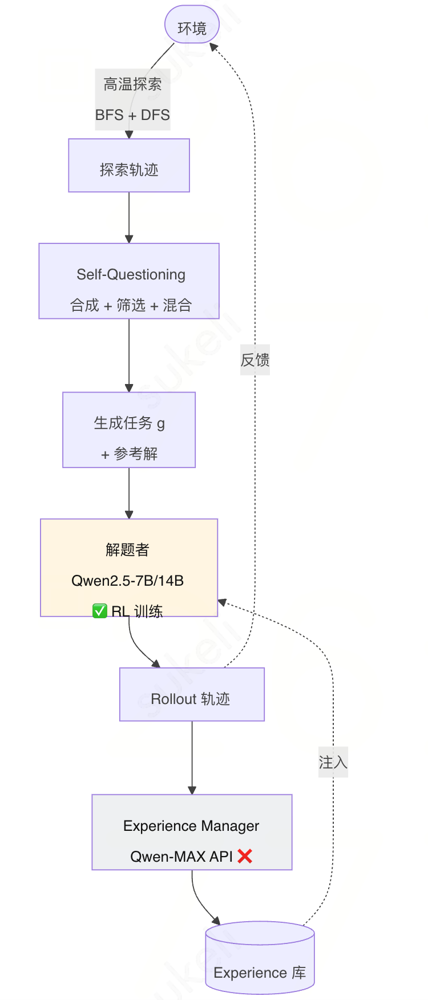

|        角色        |                                            配置                                             |
|------------------|-------------------------------------------------------------------------------------------|
|    **训练题目来源**    |                        **环境探索生成（Self-Questioning）**<br/><br/>，全自动                         |
|     **出题者**      |                             **LLM 自身（与解题者同一模型）**<br/><br/> ✅                              |
|     **解题者**      |                             **Qwen2.5-7B/14B-Instruct ✅ 训练**                              |
|**Experience 总结者**|**Experience Manager ❌ 不训练**<br/><br/>（论文中没明说是什么模型，扒代码发现是调 Qwen-MAX API；本质上是阿里 Reme 记忆管理机制）|

**Self-Questioning 四步流程**：

## 1. **探索**：高温 LLM 广度优先（N\_b 步）+ 深度优先探索环境

## 2. **合成**：从探索轨迹蒸馏 + 用户偏好约束 → 生成任务 g 与参考解

## 3. **筛选**：词法去重 + 语义相似度 + 可行性验证

## 4. **混合（可选）**

**特点**：出题与解题使用同一个 Qwen2.5-7B/14B，RL 训练后形成**出题质量与解题能力的双重提升**。

### 3.7 第二类总结 ###

第二类工作走得比第一类更远——把经验从"外挂"变成了"权重"。但仔细看仍能拎出几条共性：

**核心点 1. 仍然依赖训练集反馈**（除 AgentEvolver 外） **核心点 2. 核心是 RL rollout 时继承/更新之前的 skill****核心点 3. 不算严格意义的"RL by talking"** —— 因为反馈仍来自任务结果或人工标签，而不是交互对话本身

---

## 04 第三类：0 数据自学型

**特征**：完全不要人工标注的数据，靠 Agent 之间互相出题/解题闭环。

这一类的精神更激进：连数据集都不要，Agent 自己出题自己考自己。

### 4.1 Agent0（arXiv: 2511.16043） ###

**TLDR**：学习工具使用，一个 Agent 负责出题，一个 Agent 负责解题。

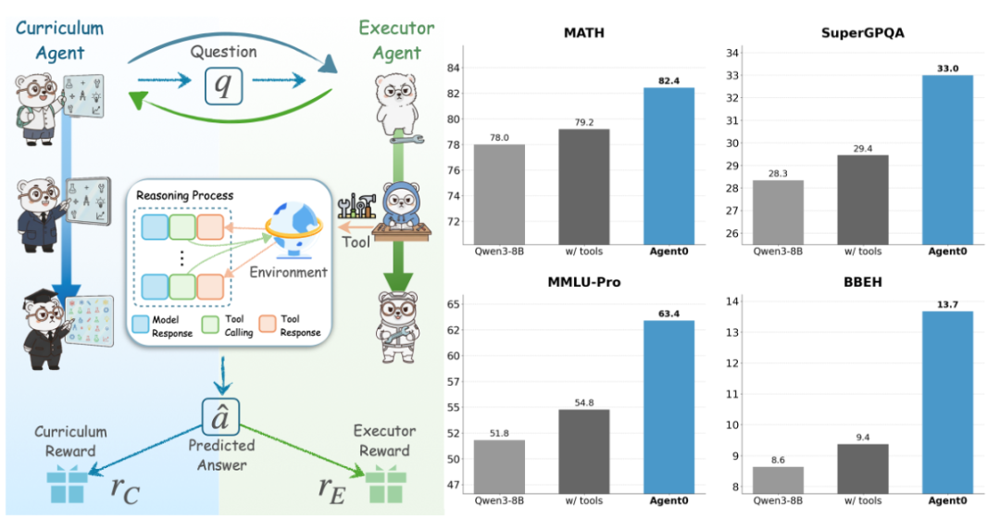

**组件**：

* Curriculum Agent (RL)：负责出题；reward = 答题 Agent 的不确定性 + 工具使用频率

* Executor Agent (RL)：负责解题；reward = 解题成功率

**流程**：

## 1. 出题 Agent 先 RL 训练（答题 Agent 冻住作为 reward model）

## 2. 出题 Agent 冻住，给答题 Agent 出题做 RL 训练

>
>
> PS：在解题成功率 reward 上有一个比较大的问题——题目的答案是 Curriculum Agent 自己**多采样投票**选出来的 sliver answer。
>
>

**评估集**：数学类为主（GSM8K、AIME 等）。

### 4.2 Tool-R0（arXiv: 2602.21320） ###

**TLDR**：类似 Agent0，但做的是 general tool 而不是纯数学。

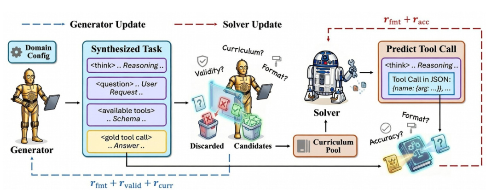

**Reward 设计**：

* Generator Agent：格式 reward + 合法性 reward（不能有幻觉 tool）+ 难度 reward（不能太难太简单）

* Solver Agent：格式 reward + 准确性 reward

>
>
> PS：答案仍然是 Generator Agent 自己生成的 sliver answer。
>
>

**评估集**：ToolAlpaca、SealTool、NexusRaven。

### 4.3 Absolute Zero（arXiv: 2505.03335） ###

**TLDR**：单个模型同时扮演出题人和解题人，用代码执行器作为唯一的验证来源，完全不碰任何外部数据。

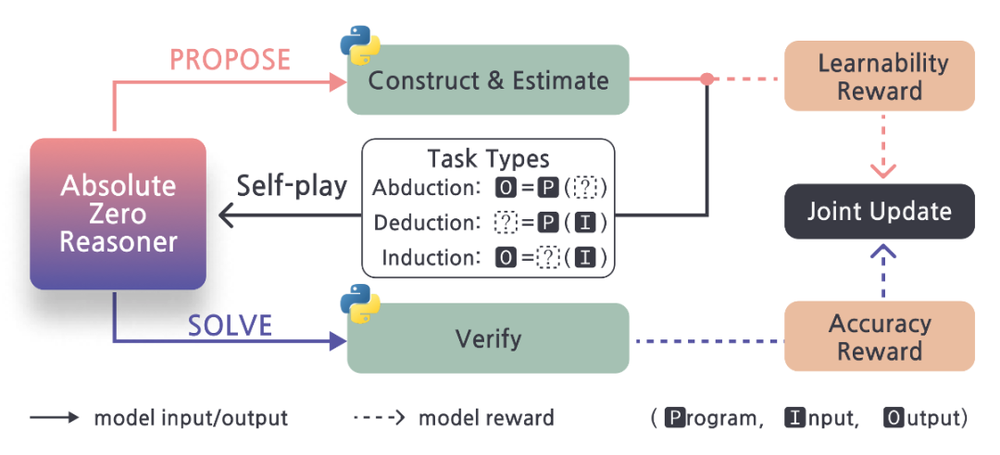

**组件**：

* 出题 Agent：reward = 1 − 答题 Agent 成功率；但成功率为 0 时 reward 也为 0（避免出太难的题）

* 答题 Agent：reward = 解题成功率

**出题流程**：题目为 [输入, 代码, 输出] 三元组，随机删除一个让答题 Agent 猜测，**以代码执行器为最终判断标准**。这是一个非常聪明的设计——它把"判分"这件事完全外包给了一个绝对客观的执行环境。

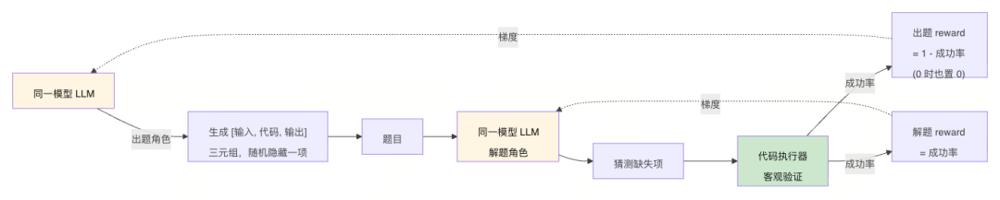

**评估集**：

* 代码：HumanEval、MBPP、LCB

* 数学：AIME24、AIME25、AMC、MATH-500、Minerva、Olympiad

### 4.4 第三类总结：真·不需要训练数据 ###

**通用流程**：

```

出题 Agent 训练 → 出题构造数据集 → 解题 Agent 训练 → 出题 Agent 训练 …

```

### 核心点 1. 全靠出题的 Agent 自己

**核心点 2. 准确率判断大多靠对照出题 Agent 自己给出的答案**——这是个隐患，sliver answer 的可靠性需要打问号

**核心点 3. 最好要有自动化的判断标准**——比如 Absolute Zero 用的代码执行器

**核心点 4. 出题难度很重要**——太难学不懂，太简单学不到，这个 reward shaping 是核心难点

**核心点 5. 评估很混乱**——只有数学类的 benchmark 勉强出现了多次，其余几乎完全没有重叠，可比性差

---

## 05 横向对比：四篇代表工作的"三角色"视角

第二类里 SkillRL → SKILL0 → SkillOS → AgentEvolver 这四篇我们想专门拎出来横向对比，因为它们最能反映长程 Agent 自进化的范式演进。

### 5.1 核心对比表 ###

|     论文     | 训练题目来源 |          出题者          |      解题者（训练？）       |Skill/Experience 总结者（训练？）|
|------------|--------|-----------------------|---------------------|-------------------------|
|  SkillRL   |官方数据集训练集|           —           |   Qwen2.5-7B ✅ 训练   |       OpenAI o3 ❌       |
|   SKILL0   |官方数据集训练集|           —           |Qwen2.5-VL-3B/7B ✅ 训练|     OpenAI o3（继承）❌      |
|  SkillOS   |官方数据集训练集|Gemini-2.5-Pro（仅离线分组，❌）|    Executor 冻结 ❌    | **Qwen3-8B Curator ✅**  |
|AgentEvolver| 完全自动生成 |   LLM 自身（与解题者同一模型）    |  Qwen2.5-7B/14B ✅   |     Qwen-MAX API ❌      |

### 5.2 一行式速记 ###

```

SkillRL：       [训练集❌] [解题者 ✅] [总结者 ❌]SKILL0：        [训练集❌] [解题者 ✅] [总结者 ❌]SkillOS：       [训练集❌] [解题者 ❌] [总结者 ✅]   ← 唯一训练总结者的工作AgentEvolver：  [出题者✅] [解题者 ✅] [总结者 ❌]

```

### 5.3 强模型依赖程度 ###

|     方法     |               依赖的强模型               |        用途        |
|------------|------------------------------------|------------------|
|  SkillRL   |             OpenAI o3              |   Skill 总结（核心）   |
|   SKILL0   |           OpenAI o3（继承）            |   Skill 总结（核心）   |
|  SkillOS   |Gemini-2.5-Pro（辅助）+ Qwen3-32B（Judge）|   标注分组 + 质量评估    |
|AgentEvolver|              Qwen-MAX              |Experience 提取 + 总结|

可以看到：**总结这一步，几乎所有人都默契地外包给了大模型 / 闭源 API**，这跟我们前面在第一类总结里观察到的现象高度吻合。

### 5.4 数据依赖程度 ###

```

高依赖外部数据 ←─────────────────────────────────────────→ 完全自主       │                                                      │   SkillRL              SKILL0           SkillOS         AgentEvolver（官方数据集）        （复用 SkillRL）   （官方+分组）    （完全自生成）

```

### 5.5 范式演进脉络 ###

```

SkillRL (2602.08234)  强模型提炼知识 → 弱模型 RL 学会使用 → 递归演化技能库       ↓SKILL0 (2604.02268)  同样的技能库 → 渐进撤回 → 内化进参数 → 零样本执行（无检索开销）       ↓SkillOS (2605.06614)  冻结执行者 → 训练 Curator → 学会如何管理技能（增/改/删）       ↓AgentEvolver (2511.10395)  全链路自主 → 自出题 + 自解题 + 自总结 → 步骤级信用分配

```

---

## 06 关键洞察：被忽视的"总结者"

### 6.1 总结者，是被严重低估的关键模块 ###

把一三两类 + 四篇代表工作的"是否训练总结者"列在一起：

|     工作     |      Skill 总结者是否训练       |
|------------|--------------------------|
| AutoSkill  |            ❌             |
|  EvoSkill  |❌（Claude Code w/ Opus 4.5）|
|  MemSkill  |            ❌             |
|CoEvoSkills |      ❌（Claude Code）      |
|  SE-Agent  |            ❌             |
|  EvolveR   |        ❌（Qwen2.5）        |
|    SAGE    |✅（序列 rollout 中带 reward 总结）|
|  SkillRL   |       ❌（OpenAI o3）       |
|   SKILL0   |          ❌（继承）           |
|**SkillOS** |      **✅（唯一专门训练）**       |
|AgentEvolver|     ❌（Qwen-MAX API）      |

可以看到，**针对总结者本身做训练的工作屈指可数**——SAGE 算半个（在 RL 过程中有 skill reward），SkillOS 才是真正完整地把 Curator 当成主训练对象。

而 SkillOS 给出的实验结论——**训练后的 8B Curator 优于冻结的 Gemini-2.5-Pro Curator**——恰好印证了这件事的价值。

### 6.2 自主性 × 总结质量的二维空间 ###

把四篇代表性工作放到两个维度上看：

```

        总结者训练           ▲   SkillOS │           │           │  ─────────┼──────────► 题目自动生成           │SkillRL/   │ AgentEvolverSKILL0     │

```

**右上方那个空白象限**——既自动生成题目、又训练总结者——目前**没有一篇工作覆盖**。这是当前最显眼的研究空白。

### 6.3 横向 vs 纵向总结的融合空间 ###

第一类工作里的 SE-Agent 是横向（多次采样）总结，其他都是纵向（历史对话）总结。这两者在第二类工作里基本没有融合——SkillRL/SKILL0/SkillOS 仍以纵向为主。**横向 + 纵向的融合**会不会带来更稳健的 Skill 库？是一个开放问题。

---

## 07 写在最后

这一年多自进化 Agent 的研究节奏其实非常快，从"存技能"到"训技能"、从"依赖人工数据"到"零数据自训"，几乎每个月都能看到新工作冒出来。但仔细啃完之后会发现，**还有大片研究空白没人去碰**——尤其是"总结者本身的训练"和"完全自主 + 训总结者"这条交叉路径。

回过头看，这条赛道的本质问题其实只有一个：

>
>
> **如何让 Agent 在没有人工干预的情况下，把交互的副产物转化为下一次更强的能力？**
>
>

无论是把经验存进文件、训进权重，还是让 Agent 之间互相出题，所有路径都在回答这一个问题的不同侧面。

## 附录 A：论文索引

|     简称      |   arXiv    |类别 |
|-------------|------------|---|
|  AutoSkill  | 2603.01145 |第一类|
|  EvoSkill   | 2603.02766 |第一类|
|  MemSkill   | 2602.02474 |第一类|
| CoEvoSkills |2604.01687v2|第一类|
|  SE-Agent   | 2508.02085 |第一类|
|   EvolveR   | 2510.16079 |第二类|
|    SAGE     | 2512.17102 |第二类|
|   SkillRL   | 2602.08234 |第二类|
|   SKILL0    | 2604.02268 |第二类|
|   SkillOS   | 2605.06614 |第二类|
|AgentEvolver | 2511.10395 |第二类|
|   Agent0    | 2511.16043 |第三类|
|   Tool-R0   | 2602.21320 |第三类|
|Absolute Zero| 2505.03335 |第三类|

## 附录 B：评估数据集索引

|             数据集              |         使用工作         |    类型    |
|------------------------------|----------------------|----------|
|         WildChat-1M          |      AutoSkill       |   用户对话   |
|           OfficeQA           |       EvoSkill       |   办公图表   |
|     LoCoMo / LongMemEval     |       MemSkill       |  长程对话记忆  |
|          SkillBench          |     CoEvoSkills      |    技能    |
|           ALFWorld           |SkillRL SKILL0 SkillOS|具身/Agentic|
|           WebShop            |SkillRL SKILL0 SkillOS|   网页购物   |
|          Search-QA           |   SkillRL / SKILL0   |   检索问答   |
|           AppWorld           |         SAGE         |  APP 交互  |
| NQ HotpotQA TriviaQA / PopQA |       EvolveR        |   检索问答   |
|        DeepMath-103k         |       SkillOS        |   数学推理   |
|         GSM8K / AIME         |        Agent0        |    数学    |
|ToolAlpaca SealTool NexusRaven|       Tool-R0        |   工具使用   |
|      HumanEval MBPP LCB      |    Absolute Zero     |    代码    |

####

####

#### 

####

## 腾讯PCG大数据平台部

## ⭐️⭐️ 新一代全链路数据AI助手——Dola ⭐️⭐️

Dola是一款基于Agentic AI能力开发的全链路数据助手：用户只需要引入个人的数据表，就能得到一枚专属的AI分析师

它不仅能够完成日常的取数、跑数等基础任务，还能自主规划并执行复杂场景的数据分析，例如异动归因、画像对比分析、股票基金回测、房价预测等。Dola可以自行编写SQL、纠正SQL错误、执行查询、使用Python进行数据处理与可视化，并最终生成一份完整的分析报告。全程无需编写一行代码，只需通过自然语言对话，你就能拥有一个全自动工作的“数据小黑工”。

这里以1个股票回测的例子看看dola的效果：

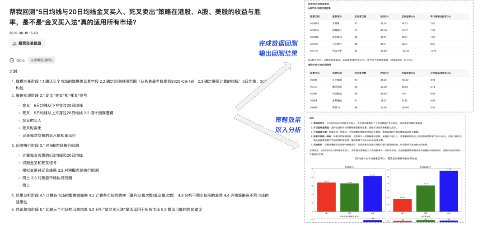

可以看到dola在接收到“金叉买入法回测”这个问题之后，首先能自己生成一个计划，包括了需要进行的数据准备、策略实现、回测实现和结果分析等详细内容。

在按照自己的计划执行完毕后，dola最终产出回测结果，完成可视化并进行深入分析总结，产出一份完整的回测报告。

同时还可以将分析的报告做成一个美观的可视化插画/静态网页/看板，大大增加了报告的可读性：

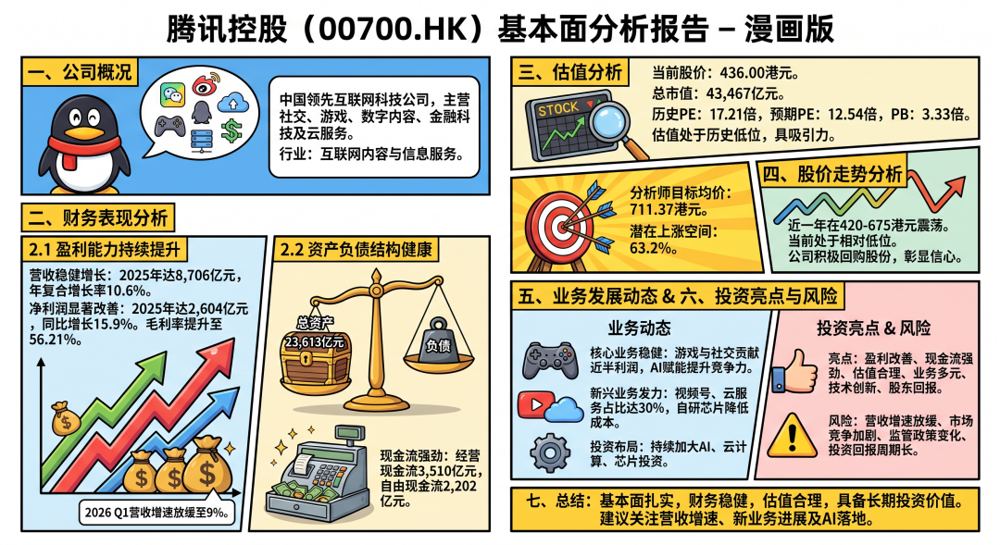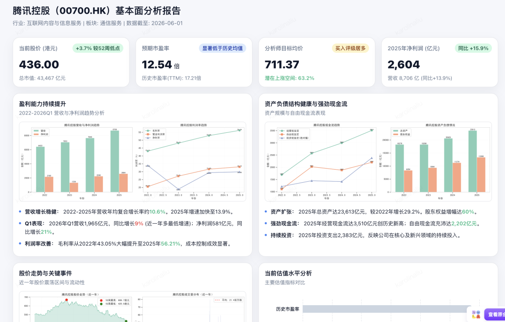（上图左为Dola生成的插画报告，右为静态网页。仅做样例展示参考，不构成分析建议）

这里只是以股票回测这样一个比较复杂的案例场景展开，大家应该可以想象到，在工作场景中，Dola对于日常数据分析工作的提效程度是显而易见的。

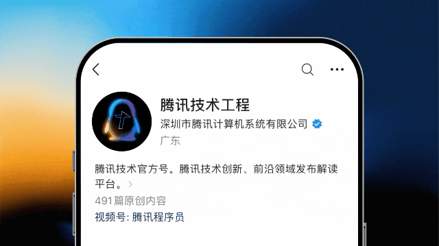


