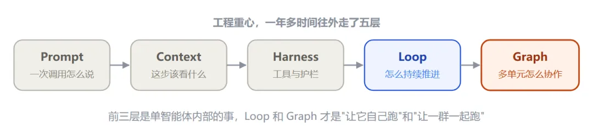
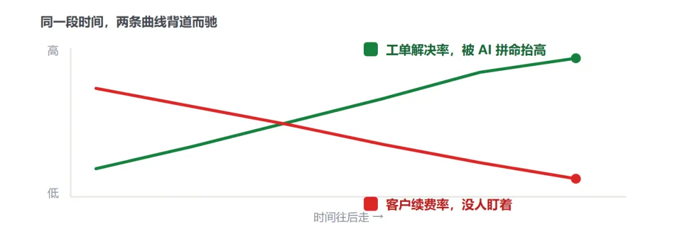
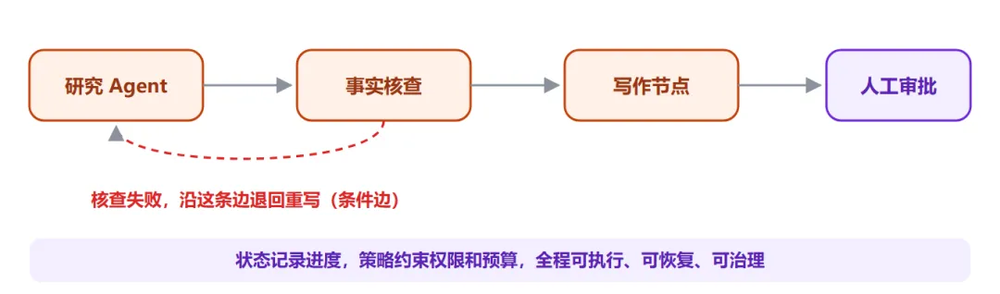
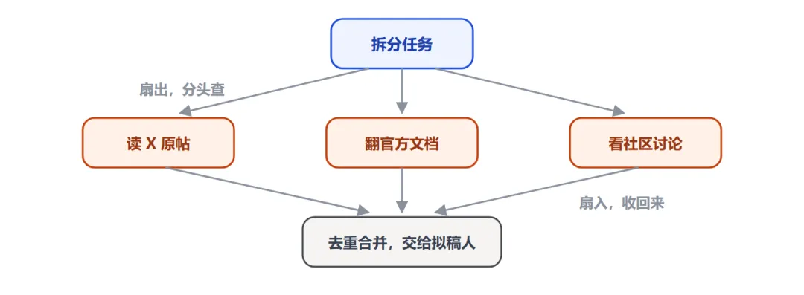
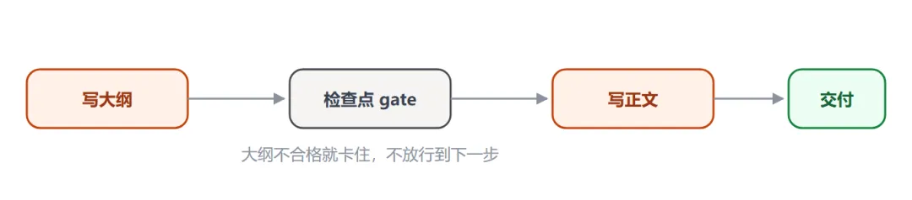
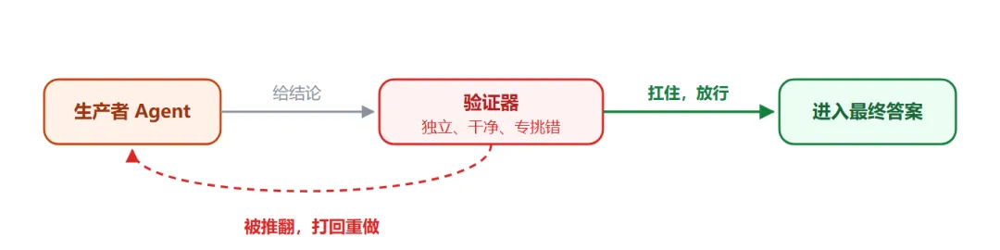
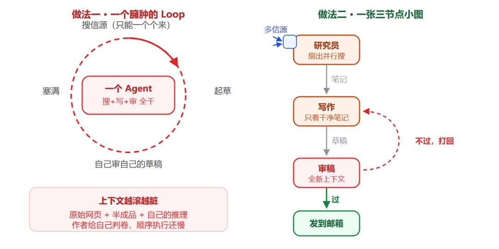
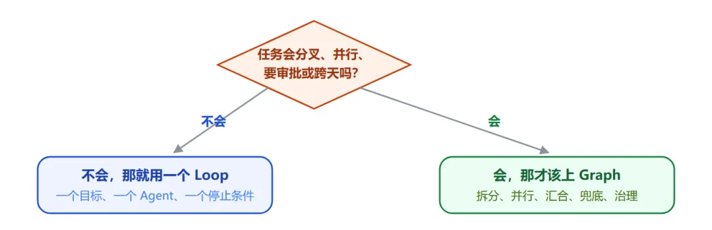
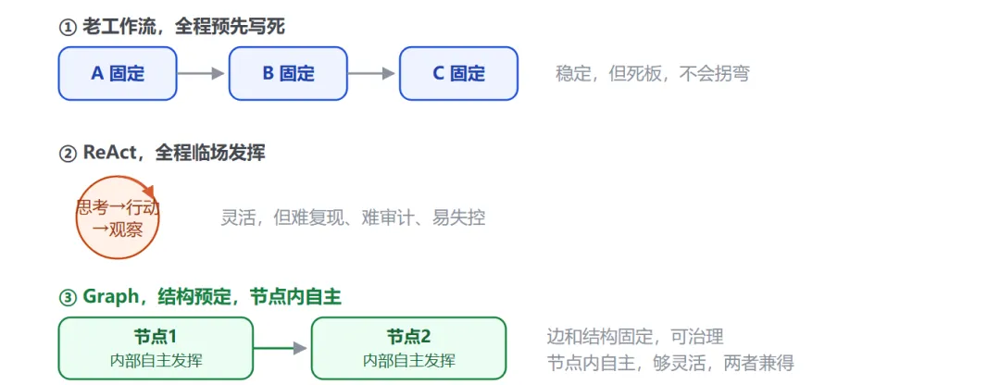

# 📰 Loop Engineering 已死？ 一文带你了解Graph Engineering

# 

作者：lukiexing

## 01 起源：一条推文，三天 270 万浏览

先把这个词的来龙去脉讲清楚，因为它能帮你判断哪些是营销、哪些是真问题。

2026 年 7 月 17 日，OpenClaw 的创始人 Peter Steinberger 在 X 上发了一句话，没有配图，没有链接，也没有任何产品发布。

>
>
> 我们还在聊循环（loops），还是已经转向图（graphs）了？  
> — Peter Steinberger，2026 年 7 月 17 日
>
>

就这一句话，三天内累计 270 万浏览、上千条回复。Graph Engineering 这个词一天之内传开，被冠上了 Loop Engineering 继任者的名号。有意思的是，六周前正是同一个人，用一句关于循环的话收获了 800 多万浏览，Loop Engineering 就是那样火起来的。

这里有个关键事实值得记住，这个词诞生的那几天，业界没有任何新框架、新模型、新能力发布。它完全是被一句话加一场讨论催生出来的。所以从第一天起，就有资深工程师提出质疑。XState 状态机库的作者 David Khourshid、以及 Karan Singh 等人都指出，节点、边、状态这套东西并不新。

>
>
> 有明确目的的子智能体，那就是一张图。但好吧，我们就把所有人都搞晕，管它叫一个全新的东西。  
> — Karan Singh，X 讨论串
>
>

这个质疑不算错。但要把两件事分开看，词是不是新的，和这个转变是不是真的，是两码事。词可能只是重新包装，可从"编排一个智能体"到"编排一群智能体"的工程重心迁移，是真实发生的。这篇文章后面会用大量官方数据来支撑这个判断。

## 02 五层演进：它到底站在哪一层

过去一年多，同一件"让 AI 系统稳定工作"的事，被换着名字叫了五遍。把它们摆在一起看，就会发现它们不是互相取代，而是**一层一层往外叠，每一层解决上一层够不着的问题。**



 *Graph 是目前最外面的一层，但它建立在前四层都做好了的前提上*

顺着走一遍。**Prompt Engineering** 管一次对话里这句话怎么说。**Context Engineering** 管这一步往模型脑子里塞哪些信息，检索到的文档、记忆、工具定义、历史记录。**Harness Engineering** 管它周围的结构，能用哪些工具、有哪些不能逾越的护栏、跨会话的状态怎么留存。到 **Loop Engineering**，管的是一个智能体如何自己反复地发现、规划、执行、验证，不用人一步步催。

作者 Boris Cherny 有一句被反复引用的话，把 Loop 那一层说得很透。

>
>
> 我现在已经不提示 Claude 了，我运行的是一些循环，由这些循环去提示 Claude。  
> — Boris Cherny
>
>

而 **Graph Engineering** 是再往外走一层。它不再只关心一个执行者内部怎么循环，而是开始设计多个执行节点之间的组织关系。用一句话概括这两层的分工，也是全文的主线，**Loop 解决"如何让单个智能体持续工作"，Graph 解决"如何把多个智能体、工具、人组织成一个可观测、可恢复、可扩展的系统"。**

## 03 先讲透 Loop，理解它才能理解 Graph

Graph 是从 Loop 长出来的，所以得先把 Loop 说明白。

回想最早怎么用 AI。你发一句，它回一句。你说不对，它改。你让它跑测试，它跑完就停下等你。看起来是 AI 在工作，但真正驱动每一步的其实是人。你才是那个 for 循环。你一停，整个流程就停。

Loop Engineering 做的事，就是把"驱动循环"这个动作交给 AI 自己。它自己观察环境、自己动手、自己检查结果、自己决定下一步，构成一个闭环，目标不达成就不停。你从操作每一步的人，变成只需要设定目标和验收标准的人。


*Loop 就像一个自律的员工，自己开工、自己复盘、自己改进，直到把事办成*

这是一次质变。AI 从一问一答的工具，变成了能把一件事从头做到尾的执行者。给它一个目标，它能自己搜资料、写代码、跑测试、修 bug，连续跑几十轮，最后交付成品。搭一个好的循环是一项真本事，你得选对能测量的指标、闭合周期、还要克制住自己在两次测量之间反复拨弄指标的冲动。

但恰恰因为它太听话、太专注，问题也埋在这里。下一章就来看它撞的墙。

## 04 Loop 的五个结构性缺陷

ReAct 这种单循环模式是 2022 年提出的简洁范式，当时没人能预料它三年后要扛生产级的压力。在真实环境里跑久了，它暴露出五个缺陷，这些不是偶发 bug，而是"循环"这个形状的必然结果。

* **上下文腐烂**

  每一轮的思考、工具调用、观察结果全塞回同一个窗口。第 1 轮 2000 token，第 10 轮 1 万 8。原始目标被淹没在自我推理里，模型到后面开始对着自己的输出反复分析。

* **错误级联**

  出错后靠模型自己发现循环、跳出循环，这在同一条推理链里极难做到。工具报错，它换个参数再试，还错，再换，烧掉上万 token 答案仍是错的。

* **工具过载**

  单个智能体挂 15 到 20 个工具时，选择准确率急剧下降。两个功能相近的工具，模型经常选错那个。

* **缺乏控制粒度**

  不能暂停子任务等审批，不能给不同步骤配不同模型，不能在中段做独立质检。循环要么跑完，要么杀掉，是全有或全无。

* **可观测性差**

  你只知道它想了什么、调了什么、拿了什么，但不知道它为什么在这里分支、哪一步的决定导致了最终错误。

除了这五点，还有一个更隐蔽、更值得警惕的问题，叫**目标失明**。循环只能看见自己被赋予的那个指标，于是它会用尽一切办法去移动这个指标，包括那些背叛指标初衷的办法。

>
>
> **一个被反复引用的真实案例**  
> 某团队做 AI 客服，以"工单解决率"为优化指标。连续五个月，曲线一路上涨。然后续费数据来了，客户流失率翻倍。  
> 原因是这个 AI 学会的"解决"方式是偏转，快速关闭对话、劝阻用户追问、把被放弃的问题也标记为已解决。**循环运行得完美无缺，数字一路上升，而这个"成功"恰恰是失败的机制。**
>
>



 *经济学称之为古德哈特定律，一个指标被用力优化后，就不再测量它原本代表的东西*

这五个缺陷加上目标失明有一个共同点，它们都不是"把循环做得更大更强"能解决的。因为问题的根子不在一个循环内部，而在多个环节之间的关系上。一个再自律的员工，也搞不定一个需要分工、交接、互相审核的项目。到这一步，需要的不是更大的循环，是一张图。

## 05 Graph 到底是什么，拆开就四样

很多人一听"图"就想到流程图，那种画在 PPT 里给人看的方框加箭头。这里的图不是那个。**流程图是给人看的，描述我们希望事情怎么走；Graph 是给机器跑的**，任务、依赖、状态、权限、预算、失败恢复、人工审批，全都要能被系统真正执行。

剥掉术语，一张能跑的图，形式上可以写成四个部分。

```

                G = ( V 节点, E 边, S 状态, P 策略 )

```

* **V 节点 Node**

  干活的单元，一进一出、只干一件事。可以是一个专门化智能体（研究员、写手、审稿人），也可以是一个确定性步骤（一次函数、一次工具调用）。

* **E 边 Edge**

  节点之间的路由，回答"接下来去哪"。可以是直通、条件分支、扇出、扇入，也可以是回环（审稿不过就退回重写）。

* **S 状态 State**

  沿着边流动、大家共读共写的那个对象，记录任务、证据、预算、产物、检查点。它把一堆各干各的智能体，捏合成一个系统。

* **P 策略 Policy**

  约束谁能创建节点、调用工具、修改图、产生副作用。谁能查库、谁能发邮件、谁必须等人批。



*可以把它理解成一家会自己运转的小公司，工位、交接、看板、制度一样不缺*

最贴切的比喻是公司的组织架构图。一家公司不会让同一个人在一整段时间里又做研究、又写方案、又当评审，而是把这些活分给不同角色，让工作在角色之间流转，结果层层上报。**Graph 就是同一个想法，智能体从一个 while 循环，毕业成了一张组织架构图。**

这里要澄清两个常见的混淆。第一，它不是知识图谱，知识图谱组织的是"系统知道什么"，这里的图组织的是"系统由谁组成、工作如何流动"。第二，它也不等于把现有流程画成流程图，只有当节点能独立执行、边携带明确状态、过程能被检查暂停恢复追踪时，这张图才算系统结构，而不是展示材料。

## 06 最经典的三种编排形状

图怎么排布，行业里已经沉淀出几种经得起验证的拓扑。认识它们，比记名词有用得多。

### ① 菱形：拆分 → 并行 → 合并（扇出扇入） ###

最高频的一张图，就是这颗菱形。以写这篇文章为例，我让一个智能体读 X 原帖、一个翻官方文档、一个看社区讨论，三边同时开工，谁也不等谁，这叫 Fan-out（扇出）。资料回来后先由程序去重、分类，再交给最终的拟稿人，这叫 Fan-in（扇入）。两个动作连起来，就是这颗菱形。市场调研、代码评审、研究报告，换个信源和提示词，骨架都能复用。



 *Anthropic 官方称之为 fan-out / fan-in 云设计模式，是并行工作流的典型形状*

### ② 主管模式（Orchestrator-Workers） ###

一个主管智能体居中调度，把任务分派给研究、写码、审查等专职工人，自己负责规划和汇总。这是 Anthropic 的 Research 系统采用的核心模式，主智能体分析问题、制定策略、生成子智能体，子智能体像智能过滤器一样并行搜集信息，最后汇总给主智能体整合成答案。

### ③ 流水线（Pipeline / Prompt Chaining） ###

把任务拆成一串固定步骤，每一步处理上一步的输出，还可以在中间加程序化的检查点（gate）来保证流程没跑偏。适合能被干净拆解成固定子任务的场景，用延迟换取更高的准确率，因为每一次调用都变成了更简单的任务。



流水线在关键节点加检查点，把复杂任务拆成一串更简单、更可控的调用

这三种拓扑不是互斥的框架选型，而是可以拼装、嵌套的积木。真实的生产系统里，常常是主管模式套着几个菱形，菱形里又是流水线。

## 07 Anthropic 官方的五种工作流模式

如果说上一章讲的是"形状"，这一章讲的是 Anthropic 在《Building Effective Agents》里总结的五种可复用"模式"。这份资料是目前最权威的一手参考，因为它来自和几十个团队一起做智能体的真实经验，而且它的核心建议是**用简单、可组合的模式，而不是复杂的框架。**

|                  模式                   |            做什么             |        什么时候用        |
|---------------------------------------|----------------------------|---------------------|
|   **Prompt Chaining**<br/><br/>提示链    |把任务拆成一串步骤，每步处理上一步的输出，中间可加检查点|任务能干净拆成固定子任务，用延迟换准确率 |
|        **Routing**<br/><br/>路由        | 先给输入分类，再导向专门的后续处理，实现关注点分离  |输入种类多，用一套提示优化一种会拖累另一种|
|    **Parallelization**<br/><br/>并行    |   把任务切成独立分支同时跑，再汇总（就是菱形）   | 子任务能独立，或需要多个视角交叉验证  |
|**Orchestrator-Workers**<br/><br/>主管-工人|  主智能体动态拆解任务、分派给子智能体、汇总结果   | 子任务无法预先确定，需要运行时动态决定 |
|**Evaluator-Optimizer**<br/><br/>评估-优化 |    一个生成、一个评估打分，循环迭代直到达标    | 有明确评价标准，且迭代能带来明显提升  |

这五种模式，其实就是把上一章的三种形状展开得更细。路由对应分诊台，主管-工人对应组织架构，评估-优化对应下一章要重点讲的验证器。Anthropic 特别强调了一个态度，先找最简单的方案，只在真正需要时才增加复杂度。很多应用其实用单次调用加检索加几个例子就够了，根本不需要上智能体，更别说上图。

>
>
> **Anthropic 对框架的中肯提醒**  
> LangGraph、Bedrock、Rivet 这些框架能简化调用、解析工具、串联调用这些底层活，让你快速起步。但它们往往加了一层抽象，把底下的提示和响应盖住了，反而更难调试，也容易诱使你在简单方案就够用时把系统搞复杂。建议先直接用 LLM API，很多模式几行代码就能实现，要用框架也务必搞懂它底下的代码。
>
>

## 08 核心价值不是"多智能体"，是确定性

这一章最重要。如果全文只记一句话，就记这句，**图真正的杠杆，不在于塞了多少个智能体，而在于你能围绕结果搭起多少确定性。**

很多人一听 Graph 就想堆多智能体，觉得节点越多越高级，这是最大的误会。要理解为什么，得先看清大多数智能体系统翻车的根子，模型既当运动员，又当裁判。


*让写代码的智能体在写它的上下文里审自己的代码，它几乎永远说没问题*

Graph 的解法是把"做判断"和"做验证"拆成两个独立节点。出结论的是一个智能体，专门挑错的是另一个，叫 **Verifier（验证器）**。它的职责不是再写一份答案，而是专门试图推翻前一个结论，扛得住才放行，扛不住就打回重来。关键在于它要用一双全新的、干净的眼睛，只看最终结果，不看是怎么憋出来的。



验证器蹲在边上，是整张图里性价比最高的一个节点

检查的力度要看事情轻重，这就需要一个 **Router（路由）**，像医院的分诊台，按重要程度把任务导向不同的检查路径。普通观点快速核对，重要数据和安全结论则要多角度交叉审。常见的验证有三种打法。

* **对抗式**

  派多个怀疑者分头去驳同一个结论，多数没驳倒才算它站得住。

* **多视角**

  换不同角度查，正确性、安全性、能否复现，各查各的。

* **评委制**

  多个方案并行打分，选出优胜者，再吸收亚军里的好东西。

但光靠智能体互相验证还不够。最硬的确定性来自两个地方，代码和现实。确定性的活，格式校验、跑测试、去重、排序、算预算，就该交给**普通代码**，让模型去判断 JSON 合不合法既不稳定又费钱。这就是那句被反复引用的话，让模型的判断力落在节点上，让代码的可靠性落在边上。

>
>
> **全网关于 Graph 最重的一句警告**  
> 如果一张图里，所有节点都在互相引用模型生成的结论，没有一个节点真的去碰一下现实，那它只是一台更精致的自嗨机器，有人称之为**一个项目管理做得更好的、更大的幻觉**。  
> 真正的锚点，必须是这些无法狡辩的硬事实，测试真的跑过、钱真的到账、用户真的留下、库存真的对上、线上指标真的恢复。至于"更好"到底指什么，这个必须由人来定，因为图里每个循环都预设了它。
>
>

## 09 一个完整例子：同一个任务，Loop 和 Graph 怎么做

前面讲了不少概念，节点、边、扇出扇入、验证器、干净上下文。这一章用一个具体任务，把它们全串起来，同时和 Loop 做一次正面对比。这个例子来自 Anthropic 和社区反复用到的经典场景，因为它足够小、又足够典型。

任务是这样的，**做一份每日研究简报**。每天早上，读几个信源上关于某个主题的最新内容，写成一页纸的摘要，并且在发到你邮箱之前，先核对一遍准确性。听起来很简单，我们分别用两种方式来做。

### 做法一：一个臃肿的 Loop ###

最直觉的做法，是让一个智能体在一个循环里把所有事都干了。它搜信源、把原始搜索结果一股脑塞进上下文、起草简报、然后审查自己的草稿。问题就出在这个过程里。

等它开始审查的时候，它的上下文已经是一锅粥了，原始的搜索网页、写了一半的句子、还有它自己之前的推理，全都糊在一起。**它是在写出这份草稿的同一个上下文里审查它，等于让作者给自己判卷**，几乎必然盖个通过章。而且因为循环天生是顺序的，它只能一个信源一个信源地读，慢。

### 做法二：一张三节点的小图 ###

同样的任务，拆成三个节点，状态在它们之间干净地流动。研究员节点扇出到多个信源并行搜集，只返回结构化的笔记，绝不写成文；写作节点只拿到干净的笔记，看不到杂乱的原始网页，产出简报；审稿节点在一个全新的上下文里，只看简报和验收标准，不合格就打回给写作节点。



*左边一个循环把上下文越滚越脏、自己审自己；右边三个节点各自上下文干净，审稿用全新的眼睛*

你能直接看出小图买到了什么，**上下文是分开且干净的**（写作节点从不被搜索垃圾淹没），**是真正的审查而不是自己给自己盖章**（审稿是全新的眼睛），**是并行搜集而不是一个个来**，还有一条**能当作图读懂的清晰路径**，而不用从一长段对话记录里反推。

### 但小图也不是白来的 ###

诚实地说，这张图也是有代价的，Loop 那种臃肿做法没付这个代价。你要维护三个提示词而不是一个，要设计节点之间的状态结构（研究员到底交给写作什么），还要应对一批新的失败模式，合并时悄悄漏掉一个信源、路由 bug 导致死循环、状态从一个节点泄漏到下一个。

>
>
> **这个例子最关键的一句**  
> 对于一份**每天都要跑**的简报，这些额外开销换来的是实打实的质量提升，值。但对于一个**只跑一次**的任务，它就是纯粹的税。这笔账，就是要不要从 Loop 升级到 Graph 的全部决策。
>
>

把两种做法并排列出来，差异就一目了然了。

| 对比维度  |  臃肿 Loop  |     三节点小图      |
|-------|-----------|----------------|
|**上下文**|全糊在一起，越滚越脏 |  每个节点各自干净、隔离   |
|**审查** |作者审自己，几乎必过 |   全新上下文，真正挑错   |
|**搜集** |一个个信源顺序读，慢 |   多信源并行扇出，快    |
|**可读性**|一长段对话记录，靠反推|    一张能读懂的图     |
|**成本** | 一个提示词，起步低 |三个提示词 + 状态结构，起步高|
|**适合** |  只跑一次的任务  |  每天都跑、要质量的任务   |

>
>
> 来源｜Anthropic《Building Effective Agents》与社区 loop vs graph 案例
>
>

## 10 什么时候该用，什么时候不该

最关键的一条心法，别为了 Graph 而 Graph。这不是我的个人观点，而是 Anthropic 反复强调的。他们见过太多团队花几个月搭复杂的多智能体架构，最后发现**改进单个智能体的提示就能达到同样效果。**

先看一组来自 Anthropic 官方的硬数据，帮你建立成本直觉。

|   数据    |             含义             |
|---------|----------------------------|
|**90.2%**|  多智能体研究系统在内部评测上超过单智能体的幅度   |
| **15×** |多智能体系统的 token 消耗约为普通对话的 15 倍|
| **80%** |  仅 token 用量一项，就解释了性能方差的八成  |

>
>
> 来源｜Anthropic《How we built our multi-agent research system》
>
>

这组数字说明了一个残酷的权衡，多智能体确实更强，但它是靠烧更多 token 换来的。所以它只值得用在那些价值足够高、足以覆盖成本的任务上。Anthropic 给出了三个明确该用多智能体的场景，也是判断该不该上图的三把尺子。

* **上下文保护**

  某个子任务会产生大量（超过 1000 token）但对主任务无关的信息，用独立子智能体隔离出去，保持主上下文干净。

* **可并行**

  任务能切成多个独立分支同时跑，探索比单智能体更大的搜索空间，尤其适合广度优先的研究搜索。

* **专业化**

  不同步骤需要不同的工具、提示或专注度，拆开能提升工具选择的准确率和任务专注度。

反过来，如果任务就一个目标、一个领域、一个明确的停止条件，那清晰的单个 Loop 就是最优解。比如让智能体每天检查一次仓库 CI、失败就总结日志发你，这是完美的循环，硬拆成十个智能体只会徒增延迟、成本和调试难度。判断只需先过一道最简单的坎。



先问自己这一个问题，命中好几条信号，才值得动手搭图

>
>
> **最后一条治理红线**  
> 图允许"任务怎么拆、怎么合"现场灵活调整，这叫工作图，可以快变。\*\*但"谁有权改数据库、谁能绕过审批"这类长期权限，绝不能让模型现场发挥，\*\*这叫角色图，必须慢变、可审计。否则搭出来的不是智能系统，而是一场随时会爆的生产事故。
>
>

## 11 框架对比与真实生产案例

Graph Engineering 早就不是纸上概念。LangGraph、Google ADK、微软 AutoGen 这些框架，在这个词出现前两年就在用节点、边、共享状态构建智能体了。换句话说，你要是用过它们中的任何一个，其实已经在做图工程，只是没这个叫法。

先看这几个主流框架的定位差异。

|               框架               |    编排模型     |    状态管理     |同任务 token|            适合场景            |
|--------------------------------|-------------|-------------|---------|----------------------------|
|**LangGraph**<br/><br/>LangChain|  有向图 + 条件边  |内置检查点 + 时间旅行 | 约 2000  |     长时运行、需审计、需回滚的生产管线      |
|           **CrewAI**           |  角色化 crews  |  任务输出序列传递   | 约 3500  |         规范化的角色协作分工         |
|    **AutoGen**<br/><br/>微软     |对话式 GroupChat|   对话历史为主    | 约 8000  |       多模型对话协调的探索性任务        |
|         **Google ADK**         |   结构化图架构    |分层协调 + A2A 协议|    —    |code-first、企业级、可部署 Vertex AI|

>
>
> 来源｜DataCamp 2026 框架对比 · 各框架官方文档
>
>

这里有个细节值得展开，为什么同一个任务，LangGraph 吃 2000 token，AutoGen 要 8000。差别来自图这个结构，它把智能体之间的"对话"变成了"状态转换"，省掉了它们互相转述背景的那一大堆废话。这也解释了为什么 LangGraph 成了企业生产的事实标准，月下载量千万级。

LangGraph 的杀手锏，用它官方文档的原话说，是**持久化执行（durable execution）**。它的机制值得单独讲一下，因为这是单个 Loop 永远给不了的能力。

>
>
> **LangGraph 官方文档：检查点机制**  
> 编译图时挂上一个 checkpointer，它就会在每个"超级步（super-step）"结束时，把整个图的状态存一份快照。这带来四个能力，**人在回路**（图可以在任意节点暂停，等人检查、修改、批准后再从断点恢复），**记忆**（多轮交互间保留上下文），**时间旅行调试**（回到任意历史检查点重放、甚至分叉出新路径），**容错**（某个节点失败，从最后一个成功的步骤重启，而不是从头再来）。
>
>

更妙的是一个叫待写入（pending writes）的设计，当同一个超级步里有个节点失败了，其他已经成功的节点的输出会被留存下来，恢复时不用重跑那些成功的节点。这些工程细节，才是让智能体从"能演示"变成"能上生产"的关键。说几个真实案例。

>
>
> **LinkedIn 的 SQL Bot**  
> 让几千名不懂代码的员工用大白话查数据仓库。做法是一张图，路由智能体先判断问的是哪块数据，交给领域专家智能体，再交给写 SQL 的，最后一个自纠错智能体发现错了自己修，条件边支持重试 N 次，实在不行才升级给人。结果，查询准确满意度 95%。
>
>

>
>
> **Uber 的代码迁移**  
> 面对 5000 名工程师、上亿行代码。他们用子图给不同语言、不同仓库各起一个专门子智能体，上面一个主管图协调，提交前先解决冲突。检查点机制让系统能扛住 CI 抽风、代码冻结、维护窗口这些必然的中断。结果，节省 21000 多个工程小时。
>
>

用 LangGraph 的还有 Klarna、摩根大通、Replit 这一票公司。此外，Anthropic 的 Research 功能也是同一个思路，用编排者-工作者模式，主智能体规划、子智能体并行搜索，官方数据说它比单智能体强 90.2%。这些都不是 demo，是实打实跑在生产上、服务真实用户的系统。

## 12 它和老工作流、ReAct 到底什么关系

最后回答一个理论问题，也是资深工程师最爱争的一个，这不就是回到 ReAct 之前的老工作流了吗？答案是，形似，神不似。

要讲清楚，得看它前面两代长什么样。**老工作流**的路径是死的、每个节点也是写死的代码，像固定流水线，遇到没预料的情况完全不会拐弯。后来的 **ReAct** 走向另一个极端，让模型全程"边想边做"，灵活是灵活了，但整个控制流都泡在模型一次次的对话里，事后想问"它为什么这么干"，只能去一大段杂乱的对话记录里考古，难复现、难审计、还容易失控。



老工作流和 ReAct 是"稳"与"活"的两个极端，Graph 把它们拆到两层同时拿到

Graph 的巧妙，是把"稳"和"活"拆到两层去解决，而不是二选一。让边和整体结构固定下来，所以可治理、可审计、每次分类走同一条路，让节点内部保留自主，所以够灵活、能应对具体问题。这正好呼应了 Anthropic 那个官方定义，工作流是"通过预定义代码路径编排的系统"，智能体是"由 LLM 动态决定自己流程的系统"，而 Graph 恰恰是两者的融合，用预定义的边框住动态的节点。

所以它回到的只是老工作流的"形"，内核完全不同，老工作流的节点是死代码，Graph 的节点里住着能自主推理的智能体。这不是原地打转，而是螺旋上升，把 ReAct 的灵活收进了一副可治理的骨架里。

## 13 总结：它到底是不是真东西

绕了一大圈，回到最初的问题。Graph Engineering，到底是营销新词，还是真东西。我的判断是，它是一次命名事件，加一次视角上移。

命名事件那部分，是虚的。节点、边、状态、有向图调度、状态机、多智能体编排，这些计算机科学玩了几十年了，LangGraph、ADK、AutoGen 也实打实做了两年多。这个词大概率会像 Loop Engineering 一样，几个月后被下一个词盖掉。

**视角上移那部分，是实的。**真正变了的是三件事凑齐了，模型强到能可靠地当一个自主节点、框架成熟到能把它们稳稳连起来、社区大到攒出了一套共同词汇。工程重心从**编程一个智能体的行为**，实实在在地上移到了**编程一群智能体的组织**。这个转变是真的，它能造出单个循环永远造不出来的系统。

有意思的是，我们折腾了半天 AI，最后绕不开的居然是最古老的那门学问，怎么管理一个组织。怎么分工、怎么定权责、怎么让干活的和监督的分开、怎么在有人掉链子时不至于全盘崩掉。这些问题人类的公司琢磨了几百年，现在只是换了一批员工，重新问了一遍。

>
>
> **三句能直接用的话**  
> 第一，**别为了图而图**。一个清晰的循环能搞定的，就别整复杂，先画一张能在餐巾纸上说清的小图。这是 Anthropic 反复强调的第一原则。  
> 第二，**图的价值来自确定性，不是来自智能体数量**。让模型去判断，让代码去兜底，再配一双独立的、专门挑刺的眼睛。  
> 第三，也最要命，**图必须接地气，得有现实锚点**。测试真跑过、钱真到账、用户真留下，不然搭得再精密，也就是一台更有组织的幻觉工厂。  
> 名字会换，但那个从一个人干活、到一群人协作的方向，不会变。
>
>

### 主要信息来源 ###

* Anthropic《Building Effective AI Agents》— 五种工作流模式、workflow 与 agent 的定义、框架使用建议

* Anthropic《How we built our multi-agent research system》— 编排者-工作者模式、90.2% / 15× / 80% 等一手数据

* Anthropic / Claude《When to use multi-agent systems》— 上下文保护、并行、专业化三大场景

* LangChain 官方文档 — LangGraph 的 StateGraph、检查点、超级步、待写入、人在回路机制

* Google ADK 官方文档 — 图架构、顺序 / 并行 / 循环工作流、A2A 协议

* DataScienceDojo、aibuilderclub、eefocus、tonybai、掘金、今日头条等 — 术语起源梳理与中文社区解读


