# 📰 别只盯着AI Coding，真正的变化发生在整个研发流程

作者：danteyang

>
>
> 当 AI 开始自动完成需求评审、技术方案、编码、审查和部署，研发流程会发生什么变化？本文基于 OK 平台端到端自动交付的真实运营数据，探讨从零基思维出发重建研发流程的实践路径——AI 不只是提升编码速度，而是重新定义「人」与「代码」之间的协作方式。
>
>

## 一、零基思维：要不要重构研发流程

各种 AI 编程工具层出不穷——司内的 CodeBuddy、Cursor、Claude code，写代码的能力确实强，日常开发任务基本都能 cover。

但你有没有想过一个问题：**为什么还是不能直接把需求丢给 AI？** 为什么大量工作仍然需要开发坐在旁边辅助 AI 一起做？到底缺了什么？

如果把 CI/CD 看成一个圈，从 **Human-in-the-Loop** 的思想出发想一件事：人在这些开发环节里到底在做什么？这些事情能不能不需要人来参与？能不能让需求端到端地解决——从提出端一路跑到交付端？

先从一个最熟悉的场景说起。

>
>
> 「用户反馈帖子列表加载太慢，需要优化一下。」
>
>

如果你原封不动地喂给 AI，它只能问：「你想让我改哪部分？」「你想要我怎么改？」「或者自己就按认为可行的想法开始改起来了」

但往往效果不及预期，并且开发还需要去回滚AI的开发，我们经常吐槽某某AI是劣质AI，某某AI是捣蛋鬼，其实不是 AI 笨，是它不知道：帖子列表走的是哪个接口、下游查的是 MySQL 还是 ES、这个月刚换过一次分页逻辑、慢查询日志指向的其实是一个没加索引的关联表。这些背景存在你脑子里或是文档里，AI 每次对话都是「失忆」重新开始。

现实中你是怎么做的？先在脑子里想清楚根因，把「加载慢」翻译成「关联查询缺索引 + N+1 问题」，再喂给 AI。

**你是翻译和决策官，AI 是执行者。** 这个模式跑得顺，编码速度提升了。

但回到开头那个问题——

>
>
> **这个「翻译」「决策」的动作，真的只有人能做吗？如果把这个环节也交给 AI，需求能不能端到端地自己跑完？**
>
>

---

## 人在研发链条上到底在做什么

把研发流程拆开来看，每个阶段「人还在做什么」其实很清晰：

| 阶段 | AI 现在能做的  |              人还在做的              |
|----|-----------|---------------------------------|
|需求分析|  整理需求文档   |      判断需求是否真实、优先级、和业务目标的对齐      |
|方案设计|给架构建议、写设计文档|做 trade-off 判断：性能 vs 成本、速度 vs 稳定性|
| 编码 |✅ 核心能力，已经很强|          代码审查、确保符合团队规范          |
| 测试 | 生成单测、集成测试 |      设计测试策略、判断边界 case 是否覆盖      |
| 部署 |写 CI/CD 配置 |        判断什么时候该发、什么时候该回滚         |
|线上运维| 监控告警、日志分析 |          判断告警是否真实、影响范围          |

规律很清晰：**AI 擅长「执行」，人擅长「判断」。**

人做的核心事情是在每一个岔路口做决策。这些判断对人来说是「无感的」——因为我们有常识、经验、对系统的整体理解。AI 没有，所以它要么问你（打断节奏），要么猜（容易猜错）。

这张表还藏着一个更深的问题：**人在「判断」上的参与，到底有多少是不可替代的，又有多少只是信息没有流通造成的？**

---

## 真正的断点在哪里

一个功能需求从用户反馈到最终上线，通常要走这条链路：

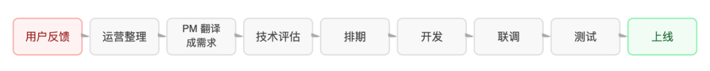

每一次传递都是一次信息衰减。用户说「操作太麻烦了」，运营整理成「简化流程」，PM 写成「减少点击步骤」——最终上线的东西，未必是用户真正想要的。

对抗衰减的方式是反复开会确认：需求评审会、接口对齐会、联调周——这些环节的本质都是在弥补信息在人和人之间传递时产生的损耗。**它们因为人的局限而存在，不是因为问题本身需要它们。**

如果 AI 可以持有整条链路的上下文，用结构化的规格替代口头传递，让信息不再被「翻译」——这些摩擦就不是被优化，而是直接消失。

**零基思维的核心追问只有一句话：这个环节，是因为人的局限而存在的，还是因为问题本身需要它？**

* 前后端需要专门开会「对协议」？——协议何必人来对。

* 需求评审要 PM 和开发来回拉会？——信息对齐何必靠会议。

* 联调阶段要等两侧各自完成再凑在一起跑通？——这段等待是节奏问题，不是技术问题。

如果这些环节都能被 AI 消除，那么问题就不再是"在每个环节装一个 AI 助手来提高效率"——那只是把旧流程加速了一遍。真正的变化在于：**流程本身需要被重新设计。** 当 AI 可以同时持有前后端上下文、持续理解需求意图、自动完成联调验证时，前后端分离的壁垒、人工对齐的传递链、等待联调的时间窗口——这些曾经天经地义的东西，变成了不必要的摩擦。

换句话说：**真正的问题是流程结构，不是执行速度。** 这是"重构"和"插件"的根本区别。

## 结论：从零基思维出发，重建而非嵌入

每一次技术跃迁，都会让一批曾经理所当然的流程变得荒诞。

电话普及之前，企业靠信使传递指令。电子邮件出现后，层层审批的纸质公文成了笑谈。今天 AI 编程能力的爆发，正在以同样的方式审判我们习以为常的研发协作模式——那些因为「人做不到」而设计出来的流程，正在一个接一个地失去存在的理由。

传统研发流程里很多环节，其实都是在补偿人的局限：

* **前后端分离**——一个人很难同时精通两端。

* **接口文档**——沟通成本太高，必须有书面契约。

* **需求评审会**——需求传递链条太长，理解偏差需要人工对齐。

* **联调阶段**——双方开发节奏不同，必须凑在一起跑通。

简单来说：这些环节的存在不是因为问题本身需要它们，而是因为**人做不到才需要它们**。

当 AI 可以同时持有前后端的完整上下文，当需求从提出到开发的时间窗口压缩到分钟级——

>
>
> **追问得出的结论：不是在旧流程里插 AI 工具，而是用 AI 重新定义流程本身。从零基思维出发，端到端地重建。**
>
>

---

## 二、什么是真正的端到端：九阶段全链路

OK 平台是一个 AI 驱动的端到端研发平台，核心理念是「需求即交付」——用户只需提交需求描述，AI Agent 自动走完需求评审→仓库匹配→技术方案→编码→Code Review→部署的全链路。先看数据，再聊怎么做到。

## 真实数据

以下是 OK 平台从 2026 年 4 月下旬上线至 6月的真实运营数据：

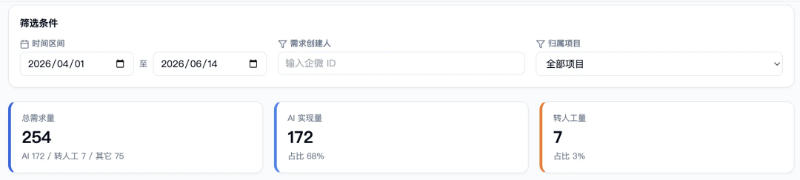▲ OK 平台运营数据概览（2026.04 \~ 2026.06）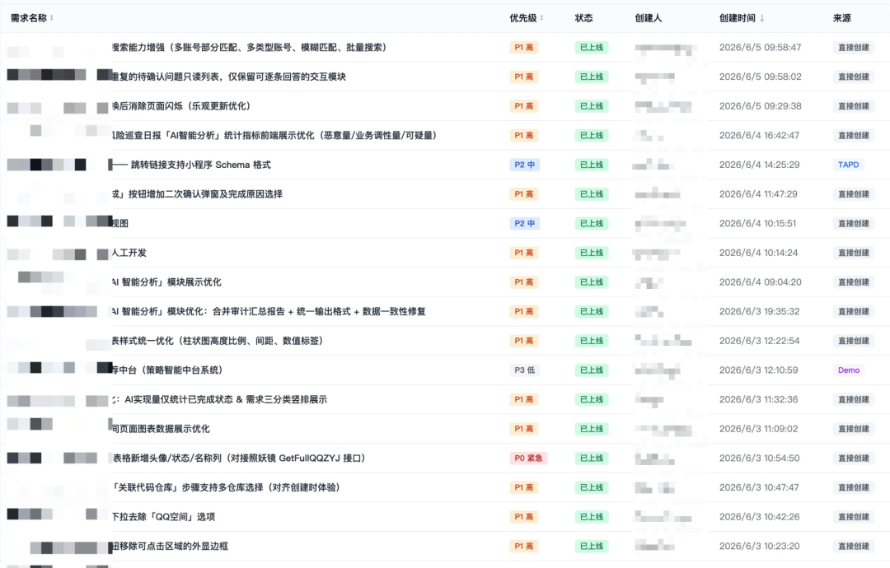▲ OK 平台需求列表

安全中心项目空间 4 月至 6 月共提交 254 条需求，AI 端到端完成 **172 条（68%）**，其余为策略需求或数据需求，或需求超出端到端能力范围，转人工处理。

对比基线：传统模式下，一个简单需求从提出到合并代码，中位耗时 3\~5 个工作日。而 OK 平台上，51% 的需求在 2 小时内完成。**这意味着在人力不变的情况下，团队可以承接更多需求——常规需求由 AI 自动消化后，人得以从重复性开发中抽身，将精力集中在转人工的需求上：那些更复杂、更高风险、也更有价值的策略需求和架构决策。**

这不是一个「AI 写了一点代码」的故事。这是一个「整个研发流程里大多数环节都由 AI 完成」的事实。

## 九阶段全链路

整个流程九个阶段，每个阶段有明确的 AI 角色、输入、输出和质量门：

## 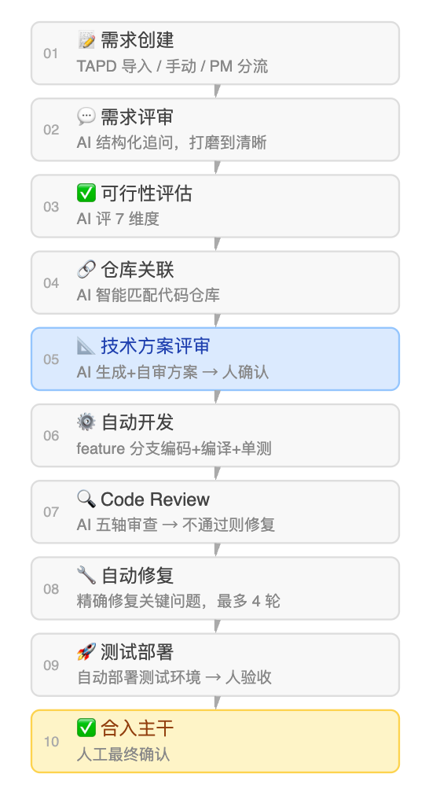

## 三、第一道门：需求质量决定交付成败

AI 开发最大的失败模式是什么？——**需求模糊导致大量返工。** 这条认知反直觉，但真实运营数据反复印证了它：

>
>
> **瓶颈不在开发侧，在需求侧。**
>
>

很多人第一反应是：AI 开发这么快，瓶颈怎么可能在需求侧？

但真实运营下来的规律很清楚：**需求写得多清楚，AI 就能做得多准确；需求描述一旦模糊，哪怕 AI 代码写得再快，最终也是返工。** 需求质量不过关，开发流水线等于在沙地上建楼——跑得越快，返工成本越高。

换句话说：**在 AI 端到端里，「怎么提需求」这件事的权重被大幅放大了。**

但这不意味着需求提出者要变成技术专家、把每个细节都写清楚——这不现实，也不公平。真正的问题是：**如何让 AI 在需求不完整时主动追问补背景，而不是闷头干、最后漏东西。**

## 需求评审 AI 怎么工作

OK 平台的需求评审 AI 用的不是「检查清单式」的完整性校验，而是**访谈式逐层深挖**：

1. **先复述理解**。在任何追问之前，AI 先用自己的话把需求的核心意图重新表述一遍，让提需求的人确认有没有理解偏。这一步看起来简单，却是最高效的纠偏点——大量返工的根源，就是 AI 带着错误的初始理解一路执行到底。

2. **顺着回答继续挖**。不走预设清单式的机械流程，而是基于用户上一轮的回答，挖出回答里新暴露的模糊点。这更接近一个资深 PM 和用户做访谈的方式。

3. **对极模糊需求做发散收敛**。当需求描述模糊到无法判断意图时，AI 会列出 2\~3 种「这个需求可能是想要什么」的合理解释，让用户选择或补充，而不是直接驳回。

4. **区分「必须明确」和「建议明确」**。做什么、为谁做、关键业务规则、验收标准——这四项是放行的必要条件。优先级、异常场景等是建议补充但不强制。

## PM 需求收集池：从想法到开发，一站式

OK 平台为 PM 单独设计了一条需求收集池，独立于端到端开发流水线：

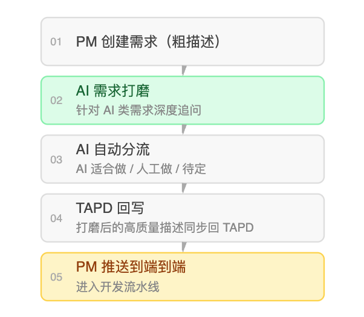

这套流程让 PM 可以提一个很粗的想法，由 AI 负责补全到「可以开发」的质量。把需求变成 AI 可执行的规格，本身就是 AI 能做的事——不需要人来填充每一个细节。

## 什么样的需求会通过可行性评估

平台的可行性评估 AI 对 7 个维度打分（0\~100）：需求清晰度 20%、仓库匹配度 20%、改动范围 15%、技术复杂度 15%、外部依赖 10%、风险等级 10%、交付形态 10%。总分 ≥60 才能进入开发流水线。

简单来说：**不是通关游戏，是保护机制——把注定会在开发阶段卡住的需求拦在上游。**

---

## 四、第二道门：技术方案是质量的前置卡口

>
>
> **方案阶段改方向，成本最低；开发阶段发现方向错了，代价最高。**
>
>

通过需求评审的需求，进入技术方案阶段。这个环节对最终代码质量的影响，是整个链路最大的。

简单来说：**一个好方案不是提纲，是施工图。**

## 方案质量决定开发能不能一次通过

OK 平台技术方案 AI 在生成方案时遵循几条硬纪律：

### 按依赖图排序，不按重要性排序

实现步骤必须按依赖关系自底向上：数据库表 / 存储模型 → 协议 / 接口 → 业务逻辑 → 调用方 / 前端。「先建地基，再建上层」——任何步骤都不能用到尚未在前序步骤中创建的东西。这一点听起来像常识，但大量 AI 生成的方案会按「从重要到次要」排列，结果开发 AI 在执行时频繁撞上「步骤 2 依赖步骤 5 才创建的东西」。

### 垂直切片优先

按一条完整功能路径切分步骤（建表 + 接口 + 最小可用逻辑 = 一个可验证切片），而不是「先把所有表建完、再把所有接口写完」。每个切片完成后系统应处于可编译、可验证的状态。这样开发 AI 每完成一步都能立刻验证，不用等到最后一步才跑通。

### 任务粒度控制

单个实现步骤如果预计触碰超过 5 个文件，或跨 2 个以上独立子系统，必须拆成更细的子步骤。步骤标题里出现「并且 / 同时」，往往意味着它其实是两步。

### 插入检查点

每 2\~3 个步骤后，明确写一个验证节点（「此处应能 `go build ./...` 通过」「此处接口应能跑通基本 CRUD」）。让开发阶段的 AI 有明确的阶段性验证锚点，不会一路闷头跑到最后才发现早期出了问题。

## 对自己的方案做一次找茬

对于方案里的关键决策——跨模块修改、断言编译器无法验证的属性（并发安全 / 幂等 / 不变量）、不可逆变更——技术方案 AI 会在确认前做一次找茬式自审：

>
>
> **站在「假设作者过度自信」的视角：这个方案最可能错在哪？有没有未言明的假设？未处理的边界？**
>
>

价值在于把问题消灭在「方向还便宜修正」的时候。等开发完在代码审查才发现，修复成本高好几倍。

## 待确认的问题提前暴露

方案里不确定的、需要人拍板的点，统一收到「待确认问题」里，按产品 / 技术两类展示。用户在管理端逐题回答（支持选择题和开放题），系统收完答案进入下一轮评审。

>
>
> **不确定的事提前暴露，不让模糊进入开发——这是整条链路质量最核心的原则。**
>
>

---

## 五、让 AI 写代码：手术刀式编码的三条纪律

>
>
> **AI 写代码最大的坑：写得出，但写得不对、写得过度。**
>
>

方案对了不代表代码就对了。从方案到可运行代码之间，有大量细节可以出错。

技术方案经用户确认后，开发 AI 开始在 feature 分支上编码。编译 + 单测 + 创建 MR 通过，才算一次开发结束。几个月运营下来，我们总结了三条硬纪律：

## 纪律一：简单优先，抵抗过度设计

AI 和人一样，有强烈的把事情复杂化的冲动，而且 AI 写代码时更明显——它会为一个只用一次的操作设计一套「通用框架」，为三行逻辑抽象出一个「可扩展的策略模式」。

我们在开发阶段注入了明确的简单优先原则：

* 先写最简单、显而易见正确的版本。

* 写完自问：能不能更少行？这个抽象值不值？

* 三行重复代码，好过一个过早的抽象。

* 只为当前需求写，不为臆想中的未来需求过度设计。

这条原则直接作用于代码审查的通过率。注入「简单优先」约束后，审查中**架构过度复杂类问题出现频次下降了约一半。**

## 纪律二：范围纪律，只碰该碰的

方案里列出了需要改动的文件。开发 AI 必须且只能改动方案列出的文件。

这在纸面上理所当然，实际运行中 AI 非常容易「顺手清理」相邻代码——「这里的命名不规范，顺手改一下」「这个函数可以优化，顺手重构一下」。每一个顺手，都是一个潜在的 bug 引入点，也是代码审查的噪声。

我们加入了「发现但不碰」机制：AI 在开发过程中发现范围外值得改进的点，必须记录到变更摘要的「发现但不碰」部分，而不是自行动手。这样既保留了发现问题的价值，又避免了顺手改出问题的风险。

## 纪律三：关键路径先写测试，再实现

不是所有代码都需要先写测试。但对于核心业务逻辑——新增的判断分支、关键计算、状态流转、幂等逻辑——开发 AI 必须遵循「先写一个会失败的测试 → 再实现使其通过」的顺序。

这不是在追求测试覆盖率数字，而是把验收标准固化成测试。当测试通过时，不是「感觉对了」，而是「确实对了」。

现实中 AI 写的代码，通过 `go build` 很容易，通过单测有时会暴露出真实的逻辑漏洞。约 49 条需求（约 17%）在自动开发阶段经历了超过 1 轮的代码审查 + 修复，其中相当一部分是因为「编译通过但单测失败」而在早期暴露了问题，避免了进入代码审查阶段后更大的返工。

---

## 六、代码审查的正确姿势：改善即批准

>
>
> **审查对象变了，但审查标准没变——AI 写的代码和人的代码，应该用同一套标准审吗？**
>
>

人工审查时代有一个顽疾：追求完美，而非追求改善。每个 Reviewer 都有自己的风格偏好，当审查对象变成 AI 写的代码，这个问题更突出——大量「建议修改」其实是风格差异，不是真实问题。

过度严苛的直接后果是无谓返工。每一轮修复 + 重新审查，都是纯时间成本。

## 改善即批准的判断标准

OK 平台的代码审查 AI 遵循一条明确标准：

>
>
> 当一次变更确实改善了整体代码健康度时就应通过，即使它并不完美。完美的代码不存在，目标是持续改进。不要因为「这不是我会写的风格」就阻塞一个变更。
>
>

问题被严格分为两档：

* **关键问题（必须修复）= 阻塞性问题**：会导致 bug、崩溃、安全漏洞、数据损坏、功能缺失、越权。只有存在这类问题才给「建议修改后合入」。

* **改进建议（建议优化）= 非阻塞性问题**：命名、注释、风格、可选性能优化。只有改进建议时，verdict 必须为「通过」。

这听起来像对质量妥协？实际上不是。**90 分的代码今天上线，在很多场景下优于追求 95 分但多返工两轮、明天才上线。**

## 安全审查是硬底线

在「改善即批准」的基调之外，安全维度没有商量余地。OK 平台的代码审查 AI 对六项做强制核对：

## 1. 用户维度操作的 UID/UIN 是否从登录态获取，而非信任入参（越权防护）

## 2. 新增接口是否正确接入鉴权中间件

## 3. SQL 是否参数化，无字符串拼接

## 4. 敏感信息是否硬编码进了代码或日志

## 5. 外部入参是否在协议边界校验

## 6. 资源访问是否校验归属，防止访问他人数据

这些条目不是建议。命中即为关键问题，必须修复后才能合入。

---

前面四章讲了 AI 怎么做好需求、方案、编码、审查这四件事——需求评审打磨质量、技术方案做对抗自审、编码遵守三条纪律、审查坚持改善即批准。

但一个自然的问题是：

>
>
> **当这四件事都由 AI 完成了，人还做什么？**
>
>

## 七、人在哪介入：决策者而非执行者

做了 AI 端到端，人就没事情可做了——这是一个常见的误解。

实际情况恰好相反：**人的角色没有消失，是升级了——从执行者变成决策者和知识供给者。**

## 人不可替代的四个节点

**决策与方案选型**。当存在多种技术路径时，人来做权衡和选择。AI 可以枚举选项、分析利弊，但「我们的系统更需要可维护性还是性能？这个场景值不值得引入缓存？」这类判断需要人来拍板。

**补充隐性上下文**。架构背景、历史包袱、团队约定、业务逻辑的边界——这些往往存在于人的头脑中，没有写进任何文档。**上下文质量决定输出质量**，这是 AI 研发中最核心的一条规律。给 AI 足够的背景信息，比反复调整 Prompt 更有效。

**异常识别与干预**。当 AI 的行为偏离预期，人来识别并纠正。一个真实的例子：舆情管理端的标签拆分需求，需求描述本身足够清晰，AI 顺利完成了前端显示和后端接口存储的修改——但遗漏了一个关联的巡检 Skill，这个 Skill 也需要同步修改，否则会产生入库 Bug。这个遗漏不是 AI 能力不足，而是它缺乏全局视角，不知道系统里有这个关联。这种类型的问题，需要人在代码审查时识别和补充。

**最终的价值判断**。什么对用户有价值，什么符合产品方向，这些是人类的判断领域。AI 可以高效实现，但「该实现什么」的判断不应该交给 AI。

## 代码 Review 从行级向意图级升级

当 AI 承担了语法、格式、命名规范的检查，人的代码 Review 也在发生质变：

* 不再纠结于「这个变量名是否足够好」，而是关注「这个改动是否准确实现了需求意图」。

* 不再逐行阅读，而是重点审查跨模块交互是否正确、边界条件是否处理、安全影响面是否评估。

* Review 的颗粒度，从行上升到意图。

这才是真正有价值的 Review，是人类判断力无法被替代的部分。

---

## 八、知识飞轮：让平台越用越聪明

端到端 AI 研发有一个传统模式不具备的优势：**每一次交付都在积累，每一次积累都让下一次交付更好。**

但飞轮也有风险——如果老化退场机制没做好，飞轮会变成垃圾循环。过期的知识污染上下文，比没有知识更危险。

## 为什么上下文质量决定输出质量

AI 不像人。它没有上过 100 次项目的经验，也没有在这个仓库里踩过这些坑的记忆。如果每次给 AI 的上下文都是「一张白纸 + 需求描述」，它每次都要从零开始理解系统，就会重复犯同样的错误，忽略相同的边界条件。

知识飞轮要解决的就是这个：把团队过去积累的知识，以结构化的方式注入到 AI 的工作上下文中。

## 四步飞轮

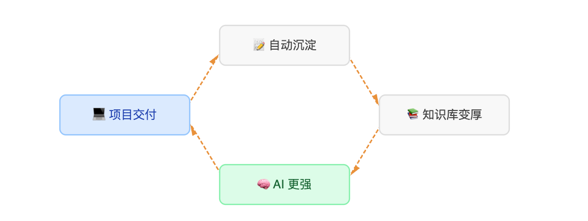

简单来说：**每次交付都在积累，每次积累都在让下一次交付更好。**

当前 OK 平台知识资产分布：

|  类型  |   数量    |
|------|---------|
|技术方案模板|  223 条  |
| 经验复盘 |  111 条  |
| 踩坑记录 |  112 条  |
|PRD 模板|  101 条  |
|**合计**|**547 条**|

近 7 天新增资产 200+ 条，「沉淀飞轮价值（资产 × 复用 × 时效）」指标持续增长。

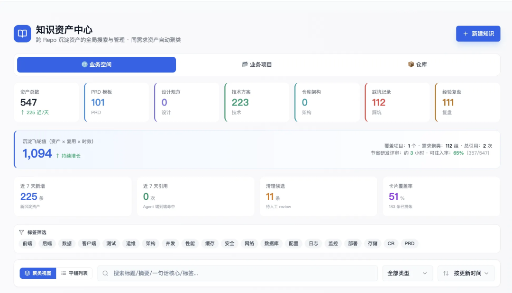▲ OK 平台知识资产中心

## 前置强注入 vs 被动召回

早期的做法是让 AI 需要时自己去查——由 AI 决定是否查、查什么。

问题很明显：**AI 不知道自己不知道什么**，它意识不到「我现在该查一下历史踩坑」。

现在改成平台侧前置强注入：调用 AI 前，平台根据需求类型、仓库、关键词，把最相关的知识打包好直接塞进 AI 的入参。AI 不需要「知道该去查」，相关知识已经在那了。

这一改变将**知识注入率（本次调用注入的相关知识条数 / 相关可注入总条数）**从 Agent 自主决定的不稳定状态，提升到了超过 90% 的确定性覆盖。

## 知识蒸馏：踩过的坑不再踩第二次

每一次需求完成后，平台触发知识蒸馏 AI，把这次交付过程中：

* 代码审查指出的问题 → 沉淀为该仓库的踩坑记录

* 通过的技术方案骨架 → 沉淀为技术方案模板

* 需求评审的问答过程 → 沉淀为 PRD 模板

* 端到端的完整复盘 → 沉淀为经验复盘

知识蒸馏 AI 遵循一条硬原则：**只保留跨需求可复用的结论，丢弃一次性业务细节。** 每条知识有置信度（0\~1），高的直接入库，低的进人工审核。

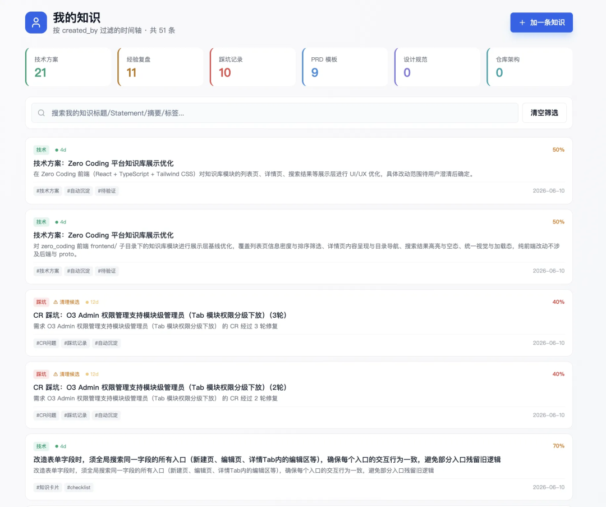▲ OK 平台我的知识库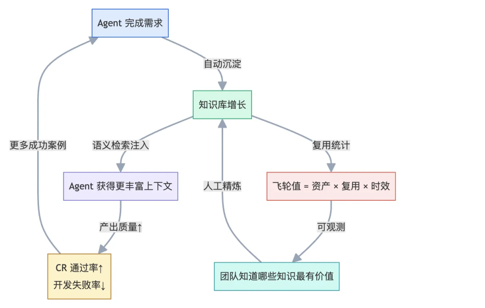▲ OK 平台自主沉淀项目知识：每完成一个需求，协作平台就更强一点，形成良性的组织级飞轮

## 知识老化与退场

知识库最大的风险，是过期的知识污染 AI 上下文。代码在更新，架构在演进，一年前正确的做法，今天可能已经不再适用。

OK 平台用三道防线应对：

1. **TTL（有效期）**：每条知识有设定的有效期，到期自动进入待复核队列，未复核则降低可信度。

2. **Agent 反馈通道**：每个 AI 在工作中如果发现注入的知识与实际代码 / 架构不符，会在输出中填写 `knowledge_feedback`，平台据此自动降低该条知识的置信度或触发人工复核。

3. **仓库知识随代码更新刷新**：代码仓库有新的 commit 合入主干时，仓库架构分析 AI 自动做增量刷新，更新架构描述文档。

这三道防线确保知识库不只是越来越大，而是越来越准。

---

## 九、能力边界：哪些需求适合端到端

>
>
> **端到端 AI 研发不是万能的。清醒认知能力边界，比过度宣扬能力更重要。**
>
>

## 四象限能力分布

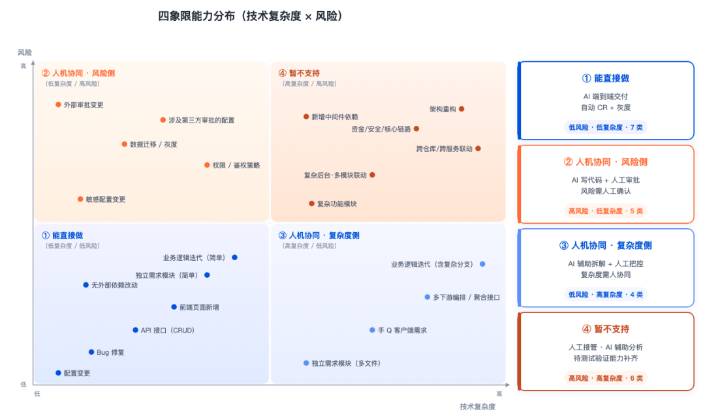▲ OK 平台试点发现：常规需求研发周期从周级提升到小时级，安全中心当前约 30% 的需求可通过 OK 平台开发实现

**象限①（直接做）**：AI 100% 端到端，人只需做最终验收确认。目前这是 OK 平台承接的主体类型，占完成需求的绝大多数。包括 Bug 修复、前端页面的增改、标准 CRUD 接口、简单业务逻辑迭代。

**象限②（人机协同 · 风险侧）**：AI 完成 60\~80% 的编码工作，人负责风险评审和审批流程推进。比如需要 DBA 审批的简单 DDL 变更，AI 出代码 + MR，人负责推进审批。

**象限③（人机协同 · 复杂度侧）**：AI 完成 50\~70% 的编码工作，人负责前期架构决策和模块拆分。比如涉及多文件改动的完整功能模块，人做前期拆解，AI 按方案逐文件实现。

**象限④（暂不支持）**：当前暂不介入端到端，AI 仅辅助分析。涉及资金流、核心安全链路、跨仓库复杂联动的需求，仍需全程人工主导。

## 当前支持与不支持的清单

**支持（直接做）**：

* 标准 RESTful / RPC 接口的增删改查

* 在已有架构上增加或修改业务逻辑

* 配置项变更（增加配置、修改默认值等）

* 明确定位的 Bug 修复

* 纯前端 UI / 交互变更

* 单仓库内闭环的改动

**不支持（当前）**：

* 跨仓库 / 跨服务联动（需要同时修改多个独立仓库）

* 大规模架构重构（目录调整、分层变更）

* 需要接入新中间件（Kafka、ES、新 Redis 集群等）

* 数据库 Schema 重大变更（需 DBA 审批的建表、大批量字段变更）

* 涉及资金 / 支付 / 核心安全链路的改动

* 需要数据迁移或灰度发布的交付形态

能力边界是动态的。随着更多仓库注册接入、AI 能力升级、平台新增自动化环节（如自动申请外部资源），边界会持续扩展。这份清单每月会被回顾和校准。

---

## 十、组织提效：从个人加速到乘数效应

>
>
> **这是本文最想聊的话题，也是 OK 平台和大多数 AI 研效实践最大的差异所在。**
>
>

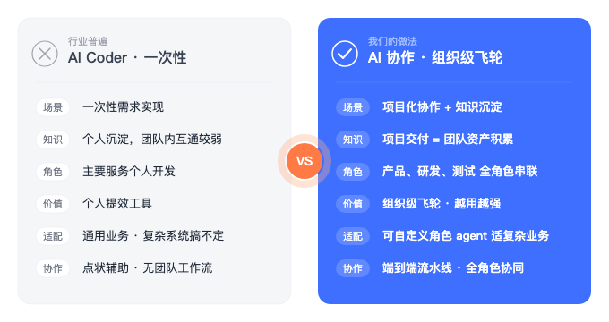▲ 行业普遍：AI Coder 单次执行，用完即弃；OK 平台做法：通过 AI 协作串联各角色，自动化沉淀驱动组织级飞轮

## 个人提效 vs 组织提效——本质区别在哪？

绝大多数 AI 工具提升的是个人效率：我写代码更快了、我查资料更快了、我生成文档更快了。这是**加法效应**——各环节各省一点时间。

组织提效不是做加法，是**消除环节间的等待、沟通和返工成本**——这是乘数效应。

传统流程里，开发等产品澄清需求、测试等开发完成联调——根据我们对多个团队的调研反馈，**角色间等待往往占交付周期的 40\~60%。** 把每个人编码速度提升 50%，也解决不了这个等待问题。但如果 AI 在产品提出需求和研发开始动代码之间，就把需求评审、技术方案、可行性评估都做了呢？等待直接消失。

>
>
> **这就是为什么端到端的提效倍数，远大于单点工具的加总。**
>
>

## 用 Spec 替代口头传递

## 第一章讲了信息衰减的问题。端到端 AI 研发的答案是： 用结构化的 Spec（规格说明）替代口头传递链。

需求评审 AI 产出的精炼需求描述，包含完整的功能点、业务规则、验收标准——这不是给人看的摘要，而是给后续所有 AI 用的精确输入。每一个 AI 都基于同一份 Spec 工作，信息不再被翻译，不再衰减，也不再需要人在各个环节之间做「翻译官」。

这一机制让原本需要会议对齐的内容，变成了结构化数据在流水线上的流转。等待时间不是被压缩了，而是直接消失了。

## 质量门禁前置：把问题消灭在产生时

传统模式下，很多问题是在最后时刻才被发现的——代码审查阶段发现需求理解错了、测试阶段发现接口设计有歧义、上线后发现遗漏了某个关联系统。

端到端 AI 研发把这些发现点前移：

* 需求不清晰 → 需求评审 AI 在进入开发前追问清楚

* 方案有盲区 → 技术方案 AI 在开发前做对抗式自审

* 代码有问题 → 代码审查 AI 在合并前把关

* 历史踩坑 → 知识库在开发前注入

越前期发现的问题，修复成本越低。TAB 实验平台的数据很有说服力（数据来自 TAB 平台团队对外分享材料）：在需求阶段引入 AI 质量检查后，研发周期从 5 天缩短到 2 天（↓60%），额外发现了 30% 的遗漏影响点——这些遗漏如果在开发完成后才发现，代价是现在的数倍。

## 从部门协作到流程协作

传统组织按职能分部门——产品、设计、研发、测试。一个需求要跨多个部门移交，每次移交都有等待和沟通成本。

AI 端到端把协作粒度从「部门」降到了「环节」：

* 不再是「产品写完 PRD 交给研发」，而是「AI 需求评审通过 → 进入技术方案」

* 不再是「研发写完代码交给测试联调」，而是「AI 完成开发+自测 → 自动触发代码审查」

* 每个环节等的是质量门通过，不是某个部门干完活

>
>
> **流程能自动接力时，部门间的摩擦成本自然消失。**
>
>

## 组织知识沉淀：打破「人走知识没」的魔咒

传统团队的痛点：人走了，知识也跟着走。一个资深离职，带走的不仅是技能，还有大量隐性知识——为什么这么设计、那个模块有什么历史包袱、这类需求以前踩过什么坑。

OK 平台的知识飞轮在每次交付中把这些隐性知识显式化、结构化地沉淀下来。**知识不再存在于某人脑子里，而在知识库里——任何 AI 包括服务新人的 AI 都能访问。**

这意味着：

* 新同学通过 OK 平台做第一个需求，可以直接站在团队过去几个月积累的知识上工作

* 资深离职了，他参与的踩坑记录和技术决策仍然留在库里

* 随着时间推移，平台越来越懂这个团队的系统和业务，AI 输出质量持续提升

---

## 十一、行业在哪、我们在哪

做了这么多实践，也值得放到更大的坐标系里看一下：

>
>
> **行业整体在哪里？我们在哪里？差距在哪里？**
>
>

我们对司内 AI 研效项目做了一次系统调研，数据如下：

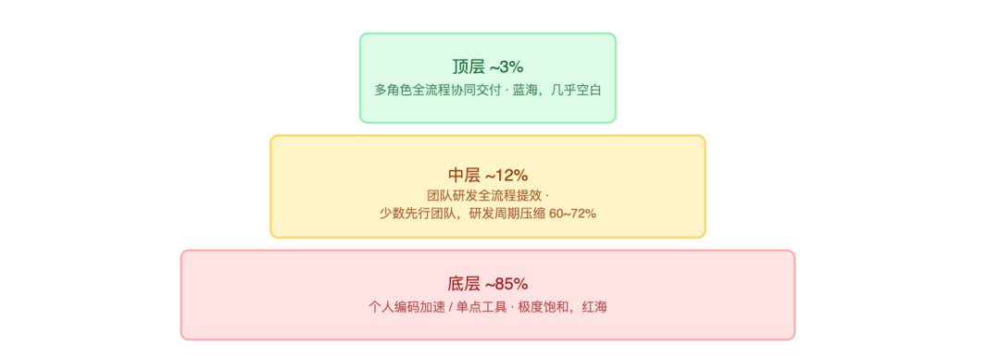
>
>
> **约 85% 的团队，仍停留在「个人编码加速」这一层。**
>
>

## 底层：个人编码加速——红海，且有结构性缺陷

CodeBuddy、Copilot、Cursor 已经把个人编码加速卷到了极致。赛道已是红海。更深层的问题是：

>
>
> **写得快，但改得多。**
>
>

个人编码加速只解决了「编码」这一个环节。需求理解偏差、影响范围遗漏、角色间等待——这些问题没消失，反而因为编码加快暴露得更快。AI 写代码更快了，但需求返工成本可能比以前更高。

## 中层：团队全流程提效——微蓝海，但仍由开发者驱动

少数团队已经把 AI 从编码延伸到了「需求理解 → 开发 → 审查」全链条。数据很亮眼：研发周期压缩 60\~72%，需求理解效率提升约 80%。

但有个共同的局限：**流程起点仍是「研发收到需求」，终点仍是「代码合并」。** 产品侧的需求质量、测试侧验收标准，还得靠人工跨团队协调。

## 顶层：多角色全流程协同——蓝海，几乎空白

真正把产品、研发、测试用 AI 串起来、一站式协同交付的，在司内几乎找不到。AI Meetup 闭门研讨会上管理层有句共识：**「Agent 擅长单任务，跨职能协作仍是信息孤岛。」**

>
>
> **OK 平台的目标就是顶层这 3%。** 目前能做到的是从「一句话需求」到「代码合并+测试环境部署」的全链路自动化，在低复杂度+低风险类型上实现了端到端交付。多角色协同、产品和测试深度接入，正在拓展中。
>
>

这个调研的意义更多是在指明方向——

>
>
> **在「个人编码加速」已经饱和的今天，真正的价值在于能否打通角色间信息壁垒，让 AI 驱动整条链路而非单个节点。**
>
>

---

## 十二、未来：组织形态会跟着变吗

>
>
> **开放性问题，没有确定答案。但有一些正在发生的变化，值得认真想。**
>
>

## 正在发生的变化

🔭Review 的角色正在升维

AI 写代码后，人的 Review 从纠错变成了意图确认。一个懂业务的人，在这种模式下的价值远大于一个只懂语法的人。

🧩全栈化趋势加速

AI 同时持有前后端上下文，让「全栈」从「要求精通两端」变成「人主导业务，AI 补足技术边界」。

👥「特性团队」可行性提升

AI 承担大量执行性工作后，2\~3 人小团队就能覆盖需求→设计→开发→测试→上线的完整链路。

## 未来可能发生什么

以下是基于现有数据和观察的趋势判断：

① **需求提出者和交付物之间的距离会大幅缩短**

「小需求的提出约等于解决」，在工具类需求上已接近现实。产品侧的决策速度和描述质量，会越来越成为研发效能的决定性因素。

② **「协调成本」类岗位的价值会重新定义**

中间层协调角色的工作被 AI 大量替代后，需要承担更高阶的事：知识沉淀、AI 质量监督、边界 case 判断、业务策略。

③ **团队人效会提升，但人不会变少——产出会变多**

更快的交付催生更多迭代，更快的迭代产生更多需求。历史上每次技术革命最终都在提升产出，不只是减少投入。

④ **吃自己的狗粮加速演进**

当工程师用 AI 平台开发 AI 平台的新功能，反馈回路极短。OK 平台本身很多迭代就是在 OK 平台上完成的。

---

## 十三、结语：流程是手段，交付是目的

端到端和零基思维，指向同一个核心：

>
>
> **不要把流程本身当成目标。流程是手段，解决问题才是目的。**
>
>

当 AI 让某个环节变得多余，这个环节就该消失。当 AI 能承接执行层的工作，人就该把精力放到判断和创造上。

回看 OK 平台运营至今的数据——170 条需求端到端自动交付、66% 实现率、51% 在 2 小时内完成、491 条知识资产在积累。这些数字还在涨。

但比数字更重要的是一个变化：

>
>
> **人的角色，从写代码的执行者，变成了提方向的决策者和积累知识的供给者。**
>
>

这种转变不只是提效，是在重新定义「研发工作」的价值创造方式。

在 AI 已经足够强大的今天——

从零基思维出发，端到端地重建。

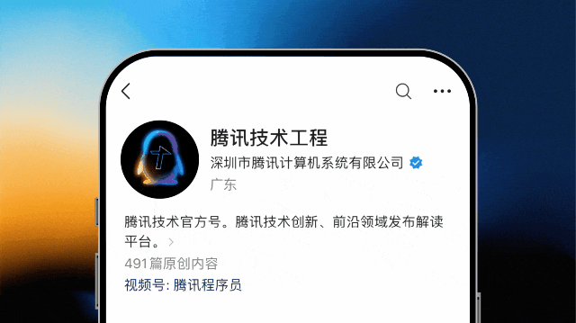

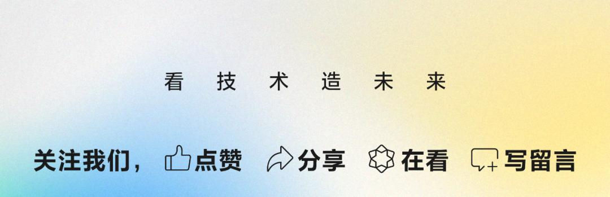

